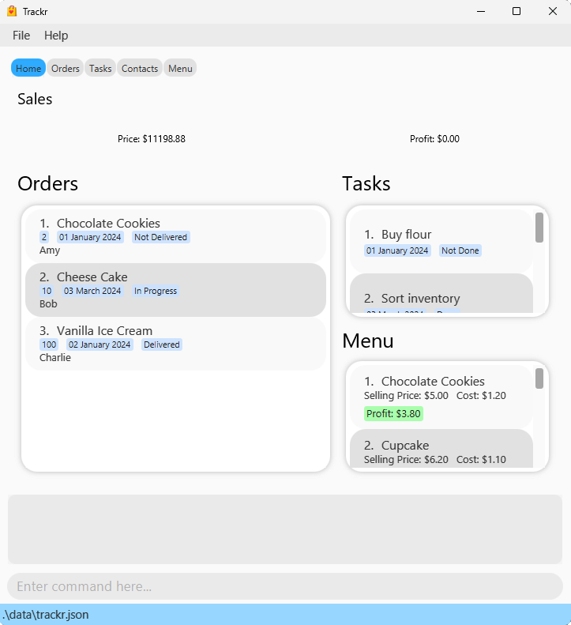
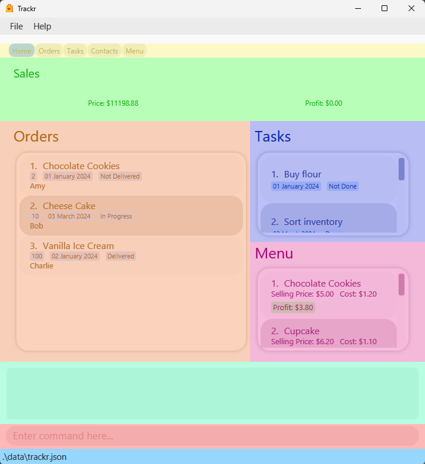
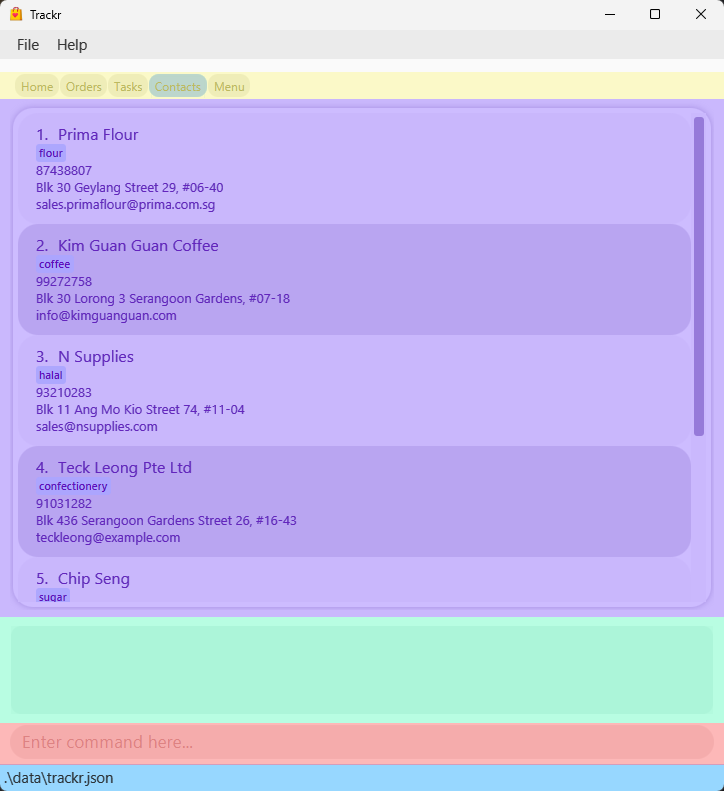
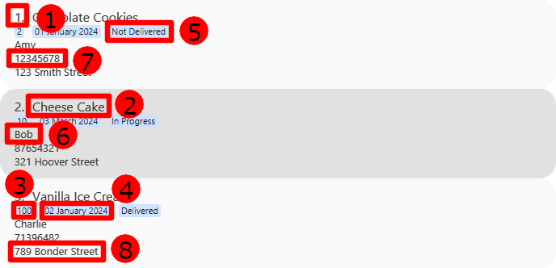
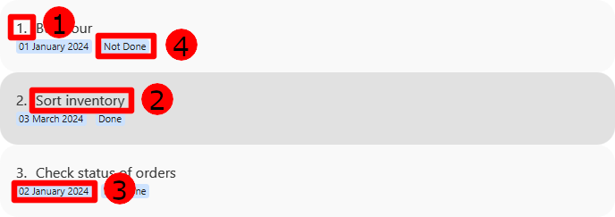
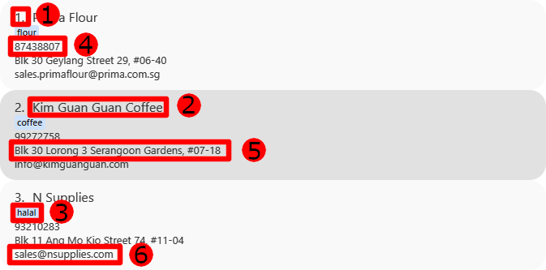
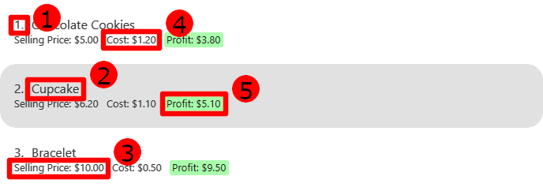
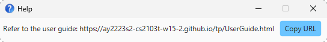
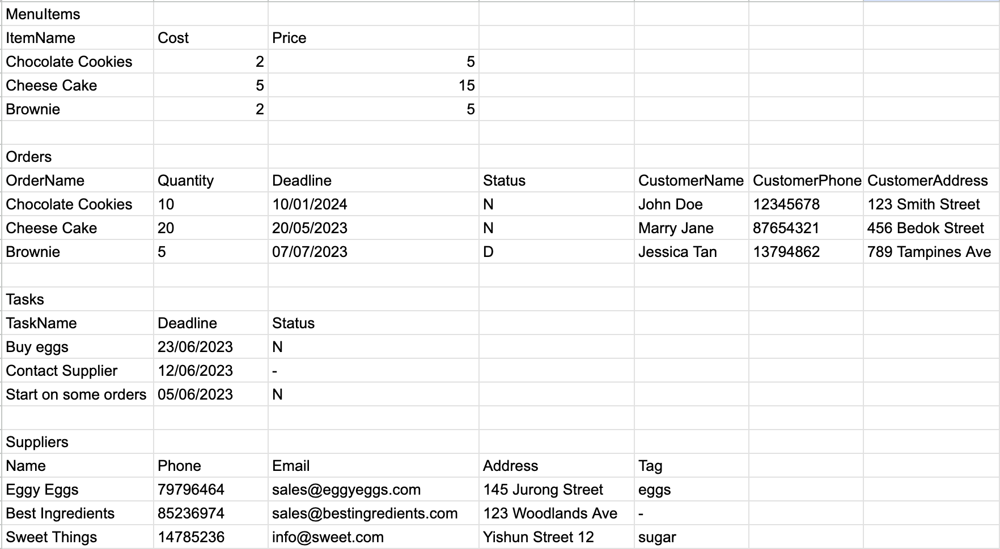

# Overview

Introducing **Trackr - the ultimate desktop application** designed to simplify the delivery management process for your home business!

With Trackr, you can seamlessly manage your suppliers, orders and tasks.

It utilizes a Command Line Interface (CLI), while still enjoying the benefits of a user-friendly Graphical User Interface (GUI).

Say goodbye to the hassle of Excel and the stress of time constraints! Whether you're a busy home business owner or simply looking for an efficient and streamlined solution, Trackr is the perfect fit for you.
Experience the convenience of delivery management like never before with Trackr.

# About This Guide

This guide shows you the relevant information for setting up and using Trackr to manage your suppliers, orders and tasks.

You can click on any of the links below to navigate to the respective sections for more information.

# Table of Contents

<!-- TOC -->
* [1 Quick start](#1-quick-start)
  * [1.1 Prerequisites](#11-prerequisites)
    * [1.1.1 Java](#111-java)
    * [1.1.2 Glossary](#112-glossary)
  * [1.2 Installation](#12-installation)
  * [1.3 Utilisation](#13-utilisation)
  * [1.4 Navigating the User Interface](#14-navigating-the-user-interface)
    * [1.4.1 Home Page](#141-home-page)
    * [1.4.2 Data Tab](#142-data-tab)
* [2 Commands](#2-commands)
  * [2.0 Checking for duplicates](#20-checking-for-duplicates)
  * [2.1 Add](#21-add)
    * [2.1.1 Adding a supplier: `add_supplier`](#211-adding-a-supplier-add_supplier)
    * [2.1.2 Adding an order: `add_order`](#212-adding-an-order-add_order)
    * [2.1.3 Adding a task: `add_task`](#213-adding-a-task-add_task)
    * [2.1.4 Adding a menu item: `add_item`](#214-adding-a-menu-item-add_item)
  * [2.2 Edit](#22-edit)
    * [2.2.1 Editing a supplier: `edit_supplier`](#221-editing-a-supplier-edit_supplier)
    * [2.2.2 Editing an order: `edit_order`](#222-editing-an-order-edit_order)
    * [2.2.3 Editing a task: `edit_task`](#223-editing-a-task-edit_task)
    * [2.2.4 Editing a menu item: `edit_item`](#224-editing-a-menu-item-edit_item)
  * [2.3 Find](#23-find)
    * [2.3.1 Finding a supplier: `find_supplier`](#231-finding-a-supplier-find_supplier)
    * [2.3.2 Finding an order: `find_order`](#232-finding-an-order-find_order)
    * [2.3.3 Finding a task: `find_task`](#233-finding-a-task-find_task)
    * [2.3.4 Finding a menu item: `find_item`](#234-finding-a-menu-item-find_item)
  * [2.4 Delete](#24-delete)
    * [2.4.1 Deleting a supplier: `delete_supplier`](#241-deleting-a-supplier-delete_supplier)
    * [2.4.2 Deleting an order: `delete_order`](#242-deleting-an-order-delete_order)
    * [2.4.3 Deleting a task: `delete_task`](#243-deleting-a-task-delete_task)
    * [2.4.4 Deleting a menu item: `delete_item`](#244-deleting-a-menu-item-delete_item)
  * [2.5 Sort](#25-sort)
    * [2.5.1 Sorting a task: `sort_task`](#251-sorting-a-task-sort_task)
    * [2.5.2 Sorting a order: `sort_order`](#252-sorting-a-order-sort_order)
  * [2.6 List](#26-list)
    * [2.6.1 Listing all suppliers: `list_supplier`](#261-listing-all-suppliers-list_supplier)
    * [2.6.2 Listing all orders: `list_order`](#262-listing-all-orders-list_order)
    * [2.6.3 Listing all tasks: `list_task`](#263-listing-all-tasks-list_task)
    * [2.6.4 Listing all menu items: `list_menu`](#264-listing-all-menu-items-list_menu)
  * [2.7 Clear](#27-clear)
    * [2.7.1 Clear all supplier entries: `clear_supplier`](#271-clear-all-supplier-entries-clear_supplier)
    * [2.7.2 Clear all order entries: `clear_order`](#272-clear-all-order-entries-clear_order)
    * [2.7.3 Clear all task entries: `clear_task`](#273-clear-all-task-entries-clear_task)
    * [2.7.4 Clear all menu item entries: `clear_menu`](#274-clear-all-menu-item-entries-clear_menu)
  * [2.8 Switch](#28-switch)
    * [2.8.1 Switching tabs: `tab`](#281-switching-tabs-tab)
  * [2.9 Others](#29-others)
    * [2.9.1 Viewing help: `help`](#291-viewing-help-help)
    * [2.9.2 Uploading a csv file](#292-uploading-a-csv-file)
    * [2.9.3 Exiting the program: `exit`](#293-exiting-the-program-exit)
* [3 Data](#3-data)
  * [3.1 Saving of data](#31-saving-of-data)
  * [3.2 Editing the data file](#32-editing-the-data-file)
* [4 Upcoming features `[coming soon]`](#4-upcoming-features-coming-soon)
* [5 FAQ](#5-faq)
* [6 Summary](#6-summary)
* [6.1 Prefix Summary](#61-prefix-summary)
  * [6.2 Command Summary](#62-command-summary)
<!-- TOC -->

--------------------------------------------------------------------------------------------------------------------
<div style="page-break-after: always;"></div>

# 1 Quick start

## 1.1 Prerequisites

### 1.1.1 Java

Ensure you have <ins>[Java `11`](https://www.oracle.com/sg/java/technologies/javase/jdk11-archive-downloads.html)</ins> or above installed.
Java is the language that your computer uses to understand Trackr.

<div markdown="block" class="alert alert-tip">

:bulb: **Tip**

**How to check your current Java version:**

**Step 1.** Open up **Command Prompt** (Windows) or **Terminal** (Mac and Linux).

**Step 2.** Type and run the command `java -version`.

**Step 3.** Check the version number provided (`xxx`) is at least `11`.

An example is shown below.

  ```
  > java -version
  java version "xxx" <Other information>
  ```

</div>

### 1.1.2 Glossary

* **Mainstream OS**: Windows, Linux, Mac
* **CLI**: Command-Line Interface
* **GUI**: Graphical User Interface
* **Supplier**: Supplier refers to someone whom the user seasonally or frequently orders goods from
* **Customer**: Customer refers to someone whom the user receives an order from
* **Order**: Order refers to the customers' orders the user accepts
* **Task**: Task refers to any to-dos the user may have, it need not be related to suppliers or orders (For instance, it can be about tidying inventory)
* **Menu Item**: Menu Item refers to any inventory/ stock that the user is selling to customers.
* **Tag**: Tags are associated with suppliers, users can tag the supplier with any keyword they want, number of tags are not restricted
* **Status**: Statuses are associated with tasks and orders, one entry of task/order can only have one status and the type of status that can be added is restricted

## 1.2 Installation

**Step 1.** Download the latest `trackr.jar` file from [here](https://github.com/AY2223S2-CS2103T-W15-2/tp/releases).

**Step 2.** Copy the file to the folder where you will use Trackr.

**Step 3.** Double-click on the `trackr.jar` file.

<div markdown="block" class="alert alert-tip">

:bulb: **Tip**

**Trackr does not open?**

**Step 1.** Open a command terminal.

**Step 2.** Type in `java -jar ` (Keep in mind of the space at the end).

**Step 3.** Drag and drop `trackr.jar` into the command terminal.

**Step 4.** Press enter and execute the command.

An example of the final command is displayed below.

  ```
  > java -jar xxxx/xxxx/trackr.jar
  ```

</div>

A GUI similar to the below should appear in a few seconds.

<p align="center">
  
  <br>Figure 1.2.1: Home Tab UI
</p>

The UI has the following areas:

* <span style="background-color:rgba(252.4, 248.4, 124.1, 0.5)">Tabs</span>
* <span style="background-color:rgba(0.0, 255.0, 0.0, 0.5)">Sales (Total Revenue and Profit)</span>
* <span style="background-color:rgba(246.2, 149.6, 28.3, 0.5)">Simplified Orders</span>
* <span style="background-color:rgba(8.7, 68.0, 237.2, 0.5)">Simplified Tasks</span>
* <span style="background-color:rgba(237.2, 8.7, 176.5, 0.5)">Simplified Menu</span>
* <span style="background-color:rgba(0.0, 255.0, 197.0, 0.5)">Command Result Screen</span>
* <span style="background-color:rgba(255.0, 0.0, 0.0, 0.5)">Command Input Box</span>
* <span style="background-color:rgba(128.9, 0.0, 255.0, 0.5)">Data List</span>

For more information on how to navigate the User Interface (UI), you can go [here](#14-navigating-the-user-interface)

<p align="center">
  
  <br>Figure 1.2.2: Labeled Home Tab UI
</p>

<p align="center">
  
  <br>Figure 1.2.3: Labeled Data Tab UI
</p>

<div markdown="block" class="alert alert-warning">

:warning: **Warning**<br>

When you open the application for the first time on your device, `Trackr` will create a `data` folder with `trackr.json` data file inside.

If you are a _new_ user, do not edit this file.

Otherwise, you can check out how to edit it [here](#32-editing-the-data-file)

</div>

## 1.3 Utilisation

**Step 1:** Enter your command into the <span style="background-color:rgba(255.0, 0.0, 0.0, 0.5)">Command Input Box</span>.

You can try the following commands to add a task:

* `tab t/TASKS`
* `add_task n/Buy eggs d/12/12/2040`

**Step 2:** Observe the changes made to the Task list. Look at the message displayed inside the <span style="background-color:rgba(0.0, 255.0, 197.0, 0.5)">Command Result Screen</span> to see the results of your command.

<div markdown="block" class="alert alert-tip">

:bulb: **Tip**

You can find out all the usable commands [here](#2-commands) or return to the [Table of Contents](#table-of-contents) to find your desired command.

</div>

## 1.4 Navigating the User Interface

Here, we will explain how you can navigate around our application.

**<span style="background-color:rgba(255.0, 0.0, 0.0, 0.5)">Command Input Box</span>**

You can input your commands into the command input box, press **Enter** to execute your commands. A result message would be shown at the <span style="background-color:rgba(0.0, 255.0, 197.0, 0.5)">Command Result Screen</span>.

If there is an error with the command, the input would turn **<span style="color:red">red</span>** and you can refer to the <span style="background-color:rgba(0.0, 255.0, 197.0, 0.5)">Command Result Screen</span> for help.

**<span style="background-color:rgba(0.0, 255.0, 197.0, 1)">Command Result Screen</span>**

Command result screen shows the success message for your command that executed successfully.

Otherwise, it would show an error message with hints on what was missing / invalid in the command that you have entered.
Refer to the error message or look back at this User Guide for more information on how to correct your command input. 

**<span style="background-color:rgba(252.4, 248.4, 124.1, 1)">Tabs</span>**

We provide multiple tabs for you to use. This includes the home page, with the data tabs that display your data for the respective information (i.e. Order, Tasks, Contacts, Menu).

You can navigate between them by clicking on the tab itself, or input the command `tab t/` followed with the respective tab name.

For more information about the `tab` command, you can go [here](#281-switching-tabs-tab).

### 1.4.1 Home Page

Upon starting the application, you will see a convenient dashboard with summarised information that you need for your business.

**<span style="background-color:rgba(0.0, 255.0, 0.0, 0.5)">Sales (Total Revenue and Profit)</span>**

Trackr keeps track of all orders submitted and automatically updates the total revenue and profit that your business has generated with us.

**<span style="background-color:rgba(246.2, 149.6, 28.3, 0.5)">Simplified Orders</span>**

Order list shows a condensed preview of your outstanding orders, with their relevant details (i.e. customer name, promised delivery date and your progress).

**<span style="background-color:rgba(8.7, 68.0, 237.2, 0.5)">Simplified Tasks</span>**

Task list shows all outstanding miscellaneous tasks that you may have for your current operations.

**<span style="background-color:rgba(237.2, 8.7, 176.5, 0.5)">Simplified Menu</span>**

Menu list shows all the items that you have up for sale currently, with their details (cost price, selling price and profit margin) at a glance.

### 1.4.2 Data Tab

**<span style="background-color:rgba(128.9, 0.0, 255.0, 0.5)">Data List</span>**

Data list contains all of your respective data labelled out in full. The layout of the respective data information can be seen below:

* Orders

`Orders` contains order information, with their data represented by their respective cards.

Order Card consists of the following components:

1. Index of the order
2. Name of the order item (which should correspond to its respective Menu item name)
3. Quantity of order item
4. Deadline for delivery of the order
5. Status of the order item
6. Customer name
7. Customer phone number
8. Customer address

<p align="center">
  
  <br>Figure 1.4.2.1: Labeled Order Card
</p>

* Tasks

`Tasks` contains task information, with their data represented by their respective cards.

Task Card consists of the following components:

1. Index of the task
2. Name of the task 
3. Deadline of the task
4. Status of the task

<p align="center">
  
  <br>Figure 1.4.2.2: Labeled Task Card
</p>

* Contacts

`Contacts` contains supplier information, with their data represented by their respective cards.

Supplier Contact Card consists of the following components:

1. Index of the supplier
2. Name of the supplier
3. Tags related to the supplier
4. Phone number of the supplier
5. Address of the supplier
6. Email of the supplier

<p align="center">
  
  <br>Figure 1.4.2.3: Labeled Supplier Card
</p>

* Menu

`Menu` contains menu items, with their data represented by their respective cards.

Menu Item Card consists of the following components:

1. Index of the menu item
2. Menu item name
3. Selling price of the menu item
4. Cost of making the menu item
5. Profit from selling the menu item (Profit = Selling Price - Cost)

<p align="center">
  
  <br>Figure 1.4.2.4: Labeled Menu Card
</p>

--------------------------------------------------------------------------------------------------------------------

# 2 Commands

<div markdown="block" class="alert alert-info">

:information_source: **Notes about the command format:**

* All command keywords must be in lower-case and are case-sensitive.<br>
  e.g. For add supplier command:<br>
  :heavy_check_mark: `add_supplier` is valid.<br>
  :x: `ADD_SUPPLIER` and `Add_Supplier` are invalid.<br>

* Prefixes of the parameters must be in lower-case and are case-sensitive.<br>
  e.g. `n/` in `add_s n/NAME` is case-sensitive<br>
  :heavy_check_mark: `n/` is a valid prefix.<br>
  :x: `N/` is an invalid prefix.<br>

* Words in `UPPER_CASE` are the parameters to be supplied by you.<br>
  e.g. in `add_supplier n/NAME`, you fill in the `NAME` parameter with the supplier name (i.e. `add_supplier n/John Doe`).

* Items in square brackets are optional.<br>
  e.g. `n/NAME [t/TAG]` can be used as `n/John Doe t/friend` or as `n/John Doe`.

* Items with `…​` after them can be used any number of times within the command.<br>
  e.g. `[t/TAG]…​` can be used as ` ` (omitted), `t/flour`, `t/flour t/sugar` etc.

* Parameters can be in any order.<br>
  e.g. if the command specifies `n/NAME p/PHONE_NUMBER`, `p/PHONE_NUMBER n/NAME` is also acceptable.

* If a parameter is expected only once in the command, but you specified it multiple times, only the **last** occurrence of the parameter will be taken.<br>
  e.g. if you specify `p/12341234 p/56785678`, only `p/56785678` will be taken.

* Extraneous parameters will be ignored.<br>
  e.g. if the command specifies `help 123`, it will be interpreted as `help`.

</div>

<div markdown="block" class="alert alert-tip">

:bulb: **Tip**

* General format of commands:<br>
  <div style="background-color:silver; font-weight:bold">
  <span style="color:darkblue">&lt;command&gt;</span>
  <span> </span>
  <span style="color:indigo">&lt;index&gt;</span>
  <span> </span>
  <span style="color:brown">&lt;prefix/paramater&gt; &lt;prefix/paramater&gt; ...</span>
  </div>
  
  * Index depends on the command.
  * Number of parameters depend on the command.

* All command keywords have shortcut alternatives. They are the command type and the first letter of the information type.<br>
  For example:<br>
  * `add_s` is the same as `add_supplier`
  * `edit_o` is the same as `edit_order`
  * `list_t` is the same as `list_task`

* You can find out the constraints for the parameters with their corresponding prefix [here](#61-prefix-summary).

</div><br>

## 2.0 Checking for duplicates

Duplicate data are not allowed. Hence, adding of duplicate data or editing of an existing data such that it matches
with another existing data in the data list will not be successful. Here's how we check for duplicates:

| Any two     | are considered to be duplicates if                                          |
|-------------|-----------------------------------------------------------------------------| 
| Suppliers   | they have the same phone numbers                                            |
| Orders      | all the parameters (excluding `STATUS`) are the same (with matching cases). |
| Tasks       | they have the same task names (case-insensitive) and deadlines.             |
| Menu items  | they have the same item names (with matching cases).                        |

## 2.1 Add

Adding of an information to the specific list. Below are the specific add commands for supplier, order, task and menu item.

:pencil2: Adding of duplicate data is not allowed. Refer to this [table](#20-checking-for-duplicates) to see how duplicates are checked for.

### 2.1.1 Adding a supplier: `add_supplier`

Adds a supplier to the list of suppliers.

:information_source: **Information**

Syntax: `add_supplier n/NAME p/PHONE_NUMBER e/EMAIL a/ADDRESS [t/TAG]…​`

<div markdown="block" class="alert alert-example">

:clipboard: **Example 1: Standard command without tags**

* `add_supplier n/John Doe p/98765432 e/johnd@example.com a/John Street`<br>
  Adds a supplier with the following details:
  * Supplier Name: `John Doe`
  * Phone Number: `98765432`
  * Email: `johnd@example.com`
  * Address: `John Street`
  * Tags: Empty

:clipboard: **Example 2: Shortcut command with tags**

* `add_s n/Betsy Cow t/diary e/betsycow@example.com a/Betsy Street p/12345678 t/meat`<br>
  Adds a supplier with the following details:
  * Supplier Name: `Betsy Cow`
  * Phone Number: `12345678`
  * Email: `betsycow@example.com`
  * Address: `Betsy Street`
  * Tags: `Diary`, `Meat`

</div>

### 2.1.2 Adding an order: `add_order`

Adds an order into the list of orders.

Syntax: `add_order on/ORDER_ITEM q/QUANTITY d/DEADLINE n/CUSTOMER_NAME a/CUSTOMER_ADDRESS p/CUSTOMER_PHONE_NUMBER s/STATUS`

<div markdown="block" class="alert alert-tip">

:information_source: **Information**

* Statuses available for setting are
  * `N` or `n` for `Not Delivered`
  * `I` or `i` for `In Progress`
  * `D` or `d` for `Delivered`
* A status must be provided.

* All `ORDER_ITEM` **must** match (case-sensitive) a menu item in the menu. (e.g. `choclate` and `Chocolate` are considered different items).<br>
  i.e. If `ORDER_ITEM` does not match any of the existing menu items, you need to add it as a menu item first.<br>
  You can find out how to add a menu item [here](#214-adding-a-menu-item-add_item)

</div>

<div markdown="block" class="alert alert-example">

:clipboard: **Example 1: Standard command without status**

* `add_order on/Cupcake q/5 d/01/12/2024 n/John Cat p/91234567 a/John Street s/N`<br>
  Adds an order with the following details:
  * Order Item: `Cupcake`
  * Quantity: `5`
  * Deadline: `01/12/2024`
  * Name: `John Cat`
  * Phone Number: `91234567`
  * Address: `John Street`
  * Status: `Not Delivered`

:clipboard: **Example 2: Shortcut command with status**

* `add_o on/Chocolate Cookies q/10 d/02/10/2024 n/Dolly Sheep p/91827364 a/Dolly Street s/I`<br>
  Adds a supplier with the following details:
  * Order Item: `Chocolate Cookies`
  * Quantity: `10`
  * Deadline: `02/10/2024`
  * Name: `Dolly Sheep`
  * Phone Number: `91827364`
  * Address: `Dolly Street`
  * Status: `In Progress`

</div>

### 2.1.3 Adding a task: `add_task`

Adds a task to the list of tasks.

Syntax: `add_task n/TASK_NAME d/DEADLINE [s/STATUS]`

<div markdown="block" class="alert alert-tip">

:information_source: **Information**

* Statuses available for setting are
  * `N` or `n` for `Not Done`
  * `D` or `d` for `Done`
* If no status is provided, it is **defaulted** to `Not Done`.

</div>

<div markdown="block" class="alert alert-example">

:clipboard: **Example 1: Standard command without status**

* `add_task n/Buy cookie cutter d/22/12/2024`<br>
  Adds a task with the following details:
  * Task Name: `Buy cookie cutter`
  * Deadline: `22/12/2024`
  * Status: `Not Done` (Default)

:clipboard: **Example 2: Shortcut command with status**

* `add_t n/Buy a card d/23/12/2024 s/D`<br>
  Adds a task with the following details:
  * Task Name: `Buy a card`
  * Deadline: `23/12/2024`
  * Status: `Done`

</div>

### 2.1.4 Adding a menu item: `add_item`

Adds a menu item to the menu.

Syntax: `add_item n/ITEM_NAME pr/PRICE c/COST`

<div markdown="block" class="alert alert-tip">

:information_source: **Information**

* When entering price and cost values, you may choose to
  1. input **positive** integer numbers
  2. input **positive** decimal numbers (up to 2 decimal point). For example:<br>
     :heavy_check_mark: `5.1` or `5.03`<br>
     :x: `5.034`

* The item can have a positive or negative profit (Profit = Price - Cost). Specifically:
  * Negative profit margin means you are making a **loss**
  * Positive profit margin means you are making a **profit**
* Note that profit calculated is only accurate when price and cost each have at most 16 digits.
  * For example: 9283212222332323 and 92832122223323.55 are both 16 digits.
* You cannot add an item if there is another item that has the same name in the menu. The item name is case-sensitive.
  * For example, chocolate and Chocolate are considered as different item.


</div>

<div markdown="block" class="alert alert-example">

:clipboard: **Example 1: Standard command with integer values**

* `add_item n/Chocolate cake pr/5 c/2`<br>
  Adds an order item with the following details:
  * Item Name: `Chocolate cake`
  * Price: `5`
  * Cost: `2`

:clipboard: **Example 2: Shortcut command with decimal values**

* `add_i n/Limited Time Strawberry Cake pr/20.55 c/25.2`<br>
  Adds an order item with the following details:
  * Item Name: `Limited Time Strawberry Cake`
  * Price: `20.55`
  * Cost: `25.2`

</div><br>

## 2.2 Edit

Editing of an information in a specific list. Below are the specific edit commands for supplier, order, task and menu item.

<div markdown="block" class="alert alert-tip">

:information_source: **Information**

* Edits the information at the specified `INDEX`.
* The `INDEX` **must be a positive integer** 1, 2, 3, …​
* All existing values will be replaced with the new values given.
* At least one of the fields (e.g. `n/NAME`) must be specified.
* Editing of a data such that it matches with another existing data is not allowed. Check [this table](#20-checking-for-duplicates) to see how duplicates are checked for.

</div>

<div markdown="span" class="alert alert-danger">

:exclamation: **Danger**<br><br>

Editing of information is one-way (i.e. You cannot revert your command).<br>

We are working to have an undo feature in the future. Sorry for the inconvenience caused.

</div>

### 2.2.1 Editing a supplier: `edit_supplier`

Edits an existing supplier’s information.

Syntax: `edit_supplier INDEX [n/NAME] [p/PHONE] [e/EMAIL] [a/ADDRESS] [t/TAG]…​`

<div markdown="block" class="alert alert-tip">

:information_source: **Information**

* When editing tags:
  * All existing tags will be replaced with the given tag (editing of tags is not accumulative).
  * Typing `t/` removes all the existing tags.

</div>

<div markdown="block" class="alert alert-example">

:clipboard: **Example 1: Standard command removing tags**

* `edit_supplier 1 n/Johnny p/90138482 t/`<br>
  Edits the **first** supplier information (shown on screen) with the following details:
  * Supplier Name: `Johnny`
  * Phone Number: `90138482`
  * Tags: Empty

:clipboard: **Example 2: Shortcut command replacing tags**

* `edit_s 3 t/Supplies Flour e/mark@example.com`<br>
  Edits the **third** supplier information (shown on screen) with the following details:
  * Email: `mark@example.com`
  * Tags: `Supplies Flour`

</div>

### 2.2.2 Editing an order: `edit_order`

Edits an existing order’s information.

Syntax: `edit_order INDEX [on/ORDER_ITEM] [q/QUANTITY] [d/DEADLINE] [n/CUSTOMER_NAME] [a/CUSTOMER_ADDRESS] [p/CUSTOMER_PHONE_NUMBER] [s/STATUS]`

<div markdown="block" class="alert alert-tip">

:information_source: **Information**

* If a menu item is no longer your menu (i.e. you have deleted the menu item), the order details cannot be edited.

* Statuses available for setting are
  * `N` or `n` for `Not Delivered`
  * `I` or `i` for `In Progress`
  * `D` or `d` for `Delivered`
* When editing the order name, the input for order name is case-sensitive.
  * For example, if menu item you want edit order name to "chocolate", you should input `edit_o 1 on/chocolate` and not `edit_o 1 on/ChOcolAte`

</div>

<div markdown="block" class="alert alert-example">

:clipboard: **Example 1: Standard command**

* `edit_order 1 p/91234567 d/05/05/2024`<br>
  Edits the **first** order information (shown on screen) with the following details:
  * Customer Phone Number: `91234567`
  * Deadline: `05/05/2024`

:clipboard: **Example 2: Shortcut command updating status**

* `edit_o 3 q/20 s/I`<br>
  Edits the **third** order information (shown on screen) with the following details:
  * Quantity: `3`
  * Status: `In Progress`

</div>

### 2.2.3 Editing a task: `edit_task`

Edits an existing task’s information.

Syntax: `edit_task INDEX [n/TASK_NAME] [d/DEADLINE] [s/STATUS]`

<div markdown="block" class="alert alert-tip">

:information_source: **Information**

* Statuses available for setting are
  * `N` or `n` for `Not Done`
  * `D` or `d` for `Done`

</div>

<div markdown="block" class="alert alert-example">

:clipboard: **Example 1: Standard command**

* `edit_task 1 n/Get creamer`<br>
  Edits the **first** task information (shown on screen) with the following details:
  * Task Name: `Get creamer`

:clipboard: **Example 2: Shortcut command updating status**

* `edit_t 3 d/31/12/2024 s/N`<br>
  Edits the **third** task information (shown on screen) with the following details:
  * Deadline: `31/12/2024`
  * Status: `Not Done`

</div>

### 2.2.4 Editing a menu item: `edit_item`

Edits an existing menu item’s information.

Syntax: `edit_item INDEX [n/ITEM_NAME] [pr/PRICE] [c/COST]`

<div markdown="block" class="alert alert-tip">

:information_source: **Information**

* Editing a menu item does not invalidate or update the orders with the same order item name.
* Editing a menu item does not update and change the total revenue and profits on the home tab.

* When entering price and cost values, you may choose to
  1. input **positive** integer numbers
  2. input **positive** decimal numbers (up to 2 decimal point). For example:<br>
     :heavy_check_mark: `5.1` or `5.03`<br>
     :x: `5.034`

* The item can have a positive or negative profit margin (Profit Margin = Price - Cost). Specifically:
  * Negative profit margin means you are making a **loss**
  * Positive profit margin means you are making a **profit**
* Note that profit calculated is only accurate when price and cost each have at most 16 digits.
  * For example: 9283212222332323 and 92832122223323.55 are both 16 digits.


</div>

<div markdown="block" class="alert alert-example">

:clipboard: **Example 1: Standard command with integer values**

* `edit_item 1 n/Coffee pr/2 c/1`<br>
  Edits the **first** menu item information with the following details:
  * Item Name: `Coffee`
  * Price: `2`
  * Cost: `1`

:clipboard: **Example 2: Shortcut command with decimal values**

* `edit_i 3 d/Signature burger p/8.5 c/2.25`<br>
  Edits the **third** menu item information with the following details:
  * Item Name: `Signature burger`
  * Price: `8.5`
  * Cost: `2.25`

</div><br>

## 2.3 Find

Finding of specific information with the provided parameters. Below are the specific find commands for supplier, order, task and menu item.

### 2.3.1 Finding a supplier: `find_supplier`

Finds suppliers whose information matches with any of the given parameters.

Syntax: `find_supplier NAME`

<div markdown="block" class="alert alert-tip">

:information_source: **Information**

* Search is case-insensitive (e.g. `mark` will match with `Mark`).
* Order of the keywords does not matter (e.g. `Mark Lee` will match with `Lee Mark`).
* Only full words will match (e.g. `Mar` will not match with `Mark`).
* Suppliers matching with at least one keyword will be returned (i.e. `OR` search). <br>
  (e.g. `Mark Lee` will return `Mark Tan`, `Lee Chan`)

</div>

<div markdown="block" class="alert alert-example">

:clipboard: **Example 1: Standard command**

* `find_supplier Prima Flour`<br>
  Finds the supplier with the following details:
  * Supplier Name contains either `Prima` or `Flour`.<br>

  :heavy_check_mark: Example of suppliers that match:
    * `Prima`
    * `Soon Flour Pte Ltd`
    * `PRIMA CONFECTIONARY`
  
  :x: Example of suppliers that do not match:
    * `Prim`
    * `PrimaFlour`

:clipboard: **Example 2: Shortcut command**

* `find_s Pte`<br>
  Finds the supplier with the following details:
  * Supplier Name contains `Pte`.
  
  :heavy_check_mark: Example of suppliers that match:
    * `Soon Flour Pte Ltd`
    * `Tech Leong PTE LTD`

  :x: Example of suppliers that do not match:
  * `Private`
  * `Phoon Huat PteLtd`

</div>

### 2.3.2 Finding an order: `find_order`

Find orders whose information matches with any of the given parameters.

Syntax: `find_order [on/ORDER_ITEM] [q/QUANTITY] [d/DEADLINE] [n/CUSTOMER_NAME] [a/CUSTOMER_ADDRESS] [p/CUSTOMER_PHONE_NUMBER] [s/STATUS]`

<div markdown="block" class="alert alert-tip">

:information_source: **Information**

* At least one of the optional fields must be keyed in.<br>

* For `ORDER_ITEM`:
  * Search is case-insensitive (e.g. `cookie` will match with `Cookie`).
  * Order of the keywords does not matter (e.g. `Chocolate Cookie` will match with `Cookie Chocolate`).
  * Only full words will match (e.g. `Chocolate` will not match with `Choco`).
  * Orders matching with at least one keyword will be returned (i.e. `OR` search). <br>
    (e.g. `Chocolate Cake` will return `Chocolate Cookie`, `Strawberry Cake`).<br>

* For `STATUS`:
  * Search is case-insensitive.
  * Search 
    * `D` or `d` for `Delivered`
    * `I` or `i` for `In Progress`
    * `N` or `n` for `Not delivered`.
    * e.g. `find_o s/D` will return orders marked as `Delivered`.<br>

* For `CUSTOMER_NAME` and `CUSTOMER_ADDRESS`:
  * Search is case-sensitive (e.g. The search for orders with customer name `Amy` will match with `Amy` but not with `AMY`).
  * Order of the keywords matter (e.g. `Amy Lee` will not match with `Lee Amy`).
  * Only full words will match.
  * Order's respective parameter must fully match with the given parameter.<br>
    (e.g. `Amy Lee` will only match with `Amy Lee` and not with `Amy Lee Tan`).


</div>

<div markdown="block" class="alert alert-example">

:clipboard: **Example 1: Standard command with single fields**

* `find_order on/Chocolate Cake`<br>
  Finds the order with the following details:
  * Order Item contains `Chocolate` or `Cake`<br>

  :heavy_check_mark: Example of orders that match:
  * `Chocolate Cookie`
  * `Chocolate Cake`
  * `CAKE WITH VANILLA`

  :x: Example of orders that do not match:
  * `Choco`
  * `ChocolatePie`

:clipboard: **Example 2: Shortcut command with multiple fields**

* `find_o on/Cake d/01/01/2023`<br>
  Finds the order with the following details:
  * Supplier Name contains `Cake`
  * Deadline is on `01/01/2023`<br>

  :heavy_check_mark: Example of orders that match:
  * `on/Chocolate Cake d/01/01/2023`
  * `on/CAKE WITH VANILLA AND CHOCOLATE d/01/01/2023`

  :x: Example of orders that do not match:
  * `on/Chocolate Cake d/03/03/2024`
  * `on/VANILLA CAKES d/01/01/2023`

</div>

### 2.3.3 Finding a task: `find_task`

Finds tasks with information that matches with any of the given parameters.

Syntax: `find_task [n/TASK_NAME] [d/DEADLINE] [s/STATUS]`

<div markdown="block" class="alert alert-tip">

:information_source: **Information**

* At least one of the optional fields must be keyed in.<br>

* For `TASK_NAME`:
  * Search is case-insensitive (e.g. `sugar` will match with `Sugar`).
  * Order of the keywords does not matter (e.g. `Flour Sugar` will match with `Sugar Flour`).
  * Only full words will match (e.g. `Sugar` will not match with `Sugars`).
  * Tasks matching with at least one keyword will be returned (i.e. `OR` search). <br>
    (e.g. `Order Flour` will return `Order Sugar`, `Order 10kg Flour`).<br>

* For `STATUS`:
  * Search is case-insensitive.
  * Search
    * `D` or `d` for `Done`
    * `N` or `n` for `Not delivered`. 
    * e.g. `find_o s/D` will return tasks marked as `Done`.<br>

</div>

<div markdown="block" class="alert alert-example">

:clipboard: **Example 1: Standard command with single fields**

* `find_task s/N`<br>
  Finds all task that are `Not Done`.

:clipboard: **Example 2: Shortcut command with multiple fields**

* `find_t n/Buy eggs d/17/02/2023`<br>
  Finds the order with the following details:
  * Task Name contains `Buy eggs`.
  * Deadline is on `17/02/2023`

  :heavy_check_mark: Example of tasks that match:
  * `n/Buy eggs d/17/02/2023`
  * `n/Buy flour d/17/02/2023`

  :x: Example of tasks that do not match:
  * `n/Make eggcream d/17/02/2023`
  * `n/Buy flour d/30/03/2024`

</div>

### 2.3.4 Finding a menu item: `find_item`

Find tasks with information that matches with any of the given parameters.

Syntax: `find_item ITEM_NAME`

<div markdown="block" class="alert alert-tip">

:information_source: **Information**

* Search is case-insensitive (e.g. `cookie` will match with `Cookie`).
* Order of the keywords does not matter (e.g. `Chocolate Cookie` will match with `Cookie Chocolate`).
* Only full words will match (e.g. `Chocolate` will not match with `Choco`).
* Menu items matching with at least one keyword will be returned (i.e. `OR` search). <br>
  (e.g. `Chocolate Cake` will return `Chocolate Cookie`, `Strawberry Cake`)

</div>

<div markdown="block" class="alert alert-example">

:clipboard: **Example 1: Standard command**

* `find_item vanilla cupcake`<br>
  Finds the menu item with the following details:
  * Item Name contains either `vanilla` or `cake`.<br>

  :heavy_check_mark: Example of order items that match:
  * `Strawberry cupcake`
  * `CAKE WITH VANILLA`

  :x: Example of order item that do not match:
  * `chocolate cake`

:clipboard: **Example 2: Shortcut command**

* `find_i Cake`<br>
  Finds the menu item with the following details:
  * Item Name contains `Cake`.

  :heavy_check_mark: Example of order items that match:
  * `Strawberry Cake`
  * `CAKE WITH VANILLA`

  :x: Example of order item that do not match:
  * `Vanilla Cupcake`

</div><br>

## 2.4 Delete

Deleting of an information to the specific list. Below are the specific delete commands for supplier, order, task and menu item.

<div markdown="block" class="alert alert-tip">

:information_source: **Information**

* Deletes the information at the specified `INDEX`.
* The `INDEX` **must be a positive integer** 1, 2, 3, …​
* All values at the `INDEX` will be deleted.

</div>

<div markdown="span" class="alert alert-danger">

:exclamation: **Danger**<br><br>

Deleting of information is one-way (i.e. You cannot revert your command).<br>

We are working to have an undo feature in the future. Sorry for the inconvenience caused.

</div>

### 2.4.1 Deleting a supplier: `delete_supplier`

Deletes the specified supplier from the contact list.

Syntax: `delete_supplier INDEX`

<div markdown="block" class="alert alert-example">

:clipboard: **Example 1: Standard command**

* `delete_supplier 2`<br>
  Deletes the **second** supplier from the visible contact list

:clipboard: **Example 2: Shortcut command after using `find_supplier`**

* `find_supplier John` followed by `delete_s 1`<br>
  * `find_supplier John` lists all suppliers with names that contain `John`
  * `delete_s 1` deletes the **first** supplier with a name that contains `John` from the visible contact list

</div>

### 2.4.2 Deleting an order: `delete_order`

Deletes the specified order from the order list.

Syntax: `delete_order INDEX`

<div markdown="block" class="alert alert-example">

:clipboard: **Example 1: Standard command**

* `delete_order 2`<br>
  Deletes the **second** order from the visible order list

:clipboard: **Example 2: Shortcut command after using `find_order`**

* `find_order on/Cake` followed by `delete_o 1`<br>
  * `find_order on/Cake` lists all orders with item names that contain `Cake`
  * `delete_o 1` deletes the **first** order with an item name that contains `Cake` from the visible order list

</div>

### 2.4.3 Deleting a task: `delete_task`

Deletes the specified task from the task list.

Syntax: `delete_task INDEX`

<div markdown="block" class="alert alert-example">

:clipboard: **Example 1: Standard command**

* `delete_task 2`<br>
  Deletes the **second** task from the visible task list

:clipboard: **Example 2: Shortcut command after using `find_task`**

* `find_task n/flour` followed by `delete_t 1`<br>
  * `find_task n/flour` lists all tasks with task names that contain `flour`
  * `delete_t 1` deletes the **first** task with a task name that contains `flour` from the visible task list

</div>

### 2.4.4 Deleting a menu item: `delete_item`

Deletes the specified menu item from the menu.

Syntax: `delete_item INDEX`

<div markdown="block" class="alert alert-tip">

:information_source: **Information**

Deleting a menu item does not invalidate the orders with the same order item name.

</div>

<div markdown="block" class="alert alert-example">

:clipboard: **Example 1: Standard command**

* `delete_menu 2`<br>
  Deletes the **second** menu item from the visible menu

:clipboard: **Example 2: Shortcut command after using `find_item`**

* `find_item cupcake` followed by `delete_m 1`<br>
  * `find_item cupcake` lists all menu items with item names containing `cupcake`
  * `delete_m 1` deletes the **first** menu item with an item name that contains `cupcake` from the visible menu

</div><br>

## 2.5 Sort

Sorting of information in the specific list. Below are the specific sort commands for task and order.

<div markdown="block" class="alert alert-tip">

:information_source: **Information**

* Sorts all the data in the specific list according to a criteria.
* Criteria is case-insensitive (i.e. `time_added`, `TIME_ADDED` `Time_Added` are all valid).
* The default criteria (when no criteria is specified) is `Status_and_deadline`.

* Criteria available are:
  * `Time_added`
    * Sorts data in ascending order.
    * Data added **first** is at the **top** while data added the **latest** is at the **bottom**.
  * `Deadline`
    * Sorts data in ascending order.
    * Data with the **earliest** deadline is at the **top** while those with the **latest** deadline is at the **bottom**.
  * `Status`
    * Refer to the specific command explanation below.
  * `Name`
    * Sorts data in lexicographical order (ignoring case) with respect to the name.
    * Data with name starting with "**a**" will be placed **above** a data with name starting with "**B**".
  * `Status_and_deadline` (Default)
    * Sorts all data by their status first, followed by their deadline 
      (while preserving the relative ordering from the first sort, i.e. Stable sort)

</div>

### 2.5.1 Sorting a task: `sort_task`

Sorts tasks according to the criteria specified.

Syntax: `sort_task [c/CRITERIA]`

<div markdown="block" class="alert alert-tip">

:information_source: **Information**

* `Status` - Sorted in this order from top to bottom:
  * `Not Done`
  * `Done`<br><br>
* `Status_and_deadline` - Sorts all data by their status first, followed by their deadline<br>
  Specifically in this order from top to bottom:
  * `Not Done` & `Earliest Deadline`
  * `Not Done` & `Latest Deadline`
  * `Done` & `Earliest Deadline`
  * `Done` & `Latest Deadline`

</div>

<div markdown="block" class="alert alert-example">

:clipboard: **Example 1: Standard command with default parameters**

* `sort_task`<br>
  Sorts all tasks according to their `Status_and_deadline`

:clipboard: **Example 2: Shortcut command with parameters**

* `sort_t c/deadline`<br>
  Sorts all tasks according to their `deadline`

:clipboard: **Example 3: Shortcut command after using `find_task`**

* `find_task s/N` followed by `sort_t c/Deadline`<br>
  * `find_task s/N` first lists all tasks with status as `Not Done`
  * `sort_t c/deadline` sorts all `Not Done` tasks found according to their `Deadline`

</div>

### 2.5.2 Sorting a order: `sort_order`

Sorts orders according to the criteria specified.

Syntax: `sort_order [c/CRITERIA]`

<div markdown="block" class="alert alert-tip">

:information_source: **Information**

* `Status` - Sorted in this order from top to bottom:
  * `Not Delivered`
  * `In Progress`
  * `Delivered`<br><br>
* `Status_and_deadline` - Sorts all data by their status first, followed by their deadline<br>
  Specifically in this order from top to bottom:
  * `Not Delivered` & `Earliest Deadline`
  * `Not Delivered` & `Latest Deadline`
  * `In Progress` & `Earliest Deadline`
  * `In Progress` & `Latest Deadline`
  * `Delivered` & `Earliest Deadline`
  * `Delivered` & `Latest Deadline`

</div>

<div markdown="block" class="alert alert-example">

:clipboard: **Example 1: Standard command with default parameters**

* `sort_order`<br>
  Sorts all orders according to their `Status_and_deadline`

:clipboard: **Example 2: Shortcut command with parameters**

* `sort_o c/Status`<br>
  Sorts all orders according to their `Status`

:clipboard: **Example 3: Shortcut command after using `find_order`**

* `find_order s/N` followed by `sort_o c/Name`<br>
  * `find_order s/N` lists all orders with status as `Not Delievered`
  * `sort_o c/Name` sorts all `Not Delivered` orders found according to their `Name`

</div><br>

## 2.6 List

Shows all data in the specific list. Below are the specific list commands for suppliers, order, tasks and menu.

### 2.6.1 Listing all suppliers: `list_supplier`

Shows a list of all suppliers in the contact list.

Syntax: `list_supplier`

<div markdown="block" class="alert alert-example">

:clipboard: **Example 1: Standard command**

* `list_supplier`<br>
  Shows all suppliers.

:clipboard: **Example 2: Shortcut command with parameters**

* `list_s n/John`<br>
  Shows all suppliers.

</div>

### 2.6.2 Listing all orders: `list_order`

Shows a list of all orders in the order list.

Syntax: `list_order`

<div markdown="block" class="alert alert-example">

:clipboard: **Example 1: Standard command**

* `list_order`<br>
  Shows all orders.

:clipboard: **Example 2: Shortcut command with parameters**

* `list_o on/Straberry`<br>
  Shows all orders.

</div>

### 2.6.3 Listing all tasks: `list_task`

Shows a list of all tasks in the task list.

Syntax: `list_task`

<div markdown="block" class="alert alert-example">

:clipboard: **Example 1: Standard command**

* `list_task`<br>
  Shows all tasks.

:clipboard: **Example 2: Shortcut command with parameters**

* `list_t s/N`<br>
  Shows all tasks.

</div>

### 2.6.4 Listing all menu items: `list_menu`

Shows a list of all menu items in the menu.

Syntax: `list_menu`

<div markdown="block" class="alert alert-example">

:clipboard: **Example 1: Standard command**

* `list_menu`<br>
  Shows all menu items.

:clipboard: **Example 2: Shortcut command with parameters**

* `list_m price`<br>
  Shows all menu items.

</div><br>

## 2.7 Clear

Clears all data in the specific list. Below are the specific clear commands for suppliers, order, tasks and menu.

<div markdown="span" class="alert alert-danger">

:exclamation: **Danger**<br><br>

Clearing of data is one-way (i.e. You cannot revert your command).<br>

We are working to have an undo feature in the future. Sorry for the inconvenience caused.

</div>

### 2.7.1 Clear all supplier entries: `clear_supplier`

Clears all supplier entries from the contact list.

Syntax: `clear_supplier`

<div markdown="block" class="alert alert-example">

:clipboard: **Example 1: Standard command**

* `clear_supplier`<br>
  Clears all supplier data from contact list.

:clipboard: **Example 2: Shortcut command with parameters**

* `clear_s n/Name`<br>
  Clears all supplier data from contact list.

</div>

### 2.7.2 Clear all order entries: `clear_order`

Clears all order entries from the order list.

Syntax: `clear_order`

<div markdown="block" class="alert alert-example">

:clipboard: **Example 1: Standard command**

* `clear_order`<br>
  Clears all order data from order list.

:clipboard: **Example 2: Shortcut command with parameters**

* `clear_o on/Chocolate`<br>
  Clears all order data from order list.

</div>

### 2.7.3 Clear all task entries: `clear_task`

Clears all task entries from the task list.

Syntax: `clear_task`

<div markdown="block" class="alert alert-example">

:clipboard: **Example 1: Standard command**

* `clear_task`<br>
  Clears all task data from task list.

:clipboard: **Example 2: Shortcut command with parameters**

* `clear_t s/N`<br>
  Clears all task data from task list.

</div>

### 2.7.4 Clear all menu item entries: `clear_menu`

Clears all menu item entries from the menu.

Syntax: `clear_menu`

<div markdown="block" class="alert alert-tip">

:information_source: **Information**

Clearing all menu items does not invalidate the orders.

</div>

<div markdown="block" class="alert alert-example">

:clipboard: **Example 1: Standard command**

* `clear_menu`<br>
  Clears all menu item data from menu.

:clipboard: **Example 2: Shortcut command with parameters**

* `clear_m price`<br>
  Clears all menu item data from menu.

</div><br>

## 2.8 Switch

Allows for you to switch to the tab for view your respective information. You can use the GUI to navigate it as shown [here](#14-navigating-the-user-interface) or use the command shown here.

### 2.8.1 Switching tabs: `tab`

Switch to another tab.

Syntax: `tab t/TAB`

<div markdown="block" class="alert alert-tip">

:information_source: **Information**

* `TAB` needs to be in all-caps and is case-sensitive
* The available tabs are `HOME`, `ORDERS`, `CONTACTS`, `MENU`, `TASKS`

</div>

<div markdown="block" class="alert alert-example">

:clipboard: **Example 1: Standard command**

* `tab t/HOME`<br>
  Navigates you to the home tab

</div><br>

## 2.9 Others

Here are other functionalities and commands that are available for you to utilise.

### 2.9.1 Viewing help: `help`

Shows a message with a link to the help page (this page).

<p align="center">
  
  <br>Figure 2.9.1.1: Help Command Message
</p>

Syntax: `help`

### 2.9.2 Uploading a csv file

Uploading of a valid csv file into Trackr allows Trackr to parse the data to `Task`, `Order`, `Supplier` and `Menu Items` and adds them to their respective lists.

It is important to strictly follow the format specified below for your data to parse successfully.

<div markdown="block" class="alert alert-tip">

:information_source: **Information**

**Step 1:** Start each row with the type of item you want to add (i.e. `Orders`)

**Step 2:** List out on the next row all the respective item fields (i.e. `OrderName`, `Quantity`, ...)

**Step 3:** Fill in the next few rows will all the corresponding data, without leaving any fields empty (i.e. `Chocolate Cookies`, `10`, ...)

Note: For any **optional** fields, you can indicate it with a `-` to have it be taken as its default value.

</div>

<p align="center">
  
  <br>Figure 2.9.2.1: Example of a valid csv file
</p>

### 2.9.3 Exiting the program: `exit`

Exits the program.

Syntax: `exit`

# 3 Data

This section will inform you how the data is saved.

## 3.1 Saving of data

All data are saved after any command is executed successfully. There is no need for you to manually save.

## 3.2 Editing the data file

Trackr data are saved as a JSON file at `[JAR file location]/data/trackr.json`.

Advanced users are welcome to update data directly by editing that data file.

<div markdown="span" class="alert alert-warning">

:warning: **Caution:**<br><br>

It is advised to make your changes through our application and not through editing the data file directly.

Trackr does not have backup data if your edit corrupts the data.

Please proceed with caution.

</div>

<div markdown="span" class="alert alert-danger">

:exclamation: **Danger**<br><br>

If your changes to the data file are invalid, Trackr will discard all data and start with an empty data file at the next run.

</div>

Here is the layout of the data file:

```json
{
  "suppliers" : [ ],
  "tasks" : [ ],
  "menuItems": [ ],
  "orders" : [ ]
}
```

Here are the respective formats for each of the data types:

* Supplier<br>
  ```json
  {
    "name" : "Prima Flour",
    "phone" : "87438807",
    "email" : "sales.primaflour@prima.com.sg",
    "address" : "Blk 30 Geylang Street 29, #06-40",
    "tagged" : [ "flour" ]
  }
  ```
* Task<br>
  ```json
  {
    "taskName" : "Buy flour",
    "taskDeadline" : "01/01/2024",
    "taskStatus" : "N",
    "timeAdded" : "2023-04-04T16:35:55.858687"
  }
  ```
* Menu Item<br>
  ```json
  {
    "itemName" : "Chocolate Cookies",
    "itemCost" : "1.20",
    "itemPrice" : "5.00",
    "itemProfit" : "3.80"
  }
  ```
* Order<br>
  ```json
  {
    "customerName" : "Amy",
    "customerPhone" : "12345678",
    "customerAddress" : "123 Smith Street",
    "menuItem" : {
      "itemName" : "Chocolate Cookies",
      "itemCost" : "1.20",
      "itemPrice" : "5.00",
      "itemProfit" : "3.80"
    },
    "orderDeadline" : "01/01/2024",
    "orderQuantity" : "2",
    "orderStatus" : "N",
    "timeAdded" : "2023-04-04T16:35:55.864688500"
  }
  ```

# 4 Upcoming features `[coming soon]`

* Highlight overdue orders.
* Better representation of sales report (e.g. Pie charts or graphs) to track your business’s growth.
* Ability to export your data as csv.

--------------------------------------------------------------------------------------------------------------------

# 5 FAQ

**Q**: How do I transfer my data to another Computer?<br>
**A**: Install the app in the other computer and overwrite the empty data file it creates with the file that contains the data of your previous Trackr home folder.


**Q**: Can I search for `suppliers` by other fields such as `tags`?<br>
**A**: Currently it is not supported but will be added in the future. You can only find `suppliers` by their `names`. Sorry for the inconvenience caused.


**Q**: Can I edit tags present in `suppliers`?<br>
**A**: This is not supported currently. You can just replace the tags directly using the [<ins>`edit_supplier`</ins>](#221-editing-a-supplier-edit_supplier) command. We will consider adding this as a feature in the future.


**Q**: Do I require internet access to use Trackr?<br>
**A**: No, you can use Trackr without any internet access.

--------------------------------------------------------------------------------------------------------------------

# 6 Summary

# 6.1 Prefix Summary

| Parameter                                  | Prefix | Rules                                                                                                                                                                                                                                         |
|--------------------------------------------|--------|-----------------------------------------------------------------------------------------------------------------------------------------------------------------------------------------------------------------------------------------------|
| Name (Task, Supplier, Customer, Menu Item) | n/     | - Should only contains alphanumeric characters and spaces                                                                                                                                                                                     |
| Phone Number (Supplier, Customer)          | p/     | - Should only contain digits<br/> - Should have least 3 digits                                                                                                                                                                                |
| Email                                      | e/     | - Should only be of the form `local@domain` and only accept alphanumeric characters<br/>- `local` allows for special characters `+`, `_`, `.` and `-` as well.<br/>- `domain` must be at least 2 letters long.<br/> - `.com` is not required. |
| Address (Supplier, Customer)               | a/     | - Can contain any letters                                                                                                                                                                                                                     |
| Tag                                        | t/     | - Should only contain alphanumeric characters                                                                                                                                                                                                 |
| Deadline (Task, Order)                     | d/     | - Should be of the format `dd/MM/yyyy` - Dates that have passed are allowed                                                                                                                                                                   |
| Status (Task, Order)                       | s/     | - Should only contain alphanumeric characters                                                                                                                                                                                                 |
| Order Name                                 | on/    | - Should only contain alphanumeric characters<br/> - Order name should be a valid menu item name                                                                                                                                              |
| Order Quantity                             | q/     | - Should only contain positive integer values                                                                                                                                                                                                 |
| Price                                      | pr/    | - Should only contain positive numeric values<br/> - Allows for integers or values up to 2 decimal places                                                                                                                                     |
| Cost                                       | c/     | - Should only contain positive numeric values<br/> - Allows for integers or values up to 2 decimal places                                                                                                                                     |
| Tab                                        | t/     | - Should only contain alphabetical characters<br/> - Should be in all caps                                                                                                                                                                    |
| Criteria                                   | c/     | - Should only contain alphabetical characters<br/>                                                                                                                                                                                            |

## 6.2 Command Summary

| Action     | Format, Examples                                                                                                                                                                                                                                                                                                                                                                                |
|------------|-------------------------------------------------------------------------------------------------------------------------------------------------------------------------------------------------------------------------------------------------------------------------------------------------------------------------------------------------------------------------------------------------|
| **Add**    | `add_supplier` / `add_s` <br> e.g., `add_s n/Betsy Cow t/diary e/betsycow@example.com a/Betsy Street p/12345678 t/meat` <br> <br> `add_order` / `add_o` <br> e.g., `add_o n/John Doe l/John Street d/12/12/2023 q/10 on/Cupcakes` <br> <br> `add_task` / `add_t` <br> e.g., `add_t d/Buy a card d/23/12/2024 s/D` <br> <br> `add_item` / `add_i` <br> e.g., `add_i n/Chocolate Cake pr/30 c/10` |
| **Edit**   | `edit_supplier` / `edit_s` <br> e.g., `edit_s 3 t/Supplies Flour e/mark@example.com` <br> <br> `edit_order` / `edit_o` <br> e.g., `edit_o 3 q/20` <br> <br> `edit_task` / `edit_t` <br> e.g., `edit_t 1 s/D` <br> <br> `edit_item` / `edit_i` <br/>e.g., `edit_i n/Chocolate Chip Cookie`                                                                                                       |
| **Delete** | `delete_supplier` / `delete_s` <br> e.g., `delete_s 2` <br> <br> `delete_order` / `delete_o` <br> e.g., `delete_o 1` <br> <br> `delete_task` / `delete_t` <br> e.g., `delete_t 4` <br> <br> `delete_item` / `delete_i` <br> e.g., `delete_i 2`                                                                                                                                                  |
| **Find**   | `find_supplier` / `find_s` <br> e.g., `find_s Pte` <br> <br> `find_order` / `find_o` <br> e.g., `find_order on/Chocolate` <br> <br> `find_task` / `find_t` <br> e.g., `find_t s/N` <br> <br> `find_item` / `find_i` <br> e.g., `find_i Chocolate`                                                                                                                                               |
| **Sort**   | `sort_task` / `sort_t` <br> e.g., `sort_t c/Deadline` <br> <br> `sort_order` / `sort_o` <br> e.g., `sort_order c/Deadline`                                                                                                                                                                                                                                                                      |
| **List**   | `list_supplier` / `list_s` <br> <br> `list_order` / `list_o` <br> <br> `list_task` / `list_t` <br> <br> `list_menu` / `list_m`                                                                                                                                                                                                                                                                  |
| **Clear**  | `clear_supplier` / `clear_s` <br> <br> `clear_order` / `clear_o` <br> <br> `clear_task` / `clear_t` <br> <br> `clear_menu` / `clear_m`                                                                                                                                                                                                                                                          |
| **Tab**    | `tab` <br> e.g., `tab t/Home`                                                                                                                                                                                                                                                                                                                                                                   |
| **Help**   | `help`                                                                                                                                                                                                                                                                                                                                                                                          |
| **Exit**   | `exit`                                                                                                                                                                                                                                                                                                                                                                                          |
