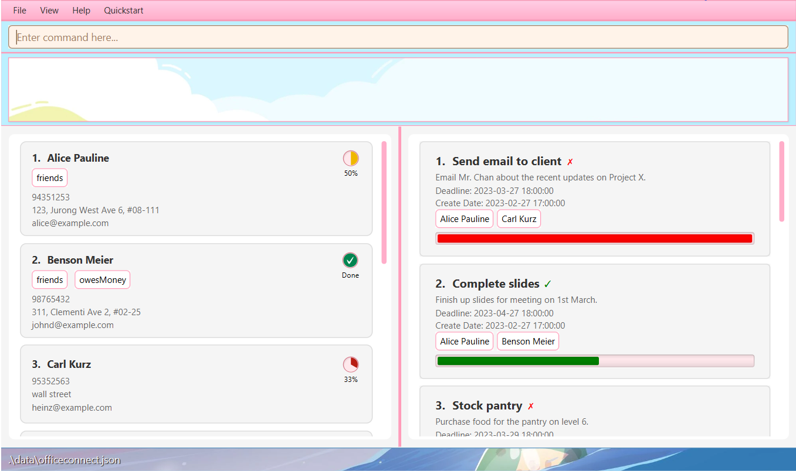
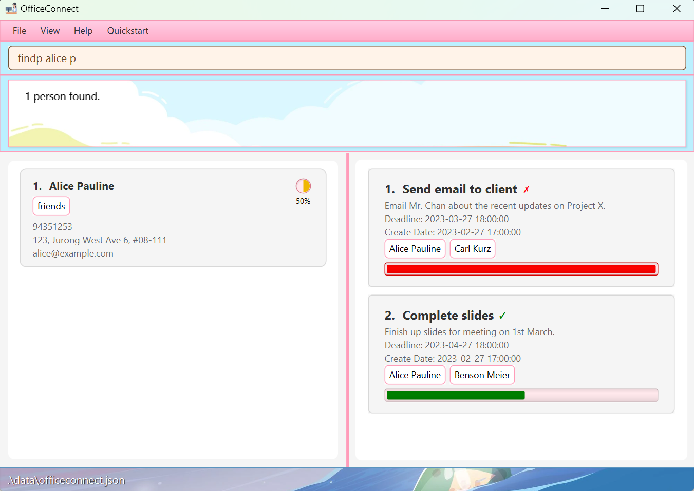

OfficeConnect is a task management tool designed specifically for managerial role personnel at companies.

As managers in the current office environment, it is often not easy to grasp the workload of subordinates. This may result in:
* work overload among subordinates
* difficulties in coordinating tasks with a large number of employees
* inefficient, time-consuming administrative tasks like typing and sending emails.

OfficeConnect offers a solution to these problems by providing better visibility into subordinates’ workloads, allowing
managers to efficiently delegate tasks in an organised manner. 

* Table of Contents
{:toc}

--------------------------------------------------------------------------------------------------------------------

## Getting started

1. Ensure you have Java `11` or above installed in your Computer.

2. Download the latest `officeconnect.jar` from [OfficeConnect Release Page](https://github.com/AY2223S2-CS2103T-W10-1/tp/releases).

3. Copy the file to the folder you want to use as the _home folder_ for your OfficeConnect.

4. Open a command terminal, `cd` into the folder you put the jar file in, and use the `java -jar officeconnect.jar` command to run the application. 
   A GUI similar to the below should appear in a few seconds. Note how the app contains some sample data. 
   

5. Type the command in the command box and press Enter to execute it. e.g. typing **`help`** and pressing Enter will open the help window. 
   Some example commands you can try:

   * `listp` : Lists all contacts.

   * `addp n/John Doe p/98765432 e/johnd@example.com a/John street, block 123, #01-01` : Adds a contact named `John Doe` to OfficeConnect.

   * `addp s/Complete slides c/Finish up slides for meeting st/false` : Adds a task with title `Complete slides` to OfficeConnect.

   * `deletep 3` : Deletes the 3rd contact shown in the current list.

   * `clear` : Deletes all contacts.

   * `exit` : Exits the app.

6. Refer to the [Features](#features) below for details of each command.

--------------------------------------------------------------------------------------------------------------------

## Features

**:information_source: Notes about the command format:**  

* Words in `UPPER_CASE` are the parameters to be supplied by the user. 
  e.g. in `addp n/NAME`, `NAME` is a parameter which can be used as `addp n/John Doe`.

* Items in square brackets are optional. 
  e.g. `n/NAME [t/TAG]` can be used as `n/John Doe t/friend` or as `n/John Doe`.

* Items with `…` after them can be used multiple times including zero times. 
  e.g. `[tag/TAG]…` can be used as (i.e. 0 times), `tag/friend`, `tag/friend tag/family` etc.

* Parameters can be in any order. 
  e.g. if the command specifies `n/NAME p/PHONE_NUMBER`, `p/PHONE_NUMBER n/NAME` is also acceptable.

* If a parameter is expected only once in the command but you specified it multiple times, only the last occurrence of the parameter will be taken. 
  e.g. if you specify `p/12341234 p/56785678`, only `p/56785678` will be taken.

* Extraneous parameters for commands that do not take in parameters (such as `help`, `listp`, `exit` and `clear`) will be ignored. 
  e.g. if the command specifies `help 123`, it will be interpreted as `help`.

* Datetime format for DEADLINE for tasks should be of the format `YYYY-MM-DD HH:MM:SS`. e.g `dl/2023-01-01 23:11:01`. Time(HH:MM:SS) is optional! There must be trailing zeros for digits less than 10. 

### Quickstart Guide: `quickstart`

Gives you a simple and brief initial run-through of the OfficeConnect app.

If this is your first time using OfficeConnect, this window will be the first window to pop up. After being closed by the user, it is reaccesible by the calling the command `quickstart`.

### Viewing help : `help`

Displays a comprehensive window detailing the outline of executable commands by user.

Presents a hierarchical view which lists the different available commands, along with the description of each of the commands.

Format: `help`

### Adding a person: `addp`

Adds a person to OfficeConnect.

Format: `addp n/NAME p/PHONE_NUMBER e/EMAIL a/ADDRESS [tag/TAG]…`

:bulb: **Tip:**
A person can have any number of tags (including 0)

Examples:
* `addp n/John Doe p/98765432 e/johnd@example.com a/John street, block 123, #01-01`
* `addp n/Betsy Crowe t/friend e/betsycrowe@example.com a/Newgate Prison p/1234567 tag/criminal`

### Listing all persons : `listp`

Shows a list of all persons in OfficeConnect.

Format: `listp`

### Editing a person : `editp`

Edits an existing person in OfficeConnect.

Format: `editp INDEX [n/NAME] [p/PHONE] [e/EMAIL] [a/ADDRESS] [tag/TAG]…`

* Edits the person at the specified `INDEX`. The index refers to the index number shown in the displayed person list. 
  The index **must be a positive integer** 1, 2, 3, …
* At least one of the optional fields must be provided.
* Existing values will be updated to the input values.
* When editing tags, the existing tags of the person will be removed i.e adding of tags is not cumulative.
* You can remove all the person’s tags by typing `tag/` without
    specifying any tags after it.

Examples:
*  `editp 1 p/91234567 e/johndoe@example.com` Edits the phone number and email address of the 1st person to be `91234567` and `johndoe@example.com` respectively.
*  `editp 2 n/Betsy Crower tag/` Edits the name of the 2nd person to be `Betsy Crower` and clears all existing tags.

### Locating persons by name: `findp`

Finds persons whose names contain any of the given keywords.

Format: `findp KEYWORD [MORE_KEYWORDS]`

* The search is case-insensitive. e.g `hans` will match `Hans`
* The order of the keywords does not matter. e.g. `Hans Bo` will match `Bo Hans`
* Only the name is searched.
* Only full words will be matched e.g. `Han` will not match `Hans`
* Persons matching at least one keyword will be returned (i.e. `OR` search).
  e.g. `Hans Bo` will return `Hans Gruber`, `Bo Yang`

Examples:
* `findp John` returns `john` and `John Doe`
* `findp alice` returns `alice pauline` 
  

### Deleting a person : `deletep`

Deletes the specified person from OfficeConnect.

Format: `deletep INDEX`

* Deletes the person at the specified `INDEX`.
* The index refers to the index number shown in the displayed person list.
* The index **must be a positive integer** 1, 2, 3, …

Examples:
* `listp` followed by `deletep 2` deletes the 2nd person in the address book.
* `findp Betsy` followed by `deletep 1` deletes the 1st person in the results of the `findp` command.

### Exiting the program : `exit`

Exits the program.

Format: `exit`

### Saving the data

OfficeConnect data are saved in the hard disk automatically after any command that changes the data. There is no need to save manually.

### Editing the data file

OfficeConnect data are saved as a JSON file `[JAR file location]/data/officeconnect.json`. Advanced users are welcome to update data directly by editing that data file.

:exclamation: **Caution:**
If your changes to the data file makes its format invalid, AddressBook will discard all data and start with an empty data file at the next run.

# Command Summary For OfficeConnect

## Adding a Task: `addt`

Adds a task to OfficeConnect. Take note of the datetime format for DEADLINE mentioned above.

Format: `addt t/TITLE c/CONTENT st/STATUS [dl/DEADLINE]`

Examples:
- `addt t/Complete slides c/Finish slides for meeting st/false dl/2024-01-01 20:02:01` 

## Deleting a Task: `deletet`

Deletes the specified task from OfficeConnect

Format: `deletet INDEX`

* Deletes the task at the specified INDEX.
* The INDEX refers to the INDEX shown in the displayed task list.
* The INDEX must be a positive integer 1, 2, 3...

Examples:
- `listt` followed by `deletet 2` deletes the 2nd task in the task list.
- `findt book` followed by `deletet 1` deletes the 1st task in the results of the `findt` command.

## Locating a Specific Task: `findt`

Finds the task based on given keyword.

Format: `findt KEYWORD [MORE_KEYWORDS]`

Examples:
- `findt complete` 

## Listing the Tasks: `listt`

Shows a list of all tasks in OfficeConnect.

Format: `listt`

## Listing all Tasks and Persons: `listall`

Shows a list of all tasks and persons in OfficeConnect.

Format: `listall`

## Assigning a Task to a Person: `assign`

Assigns an existing task to an existing person in OfficeConnect.

Format: `assign ti/INDEX pi/INDEX`

* Assigns the task at specified index to the person at specified index.
* The index refers to the index number shown in the displayed person/task list.
* The index must be a positive integer 1, 2, 3...

Examples:
- `assign ti/ 2 pi/ 3` assigns task 2 to person 3.

## Remove a Task assignment from a Person: `unassign`

Remove assignment of an existing task from an existing person in OfficeConnect.

Format: `unassign ti/INDEX pi/INDEX`

* Remove assignment of the task at specified index from the person at specified index.
* The index refers to the index number shown in the displayed person/task list.
* The index must be a positive integer 1, 2, 3...

Examples:
- `unassign ti/ 2 pi/ 3` assigns task 2 to person 3.

## Marking a Task as completed: `mark`

Marks an existing task in OfficeConnect.

Format: `mark INDEX`

* Changes the status of the task at the specified index to completed.
* The index refers to the index number shown in the displayed task list.
* The index must be a positive integer 1, 2, 3...

Examples:
- `mark 2` marks task 2 as completed

## Unmarking a Task: `unmark`

Unmarks a task in OfficeConnect

Format: `unmark INDEX`

* Changes the status of the task at the specified index to uncompleted.
* The index refers to the index number shown in the displayed task list.
* The index must be a positive integer 1, 2, 3...

## Finding Tasks assigned to a Person: `findp`

Shows a list of tasks assigned to an existing person in OfficeConnect.

Format: `findp NAME`

* Finds the list of tasks that are assigned to the person with the specified name.

Example:
- `findp John Cena` displays all tasks that are assigned to him.

## Finding Persons assigned to a Task: `findt`

Shows a list of persons assigned to an existing task in OfficeConnect.

Format: `findt TITLE`

* Finds the list of persons who are assigned to the task with the specified title.

Example:
- `findt CS2103 TP` displays everyone who are assigned to this task.

## Listing all Persons and Tasks: `listall`

Shows a list of all personals and tasks in OfficeConnect.

Format: `listall`

## Viewing Assigned People: `viewassignedp`

Displays a list of all persons who have been assigned to a task.

Format: `viewassignedp`

Example:
- `viewassignedp` displays a list of all persons who have been assigned to a task.

---

## Viewing Assigned Tasks: `viewassignedt`

Displays a list of all tasks that have been assigned to a person.

Format: `viewassignedt`

Example:
- `viewassignedt` displays a list of all tasks that have been assigned to a person.

---

## Viewing Unassigned People: `viewunassignedp`

Displays a list of all persons who have not been assigned to any task.

Format: `viewunassignedp`

Example:
- `viewunassignedp` displays a list of all persons who have not been assigned to any task.

---

## Viewing Unassigned Tasks: `viewunassignedt`

Displays a list of all tasks that have not been assigned to any person.

Format: `viewunassignedt`

Example:
- `viewunassignedt` displays a list of all tasks that have not been assigned to any person.

---

## Viewing Assigned: `viewassignedall`

Displays a list of all persons who have been assigned to a task and all tasks that have been assigned to a person.

Format: `viewassignedall`

Example:
- `viewassignedall` displays a list of all persons who have been assigned to a task and all tasks that have been assigned to a person.

---

## View Unassigned: `viewunassignedall`

Displays a list of all persons who have not been assigned to any task and all tasks that have not been assigned to any person.

Format: `viewunassignedall`

Example:
- `viewunassignedall` displays a list of all persons who have not been assigned to any task and all tasks that have not been assigned to any person.

---
### Viewing a person : `pi`

Shows a list of tasks assigned to a person according to the displayed index.

Format: `pi INDEX`

* Views the person at the specified `INDEX`.
* The index refers to the index number shown in the displayed person list.
* The index **must be a positive integer** 1, 2, 3, …

Example:
- `pi 2` displays person 2 and all tasks assigned to that person
---

### Viewing a task : `ti`

Shows a list of persons assigned to a task according to the displayed index.

Format: `ti INDEX`

* Views the task at the specified `INDEX`.
* The index refers to the index number shown in the displayed task list.
* The index **must be a positive integer** 1, 2, 3, …

Example:
- `task 1` displays task 1 and all persons assigned to that task
---

## Filtering Persons: `filterp tag/TAG`

Displays a list of all persons with the assigned tag. Only ONE tag can be keyed as input. 

Format: `filterp tag/TAG`

Examples: `filterp tag/Logistics` shows all persons with the Logistics tag.

### Archiving data files `[coming in v1.5]`

_Details coming soon ..._

--------------------------------------------------------------------------------------------------------------------

## FAQ

**Q**: How do I transfer my data to another Computer? 
**A**: Install the app in the other computer and overwrite the empty data file it creates with the file that contains the data of your previous OfficeConnect home folder.

## Command summary

| Action                      | Format, Examples                                                                                                                                                             |
|-----------------------------|------------------------------------------------------------------------------------------------------------------------------------------------------------------------------|
| **Add Person**              | `addp n/NAME p/PHONE_NUMBER e/EMAIL a/ADDRESS [tag/TAG]…`   e.g., `addp n/James Ho p/22224444 e/jamesho@example.com a/123, Clementi Rd, 1234665 tag/friend tag/colleague` |
| **Add Task**                | `addt t/TITLE c/CONTENT st/STATUS [dl/DEADLINE]`   e.g., `addt t/Draft proposal c/Complete proposal by 1st March st/false dl/2024-01-03 23:02:03`                         |
| **Assign**                  | `assign ti/INDEX pi/INDEX` e.g. `assign ti/1 pi/2`                                                                                                                       |
| **Delete Person**           | `deletep INDEX`  e.g., `deletep 3`                                                                                                                                        |
| **Delete Task**             | `deletet INDEX`  e.g. `deletet 2`                                                                                                                                        |
| **Edit Person**             | `editp INDEX [n/NAME] [p/PHONE_NUMBER] [e/EMAIL] [a/ADDRESS] [tag/TAG]…`  e.g.,`editp 2 n/James Lee e/jameslee@example.com`                                               |
| **Edit Tasks**              | `editt INDEX [title/TITLE] [c/CONTENT] [st/TRUE] [dl/DEADLINE] [createdate/CREATEDATE]`  e.g.,`editt 2 title/Submit report st/true`                                       |
| **Exit**                    | `exit`                                                                                                                                                                       |
| **Filter Person**           | `filterp tag/TAG`  e.g.,`filterp tag/Logistics`                                                                                                                           |
| **Find Person**             | `findp NAME`  e.g., `findp James Jake`                                                                                                                                    |
| **Find Task**               | `findt TITLE`  e.g., `findt CS2103 TP`                                                                                                                                    |
| **Help**                    | `help`                                                                                                                                                                       |
| **List All**                | `listall`                                                                                                                                                                    |
| **List Persons**            | `listp`                                                                                                                                                                      |
| **List Tasks**              | `listt`                                                                                                                                                                      |
| **Mark Task**               | `mark INDEX`  e.g. `mark 3`                                                                                                                                              |
| **Quick Start**             | `quickstart`                                                                                                                                                                 |
| **Unassign**                | `unassign pi/INDEX ti/INDEX`  e.g. `unassign pi/1 ti/3`                                                                                                                  |
| **Unmark Task**             | `unmark INDEX`   e.g. `unmark 2`                                                                                                                                         |
| **View Assigned All**       | `viewassignedall`                                                                                                                                                            |
| **View Assigned Persons**   | `viewassignedp`                                                                                                                                                              |
| **View Assigned Tasks**     | `viewassignedt`                                                                                                                                                              |
| **View Person**             | `pi INDEX`  e.g. `pi 2`                                                                                                                                                  |
| **View Task**               | `ti INDEX`  e.g. `ti 2`                                                                                                                                                  |
| **View Unassigned All**     | `viewunassignedall`                                                                                                                                                          |
| **View Unassigned Persons** | `viewunassignedp`                                                                                                                                                            |
| **View Unassigned Tasks**   | `viewunassignedt`                                                                                                                                                            |
