# Welcome to PetPal!

PetPal is your **furry and dependable assistant** who **reminds you of deadlines** and **consolidates crucial information** like pet names, tags dietary needs all in an **aesthetically pleasing** GUI! You can now focus on spend quality time with your furry friends without having to worry about things accidentally slipping your mind.

**PetPal is optimized for a Pet DayCare owner to use via the GUI (Graphical user interface)** while still having the benefits of a Command Line Interface (CLI). PetPal can help get your pet management tasks done without being tech-savvy and good at typing in the CLI.

This user guide will help you get started and understand how PetPal can **seamlessly streamline your pet caring duties**.

# Table of Contents
  {:toc}

--------------------------------------------------------------------------------------------------------------------

## Quick start

1. Ensure you have Java `11` or above installed in your Computer.

2. Download the latest `PetPal.jar` from [here](https://github.com/AY2223S2-CS2103T-T14-2/tp/releases).

3. Copy the file to the folder you want to use as the _home folder_ for your PetPal.

4. Double-click the file to start the app. The GUI similar to below should appear in a few seconds. Note how the app contains some sample data. 
   

5. Type the command in the command line and press Enter to execute it. e.g. typing **`help`** and pressing Enter will open the help window. 
   Some example commands you can try:

    * **`list`** : Lists all pets currently stored.

    * **`add`**`o/Petricia n/Whiskers p/98746333 e/petricia@petpal.com a/311 Beach Road 2023-03-27 21:09:09 d/Feed dog - 2023-03-27 21:09:09 t/MaineCoon`
      : Adds a `Pet` named `Whiskers` to your PetPal.

    * **`exit`** : Exits the app.

6. Refer to the [Features](#features) below for details of each command.
7. Refer to the [Command Summary](#command-summary) for a quick summary of all commands.

[Return to Table of Contents](#table-of-contents)

--------------------------------------------------------------------------------------------------------------------

## Getting Familiar With Your User Interface

1. **Pet Cards**: Contain all the information of a pet. (Highlighted in red)
2. **Command Line**: Type in your commands here. (Highlighted in yellow)
3. **Result Display**: The result of your command execution appears here. (Highlighted in blue)
4. **Help Button**: Provides the URL of this user guide.

[Return to Table of Contents](#table-of-contents)

--------------------------------------------------------------------------------------------------------------------

## Legend

### General formatting conventions
* Text in [blue](#legend) are hyperlinks that direct you to the relevant section of the page or to other websites
* Text in **bold** are used to emphasize important details to look out for or to distinguish headers from the rest of the text
* Text in `code snippets such as this` are used to show inputs and their format

* :white_check_mark: **Input Shortcut:**
Shortened forms of commands which can help increase your efficiency in using PetPal

* :bulb: **Note:**
Information that might be useful to know to enhance your PetPal experience, might not be compulsory to know

* :heavy_exclamation_mark: **Caution:**
Important information to note which might negatively impact your experience in using PetPal

* :information_source: **Information**

### Command formatting conventions:
* Words in `UPPER_CASE` are the information supplied by you.
  e.g `OWNER_NAME` is a parameter in `add o/NAME`, where you can input `add o/John Doe`.
* Parameters in `[]` are optional.
  e.g `DEADLINE` is an optional parameter in `create o/OWNER_NAME [d/DEADLINE]`, where you can input `add on/John Doe d/d/Feed dog - 2023-03-27 21:09:09` or just `create n/John Doe`.
* Items with `…`​ after them can be used multiple times.
  e.g `TAG…​` can be used as `Pomeranian`, `Pomeranian Vegetarian` etc.
* `INDEX` represents the index of a specific pet in PetPal.
  e.g You can use the command `delete INDEX` as `delete 2`.
* Parameters can be in **any order**.
  e.g You can input either `add o/OWNER_NAME p/HP_NUMBER` or ` create p/HP_NUMBER o/OWNER_NAME`.
* Only the last occurrence of a parameter that is expected once will be taken **if you specify it more than once.**
  e.g Given `p/12341234 p/56785678`, only `p/56785678` will be taken.
* Extraneous parameters for commands that do not take in parameters (such as `help`, `list`, `exit`,`clear`, `redo` and `undo`) will be ignored.
  e.g. if the command specifies `help 123`, it will be interpreted as `help`.

--------------------------------------------------------------------------------------------------------------------

## Features

[Return to Table of Contents](#table-of-contents)

### General

#### Viewing help : `help`

Shows a message explaining how you can access our user guide.

Format: `help` or Press `F1`

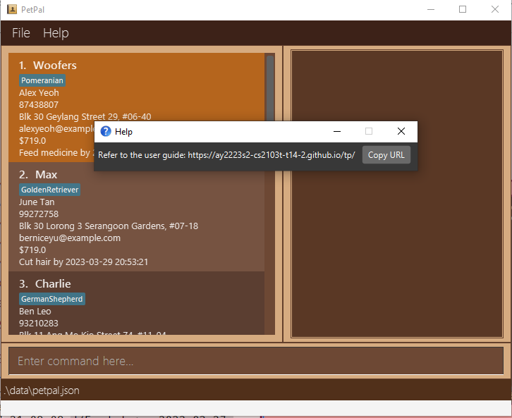

#### Listing your pets : `list`

Shows a list of all pets stored in your PetPal.

Format: `list`

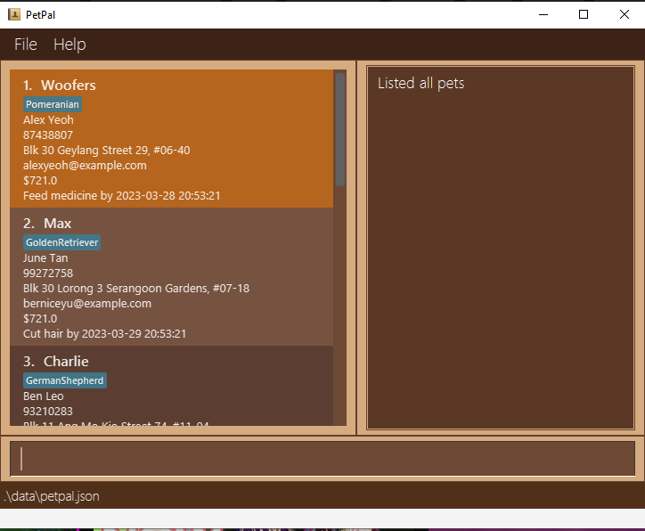

### Adding

#### Adding a pet's information : `add`

Adds all the relevant information of a pet to your PetPal.

Format: `add n/PET_NAME o/OWNER_NAME p/PHONE_NUMBER e/EMAIL a/ADDRESS ts/TIME_STAMP [d/DEADLINE] [t/TAG...] `

* :information_source: **Information**

Note:
1. The field `n/PET_NAME` is **case sensitive**. That is `n/Doggo` and `n/doggo` will be treated as 2 different pets
2. There certain constraints which might differ for each parameter, please refer to **Figure 1** below for details on each constraint
3. Pets with the `PET_NAME` **cannot** be created.
4. There can be multiple tags associated with each pet, simply repeat the tag prefix e.g. `t/Dog t/BichonFrise`

Figure 1 provides a summary of the parameters with their descriptions, prefixes and constraints.

| Parameter      | Description                                   | Prefix | Constraints                                                                                                                                                                                                                                                                                                                                                                                                                                                                                                                                                                                                                                                                                               | Required?  |
|----------------|-----------------------------------------------|--------|-----------------------------------------------------------------------------------------------------------------------------------------------------------------------------------------------------------------------------------------------------------------------------------------------------------------------------------------------------------------------------------------------------------------------------------------------------------------------------------------------------------------------------------------------------------------------------------------------------------------------------------------------------------------------------------------------------------|------------|
| `OWNER_NAME`   | The name of the owner                         | `o/`   | Names should only contain alphanumeric characters and spaces                                                                                                                                                                                                                                                                                                                                                                                                                                                                                                                                                                                                                                              | COMPULSORY |
| `PET_NAME`     | The name of the pet                           | `n/`   | Names should only contain alphanumeric characters and spaces                                                                                                                                                                                                                                                                                                                                                                                                                                                                                                                                                                                                                                              | COMPULSORY |
| `PHONE_NUMBER` | The owner's phone number                      | `p/`   | Phone numbers should only contain numbers, and it should be at least 3 digits long                                                                                                                                                                                                                                                                                                                                                                                                                                                                                                                                                                                                                        | COMPULSORY |
| `EMAIL`        | The owner's email                             | `e/`   | Emails should be of the format local-part@domain and adhere to the following constraints:  1. The local-part should only contain alphanumeric characters and these special characters, excluding the parentheses, ( + SPECIAL_CHARACTERS + ). The local-part may not start or end with any special "characters." 2. This is followed by a '@' and then a domain name. The domain name is made up of domain labels separated by periods.The domain name must: - end with a domain label at least 2 characters long - have each domain label start and end with alphanumeric characters - have each domain label consist of alphanumeric characters, separated only by hyphens, if any. | COMPULSORY |
| `ADDRESS`      | The owner's address                           | `a/`   |                                                                                                                                                                                                                                                                                                                                                                                                                                                                                                                                                                                                                                                                                                           | COMPULSORY |
| `TIMESTAMP`    | The date and time when the pet start boarding | `ts/`  | Timestamps should be in the `YYYY-MM-DD HH:MM:SS` format.   eg. 2023-03-27 21:09:09                                                                                                                                                                                                                                                                                                                                                                                                                                                                                                                                                                                                                       | COMPULSORY | 
| `DEADLINE`     | A deadline attributed with the pet            | `d/`   | Timestamps given in the deadline should be in the `YYYY-MM-DD HH:MM:SS` format.   eg. 2023-03-27 21:09:09                                                                                                                                                                                                                                                                                                                                                                                                                                                                                                                                                                                                 | OPTIONAL   |
| `TAG`          | A label that you can attach to a pet          | `t/`   | Tags should be alphanumeric, and **cannot** include spaces                                                                                                                                                                                                                                                                                                                                                                                                                                                                                                                                                                                                                                                | OPTIONAL   |

<b>Figure 1</b>: Parameters with their descriptions, prefixes and constraints

* :heavy_exclamation_mark: **Caution:**
The format of the timestamp should strictly follow the convention `YYYY-MM-DD HH:MM:SS` eg. `2023-03-27 21:09:09`
otherwise you will encounter errors when adding a new pet

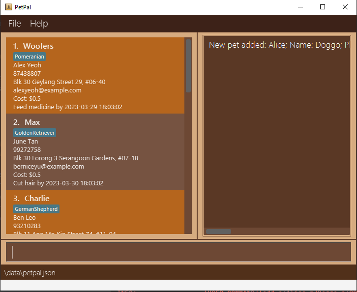

Example given: `Example: add o/Alice n/Doggo p/98765432 e/example@gmail.com a/311, Clementi Ave 2, #02-25 ts/2023-03-27 21:09:09 d/Feed dog - 2023-03-27 21:09:09 t/Dog t/Chihuahua`

Other examples:
* `add o/Petricia n/Whiskers p/98746333 e/petricia@petpal.com a/311 Beach Road 2023-03-27 21:09:09 d/Feed cat - 2023-03-27 21:09:09 t/MaineCoon`
* `add o/Robert n/Fluffy p/98746333 e/rob@bmail.com a/622 Rose Road ts/2023-03-27 21:09:09 d/Feed rabbit - 2023-03-27 21:09:09 t/Vegetarian t/Rabbit`

#### Filtering out reminders that are due soon : `remind`

Get a filtered list of things you should do soon!

**Constraints**
* The filtering of the list only checks if the deadline of a pet is within 3 days of current date.
* It does not sort out the list based on the deadline of the pet. (Future implementation)
* However, currently those reminders that are due within the day are highlighted in bright orange on the GUI as seen in the image given below.

Format: `remind`

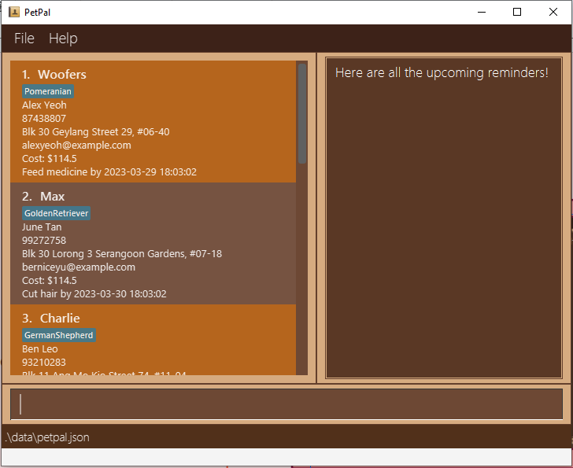

:bulb: **Note:**
The pets highlighted in bright orange are reminders that are due within a day! 

### Retrieving

#### Finding your pet by name : `find`

Find your pets whose name contain any of the given keywords.

**Constraints**
* The search is case-insensitive. e.g. `woofers` will match `Woofers`
* The order of the keywords does not matter. e.g. `Ardent Tyrant` will match `Tyrant Ardent`
* Only the name is searched. e.g. `find Alex` will not return owner names, addresses or emails with
* Partial words will be matched. e.g. `Jack` will match `Jackson`.
* Pets matching at least one keyword will be returned (i.e. `OR` search).
  e.g. `Hans Bo` will return `Hans Gruber`, `Bo Yang`

Format: `find n/PET_NAME`

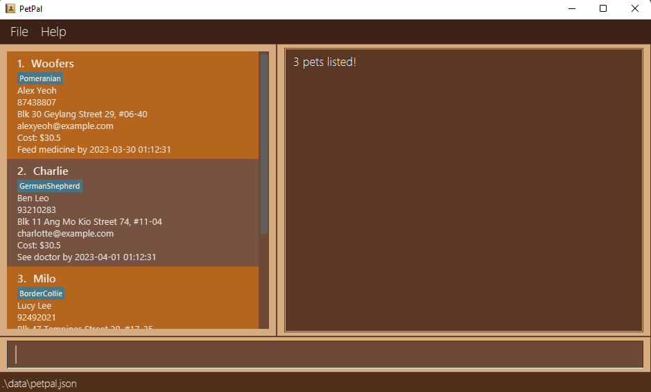
Example given: `find n/Milo Charlie`

Other examples:
* `find n/John` returns `john` and `John Doe`
* `find n/alex david` returns `Alex Yeoh`, `David Li` 

:white_check_mark: **Input Shortcut:**
Format: `f n/NAME`

### Updating

#### Updating your pet information : `edit`

Edit the pet information of a pet in PetPal
If you accidentally invoked this command with the wrong parameters, you can use the `edit` command to re-edit the wrong fields or
the `undo` command to revert the wrong changes.

This command can be used to edit: phone number, address, email, tags

**Constraints**
* Edits the pet with the provided index.
* `INDEX` is the index of the pet in the currently displayed list. 
* You must provide **at least one** of the optional fields .
* Does not allow you to update a pet to have the same name and phone number as a current person in the PetPal.
* Allows you to update a person to have same name but different phone number or same number and different name as a current person in the FABook.
* Person profiles do not refresh when person is updated, they are only updated when we re-click the person card

Format: `edit INDEX [p/PHONE_NUMBER] [a/ADDRESS] [e/EMAIL] [t/TAG...]`

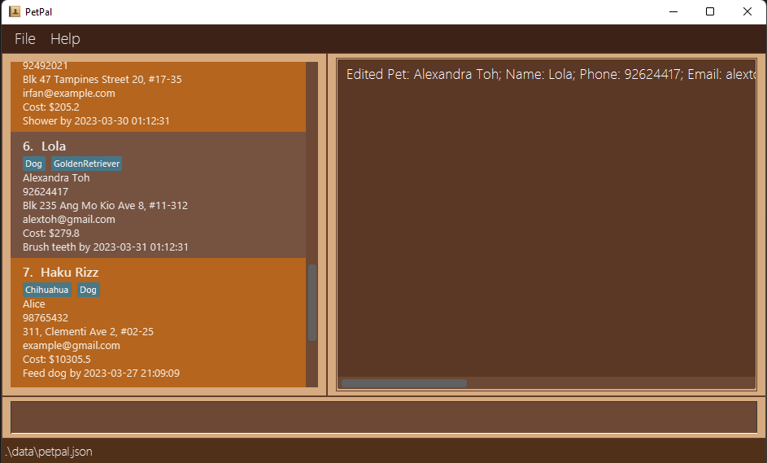
Example given: `edit 6 t/Golden Retriever t/Dog a/Blk 235 Ang Mo Kio Ave 8, #11-312 e/alextoh@gmail.com`

:bulb: **Note:**
If you wish to add tags to the pet, take note to include all previous tags in the edit or it will be overridden
Only parameters provided will be changed

Other examples:
* `edit 2 p/91234567 a/21 Beach Road` Updates the second pet entry's phone number to`91234567`
and address to `21 Beach Rd`
* `edit 3 t/Dog`. Updates the third pet entry's tag to `Dog`, take note that if the third entry has an existing tag,
the edit will override the existing tag

#### Changing the cost : `changecost`

Changes the parameters for cost calculation for each dog

Format: `changecost INDEX [RATE] [FLAT_RATE]`

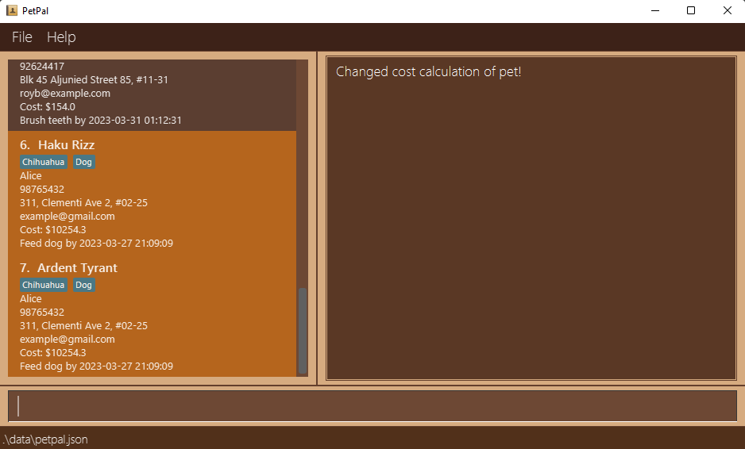
Example given `changecost 1 0.1 0.5`

### Deletion

#### Deleting a pet : `delete`

Deletes the specified pet from your PetPal.

**Constraints**
* `INDEX` is the index of the pet in the currently displayed list.
* Deletes the pet with the specified index in your PetPal.

Format: `delete INDEX`

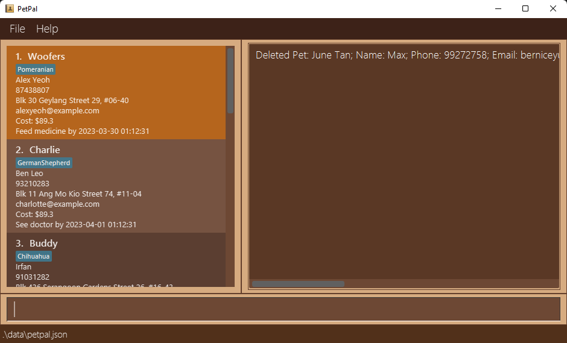

Examples:
* `delete 2` deletes the second pet in the currently displayed pet list in the PetPal.

#### Archiving a pet: `archive`

Archives the specified pet into the `archive.json` file in the `data` folder
This command can be undone

Format: `archive INDEX`

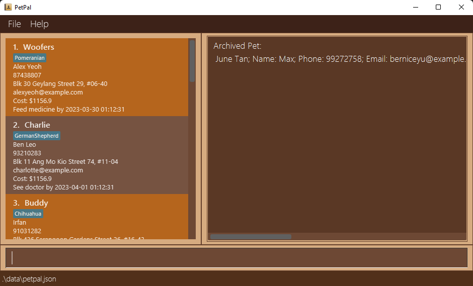

#### Clearing all entries : `clear`

Clears all entries from PetPal.json.
Format: `clear`

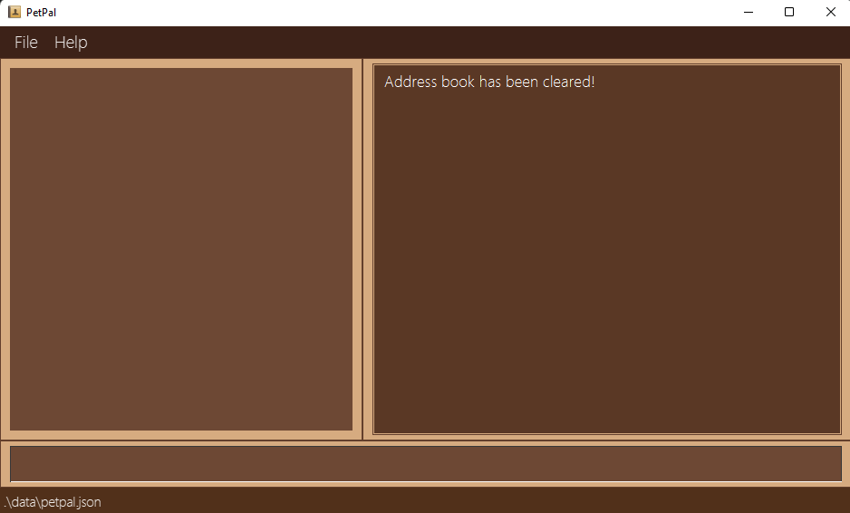

:heavy_exclamation_mark: **Important**
If you run this command by accident, you can [undo](#undoing-a-previous-command--undo) the command to restore the previous state of PetPal.

### Command Flow
#### Undoing a previous command : `undo`

Undos your last command.

You can use this command when:
1. When you make a mistake editing the contact book.
    

**Constraints**
* The command intended to be undone should be an undoable command.
* Undoable commands are: `create`, `delete`, `update`, `clear`, `description`, `meeting`, `deletemeeting` and `redo`
* Non-undoable commands are: `exit`, `find`, `help`, `list`, `file`, `sync` and `filepath`

Format: `undo`

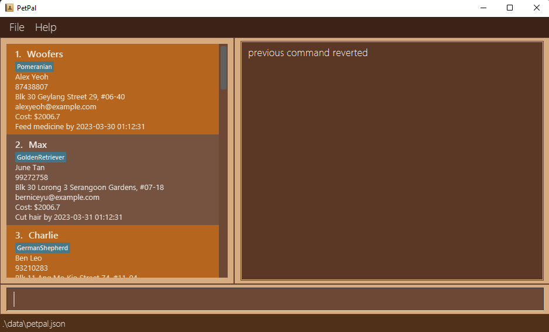

:heavy_exclamation_mark: **Important**
You can `undo` an `undo` command 

### Exiting the program : `exit`

Exits the program.

Format: `exit`

:white_check_mark: **Input Shortcut:**
You can replace `exit` with `e` for convenience.

### Saving the data

Your FABook data are saved in the hard disk automatically after any command that changes the data. This means hassle free saving.

### Editing the data file

FABook data are saved as a text file `[JAR file location]/data/addressbook.json`. If you are an advanced user, you are welcome to update data directly by editing that data file.

:exclamation: **Caution:**
If your changes to the data file makes its format invalid, FABook will discard all data and start with an empty data file at the next run.

[Return to Table of Contents](#table-of-contents)

--------------------------------------------------------------------------------------------------------------------

## FAQ

**Q**: How do I transfer my data to another computer? 
**A**: Follow these steps to transfer your data to another computer:
1. Find the save folder on the current computer. The save files can be found in the `data` folder created by the app, it should include both `PetPal.json` and `archive.json`
2. Transfer the save file to your new computer.
3. Download the latest release of PetPal from [here](https://github.com/AY2223S2-CS2103T-T14-2/tp/releases) on your new computer.
4. Launch PetPal on your new computer and exit.
5. You should see a new `data` folder containing a new `PetPal.json` with a sample. Replace this file with the save file copied over from your old computer.
6. Launch FABook again. Your data should be there!

* :bulb: **Note:**
If you wish to transfer only 1 of the files over, repeat the same steps, and replace the file you want to move, instead of the entire `data` folder

**Q**: How do I view the entire pet list after a `find` command? 
**A**: Run `list` to view the entire unfiltered list.

If you have additional questions that is not present in the User Guide, feel free to contact us via our email `contact@petpal.com`
or raise an issue in our [github](https://github.com/AY2223S2-CS2103T-T14-2/tp/issues)

[Return to Table of Contents](#table-of-contents)

--------------------------------------------------------------------------------------------------------------------

## Glossary

| Term                     | Definition                                                                                                                                                                                                                                               |
|--------------------------|----------------------------------------------------------------------------------------------------------------------------------------------------------------------------------------------------------------------------------------------------------|
| Alphanumeric             | Refers to characters that are the combined set of the 26 alphabetic characters, a to Z, both lowercase and uppercase, and the 10 Arabic numerals, 0 to 9.                                                                                                |
| Command Line Interface   | A command-line interface (CLI) is a text-based user interface (UI) used to run programs, manage computer files and interact with the computer.                                                                                                           |
| dd-MM-yyyy-hh:mm         | Date format whereby `dd` refers to the 2 digit days, `MM` refers to the 2 digit months, `yyyy` refers to the 4 digits years, `hh` refers to the 2 digits hours, `mm` refers to the 2 digits minutes. They are each separated by a hyphen: `-` character. |
| Graphical User Interface | A graphical user interface (GUI) is an interface through which a user interacts with electronic devices such as computers and smartphones through the use of icons, menus and other visual indicators or representations (graphics).                     |
| Index                    | The number that corresponds to the position of the pet in the list. The index must be a numeral above 0.                                                                                                                                                 |
| Java                     | The programming language used for this application. Java is a general-purpose computer programming language designed to produce programs that will run on any computer system that has Java installed.                                                   |
| JAR                      | JAR stands for Java ARchive. FABook uses JAR to deliver its distribution. JAR is a file format based on the popular ZIP file format and is used for aggregating many files into one.                                                                     |
| JSON                     | JSON stands for JavaScript Object Notation. JSON is the format used to store your PetPal's data. JSON is a lightweight format for storing and transporting data.                                                                                         |

[Return to Table of Contents](#table-of-contents)

## Command summary

======

| Action          | Format, Examples                                                                                                                                                                                                                                                        | Shortcut       |
|-----------------|-------------------------------------------------------------------------------------------------------------------------------------------------------------------------------------------------------------------------------------------------------------------------|----------------|
| **Help**        | `help`                                                                                                                                                                                                                                                                  | **PRESS** `F1` |
| **List**        | `list`                                                                                                                                                                                                                                                                  |                |
| **Add**         | `add o/OWNER_NAME p/PHONE_NUMBER e/EMAIL a/ADDRESS ts/TIME_STAMP [d/DEADLINE] [t/TAG...]`  e.g `Example: add o/Alice n/Doggo p/98765432 e/example@gmail.com a/311, Clementi Ave 2, #02-25 ts/2023-03-27 21:09:09 d/Feed dog - 2023-03-27 21:09:09 t/Dog t/Chihuahua` |                |
| **Edit**        | `clear`                                                                                                                                                                                                                                                                 |                |
| **Delete**      | `delete INDEX` e.g. `delete 2`                                                                                                                                                                                                                                       |                |
| **Remind**      | `remind`                                                                                                                                                                                                                                                                |                |
| **Find**        | `find n/PET_NAME` e.g `find Milo`                                                                                                                                                                                                                                    |                |
| **Undo**        | `undo`                                                                                                                                                                                                                                                                  |                |
| **Change Cost** | `changecost INDEX RATE FLAT_COST` e.g. `changecost 1 0.1 0.5`                                                                                                                                                                                                        ||
| **Archive**     | `archive INDEX` e.g. `archive 1`                                                                                                                                                                                                                                     ||                                                                                                                                                                                                                                     
| **Clear**       | `clear`                                                                                                                                                                                                                                                                 ||
| **Exit**        | `exit`                                                                                                                                                                                                                                                                  |                |

[Return to Table of Contents](#table-of-contents)
