## Introduction
Welcome to ExecutivePro! ExecutivePro is an all-in-one solution for managing employees' information.
Are you tired of wasting time and energy on inefficient tasks? Do you want to streamline your HR processes and
boost your productivity?
Look no further! ExecutivePro is here to solve your problems.

ExecutivePro (EP) is a **desktop app for Human Resource managers to manage their employee information,
optimized for use via a Command Line Interface (CLI)** while still having the benefits of a
Graphical User Interface (GUI). With EP, you can streamline your HR processes and save you from your tedious and mundane tasks.
So why wait? Don't miss out on the opportunity to bring your productivity to another level. Head over to [Quick Start](#quick-start) now and
experience the game-changing benefits that EP can bring to your work!

### Table of Contents
* Table of Contents
  {:toc}

--------------------------------------------------------------------------------------------------------------------
## Using this Guide
This guide walks you through the comprehensive features of **ExecutivePro**.

Do check out our [Introduction](#introduction) if this is your first time using **ExecutivePro**.
Refer to the [Table of Contents](#table-of-contents) to easily navigate around different sections of the User Guide.
If you require assistance in the setting up of **ExecutivePro**, head over to [Quick Start](#quick-start).
If you have set up **ExecutivePro**, feel free to navigate to [Features](#features) to learn how to use the features we offer.
### Symbols and Syntax

Here are some of the symbols to take note of when going through this user guide:

| Symbol      | Meaning                                                           |
|-------------|-------------------------------------------------------------------|
| `code`      | Text relevant to commands or name of a file.                      |
| [`code`]    | The brackets around the code indicate that the field is optional. |
| :bulb:      | Tips for ExecutivePro Users.                                      |
| :warning:   | Be wary and proceed with caution.                                 |

--------------------------------------------------------------------------------------------------------------------
## Quick start

1. Ensure you have Java `11` or above installed in your Computer.
    1. If you have installed Java before, check that you have the right version, which is Java `11`.
        - If you are using Windows, open up command prompt and type `java -version` and enter.
        - If you are using Mac, open up terminal and type `java -version` and enter.
    2. If you do not have Java `11`:
        - If you are using Windows/Linux/Intel-based Mac, you can download the latest version of Java from
          [here](https://www.oracle.com/java/technologies/downloads/).
        - If you are using an Apple Silicon Mac, you can install the Azul build of OpenJDK 11 version
          from [here](https://www.azul.com/downloads/?version=java-11-lts&os=macos&architecture=arm-64-bit&package=jdk-fx).
2. Download the latest `ExecutivePro.jar` from [here](https://github.com/AY2223S2-CS2103T-W09-4/tp/releases).

3. Copy the file to the folder you want to use as the _home folder_ for your ExecutivePro.

4. Double-click the file to start the app. A GUI similar to below should appear in a few seconds.
   Note how the app contains some sample data. 

  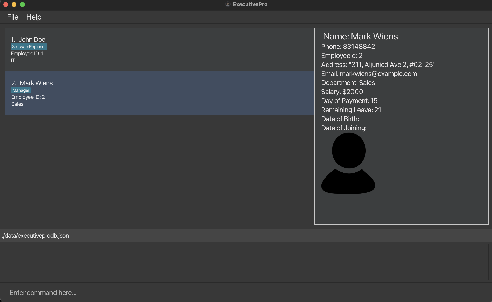

5. You can start by typing a command in the command panel and pressing Enter to execute it. e.g.
   typing **`help`** and pressing Enter will open the help window. 
   Some example commands you can try:

    - **`list`** : Lists all employees in the company.

    - **`add`** :`add n/Mark Doe p/98765432 d/Marketing pr/1000 15 e/markd@example.com a/311, Clementi Ave 2, #02-25
      t/SoftwareEngineer` : Adds an employee named `Mark Doe`, with fields phone number, department, payroll,
      email, address, and tags to ExecutivePro's database.

    - **`delete 3`** : Deletes employee with ID 3.

    - **`exit`** : Exits the app.

6. Refer to the [Features](#features) below for details of each command.

--------------------------------------------------------------------------------------------------------------------

## Features

* Items with `…` after them can either be omitted or used one or more times. 
  e.g. `[t/TAG]…` can be used as ` ` (i.e. 0 times), `t/friend`, `t/friend t/family` etc.

### <u> Starting ExecutivePro application: </u>
:warning: **Note:**
To get started with ExecutivePro, the HR manager will need to run the application using
their terminal or command prompt. Follow the steps below:

Step 1 (Opening Terminal or Command Prompt) :

On Windows, press Windows + R, type cmd, and hit Enter to open Command Prompt.
On macOS, press Cmd + Space, type terminal, and hit Enter to open Terminal.

Step 2 (Navigating to the Jar File Location) :

Use the cd command to navigate to the directory where the ExecutivePro.jar file is located.
For example, if the file is located in the Downloads folder, you can type cd Downloads and hit Enter.

Step 3 (Running the Application) :
Once you are in the correct directory, type the following command and hit Enter:
`java -jar ExecutivePro.jar`

This command will start the application, and the data folder should appear in the same directory as the
ExecutivePro.jar file after the application is run successfully.

If the data folder is still missing, simply create a `data` folder by creating a new folder in the same
folder where the jar file is located.

Now that the application is running, you can follow the steps in the user guide to perform various tasks
such as adding employees using the batchadd command and exporting the database using the `batchexport` command.

--------------------------------------------------------------------------------------------------------------------

### Viewing help : `help`
There can be a lot of information to take in, so if you ever _feel lost_ while using ExecutivePro,
getting help with the commands is just a simple step away.

Entering the `help` command will open up window with the command summary for the various functions of the application,
and if you have more doubts, the _Help Window_ also contains a button to open up this User Guide in your browser.

Format: `help`

With this command, you should see a window like this appear.

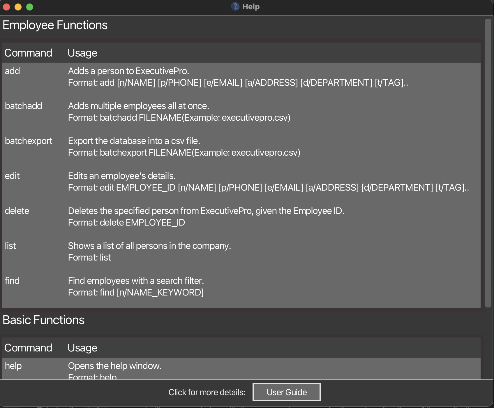

--------------------------------------------------------------------------------------------------------------------
### Adding an employee: `add`

How do we build an employee profile?

The first step is to add a new employee to the database,
so ExecutivePro can begin managing their particulars and profile for you.
To do this, use the add command, together with the employee particulars that you have available for this person.

Upon successfully adding a new employee, ExecutivePro will then keep track of the new profile and details in the
database, and you are free to access and modify the particulars with other commands later on.

However, this function could fail (and ExecutivePro simply does not add any employee), if:

1. There are missing particulars which are compulsory, you can find these listed in [here](#order-of-fields).
2. The particulars are in the wrong format, the program will prompt you on the correct format. Alternatively, you can find them [here](#field-formats).
3. The new employee added is a duplicate, i.e. there is someone in the database who already shares the same name, phone number
and email

Format: `add n/NAME p/PHONE_NUMBER d/DEPARTMENT pr/PAYROLL [e/EMAIL] [a/ADDRESS] [l/LEAVE COUNT] [dob/DATE OF BIRTH] [doj/DATE OF JOINING] [t/TAG]...`

:bulb:
**For Tags:**
A person can have any number of tags (including 0)

Examples:
* `add n/John Doe p/98765432 d/Marketing pr/1000 15 e/johnd@example.com a/John street, block 123, #01-01`
* `add n/Betsy Crowe p/1234567 d/Sales pr/4000 1 e/betsycrowe@example.com a/Newgate street, block 576, #01-02 dob/2000-04-21 doj/2022-01-04 t/friend`

--------------------------------------------------------------------------------------------------------------------

### Adding multiple employees at once: `batchadd`

Tired of adding new employees one by one?
ExecutivePro allows you to add multiple employees at once from a `.csv` file.
This feature will come in handy when:

1. You are a new user and have your employee data stored in a `.csv` file.
2. There has been a recruitment cycle and the company has recruited multiple employees.

With this feature, you would not need to spend time to manually add each employee in!

Format: `batchadd FILENAME`

Example:`batchadd executivepro.csv`

Below are the steps to use this command:

**Step 1 (Creating CSV file) :**

Things to note:

- A header row is required to indicate the purpose of the field and must be the first row in the `.csv` file.
- For multiple tags for an employee, the tags should be separated by " \ ".

Sample `.csv` file:

:warning:
**Caution:** For the fields, do ensure that they follow the same specifications as in the [Field Formats below](#field-formats).

**Step 2 (Uploading CSV file) :**
Before we proceed to uploading the CSV file, you would need to have followed the instructions at [start of this section](#u-starting-executivepro-application--u), in order
to upload your csv file in the `data` folder

Once that is done,

1. Go to the folder where you stored the `jar` file.
2. Move your desired CSV file to the `data` folder.
   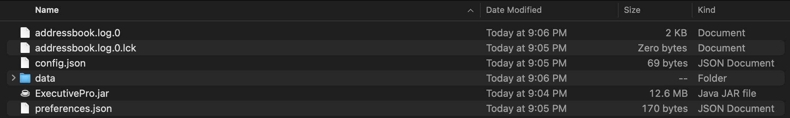

**Step 3 (Running CSV file) :**

1. Once done, run `batchadd FILENAME` in the command panel.

If the command is successful, the employees in the file should be added to the database all at once,
and it should look something like the below image.

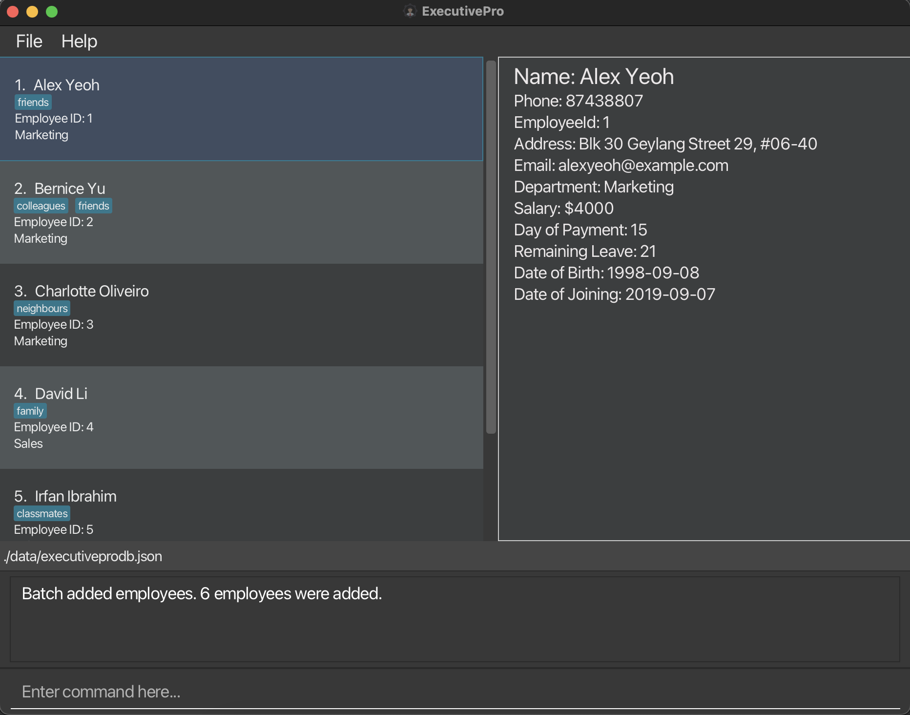

The command could be unsuccessful, and there are a few potential causes of this:

1. There could be a *duplicate* entry in the file, i.e. two employees sharing the same identity in the file.
2. If any of the particulars in the wrong format, ExecutivePro will not be able to read the file properly
   and the command will not run.
3. If you are using Excel to open your `.csv` file, the date formatting in Excel might not be set to the right format,
   please refer to the instructions [here](#u-opening-csv-files-in-excel--u) to rectify this problem.

In the case of an unsuccessful Batch Add, **NONE** of the employees in the `.csv` will be added.
Also note that as of version `1.3` , this feature only supports `.csv` files and adding employees with the fields mentioned above.

In the upcoming versions, we will expand `batchadd` feature to:

1. Support different types of files
2. Include more fields like performance and leaves

#### <u> Opening `.csv` files in `Excel`: </u>

When using the `batchadd` feature, it is crucial to ensure that the dates in the CSV file are in the [correct format](#field-formats).
ExecutivePro expects dates to be in the following format: YYYY-MM-DD. If the dates in your CSV file are in a different format, you'll need to convert them before uploading the file to prevent errors and unsuccessful imports.

Follow the steps below to ensure the dates in Excel are following the correct format:

1. Firstly, you can select the two columns involving dates, `Date of Birth` and `Date of Joining`, just like the image below.
   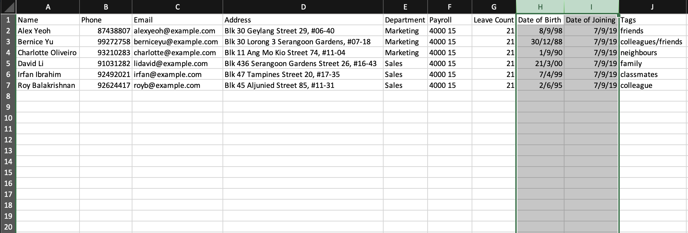

2. Next, right-click on the selected columns so that the following shows up:

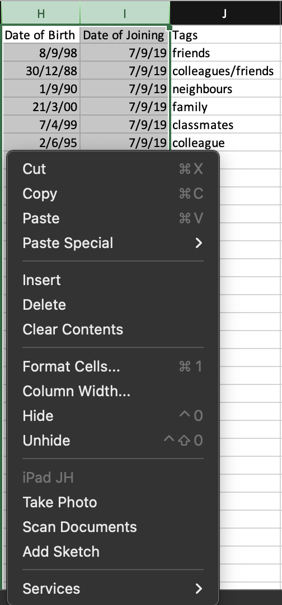

3. Click on `Format Cells...` and the table below will appear:
   

4. Click on `Date`:
   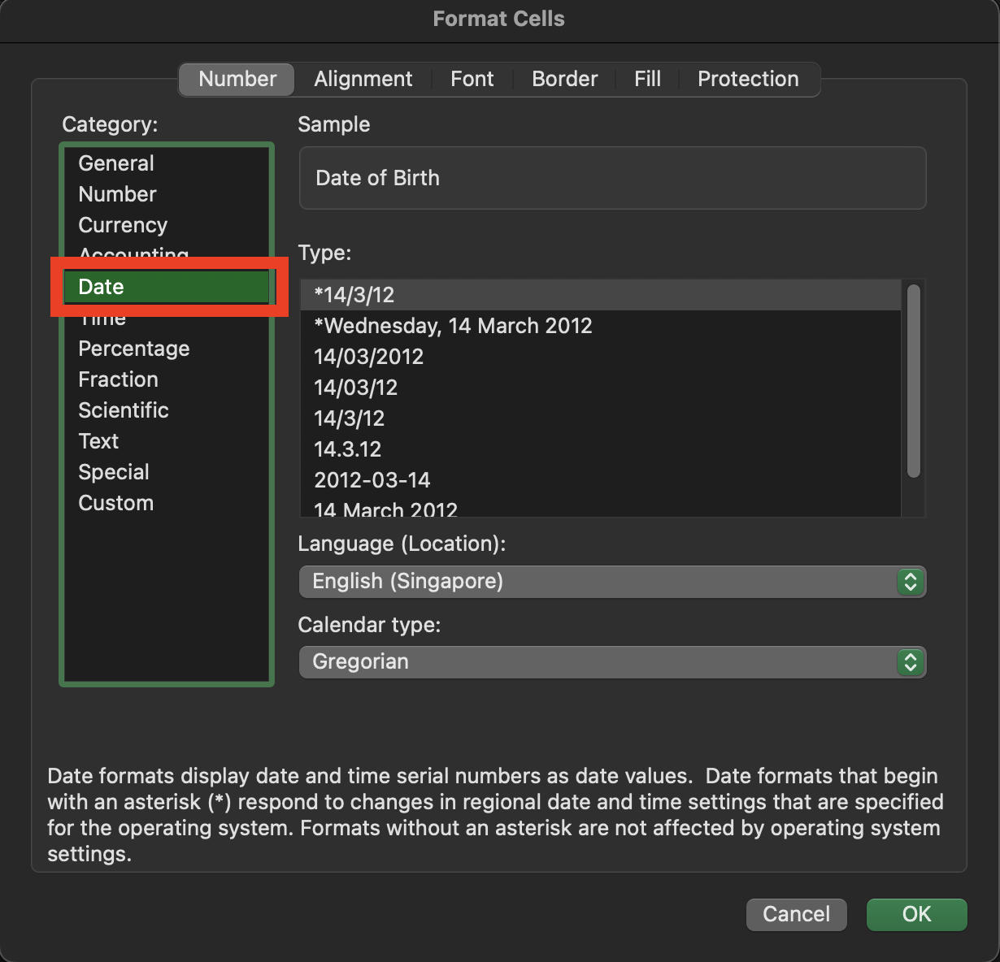

5. Select the correct date format ("YYYY-MM-DD"):
   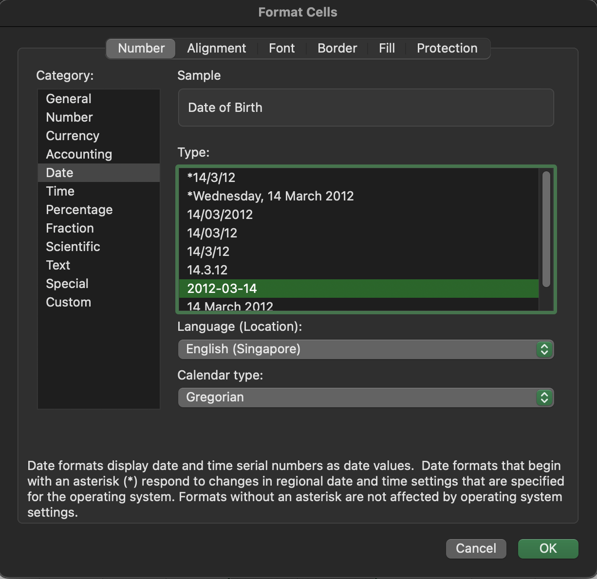

6. Click `OK` and the date in the file will be updated to the correct format:
   

Once the dates in your CSV file are in the correct format (YYYY-MM-DD),
you can proceed with the batchadd command in ExecutivePro.
This will ensure a smooth import process, and all employee information,
including dates, will be properly stored in the database.
--------------------------------------------------------------------------------------------------------------------

### Exporting database into CSV file: `batchexport`

ExecutivePro allows you to export the employees' data into a `.csv` file.

Format: `batchexport FILENAME`

Example:`batchexport exported_database.csv`

Below are the steps to use this command:

**Step 1 (Exporting to CSV file) :**

1. Run `batchexport FILENAME` in the command panel. The result should look like the image below.
   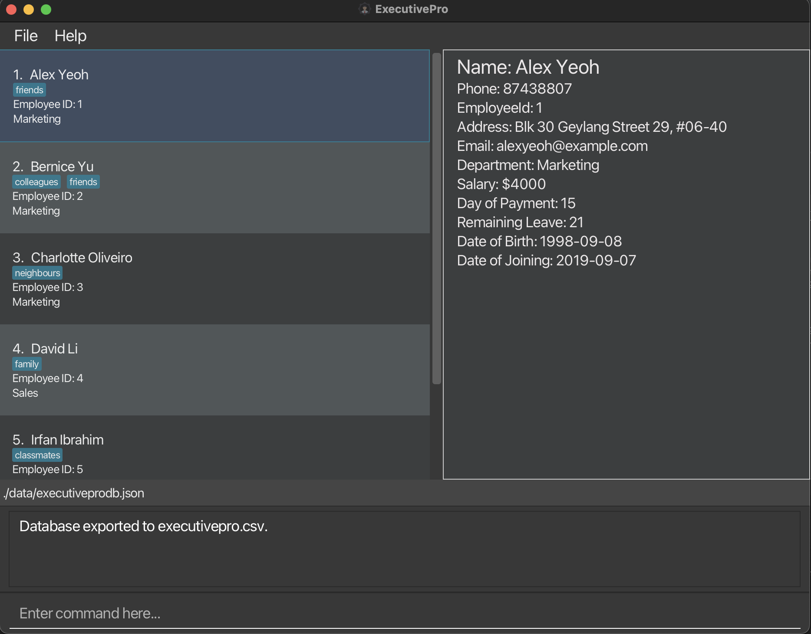

2. Go to the folder where you stored the `jar` file.
3. Locate the CSV file in the `data` folder.

If the command is successful, there should be CSV file that contains all the employees' details from the database,
and it should look something like the below image.

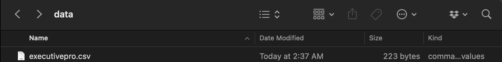

:warning: Caution: If you open the exported `.csv file` in `Excel`
and save it without ensuring that the date format is correct (YYYY-MM-DD), the dates might be saved in an incorrect format. 
This could lead to issues when importing the file using the batchadd command. 
To ensure the correct date format, please refer to the instructions [here](#u-opening-csv-files-in-excel--u).

--------------------------------------------------------------------------------------------------------------------

### Listing all employees : `list`

After searching for employees using the `find` command, you might realise that the left Panel no longer shows all the employees.
In order to get the full list back, simply use the list command and it will show a list of all employees and
their details in the ExecutivePro database.

Format: `list`

--------------------------------------------------------------------------------------------------------------------

### Editing an employee : `edit`

There could be instances where you have to edit the details of an employee. It could be due to a typo or the employee has changed
their personal particulars. Simply follow the format given below to edit those details.

Format: `edit EMPLOYEE_ID [n/NAME] [p/PHONE_NUMBER] [d/DEPARTMENT] [pr/PAYROLL] [e/EMAIL] [a/ADDRESS] [l/LEAVE_COUNT] [dob/DATE_OF_BIRTH] [doj/DATE_OF_JOINING] [t/TAG]...`

* Edits the details of the employee with the specified `EMPLOYEE_ID`. If such an employee doesn’t exist, an error message will be shown.
* At least one of the optional fields must be provided.
* Existing values will be updated to the input values.
* When editing tags, the existing tags of the person will be removed i.e adding of tags is not cumulative.
* You can remove all the person’s tags by typing `t/` without
  specifying any tags after it.

Examples:
*  `edit 1 p/91234567 e/johndoe@example.com` Changes the phone number and email address of the employee with ID `1` to be `91234567` and `johndoe@example.com` respectively.

--------------------------------------------------------------------------------------------------------------------

### Taking Leave : `leave`

There are plenty of instances where employees take leave and it is such a tedious task to manage employee leaves.
However, ExecutivePro allows you to keep track of the remaining leaves for each employee by simply following the format below.

Format: `leave EMPLOYEE_ID l/LEAVE_COUNT`

* Helps the employee with the specified `EMPLOYEE_ID` take leave. If such an employee doesn’t exist, an error message will be shown.
* Number of days of leave is specified by `LEAVE_COUNT`. If the employee does not have enough remaining leave, an error message will be shown.
* Existing leave count will decrease by the number of leave taken.

Examples:
*  `leave 1 l/3` Helps the employee with ID `1` take `3` days of leave.
--------------------------------------------------------------------------------------------------------------------

### Locating employees by keyword: `find`

As your database gets larger, scrolling and finding a certain employee becomes harder. However, ExecutivePro will ease this process
through the `find` command. By following the format below, ExecutivePro will show
a list of all employees in ExecutivePro whose names match the keyword provided.

Format: `find [*] KEYWORD [MORE_KEYWORDS]`

* If asterisk (`*`) is inputted, it displays list of employees matching _all_ the given keywords.
* If asterisk (`*`) is _not_ inputted, it displays list of employees matching _any_ of the given keywords.
* Even if the keyword just partially matches a part of employees full name, it is considered a match.
* For finding department, the keyword has to be a full match.
* Keyword is to search for the name and department of the employee only, not any other details.

Examples:
* `find John Sales` displays list of all employees whose full name contains a 'John' in it,
  or they are in the 'Sales' department
* `find * John Sales` displays list of all employees in the 'Sales' department who have a 'John' in their name

--------------------------------------------------------------------------------------------------------------------

### Filtering out employees: `filter`

As your database gets larger, finding employees based on certain conditions become more and more tedious.
However, ExecutivePro has just the right thing for you! `filter` will list out all the employees
satisfying the given condition.

Format: `filter FILTER_PARAMETER BOOLEAN_OPERATOR COMPARISON_AMOUNT`

* The filtering condition can be based on Payroll(`pr`) or the number of leaves remaining for an employee(`l`)
* The filtering condition checks the value of Payroll or number of leaves of an employee against a `COMPARISON_AMOUNT`
* The filtering condition can either be greater than(`>`), lesser than(`<`) or equal to(`=`) the `COMPARISON_AMOUNT`
* The `COMPARISON_AMOUNT` must be _non-negative_(greater than zero) and an _integer_

Examples:
* `filter pr > 1000` displays list of all employees whose payroll value is greater than 0
* `filter l = 1` displays list of all employees who have only 1 leave left

--------------------------------------------------------------------------------------------------------------------

### Deleting an employee : `delete`

As time passes, you might run into instances where an employee leaves the company, and that their details have to be removed
from the database. `delete` would help to remove the details of the employee with the specified `EMPLOYEE_ID`
from the ExecutivePro database.

Format: `delete EMPLOYEE_ID`

* You can delete the details of the employee with the specific `EMPLOYEE_ID`.
* The `EMPLOYEE_ID` refers to the id of an employee shown in the displayed employees list.
* The `EMPLOYEE_ID` **must be a positive integer** 1, 2, 3, …​

Examples:
`delete 2` deletes the employee with EMPLOYEE_ID 2 in ExecutivePro.

--------------------------------------------------------------------------------------------------------------------

### Changing the UI theme : `theme`

Want to tweak the look of ExecutivePro?
This feature allows you to choose one of two appearances for ExecutivePro to suit your needs.

The `light` theme (black text on light background) improves readability in well-lit surroundings.
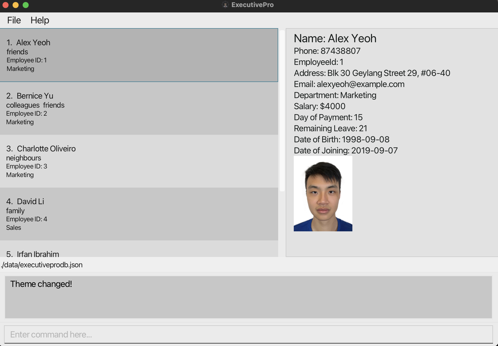

The `dark` theme (white text on dark background) can reduce eye strain in low-light conditions.
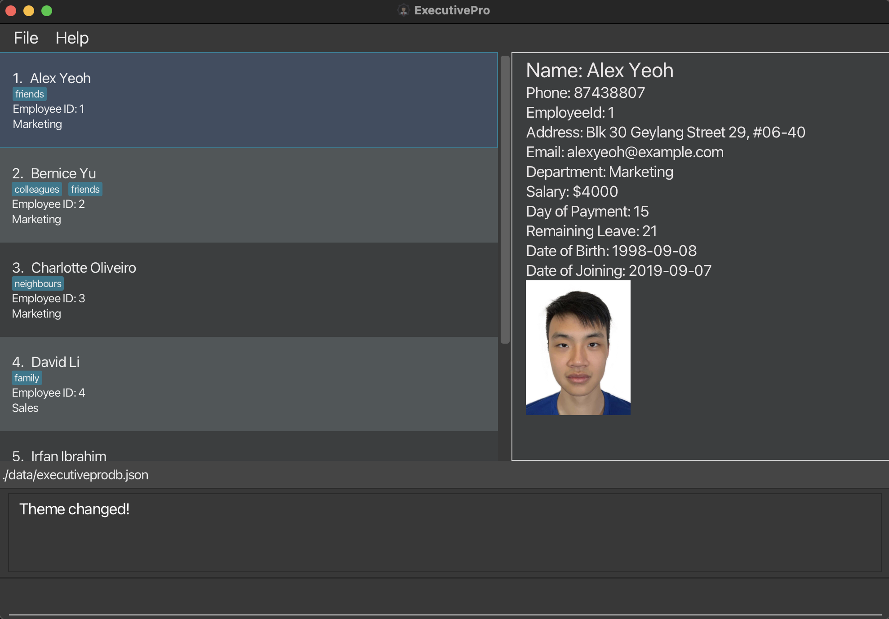
Format: `theme THEME_NAME`
* `THEME_NAME` is either `dark` (white text on dark background) or `light` (black text on white background).

Examples:
`theme light` applies the `light` theme to ExecutivePro.

:warning:
**Note:** Themes are not kept upon closing ExecutivePro

--------------------------------------------------------------------------------------------------------------------

### Setting an employee's picture : `setpicture`

This feature allows you to set a picture for the specified employee, so that you can upload ID photos for each employee.

Format: `setpicture EMPLOYEE_ID`

* Sets the picture of the employee with the specific `EMPLOYEE_ID`.
* The `EMPLOYEE_ID` refers to the id of an employee shown in the displayed employees list.
* The `EMPLOYEE_ID` **must be a positive integer** 1, 2, 3, …​

Examples:
To set the picture for the employee with EMPLOYEE_ID 2, enter `setpicture 2` into the command bar.
A file selector should appear, as shown below:
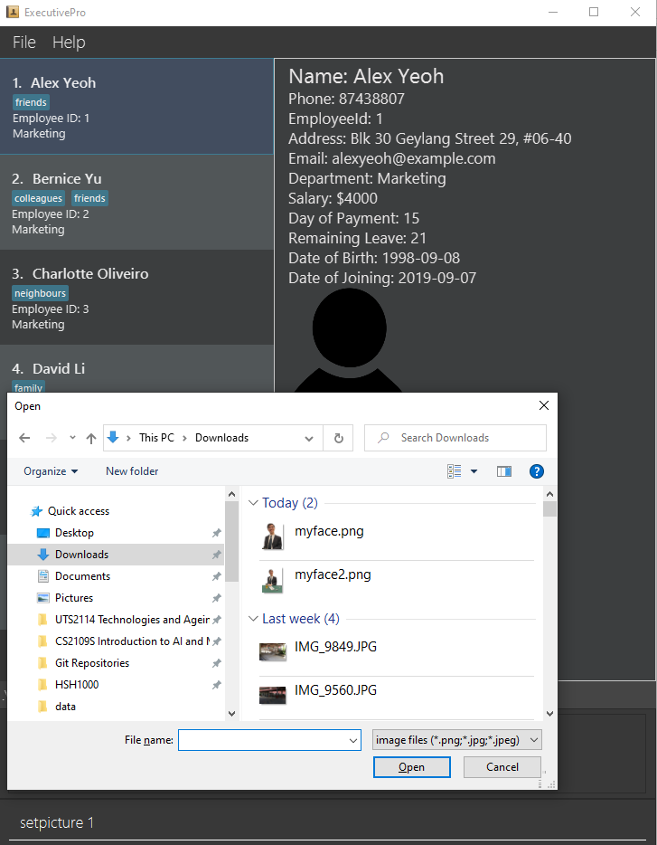

Search through your computer for the picture you want to set.
Select it by clicking the "Open" button on the file selector or by pressing the "Enter" key on your keyboard.
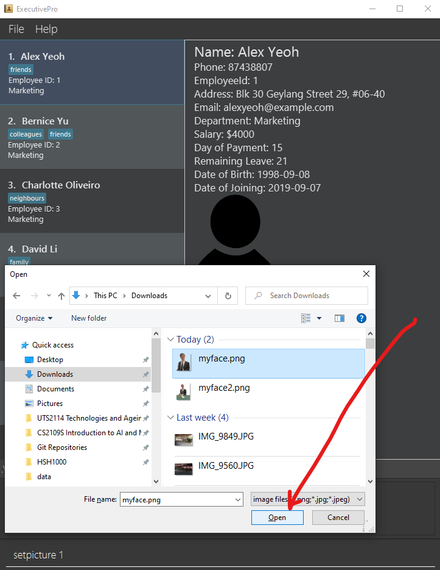

Click on the specified employee on the left, and your ExecutivePro should display their photo on the right like this.
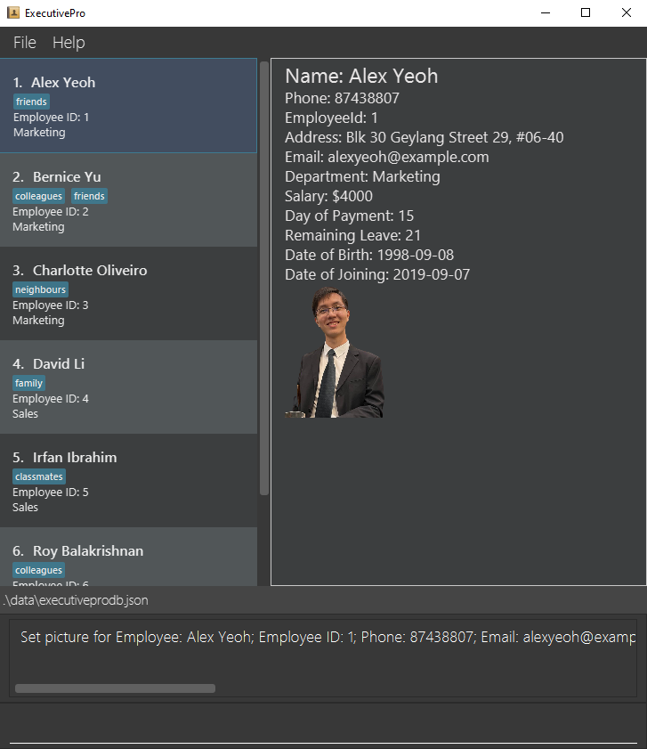

--------------------------------------------------------------------------------------------------------------------

### Exiting the program : `exit`

Exits the program.

Format: `exit`

--------------------------------------------------------------------------------------------------------------------

### Clearing the data: `clear`

Clears all the data currently stored in the database.

If you are a new user, you can use this command after you have experimented with ExecutivePro to start keying in your actual employee information.

:warning: **Caution:**
Once you run this command, you lose all data immediately.

Format: `clear`

--------------------------------------------------------------------------------------------------------------------

### Saving the data

ExecutivePro data are saved in the hard disk automatically after any command that changes the data. There is no need to save manually.

### Editing the data file

ExecutivePro data are saved as a JSON file `[JAR file location]/data/executivepro.json`. Advanced users are welcome to update data directly by editing that data file.

:warning: **Caution:**
If your changes to the data file makes its format invalid, ExecutivePro will discard all data and start with an empty data file at the next run.

--------------------------------------------------------------------------------------------------------------------

## FAQ

**Q**: How do I transfer my data to another Computer? 
**A**: Install the app on the other computer and overwrite the empty data file. This creates a new file that contains the data of your previous ExecutivePro home folder.
--------------------------------------------------------------------------------------------------------------------

## Order of Fields

This table describes the requirements and order of the fields.

| Index | Field           | Requirement    |
|-------|-----------------|----------------|
| 1.    | `NAME`          | **Compulsory** |
| 2.    | `PHONE`         | **Compulsory** |
| 3.    | `DEPARTMENT`    | **Compulsory** |
| 4.    | `PAYROLL`       | **Compulsory** |
| 5.    | `EMAIL`         | Optional       |
| 6.    | `ADDRESS`       | Optional       |
| 7.    | `LEAVECOUNT`    | Optional       |
| 8.    | `DATEOFBIRTH`   | Optional       |
| 9.    | `DATEOFJOINING` | Optional       |
| 10.   | `TAGS`          | Optional       |

--------------------------------------------------------------------------------------------------------------------

## Field Formats

This table describes the requirements for the input format of the fields.

| Field             | Prefix | Requirement                                                                                                                                                                                                                                                                                                                                                                                    | Example                                  |
|-------------------|--------|------------------------------------------------------------------------------------------------------------------------------------------------------------------------------------------------------------------------------------------------------------------------------------------------------------------------------------------------------------------------------------------------|------------------------------------------|
| `NAME`            | n/     | Only alphanumeric characters and spaces only.                                                                                                                                                                                                                                                                                                                                                  | `John Doe`, `Shawn Lee`                  |
| `PHONE`           | p/     | Contain numbers only from 3 digits long to 15 digits long                                                                                                                                                                                                                                                                                                                                      | `80101126`, `973629831`, `999`           |
| `DEPARTMENT`      | d/     | Only alphanumeric characters                                                                                                                                                                                                                                                                                                                                                                   | `Sales`, `General Management`            |
| `PAYROLL`         | pr/    | Two integers (salary and day of payment) separated by a space. Salary has to be an integer between `1` and `100000` (inclusive). Day of payment has to be an integer between `1` and `28` (inclusive). Salary and day limits are set to fit expected usage by a HR department.                                                                                                                 | `1000 15`, `10000 3`                     |
| `EMAIL`           | e/     | Be in the format of local-part@domain.ending. "local-part" should contain only alphanumeric characters and/or certain special characters (+\_.-), and cannot start or end with any special characters. "domain" should start and end with alphanumeric characters, must be at least 2 characters long, and can contain hyphens. "ending" part must be at least 2 characters long (e.g. ".com") | `johnd@example.com`, `shawn@example.edu` |
| `ADDRESS`         | a/     | Can take any value.                                                                                                                                                                                                                                                                                                                                                                            | `311, Clementi Ave 2, #02-25`            |
| `LEAVE`           | l/     | Must be an integer between between `0` and `365` (inclusive).                                                                                                                                                                                                                                                                                                                                  | `1`, `10`, `350`                         |
| `DATE_OF_BIRTH`   | dob/   | Date in YYYY-MM-DD format.                                                                                                                                                                                                                                                                                                                                                                     | `2022-01-10`                             |
| `DATE_OF_JOINING` | doj/   | Date in YYYY-MM-DD format.                                                                                                                                                                                                                                                                                                                                                                     | `2022-12-10`                             |
| `TAG`             | t/     | Only alphanumeric characters and spaces only.                                                                                                                                                                                                                                                                                                                                                  | `Software Engineer`, `Manager`           |

--------------------------------------------------------------------------------------------------------------------

## Command Summary

| Action          | Format, Examples                                                                                                                                                                                                                                                                                                |
|-----------------|-----------------------------------------------------------------------------------------------------------------------------------------------------------------------------------------------------------------------------------------------------------------------------------------------------------------|
| **Help**        | `help`                                                                                                                                                                                                                                                                                                          |
| **Add**         | `add n/NAME p/PHONE_NUMBER d/DEPARTMENT pr/PAYROLL [e/EMAIL] [a/ADDRESS] [l/LEAVE_COUNT] [dob/DATE_OF_BIRTH] [doj/DATE_OF_JOINING] [t/TAG]...`   e.g., `add n/John Doe p/98765432 d/Marketing pr/4000 15 e/johnd@example.com a/John street, block 123, #01-01 l/19 dob/2000-04-21 doj/2022-01-04 t/friends ` |
| **BatchAdd**    | `batchadd FILENAME`   e.g., `batchadd executivepro.csv`                                                                                                                                                                                                                                                      |
| **BatchExport** | `batchexport FILENAME`   e.g., `batchexport exported_database.csv`                                                                                                                                                                                                                                           |
| **List**        | `list`                                                                                                                                                                                                                                                                                                          |
| **Edit**        | `edit EMPLOYEE_ID [n/NAME] [p/PHONE_NUMBER] [d/DEPARTMENT] [pr/PAYROLL] [e/EMAIL] [a/ADDRESS] [l/LEAVE_COUNT] [dob/DATE_OF_BIRTH] [doj/DATE_OF_JOINING] [t/TAG]...`  e.g.,`edit 1 p/91234567 e/johndoe@example.com`                                                                                          |
| **Leave**       | `leave EMPLOYEE_ID l/LEAVE_COUNT`  e.g.,`leave 1 l/3`                                                                                                                                                                                                                                                        |
| **Find**        | `find KEYWORD [MORE_KEYWORDS]`  e.g., `find James Jake`                                                                                                                                                                                                                                                      |
| **Delete**      | `delete EMPLOYEE_ID`  e.g., `delete 3`                                                                                                                                                                                                                                                                       |
| **Theme**       | `theme THEME_NAME`   e.g., `theme light`                                                                                                                                                                                                                                                                     |
| **SetPicture**  | `setpicture EMPLOYEEID`   e.g., `setpicture 2`                                                                                                                                                                                                                                                               |
| **Exit**        | `exit`                                                                                                                                                                                                                                                                                                          |
| **Clear**       | `clear`                                                                                                                                                                                                                                                                                                         |
| **Filter**      | `filter FILTER_PARAMETER BOOLEAN_OPERATOR COMPARISON_AMOUNT`   e.g., `filter pr > 1500`                                                                                                                                                                                                                      |
