## Table of Contents

- [Introduction](#introduction)
- [Purpose of this User Guide](#purpose-of-this-user-guide)
- [Quick Start](#quick-start)
  - [Installation](#installation)
  - [For Windows](#for-windows)
  - [For Mac](#for-mac)
  - [Navigating Vimification](#navigating-vimification)
  - [Exiting Vimification](#exiting-vimification)
  - [Trying out the commands](#trying-out-the-commands)
- [Using the commands](#using-the-commands)
- [General information on a task's attributes](#general-information-on-a-tasks-attributes)
- [Information on commands' parameters](#information-on-commands-parameters)
- [Features and commands](#features-and-commands)
  - [Viewing help](#viewing-help)
  - [Adding task](#adding-task)
  - [Inserting parameters to a task](#inserting-parameters-to-a-task)
  - [Deleting task](#deleting-task)
  - [Deleting parameters of a task](#deleting-parameters-of-a-task)
  - [Editing task](#editing-task)
  - [Filtering task](#filtering-task)
  - [Sorting task](#sorting-task)
  - [Refreshing task list](#refreshing-task-list)
  - [Undoing the previous command](#undoing-the-previous-command)
  - [Using macro](#using-macro)
  - [Defining new macro](#defining-new-macro)
  - [Deleting a macro](#deleting-a-macro)
  - [View all macros defined in the application](#view-all-macros-defined-in-the-application)
  - [Exiting the application](#exiting-the-application)
  - [Saving the task list data](#saving-the-task-list-data)
  - [Editing existing task list data](#editing-existing-task-list-data)
  - [Editing existing macro data](#editing-existing-macro-data)
- [Command summary](#command-summary)

## Introduction

**Vimification** is a **desktop app** built for Vim enthusiasts to manage tasks and deadlines, optimized for use via a **Command Line Interface (CLI)** while still having the benefits of a **Graphical User Interface (GUI)**.

Since **Vimification** is modeled after **Vim**, the command syntax for the Vimification CLI closely mimics Vim.

<a href="#table-of-contents">Back to Top &#8593;</a>

## Purpose of this User Guide

This user guide aims to help you make the most of Vimification's powerful and intuitive interface by providing a comprehensive overview of its vim-like features and functionality.

Whether you're new to the app or an experienced Vim user, the guide will walk you through everything you need to know to efficiently manage your tasks and deadlines. You'll learn how to create and organize tasks, set due dates, prioritize your work, and track your progress. The guide also includes troubleshooting tips and solutions to common issues, ensuring that you can use Vimification with confidence and ease.

<a href="#table-of-contents">Back to Top &#8593;</a>

## Quick Start

### Installation

1. Download the latest `vimification.jar` from [here](https://github.com/AY2223S2-CS2103T-T15-3/tp/releases).

2. Save the file in your intended folder.

### For Windows

1. Make sure that you have Java version `11` or higher installed on your computer.
2. Double-click the application file to start the app.
3. After a few seconds, the application should launch, and a graphical user interface (GUI)similar to the one shown below will appear.

**NOTE: On Windows, the text in Vimification may occasionally wrap onto the next line. To avoid this issue, please enlarge the application window as needed.**

### For Mac

1. Make sure that you have Java version `11` Zulu SDK installed on your computer.
2. Open the Terminal app on your Mac, and navigate to the folder where you have saved the JAR file by running the command `cd` into the path of the folder.
3. Run the command `java -jar vimification.jar` in the terminal.
4. After a few seconds, the application should launch, and a graphical user interface (GUI) similar to the one shown below will appear

**NOTE: On Mac, the text in Vimification may occasionally wrap onto the next line. To avoid this issue, please enlarge the application window as needed.**

### For Linux

1. Make sure that you have Java version `11` Zulu SDK installed on your computer.
2. Open the Terminal, and navigate to the folder where you have saved the JAR file by running the command `cd` into the path of the folder.
3. Run the command `java -jar vimification.jar` in the terminal.
4. After a few seconds, the application should launch, and a graphical user interface (GUI) similar to the one shown below will appear

**NOTE: In Linux, it is possible to resize the Vimification window to a size smaller than the default. If you experience difficulties viewing tasks, please resize the window to full-screen.**

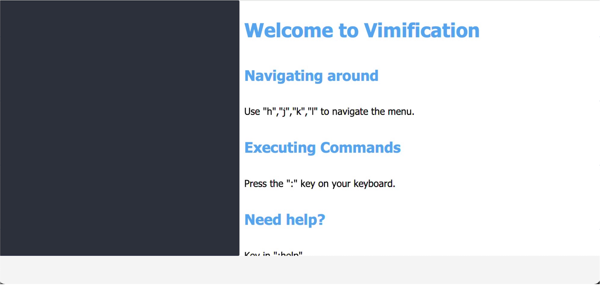
  

<a href="#table-of-contents">Back to Top &#8593;</a>

### Navigating Vimification

Similar to Vim, you can use the `j` and `k` (or `↓` and `↑`) keys to navigate down and up the task-list, respectively.

Assuming you already have tasks loaded in Vimification (we will show you how to add tasks later), pressing `j` will move you down the list.

<table>
  <tr>
    <th>
      Before
    </th>
    <th>
      After
    </th>
  </tr>
  <tr>
    <td>
      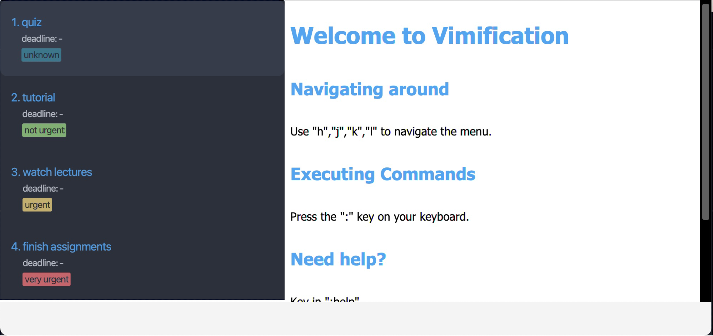
    </td>
    <td>
      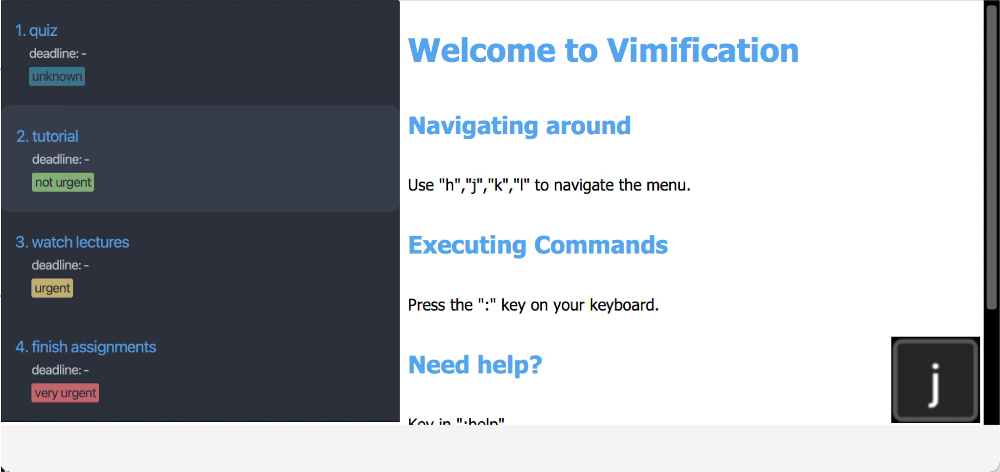
    </td>
  </tr>
</table>

Similarly, pressing `k` brings you up the task list.

<table>
  <tr>
    <th>
      Before
    </th>
    <th>
      After
    </th>
  </tr>
  <tr>
    <td>
      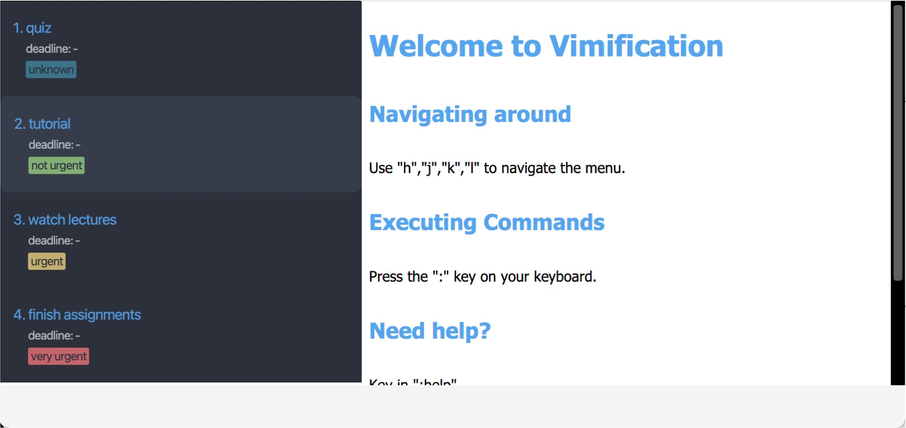
    </td>
    <td>
      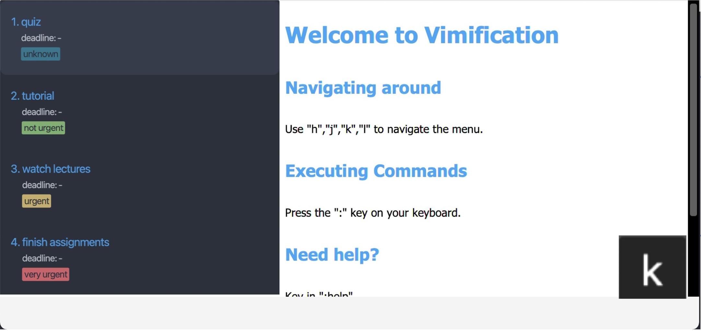
    </td>
  </tr>
</table>

In Vim, pressing `l` moves the cursor to the right. In Vimification, however, pressing `l` will move the focus to the right-side panel and display the details of the currently selected task.

<table>
  <tr>
    <th>
      Before
    </th>
    <th>
      After
    </th>
  </tr>
  <tr>
    <td>
      
    </td>
    <td>
      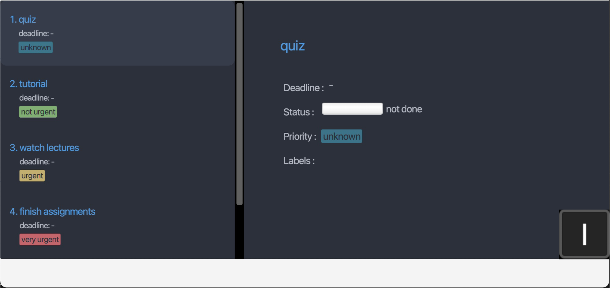
    </td>
  </tr>
</table>

In Vim, pressing `h` moves the cursor to the left. In Vimification, however, pressing `h` will move the cursor back to the task list, and hence clearing the details displayed in the right-side panel.

<table>
  <tr>
    <th>
      Before
    </th>
    <th>
      After
    </th>
  </tr>
  <tr>
    <td>
      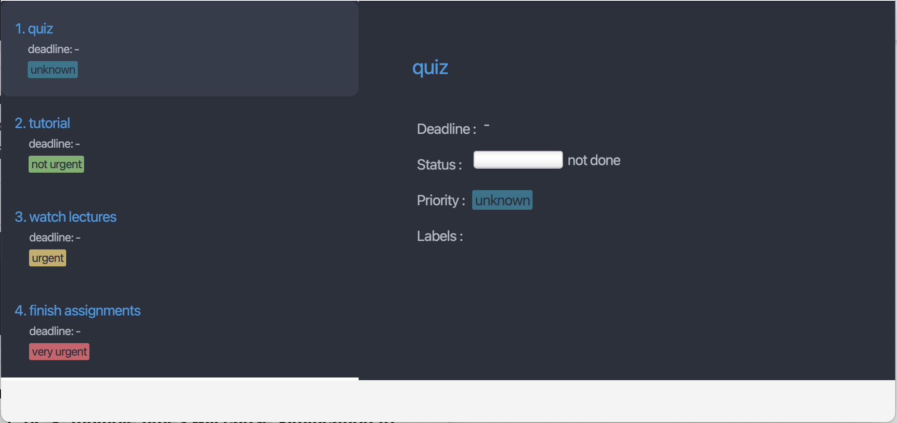
    </td>
    <td>
      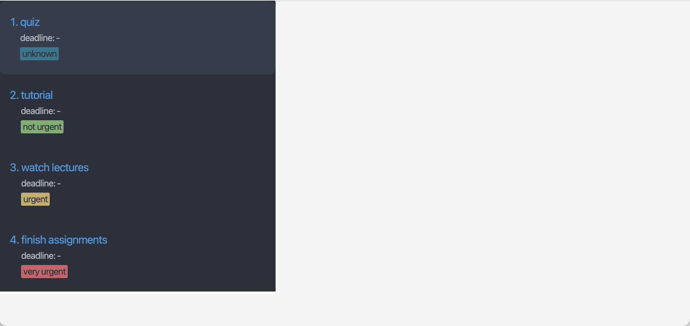
    </td>
  </tr>
</table>

**NOTE: If you find yourself unable to navigate the task list, try pressing `j` or `k` multiple times to refocus Vimification onto the task list. Alternatively, you can click on the task list with your mouse to recalibrate the focus.**

**NOTE: Using arrow keys is not recommended since they are not supported.**

<a href="#table-of-contents">Back to Top &#8593;</a>

### Exiting Vimification

Similar to Vim, you can exit Vimification by typing `:quit` or `:q!` on your keyboard while using Vimification.

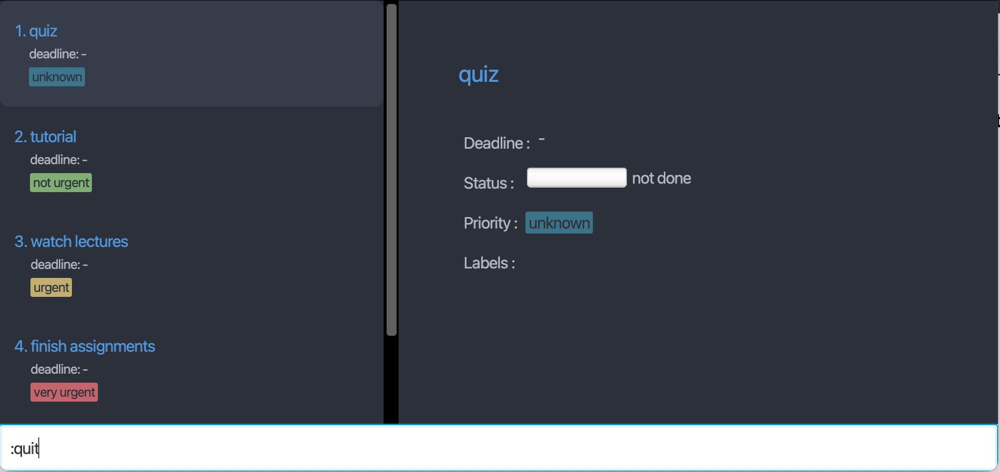
  

<a href="#table-of-contents">Back to Top &#8593;</a>

### Trying out the commands

Similar to Vim, you can enter command mode in Vimification by **pressing the `:` key** on your keyboard. This will move the focus to the command input field located at the bottom of the application.

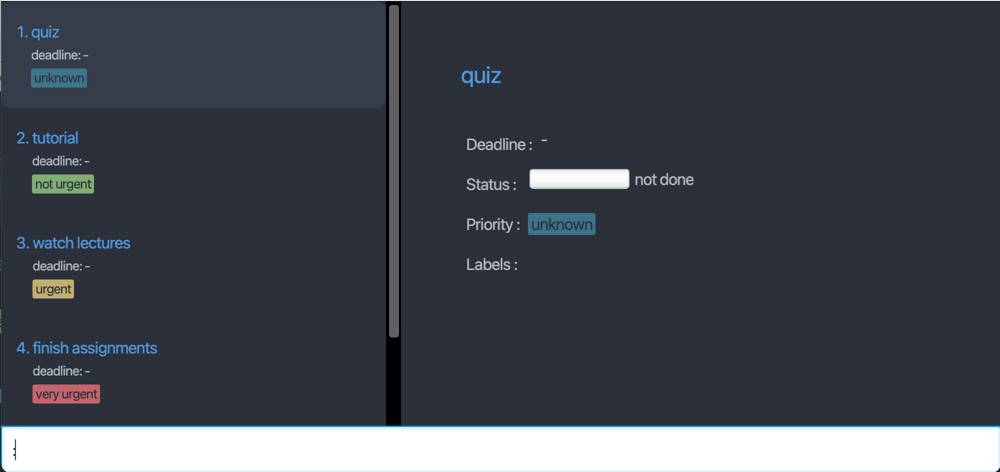

Type the command in the command box and press the `Enter` key to execute it. For example, typing **`:help`** and pressing `Enter` will open the help window.

Some example commands you can try:

- `:a "tutorial"` : Adds a task with the title `tutorial` to Vimification.

- `:a "quiz for cs2103T" -d 2023-04-01` : Adds a task with the title `quiz for cs2103T` and deadline `2023-04-01` to Vimification.

- `:d 2` : Deletes the 2nd task shown in the current list.

- `:quit` : Exits Vimification.

- `:help` : Brings up the manual page.

2. Refer to the [Features and commands](#features-and-commands) below for details of each command.

<a href="#table-of-contents">Back to Top &#8593;</a>

## Using the commands

Similar to Vim, you can enter command mode in Vimification by **pressing the `:` key** on your keyboard. This will move the focus to the command input field located at the bottom of the application.

**NOTE: Besides the navigation commands (`h`, `j`, `k`, `l`), every command always starts with a colon (`:`).**

<a href="#table-of-contents">Back to Top &#8593;</a>

## General information on a task's attributes

In Vimification, a task can has the following attributes:

| Attribute | Meaning & Purpose                                    | Flag | Accepted Values                                                              |
| --------- | ---------------------------------------------------- | ---- | ---------------------------------------------------------------------------- |
| Title     | Name or brief description of a task.                 | `-t` | One single word or a phrase enclosed in quotation marks (`""` or `''`)\*.    |
| Deadline  | The date (and time) the task is due at.              | `-d` | In the format of `yyyy-MM-dd`, `yyyy-MM-dd HH:mm`, `EEE` or `EEE HH:mm`^.    |
| Labels    | The labels that the task has.                        | `-l` | One single word, or any phrase enclosed in quotation marks (`""` or `''`)\*. |
| Status    | Status of a task, indicating that is it done or not. | `-s` | 0, 1, or 2. See below for more details.                                      |
| Priority  | How important/urgent a task is.                      | `-p` | 0, 1, 2 or 3. See below for more details.                                    |

^`EEE` format accepts the first 3 letters of a day of week (`Mon`, `Tue`, etc.), case insensitive.

\*For a title or label, if the phrase is one single word, the quotation marks are optional. Another 2 constraints on the quotation marks are:

- There can be at most 2 nested quotation marks &nbsp;&nbsp;&nbsp; (so `"Say 'SUPER "Cheesy"' "` and `'Say "SUPER 'Cheesy'" '` are not allowed).
- 2 nested quotation marks cannot be the same types &nbsp;&nbsp;&nbsp; (so `"Say "cheese" "` and `'Say 'cheese' '` are not allowed).

| Priority | Meaning          |
| -------- | ---------------- |
| 0        | Unknown priority |
| 1        | Very urgent      |
| 2        | Urgent           |
| 3        | Not urgent       |

| Status | Meaning     |
| ------ | ----------- |
| 0      | Not done    |
| 1      | In progress |
| 2      | Completed   |

<a href="#table-of-contents">Back to Top &#8593;</a>

## Information on commands' parameters

_Take note of how the command format is being interpretted, to know what parameters it requires._

Flags like `-d`, `-l` and `-p` act as identifier for the parameter that comes immediately after the flag.

- e.g. `:a "<title>" [-d <deadline>]`, the `-d` indicates the deadline attribute of a task.

Words in **angle brackets** are **compulsory** parameters to be supplied by the user.

- e.g. in `:a <title>`, the user must provide the `<title>` parameter, for example, `:a "Do weekly quiz"`.

Words in **square brackets** are **optional** parameters to be supplied by the user.

- e.g. `:a "<title>" [-d <deadline>]`, the user can provide flag `-d` with the `<deadline>` parameter (but this is not compulsory).

Bracketed items with `…`​ behind means that user can provide multiple parameters.

- e.g. `:a <title> [-l <label>]…​`, for example, `:a "Do OP2 slides" -l cs2101` and `:a "Do OP2 slides" -l cs2101 -l presentation` are both acceptable.

Parameters identified by flags can be in any order.

- e.g. `:a "Do OP2 slides" -l cs2101 -p 1`, `:a "Do OP2 slides" -p 1 -l cs2101` are both acceptable.

Some flags can be used with alternative forms.

- e.g. `-d` flag (to identify the deadline attribute of a task) can also be used with `--deadline`.

Redundant parameter(s) at the end will raise an error, and the command will not be executed.

- e.g. if the user inputs `:help 123`, the command `help` will not be executed, and they will receive an error message.

<a href="#table-of-contents">Back to Top &#8593;</a>

## Features and commands

### Viewing help

Show a manual page on the right hand side of Vimification.

<table>
  <tr>
    <th>
      Before
    </th>
    <th>
      After
    </th>
  </tr>
  <tr>
    <td>
      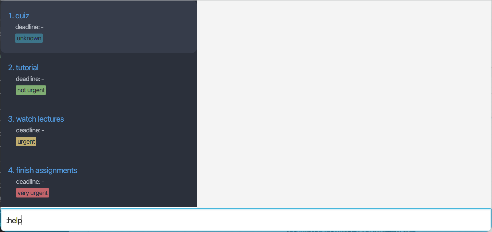
    </td>
    <td>
      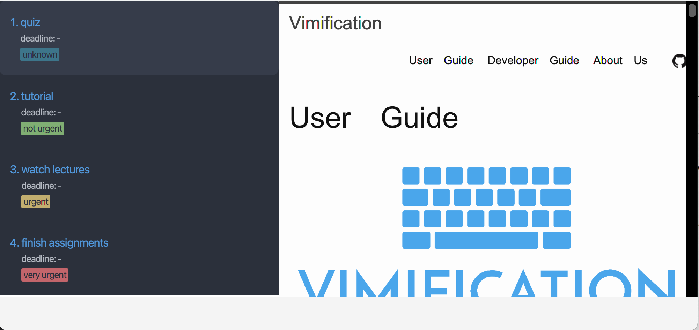
    </td>
  </tr>
</table>

Format: `:help`

<a href="#table-of-contents">Back to Top &#8593;</a>

### Adding task

Add a task to the current task list.

Format: `:a "<title>" [-d <deadline>] [-l <label>]... [-p <priority>]`

| Parameter    | Detail                              | Example        |
| ------------ | ----------------------------------- | -------------- |
| `<title>`    | Title of the task                   | `"CS2103T UG"` |
| `<deadline>` | Deadline of the task                | `2023-03-31`   |
| `<label>`    | Label given to the task             | `presentation` |
| `<priority>` | Priority level assigned to the task | `1`            |

| Flag | Alternative form |
| ---- | ---------------- |
| `-d` | `--deadline`     |
| `-l` | `--label`        |
| `-p` | `--priority`     |

Example of command:

1. `:a "Enhance CS2103T tp user guide" -d 2023-03-31 -l cs2103t -p 1`
2. `:a "Play Touhou Project" --priority 1`

Note:

- Duplicated label(s) provided as argument(s) will be discarded.

<a href="#table-of-contents">Back to Top &#8593;</a>

### Inserting parameters to a task

Insert the parameters as specified by the flag of a task to the current task list as specified by the task number.

Format: `:i <task_index> [-d <deadline>] [-l <label>]...`

| Parameter      | Detail                               | Example                                           |
| -------------- | ------------------------------------ | ------------------------------------------------- |
| `<task_index>` | Index of the target task             | `3` (assuming the task list has at least 3 tasks) |
| `<deadline>`   | Deadline of task you want to insert  | `2023-04-05`                                      |
| `<label>`      | Name of the label you want to insert | `cs2103t`                                         |

| Flag | Alternative form |
| ---- | ---------------- |
| `-d` | `--deadline`     |
| `-l` | `--label`        |

Example of command:

1. `:i 3 -d 2023-04-5` inserts the deadline to task 3
2. `:i 3 -l cs2103t` inserts the label "cs2103t" to task 3

Note:

- At least one of the flags must be present.
- The index refers to the index number shown in the displayed task list.
- The index must be a positive integer, i.e 1, 2, 3, etc.
- The index must not exceed the number of tasks in the displayed task list.
- Duplicated label(s) provided as argument(s) will be discarded.
- If you try to insert a deadline into a task that already has a deadline, the command will fail.
- If you try to insert a label that already exists, the command will fail.

<a href="#table-of-contents">Back to Top &#8593;</a>

### Deleting task

Delete a task from the current task list by specifying the task number.

Format: `:d <task_index>`

| Parameter      | Detail                               | Compulsory | Example                                           |
| -------------- | ------------------------------------ | ---------- | ------------------------------------------------- |
| `<task_index>` | Index of the task you want to delete | Yes        | `3` (assuming the task list has at least 3 tasks) |

Example of command:

1. `:d 3` deletes task 3

Note:

- The index refers to the index number shown in the displayed task list.
- The index must be a positive integer, i.e 1, 2, 3 etc.
- The index must not exceed the number of tasks in the displayed task list.

<a href="#table-of-contents">Back to Top &#8593;</a>

### Deleting parameters of a task

Delete the parameters as specified by the flag of a task from the current task list as specified by the task number.

Format: `:d <task_index> [-d] [-l <label>]...`

| Parameter      | Detail                               | Example                                           |
| -------------- | ------------------------------------ | ------------------------------------------------- |
| `<task_index>` | Index of the target task             | `3` (assuming the task list has at least 3 tasks) |
| `<label>`      | Name of the label you want to delete | `cs2103t`                                         |

| Flag | Alternative form |
| ---- | ---------------- |
| `-d` | `--deadline`     |
| `-l` | `--label`        |

Example of command:

1. `:d 3 -d` deletes the deadline of task 3
2. `:d 3 -l cs2103t` deletes the label "cs2103t" of task 3

Note:

- At least one of the flags must be present. Otherwise, the command will be treated as deleting the task at index number.
- The index refers to the index number shown in the displayed task list.
- The index must be a positive integer, i.e 1, 2, 3 etc.
- The index must not exceed the number of tasks in the displayed task list.
- Duplicated label(s) provided as argument(s) will be discarded.
- If you try to delete the deadline of a task that has no deadline, the command will fail.
- If you try to delete a non-existent label, the command will fail.

<a href="#table-of-contents">Back to Top &#8593;</a>

### Editing task

Edit the parameters as specified by the flag of a task in the current task list as specified by the task number.

Format: `:e <task_index> [-t "<title>"] [-d <deadline>] [-s <status>] [-p <priority>] [-l <previous_label> <new_label>]...`

| Parameter          | Detail                              | Example         |
| ------------------ | ----------------------------------- | --------------- |
| `"<title>"`        | New title of task                   | `"CS2103T UG"`  |
| `<deadline>`       | New deadline of the task            | `2023-03-31`    |
| `<status>`         | New status of task                  | `2`             |
| `<priority>`       | Priority level assigned to the task | `1`             |
| `<previous_label>` | Name of the label you want to edit  | `cs2103t`       |
| `<new_label>`      | New name of the label               | `group project` |

| Flag | Alternative form |
| ---- | ---------------- |
| `-t` | `--title`        |
| `-d` | `--deadline`     |
| `-l` | `--label`        |
| `-s` | `--status`       |
| `-p` | `--priority`     |

Example of command:

1. `:e 3 -t "quiz"` edits the title of task 3 to "quiz"
2. `:e 3 -d 2023-04-05` edits the deadline of task 3 to 2023-04-05
3. `:e 3 -s 1` edits the status of task 3 to "in progress"
4. `:e 3 -p 1` edits the priority of task 3 to "urgent"
5. `:e 3 -l label1 label2` edits "label1" of task 3 to "label2"

Note:

- At least one of the flags must be present.
- The index refers to the index number shown in the displayed task list.
- The index **must be a positive integer**, i.e 1, 2, 3 etc.
- The index must not exceed the number of tasks in the displayed task list.
- If you try to edit the deadline of a task that has no deadline, the command will fail.
- If you try to edit a non-existent label, or edit an existing label into another existing label, the command will fail.

<a href="#table-of-contents">Back to Top &#8593;</a>

### Filtering task

Filter by the parameters as specified by the flag.

Format: `:f [-a] [-o] [-w <keywords>] [--before <date>] [--after <date>] [-s <status>] [-p <priority>] [-l <label>]...`

| Parameter    | Detail                                         | Example        |
| ------------ | ---------------------------------------------- | -------------- |
| `<keywords>` | Keywords to filter                             | `"CS2103T UG"` |
| `<date>`     | Deadline of the task to filter before or after | `2023-03-31`   |
| `<status>`   | Status of task to filter                       | `2`            |
| `<priority>` | Priority level of task to filter               | `1`            |
| `<label>`    | Label of task to filter                        | `cs2103t`      |

| Flag       | Alternative form |
| ---------- | ---------------- |
| `-a`       | `--and`          |
| `-o`       | `--or`           |
| `-w`       | `--keyword`      |
| `--before` | None             |
| `--after`  | None             |
| `-l`       | `--label`        |
| `-s`       | `--status`       |
| `-p`       | `--priority`     |

Example of command:

1. `:f -w "quiz"` filter for tasks with "quiz" as keyword
2. `:f --before 2023-04-05` filter for tasks with deadline before 2023-04-05
3. `:f -s 1` filter for tasks with the status "in progress"
4. `:f -p 1` filter for tasks with the priority "urgent"
5. `:f -a -l "label1" -l "label2"` filter for tasks contain "label1" and "label2"
6. `:f -o -l "label1" -l "label2"` filter for tasks contain "label1" or "label2"

Note:

- If both flag `-a` and flag `-o` are not provided, you can only use a single argument.
- You cannot use flag `-a` and flag `-o` at the same time.
- If flag `-a` is provided, the conditions are combined with **and** operator. If there is no other flag, all tasks will be selected.
- If flag `-o` is provided, the conditions are combined with **or** operator. If there is no other flag, no task will be selected.

<a href="#table-of-contents">Back to Top &#8593;</a>

### Sorting task

Sort by the parameters as specified by the flag.

Format: `:s [-d] [-s] [-p]`

| Flag | Alternative form |
| ---- | ---------------- |
| `-d` | `--deadline`     |
| `-s` | `--status`       |
| `-p` | `--priority`     |

Example of command:

1. `:s -s` sort for tasks by status
2. `:s -d` sort for tasks by deadline
3. `:s -p` sort for tasks by priority level

Note:

- Only one flag should be present.

<a href="#table-of-contents">Back to Top &#8593;</a>

### Refreshing task list

Refresh the task list and revert it back to the original state by removing any filter or sort.

Format: `:refresh`

### Undoing the previous command

Format: `:undo`

You can undo the previous command by simply keying in `:undo`.

### Using macro

Sometimes we might be adding the exact same task every week, say `:a "Do CS2103 weekly quiz"`. Typing repeated and identical command could be time consuming and Vimification is aware of it. This is where the **macro feature** comes in.

Macro is a customisable template-like command, to streamline the process of running repeated commands. For example, you can define a macro `cs2103t` that maps to `a "Do CS2103 weekly quiz" -d Fri 14:00`. Afterward, whenever you type `:cs2103t`, your input will be transformed into `:a "Do CS2103 weekly quiz" -d Fri 14:00`.

### Defining new macro

Format: `:macro -a <macro> <command_string>`

| Parameter          | Detail                                         | Example          |
| ------------------ | ---------------------------------------------- | ---------------- |
| `<macro>`          | The macro to be defined, can only be one word  | `l2103`          |
| `<command_string>` | The command string to be mapped with the macro | `"f -l cs2103t"` |

Note:

- If the macro is already defined, this command will replaced the old mapping with the new one.

<a href="#table-of-contents">Back to Top &#8593;</a>

### Deleting a macro

Format: `macro -d <macro>`

| Parameter | Detail                                        | Example |
| --------- | --------------------------------------------- | ------- |
| `<macro>` | The macro to be deleted, can only be one word | `l2103` |

### View all macros defined in the application

You can view all macros and their mappings by keying in `:macro -l`.

### Exiting the application

(Somwhat) similar to Vim, we can use the `:quit` or `:q!` to exit the application.

### Saving the task list data

The task list data is saved in the hard disk automatically after any command that changes the data. There is no need to save manually.

### Editing existing task list data

Existing task list data is saved at a JSON file `[JAR file location]/.vimification/tasklist.json`. Advanced users are welcome to update data directly by editing that data file.

### Editing existing macro data

Existing macro data is saved at a JSON file `[JAR file location]/.vimification/macromap.json`. Users can edit this file directly to manages the macros that can be used in the application.

:exclamation: **Caution:**
If your changes to the data file makes its format invalid, Vimification will discard all data and start with an empty data file at the next run.

<a href="#table-of-contents">Back to Top &#8593;</a>

## Command summary

| Action               | Format                                                                                                          |
| -------------------- | --------------------------------------------------------------------------------------------------------------- |
| View help            | `:help`                                                                                                         |
| Add task             | `:a <title> [-d <deadline>] [-p <priority>] [-l <label>]...`                                                    |
| Insert parameter     | `:i <task_index> [-d <deadline>] [-l <label>]...`                                                               |
| Delete task          | `:d <task_index>`                                                                                               |
| Delete parameter     | `:d <task_index> [-d] [-l <label>]...`                                                                          |
| Edit parameter       | `:e <task_index> [-t <title>] [-d <deadline>] [-s <status>] [-p <priority>] [-l <old_label> <new_label>]...`    |
| Filter               | `:f [-a] [-o] [-w <keywords>] [--before <date>] [--after <date>] [-s <status>] [-p <priority>] [-l <label>]...` |
| Sort                 | `:s [-s] [-d] [-p]`                                                                                             |
| Refresh              | `:refresh`                                                                                                      |
| Undo                 | `:undo`                                                                                                         |
| Define macro         | `:macro -a <macro> <command_string>`                                                                            |
| Delete macro         | `:macro -d <macro>`                                                                                             |
| List macro           | `:macro -l`                                                                                                     |
| Exit the application | `:quit`, `:q!`                                                                                                  |

<a href="#table-of-contents">Back to Top &#8593;</a>

