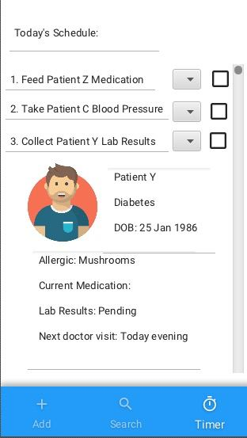

Patientist is a desktop app used for managing patients and staff within a medical facility. This application is optimised 
for use via a Command Line Interface (CLI), while still having a Graphical User Interface (GUI) for users to fall back 
on. If you are a strong typist and are familiar with the system, Patientist can get your tasks done faster and more 
reliably than traditional GUI based apps.

* Table of Contents
{:toc}

--------------------------------------------------------------------------------------------------------------------

## Quick start
### To be updated

--------------------------------------------------------------------------------------------------------------------
# Patientist User Guide
## Notes about formatting
* Words in UPPER_CASE are user supplied parameters, e.g. `addpat n/NAME`: `NAME` is a parameter, and the command can be used as add `n/John Doe`
* Items in square brackets are optional parameters, e.g. `addpat n/NAME [t/TAG]` can be used as `addpat n/John Doe t/urgent` or simply as `addpat n/John Doe`
* Items with … after them can be specified 0 or more times, e.g. `[t/TAG]...` means it is valid to not include a tag, or you can chain 1 or more `t/TAG` expressions
* Extraneous parameters for commands that take in exactly 0 parameters will be ignored
# Features:

---
## Viewing help: help
Shows a popup explaining how to access the user guide, which is the help page.

Format: `help`

---
## Adding a patient: addpat
Adds a new patient to the system, and places them in the `WARD_NAME` assigned.
Tags attached to a user are meant to be short notes that do not fit into any other category of patient details that can be added.

**Warning: `WARD_NAME` is case sensitive.** `block B ward 2` will refer to a different ward from `Block b Ward 2`.

### Format: `add n/PATIENT_NAME pid/PATIENT_ID_NUMBER w/WARD_NAME [t/TAG]...`

`PATIENT_ID_NUMBER` should be unique to each patient. This is not case sensitive. A123456789B is identical to a123456789b.
**This input will be capitalised automatically.**\
`PATIENT_NAME` need not be unique.

### Examples:
`addpat n/Jonathan Lee pid/A12345679B w/block B ward 2`

---
## Adding prescriptions/instructions for patient: addpresc
Adds `PRESCRIPTION_OR_INSTRUCTION` in the prescriptions and instructions field for the `PATIENT` specified.
The patient can be specified by `PATIENT_ID_NUMBER`, the patient’s ID number.
(Consider changing this in future iterations to not having to key in prescription in CLI, instead a new editpresc command opens a text editor for the patient’s txt prescription file)

### Format: `addpresc pid/PATIENT_ID_NUMBER p/PRESCRIPTION_OR_INSTRUCTION`

### Examples:
`addpresc pid/A0123456789B p/paracetamol 500mg`

---
## Adding a staff to a ward: addstf
Assigns specified `STAFF_NAME` to the specified `WARD_NAME`.
The STAFF_NAME will be displayed in the list of personnel in charge of the ward.

**Warning: `WARD_NAME` is case sensitive.** `block B ward 2` will refer to a different ward from `Block b Ward 2`

### Format: `addstf n/STAFF_NAME w/WARD_NAME`

### Examples:
`addstf n/Dr. Mallory Wong  w/block B ward 2`\
`addstf n/Nurse Joy w/block B ward 2`

---
## Adding a ward to the system: addward
Creates an empty ward with the specified `WARD_NAME`.

**Warning: `WARD_NAME` is case sensitive.** `block B ward 2` will refer to a different ward from `Block b Ward 2`

### Format: `addward n/WARD_NAME`
`WARD_NAME` must be unique and cannot be the same as any existing name. This field is case sensitive.

### Examples:
`addward n/block B ward 2` will create a new empty ward called block B ward 2\
`addward n/block C ward 1` will create a new empty ward called block C ward 1

---
## Listing all patients: lspat
Lists all the patients’ names and corresponding patient ID, displaying any tags attached to them and showing the ward they are in.

**Warning: `WARD_NAME` is case sensitive.** `block B ward 2` will refer to a different ward from `Block b Ward 2`

### Format: `lspat [w/WARD_NAME]`
`WARD_NAME` can be specified to only list patients in the specified ward. This field is case sensitive. This is an optional parameter.

### Examples:
`lspat` will list all patients in each ward on the GUI. Every ward will be displayed in order, with all patients in each ward.\
`lspat block B ward 2` will display the list of patients that are assigned to block B ward 2 in the GUI

---
## Viewing the details of a specific patient: view
Lists the full detail of a specific patient, including their prescriptions/instructions, name, patient ID and tags in the main window.

### Format: `view pid/PATIENT_ID_NUMBER`

### Examples:
`view pid/A0123456789B` will display all the information associated with the patient with ID number A0123456789B on the GUI.

---
## Listing a patient’s prescriptions: lspresc
Lists the prescriptions and instructions list for a patient in numbered list form for the patient specified by `PATIENT_ID_NUMBER`.

### Format: `lspresc pid/PATIENT_ID_NUMBER`

### Examples:
`lspresc pid/A0123456789B` will display the list of tasks and prescriptions of patient with ID A0123456789B on the GUI

---
## Listing staff members: lsstf

Lists staff members’ names and the name of the ward they are assigned to.

**Warning: `WARD_NAME` is case sensitive.** `block B ward 2` will refer to a different ward from `Block b Ward 2`

### Format: `lsstf [w/WARD_NAME]`
`WARD_NAME` can be specified to only list staff in the specified ward. This is an optional parameter.

### Examples:
`lsstf` will list all staff assigned to each ward on the GUI. The lists will be grouped according to ward, and each staff
can appear more than once if they are assigned to more than 1 ward.\
`lsstf w/block A ward 1` will list all staff assigned to block A ward 1 on the GUI.

---
## Listing all wards: lsward
Lists all existing wards on the GUI. Only ward names will be displayed.

### Format: `lsward`

---
## Update patient particulars: editpat
This overwrites the specified patient’s particulars with new particulars. The patient to be edited must exist, i.e. there must exist a
patient with the given `PATIENT_ID_NUMBER`. **All existing information about the patient will be deleted, and replaced with
the new information.**

### Format: `editpat pid/PATIENT_ID_NUMBER [n/PATIENT_NAME] [w/WARD_NAME] [t/TAG] [p/PHONE_NUMBER] [kn/NOK_NAME] [kp/NOK_PHONE_NUMBER] [a/ADDRESS]`

### Examples:
`editpat pid/A0123456789B w/block B ward 2 p/81234567`\
`editpat pid/A0123456789B kn/John Tan kp/91234567`

---
## Deleting a ward from the system: delward
This deletes the `WARD_NAME` specified from the system. The ward being deleted must be empty for this command to be successfully executed.

**Warning: `WARD_NAME` is case sensitive.** `block B ward 2` will refer to a different ward from `Block b Ward 2`

### Format: `delward n/WARD_NAME`

### Examples:
`delward n/block B ward 2` will remove block B ward 2 from the system. The ward must have been empty before deletion.

---
## Deleting a staff member from a ward: delstf
This removes `STAFF_NAME` from the list of persons in charge of `WARD_NAME`. The staff must be currently assigned to the ward for this command to be successfully executed.

**Warning: `WARD_NAME` is case sensitive.** `block B ward 2` will refer to a different ward from `Block b Ward 2`

### Format: `delstf n/STAFF_NAME w/WARD_NAME`

### Examples:
`delstf n/Dr. Mallory Wong w/block B ward 2` will remove Dr. Mallory Wong from the list of staff attending to block B ward 2.

---
## Deleting an entry from a patient’s list of prescriptions: delpresc
Deletes the list entry specified at `INDEX` on the patient’s list of prescriptions and instructions, for the patient
specified by `PATIENT_ID_NUMBER`. The patient must currently exist and the value of `INDEX` must represent a valid entry
on the list.

### Format: `delpresc pid/PATIENT_ID_NUMBER idx/INDEX`

### Example:
`delpresc pid/A0123456789B idx/1` will delete the top item from the prescriptions and instructions list of patient with
ID A0123456789B.

---
## Deleting a patient from the system: delpat
This removes the patient from the system as specified by `PATIENT_ID_NUMBER`.
The patient must currently exist for this command to be successfully executed.
This will remove the patient from his or her assigned ward as well.

### Format: `delpat pid/PATIENT_ID_NUMBER`

### Examples:
`delpat pid/A0123456789B` will delete all records of patient with ID number A0123456789B from the system.

---
## Exiting the program: exit
Exits the program.

### Format: `exit`

--------------------------------------------------------------------------------------------------------------------
## FAQ

**Q**: How do I transfer my data to another Computer? 
**A**: Install the app in the other computer and overwrite the empty data file it creates with the file that contains the data of your previous AddressBook home folder.

--------------------------------------------------------------------------------------------------------------------
## Command summary

Action | Format, Examples
--------|------------------
**Add patient** | `add n/PATIENT_NAME pid/PATIENT_ID_NUMBER [w/WARD_NAME] [t/TAG]...`   e.g., `addpat n/Jonathan Lee pid/A12345679B w/block B ward 2`
**Add prescription** | `addpresc pid/PATIENT_ID_NUMBER p/PRESCRIPTION_OR_INSTRUCTION`   e.g., `addpresc pid/A0123456789B p/paracetamol 500mg`
**Add staff** | `addstf n/STAFF_NAME w/WARD_NAME`  e.g., `addstf n/Dr. Mallory Wong w/block B ward 2`
**Add ward** | `addward n/WARD_NAME`  e.g.,`addward n/block B ward 2`
**List Patients** | `lspat [w/WARD_NAME]`  e.g., `lspat block B ward 2`, `lspat`
**View details of patient** | `view pid/PATIENT_ID_NUMBER`  e.g., `view pid/A0123456789B`
**List patient's prescriptions** | `lspresc pid/PATIENT_ID_NUMBER`  e.g., `lspresc pid/A0123456789B`
**List staff members** | `lsstf [w/WARD_NAME]`  e.g., `lsstf w/block A ward 1`, `lsstf`
**List all ward names** | `lsward` 
**Edit patient particulars** | `editpat pid/PATIENT_ID_NUMBER [n/PATIENT_NAME] [w/WARD_NAME] [t/TAG] [p/PHONE_NUMBER] [kn/NOK_NAME] [kp/NOK_PHONE_NUMBER] [a/ADDRESS]`  e.g., `editpat pid/A0123456789B w/block B ward 2 p/81234567`
**Deleting ward** | `delward n/WARD_NAME`  e.g., `delward n/block B ward 2`
**Deleting staff member** | `delstf n/STAFF_NAME w/WARD_NAME`  e.g., `delstf n/Dr. Mallory Wong w/block B ward 2`
**Deleting prescription entry** | `delpresc pid/PATIENT_ID_NUMBER idx/INDEX`  e.g., `delpresc pid/A0123456789B idx/1`
**Deleting patient from system** | `delpat pid/PATIENT_ID_NUMBER`  e.g., `delpat pid/A0123456789B`
**Exit** | `exit` 

