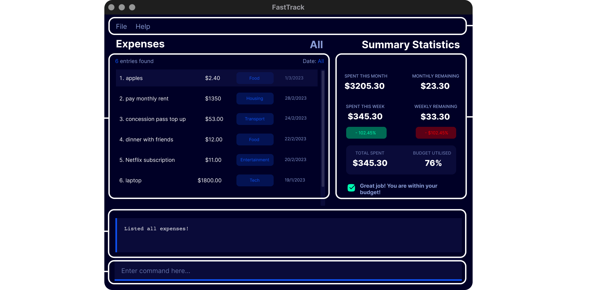
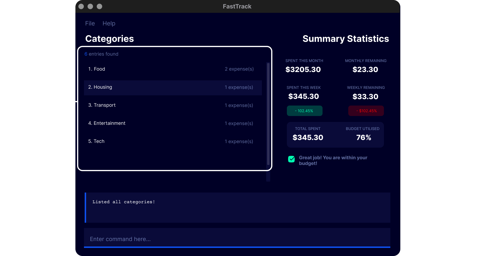
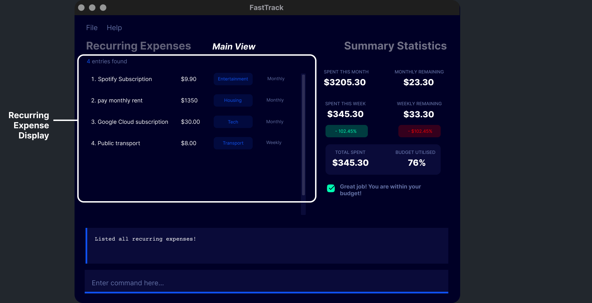

--------------------------------------------------------------------------------------------------------------------


# **Table of Contents**
{:toc}
1. Introduction to FastTrack
2. [Why You Should Use FastTrack](#why-you-should-use-fasttrack)
3. [Purpose of this guide](#purpose-of-this-guide)
4. [Quick Start and Installation](#quick-start-and-installation)
5. [How to understand this guide](#understanding-this-guide)
    1. Warnings
    2. Tooltips (Advice)
    3. Info
    4. Terminologies
    5. Syntax (Formatting in the guide)
6. [GUI walkthrough](#graphical-user-interface-gui-walkthrough)
7. Features
    1. Expense Commands
        1. Add Expense
        2. Add Recurring Expense
    2. Category Commands
    3. General Commands
    4. Summary Statistics
    5. Autocomplete
    6. Budget
8. Saving the data
9. Editing the data file (For Advanced Users)
10. Frequently Asked Questions
--------------------------------------------------------------------------------------------------------------------
# Introduction to FastTrack


FastTrack is an easy-to-use **financial management desktop application** designed for NUS SoC undergraduate students who are living on a tight budget.

With a combination of a Command Line Interface (CLI) and Graphical User Interface (GUI), our app provides a user-friendly and efficient way to track your expenses and manage your finances.

FastTrack prioritizes speed and efficiency to save your precious time and money, so you have more resources to spend on the important things in life.


--------------------------------------------------------------------------------------------------------------------
## Why you should use FastTrack

**FastTrack** is an expense tracking app that helps computing students keep track of their expenses by providing a simple and convenient command-line interface. Here are some reasons why you should consider using FastTrack:
1. **Simplicity:** FastTrack provides a _simple_ and _easy-to-use_ command-line interface that allows you to quickly add and track your expenses. This makes it ideal for computing students who prefer to use the command line to work with data.<br/><br/>
2. **Speed:** FastTrack prioritizes speed and efficiency. With its command-line interface and all commands being a simple and one-line, it skips the hassle of clicking through screens like other expense tracking apps. The entire interface is shown in one screen.<br/><br/>
3. **Convenience:** FastTrack can be used on any platform, including Windows, Mac, and Linux, making it convenient for computing students to track their expenses regardless of the platform they are using.<br/><br/>
4. **Customizable:** FastTrack is highly customizable, allowing you to tailor it to your specific needs. You can add categories, set budgets, add recurring expenses, and even see statistics on your expenses.<br/><br/>
5. **Security:** FastTrack is a locally hosted app that allows you to keep your expenses and financial information private. It does not require any personal information or financial details to use, ensuring that your information remains secure.<br/><br/>
6. **Free and Open Source:** FastTrack is a free and open-source app, meaning that it is available for download and use by anyone.

--------------------------------------------------------------------------------------------------------------------

# Purpose of this Guide

This User Guide provides information on how to use FastTrack. It includes:
* [Installation](#quick-start-and-installation) and setup of app
* Detailing features of the app
* Usage of app and its commands
* Tips, tricks and warnings on usage of commands
* Troubleshooting tips
* Frequently Asked Questions

--------------------------------------------------------------------------------------------------------------------

# Understanding this guide

## Icons
Throughout FastTrack's user guide, you may encounter unfamiliar symbols. This is a quick overview of what these symbols
mean and what to look out for.

| **Icon**             | **Meaning** |
|----------------------|-------------|
| :warning:            | Warning     |
| :information_source: | Information |
| :bulb:               | Tip         |

#### Warning Box

<div markdown="block" class="alert alert-danger">:warning: Warning:
Danger zone! Do pay attention to the information here carefully. Careless usage of this function may cause certain
things to not work as expected.
</div>

#### Information Box

<div markdown="span" class="alert alert-info">:information_source: Info:
This provides additional useful information that may help you with using FastTrack's features.
</div>

#### Tip Box

<div markdown="block" class="alert alert-primary">:bulb: Tip:
This provides some quick and convenient hacks that you can use to optimize your experience with FastTrack.
</div>

## Terminologies
The following table contains descriptions of key terminologies used in FastTrack.

| **Terminology**   | **Description**                                                                                                                                                                                 |
|-------------------|-------------------------------------------------------------------------------------------------------------------------------------------------------------------------------------------------|
| Expense           | Also referred to as a **one-time expense**.<br/><br/>This indicates a single expense entry which comprises the name of the expense, its _price_, associated _category_ and _date_.              |
| Recurring Expense | A Recurring Expense helps track expenses that occur on a recurring basis on specific intervals.<br/><br/>Examples include monthly installments, software subscriptions and daily transport fees |
| Category          | An expense category, which comprises a _name_ and _summary_ - a short description of the category. <br/><br/> Each category can contain expenses, in order to sort them.                        |


## Syntax
First-time users may have difficulty understanding the syntax described in the command instructions. 

If you have never used a **Command Line Interface** before, please read this quick guide before using the application.
Familiarization with the CLI will be beneficial for entering commands for expenses more efficiently,
saving time in the long run over the usage of FastTrack.

The **Command Line Interface (CLI)** is interacted primarily through single-line text commands. This means that any expense
can be added with just one line.

Here is a quick guide on how to read the syntax mentioned in the User Guide for using FastTrack's commands.

```
command tag1/ ARGUMENT1 tag2/ ARGUMENT2 [tag3/ ARGUMENT3]
```

| Element    | Format                                       | Usage                                                                                                             |
|------------|----------------------------------------------|-------------------------------------------------------------------------------------------------------------------|
| `command`  | Name of command <br/> eg. `add`, `find`      | Specifies the command to be executed.                                                                             |
| `tag/`     | Prefix for a field, followed by `/`          | Specifies which field given input argument is for                                                                 |
| `ARGUMENT` | All capitalized                              | Specifies User input for field specified by `tag/`                                                                |
| `[]`       | Square brackets around `tag/` and `ARGUMENT` | Indicates that field specified by `tag/` is optional. <br/><br/>If left unspecified, it will be set to a default. |

For example, the command format for `add`:
```
add c/CATEGORY_NAME n/ITEM_NAME p/PRICE [d/DATE]
```
* `add` is the `command` name.
* `c/`, `n/`, `p/`, `d/` are `tag/`s to denote fields of _category_, _name_, _price_ and _date_ respectively.
* `CATEGORY_NAME`, `ITEM_NAME`, `PRICE`, `DATE` are `ARGUMENTS` to be supplied to the aforementioned `tag/`s.
* `[d/DATE]` indicates that the field for the date is optional.


--------------------------------------------------------------------------------------------------------------------
## Quick start and Installation

1. Ensure you have Java `11` or above installed in your Computer.

2. Download the latest `fastTrack.jar` from [here](https://github.com/AY2223S2-CS2103T-W09-2/tp/releases).

3. Drag the file into a folder you want to use as the _home folder_ for FastTrack.

4. Double-click the FastTrack JAR file to run the application.

       
   A Graphical User Interface (pictured below) will appear. Note how the app contains some sample data.<br>


6. Type a command in the command box and press Enter to execute it. e.g. typing **`help`** and pressing Enter will open the help window.<br>
   Some example commands you can try:

    * `list` : Lists all expenses
   
    * `clear` : Clears the sample data

    * `add c/groceries n/milk p/4.50 d/14/2/23` : Adds an expense named `milk` to the expenses list with a price of $4.50 and a date of 14/02/2023

    * `delete 3` : Deletes the 3rd expense shown in the current list

    * `exit` : Exits the app


7. Refer to the [Features](#features) below for details of each command.

--------------------------------------------------------------------------------------------------------------------

# Graphical User Interface (GUI) Walkthrough

The following diagrams highlight the different sections of the _Graphical User Interface (GUI)_ of FastTrack.


The **main display**. It displays all added expenses on the left, showing each expense's price, category and date added.


The **Category display**. It shows all currently added Categories for expenses. This display is shown only after using the 
command to list categories.


The **Recurring Expense display**. It shows all currently added Recurring Expenses. This display is shown only after using the
command to list recurring expenses.


| **FastTrack UI Part**     | **Description**                                                                                                                                                                                                           |
|---------------------------|---------------------------------------------------------------------------------------------------------------------------------------------------------------------------------------------------------------------------|
| One-time Expense Display  | Displays the list of saved one-time expenses with filters applied (if any). This display occupies the _Main View_ section.                                                                                                |
| Category Display          | Displays the list of saved categories, including the number of expenses associated with each category. This display occupies the _Main View_ section.                                                                     |
| Recurring Expense Display | Displays the list of saved recurring expenses. This display occupies the _Main View_ section.                                                                                                                             |
| Results Display           | Displays the feedback from the application after entering a command, which can be used to indicate that a command has succeeded or failed. It provides textual guidance for the user, especially if a command has failed. |
| Command Box               | A text input field where you can type in a command for FastTrack to execute.                                                                                                                                              |
| Expense Summary Display   | A visual display containing spending statistics (Refer to the feature [Expense Summary](#Expense Summary) below for details on these statistics.                                                                          |
| Toolbar                   | Contains clickable buttons which allow you to access the user guide and exit from the application.                                                                                                                        |


## FastTrack Features


The features of FastTrack can be divided into 4 groups, **Category Features**, **Expense Features**, **General Features** and **Expense Statistics Feature**.

1. **Expense features** (one-time and recurring)
    * Add an expense
    * Edit an expense
    * Delete an expense
    * Find an expense by keyword
    * List expenses
        * Filter by category
        * Filter by time-span
    * Add a recurring expense
    * Edit a recurring expense
    * Delete a recurring expense
    * List recurring expenses
2. **Category features**
    * Add a category
    * Edit a category
    * Delete a category
    * List categories
3. **General features**
    * Set a budget
    * Autocompletion
    * View help menu
    * Clear data
    * Exit application

4. **Expense Statistics Feature**
   * Monthly spending statistic
   * Monthly remaining statistic
   * Monthly percentage change statistic
   * Weekly spending statistic
   * Weekly remaining statistic
   * Weekly percentage change statistic
   * Total spent statistic
   * Budget utilisation percentage statistic
   

### Category Features Summary

| Feature                                            | Command Format                              | Examples                           |
|----------------------------------------------------|---------------------------------------------|------------------------------------|
| [**Add Category**](#adding-a-category-addcat)      | `addcat c/CATEGORY_NAME s/SUMMARY`          | `addcat c/Groceries s/for living`  |
| [**Delete Category**](#deleting-a-category-delcat) | `delcat INDEX`                              | `delcat 1`                         |
| [**Edit Category**](#editing-a-category--edcat)    | `edcat INDEX [c/CATEGORY_NAME] [s/SUMMARY]` | `edcat 1 c/New Name s/New Summary` |
| [**List Categories**](#listing-categories-lcat)    | `lcat`                                      | `lcat`                             |

### Expense Features Summary

| Feature                                                               | Command Format                                                                        | Examples                                                       |
|-----------------------------------------------------------------------|---------------------------------------------------------------------------------------|----------------------------------------------------------------|
| [**Add Expense**](#adding-an-expense-add)                             | `add c/CATEGORY_NAME n/ITEM_NAME p/PRICE [d/DATE]`                                    | `add c/Food p/20 n/Mac d/14/2/23`                              |
| [**Delete Expense**](#deleting-an-expense--delete)                    | `delete INDEX`                                                                        | `delete 1`                                                     |
| [**Edit Expense**](#editing-an-expense--edexp)                        | `edexp INDEX [c/CATEGORY_NAME] [n/EXPENSE_NAME] [d/DATE] [p/PRICE]`                   | `edexp 1 c/Food n/Mac d/20/4/23 p/10`                          |
| [**List Expenses**](#listing-expenses--list)                          | `list [c/CATEGORY_NAME] [t/TIMEFRAME]`                                                | `list c/Food t/month`                                          |
| [**Find Expense**](#search-for-an-expense-by-name-find)               | `find KEYWORD [MORE_KEYWORDS]`                                                        | `find KFC chicken`                                             |
| [**Add Recurring Expense**](#adding-a-recurring-expense--addrec)      | `addrec c/CATEGORY_NAME n/ITEM_NAME p/PRICE t/INTERVAL sd/START_DATE [ed/END_DATE]`   | `addrec c/Shows n/Netflix p/10 t/month sd/10/3/23 ed/10/03/24` |
| [**Delete Recurring Expense**](#deleting-a-recurring-expense--delrec) | `delrec INDEX`                                                                        | `delrec 1`                                                     |
| [**Edit Recurring Expense**](#editing-a-recurring-expense--edrec)     | `edrec INDEX [c/CATEGORY_NAME] [n/EXPENSE_NAME] [p/PRICE] [t/INTERVAL] [ed/END_DATE]` | `edrec 1 c/Show n/Disney Plus p/2 t/week ed/10/5/24`           |
| [**List Recurring Expense**](#listing-recurring-expense--lrec)        | `lrec`                                                                                | `lrec`                                                         |

### General Features Summary

| Feature                                        | Command Format | Examples     |
|------------------------------------------------|----------------|--------------|
| [**Set Budget**](#setting-budget--set)         | `set p/AMOUNT` | `set p/1000` |
| [**Help**](#viewing-help--help)                | `help`         | `help`       |
| [**Exit program**](#exiting-the-program--exit) | `exit`         | `exit`       |
| [**Clear data**](#clearing-all-entries--clear) | `CLEAR`        | `CLEAR`      |

<div markdown="block" class="alert alert-info">

**:information_source: Notes about the command format:**<br>

* Words in `UPPER_CASE` are the parameters to be supplied by the user.<br>
  e.g. in `add c/CATEGORY_NAME`, `CATEGORY_NAME` is a parameter which can be used as `add c/groceries`.

* Items in square brackets are optional.<br>
  e.g `p/PRICE [d/DATE]` can be used as `p/4.50 d/14/2/2023` or as `p/4.50`.

* Parameters can be in any order.<br>
  e.g. if the command specifies `c/CATEGORY_NAME p/PRICE`, `p/PRICE c/CATEGORY_NAME` is also acceptable.

* If a parameter is expected only once in the command but you specified it multiple times, only the last occurrence of the parameter will be taken.<br>
  e.g. if you specify `p/4.50 p/5.80`, only `p/5.80` will be taken.

* Extraneous parameters for commands that do not take in parameters (such as `help`, `exit`) will be ignored.<br>
  e.g. if the command specifies `help 123`, it will be interpreted as `help`.


</div>

# 1. Category Features

## Adding a category: `addcat`

Adds a new expense category. If the category already exists, this command will not execute.

Format: `addcat c/CATEGORY_NAME s/SUMMARY`

| Parameter       | Description                                         |
|-----------------|-----------------------------------------------------|
| `CATEGORY_NAME` | Title of the category to be added.                  |
| `SUMMARY`       | Short summary of what this category keeps track of. |


Examples:
* `addcat c/Groceries s/for living` creates a new `Groceries` category with the summary of `for living`.
* `addcat c/Entertainment s/for fun!` creates a new `Entertainment` category with the summary of `for fun!`.

## Deleting a category: `delcat`

Deletes an expense category at the specified `INDEX`.

Format: `delcat INDEX`

| Parameter | Description                                                                                                                                                                                                                                                                                              |
|-----------|----------------------------------------------------------------------------------------------------------------------------------------------------------------------------------------------------------------------------------------------------------------------------------------------------------|
| `INDEX`   | The index number shown in the displayed categories list.<br/><br/>It must be a positive integer i.e. 1, 2, 3, ...<br/><br/>Expenses previously categorised under the category at the specified index will no longer be part of that category, and will be re-categorized under the `MISC` category.<br/> |


Examples:
* `lcat` followed by `delcat 2` deletes the second category in the log
* `lcat` followed by `delcat 1` deletes the first category in the log

## Editing a category : `edcat`

Edits the category at the specified `INDEX`

Format: `edcat INDEX [c/CATEGORY_NAME] [s/SUMMARY]`

Both `CATEGORY_NAME` and `SUMMARY` are optional by themselves, but at least one of them MUST be specified in addition
to `INDEX`, otherwise the command will not go through.

| Parameter       | Description                                                                                       |
|-----------------|---------------------------------------------------------------------------------------------------|
| `INDEX`         | The index of the category to be edited.<br/><br/>It must be a positive integer i.e. 1, 2, 3, ...  |
| `CATEGORY_NAME` | The new name of the category being edited at the specified index.<br/><br/>Optional parameter.    |
| `SUMMARY`       | The new summary of the category being edited at the specified index.<br/><br/>Optional parameter. |


## Listing Categories: `lcat`
Shows a list of categories in the expense tracker.

Format: `lcat`

# 2. Expense Features

## Adding an expense: `add`

Adds an expense to the expense tracker.

Format: `add c/CATEGORY_NAME n/ITEM_NAME p/PRICE [d/DATE]`

| Parameter       | Description                                                                                                                                                            |
|-----------------|------------------------------------------------------------------------------------------------------------------------------------------------------------------------|
| `CATEGORY_NAME` | The category which the expense should be classified under.<br/><br/>If there is no such category, a new category will be created with the specified category name.     |
| `ITEM_NAME`     | Name of the expense being added.                                                                                                                                       |
| `PRICE`         | The price of the expense being added.<br/><br/>The specified price should be a `double`, e.g. 4, 4.50.                                                                 |
| `DATE`          | The date of the expense being added.<br/><br/> This is an optional input, and if left unspecified, the date of the expense will be set to the current date by default. |


Examples:
* `add c/groceries n/milk p/4.50 `
* `add c/entertainment p/20 n/movie night d/14/2/23`

## Deleting an expense : `delete`

Deletes an expense at the specified `INDEX` from the expense tracker.

Format: `delete INDEX`

| Parameter | Description                                                                                                                                                                                                                                                                                 |
|-----------|---------------------------------------------------------------------------------------------------------------------------------------------------------------------------------------------------------------------------------------------------------------------------------------------|
| `INDEX`   | The index number shown in the displayed categories list.<br/><br/>It must be a positive integer i.e. 1, 2, 3, ...<br/><br/>If there are expenses previously categorised under the category which is marked for deletion, the expense will be re-categorized under the `MISC` category.<br/> |

Examples:
* `list` followed by `delete 2` deletes the second expense in the log
* `find movie` followed by `delete 1` deletes the first expense in the results of the `find` command

## Editing an expense : `edexp`

Edits the expense at the specified `INDEX`

Format: `edexp INDEX [c/CATEGORY_NAME] [n/EXPENSE_NAME] [d/DATE] [p/PRICE] [r/RECUR_PERIOD]`

Every parameter except for `INDEX` is optional by themselves, but at least one of other parameters MUST be
specified, otherwise the command will not go through.

| Parameter       | Description                                                                                     |
|-----------------|-------------------------------------------------------------------------------------------------|
| `INDEX`         | The index of the expense to be edited.<br/><br/>It must be a positive integer i.e. 1, 2, 3, ... |
| `CATEGORY_NAME` | The new category name of the expense to be changed to.<br/><br/>Optional parameter.             |
| `EXPENSE_NAME`  | The new expense name of the expense to be changed to.<br/><br/>Optional parameter.              |
| `DATE`          | The new date of the expense to be changed to.<br/><br/>Optional parameter.                      |
| `PRICE`         | The new price of the expense to be changed to.<br/><br/>Optional parameter.                     |

Examples:
* `edexp 1 c/groceries` changes the category of the first expense in the expense tracker
* `edexp 2 p/20 n/movie night` changes the price and name of the second expense in the expense tracker


## Listing expenses : `list`

Shows a list of expenses in the expense tracker with the option of applying filters based on the specified `CATEGORY_NAME`, `TIMEFRAME`.

If `CATEGORY_NAME` filter is specified, only the expenses categorized under that specific category will be displayed.
If `TIMEFRAME` filter is specified, only the expenses that fall within that timeframe are displayed.

If `CATEGORY_NAME` and `TIMEFRAME` are left unspecified, all expenses in the expense tracker will be listed by default.

Format: `list [c/CATEGORY_NAME] [t/TIMEFRAME] [r/RECUR_PERIOD]`

| Parameter       | Description                                                                                                                                                                              |
|-----------------|------------------------------------------------------------------------------------------------------------------------------------------------------------------------------------------|
| `CATEGORY_NAME` | The name of the category of which expenses are classed under.<br/><br/>Optional to specify.                                                                                              |
| `TIMEFRAME`     | The timeframe of which expenses were added. <br/><br/>The timeframes available are:<br/>1. week (alias: w) <br/>2. month (alias: m)<br/>3. year (alias: y)<br/><br/>Optional to specify. |

Examples:
* `list`
* `list c/Groceries t/week`
* `list c/Entertainment t/month`
* `list c/Food`
* `list t/w`
* `list c/Entertainment t/year`

<div markdown="block" class="alert alert-info">
**:information_source: Using both `CATEGORY_NAME` and `TIMEFRAME` filters:**<br>
* Using both the category and timeframe filters will only display expenses that satisfy both the filter conditions.<br>
  e.g. in `list c/food t/week`, only expenses with both the category name "Food" and date falling within the current week will be displayed.
</div>

## Search for an expense by name: `find`

Find expenses whose names contain any of the given keywords.

Format: `find KEYWORD [MORE_KEYWORDS]`

* The search is case-insensitive. e.g `dinner` will match `Dinner`
* The order of the keywords does not matter. e.g. `ramen Dinner` will match `Dinner ramen`
* Only the name of the expense is searched
* Only full words will be matched e.g. `dinn` will not match `dinner`
* Expenses matching at least one keyword will be returned (i.e. `OR` search)
  e.g. `movie dinner` will return `dinner with Alex`, `movie with friends`

Examples:

Suppose you have 3 expenses logged:
```
Date: 2023-03-02, Category: Dining, Name: McDonald's, Price: $7.50
Date: 2023-03-02, Category: Dining, Name: KFC, Price: $6.00
Date: 2023-03-03, Category: Groceries, Name: Milk, Price: $4.00
```
* `find kfc milk` returns `Milk` and `KFC`
* `find mcdonald's` returns `McDonald's`<br>


## Adding a Recurring Expense: `addrec`
Adds a recurring expense to the expense tracker.
Format: `addrec c/CATEGORY_NAME n/ITEM_NAME p/PRICE t/INTERVAL sd/START_DATE [ed/END_DATE]`

| Parameter       | Description                                                                                                                                                                  |
|-----------------|------------------------------------------------------------------------------------------------------------------------------------------------------------------------------|
| `CATEGORY_NAME` | The category which the recurring expense should be classified under.<br/><br/>If there is no such category, a new category will be created with the specified category name. |
| `ITEM_NAME`     | Name of the recurring expense being added.                                                                                                                                   |
| `PRICE`         | The price of the recurring expense being added.<br/><br/>The specified price should be a `double`, e.g. 4, 4.50.                                                             |
| `INTERVAL`      | The period with which the expense is recurring.<br/><br/> The timeframes available are:<br/>1. day <br/>2. week <br/>3. month <br/> 4. year                                  |
| `START_DATE`    | The starting date of the recurring expense                                                                                                                                   |
| `END_DATE`      | The ending date of the recurring expense  <br><br> Optional parameter.                                                                                                       |

Examples:
* `addrec n/milk c/groceries p/4.50 sd/20/3/2023 t/month`
* `addrec n/milk c/groceries p/4.50 sd/20/3/2023 ed/15/5/2023 t/w`

## Deleting a recurring expense: `delrec`

Deletes an expense category at the specified `INDEX`.

Format: `delrec INDEX`

| Parameter | Description                                                                                                              |
|-----------|--------------------------------------------------------------------------------------------------------------------------|
| `INDEX`   | The index number shown in the displayed recurring expense list.<br/><br/>It must be a positive integer i.e. 1, 2, 3, ... |

Examples:
* `lrec` followed by `delrec 2` deletes the second recurring expense in the log
* `lrec` followed by `delrec 1` deletes the first recurring expense in the log

## Editing a recurring expense : `edrec`

Edits the expense at the specified `INDEX`

Format: `edrec INDEX [c/CATEGORY_NAME] [n/EXPENSE_NAME] [p/PRICE] [t/INTERVAL] [ed/END_DATE]`

Every parameter except for `INDEX` is optional by themselves, but at least one of other parameters MUST be
specified, otherwise the command will not go through.

| Parameter       | Description                                                                                                                                                                |
|-----------------|----------------------------------------------------------------------------------------------------------------------------------------------------------------------------|
| `INDEX`         | The index of the recurring expense to be edited.<br/><br/>It must be a positive integer i.e. 1, 2, 3, ...                                                                  |
| `CATEGORY_NAME` | The new category name of the recurring expense to be changed to.<br/><br/>Optional parameter.                                                                              |
| `EXPENSE_NAME`  | The new expense name of the recurring expense to be changed to.<br/><br/>Optional parameter.                                                                               |
| `PRICE`         | The new price of the recurring expense to be changed to.<br/><br/>Optional parameter.                                                                                      |
| `INTERVAL`      | The new recurrence period of the expense to be changed. <br>The timeframes available are:<br/>1. day <br/>2. week <br/>3. month <br/> 4. year<br/><br/>Optional parameter. |
| `END_DATE`      | The new ending date of recurring expense. <br/><br/>Optional parameter.                                                                                                    |

Examples:
* `edrec 1 c/groceries t/week` updates the category and recurrence period first recurring expense in the expense tracker.
* `edrec 2 p/4.50 ed/15/5/2023` updates the price and ending date of the second recurring expense in the expense tracker.

## Listing Recurring Expense: `lrec`
Shows a list of recurring expense in the log.

Format: `lrec`

# 3. General Features
## Setting Budget: `set`
Sets the monthly budget of the expense tracker.
FastTrack derives the weekly budget from this monthly budget by dividing the monthly budget by 4.

Format `set p/AMOUNT`

| Parameter | Description                       |
|-----------|-----------------------------------|
| `AMOUNT`  | The monthly budget amount to set. |

Examples:
* `set p/50` sets the monthly budget of the expense tracker to $50


## Category Autocomplete
FastTrack will provide a list of suggested category names, displayed as a popup above the command box when `c/` is entered.

### Select a Suggested Category from list
Press the "UP" arrow key on your keyboard to navigate into the suggestions list. From here, you can choose a suggested category name using both the "UP" and "DOWN" arrow keys. 
To select the highlighted category, press the "ENTER" key on the keyboard. The command box will autocomplete the selected category name suggestion.
To navigate out of the suggestions list, press the "DOWN" arrow key until the bottom of the suggestions list has been reached, then press the "DOWN" arrow key once again to return the cursor to the command box.

### Select the first Suggested Category
To select the first (bottom-most) suggested category option without having to navigate into the suggestions list, press the "TAB" key on your keyboard to trigger the autocompletion.


## Clearing all entries : `CLEAR`

Clears all entries from the expense log.

Format: `CLEAR`

## Exiting the program : `exit`

Exits the program.

Format: `exit`


## Viewing help : `help`

Shows a message explaining how to access the help page, as well as a quick rundown of what commands can be used.


Format: `help`


## Saving the data

All data are saved in the hard disk automatically after any command that changes the data. There is no need to save manually.

## Editing the data file

Expenses data are saved as a JSON file `[JAR file location]/data/fastTrack.json`. Advanced users are welcome to update data directly by editing that data file.

<div markdown="span" class="alert alert-warning">:exclamation: **Caution:**
If your changes to the data file makes its format invalid, FastTrack will discard all data and start with an empty data file at the next run.
</div>

## Archiving data files `[coming in v2.0]`

_Details coming soon ..._


# 4. Expense Statistic Feature

_Details coming soon ..._

--------------------------------------------------------------------------------------------------------------------

## FAQ

**Q**: How do I transfer my data to another Computer?<br>
**A**: Install the app in the other computer and overwrite the empty data file it creates with the file that contains the data of your previous FastTrack home folder.

--------------------------------------------------------------------------------------------------------------------
