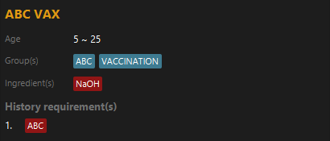
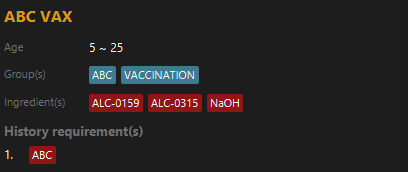

An increasing number of vaccination are now having more complicated prerequisites to take them and Vaccination Management System (VMS) aims to make this validation easier. VMS is a **desktop application for validating and keeping track of vaccination appointments** its operations are **optimized for fast typist who prefer the use of a Command Line Interface** (CLI). If you type fast, VMS can get your vaccination appointment validated with great efficiency!

* Table of Contents
{:toc}

--------------------------------------------------------------------------------------------------------------------

## Quick start

1. Ensure you have Java `11` or above installed in your Computer.

1. Download the latest `vms.jar` from [here](https://github.com/AY2223S2-CS2103-F11-3/tp/releases).

1. Copy the file to the folder you want to use as the _home folder_ for your VMS.

1. Open a command terminal, `cd` into the folder you put the jar file in, and use the `java -jar vms.jar` command to run the application.<br>
   A GUI similar to the below should appear in a few seconds. Note how the app contains some sample data.<br>
   

1. Type the command in the command box and press Enter to execute it. e.g. typing **`help`** and pressing Enter will open the help window.<br>
   Some example commands you can try:

   * `patient list` : Lists all patients.
   * `patient add --n John Doe --p 98765432 --d 2001-03-19 --b B+` : Adds a patient named `John Doe` to the Patient List.
   * `patient delete 3` : Deletes the 3rd patient shown in the current list.
   * `patient clear` : Deletes all patients.
   * `exit` : Exits the app.

1. Refer to the [Command line syntax](#command-line-syntax) below for details of each command.

--------------------------------------------------------------------------------------------------------------------

## Command line syntax

<div markdown="block" class="alert alert-info" id="CLI-presentation-format">

**:information_source: Command syntaxes presentation**<br>

* **Pink italicized bolded capitalized words** represents _placeholders_ that the reader will have to replace with a
  variable. For example, <code><var>PATIENT_ID</var></code> will represent a patient ID in commands or example outputs.
* **Backslash** (`\`) before line breaks represents a _command continuation_ where the following line break and
  backslash are to be replaced with aN EMPTY character. For example,<br>
  <pre>
  appointment add --p <var>PATIENT_ID</var> \
      --s <var>START_TIME</var> --e <var>END_TIME</var> \
      --v <var>VAX_NAME</var>
  </pre>
  would have the same meaning as this
  <pre>
  appointment add --p <var>PATIENT_ID</var> --s <var>START_TIME</var> --e <var>END_TIME</var> --v <var>VAX_NAME</var>
  </pre>
* **Square brackets** (`[` and `]`) around arguments indicate that the argument is optional. For example,
  <br><code>[--n <var>NEW_NAME</var>]</code> would mean that <wbr><code>--n <var>NEW_NAME</var></code> is optional.
* **Three dots with no space** (`...`) <u>after</u> arguments indicates that multiple of the same type of
  argument can be repeated. For example <wbr><code>[--r <var>REQUIREMENT</var>]...</code> would mean that
  <code>--r <var>REQUIREMENT</var></code> can appear multiple times.
* **Three dots with no space** <u>before</u> and <u>after</u> an argument would indicate that a list of that argument
  is required. The elements of a list are delimited by commas (`,`) and the keyword `{EMPTY}` is used to represent an
  empty list. For example, <code>--g ...<var>GROUP</var>...</code> would mean that a list of
  <code><var>GROUP</var></code> is required. Accepted arguments may be
  <code>--g <var>GROUP_1</var>, <var>GROUP_2</var>, <var>GROUP_3</var></code> for a list of 3 groups or `--g {EMPTY}`
  for an empty list of groups.'
* **Triangle brackets** (`<` and `>`) around words represent a [type](#types).

</div>

### General command syntax

The general command line syntax is as follows:<br>

<pre>
<var>COMPONENT</var> <var>COMMAND_WORD</var> <var>PREAMBLE</var> [--<var>FLAG</var> <var>ARGUMENT</var>]...
</pre>

* <code><var>COMPONENT</var></code> is a variable of type [`<component>`](#component). It may be omitted if it is
  [`basic`](#basic---applications-basic-features).
* <code><var>PREAMBLE</var></code> is any text after <code><var>COMMAND_WORD</var></code> to the end of the command or
  the first `--` flag delimiter. Its type is command dependent and will be taken to be empty if
  <code><var>COMMAND_WORD</var></code> is immediately followed by `--`.
* <code><var>COMMAND_WORD</var></code> and <code><var>FLAG</var></code> are single word arguments that do no accept
  spaces.

##### Additional points

* `--` is used to delimit flags and cannot be present in any of the argument placeholders.
* Some arguments may require parts which are delimited by `::`.
* Leading and trailing white spaces in <code><var>ARGUMENTS</var></code> and elements in lists will be ignored.

### Types

#### `<component>`

The list of available components are given in the [components section](#components).

#### `<string>`

Strings can take on any character sequence that do not contain `--` or new line characters.

#### `<group-name>`

A non-blank character sequence consisting of only alphanumeric character and all brackets excluding triangle brackets
(`<` and `>`). The character limit is **30** characters.

#### `<integer>`

An integer value between `-2147483648` and `2147483647`.

#### `<age>`

An extension of `<integer>`, allowing only positive values (ie. `x >= 0`). Age also has a max value of `200` which is
allowed to be exceeded, provided it conforms to `<integer>` restrictions as well. All values of age that exceed the max
value will be evaluated to be equal.

#### `<bloodType>`

The list of blood types are:

* A+
* A-
* B+
* B-
* AB+
* AB-
* O+
* O-

All other values will be rejected

#### `<date>`

The supported date formats are:

* `yyyy-mm-ddThh:mm`<br>
    eg. 2023-05-03T04:45
* `yyyy-m-d hhmm` - single and double digit day and months are supported.<br>
  eg. 2023-5-3 0455
  * The following formats are also acceptable:
  * `yyyy-mm-d hhmm`
  * `yyyy-mm-dd hhmm`
  * `yyyy-m-dd hhmm`

#### `<phone-number>`

Only 8 digit Singapore numbers are allowed.

#### `<vax-retriever>`

`<vax-retriever>` or vaccination retriever aids in referring to a vaccination stored in the system. Vaccination may be referred to either by their names or the index that they are displayed in.

The syntax of a vaccination retriever is as follows:

<pre>
[<var>RETRIEVER_TYPE</var> :: ] <var>RETRIEVER_VALUE</var>
</pre>

* <code><var>RETRIEVER_TYPE</var></code> : `<retriever-type>` - the type of the retriever.
* <code><var>RETRIEVER_VALUE</var></code> : `<string>` - the value of the retriever.

If <code><var>RETRIEVER_TYPE</var></code> is omitted, its value will be inferred from <code><var>RETRIEVER_VALUE</var></code>. It will be `INDEX` if <code><var>RETRIEVER_VALUE</var></code> contains only the digits 0 to 9 and `NAME` otherwise.

Specifying the <code><var>RETRIEVER_TYPE</var></code> will override the inference and retrieve the vaccination based on the type specified. Thus, to refer to a vaccination whose name contains only digits, use <code>NAME :: <var>VAX_NAME</var></code> to avoid the inference.

#### `<retriever-type>`

Only the following values are allowed:

* `INDEX` - to retrieve a vaccination by its index that it is displayed in the vaccination list view.
* `NAME` - to retrieve a vaccination by its name.

These values are not case sensitive.

#### `<req>`

`<req>` represents a requirement. It is used to evaluate if a patient's vaccination records meets a vaccination history
requirement. For every vaccination that a patient has taken, that vaccination's groups are tested on all requirements
that the vaccination has. A check is done to check if that vaccination's groups contains any or all of the groups
within the requirement set and its truth value depends on the [type](#req-type) of the requirement. If all requirements
are satisfied, the check passes and the patient satisfies the history requirement of the vaccination and vice versa.

`<req>` arguments require 2 and only 2 parts. The general syntax is as follows:

<pre>
<var>REQ_TYPE</var> :: ...<var>REQUIREMENT</var>...
</pre>

* <code><var>REQ_TYPE</var></code> : `<req-type>` - The type of the requirement.
* <code><var>REQUIREMENT</var></code> : `<group-name>` - An element that makes up the requirement set.

#### `<req-type>`

Only the following values are allowed:

* `ALL` - all groups of the requirement set must be present to pass.
  * **Example**: a vaccination requirement of `G1, G2, G3` will require a patient to have taken a vaccination with all 3 groups. A vaccination with `G1, G2, G3` and `G1, G2, G3, G4` will pass but a vaccination with `G1, G2` groups will not.
* `ANY` - at least one group within the requirement set must be present to pass.
  * **Example**: a vaccination requirement of `G1, G2, G3` will require the patient to have taken a vaccination that has any of the 3 groups. A vaccination with `G1` and `G1, G3` will pass but a vaccination with `G4, G5` groups will not.
* `NONE` - none of the groups within the requirement set must be present to pass.
  * **Example** a requirement with `G1, G2, G3` will require the patient to not have taken any vaccination that are classified as any of the 3 groups. A vaccination with `G1` and `G1, G3` will fail while a vaccination with `G4, G5` will pass. A failure on this type will break the testing process of the patient and the patient will immediately fail the history requirement of the vaccination. In other words, the patient will not be able to take that vaccination.

## Components

Below shows a list of components, their supported command words and their usage.

### `basic` - Application's basic features

#### `exit` - Exit the program

```text
exit
```

#### `help` - Display help page

```text
help
```

### `keyword` - Keyword functionalities

Keywords are identified by their sub and main keywords. Following is the list of the attributes that a keyword has.

* **Keyword name** : `<keyword>` - the name of the user-defined keyword.
* **Main Keyword** : `<mainKeyword>` - the main keyword that the user-defined keyword is paired to.

Default keywords implemented are shown in the list below.
* pat-->patient
* appt-->appointment
* vacc-->vaccination

#### `add` - Add a keyword

Adds a new keyword as defined in the command into the system.

##### Syntax

<pre>
keyword add --k <var>MAIN_KEYWORD</var> --n <var>KEYWORD</var>
</pre>

* <code><var>MAIN_KEYWORD</var></code> : `<mainKeyword>`
* <code><var>KEYWORD</var></code> : `<keyword>`

##### Example

Example assumes that the keyword does not exist yet.

```text
keyword add --k patient --n pa 
```

<br><br>
Output:<br>

```text
[INFO] New keyword added: pa-->patient
```

#### `delete` - Delete a keyword

Deletes a keyword as defined in the command in the system.

##### Syntax

<pre>
keyword delete <var>keyword</var>
</pre>

* <code><var>KEYWORD</var></code> : `<keyword>`

##### Example

Example assumes that the keyword already exists.

```text
keyword delete pat
```

<br><br>
Output:<br>

```text
[INFO] Deleted keyword: pa-->patient
```

### `patient` - Patient functionalities

##### Patient data

| Variable      | Is needed | Type                   | Accept multiple |
| ------------- | --------- | ---------------------- | --------------- |
| `name`        | YES       | `<name>`               | NO              |
| `phone`       | YES       | `<phone-number>`       | NO              |
| `dateOfBirth` | YES       | `<date>`               | NO              |
| `bloodType`   | YES       | `<bloodType>`          | NO              |
| `allergies`   | NO        | list of `<group-name>` | YES             |
| `vaccines`    | NO        | list of `<group-name>` | YES             |

#### `add` - Add a patient

Adds a new Patient type as defined in the command into the system. If any of the optional arguments are omitted, the list will be empty.

##### Syntax

<pre>
patient add --n <var>PATIENT_NAME</var> --p <var>PHONE</var> --d <var>DATE_OF_BIRTH</var> \
    --b <var>BLOODTYPE</var> --a <var>ALLERGIES</var>... --v <var>VACCINES</var>...
patient add --n <var>PATIENT_NAME</var> --p <var>PHONE</var> --d <var>DATE_OF_BIRTH</var> \
    --b <var>BLOODTYPE</var>
</pre>

* <code><var>PATIENT_NAME</var></code> : `<name>`
* <code><var>PHONE</var></code> : `<phone>`
* <code><var>DATE_OF_BIRTH</var></code> : `<dob>`
* <code><var>BLOODTYPE</var></code> : `<bloodType>`
* <code><var>ALLERGIES</var></code> : `<group-name>`
* <code><var>VACCINES</var></code> : `<group-name>`

##### Example

* `patient add --n John Doe --p 98765432 --d 2001-03-19 --b B+ --a catfur --a pollen --v covax`
* `patient add --n John Doe --p 98765432 --d 2001-03-19 --b B+`

#### `list` - List all patients

Resets the view of the patient pane to display all the Patients. Useful command after using the find command.

##### Syntax

```text
patient list
```

#### `find` - Locate a patient

Finds patients whose names contain any of the given keywords. You can also include flags to search based on the patient's attributes. If no flags are given, the search string given will be assumed to be searching the patient's name. Multiple flags can be used concurrently!

##### Syntax

```text
patient find <string>
patient find --name <string> --phone <phone-number> --d <date> \
    --bloodtype <bloodType> --a <group-name> --v <group-name>
```

##### Example

* `patient find john`
* `patient find --name john --b B+`

#### `update` - Update a patient

Updates the Patient using it's PATIENT_ID.

##### Syntax

<pre>
patient edit <var>PATIENT_ID</var> --n <var>PATIENT_NAME</var> --p <var>PHONE</var> --d <var>DATE_OF_BIRTH</var> \
    --b <var>BLOODTYPE</var> --a <var>ALLERGIES</var>... --v <var>VACCINES</var>...
patient edit <var>PATIENT_ID</var> --n <var>PATIENT_NAME</var> --p <var>PHONE</var> --d <var>DATE_OF_BIRTH</var> \
    --b <var>BLOODTYPE</var>
</pre>

* <code><var>PATIENT_NAME</var></code> : `<name>`
* <code><var>PHONE</var></code> : `<phone>`
* <code><var>DATE_OF_BIRTH</var></code> : `<dob>`
* <code><var>BLOODTYPE</var></code> : `<bloodType>`
* <code><var>ALLERGIES</var></code> : `<group-name>`
* <code><var>VACCINES</var></code> : `<group-name>`

##### Example

* `patient edit 5 --n John Doee --p 98765432 --d 2001-03-19 --b B+ --a catfur --a pollen --v covax`
* `patient edit 5 --n John Doee`

#### `delete` - Delete a patient

Deletes the patient using the PATIENT_ID

##### Syntax

```text
patient delete <PATIENT_ID>
```

##### Example

* `patent delete 5`

#### `clear` - Delete a patient

Deletes all Patients from VMS. It is for users to clear the dummy patients out from VMS

##### Syntax

```text
patient clear
```

##### Example

* `patent clear`

### `vaccination` - Vaccination functionalities

Vaccinations are uniquely identified by their names. The following is a list of the attributes that a vaccination has and their description.

* **Name** : `<group-name>` - the name of the vaccination.
* **Groups** : list of `<group-name>` - The groups the vaccination classifies under.
  * Default value = `empty list`.
* **Minimum age** : `<age>` - the minimum age (inclusive) allowed to take the vaccination.
  * Default value = `0`.
* **Maximum age** : `<age>` - the maximum age (inclusive) allowed to take the vaccination.
  * Default value = `200`.
* **Ingredients** : list of `<group-name>` - ingredients of the vaccination. Similar to patient's allergies.
  * Default value = `empty list`.
* **History requirements** - the list requirements of vaccination groups to take the vaccination.
  * Default value = `empty list`.
  * Requirements need not be unique, ie. a requirement of 2 `ANY :: grp1, grp2` is allowed. This would mean that to take this vaccination, the patient will have to have taken at least 2 vaccinations that satisfies that requirement.

#### `add` - Add a vaccination type

Adds a new vaccination type as defined in the command into the system. If any of the optional arguments are omitted,
they will be set to their default values.

##### Syntax

<pre>
vaccination add <var>VAX_NAME</var> [--g ...<var>GROUP</var>...] [--lal <var>MIN_AGE</var>] [--ual <var>MAX_AGE</var>] \
    [--a ...<var>INGREDIENT</var>...]... [--h <var>HISTORY_REQ</var>]...
</pre>

* <code><var>VAX_NAME</var></code> : `<group-name>`
* <code><var>GROUP</var></code> : `<group-name>`
* <code><var>MIN_AGE</var></code> : `<age>`
* <code><var>MAX_AGE</var></code> : `<age>`
* <code><var>INGREDIENT</var></code> : `<group-name>`
* <code><var>HISTORY_REQ</var></code> : `<req>`

##### Example

Example assumes that the vaccination `ABC VAX` does not exist yet.

```text
vaccination add Pfizer (Dose 1) --groups DOSE 1, PFIZER, VACCINATION \
    --lal 5 \
    --a allergy1, allergy2, allergy3 \
    --h NONE::DOES 1 \
```

Copy and paste:<br>
`vaccination add Pfizer (Dose 1) --groups DOSE 1, PFIZER, VACCINATION --lal 5 --i allergy1, allergy2, allergy3 --h NONE::DOES 1`
<br><br>
Output:<br>

```text
[INFO] Vaccination: ABC VAX added
```


##### Restrictions

* The name of the vaccination being added must not exist in the system.

#### `edit` - Edit a vaccination type

Updates the attributes of the specified vaccination to the attributes specified. If any of the optional arguments
are omitted, they will be set to what they were before.

##### Syntax

<pre>
vaccination add <var>VACCINATION</var> [--n <var>NEW_NAME</var>] [--g ...<var>GROUP</var>...] \
    [--lal <var>MIN_AGE</var>] [--ual <var>MAX_AGE</var>] \
    [--a ...<var>INGREDIENT</var>...]... [--h <var>HISTORY_REQ</var>]... \
    [--set <var>IS_SET</var>]
</pre>

* <code><var>VACCINATION</var></code> : `<vax-retriever>`
* <code><var>NEW_NAME</var></code> : `<group-name>`
* <code><var>GROUP</var></code> : `<group-name>`
* <code><var>MIN_AGE</var></code> : `<age>`
* <code><var>MAX_AGE</var></code> : `<age>`
* <code><var>INGREDIENT</var></code> : `<group-name>`
* <code><var>HISTORY_REQ</var></code> : `<req>`
* <code><var>IS_SET</var></code> : `<boolean>`
  * `true` to replace all list-like vaccination attributes (**Groups**, **Ingredients** and **History requirements**) with the one specified in the command or `false` to append them.
  * It is `false` by default.

##### Example

Following examples are independent of each other and follow after vaccination add example.

###### Set example

```text
vaccination edit INDEX::1 --lal 5 --ual 25 --i NaOH --set true
```

Output:<br>

```text
[INFO] Vaccination: ABC VAX updated
```



###### Append example

```text
vaccination edit INDEX::1 --lal 5 --ual 25 --i NaOH
```

Output:<br>

```text
[INFO] Vaccination: ABC VAX updated
```



##### Restrictions

* <code><var>VACCINATION</var></code> must exist in the system.
* <code><var>NEW_NAME</var></code> must be a name that does not yet exist in the system unless it is the same as the vaccination being updated.

#### `delete` - Deletes a vaccination

Deletion of a vaccination may cause appointments to be come invalid as the vaccination will no longer exist in the system. `VMS` will check for this and prevent such deletions from happening. However, an additional `--force true` argument will force the change to happen which will delete all invalid appointments after the change.

##### Syntax

<pre>
vaccination delete <var>VACCINATION</var> [--force <var>IS_FORCE</var>]
</pre>

* <code><var>VACCINATION</var></code> : `<vax-retriever>`
* <code><var>IS_FORCE</var></code> : `<boolean>`
  * `true` to force the change that the command will make and `false` to not.
  * By default, its value is `false`.

##### Example

Examples follow after vaccination clear and then add command examples.

```text
vaccination 1
```

```text
vaccination INDEX::1
```

```text
vaccination ABC VAX
```

```text
vaccination NAME::ABC VAX
```

Output:<br>

```text
vaccination: ABC VAX deleted
```

##### Restrictions

* Vaccination must exist in the system.

#### `clear` - Clears all vaccination data

##### Syntax

Similar to vaccination delete, deletion of vaccinations may cause some appointment to become invalid. Add an additional `--force true` to force the change.

<pre>
vaccination clear
</pre>

##### Example

```text
vaccination clear
```

Output:<br>

```text
[INFO] Vaccinations successfully cleared
```

#### `find` - Finds a vaccination

Given a `<string>`, search and filter out only vaccination whose names contains the character sequence of the given `<string>` in the given order. Whitespace characters within the given `<string>` are ignored and taken to be that any number of characters may between the two character sequences that the whitespace separates. The search is case-insensitive.

For example, if given `Dose Dose 1`, the following will match:

* `Dose Dose 1`
* `Dose abc dose abc 1`

However, the following will not:

* `Dose 1` - Missing a `dose`.
* `1 Dose Dose` - Wrong order.
* `Dose dose` - Missing `1`.

##### Syntax

<pre>
vaccination find <var>VAX_NAME</var>
</pre>

* <code><var>VAX_NAME</var></code> : `<string>`
  * The character sequence in the vaccination's name to search for.

##### Example

```text
vaccination find dose 1
```

Output:<br>

```text
[INFO] 3 vaccinations listed!
```


##### Restrictions

* <code><var>VAX_NAME</var></code> cannot be blank.

#### `list` - Lists all vaccination

Clears previously set filters and list all vaccinations in the list view.

##### Syntax

<pre>
vaccination list
</pre>

#### `detail` - Displays the detail of a vaccination

##### Syntax

<pre>
vaccination detail <var>VACCINATION</var>
</pre>

* <code><var>VACCINATION</var></code> : `<vax-retriever>`

##### Example

Example assumes none of the default start-up vaccinations are deleted yet.

```text
vaccination detail Dose 1 (Moderna)
```

Output:<br>

```text
[INFO] Detailing vaccination: Dose 1 (Moderna)
```


##### Restrictions

* <code><var>VACCINATION</var></code> must exist in the system.

<br></br>

### `appointment` - Appointment functionalities

| Attribute     | Type              | Description                                |
|---------------|-------------------|--------------------------------------------|
| Patient id    | `<Index>`         | The patient id of the appointment.         |
| Starting time | `<localDateTime>` | The starting time of the appointment.      |
| Ending time   | `<localDateTime>` | The ending time of the appointment.        |
| Vaccination   | `<GroupName>`     | The vaccine type used for the appointment. |
| Status        | `<Boolean>`       | The completion status of the appointment.  |

<br></br>

#### `add` - Add an appointment

Adds a new appointment to the appointment manager

##### Syntax

```text
appointment add --p INDEX --s STARTING_TIME --e ENDING_TIME --v VAX_GROUP
```

* <code><var>INDEX</var></code> : `<Index>`
* <code><var>STARTING_TIME</var></code> : `<localDateTime>`
* <code><var>ENDING_TIME</var></code> : `<localDateTime>`
* <code><var>VAX_GROUP</var></code> : `<GroupName>`

##### Example

* `appointment add --p 5 --s 2023-05-01 0700 --e 2023-05-01 0800 --v Dose 1 (Moderna)`

##### Restrictions

* The patient id must be an existing index in the patient manager.
* The patient id must for a patient that does not already have an upcoming appointment.
* The starting time must be after the current locale time.
* The ending time must be after the given starting time.
* The vaccination must be an existing vaccination type in the vaxtype manager.

<br></br>

#### `delete` - Delete an appointment

Removes the specified appointment from the appointment manager.

##### Syntax

```text
appointment delete INDEX
```

* <code><var>INDEX</var></code> : `<Index>`

##### Example

* `appointment delete 5`

##### Restrictions

* The index must be an existing index in the appointment manager.

<br></br>

#### `edit` - Edit an appointment

Edits the details of an existing appointment.

##### Syntax

```text
appointment edit INDEX [--p PATIENT_ID] [--s STARTING_TIME] [--e ENDING_TIME] \
    [--v VAX_GROUP]
```

* <code><var>INDEX</var></code> : `<Index>`
* <code><var>PATIENT_ID</var></code> : `<Index>`
* <code><var>STARTING_TIME</var></code> : `<localDateTime>`
* <code><var>ENDING_TIME</var></code> : `<localDateTime>`
* <code><var>VAX_GROUP</var></code> : `<GroupName>`

##### Example

* `appointment edit 1 --p 5 --s 2023-03-05 0700 --e 2023-03-05 0800 --v Dose 1 (Pfizer)`

##### Restrictions

* The index must be an existing index in the appointment manager.
* The index must be of an appointment that has not yet passed.
* The patient id must be an existing index in the patient manager.
* The starting time must be after the current locale time.
* The ending time must be after the given starting time.
* The vaccination must be an existing vaccination type in the vaxtype manager.

<br></br>

#### `list` - List all appointments

Resets the view of the appointment pane to display all the appointments. Useful command after using the find command.

##### Syntax

```text
appointment list
```

<br></br>

#### `find` - Find all matching appointments

List all the appointments that matches the predicates provided.

* <code><var>INDEX</var></code> : List appointments of a specific patient
* <code><var>STARTING_TIME</var></code> : List appointments after the starting time
* <code><var>ENDING_TIME</var></code> : List appointments before the ending time
* <code><var>VAX_GROUP</var></code> : List appointments that uses the specific vaccination
* <code><var>KEYWORDS</var></code> : List appointments that matches the keywords

##### Syntax

```text
appointment find [--p INDEX] [--s STARTING_TIME] [--e ENDING_TIME] \
    [--v ...VAX_GROUP...]`

appointment find [...KEYWORDS...]
```

* <code><var>INDEX</var></code> : `<Index>`
* <code><var>STARTING_TIME</var></code> : `<localDateTime>`
* <code><var>ENDING_TIME</var></code> : `<localDateTime>`
* <code><var>VAX_GROUP</var></code> : `<GroupName>`
* <code><var>KEYWORDS</var></code> : `<String>`

##### Example

* `appointment find --p 1`
* `appointment find Dose 1`

<br></br>

#### `mark` - Marks an appointment as completed

Marks an existing appointment as completed.

##### Syntax

```text
appointment mark INDEX
```

* <code><var>INDEX</var></code> : `<Index>`

##### Example

* `appointment mark 1`

##### Restrictions

* The index must be an existing index in the appointment manager.
* The specified appointment should not already be done.

<br></br>

#### `unmark` - Changes an appointment's status to not done

Changes the completion status to not done.

##### Syntax

```text
appointment unmark INDEX
```

* <code><var>INDEX</var></code> : `<Index>`

##### Example

* `appointment unmark 1`

##### Restrictions

* The index must be an existing index in the appointment manager.
* The specified appointment should already be done.

<br></br>

## Advance

VMS data are saved as a JSON files in `[JAR file location]/data`. Advanced users are welcome to update data directly by editing that data file.

<div markdown="span" class="alert alert-warning">:exclamation: **Caution:**
If your changes to the data file makes its format invalid, VMS will discard all data and start with an empty data file at the next run.
</div>

<div markdown="block" class="alert alert-info">

**:information_source: JSON syntax presentation**<br>

* The following will have the same meaning as <a href="CLI-presentation-format">CLI presentation</a>.
  * **Pink italicized bolded capitalized words** (<code><var>PLACEHOLDER_EXAMPLE</var></code>)
  * **Three dots with no spaces** (<code><var>ARG</var>...</code> and <code>...<var>ARG</var>...</code>)
  * **Triangle brackets** (`<` and `>`)
* **Square brackets** (`[` and `]`) will no longer mean an optional argument, instead it will be a required character
  for JSON syntax.

</div>

### Vaccination type JSON

Vaccination data are stored as a JSON file in `[JAR file location]/data/vaxtype.json`. It has the following syntax

##### Overall file

<pre>
{
  "types": [...<var>VACCINATION</var>...]
}
</pre>

##### Vaccination

<pre>
{
  "name": <var>VAX_NAME</var>,
  "groups": [...<var>GROUP</var>...],
  "minAge": <var>MIN_AGE</var>,
  "maxAge": <var>MAX_AGE</var>,
  "ingredients": [...<var>INGREDIENT</var>],
  "historyReqs": [...<var>REQUIREMENT</var>...]
}
</pre>

* <code><var>VAX_NAME</var></code> : `<group-name>`
* <code><var>GROUP</var></code> : `<group-name>`
* <code><var>MIN_AGE</var></code> : `<age>`
* <code><var>MAX_AGE</var></code> : `<age>`
* <code><var>INGREDIENT</var></code> : `<group-name>`
* <code><var>REQUIREMENT</var></code> : `<req>`

###### Notes

* All nodes are optional except for `"name"`.

##### Requirement

<pre>
{
  "reqType": <var>REQ_TYPE</var>,
  "reqSet": [...<var>REQUIREMENT</var>...]
}
</pre>

* <code><var>REQ_TYPE</var></code> : `<req-type>`
* <code><var>REQUIREMENT</var></code> : `<group-name>`

##### Example

```json
{
  "types": [
    {
      "name": "Dose 1 (Pfizer)",
      "groups": ["DOSE 1", "Pfizer", "Vaccination"],
      "minAge": 5,
      "historyReqs": [
        {
          "reqType": "NONE",
          "reqSet": ["DOSE 1"]
        }
      ],
      "ingredients": [
        "ALC-0315",
        "ALC-0159",
        "DSPC",
        "Cholesterol",
        "Sucrose",
        "Phosphate",
        "Tromethamine",
        "Tromethamine hydrochloride"
      ]
    }
  ]
}
```
