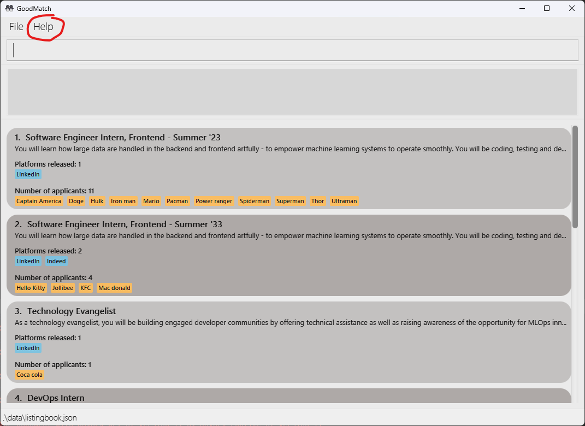
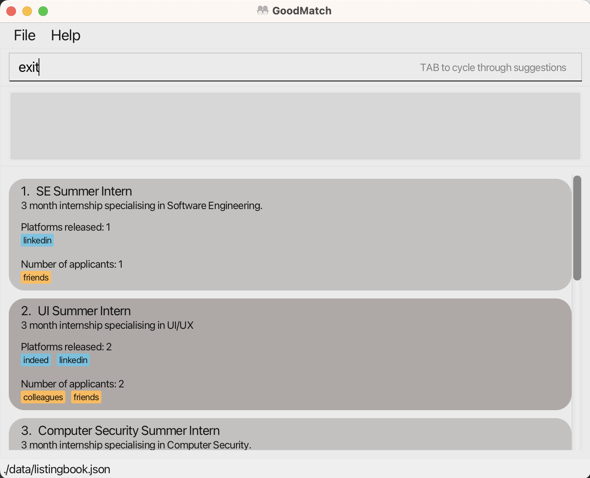
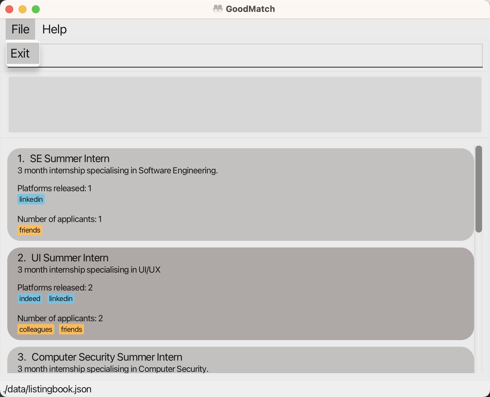

# GoodMatch

---
layout: page
title: User Guide
---

## **Overview**

GoodMatch (GM) is a **desktop app for managing applicants and job listings, optimised for use via a Command Line Interface** (CLI) while still having the benefits of a Graphical User Interface (GUI), specifically catering to HR managers in charge of tracking job listings across many platforms. If you can type fast, GM can get your applicant and job listing management tasks done faster than traditional GUI apps.

---

## Table of Contents

- [GoodMatch](#goodmatch)
  - [title: User Guide](#title-user-guide)
  - [**Overview**](#overview)
  - [Table of Contents](#table-of-contents)
  - [User Guide Information](#user-guide-information)
    - [Purpose of this guide](#purpose-of-this-guide)
    - [How to use this guide](#how-to-use-this-guide)
    - [Legends](#legends)
  - [**Quick Start**](#quick-start)
          - [_\< Back to Table of Contents \>_](#-back-to-table-of-contents-)
  - [Get to know GoodMatch](#get-to-know-goodmatch)
    - [Listing](#listing)
      - [Title](#title)
      - [Description](#description)
      - [Applicants List](#applicants-list)
      - [Platforms released](#platforms-released)
    - [Applicant](#applicant)
      - [IDs](#ids)
    - [Platform](#platform)
    - [Commands](#commands)
  - [**Features**](#features)
    - [Viewing help: `help`](#viewing-help-help)
          - [_\< Back to Table of Contents \>_](#-back-to-table-of-contents--1)
    - [Viewing all job listings: `view`](#viewing-all-job-listings-view)
          - [_\< Back to Table of Contents \>_](#-back-to-table-of-contents--2)
    - [Adding a job listing: `add`](#adding-a-job-listing-add)
          - [_\< Back to Table of Contents \>_](#-back-to-table-of-contents--3)
    - [Editing a job listing: `edit`](#editing-a-job-listing-edit)
          - [_\< Back to Table of Contents \>_](#-back-to-table-of-contents--4)
    - [Deleting a job listing: `delete`](#deleting-a-job-listing-delete)
          - [_\< Back to Table of Contents \>_](#-back-to-table-of-contents--5)
    - [Adding an applicant to listing: `add_app`](#adding-an-applicant-to-listing-add_app)
          - [_\< Back to Table of Contents \>_](#-back-to-table-of-contents--6)
    - [Editing an applicant of a listing: `edit_app`](#editing-an-applicant-of-a-listing-edit_app)
          - [_\< Back to Table of Contents \>_](#-back-to-table-of-contents--7)
    - [Deleting an applicant from a listing: `del_app`](#deleting-an-applicant-from-a-listing-del_app)
          - [_\< Back to Table of Contents \>_](#-back-to-table-of-contents--8)
    - [Adding a platform: `add_plat`](#adding-a-platform-add_plat)
          - [_\< Back to Table of Contents \>_](#-back-to-table-of-contents--9)
    - [Delete a platform from a listing: `del_plat`](#delete-a-platform-from-a-listing-del_plat)
          - [_\< Back to Table of Contents \>_](#-back-to-table-of-contents--10)
    - [Locating job listings by title: `find`](#locating-job-listings-by-title-find)
          - [_\< Back to Table of Contents \>_](#-back-to-table-of-contents--11)
    - [Sorting job listings: `sort`](#sorting-job-listings-sort)
          - [_\< Back to Table of Contents \>_](#-back-to-table-of-contents--12)
    - [Undo latest command: `undo`](#undo-latest-command-undo)
          - [_\< Back to Table of Contents \>_](#-back-to-table-of-contents--13)
    - [Saving the data](#saving-the-data)
          - [_\< Back to Table of Contents \>_](#-back-to-table-of-contents--14)
    - [Editing the data file](#editing-the-data-file)
          - [_\< Back to Table of Contents \>_](#-back-to-table-of-contents--15)
    - [Exit the application: `exit`](#exit-the-application-exit)
          - [_\< Back to Table of Contents \>_](#-back-to-table-of-contents--16)
  - [**FAQ**](#faq)
          - [_\< Back to Table of Contents \>_](#-back-to-table-of-contents--17)
  - [**Command summary**](#command-summary)
          - [_\< Back to Table of Contents \>_](#-back-to-table-of-contents--18)

---

## User Guide Information

### Purpose of this guide

Welcome to the user guide for GoodMatch. This guide will help you understand how to use GoodMatch to streamline your recruitment process. We aim to help you find the best candidates for your company. 

### How to use this guide

To make the most of this guide, start by reading it from beginning to end. If you are an experienced user, you can skip to the [Features](#features) section for a detailed guide. We recommend that you familiarize yourself with the basic concepts before moving on to the advanced topics.

You can use the interactive [table of contents](#table-of-contents) to navigate through the document quickly. Simply click on the bullet points to be taken to the relevant subsection. Follow the step-by-step instructions, screenshots, and examples to get the most out of the guide.

### Legends

Here is a breakdown of the different symbols we will use throughout this guide.

✏️ **Format**: Shows you what you should type in order to use a command.

ℹ️ **Notes**: You can find additional information about the command or feature here.

📚 **Examples**: You can find some sample usages of the command here.

🎯 **Expected Output**: Shows you what you can expect to see upon successful execution of a command.

❌ **Possible Errors**: Shows you some problems you might encounter if you're not careful while typing in your command.

❗ **Caution**: Be careful not to make this deadly mistake.

---

## **Quick Start**

1. Ensure you have Java `11` or above installed in your Computer.
2. Download the latest `goodmatch.jar` from [here](https://github.com/AY2223S2-CS2103T-W14-3/tp/releases/tag/v1.4).
3. Copy the file to the folder you want to use as the _home folder_ for your GoodMatch.
4. Open a command terminal, `cd` (change directory) into the folder (a directory is the same as a folder) you put the jar file in. 
   1. For example, if your file is in the `Downloads` folder, run `cd ~/Downloads` this changes your directory to the `Downloads` folder on your computer.
5. After you navigate to the folder that contains `goodmatch.jar`, use the `java -jar goodmatch.jar` command to run the application.</br>A GUI similar to the one below should appear in a few seconds.</br>
<p>
  
  <em>Example of GUI</em>
</p>

5. Type the command in the command box and press Enter to execute it. e.g. typing **`help`** and pressing Enter will open the help window.
</br></br>
Some example commands you can try:
- `view`: Lists all listings.
- `add t/Software Engineer d/Code well a/Tom p/LinkedIn`: Adds a listing called `Software Engineer` into the Listing Book.
- `delete 1`: Deletes the 1st listing shown in the current list.
- `exit`: Exits the app.

6. Refer to the [Features](#features) below for details of each command.

###### _< Back to [Table of Contents](#table-of-contents) >_

---

## Get to know GoodMatch

### Listing

A job listing is the basic building block of GoodMatch. It helps you keep track and display all the details relating to the job. You can create, delete, and edit job listings.

A job listing in GoodMatch contains the following fields:

#### Title

The job title is what you want to call the job listing. It serves as an identifier for a job listing.

Some constraints that a job title include:
- It is **compulsory** in your job listing.
- You cannot have two job listings with the same title exist in GoodMatch at the same time (**no duplicates**).
- Your titles should only contain alphabets and numbers.
- All of your job titles should have a maximum of 100 characters.

#### Description

What is your job listing about? A job description is a simple description of what the job entails.
- It is **compulsory** in your job listing.
- All of your job description should have a maximum of 500 characters.

#### Applicants List

When applicants apply for your job listing, you can add them to the job listing!

A list of applicants who applied for your job.
- It is possible for a job listing to have no applicants.

#### Platforms released

When you post a job listing, you often want to reach a wide audience of potential candidates. 
To do this, you may publish the job listing on various job platforms, such as job boards or social media platforms. 
These job platforms that you published on are referred to as "platforms released" for that particular job listing. 

A list of job platforms on which the job listing has been published.
- It is possible for a job listing to have no platforms released.
- Platform names in a job listing should be unique

### Applicant

An applicant refers to someone who has applied for your job listing.

Applicants are displayed according to their names and are specific to each job listing.
- An applicant must have a name.
- An applicant's name must contain only alphabets and numbers.
- Applicants with identical names are allowed in the same job listing.
- Can be managed individually or as a whole list in each job listing.

#### IDs
In your job listing, each applicant will have a unique 4-digit ID, generated automatically by GoodMatch. 

The ID will be displayed (behind the applicant's name) in the case that there are two or more applicants with identical names in the same listing.


> If the listing has only one applicant named *Tom*, the applicant will be displayed as `Tom`.

> If the listing has three applicants named *Tom*, the applicants will be displayed as `Tom#1234` `Tom#2345` `Tom#2103`


### Platform

A platform refers to a site or avenue in which your job listing has been published. 

Some of the more well known platforms are Linkedin, Indeed, etc.

- A platform must have a name.
- A platform's name must contain only alphanumeric characters.
- Platforms in the same listing cannot have identical names (**no duplicates**).
- Can be managed individually as a whole list in each job listing.

### Commands

There are various commands available in GoodMatch which will allow users to manage listings, applicants and platforms. 

These commands will be discussed in the following sections.

---

## **Features**
Here is a list of GoodMatch features, click on them to jump to the section! Each section describes a command that you can execute in GoodMatch to keep track of your job listings.

1.  [`help`](#viewing-help-help)
2.  [`view`](#viewing-all-job-listings-view)
3.  [`add`](#adding-a-job-listing-add)
4.  [`edit`](#editing-a-job-listing-edit)
5.  [`delete`](#deleting-a-job-listing-delete)
6.  [`add_app`](#adding-an-applicant-to-listing-add_app)
7.  [`edit_app`](#editing-an-applicant-of-a-listing-edit_app)
8.  [`del_app`](#deleting-an-applicant-from-a-listing-del_app)
9.  [`add_plat`](#adding-a-platform-add_plat)
10.  [`del_plat`](#delete-a-platform-from-a-listing-del_plat)
11.  [`find`](#locating-job-listings-by-title-find)
12.  [`sort`](#sorting-job-listings-sort)
13.  [`undo`](#undo-latest-command-undo)
14.  [`exit`](#exit-the-application-exit)
15.  [Saving data](#saving-the-data)
16.  [Editing data file](#editing-the-data-file)

<div markdown="block" class="alert alert-info">

**:information_source: Notes about the command format:**<br>

- Words in `UPPER_CASE` are the parameters to be **supplied by the user**. E.g. in `add t/TITLE`, `TITLE` is a parameter which can be used as `add t/Chicken Rice Uncle`.


- Items in square brackets are **optional**. E.g. `t/TITLE [a/APPLICANT]...` can be used as `t/Chicken Rice Uncle a/John Tan` or as `t/Chicken Rice Uncle`.


- Items with `…` after them can be used **multiple times** including **zero times**. E.g. `[a/APPLICANT]…` can be used as `` (i.e. 0 times), `a/applicant1`, `a/applicant2 a/application3` etc.


- Parameters can be in **any order**. E.g. if the command specifies `t/TITLE d/DESCRIPTION`, `d/DESCRIPTION t/TITLE` is also acceptable.


- If a parameter is expected only once in the command, but you specified it multiple times, only the **last occurrence** of the parameter will be taken. E.g. if you specify `t/Chicken Rice Uncle t/Chicken Rice Auntie`, only `t/Chicken Rice Auntie` will be taken.


- Extraneous parameters for commands that do not take in parameters (such as `help`, `view` and `exit`) will be **ignored**. E.g. if the command specifies `help 123`, it will be interpreted as `help`.

</div>

---

### Viewing help: `help`

Shows a message explaining how to access the help page.

<p>
  
  <em>Help window that will appear when you run `help`.</em>
</p>

✏️ **Format:** `help`

You can access the help page by these 3 methods:
1. You can run the `help` command
2. You can press **F1** button
3. You can click the **Help** menu button located on the top left of the application

<p>
  
  <em>GoodMatch Help button</em>
</p>

###### _< Back to [Table of Contents](#table-of-contents) >_

--- 

### Viewing all job listings: `view`

You can list out all the jobs that are currently in the listing book.

✏️ **Format:** `view`

ℹ️ **Notes:**

- Anything that comes after the word `view` will be ignored, and the `view` command will be executed as per normal. For instance, `view 1` will function the same way as `view`.

🎯 **Expected Output:**

- You should see all the listings that are currently in your listing book, as well as the confirmation message:

```ignorelang
Listed all listings
```

###### _< Back to [Table of Contents](#table-of-contents) >_

---

### Adding a job listing: `add`

You can add a listing to the listing book.

✏️ **Format:** `add t/TITLE d/DESCRIPTION [a/APPLICANT] [p/PLATFORM]...`

ℹ️ **Notes:**

- A listing can have any number of applicants (including 0)
- A listing can have any number of platforms (including 0)
- Duplicated listings with the same titles are not allowed

📚 **Examples:**

- `add t/Chicken Rice Uncle d/Cooks tasty chicken rice a/Nicholas a/Tom a/Adele p/JobStreet`
- `add t/NodeFlair SWE Intern d/Fullstack Experience`

🎯 **Expected Output:**
You should see a confirmation message showing the job title, description, applicants (if any) and platforms (if any). An example is shown below:

```ignorelang
Added new listing:
Job Title: Chicken Rice Uncle
Job Description: Cooks tasty chicken rice
Applicants: Nicholas, Tom, Adele
Platforms: JobStreet
```

❌ **Possible Errors:**

If the above format is not followed, an error message will be displayed.

```ignorelang
Invalid command format!
add: Adds a listing to the listing book.
Parameters: t/TITLE d/DESCRIPTION [a/APPLICANT]... [p/PLATFORMS]...
Example: add t/Cool job title d/Informative job description a/John a/Sam p/LinkedIn
```

If a listing with the same title exists, the following error message will be displayed.

```ignorelang
This listing already exists in the listing book
```

###### _< Back to [Table of Contents](#table-of-contents) >_

---

### Editing a job listing: `edit`

You can edit the details of a job listing.

✏️ **Format:** `edit INDEX [t/TITLE] [d/DESCRIPTION] [a/APPLICANT]... [p/PLATFORM]...`

ℹ️ **Notes:**

- Ensure that `INDEX` is valid (i.e. it is non-negative and not greater than the number of tasks) or an error will occur!
- Only the details included in the command will be edited. E.g. if the command entered is:

  `edit 1 t/TITLE d/DESCRIPTION`

  then only the title and the description of listing 1 will be edited (the applicants will remain unchanged)
- Editing the title to an already existing title is not allowed since it leads to duplicated listings.
- For platforms and applicants, editing using the `p/` and `a/` flags will replace the whole list with the new list. E.g. if the command entered is:

  `edit 1 p/LinkedIn p/Indeed a/`
  
  then the list of platforms will be edited to [LinkedIn, Indeed] while the list of applicants will be empty.
- To manage individual applicants in a listing, consider using the [`add_app`](#adding-an-applicant-to-listing-add_app), [`del_app`](#deleting-an-applicant-from-a-listing-del_app) or [`edit_app`](#editing-an-applicant-of-a-listing-edit_app) commands.
- To manage individual platforms in a listing, consider using the [`add_plat`](#adding-a-platform-add_plat) or [`del_plat`](#delete-a-platform-from-a-listing-del_plat) commands.


📚 **Examples:**

- `edit 1 t/Noodle seller d/Cooks tasty noodles a/Johnson p/Glints`
- `edit 2 t/Videographer d/Films videos`
- `edit 1 a/` (clears all applicants from the listing)
- `edit 3 p/` (clears all platforms from the listing)
- `edit 1 t/Photographer p/Glints`

🎯 **Expected Output:**

You will see a confirmation message showing the edited job title, description, applicants (if any) and platforms (if any).
An example is shown below:

```ignorelang
Edited listing:
Job Title: Noodle seller
Job Description: Cooks tasty noodles
Applicants: Johnson
Platforms: Glints
```

❌ **Possible Errors:**

A valid index must be provided, and at least one field of the listing must be edited. Otherwise, one of the error
messages shown below will be displayed.

```ignorelang
Invalid command format!
edit: Edits a listing identified by the index used in the displayed listing book.
      Existing values will be overwritten by the input values.
Parameters: INDEX (must be a positive integer within the range of the number of listings shown) [t/TITLE] [d/DESCRIPTION] [a/APPLICANT]... [p/PLATFORM]...
Example: edit 1 t/Cool job title a/John a/Sam p/LinkedIn
```

```ignorelang
The listing index provided exceeded the number of listings shown!
```

If there is an attempt to edit the title to an existing title in the listing book, the following error message will be shown.

```ignorelang
A listing with the given title already exists!
```

###### _< Back to [Table of Contents](#table-of-contents) >_

---

### Deleting a job listing: `delete`

You can delete a job listing from the listing book.

✏️ **Format:** `delete INDEX`

ℹ️ **Notes:**

- Ensure that `INDEX` is valid (ie. it is non-negative and not greater than the number of tasks) or an error will occur!

📚 **Examples:**

- `delete 1`

🎯 **Expected Output:**

A confirmation message will show, along with the details of the listing. An example message is shown below:

```ignorelang
Deleted listing:
Job Title: Chicken farmer
Job Description: farms chickens
Applicants: Tommy, Connor
Platforms: Glints
```

❌ **Possible Errors:**

If an index is invalid or absent, an error message such as the one below will be displayed.

```ignorelang
Invalid command format!
delete: Deletes the listing identified by the index used in the displayed listing book.
Parameters: INDEX (must be a positive integer within the range of the number of listings shown)
Example: delete 1
```

```ignorelang
The listing index provided exceeded the number of listings shown!
```

###### _< Back to [Table of Contents](#table-of-contents) >_

---
### Adding an applicant to listing: `add_app`

You can add an applicant to a specified listing.

✏️ **Format:** `add_app INDEX a/APPLICANT`

ℹ️ **Notes:**

- A listing can have any number of applicants
- Command will only take the latest applicant given

📚 **Examples:**

- `add_app 1 a/Tom`

🎯 **Expected Output:**
You should see a confirmation message showing the added applicant and the job title. An example is shown below:

```ignorelang
Applicant Tom added to the listing Computer Science Intern
```


❌ **Possible Errors:**

If an index is invalid or absent, an error message such as the one below will be displayed.

```ignorelang
Invalid command format! 
add_app: Adds an applicant to a listing in the listing book.
Parameters: INDEX (must be a positive integer within the range of the number of listings shown) a/APPLICANT
Example: add_app 1 a/John Doe
```

###### _< Back to [Table of Contents](#table-of-contents) >_

---

### Editing an applicant of a listing: `edit_app`

You can edit the name of an applicant in a specified listing.

✏️ **Format:** `edit_app INDEX id/APPLICANT a/APPLICANT`

ℹ️ **Notes:**

- Ensure that `INDEX` is valid (i.e. it is non-negative and not greater than the number of tasks) or an error will occur!
- Applicant given with the id/ flag will be edited to the applicant given with the a/ flag.
- If the listing has applicants of the same name, the unique id has to be specified with the id/ flag

📚 **Examples:**

- `edit_app 1 id/Tom a/Johnson`
- `edit_app 2 id/Tom#1334 a/Johnson`

🎯 **Expected Output:**

You will see a confirmation message showing the edited applicant and the job title.

```ignorelang
Applicant: Tom#1334 has been edited to Johnson in Computer Science Intern
```

❌ **Possible Errors:**

A valid index must be provided, and same name applicants must be specified with their unique id. Otherwise, one of the error
messages shown below will be displayed.

```ignorelang
Invalid command format! 
edit_app: Edits an applicant's details for a listing. Ordered by the index number of the listing used in the displayed listing book.
      Existing values will be overwritten by the input values.
Parameters: INDEX (must be a positive integer within the range of the number of listings shown) id/OLD_APPLICANT a/NEW_APPLICANT
Example: edit_app 1 id/John a/Sam
```

```ignorelang
The listing index provided exceeded the number of listings shown!
```

```ignorelang
There are multiple applicants with the name Tom in Computer Science Intern, 
specify the 4-digit unique identifier after the name.
Example: edit_app 1 id/John Doe#2103 a/Sam
```

###### _< Back to [Table of Contents](#table-of-contents) >_

---

### Deleting an applicant from a listing: `del_app`

You can delete an applicant from a specified listing.

✏️ **Format:** `del_app INDEX id/APPLICANT`

ℹ️ **Notes:**

- Ensure that `INDEX` is valid (ie. it is non-negative and not greater than the number of tasks) or an error will occur!
- If the listing has applicants of the same name, the unique id has to be specified with the id/ flag.
- Ensure that the applicant to delete exists.

📚 **Examples:**

- `del_app 1 id/Tom`
- `del_app 2 id/Tom#1334`

🎯 **Expected Output:**

A confirmation message will show, along with the details of the deleted applicant. An example message is shown below:

```ignorelang
Applicant: Tom has been deleted from Computer Science Intern!
```

❌ **Possible Errors:**

If an index is invalid or the command does not follow the format, an error message such as the ones below will be displayed.

```ignorelang
Invalid command format! 
del_app: Deletes an applicant from a listing identified by the index number used in the displayed listing book.
Parameters: INDEX (must be a positive integer within the range of the number of listings shown) id/APPLICANT
Example: del_app 1 id/John Doe
*If there are duplicated names, specify the id by adding the 4-digit unique identifier after the name.
Example: del_app 1 id/John Doe#2103

```

```ignorelang
The listing index provided exceeded the number of listings shown!
```

If the applicant does not exist in the listing, an error message such as the one below will be displayed.
```ignorelang
Applicant Tom cannot be found in Computer Science Intern.
```

If the unique id is not specified when needed, an error message such as the one below will be displayed.
```ignorelang
There are multiple applicants with the name Tom in Computer Science Intern, 
specify the 4-digit unique identifier after the name.
Example: del_app 1 id/John Doe#2103
```

###### _< Back to [Table of Contents](#table-of-contents) >_

---

### Adding a platform: `add_plat`

You can add a new platform to the specified job listing.

✏️ **Format:** `add_plat INDEX p/PLATFORM`

ℹ️ **Notes:**

- Ensure that INDEX is valid (ie. it is non-negative and not greater than the number of tasks) or an error will occur!
- Ensure that the platform added does not already exist in the job listing.
- The platform name must contain only alphanumeric characters and cannot be blank.
- The command only adds one platform at a time. Should there be more than one platform per command then only the latest platform will be taken into consideration. If the lastest platform provided is invalid, an error will occur even if the rest of the provided platforms are valid.

📚 **Examples:**
- `add_plat 1 p/LinkedIn`
- `add_plat 3 p/Indeed`
- `add_plat 2 p/Glints p/jobstreet` (only "jobstreet" will be added)

🎯 **Expected Output:**
A confirmation message showing the platform as well as the title of the listing that it is added to will be shown. An example of the message is shown below:
```ignorelang
Platform LinkedIn added to listing Computer Science Intern
```

❌ **Possible Errors:**

If the index provided exceeds the number of listings shown, an error message will show:
```ignorelang
The listing index provided exceeded the number of listings shown!
```

If the platform provided is a duplicate and already exists in the listing, the following error message will show:
```ignorelang
This listing already contains the provided platform.
```

If the platform name provided is invalid, the following error message will show:
```ignorelang
Platforms should only contain alphanumeric characters and spaces, and it should not be blank.
```

If there are any other deviations from the expected format of the command, there will be an error message shown along with the correct usage of the command:
```ignorelang
Invalid command format! 
add_plat: Adds a platform to a listing in the listing book.
Parameters: INDEX (must be a positive integer within the range of the number of listings shown) p/PLATFORM
Example: add_plat 1 p/LinkedIn
```


###### _< Back to [Table of Contents](#table-of-contents) >_

--- 
### Delete a platform from a listing: `del_plat`

You can delete a platform from a specified job listing.

✏️ **Format:** `del_plat INDEX p/PLATFORM`

ℹ️ **Notes:** 

- Ensure that INDEX is valid (ie. it is non-negative and not greater than the number of tasks) or an error will occur!
- Ensure that the platform provided exists in the specified listing.
- If more than one platform is provided per command, only the latest platform will be taken into consideration. (An error will occur if the last provided platform is invalid, even if the rest are valid).

📚 **Examples:**

- `del_plat 1 p/LinkedIn`
- `del_plat 2 p/LinkedIn p/Glints` - Only "Glints" will be deleted

🎯 **Expected Output:**
A confirmation message showing the deleted platform and the listing it was deleted from will be displayed, such as the one shown below:
```ignorelang
Platform: Glints has been deleted from Computer Science Intern!
```

❌ **Possible Errors:**

If the index provided exceeds the number of listings shown, an error message will show:
```ignorelang
The listing index provided exceeded the number of listings shown!
```

If the platform provided does not exist in the specified listing, an error message such as the one below will show:
```ignorelang
Platform LinkedIn cannot be found in Computer Science Intern.
```

If there are other deviations from the expected command format, an error message will be displayed along with the expected usage of the command:
```ignorelang
Invalid command format! 
del_plat: Deletes a platform from a listing identified by the index number used in the displayed listing book.
Parameters: INDEX (must be a positive integer within the range of the number of listings shown) p/PLATFORM
Example: del_plat 1 p/LinkedIn
```

###### _< Back to [Table of Contents](#table-of-contents) >_

---


### Locating job listings by title: `find`

You can find job listings whose titles contain any of the given keywords.

✏️ **Format:** `find KEYWORD [MORE_KEYWORDS]`

ℹ️ **Notes:**

- The search is case-insensitive. eg. `software` will match `Software`
- The order of the keywords does not matter. e.g. `Software Developer` will match `Developer Software`
- Only the title is searched.
- Only full words will be matched e.g. `Engineer` will not match `Engineering`
- Job listings matching at least one keyword will be returned (i.e. `OR` search). e.g. `Software Developer` will return `Software Engineer`, `Microservices Developer`

📚 **Examples:**

- `find Software` returns `software` and `Software Developer`
- `find Software Engineer` returns `Software Developer` and `Chemical Engineer`

🎯 **Expected Output**:
A confirmation message will display. The message indicates the number of listings which match the given keyword(s).
An example is shown below.

```ignorelang
1 listing(s) shown!
```

If no listings match the keyword(s), the following message will show:

```ignorelang
0 listing(s) shown!
```

❌ **Possible Errors**
If no keyword is provided, an error message will display:

```ignorelang
Invalid command format!
find: Finds all listings whose titles contain any of the specified keywords (case-insensitive).
      Displays them as a list with index numbers.
Parameters: KEYWORD [MORE_KEYWORDS]...
Example: find chicken rice
```

###### _< Back to [Table of Contents](#table-of-contents) >_

---

### Sorting job listings: `sort`

Sort job listings by the field specified by the user and display the sorted list of job listings.

✏️ **Format:** `sort f/[FIELD]`

- The possible fields are: `title` , `description` , `applicants`

ℹ️ **Notes:**

- The sorting logic will always be applied until it is overridden by a `sort f/none` command.
- The `title` field sorts the listings in alphabetical order of their title fields.
- The `description` field sorts the listings in alphabetical order of their listings.
- The `applicants` field sorts the listings in increasing number of applicants.
- The `none` field resets the sorter and stop sorting the listings.
- Note that if more than one field is provided, only the last field will be taken into consideration.

📚 **Examples:**

- `sort f/title`
- `sort f/description`

🎯 **Expected Output:**
A confirmation message will show:

```ignorelang
Listings have been sorted.
```

❌ **Possible Errors:**
If the `field` is not present, an error message will show:

```ignorelang
Invalid command format!
sort: Sorts the listing displayed according to the specified field.
Parameters: f/FIELD_COMPARED(none, title, description, applicants)
Example: sort f/applicants
```

###### _< Back to [Table of Contents](#table-of-contents) >_

---


### Undo latest command: `undo`

You can undo your latest executed command that 
modifies the listing book using our `undo` command.

✏️ **Format:** `undo`

ℹ️ **Notes:**
- Commands that are not undoable include:
  - `help`, `view`, `exit`, `find` & `sort`.
- `Undo` still works after a `find` command, to visually see the effects of 
`undo` execute a `view` command.
  

🎯 **Expected Output:**

Previous change should be reversed and a confirmation message will show:

```ignorelang
Undo success
```

❌ **Possible Errors:**
If there aren't any commands that can be undone (i.e. when you first open GoodMatch or when all 
undoable commands have been undone), an error message will be shown:

<p>
  
  <em>Undo error message</em>
</p>

❗**Caution** 
`undo` is irreversible. If you want to reverse an `undo` you can retype the command that was undone.

❗**Caution**
Once you exit GoodMatch, all command history will be wiped.
Meaning you can't undo commands executed before the app was closed.

###### _< Back to [Table of Contents](#table-of-contents) >_

---

### Saving the data

GoodMatch data are saved in the hard disk automatically after any command that changes the data. There is no need to save manually.

###### _< Back to [Table of Contents](#table-of-contents) >_

---

### Editing the data file

GoodMatch data are saved as a JSON file `[JAR file location]/data/listingbook.json`. Advanced users are welcome to update data directly by editing that data file.

<div markdown="span" class="alert alert-warning">

:exclamation: **Caution:**
If your changes to the data file makes its format invalid, GoodMatch will discard all data and start with an empty data file at the next run.

</div>

###### _< Back to [Table of Contents](#table-of-contents) >_

### Exit the application: `exit`

This command exits the application for you! 

✏️ **Format:** `exit`

Please refer to the screenshots below to see the various ways you can exit the application.

<p>
  
  <em>Exit the application with the `exit` command</em>
</p>

<p>
  
  <em>Exit the application by clicking on the File menu and then the Exit button</em>
</p>

ℹ️ **Notes:**
- This command also closes all GoodMatch windows for you. 
- For example, if you have the main window and the help window opened, both windows will be closed.

###### _< Back to [Table of Contents](#table-of-contents) >_

---

## **FAQ**

**Q**: How do I transfer my data to another Computer?<br>
**A**: Install the app in the other computer and overwrite the empty data file it creates with the file that contains the data of your previous GoodMatch home folder.

**Q**: Can GoodMatch be used on any operating system?<br>
**A**: Yes. GoodMatch can be used on any operating system as long as your computer has Java 11 or above.

**Q**: What should I do if I encounter an error or bug in GoodMatch?<br>
**A**: Report the error! You can report the error at this [link](https://github.com/AY2223S2-CS2103T-W14-3/tp/issues). We will be notified for any issues and get back to you as soon as possible.

**Q**: Can GoodMatch be used by multiple users or on multiple computers?<br>
**A**: No, GoodMatch can only be used by you. If you want to use it on another computer, set up GoodMatch on the other computer and copy the contents in `[JAR file location]/data/listingbook.json` from the old device to the new device.

**Q**: Is there a limit to the number of job listings or applicants I can add to GoodMatch?<br>
**A**: There is no limit to the number of job listings or applicants you can add to GoodMatch other than your own computer's storage limits. However, we do recommend you to keep the number of job listings under 1000 for best performance! 

**Q**: Can I customize the appearance of GoodMatch or the data fields for job listings and applicants?<br>
**A**: No, unfortunately you cannot customize the appearance of GoodMatch but if you have a brilliant suggestion for us, let us know!

**Q**: How often does GoodMatch receive updates or new features?<br>
**A**: We have a few updates and features in store for you! We are working hard to push them as soon as possible so stay tuned for them!

**Q**: Is there a user forum or support community for GoodMatch?<br>
**A**: Any questions, suggestions or issues you have can be posted [here](https://github.com/AY2223S2-CS2103T-W14-3/tp/issues). We will be able to answer any concerns that you have there!

###### _< Back to [Table of Contents](#table-of-contents) >_

---

## **Command summary**

| Action       | Format, Examples                                                                                                                                        |
|--------------|---------------------------------------------------------------------------------------------------------------------------------------------------------|
| **help**     | `help`                                                                                                                                                  |
| **view**     | `view`                                                                                                                                                  |
| **add**      | `add t/TITLE d/DESCRIPTION [a/APPLICANT]... [p/PLATFORM]...` <br> e.g., `add t/Chicken Rice Uncle d/Cooks tasty chicken rice a/Tom a/Adele p/JobStreet` |
| **edit**     | `edit INDEX [t/TITLE] [d/DESCRIPTION] [a/APPLICANT]... [p/PLATFORM]...`<br> e.g.,`edit 2 t/Noodle Seller d/Makes tasty noodles a/Mary p/LinkedIn`               |
| **delete**   | `delete INDEX`<br> e.g., `delete 3`                                                                                                                     |
| **add_app**  | `add_app INDEX a/APPLICANT`<br> e.g.,`add_app 1 a/Tom`                                                                                                  |
| **edit_app** | `edit_app INDEX id/APPLICANT a/APPLICANT`<br> e.g.,`edit_app 1 id/Tom a/Johnson`, `edit_app 2 id/Tom#1334 a/Johnson `                                   |
| **del_app**  | `del_app INDEX id/APPLICANT`<br> e.g.,`del_app 1 id/Tom`, `del_app 2 id/Tom#1334`                                                                       |
| **add_plat** | `add_plat INDEX p/PLATFORM`<br> e.g.,`add_plat 1 p/LinkedIn`                                                                                            |
| **del_plat**  | `del_plat INDEX p/PLATFORM`<br> e.g.,`del_plat 1 p/Glints`                                                                                             |  
| **find**     | `find KEYWORD [MORE_KEYWORDS]`<br> e.g., `find Chicken Noodle`                                                                                          |
| **sort**     | `sort f/[FIELD]`<br> e.g., `sort f/title`, `sort f/description`, `sort f/applicants`                                                                    |
| **undo**     | `undo`                                                                              |


###### _< Back to [Table of Contents](#table-of-contents) >_

