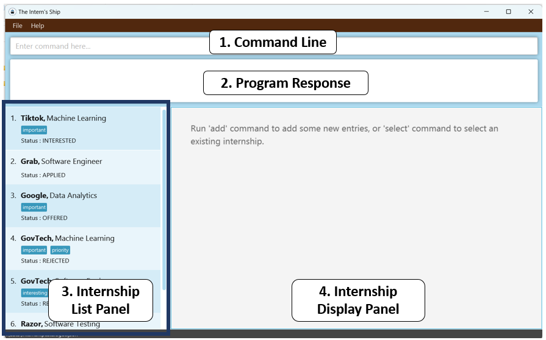
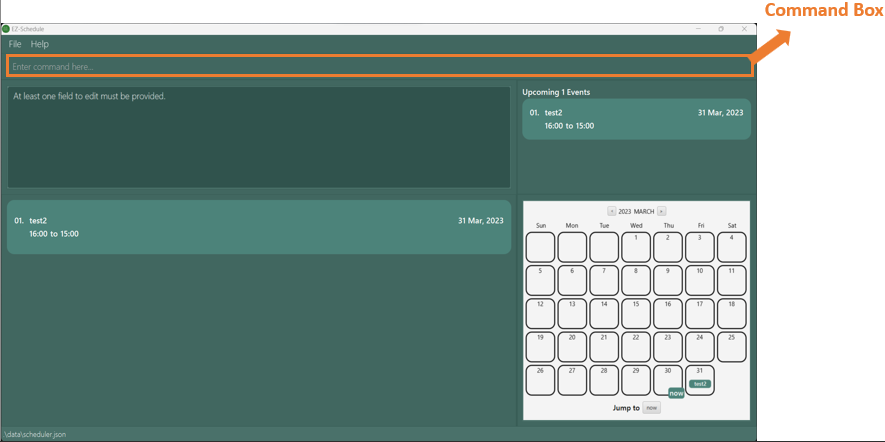
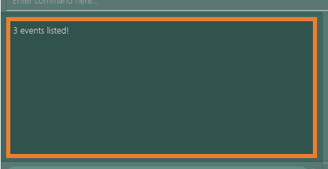
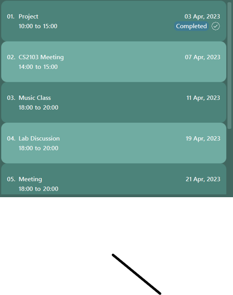
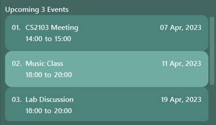
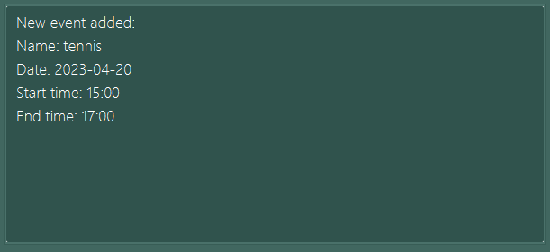
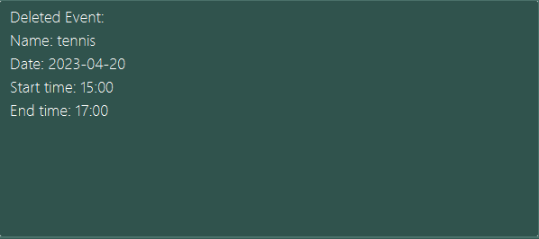

_Ez-Schedule_ is a **desktop application for managing and scheduling of events, optimized for use via a Command Line
Interface** (CLI) while still providing an easy way to visualize all events through a Graphical User Interface (GUI).

_Ez-Schedule_ will benefit a fast typist who needs to plan and track upcoming events.

:exclamation: **Danger:**  
:x: Do not attempt to modify the local storage files on your own. :x:  
Otherwise, _Ez-Schedule_ may not run as expected.

<h2 id="using-this-guide">Using this Guide</h2>
-------------------------------------
- If you are running _Ez-Schedule_ for the first time, please refer to our [Quick Start](#quick-start) guide.
- If you are learning how to use _Ez-Schedule_, please refer to our [Commands](#commands) section for a detailed guide.
- If you are interested in contributing to this project, please check out our [Developer Guide](DeveloperGuide.md).
- If you are an experienced user, you may find the [Command Summary](#command-summary) helpful as it provides a summarized table of all
  the available commands.

<h2 id="table-of-contents">Table of Contents</h2>
-------------------------------------
- [Using This Guide](#using-this-guide)
- [Table of Contents](#table-of-contents)
- [Icons Used](#icons-used)
- [Quick Start](#quick-start)
- [Graphical User Interface](#gui)
    - [Command Box](#command-box)
    - [Response Box](#response-box)
    - [Events Panel](#events-panel)
    - [Upcoming Events Panel](#upcoming-events-panel)
    - [Calendar](#calendar)
- [Summary](#summary)
  - [Prefix Summary](#prefix-summary)
  - [Command Summary](#command-summary)
- [Commands](#commands)
    - [Add a New Event](#add) : `add`
    - [Repeat an Existing Event](#recur) : `recur`
    - [Edit an Event](#edit) : `edit`
    - [Delete Events](#delete) : `delete`
    - [Locate Events](#find) : `find`
    - [Retrieve Next Events](#next) : `next`
    - [Undo Previous Command](#undo) : `undo`
    - [List All Events](#list) : `list`
    - [View Help](#help) : `help`
    - [Exit Application](#exit) : `exit`
- [Limitations](#limitations)
- [FAQ](#faq)

<h2 id="icons-used">Icons Used</h2>
-------------------------------------
This section serves to introduce the icons used throughout this guide.

:information_source: **Note:** Useful information for you to be aware of.

:bulb: **Tip:** Tips in improving your experience when using _Ez-Schedule_.

:warning: **Warning:** Used to alert you of critical instructions associated with a particular action.

:exclamation: **Danger:** Necessary cautions to heed to ensure that _Ez-Schedule_ operates as intended.

[[Back to top](#table-of-contents)]

<h2 id="quick-start">Quick Start</h2>
-------------------------------------
1. Ensure you have Java `11` or above installed in your Computer.
2. Download the latest `Ez-Schedule.jar` from [here](https://github.com/AY2223S2-CS2103-W17-3/tp/releases).
3. Copy the file to the folder you want to use as the *home folder* for your _Ez-Schedule_.
4. Open a command line terminal, `cd` into the folder you put the jar file in
5. Use the `java -jar Ez-Schedule.jar` command to run the application.

[[Back to top](#table-of-contents)]

<h2 id="gui">Graphical User Interface</h2>
-------------------------------
This section serves to introduce the GUI components in _Ez-Schedule_.

_Ez-Schedule_ is composed of the following components, which are numbered for easy reference:

1. [Command Box](#command-box)
2. [Response Box](#response-box)
3. [Events Panel](#events-panel)
4. [Upcoming Events Panel](#upcoming-events-panel)
5. [Calendar](#calendar)

<h3 id="command-box">Command Box</h3>

This component enables you to type the command in the command box and execute it by pressing Enter.  
For example, typing `help` and pressing Enter will open the help window.

[[Back to top](#table-of-contents)]

<h3 id="response-box">Response Box</h3>

This component displays the feedback of the command you entered into the command box.

[[Back to top](#table-of-contents)]

<h3 id="events-panel">Events Panel</h3>

This component displays all the events that you have.  
You can use commands like `list` and `find` to view the events in your scheduler.

:information_source: **Note:**  
Events that have past is marked with a completed label and check mark.   
Events are displayed in chronological order.  

[[Back to top](#table-of-contents)]

<h3 id="upcoming-events-panel">Upcoming Events Panel</h3>

This component displays both ongoing (if you have not started on them yet) and upcoming events that you have.

:bulb: **Tip:**
While the default is one upcoming event, 
you can use the `next` command to change the number of upcoming events shown.

[[Back to top](#table-of-contents)]

<h3 id="calendar">Calendar</h3>

This component gives you a comprehensive summary of all the events that you have for a particular month.

:information_source: **Note:**
Newly added events will appear in their corresponding calendar boxes.  
The `find` command will highlight the calendar boxes corresponding to the events that match your search criteria.

:bulb: **Tip:**
Clicking on the `now` button will take you directly back to the current date.  
Clicking on any calendar date box that has events will display those events in the events panel.

[[Back to top](#table-of-contents)]

<h2 id="summary">Summary</h2>
-------------------------------
<h3 id="prefix-summary">Prefix Summary</h3>

| Prefix | Representation | Remark                                                                                                |
|:-------|:---------------|:------------------------------------------------------------------------------------------------------|
| n/     | Name           | Name is alphanumeric only.                                                                            |
| d/     | Date           | Dates should follow a `YYYY-MM-DD` format.                                                            |
| s/     | Start time     | Time should be in 24-hour `HH:mm` format, ranging from `00:00` to `23:59`. Leading zero are required. |
| e/     | End time       | Time should be in 24-hour `HH:mm` format, ranging from `00:00` to `23:59`. Leading zero are required. |
| every/ | Every          | Recurring factor is given by day/week/month.                                                          | 

[[Back to top](#table-of-contents)]

<h3 id="command-summary">Command Summary</h3>

| Action | Command Format                                               |
|:-------|:-------------------------------------------------------------|
| Add    | `add n/<event> d/<date> s/<start time> e/<end time>`         |
| Repeat | `recur <index> d/<end date> every/<recur factor>`            |
| Edit   | `edit <index> n/<name> d/<date> s/<start time> e/<end time>` |
| Delete | `delete <index>` or `delete <index index ... index>`         |
| List   | `list`                                                       |
| Next   | `next` or `next <count>`                                     |
| Find   | `find n/<name> d/<date>`                                     |
| Undo   | `undo`                                                       |
| Help   | `help`                                                       |
| Exit   | `exit`                                                       |

[[Back to top](#table-of-contents)]

<h2 id="commands">Commands</h2>
-------------------------------
<h3 id="add">Add a New Event</h3>

Format: `add n/<event> d/<date> s/<start time> e/<end time>`

Adds an event into the scheduler.

Example: `add n/tennis d/2023-04-20 s/15:00 e/17:00`

Parameters:  
`n/`: Name of the event  
`d/`: Date of the event  
`s/`: Start time of the event  
`e/`: End time of the event

:information_source: **Note:**  
If an event is added successfully, a message similar to the one above will be displayed in the `Response Box`.  
The `Events Panel` and `Calendar` will both be updated to include the new event.

:warning: **Warning:** Adding of events that overlaps in time is not allowed.

[[Back to top](#table-of-contents)]

<h3 id="recur">Repeat an Existing Event</h3>

Format: `recur <index> d/<end date> every/<recur factor>`   

Repeats an event from the scheduler until the specified end date.

Example: `recur 1 d/2024-01-01 every/month`

Parameters:  
`d/`: Ending date of recurrence for the event  
`every/`: Recurring factor to recur the event

:warning: **Warning:**  
Event must first exist in the scheduler.  
End date should come after current event date.  
Recurring of events not existing in scheduler is not allowed.

[[Back to top](#table-of-contents)]

<h3 id="edit">Edit an Event</h3>

Format: `edit <index> n/<event> d/<date> s/<start time> e/<end time>`  

Edits an event in the scheduler.

Example: `edit 1 n/tennis` or `edit 3 d/2023-06-01 s/10:00`

Parameters:  
`n/`: Name of the event  
`d/`: Date of the event  
`s/`: Start time of the event  
`e/`: End time of the event

:information_source: **Note:**  
If an event is edited successfully, a message similar to the one above will be displayed in the `Response Box`.  
Any changes made to the event will be reflected in both the `Events Panel` and `Calendar`.

:warning: **Warning:** At least one field must be provided.

[[Back to top](#table-of-contents)]

<h3 id="delete">Delete Events</h3>

Format: `delete <index>` or `delete <index index ... index>`  

Deletes the event(s) in the scheduler.

Example: `delete 1` or `delete 1 4 5`

:information_source: **Note:**  
If an event is deleted successfully, a message similar to the one above will be displayed in the `Response Box`.  
Deleting the event will cause it to be removed from both the `Events Panel` and `Calendar`.  

:warning: **Warning:** Index must be a positive integer and exist in the scheduler.

[[Back to top](#table-of-contents)]

<h3 id="find">Locate Events</h3>

Format:`find n/<name> d/<date>`  

Search the scheduler and returns all events that matches the name, date or a combination of both.

Example: `find n/tennis` or `find d/2023-03-01` or `find n/tennis d/2023-03-01`

Parameters:  
`n/`: Name of the event  
`d/`: Date of the event

:information_source: **Note:** Partially matching names will also be considered as a match.  

:warning: **Warning:** At least one field must be provided.

[[Back to top](#table-of-contents)]

<h3 id="next">Retrieve Next Events</h3>

Format:`next <count>`  

Shows the next upcoming event(s).

Example: `next` or `next 2`

Parameter:  
`<count>`: Number of upcoming events to show.
           **Optional** - if not indicated, only the next one event is shown.

:information_source: **Note:** If count is larger than the number of existing events, then all events are shown.

[[Back to top](#table-of-contents)]

<h3 id="undo">Undo Previous Command</h3>

Format: `undo`  

Undo the previously executed valid command.

Example: `undo`

:warning: **Warning:** `undo` is only applicable for `add`, `delete`, `edit` and `recur` commands.

[[Back to top](#table-of-contents)]

<h3 id="list">List All Events</h3>

Format: `list`  

Displays all events currently saved in the scheduler.

Example: `list`

[[Back to top](#table-of-contents)]

   
<h3 id="help">View Help</h3>

Format: `help`  

Provide a link to access this website.

Example: `help`

[[Back to top](#table-of-contents)]

<h3 id="exit">Exit Application</h3>

Format: `exit`  

Exits the application.

Example: `exit`

[[Back to top](#table-of-contents)]

<h2 id="limitations">Limitations</h2>
-------------------------------------
- Currently, we only support same-day events.
  Events which stretches across multiple days are not supported.
- `undo` can only undo the most recent valid command.
- Data files are not allowed to be modified directly.
  Integrity of data files are not verified, hence modified data files might introduce bugs into the program.

[[Back to top](#table-of-contents)]

<h2 id="faq">FAQ</h2>
-------------------------------------
**Q:** On a scale of 1 to 10, how awesome is _Ez-Schedule_?  
**A:** I would say off the charts, but it looks like 10 is the highest :v:

**Q:** What is one example of someone who would use this?  
**A:** A secretary who needs to keep track the boss's meetings,
       and inform the boss of what the next meeting is for.

**Q:** I am not allowed to add an event with no start/end time. Why?  
**A:** Events with no start/end time are not the focus of _Ez-Schedule_,
       since these events inherently cannot be scheduled.

**Q:** The `recur` feature only allow me to repeat in certain frequency. It does not have the frequency I want.  
**A:** Oh no, that is sad to hear. As a extra feature designed for user convenience,
       we cannot possibly support everyone's preferred frequency.
       In case that you really need to have events repeating at an unsupported frequency,
       you can manually add the events one by one. (You type fast, right? :sunglasses:)

**Q:** The calendar only displays a one or two events only,
       even though I have more events on that day. Is this a bug?  
**A:** As with other conventional calendar applications (eg. Google/Outlook calendar),
       the UI has limited space and thus almost impossible to display all events on that day.

**Q:** You say this is optimised for CLI use, but there is no command to transverse the calendar?  
**A:** The calendar UI is a value-added feature and is not meant to totally replace the `find` feature,
       which allows the user to focus directly to a specific day.

[[Back to top](#table-of-contents)]
