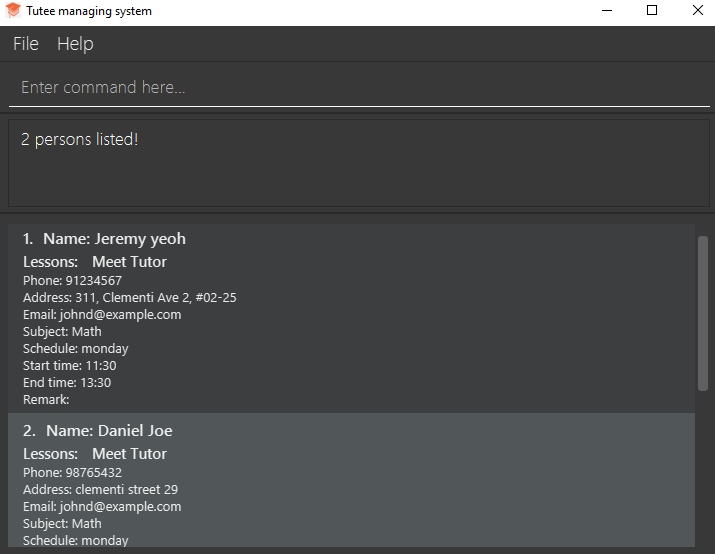
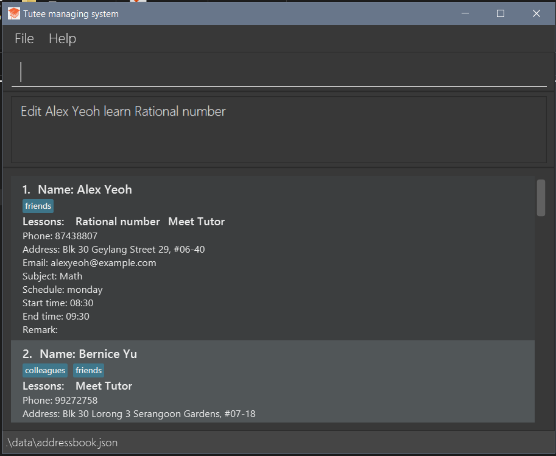
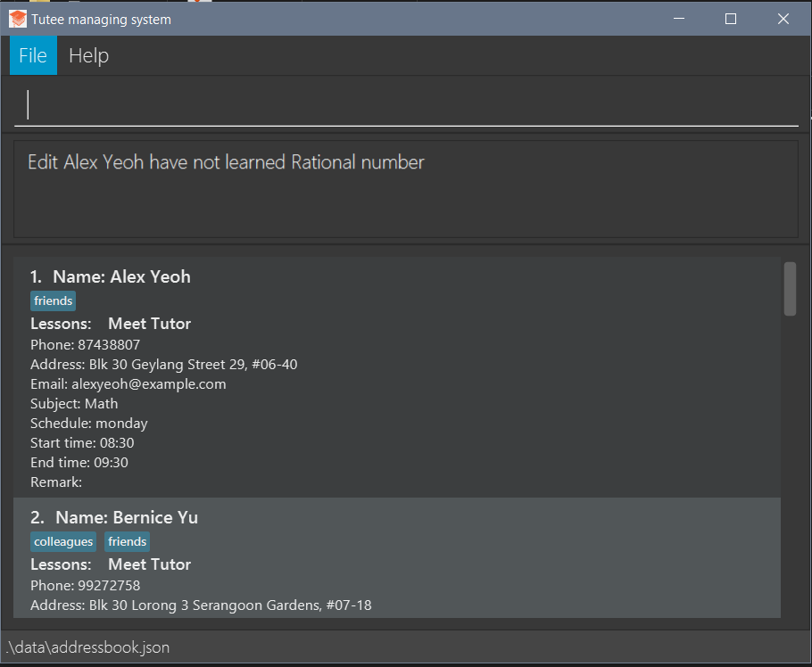

## INTRODUCTION

Too many students to count? Sick and tired of scrolling through excel cells to find the date of your student's next lesson? Fret not, we present to you our revolutionary solution for managing your tutees, the Tutee managing system (TMS).
TMS is a **desktop application designed for private tutors managing students, optimized for use via a Command Line Interface** (CLI) while still having the benefits of a Graphical User Interface (GUI). TMS utilizes your fast typing ability to execute your management tasks faster than traditional GUI apps.

[TABLE OF CONTENTS](#table-of-content)

[Quick start](#quickstart)

[Features](#features)
1. [Viewing help](#help)
2. [Add student](#add)
3. [Delete student](#delete)
4. [List student](#list)
5. [Filter student](#filter)
6. [Add a lesson](#learn)
7. [Remove a lesson](#unlearn)
8. [Local save](#save)
9. [Local load](#load)
10. [Exit program](#exit)

--------------------------------------------------------------------------------------------------------------------

## Quick start <a name="quickstart"></a>

1. Ensure you have Java `11` or above installed in your Computer.

1. Download the latest `TMS.jar` from [here](https://github.com/AY2223S2-CS2103T-W10-4/tp/releases).

1. Copy the file to the folder you want to use as the _home folder_ for your Tutee Managing System.

1. Open a command terminal, `cd` into the folder you put the jar file in, and use the `java -jar addressbook.jar` command to run the application.<br>
   A GUI similar to the below should appear in a few seconds. Note how the app contains some sample data.<br>
   

1. Type the command in the command box and press Enter to execute it. e.g. typing **`help`** and pressing Enter will open the help window.<br>
   Some example commands you can try:

   * `list` : Lists all students.

   * `add n/John Doe p/98765432 e/johnd@example.com a/John street, block 123, #01-01 s/Math sch/monday st/09:30 et/11:30` : Adds a student named `John Doe` to the Address Book.

   * `delete 3` : Deletes the 3rd student shown in the current list.

   * `clear` : Deletes all students.

   * `exit` : Exits the app.

1. Refer to the [Features](#features) below for details of each command.

--------------------------------------------------------------------------------------------------------------------

## FEATURES <a name="features"></a>


<div markdown="block" class="alert alert-info">

**:information_source: Notes about the command format:**<br>

* Words in `UPPER_CASE` are the parameters to be supplied by the user.<br>
  e.g. in `add n/NAME`, `NAME` is a parameter which can be used as `add n/John Doe`.

* Items in square brackets are optional.<br>
  e.g `n/NAME [t/TAG]` can be used as `n/John Doe t/friend` or as `n/John Doe`.

* Items with `…`​ after them can be used multiple times including zero times.<br>
  e.g. `[t/TAG]…​` can be used as ` ` (i.e. 0 times), `t/friend`, `t/friend t/family` etc.

* Parameters can be in any order.<br>
  e.g. if the command specifies `n/NAME p/PHONE_NUMBER`, `p/PHONE_NUMBER n/NAME` is also acceptable.

* If a parameter is expected only once in the command but you specified it multiple times, only the last occurrence of the parameter will be taken.<br>
  e.g. if you specify `p/12341234 p/56785678`, only `p/56785678` will be taken.

* Extraneous parameters for commands that do not take in parameters (such as `help`, `list`, `exit` and `clear`) will be ignored.<br>
  e.g. if the command specifies `help 123`, it will be interpreted as `help`.

</div>

## Viewing help <a name="help"></a>

Shows a message explaning how to access the help page.


Format: `help`

## Add student <a name="add"></a>

Adds a student to the managing system.

Format: ```add n/NAME p/PHONE_NUMBER e/EMAIL a/ADDRESS s/SUBJECT sch/SCHEDULE st/START TIME et/END TIME```
Subject supported: {`Math`, `Physics`, `English`}
Schedule supported: {`monday`, `tuesday`, `wednesday`, `thursday`, `friday`, `saturday`, `sunday`}

Examples:

* ```add n/John Doe p/98765432 e/johnd@example.com a/block 224 s/Math sch/monday st/09:30 et/11:30```


## Delete student <a name="delete"></a>

Removes a student from the managing system.

Format: ```delete INDEX```

Examples:

* ```delete 1```


## List students <a name="list"></a>

Lists students in the managing system.

Format: ```list```

Examples:

* ```list``` 


## Editing a person : `edit`

Edits an existing person in the address book.

Format: `edit INDEX [n/NAME] [p/PHONE] [e/EMAIL] [a/ADDRESS] [t/TAG]…​`

* Edits the person at the specified `INDEX`. The index refers to the index number shown in the displayed person list. The index **must be a positive integer** 1, 2, 3, …​
* At least one of the optional fields must be provided.
* Existing values will be updated to the input values.
* When editing tags, the existing tags of the person will be removed i.e adding of tags is not cumulative.
* You can remove all the person’s tags by typing `t/` without
    specifying any tags after it.

Examples:
*  `edit 1 p/91234567 e/johndoe@example.com` Edits the phone number and email address of the 1st person to be `91234567` and `johndoe@example.com` respectively.
*  `edit 2 n/Betsy Crower t/` Edits the name of the 2nd person to be `Betsy Crower` and clears all existing tags.

## Locating students by name: `find`

Finds persons whose names contain any of the given keywords.

Format: `find KEYWORD [MORE_KEYWORDS]`

* The search is case-insensitive. e.g `hans` will match `Hans`
* The order of the keywords does not matter. e.g. `Hans Bo` will match `Bo Hans`
* Only the name is searched.
* Only full words will be matched e.g. `Han` will not match `Hans`
* Persons matching at least one keyword will be returned (i.e. `OR` search).
  e.g. `Hans Bo` will return `Hans Gruber`, `Bo Yang`

Examples:
* `find John` returns `john` and `John Doe`
* `find alex david` returns `Alex Yeoh`, `David Li`<br>
  

## Filter students by any fields <a name='filter'></a>

Filter and list students whose fields contain any of the given keywords.

Format: ```filter [n/NAME] [p/PHONE] [e/EMAIL] [a/ADDRESS] [s/SUBJECT] [sch/SCHEDULE] [st/START TIME] [et/END TIME] [t/TAG]```

- Filter is case-insensitive. e.g `n/yeoh` will match `Yeoh`
- Only `NAME`, `ADDRESS`, `TAG` can include more than 1 word.
- At least one of the fields must be provided.
- The order of the keywords does not matter. e.g. `n/Yeoh Alex` will match `Alex Yeoh`
- All fields can be searched and filtered.
- Only full words will be matched e.g. `n/Yeo` will not match `Yeoh`
- When only one field is specified, tutees matching at least one keyword will be returned(i.e. `OR` search). e.g. `a/blk street` will return `Blk 313`, `street 29`
- When more than one field is specified, only tutees whose keywords matching all fields provided will be returned
e.g. `filter s/math sch/monday` will only return tutees whose lessons are on `monday` AND subject `math`

Examples:
- `filter sch/tuesday` returns tutees whose lessons are on tuesday.
- `filter a/clementi s/math` returns tutees whose address are in `clementi` and being tutored `math` subject.


## Add a new lesson <a name="learn"></a>

Add a lesson taught to a student.

Format: ```learn [INDEX] [l/LESSON]```

Examples:

* ```learn 1 l/Rational number```


## Remove a lesson <a name="unlearn"></a>

Remove a lesson taught to a student.

Format: ```unlearn [INDEX] [l/LESSON]```

Examples:

* ```unlearn 1 l/Rational number```
  

## Local save <a name="save"></a>

Saves the current state of the program on the hard disk upon exit.

Done automatically.

## Local load <a name="load"></a>

Loads the saved state of the program (if there is any) on the hard disk.

Creates an empty file if there is none.

Done automatically.

### Clearing all entries : `clear`

Clears all entries from the address book.

Format: `clear`

## Exit program <a name="exit"></a>

Exit the program.

Format: ```exit```

## Mark/Unmark attendance
Use `mark` to indicate that the tutee was present on the given dates, `unmark` to indicate that
they were absent. If a date is not specified, the current date is used.\
If the tutee was already absent or present, the command will have no effect.

Format: `mark/unmark <index> [date...]`

## Query Command
Use this command to check the tutee's attendance. If no date is given, all of the dates that tutee was present on.\
Otherwise, the command will return if the tutee was present on the given date.

Format: `query <index> [date]`
