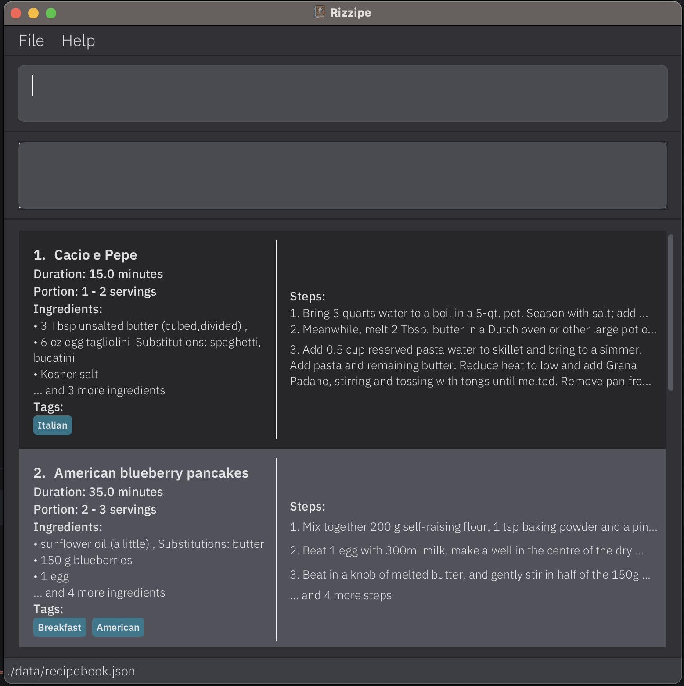
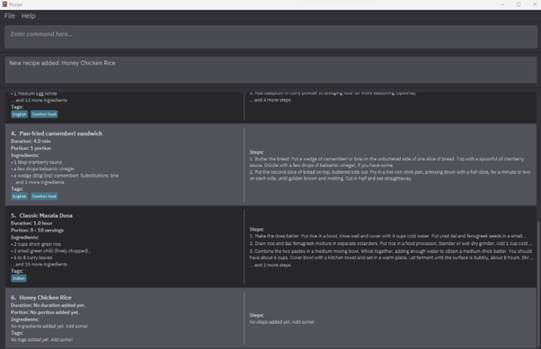
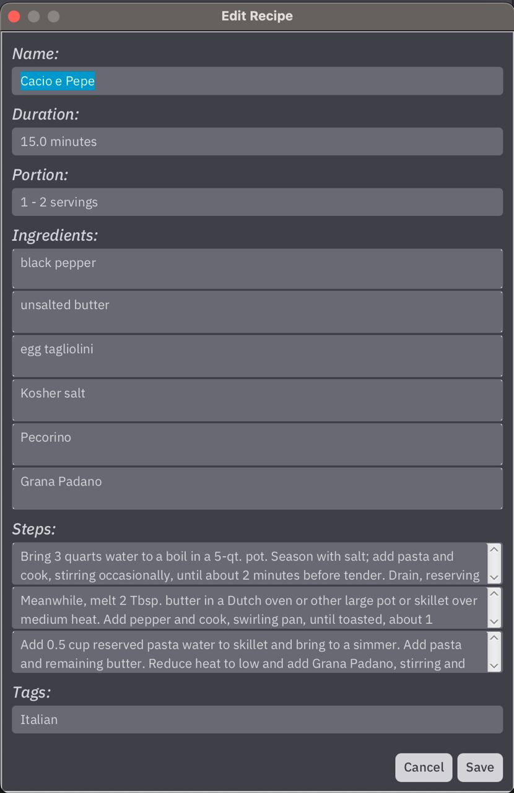
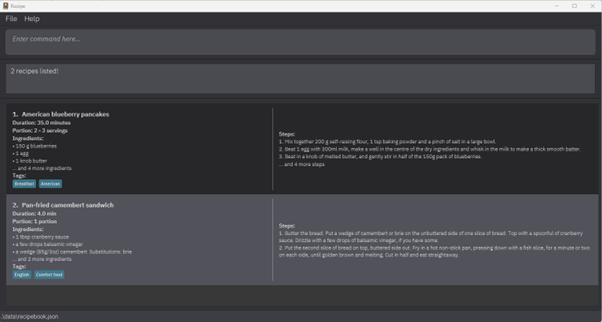
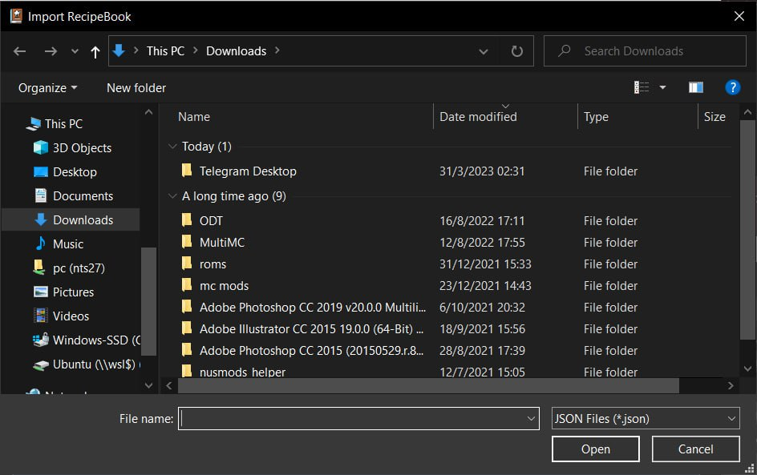
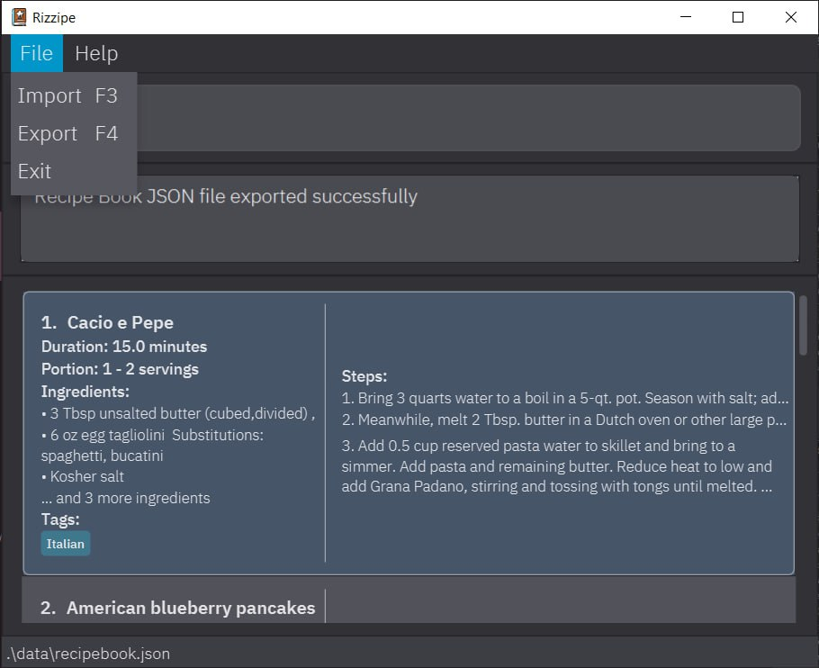

***RIZZ***ipe is a **command-based recipe database** that was designed with **versatile tagging** and **searching**
features in mind so you can always find the recipe you need! Make use of ***RIZZ***ipe's many features to achieve your
**culinary rizz**.

* Table of Contents
{:toc}

---

## Quick Start
Let's get you _rizzed_ up in the fastest way possible!

1. Ensure you have Java `11` or above installed in you computer.
2. Download the latest `recipebook.jar` [here](https://github.com/AY2223S2-CS2103T-T13-2/tp/releases)
3. Copy the file to the folder you want to use as the _home folder_ for ***RIZZ***ipe.
4. Open a command terminal, `cd` into the folder you put the jar file in, and use the `java -jar
   recipebook.jar` command to run the application.
5. A GUI similar to the below should appear in a few seconds. Note that our experienced _Rizzers_ have crafted
some sample recipes for you already.

6. Navigate through the main window easily using just your keyboard! Toggle between recipes simply by using `up` and `down` arrow keys!
7. Type commands within the command line interface (CLI) and press enter to execute it. For a list of executable 
commands, refer to the [Features](#features) Section.
8. Some of the previously mentioned executable commands may have keyboard shortcuts to make your life easier! Refer to each command within
the [Features](#features) Section, or take a look at the [Keyboard Shortcuts summary](#keyboard-shortcuts-summary) to learn more about how to use them!

---
## Features

**:information_source: Notes about the command format:** 

* Words in `UPPER_CASE` are the parameters to be supplied by the user. 
  i.e. in `add NAME`, `NAME` is a parameter which can be used as `add Grilled Salmon`.

* Parameters in square brackets `[]` refer to optional parameters that can be excluded.
  i.e. `n/RECIPE_NAME [d/RECIPE_DURATION]` can be used as `n/Cheese Sandwich d/10 minutes` or `n/Cheese Sandwich`.

* Parameters with `...` behind them can be used multiple times, including 0.
  i.e. `[t/TAGS]` can be used as ` ` (zero times), `t/HALAL`, `t/HALAL t/BREAKFAST` etc.

* Parameters can be in any order
  i.e. if a command specifies `n/RECIPE_NAME d/RECIPE_DURATION`, `d/RECIPE_DURATION n/RECIPE_NAME` is also acceptable.

* Extraneous parameters for commands that do not take in parameters (such as `help`, `list`, `exit` and `clear`) will be ignored. 
  e.g. if the command specifies `help 123`, it will be interpreted as `help`.

* :bulb: Important tip: For increased readability, we have included an optional multi-line command format for commands that may require multiple inputs (add, edit). After each input,
you can include a line break just by simply entering a backslash `\` to move on to the next line to continue writing the next part of your command input! Note that you will not have to delete the backslash that appears
before continuing to type!

### Adding a recipe: `add`

Come up with a new innovative recipe and want to store it for future reference,
and want to classify it by ingredients? Simply run the `add` command, and follow the prompts!

Format:
`add n/RECIPE_NAME [d/RECIPE_DURATION] [p/RECIPE_PORTION] [t/RECIPE_TAGS]...  [i/-n INGREDIENT_NAME [-a INGREDIENT_AMOUNT] [-e ESTIMATED AMOUNT] [-cn COMMON NAME] [-r REMARKS]... [-s SUBSTITUTION]...]... [s/RECIPE_STEPS]...`

Example(s) of usage:
* `add n/Honey Chicken Rice`

* `add n/Chicken Noodles d/20 minutes p/1-2 people i/-n chicken thigh -a 300g i/-n noodles i/-n soy sauce -a 2 tablespoons -s salt`
* `add n/Peanut Butter Sandwich t/breakfast s/Prepare bread and spread s/Using a knife, spread 2-3 scoops of peanut
  butter s/Serve`

> :bulb: Tip: A recipe can have any number of steps, tags and ingredients (including 0)!
>
> :bulb: Tip: It is only compulsory to include the **recipe name** when you first add the recipe into recipe book!
>
> :bulb: Tip: When adding an ingredient, it is only compulsory to include the **ingredient name**. However, you can also add in additional details such as amount (**RECOMMENDED**) and substitutions etc.!
>
> Although optional, we do however suggest adding in the other fields if possible for your own future reference.
>
> If you have multiple inputs for tags, steps or ingredients, treat each input as a separate field (i.e. `s/Step1 s/step2`).
>
> Similar to parameters, ingredient fields do not have to be input in order (`-a` can come before `-n` etc.).
>
> However, for steps, please input the steps in the order that they are intended to be performed.
>

### Adding a recipe through form: `addf`
Want to add a delicious new recipe but don't want to type the whole long string of inputs at one go? 
Use our interactive form feature to add your favorite recipe to the recipe book today!

Format: 
`addf`

> An empty pop-up form as shown in the image below will appear!
> 
> 
>
> Tab to move on to the next input field, and shift+tab to go to the previous field!
>
> A new row automatically pops up when you reach the last row for ingredients and steps, and once you're done just click to the next field!
>
> Click on Save to add your recipe to the recipe book!

### Listing all recipes: `list`

Ever forget how many recipes you have in your storage? Want to view 'em all? Or
simply want to pick a recipe at random? Just run the `list` command.

Format:
`list`

> Lists all recipes that are in the storage, in the chronological order they were added.
>
> Depending on the size of the window, the user may add multiple columns to display more recipes.
>
> :bulb: Tip: The `list` command can be used to reset the most recently searched list to the full recipe list after performing a `find` command!
>
> In order to zoom in on a particular recipe in the list, user can double-click on the corresponding recipe.

Keyboard shortcut: 
To navigate the list, you can use the `up` and `down` arrow keys (as previously mentioned in the QuickStart).
While the recipe to that you want to zoom in to is being selected, simply type `p` to view that particular recipe's details! 

### Editing a recipe: `edit`

Made a mistake or just omitted some important details when you first stored your recipe in the recipe book? 
Don't fret, for the `edit` command is here for you to supplement these new details to increase the _rizz_ on your recipes!

Format: 
`edit INDEX [n/RECIPE_NAME] [d/RECIPE_DURATION] [p/RECIPE_PORTION] [t/RECIPE_TAGS]...  [i/-n INGREDIENT_NAME [-a INGREDIENT_AMOUNT] [-e ESTIMATED AMOUNT] [-cn COMMON NAME] [-r REMARKS]... [-s SUBSTITUTION]...]... [s/RECIPE_STEPS]...`

> Edits the recipe at the specified index. The index refers to the index number shown in the displayed recipe list. 
> 
> The index **must be a positive integer** 1,2,3,...
> 
> All existing values will be updated to the new input values!
> 
> When editing tags, ingredients and steps, all the existing values for these fields will be removed (i.e. adding of tags, ingredients and steps is not cumulative!)
> 
> You can remove the optional fields (all fields except for name) by simply typing the prefix without specifying any details after it (i.e. typing `i/` removes all ingredients)
> 
> :bulb: Important tip: Alternatively, you can use the edit popup form (shown below) that can be triggered using the keyboard shortcut displayed below.
> 
> 

Keyboard shortcut:
As an alternate means to typing the full command, we provide a popup form to edit a recipe!
While the recipe to that you want to edit is being selected, simply type `f` to display the popup form for that particular recipe!

### Finding a recipe by name: `find`

Have a certain recipe at the back of your mind that you want to refer to?
Or want to look up all recipes associated with a specific tag or those containing a specific ingredient?

`find` helps to save your time scrolling through your whole list of recipes by displaying
only those that match any of your specified keywords straight away.

Format:
`find [PROPERTY] KEYWORD [ADDITIONAL KEYWORDS]...`
> :bulb: Tip: Supported properties: `name`, `tag`, `ingredient`

i.e. `find name KEYWORD [ADDITIONAL KEYWORDS]...`, `find tag KEYWORD [ADDITIONAL KEYWORDS]...`, `find ingredient KEYWORD [ADDITIONAL KEYWORDS]...`

Example(s) of usage:
* `find cheese` returns all recipes with the keyword `cheese` in their recipe name
* `find name pancakes sandwich` returns all recipes with the keyword `pancakes` and/or `sandwich` in their names

* `find tag western` returns all recipes with the tag `western`
* `find ingredient tofu` returns all recipes with the ingredient `tofu`

> Adding a property behind `find` is optional, and if no property is specified, `find` defaults to filtering by `name`.
>
> All keyword queries are case-insensitive. e.g. `chicken` will match `Chicken`
>
> Recipes matching at least one keyword will be returned, e.g. searching `sandwich fries` will match recipes named `cheese fries` and `ham sandwich`
>
> Recipes are listed in the chronological order that they were added.
>
> The order of the keywords does not matter. e.g. `ham sandwich` will match a recipe named `sandwich ham`
>
> Only full words will be matched. e.g. `chick` will **not** match `chicken`

### Deleting a recipe: `delete`

No longer like a certain recipe? Simply delete it from the database by its index!

Format:
`delete INDEX`

Example(s) of usage:
* `list` followed by `delete 2` deletes the 2nd item stored in the recipe book.
*  `find chicken` followed by `delete 1` will delete the 1st recipe in the displayed results of the find command.

> Deletes the dish at the specified `INDEX` of the latest list that was displayed.
>
> The index **must be a positive integer** 1, 2, 3, …

Keyboard shortcut:
While the recipe you want to delete is being selected, simply hit the `delete` or `backspace` key and click on confirm to delete that particular recipe!

### Searching for substitutions for an ingredient: `sub`

Short of a particular condiment or ingredient to complete your favourite recipe? Have no fear, for the `sub` command
provides you with a hassle-free way to solve your problem by suggesting some common substitutions so that you can complete your
dish with an alternative ingredient!

Format:
`sub INGREDIENT_NAME`

Example(s) of usage:
* `sub chicken` returns a list of suggested substitutions for the ingredient `chicken`

> `sub` searches across your stored recipes and within a preloaded suggested substitutions list to provide you with the most accurate and extensive list of substitutions!
>
> :bulb: Tip: Adding a substitution together with an ingredient is recommended since it will boost the number of substitutions listed when that ingredient is queried in the future!
>
> The search is case-insensitive, i.e. `sub salt` will return all stored substitutions for `Salt` and `salt` across recipes.
>
> Only full words will be matched i.e. `sub chick` will **not** return stored substitutes for `chicken`
>
> For inputs with multiple words, it will only match stored ingredients with the same full multi-word input (case-insensitive) i.e. `sub golden syrup` does not return substitutes for `syrup`
>
> The returned list of ingredients returned will not contain any duplicates.

### Clearing the recipe book: `clear`

Want to change things up and start a new recipe book afresh? Simply run the `clear` command to wipe the memory
and start afresh!

Format:
`clear`

### Asking for assistance: `help`

Unsure or unable to remember our list of commands and how to format your inputs? Fret not, as simply inputting
`help` will save you from your woes.

Format:
`help`

> :bulb: Tip: `help` links to this user guide, which is a quick way to refresh your memory on any command that might have slipped your mind!

### Exiting the program: `exit`

Exits the program and closes the window.

Format:
`exit`

---

## Managing the Data

### Saving the data

Recipe data are saved in the hard disk automatically after any command that changes the data. There is no need to save manually.

### Editing the data file

Recipe data are saved as a JSON file `[JAR file location]/data/recipebook.json`. Advanced users are welcome to update data directly by editing that data file.

:exclamation: **Caution:**
If your changes to the data file makes its format invalid, ***RIZZ***ipe will discard all data and start with an empty data file at the next run.

### Importing data

The keyboard input `F3` will open an import window from the main window (as shown in the image below). From there, select the JSON
file to be imported using the selector.

* Only files with correct and non-duplicate recipes will be imported
* Any imported recipes will be added to your current recipe book!
* Alternatively, you can access the import function from the `File` option in the top left corner of the main window.

### Exporting data

The keyboard input `F4` will open an export window from the main window (as shown in the image below). From there, input the file name of the
JSON file to be exported and select the desired location for it to be saved!

* Alternatively, like the import function, you can access the export function from the `File` option in the top left corner of the main window.

---

## FAQ

**Q**: How do I transfer my data to another Computer? 
**A**: Install the app in the other computer and overwrite the empty data file it creates with the file that contains the data of your previous recipe home folder.

---

## Command summary

| Action     | Format, Examples                                                                                                                                                                                                                                                                                                                                                               |
|------------|--------------------------------------------------------------------------------------------------------------------------------------------------------------------------------------------------------------------------------------------------------------------------------------------------------------------------------------------------------------------------------|
| **Add**    | `add n/RECIPE_NAME [d/RECIPE_DURATION] [p/RECIPE_PORTION] [t/RECIPE_TAGS]...  [i/-n INGREDIENT_NAME [-a INGREDIENT_AMOUNT] [-e ESTIMATED AMOUNT] [-cn COMMON NAME] [-r REMARKS]... [-s SUBSTITUTION]...]... [s/RECIPE_STEPS]...`   e.g., `add n/Chicken Noodles d/20 minutes p/1-2 people i/-n chicken thigh -a 300g i/-n noodles i/-n soy sauce -a 2 tablespoons -s salt` |
| **List**   | `list`                                                                                                                                                                                                                                                                                                                                                                         |
| **Edit**   | `edit INDEX [n/RECIPE_NAME] [d/RECIPE_DURATION] [p/RECIPE_PORTION] [t/RECIPE_TAGS]...  [i/-n INGREDIENT_NAME [-a INGREDIENT_AMOUNT] [-e ESTIMATED AMOUNT] [-cn COMMON NAME] [-r REMARKS]... [-s SUBSTITUTION]...]... [s/RECIPE_STEPS]...`  `edit 2 n/Duck Rice p/1 person`                                                                                                 |
| **Find**   | `find [PROPERTY] KEYWORD [ADDITIONAL KEYWORDS]...    ` for properties: `name`, `tag`, `ingredient`   e.g., `find cheese rice`, `find name popcorn`, `find tag western`, `find ingredient tofu`                                                                                                                                                                             |
| **Delete** | `delete INDEX`  e.g., `delete 2`                                                                                                                                                                                                                                                                                                                                           |
| **Sub**    | `sub INGREDIENT_NAME`  e.g. `sub salt`                                                                                                                                                                                                                                                                                                                                     |
| **Clear**  | `clear`                                                                                                                                                                                                                                                                                                                                                                        |
| **Help**   | `help`                                                                                                                                                                                                                                                                                                                                                                         |
| **Exit**   | `exit`                                                                                                                                                                                                                                                                                                                                                                         |

## Keyboard Shortcuts summary

