E-Lister is a comprehensive **desktop app**, specially designed for **insurance agents and other financial professionals** to streamline the management of their customers' contact information. This powerful tool provides users with:
1.	Basic operations **(e.g. add, edit, delete, tag, find)** to work on contact details via CLI (Command Line Interface) and user-customized tags for labeling.
2.	Other useful operations **(e.g. filter, mass operation, freeze)** for advanced users to handle data in meaningful ways.
3.	Ability to **import** and work on existing CSV files.
4.	Additional commands **(e.g. undo, shortcut)** for a smooth, personalised experience.
5. An extensive yet friendly user interface.

* Table of Contents
{:toc}

--------------------------------------------------------------------------------------------------------------------

## **Quick start**

1. Ensure you have Java `11` or above installed on your Computer.

1. Download the latest `eLister.jar` from [here](https://github.com/AY2223S2-CS2103T-T17-3/tp/releases).

1. Copy the file to the folder you want to use as the _home folder_ for E-Lister.

1. Open a command terminal, `cd` into the folder you put the jar file in, and use the `java -jar eLister.jar` command to run the application. 
   A GUI similar to the picture below should appear in a few seconds. Note how the app contains some sample data. 
   

1. Type the command in the command box and press Enter to execute it. e.g. typing **`help`** and pressing Enter will open the help window. 
   Some example commands you can try:

   * `list` : Lists all contacts.

   * `add n/John Doe p/98765432 e/johnd@example.com a/John street, block 123, #01-01 i/10000` : Adds a contact named `John Doe` to the E-Lister.

   * `delete 3` : Deletes the 3rd contact shown in the current list.

   * `clear` : Deletes all contacts.

   * `exit` : Exits the app.

1. Refer to the [Features](#features) below for details of each command.

--------------------------------------------------------------------------------------------------------------------
## **Interface Navigation**
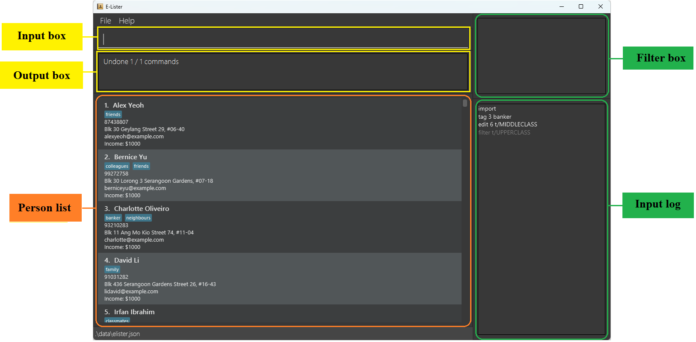

The user interface consists of five parts: input and output, along with three view boxes for the person list, applying filters, and input log. You can see these sections' descriptions below:

Section | Description
--------|------------------
**Input box** | This is where you key in your command for E-Lister.
**Output box** | This box displays E-Lister's responses to your input.
**Person list** | This is a panel containing the list of people and their information.
**Filter box** | This box displays all currently applying filters on the person list. [See more](#applying-filters-display)
**Input log** | This is where you can see all your successfully executed commands. [See more](#input-log)

Inside the **Person list**, each person has a **Person Card**, this is the breakdown of a person card:

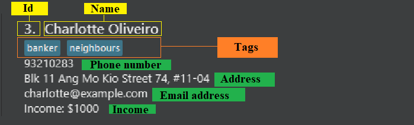

---------------------------------------------------------------------------------------------------------------------------------

## **Features**

**Some notices before going through this guide:** 
* Any notation with a letter followed by a `/` is referred to as a input field for user to key in. 
e.g `t/TAG`, `n/NAME`, `p/PHONE_NUMBER`, etc

* Words in `UPPER_CASE` are the input values for you to supply. 
  e.g. in `add n/NAME`, `NAME` is an input value which can be used as `add n/John Doe`.

* Words separated by `|` indicate that you should only pick one of the keywords. 
  e.g. `all|shown` indicates that you may enter either `all` or `shown`.

* Items in square brackets are optional. 
  e.g `n/NAME [t/TAG]` can be used as `n/John Doe t/friend` or as `n/John Doe`.

* Items with `…`​ after them can be used multiple times including zero times. 
  e.g. `[t/TAG]…​` can be used as ` ` (i.e. 0 times), `t/friend`, `t/friend t/family` etc.

* Input  can be in any order. 
  e.g. both the commands following `n/NAME p/PHONE_NUMBER`, `p/PHONE_NUMBER n/NAME` are acceptable with the same effect.

* If a input field is expected only once in the command but you specified it multiple times, only the last occurrence of the input field will be taken. 
  e.g. if you specify `p/12341234 p/56785678`, only `p/56785678` will be taken.

* Extraneous input values for commands that do not take in input values (such as `help`, `list`, `exit` and `clear`) will be ignored. 
  e.g. if the command specifies `help 123`, it will be interpreted as `help`.

### Viewing help : `help`

Shows a help message detailing the various commands available in E-Lister.
It also includes a link to this user guide so you do not need to remember this website's address!

Format: `help`

### **Basic operations**

#### Adding a person: `add`

:bulb: **Tip:**
If you have an existing CSV dataset, you may choose to <ins>**[import it directly](#import-and-export-csv-file)**</ins> rather than adding each contact individually.

Adds a person to E-Lister.

Format: `add n/NAME p/PHONE_NUMBER e/EMAIL a/ADDRESS i/INCOME [t/TAG] [t/MORE_TAGS]…​`

:bulb: **Tip:**
A person can have any number of tags (including 0)
Income field can only have 5 decimals and smaller than 1 Trillion.

Examples:
* `add n/John Doe p/98765432 e/johnd@example.com a/John street, block 123, #01-01 i/10000`
* `add n/Betsy Crowe t/friend e/betsycrowe@example.com a/Newgate Prison p/1234567 t/criminal i/10000`
* `add n/John Doe p/98765432 e/johnd@example.com a/John street, block 123, #01-01 i/400`
* `add n/Betsy Crowe t/friend e/betsycrowe@example.com a/Newgate Prison p/1234567 i/200 t/criminal`

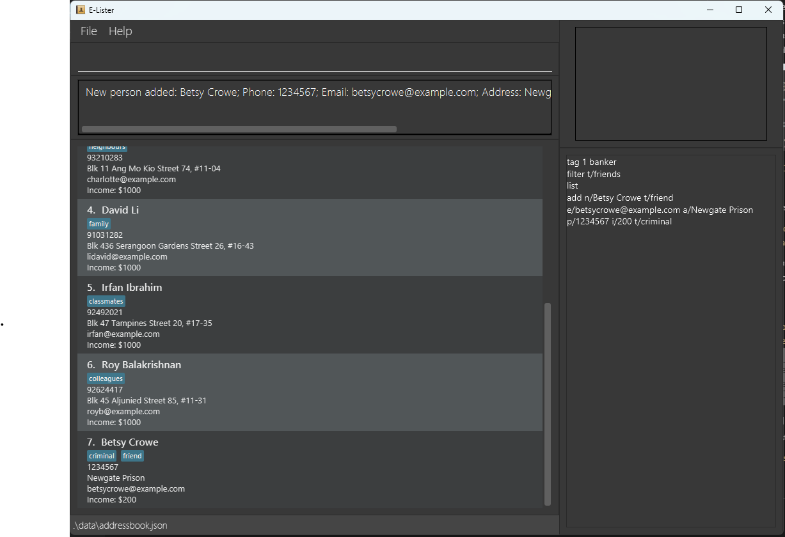

#### Deleting a person : `delete`

Deletes the specified person from E-Lister.

Format: `delete INDEX`

* Deletes the person at the specified `INDEX`.
* The index refers to the index number shown in the displayed person list.
* The index **must be a positive integer** 1, 2, 3, …​

Examples:
* `list` followed by `delete 2` deletes the 2nd person in E-Lister.
* `find Betsy` followed by `delete 1` deletes the 1st person in the results of the `find` command.
* `delete 6` will delete the 6th person in E-Lister (which is Betsy Crowe in this example).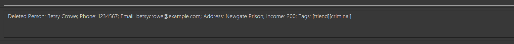

#### Editing a person : `edit`

Edits an existing person in the E-Lister.

Format: `edit INDEX [n/NAME] [p/PHONE] [e/EMAIL] [a/ADDRESS] [i/INCOME] [t/TAG] [t/MORE_TAGS]…​`

* Edits the person at the specified `INDEX`. The index refers to the index number shown in the displayed person list. The index **must be a positive integer** 1, 2, 3, …​
* At least one of the optional fields must be provided.
* Existing values will be updated to the input values.
* When editing tags, the existing tags of the person will be removed i.e adding of tags is not cumulative.
* You can remove all the person’s tags by typing `t/` without
    specifying any tags after it.
* Income field can only have 5 decimals and smaller than 1 Trillion.

Examples:
*  `edit 1 p/91234567 e/alex_clone@example.com` Edits the phone number and email address of the 1st person to be `91234567` and `alex_clone@example.com` respectively.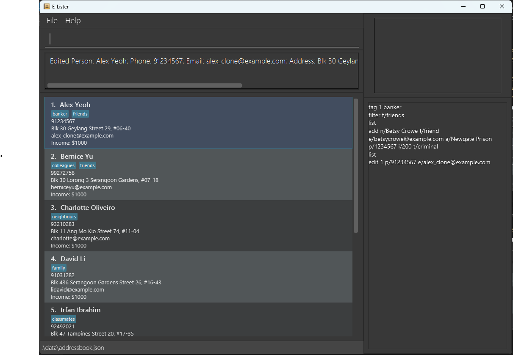
*  `edit 2 n/Betsy Crower t/` Edits the name of the 2nd person to be `Betsy Crower` and clears all existing tags.

#### Locating persons by name: `find`

Finds persons whose names contain any of the given keywords.

Format: `find KEYWORD [MORE_KEYWORDS]`

* The search is case-insensitive. e.g `hans` will match `Hans`
* The order of the keywords does not matter. e.g. `Hans Bo` will match `Bo Hans`
* Only the name is searched.
* Partial words will also be matched. e.g. `Han` will match `Hans`
* Persons matching at least one keyword will be returned (i.e. `OR` search).
  e.g. `Grub Ya` will return `Hans Gruber`, `Bo Yang`

Examples:
* `find John` returns `john` and `John Doe`
* `find alex david` returns `Alex Yeoh`, `David Li` 
  
* `find mart On` returns `Martin Henz`, `Ong Wai Kit`

#### Listing all persons : `list`

Shows a list of all persons in the E-Lister.

Format: `list`

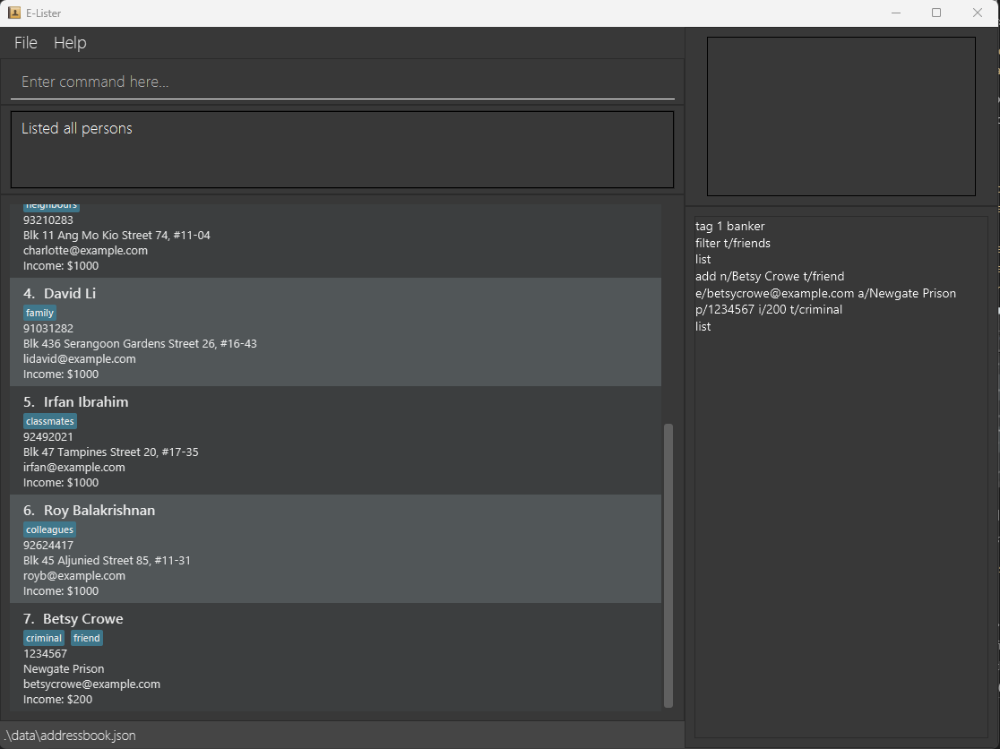

*Why do we need this command?* This is mostly used to refresh the whole list of contacts stored in the app so far after you use **filter** command *(see later)*.

#### Clearing all entries : `clear`

Clears all entries from E-Lister.

Format: `clear`

### **Tag**
#### Adding a tag : `tag`

Adds a tag to any given person stored in E-Lister.

Format: `tag INDEX TAG`

* Adds `TAG` to the person at the specified `INDEX`.
* The index refers to the index number shown in the displayed person list.
* The index **must be a positive integer** 1, 2, 3, …​

Examples:
* `list` followed by `tag 2 banker` adds the tag “banker” to the 2nd person.
* `tag 1 billionaire` will add the tag "billionaire" to the 1st person (which is Alex in this example).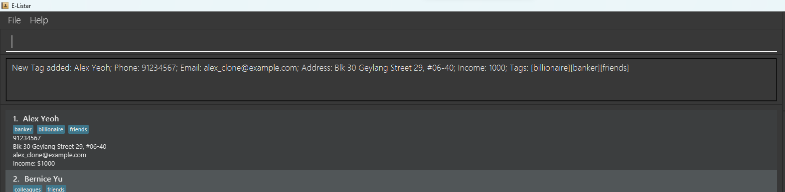

#### Deleting a tag : `delete_tag`

Deletes a tag on a person.

Format: `delete_tag INDEX TAG`

* Deletes `TAG` from the person at the specified `INDEX`.
* The index refers to the index number shown in the displayed person list.
* The index **must be a positive integer** 1, 2, 3, …​
* The tag must exist.

Examples:
* `list` followed by `delete_tag 3 teacher` deletes the tag "teacher" from the 3rd person(only if there's a person with index 3 and carrying tag "teacher").
* `delete_tag 1 t/billionaire` will delete the tag "billionaire" from the 1st person (which is Alex in this example).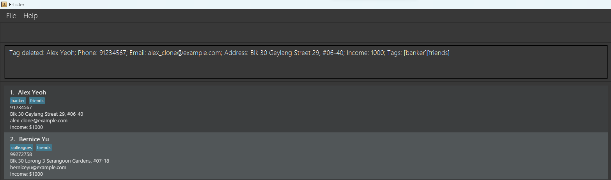

### **Advanced Operations**
#### Filter by fields : `filter`

Search for persons whose fields all match one or more keywords.

* Note that these keywords are case-sensitive, unlike `find`.

Format: `filter [n/NAME] [p/PHONE] [e/EMAIL] [a/ADDRESS] [i/INCOME] [t/TAG] [n/MORE_NAMES] ...`

* Displays the data of persons who:
  * For every field you entered one or more keywords for,
    * that person's field matches at least one of those keywords.

Examples:

* `filter t/bank` will list all persons with a tag containing "bank", such as `banker`, `bankrupt`, or `riverbanks`.
* `filter p/8765 e/hotmail` will list all persons with a phone number containing "8765", and an email address containing "hotmail".
* `filter e/org e/net` will list all persons with email addresses containing "org" **or** "net".

#### Freezing the display : `freeze`

Freezes the current selection of persons displayed.

* By default, persons which no longer satisfy the conditions of the most recent `find`/`filter` are automatically dropped from the visible list.
  * This can happen e.g. if you `filtered` for a tag `x`, but then deleted `x` from a displayed Person.
  * `freeze` temporarily prevents persons from being hidden from view in such a scenario.

The visible details **within** each Person will still be updated,
if modified.

Format: `freeze`

* Commands that reference indices / the list of persons being displayed will be subject to `freeze`,
and will act on the display as it appears to you.
* The effects of a `freeze` are withdrawn when a new `list`, `find`, or `filter` command is entered.

#### Unfreezing the display : `unfreeze`

Unfreezes the current selection of persons displayed. Any changes to the selection which were previously withheld
due to a `freeze` will now be applied.

Format: `unfreeze`

#### Mass operations : `mass`

Takes in a command typically applied to a single target index, and applies it to all _displayed_ persons.

Format: `mass COMMAND [ARGS_WITHOUT_INDEX]`

Examples:
* `mass tag Noticed` will tag all displayed persons with "Noticed".
* `mass edit p/7773354` will edit all displayed persons to have the phone "7773354".
* `mass delete` will delete all displayed persons.
  * Contrast with `clear`, which deletes all persons, whether displayed or not.

#### Undoing a command : `undo`

Undo one or more of the most recent commands done.

Format: `undo [NUM]`

* Undoes `NUM` of the most recent commands, or the 1 most recent if `NUM` is not specified.
  * If specified, `NUM` must be a positive integer less than 2^31 ≈ 2 billion.
* Only undoes commands which affect data or the display. E.g.:
  * `edit`, `filter`, `freeze`, and `import` can be undone
  * `help` and `export` cannot be undone; `undo` will skip them for the next most recent command.
* Only undoes commands executed within the current session.
  * **If the program is closed and relaunched, commands performed before the relaunch will no longer be undoable,
  even if they remain visible on the Input Log.**

Examples:
* `undo 3` will undo the last 3 commands.

#### Redoing a command : `redo`

Redo one or more of the most recent commands undone.

Format: `redo [NUM]`

* Redoes `NUM` of the most recent undone commands, or the 1 most recent if `NUM` is not specified.
  * If specified, `NUM` must be a positive integer less than 2^31 ≈ 2 billion.

* Only redoes commands undone within the current session.
    * **If the program is closed and relaunched, commands undone before the relaunch will no longer be redoable,
      even if they remain visible on the Input Log.**

Examples:
* `redo 3` will redo 3 commands.

#### Creating a shortcut : `shortcut`

Allows the user to create a shortcut for a command; this shortcut can be used in place of the command.

The shortcut will be saved and can still be used when the user exits E-Lister and re-opens it.

Format: `shortcut ORIGINAL_COMMAND SHORTCUT`

* The shortcut cannot be the same as any existing command or shortcut.
* The shortcut should only consist of alphanumeric characters.

Examples:
* `shortcut list lst` will allow the user to input `lst` in place of `list`.

### **Import and Export CSV file**

#### Import data from CSV : `import`

Opens a file chooser to select a CSV file containing relevant data and merges with the existing data.

Format: `import [combine|reset]`

* If `combine` is entered, the existing data will be combined with the imported dataset.
* If `reset` is entered, the existing data will be removed and replaced with the imported dataset.
* If neither keyword is entered, the behaviour will be the same as `combine`.

**Note: Your CSV file must have the following headers in this order: `Name, Phone, Email, Address, Income, Tags`**

#### Export data to CSV : `export`

Opens a file chooser to select a directory where you can save the data to a CSV file.

If you wish to export to a new file, you may type its intended name in the **File Name** box and click **Save**. This will create a new CSV file with the exported data. Otherwise, you can select an existing CSV file to overwrite.

Format: `export [shown|all]`

* If `shown` is entered, only the current _selection_ of persons will be exported.
* If `all` is entered, all persons will be exported, including those who are not displayed due to filters.
* If neither keyword is entered, the behaviour will be the same as `shown`.

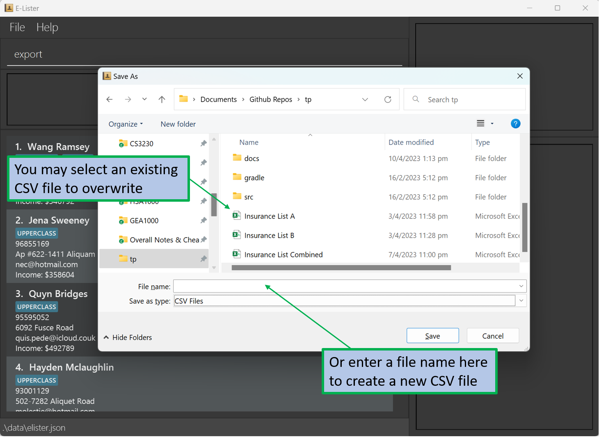

## Additional info on the User Interface

### **Filter Box**

On the top-right corner of the display, you can see a small box where all the filters that were used on your persons list will be displayed.

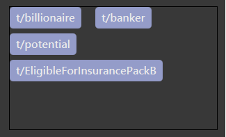

*Why do we need this?* Imagine having to obtain a specific list of contacts with the tags `upperClass`, `healthy`, `premiumPlanCandidates`, `healthPlanCandidates`, and `returningCustomers`. It'll be useful to have all the current filters displayed so that you know which ones you have already applied!

### **Input Log**

Below the Filter Box, an Input Log box displays commands you have previously entered.

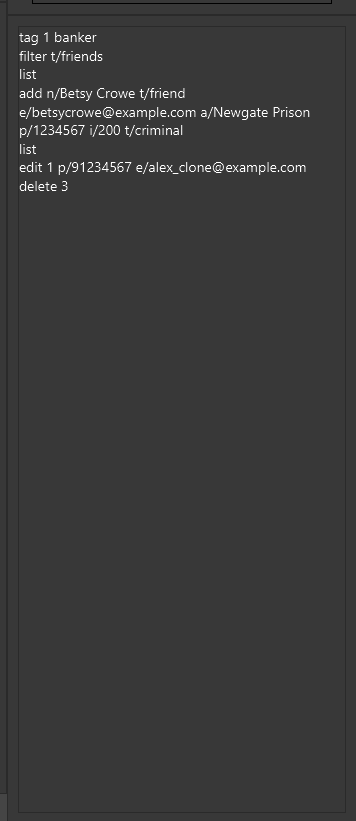

*Why do we need this?* Keeping a record of all commands executed has several advantages.
- It provides a historical log of all actions taken by you, which can be useful in case of any disputes or discrepancies that may arise in the future.
- It allows you to keep track of your current progress, which is especially helpful when managing a large number of tasks so you don't lose track of your current task!
- You may also use your input history to identify areas for improvement in your approach to handling contact data, allowing you optimize productivity over time!

## **Exiting the program** : `exit`

Exits the program.

Format: `exit`

### **Saving the data**

E-Lister data is saved on the hard disk automatically after any command that changes the data. There is no need to save manually.

### **Editing the data file**

E-Lister data is saved as a JSON file `[JAR file location]/data/elister.json`. Advanced users are welcome to update data directly by editing that data file.

:exclamation: **Caution:**
If your changes to the data file make its format invalid, E-Lister will discard all data and start with an empty data file at the next run.

### Archiving data files `[coming in v2.0]`

_Details coming soon ..._

--------------------------------------------------------------------------------------------------------------------

## **FAQ**

**Q**: How do I transfer my data to another Computer? 
**A**: Install the app on the another computer and overwrite the empty data file it creates with the file that contains the data of your previous E-Lister home folder.

--------------------------------------------------------------------------

## **Command use cases**

Action | use case
-------|--------------------------------------
[**Help**](#viewing-help--help) | `When you need to access the user guide for assistance on using the application or to learn more about its features.`
[**Add**](#adding-a-person-add) | `When you want to add a new client or contact with their details, such as name, phone number, email, address, income, and tags.`
[**Delete**](#deleting-a-person--delete) | `When you need to delete a client or contact from your list, either because they are no longer relevant or you have entered their information incorrectly.`
[**Edit**](#editing-a-person--edit) | `When you need to update a contact's information, such as their name, phone number, email, address, income, or tags.`
[**Find**](#locating-persons-by-name-find) | `When you want to find a specific contact or group of contacts using one or more keywords, such as their name, tag, or other attributes.`
[**List**](#listing-all-persons--list) | `When you want to view your entire list of contacts, either for reference or to find a specific contact.`
[**Clear**](#clearing-all-entries--clear) | `When you want to delete all contacts in your list, such as when starting a new project or when you need to remove all outdated information.`
[**Tag**](#adding-a-tag--tag) | `When you want to label a contact with a specific tag, such as "friend", "client", or "prospect", to help categorize and organize your contacts.`
[**Delete Tag**](#deleting-a-tag--delete_tag) | `When you need to remove a tag from a contact, either because it is no longer relevant or was assigned incorrectly.`
[**Filter**](#filter-by-fields--filter) | `When you want to view a specific subset of contacts based on their attributes, such as name, email, address, income, or tags.`
[**Freeze**](#freezing-the-display--freeze) | `When you are modifying your contact list and you have a filtered applied using the filter command, you can use freeze to prevent the contacts from being removed. For example, if you used filter t/friend and you execute delete_tag 2 friend, the contact with index 2 will no longer show up in your list as it no longer has the tag `  friend` . However freeze will make it such that it will continue to show up in the list.`
[**Unfreeze**](#unfreezing-the-display--unfreeze) | `When you want the contact list to be updated.`
[**Mass**](#mass-operations--mass) | `When you want to perform a bulk action, such as assigning a tag or deleting multiple contacts simultaneously.`
[**Undo**](#undoing-a-command--undo) | `When you have made a mistake or want to reverse a recent change to your contact list.`
[**Redo**](#redoing-a-command--redo) | `When you have undone an action and later decide that you want to reapply the change.`
[**Shortcut**](#creating-a-shortcut--shortcut) | `When you want to create a keyboard shortcut for a command you use often, making it faster and more convenient to execute.`
[**Import**](#import-data-from-csv--import) | `When you have contact information stored in a CSV file and want to import it into the application.`
[**Export**](#export-data-to-csv--export) | `When you want to export your contact list to a CSV file for backup, sharing, or use in another application.`

--------------------------------------------------------------------------------------------------------------------

## **Command summary**

Action | Format, Examples
--------|------------------
[**Help**](#viewing-help--help) | `help`
[**Add**](#adding-a-person-add) | `add n/NAME p/PHONE_NUMBER e/EMAIL i/INCOME a/ADDRESS [t/TAG]…​`   e.g., `add n/James Ho p/22224444 e/jamesho@example.com a/123, Clementi Rd, 1234665 t/friend t/colleague i/10000`
[**Delete**](#deleting-a-person--delete) | `delete INDEX`  e.g., `delete 3`
[**Edit**](#editing-a-person--edit) | `edit INDEX [n/NAME] [p/PHONE_NUMBER] [i/INCOME] [e/EMAIL] [a/ADDRESS] [t/TAG]…​`  e.g.,`edit 2 n/James Lee e/jameslee@example.com`
[**Find**](#locating-persons-by-name-find) | `find KEYWORD [MORE_KEYWORDS]`  e.g., `find James Jake`
[**List**](#listing-all-persons--list) | `list`
[**Clear**](#clearing-all-entries--clear) | `clear`
[**Tag**](#adding-a-tag--tag) | `tag INDEX TAG`   e.g, `tag 2 MIDDLE_CLASS`, `tag 5 teacher`
[**Delete Tag**](#deleting-a-tag--delete_tag) | `delete_tag INDEX TAG`   e.g, `delete_tag 2 MIDDLE_CLASS`, `delete_tag 5 teacher`
[**Filter**](#filter-by-fields--filter) | `filter [n/NAME] [p/PHONE] [e/EMAIL] [a/ADDRESS] [i/INCOME] [t/TAG] [n/MORE_NAMES] ...`  e.g., `filter e/.*\.org$ n/rin e/.*\.net$`
[**Freeze**](#freezing-the-display--freeze) | `freeze`
[**Unfreeze**](#unfreezing-the-display--unfreeze) | `unfreeze`
[**Mass**](#mass-operations--mass) | `mass COMMAND [ARGS_WITHOUT_INDEX]`  e.g., `mass tag Noticed`
[**Undo**](#undoing-a-command--undo) | `undo [NUM]`
[**Redo**](#redoing-a-command--redo) | `redo [NUM]`
[**Shortcut**](#creating-a-shortcut--shortcut) | `shortcut`
[**Import**](#import-data-from-csv--import) | `import [combine|reset]`
[**Export**](#export-data-to-csv--export) | `export [shown|all]`
