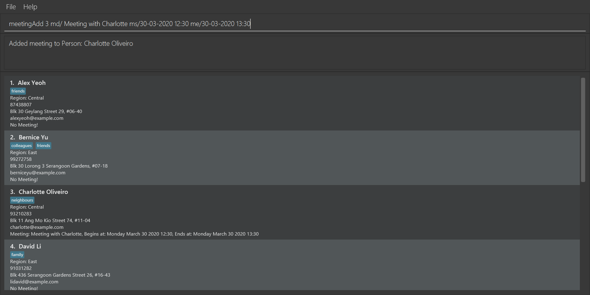
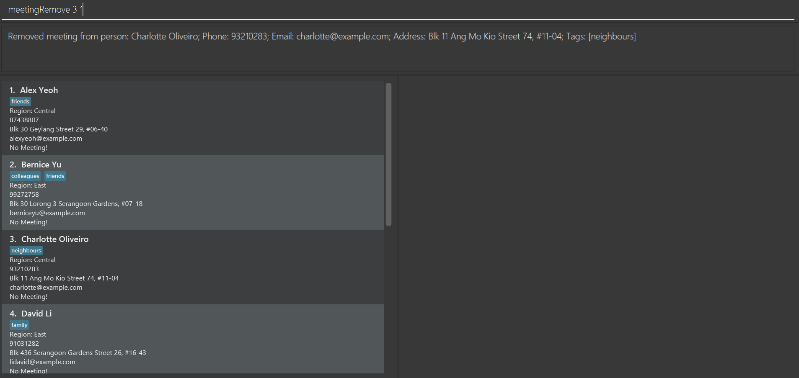

FAid is a **client and schedule management** application made for financial advisors!
Financial advisors can use FAid to easily **save their client information** and **organise meetings**. 
With FAid, financial advisors will no longer have to worry about missing a meeting or forgetting a client!

## Table of Contents
* Table of Contents
{:toc}

--------------------------------------------------------------------------------------------------------------------

## Quick start

1. Download [Java `11`](https://www.oracle.com/sg/java/technologies/javase/jdk11-archive-downloads.html) for your
   operating system.

1. To check if you have Java `11` installed and configured correctly, open a command terminal and type in the
   command: `java --version`.  
   If java is installed successfully, your output should be similar to the following (Note that it may look slightly
   different depending on your exact version and operating system):  
   `openjdk 11.0.17 2022-10-18 LTS`  
   `OpenJDK Runtime Environment Zulu11.60+19-CA (build 11.0.17+8-LTS)`  
   `OpenJDK 64-Bit Server VM Zulu11.60+19-CA (build 11.0.17+8-LTS, mixed mode)`  
   Otherwise, if java is not installed or not configured correctly, you could see an error message like this:  
   `'java' is not recognized as an internal or external command, operable program or batch file.`  
   If you see an error message like this even after installing Java `11`, consider restarting your computer or
   reinstalling Java.

1. Download the latest `faid.jar` from [here](https://github.com/AY2223S2-CS2103T-W12-3/tp/releases).

1. Copy the file to the folder you want to use as the _home folder_ for your FAid application.

1. Open a command terminal, `cd` into the folder you put the jar file in, and use the `java -jar faid.jar` command to
   run the application. 
   A GUI similar to the below should appear in a few seconds. Note how the app contains some sample data. 
   

1. Type the command in the command box and press Enter to execute it. e.g. typing **`help`** and pressing Enter will
   open the help window. 
   Some example commands you can try:

    * `list` : Lists all clients.

    * `add n/John Doe p/98765432 e/johnd@example.com a/John street, block 123, #01-01` : Adds a client named `John Doe`
      to FAid.

    * `delete 3` : Deletes the 3rd client shown in the current list.

    * `clear` : Deletes all clients.

    * `exit` : Exits the app.

1. Refer to the [Features](#features) below for details of each command.

[Back to the top](#table-of-contents)

--------------------------------------------------------------------------------------------------------------------

## Features

**:information_source: Notes about the command format:** 

* Words in `UPPER_CASE` are the parameters to be supplied by the user. 
  e.g. in `add n/NAME`, `NAME` is a parameter which can be used as `add n/John Doe`.

* Items in square brackets are optional. 
  e.g `n/NAME [t/TAG]` can be used as `n/John Doe t/friend` or as `n/John Doe`.

* Items with `…`​ after them can be used multiple times including zero times. 
  e.g. `[t/TAG]…​` can be used as ` ` (i.e. 0 times), `t/friend`, `t/friend t/family` etc.

* Parameters can be in any order. 
  e.g. if the command specifies `n/NAME p/PHONE_NUMBER`, `p/PHONE_NUMBER n/NAME` is also acceptable.

* If a parameter is expected only once in the command but you specified it multiple times, only the last occurrence of
  the parameter will be taken. 
  e.g. if you specify `p/12341234 p/56785678`, only `p/56785678` will be taken.

* Extraneous parameters for commands that do not take in parameters (such as `help`, `list`, `exit` and `clear`) will be
  ignored. 
  e.g. if the command specifies `help 123`, it will be interpreted as `help`.

* `CLIENT_INDEX` refers to index number showed in displayed client list

* `MEETING_INDEX` refers to index number showed in displayed meeting list

* Index must be a positive number

* Meetings displayed when app is opened initially are those meetings for the current day, and user input of 'listMeeting' is required to list all meetings stored in FAid

* `ARG1|ARG2` in format means only one ARG1 or ARG2 must be a part of the user input but not both

### Viewing help : `help`

Shows a message explaining how to access the help page.

Format: `help`

### Adding a client : `add`

Adds a client to the address book.

Format: `add n/NAME p/PHONE_NUMBER e/EMAIL a/ADDRESS [t/TAG]…​`

:bulb: **Tip:**
A client can have any number of tags (including 0)

Examples:

* `add n/John Doe p/98765432 e/johnd@example.com a/Bishan, block 123, #01-01`
* `add n/Betsy Crowe t/friend e/betsycrowe@example.com a/Ang Mo Kio p/99999999 t/Insurance`

Note:
* The tag used to add a person into the contact list will be used in the findPolicy method, e.g. using the above example, doing a findPolicy Insurance will show Betsy Crowe

### Listing all clients : `listPerson`

Shows a list of all clients in the address book.

Format: `list`

### Editing a client : `edit`

Edits an existing client in the address book.

Format: `edit INDEX [n/NAME] [p/PHONE] [e/EMAIL] [a/ADDRESS] [t/TAG]…​`

* Edits the client at the specified `INDEX`. The index refers to the index number shown in the displayed client list.
  The index **must be a positive integer** 1, 2, 3, …​
* At least one of the optional fields must be provided.
* Existing values will be updated to the input values.
* When editing tags, the existing tags of the client will be removed i.e adding of tags is not cumulative.
* You can remove all the client’s tags by typing `t/` without specifying any tags after it.

Examples:

* `edit 1 p/91234567 e/johndoe@example.com` Edits the phone number and email address of the 1st client to be `91234567`
  and `johndoe@example.com` respectively.
* `edit 2 n/Betsy Crower t/` Edits the name of the 2nd client to be `Betsy Crower` and clears all existing tags.

### Locating clients by name: `find`

Finds clients whose names is any of the given keywords.

Format: `find KEYWORD [MORE_KEYWORDS]`

* The search is case-insensitive. e.g `hans` will match `Hans`
* The order of the keywords does not matter. e.g. `Hans Bo` will match `Bo Hans`
* Only the name is searched.
* Only full words will be matched e.g. `Han` will not match `Hans`
* clients matching at least one keyword will be returned (i.e. `OR` search). e.g. `Hans Bo` will return `Hans Gruber`
  , `Bo Yang`

Examples:

* `find John` returns `john` and `John Doe`
* `find alex david` returns `Alex Yeoh`, `David Li` 
  

### Deleting a client : `delete`

Deletes the specified client from the address book.

Format: `delete INDEX`

* Deletes the client at the specified `INDEX`.

Examples:

* `listPerson` followed by `delete 2` deletes the 2nd client in the address book.
* `find Betsy` followed by `delete 1` deletes the 1st client in the results of the `find` command.

### Add meeting : `meetingAdd`

Adds a meeting to the address book.

Format: `meetingAdd CLIENT_INDEX md/ DESC ms/ START_DATE&TIME me/ END_DATE&TIME`

Required Information:

* `client_INDEX`: Index of a client in address book
* `DESC`: Description of the meeting to add
* `START DATE&TIME`: Start date and time (Format: dd-mm-yyyy HH:MM)
* `END DATE&TIME`: End date and time (Format: dd-mm-yyyy HH:MM)

Example:

* `meetingAdd 3 md/Meeting with Charlotte ms/30-03-2020 12:30 me/30-03-2020 13:30` adds a meeting on 30th March 2020
  from 12.30pm to 13.30pm, with Charlotte Oliveiro (index 3), with the description "Meeting with Charlotte".

Notes:
* Meetings with the same client with overlapping times are not allowed but meetings with different clients at the same time are.

Notes:

* Meeting must not conflict in timing with other meetings scheduled for the day.

### Remove meeting : `meetingRemove`

Removes meeting from the address book.

Format: `meetingRemove CLIENT_INDEX MEETING_INDEX`

Required Information:

* `CLIENT_INDEX`: Index of a client already in address book
* `MEETING_INDEX`: Meeting index after searching for meetings for a specific client by doing a meetingFind CLIENT_INDEX to get the required meeting index

Examples:

* `meetingRemove 20 6` Deletes the 6th meeting with the client of index 20.
* `meetingRemove 3 1` Deletes the 1st meeting with the client of index 3.

Note:
* Doing a meetingFind `CLIENT_INDEX` is necessary to get the meeting index required. Using the meeting index in the initially displayed page or the page after listMeeting may result in an incorrect meeting update.

### Updating a meeting : `meetingUpdate`

Updates an existing meeting belonging to a client in the address book

Format: `meetingUpdate CLIENT_INDEX MEETING_INDEX [md/DESCRIPTION] [ms/START] [me/END]`

Required Information:

* `CLIENT_INDEX`:Index of a client already in address book
* `MEETING_INDEX`: Meeting index after searching for meetings for a specific client by doing a meetingFind CLIENT_INDEX to get the required meeting index

Examples:

* `meetingUpdate 1 1 md/ Policy discussion` Edits the meeting description of the 1st meeting belonging to the 1st client
  to `Policy discussion` 
* `meetingUpdate 2 3 md/ Plan review ms/ 30-03-2020 20:10 me/ 30-03-2020 22:10` Updates the description, start and end
  of the 3rd meeting belonging to the 2nd client to `Plan review`, `30-03-2020 20:10` and `30-03-2020 22:10`
  respectively

Notes:

* Edits the meetings of client at the specified `CLIENT_INDEX`.
* At least one of the optional fields must be provided.
* Existing values will be updated to the input values.
* Doing a meetingFind `CLIENT_INDEX` is necessary to get the meeting index required. Using the meeting index in the initially displayed page or the page after listMeeting may result in an incorrect meeting update.

### Find meeting : `meetingFind`

Finds meetings from the address book based on the date of meeting or person index but not both

Format: `meetingFind DATE|CLIENT_INDEX `

Required Information:

* Date (dd/mm/yyyy)
* Index of a client already in address book

Examples:
* `meetingFind 11/05/2023` Lists out all meetings that start on 11th May 2023
* `meetingFind 5` Lists out all meetings with client of index 5 in the address book

### List meeting : `listMeeting`

Lists all meetings scheduled in FAid

### List by region : `listRegion`

Lists all clients living in a given region, currently works for North, South, East, West, Central and Unknown

Required information:

* Region to search for
* Region specified should be a valid region

Examples:

* `listRegion Central` lists all clients from the Central region in the address book

### Find clients by policy name : `findPolicy`

Lists all clients that are under a given policy

Format: `findPolicy POLICY_NAME [MORE_POLICY_NAMES]`

Required information:

* Name of policy to search for, which is in the client's tags 

Examples:

* `findPolicy Insurance` Find clients with Insurance Policy as their tag

### Clearing all entries : `clear`

Clears all entries from FAid.

Format: `clear`

### Exiting the program : `exit`

Exits the program.

Format: `exit`

### Saving the data

FAid data are saved in the hard disk automatically after any command that changes the data. There is no need to save
manually.

### Editing the data file

FAid data are saved as a JSON file `[JAR file location]/data/addressbook.json`. Advanced users are welcome to update
data directly by editing that data file.

:exclamation: **Caution:**
If your changes to the data file makes its format invalid, FAid will discard all data and start with an empty data file at the next run.

[Back to the top](#table-of-contents)

--------------------------------------------------------------------------------------------------------------------

## FAQ

**Q**: How do I transfer my data to another Computer? 
**A**: Install the app in the other computer and overwrite the empty data file it creates with the file that contains
the data of your previous AddressBook home folder.

**Q**: How do I key in my client's region? 
**A**: FAid automatically detects region based on address keyed in

--------------------------------------------------------------------------------------------------------------------

## Troubleshooting

**Q**

--------------------------------------------------------------------------------------------------------------------

## Command summary

Action | Format, Examples
--------|------------------
**Add** | `add n/NAME p/PHONE_NUMBER e/EMAIL a/ADDRESS [t/TAG]…​`   e.g, `add n/James Ho p/22224444 e/jamesho@example.com a/123, Clementi Rd, 1234665 t/friend t/colleague`
**Clear** | `clear`
**Delete** | `delete INDEX` e.g., `delete 3`
**Edit** | `edit INDEX [n/NAME] [p/PHONE_NUMBER] [e/EMAIL] [a/ADDRESS] [t/TAG]…​`   e.g.,`edit 2 n/James Lee e/jameslee@example.com`
**Find** | `find KEYWORD [MORE_KEYWORDS]`   e.g., `find James Jake`
**List** | `list`
**Help** | `help`
**Add Meeting** | `meetingAdd CLIENT_INDEX md/ DESC ms/ START DATE&TIME me/ END DATE&TIME`
**Remove Meeting** | `meetingRemove CLIENT_INDEX MEETING_INDEX`
**Find Meeting** | `meetingFind DATE[CLIENT_INDEX]`
**List all meetings** | `meetingList`
**List all in Region** | `listRegion REGION`
**Find Policy** | `findPolicy POLICY_NAME [MORE_POLICY_NAMES]`
