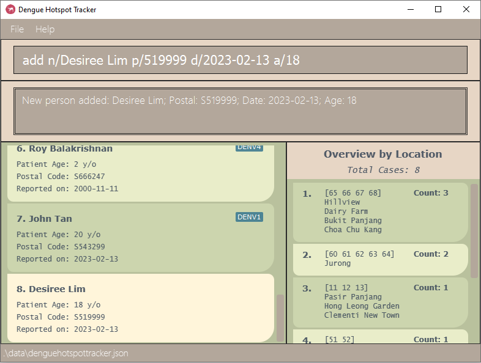
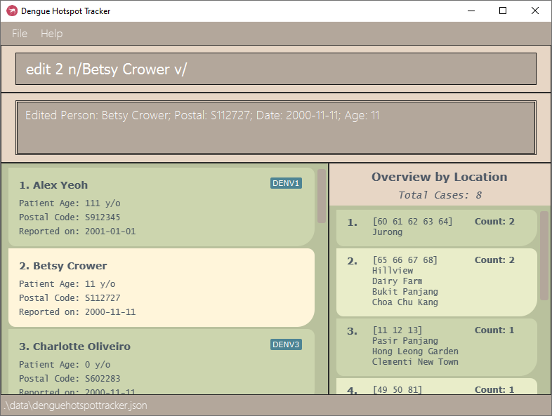
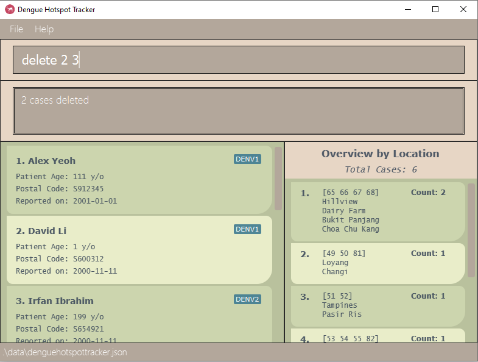
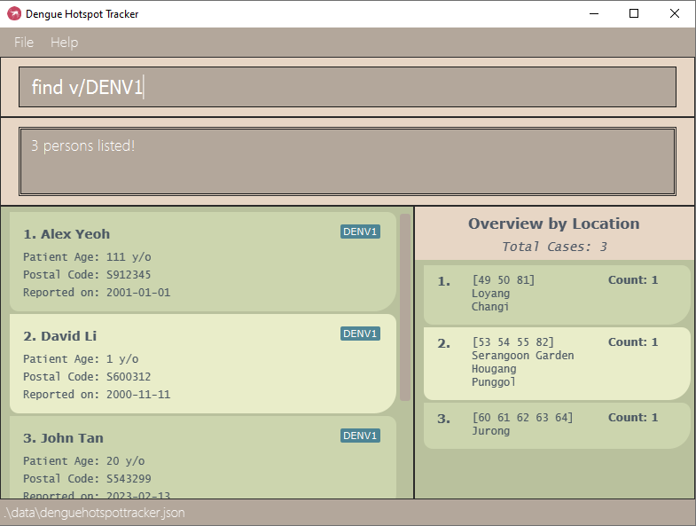
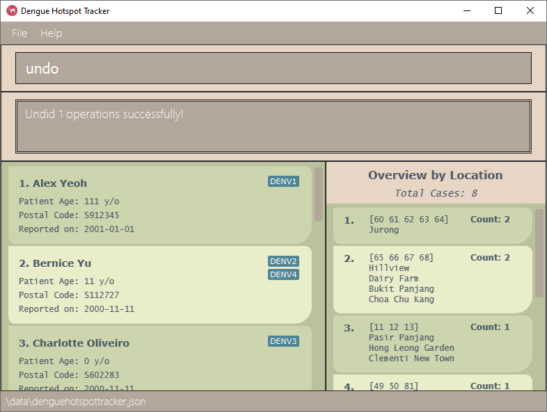
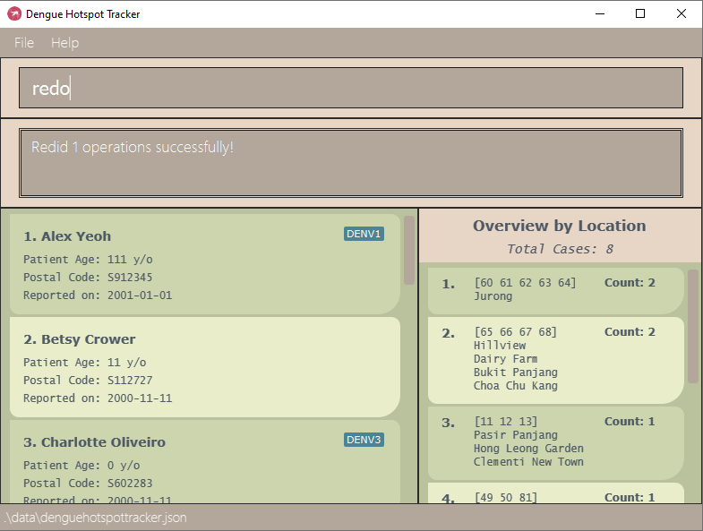
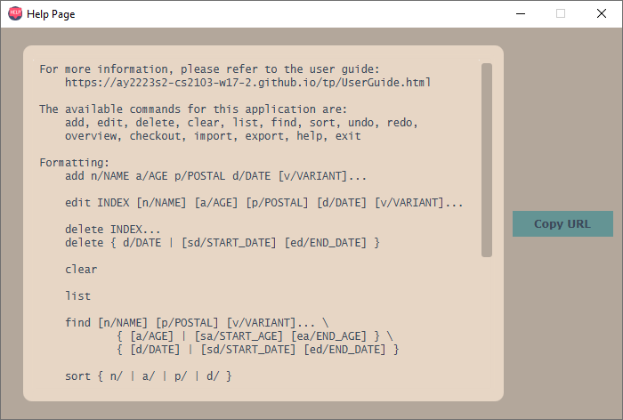

* Table of Contents
{:toc}

--------------------------------------------------------------------------------------------------------------------

## Introduction

DengueHotspotTracker (DHT) is a **desktop app for managing dengue cases, optimised for**
**use via a Command Line Interface** (CLI) while still having the benefits of a Graphical User
Interface (GUI). If you can type fast, DHT can get your dengue case management tasks done faster
than traditional GUI apps.

### Purpose of this application

Dengue fever is a prevalent mosquito-borne disease in many parts of the world, including Singapore. The National 
Environmental Agency (NEA) of Singapore is responsible for monitoring and controlling the spread of this disease. 
To aid in this task, a new application called DengueHotspotTracker (DHT) has been developed, which allows NEA to 
track all reported cases of dengue fever in Singapore.

This application serves as an case tracker, containing the name, postal code, age, date, and (optional) variant type
of the reported case. The user-friendly interface provides an easy-to-view overview of the cases, enabling NEA to 
monitor the trends of the disease in different areas, spread in different age groups, and spread of
different variant types of dengue. Overall, this application would allow NEA to stay informed about the latest trends
and take proactive measures to prevent the spread of the disease.

--------------------------------------------------------------------------------------------------------------------

## Quick start

1. Ensure you have Java `11` or above installed in your Computer.

2. Download the latest `dht.jar` from [here](https://github.com/AY2223S2-CS2103-W17-2/tp/releases).

3. Copy the file to the folder you want to use as the home folder for your DengueHotspotTracker.

4. Open a command terminal, `cd` into the folder you put the jar file in, and use the `java -jar dht.jar` 
command to run
the application. 

   A GUI similar to the following image should appear in a few seconds. Note how the app contains some sample data.  
     

5. Type the command in the command box and press Enter to execute it. e.g. typing **`help`** and pressing Enter will
open the help window. 
   Some example commands you can try:

   * `list`: Lists all cases.

   * `add n/John Tan p/543299 d/2023 February 13 a/20`: Adds a case named `John Tan` to DengueHotspotTracker.

   * `delete 3`: Deletes the third case shown in the current list.
   
   * `find n/John`: Finds all cases whose name contains `John` (non-case sensitive) and shows it in a filtered list.

   * `clear`: Deletes all cases shown in the current list.

   * `exit`: Exits the app.

   * `undo 5`: Undoes five actions.

   * `redo 5`: Redoes five actions.
   
6. To learn more about DengueHotspotTracker, refer to the [Commands](#Commands) section below for details of each command, or the [Command Summary](#Command summary).

--------------------------------------------------------------------------------------------------------------------

## Navigating the User Interface

placeholder

--------------------------------------------------------------------------------------------------------------------

## Command summary

| Action       | Format, Examples                                                                                                                                                                                                                                                                            |
|--------------|---------------------------------------------------------------------------------------------------------------------------------------------------------------------------------------------------------------------------------------------------------------------------------------------|
| **Add**      | `add n/NAME a/AGE p/POSTAL d/DATE [v/VARIANT]...`  e.g. `add n/James Ho a/23 p/S222244 d/2000-11-11 v/DENV1`                                                                                                                                                                             |
| **Edit**     | `edit INDEX [n/NAME] [a/AGE] [p/POSTAL] [d/DATE] [v/VARIANT]...`  e.g.`edit 2 n/James Lee d/2001-11-11`                                                                                                                                                                                  |
| **Delete**   | `delete INDEX...` or <code>delete { d/DATE &#124; [sd/START_DATE] [ed/END_DATE] }</code>  e.g. `delete 3`, `delete d/2023-03-10`                                                                                                                                                         |
| **Clear**    | `clear`                                                                                                                                                                                                                                                                                     |
| **List**     | `list`                                                                                                                                                                                                                                                                                      |
| **Find**     | <code>find [n/NAME] [p/POSTAL] [v/VARIANT]... { [a/AGE] &#124; [sa/START_AGE] [ea/END_AGE] } \\</code> <code>&nbsp; &nbsp; &nbsp; &nbsp; &nbsp; &nbsp; { [d/DATE] &#124; [sd/START_DATE] [ed/END_DATE] }</code>  e.g. `find n/James Jake`, `find sa/20 ea/29`, `find v/DENV1 v/DENV2` |
| **Sort**     | <code>sort { n/ &#124; a/ &#124; d/ }</code>  e.g.`sort d/`                                                                                                                                                                                                                              |
| **Undo**     | `undo [INTEGER]`  e.g. `undo 5`                                                                                                                                                                                                                                                          |
| **Redo**     | `redo [INTEGER]`  e.g. `redo 2`                                                                                                                                                                                                                                                          |
| **Overview** | <code>overview { p/ &#124; a/ &#124; v/ }</code>  e.g. `overview v/`                                                                                                                                                                                                                     |
| **Checkout** | `checkout [FILENAME]`  e.g. `checkout overview.csv`                                                                                                                                                                                                                                      |
| **Import**   | `import [FILENAME]`  e.g. `import sampledata.csv`                                                                                                                                                                                                                                        |
| **Export**   | `export [FILENAME]`  e.g. `export sampledata.csv`                                                                                                                                                                                                                                        |
| **Help**     | `help`                                                                                                                                                                                                                                                                                      |
| **Exit**     | `exit`                                                                                                                                                                                                                                                                                      |

--------------------------------------------------------------------------------------------------------------------

## Features

**:information_source: Notes about the command format:** 

* Words in `UPPER_CASE` are the parameters to be supplied by the user. 
  e.g. in `add n/NAME`, `NAME` is a parameter which can be used as `add n/John Doe`.

* Parameters with prefixes can be in any order. 
  e.g. if the command specifies `n/NAME p/POSTAL`, `p/POSTAL n/NAME` is also acceptable.

* If a parameter is expected only once in the command but was specified multiple times,
  only the last occurrence of the parameter will be taken. 
  e.g. if `p/123414 p/567878` was given, only `p/567878` will be parsed.

* Extraneous parameters for commands that do not take in parameters (e.g. `clear`, `list`, `help` and `exit`) will be ignored. 
  e.g. if the command `help 123` was given, it will be interpreted as `help`.

* If an input contains unnecessary whitespaces at its start or end, they will be trimmed first.
  The input will be read in without these whitespaces.

* Items in square brackets are optional. 
  e.g. `n/NAME [v/VARIANT]` can be used as `n/John Doe v/DENV1` or as `n/John Doe`.

* Items in curly brackets `{ }` separated by vertical lines `|` form a set from which one option is to be chosen. 
  e.g. `{ p/ | a/ | v/ }` means that exactly one of `p/`, `a/` and `v/` must be chosen.

* Items with `...` after them can be used multiple times, including zero times. 
  e.g. `[v/VARIANT]...` can be used as ` ` (i.e. 0 times), `v/DENV1`, `v/DENV1 v/DENV2`, etc.

--------------------------------------------------------------------------------------------------------------------

## Valid data field inputs
This section describes the requirements of the specified data fields.

### Name
* Names must only contain letters and spaces, and cannot be blank.
* Names have a maximum allowed length of 54 characters in line with Singaporean law.
* Longer names may be truncated. To see the full text, resize the app window.

### Postal code
* Postal codes must be in one of the following formats:
    * S123456
    * s123456
    * 123456
* Postal codes must have six digits.
* The first two digits of a postal code must correspond to a valid postal sector in Singapore.
  Valid postal sectors consist of numbers 01–73 inclusive, 75–82 inclusive, and 91.

### Date
* Dates must contain a year, a month, and a day.
* Multiple date formats are accepted, as long as `yyyy`, `MM`/`MMM`/`MMMM` and `dd` are present,
  with no extra alphanumeric characters.
* Dates must be in one of the following formats:
  * Year:
    * 4-digit years `YYYY`
  * Month:
    * 2-digit months `MM` 
    * 3-letter months `MMM`
    * Fully-spelled months `MMMM`
  * Day:
    * 2-digit days `dd`
  * When it is ambiguous whether a sequence of digits corresponds to `MM`, `dd`, or `yyyy`,
    the first sequence of four digits will be read as `yyyy`, the first sequence of two digits
    as `MM`, and the last sequence of two digits as `dd`. Thus, `20000102` is read as 2nd January 2000.

### Age
* Ages should only contain numeric characters.
* Ages should be between 0 and 199 inclusive.
    * Valid:
        * `0`
        * `51`
        * `199`
    * Invalid:
        * `#20` (contains invalid hash symbol)
        * `200` (outside of the range of valid ages)

### Variants
* Variants must be one of the following four values:
  * `DENV1`
  * `DENV2`
  * `DENV3`
  * `DENV4`

### Indexes
* Indexes must be a positive integer. Index values can be up to ~2 billion, specifically 2147483647.
* Index will always refer to the index number shown in the current displayed case list.

--------------------------------------------------------------------------------------------------------------------

## Commands

### Adding a case: `add`

Adds a dengue patient to DengueHotspotTracker.

Format: `add n/NAME a/AGE p/POSTAL d/DATE [v/VARIANT]...`

Examples:
* `add n/John Tan p/543299 d/2023-02-13 a/20 v/DENV1` 
  adds a case with the name `John Tan`, postal code `543299`, date `2023-02-13`,
  age `20`, and variant `DENV1` into DengueHotSpotTracker.
* `add n/Desiree Lim p/519999 d/2023-02-13 a/18`
  adds a case with the name `Desiree Lim`, postal code `519999`, date `2023-02-13`,
  and age `18` into DengueHotSpotTracker.
* If a case with the same name, postal code, and age already exists in the DengueHotspotTracker,
  it cannot be added again.

 

### Editing a case: `edit`

Edits an existing case in DengueHotspotTracker.

Format: `edit INDEX [n/NAME] [a/AGE] [p/POSTAL] [d/DATE] [v/VARIANT]...`

* Edits the case at the specified `INDEX`.
* At least one of the optional fields must be provided.
* Existing values will be updated to the input values.
* When editing dengue variants, all existing variants of the case will be removed, i.e. adding of variants is not cumulative.
* You can remove all the case’s dengue variants by typing `v/` without
  specifying any variants after it.
* Cases cannot be edited to have the same name, postal code, and age
  as another case already in DengueHotspotTracker.

Examples:
* `edit 1 p/912345 d/2001-01-01` edits the postal code and date of the first case to be `S912345` and `2001-01-01`
  respectively.

* `edit 2 n/Betsy Crower v/` edits the name of the second case to be `Betsy Crower` and clears all variants tagged to that case.

 

### Deleting cases: `delete`

Deletes the specified case(s) from DengueHotspotTracker. The cases can be specified with indexes, a date, or a date range.

Format: `delete INDEX...` or `delete d/DATE` or `delete [sd/START_DATE] [ed/END_DATE]`, where at least one of the optional fields must be provided.

* Deletes cases at the specified `INDEX`es, cases from the specified `DATE`, or cases falling within the specified range from `START_DATE` to `END_DATE` inclusive.
* The command will fail if multiple indexes are given and at least one of them is out of range of the displayed case list.
* If a start date is given without an end date, the range will be taken to end at the latest date in DengueHotspotTracker.
* Likewise, if an end date is given without a start date, the range will be taken to start at the earliest date in DengueHotspotTracker.
* The start date must come before or be the same as the end date.
* The three variations of the delete command should not be used together, i.e. indexes should not be provided with dates, and `d/` should not co-occur with `sd/` or `ed/`.

Examples:
* `find n/Betsy` followed by `delete 1` deletes the 1st case in the results of the `find` command.
* `find p/s666` followed by `delete d/2023-03-23` deletes the cases from 23rd March 2023 in the results of the `find` 
command.
* * `find p/243` followed by `delete sd/2023-03-20 ed/2023-03-27` deletes the cases from 20th March 2023 to 27th March 
2023 inclusive in the results of the `find` command.

* `list` followed by `delete 2 3` deletes the second and third cases in DengueHotspotTracker.

 

### Clearing all entries: `clear`

Clears all entries from the **current view** of DengueHotspotTracker.

Format: `clear`

Examples:
* `list` followed by `clear` clears all cases from DengueHotspotTracker.
* `find n/Betsy` followed by `clear` deletes all cases with names that include "Betsy".

 

### Listing all cases: `list`

Displays all cases in DengueHotspotTracker.

Format: `list`

 

### Finding cases by prefixes: `find` 

Finds cases which match the given prefixes.

Format: `find [n/NAME] [p/POSTAL] [v/VARIANT]... { [a/AGE] | [sa/START_AGE] [ea/END_AGE] } \`  &nbsp; &nbsp; &nbsp; &nbsp; &nbsp; &nbsp; &nbsp; <code>&nbsp; &nbsp; &nbsp; &nbsp; &nbsp; &nbsp; { [d/DATE] | [sd/START_DATE] [ed/END_DATE] }</code>

* The search is case-insensitive for all prefixes.
  * e.g. `n/hans` will match `Hans` or `hAns`
* Cases matching **all** given prefixes will be returned.
    * e.g. `find n/Alex p/s101` will only match cases whose names contain `alex` and whose postal codes begin with `s101`.
* For names, partial words will be matched.
  * e.g. `n/Han` will match `Hans` and `Abrahan`.
* For postal codes, the beginning of the postal code will be matched.
  * e.g. `p/10` will match `S101234` but not `S123410`.
* Prefixes for date `sd/` `ed/` and age ranges `sa/` `ea/` cannot be used in conjunction with the specific
  date `d/` or age `a/` prefixes respectively.
  * e.g. `find n/Alex d/2011-11-10 sd/2005-10-10` will throw an error.
* Date ranges and age ranges will function even if only one of the two prefixes are specified.
  * e.g. `find sd/2010-11-10` will return all cases that happened on and after 2010-11-10.
  * e.g. `find ed/2011-10-10` will return all cases that happened on and before 2011-10-10.
  * e.g. `find sa/10` will return all cases whose age is greater than or equal to 10.
  * e.g. `find ea/50` will return all cases whose age is less than or equal to 50.
* Start dates must be earlier than or equal to the end date, and start ages must be less than or equal to the end age.
* Multiple variant `v/` prefixes can be searched at once. Only those who have caught all specified variants together will be returned.
  * e.g. `find v/DENV1 v/DENV2` will only return all cases of people who have caught both DENV1 and DENV2 together before.
* Only valid names, dates, ages, and variants are allowed.
  * e.g. `find n/#erwin` will fail since names do not allow for special characters.
  * e.g. `find d/2000/13/10` will fail since 13 is not a valid month.
  * e.g. `find a/200` will fail since DengueHotspotTracker only accepts ages 0–199.
  * e.g. `find v/denver` will fail since `denver` is not a valid variant.

Examples:
* `find v/denv1` finds all cases with variant `DENV1`.

 

### Sorting cases: `sort`

Sorts the entire case list based on the specified criterion.

Format: `sort { n/ | a/ | p/ | d/ }`

* Sorts cases based on the specified criterion.
* One and only one of the prefixes must be specified: `n/` for name, `a/` for age, `p/` for postal code, and 
`d/` for date.

 

### Undoing/Redoing an action : `undo` or `redo`

Undoes/redoes an action that resulted in the change of DengueHotspotTracker data.

Format: `undo [INTEGER]` or `redo [INTEGER]` for `undo` and `redo` respectively.

* The use can undo/redo an action multiple times, specified by the value of `INTEGER`. If not provided, `INTEGER` is assumed to be 1.
* `INTEGER` must be a strictly positive integer.
* The user cannot undo/redo actions from a previous session of starting the app.
* The user cannot undo actions that are more than 10 iterations old.
* The user cannot undo actions that do not change the data of DengueHotspotTracker, such as `list` and `find`.
* Performing a change after undoing will clear any possible `redo` actions.

Example:
* `undo` after a `edit 2 n/Betsy Crower v/` command:

* `redo` after the undo:

 

### Changing the overview type : `overview`

Switches between the three overview options to summarise the data based on location by postal code (default), age group, or dengue variant.

Format: `overview { p/ | a/ | v/ }`

* The default setting upon app start-up is `p/`.
* One and only one of the three prefixes can be chosen: `p/` (location), `a/` (age), or `v/` (dengue variant).
* The overview is updated in realtime by other command calls as well.

 

### Checking out overview to CSV file : `checkout`

Exports the currently displayed overview to a CSV file.

Format: `checkout [FILENAME]`

Example CSV output of  `checkout overview.csv`:
<pre><code style="white-space: pre-wrap;">"id","binName","binSize"
"1","0 - 9","3"
"2","10 - 19","1"
"3","110 - 119","1"
"4","190 - 199","1"
</code></pre>

:bulb: **Tip:**
You can view and open this csv in Excel or any other spreadsheet editor!

 

### Importing data from CSV file : `import`

Imports cases from a CSV file. Imported items will be added to the front of the list.

Format: `import [FILENAME]`

* The dengue case list imported must be valid. Some criteria are as follows:
    * No duplicates
    * All fields must be [valid](#valid-denguehotspottracker)
    * No missing fields
* The CSV must begin with a header that includes the names of each column.

:exclamation: **Caution:**

As DengueHotspotTracker does not allow cases with duplicate **names, postal codes, and ages**, 
please ensure that the cases you are importing do not conflict with existing data within DengueHotspotTracker. 
This applies to **all** cases, not just those currently displayed.

:bulb: **Tip:**

If you are using Microsoft Excel, you can easily export your data to a CSV file and import it into DengueHotspotTracker!

See [below](#exporting-data-to-csv-file--export) for example CSV files.

 

### Exporting data to CSV file : `export`

Exports the currently displayed cases to a CSV file.

Format: `export [FILENAME]`

Example CSV output of  `export sampledata.csv`
<pre><code style="white-space: pre-wrap;">"Patient Name","Age","Date","Postal Code","Variants"
"Alex Yeoh","111","2000-11-11","S664388","[DENV1]"
"Bernice Yu","11","2000-11-11","S112727","[DENV4, DENV2]"
"Charlotte Oliveiro","0","2000-11-11","S602283","[DENV3]"
"David Li","1","2000-11-11","S600312","[DENV1]"
"Irfan Ibrahim","199","2000-11-11","S654921","[DENV2]"
"Roy Balakrishnan","2","2000-11-11","S666247","[DENV4]"
</code></pre>

:bulb: **Tip:**
Try copying these to a .csv file. Then import them as sample inputs!

 

### Viewing help: `help`

Shows a summary of the available commands and their formats, and links the user to this user guide.

Format: `help`

 

### Exiting the program: `exit`

Closes DengueHotspotTracker.

Format: `exit`

 

### Saving the data

DengueHotspotTracker data are saved in the hard disk automatically after any command that changes
the data. There is no need to save manually.

### Editing the data file

DengueHotspotTracker data are saved as a CSV file `[JAR file location]/data/denguehotspottracker.csv`. Advanced users
are welcome to update data directly by editing that data file.

**:exclamation: Caution:**
If your changes to the data file causes its format to be invalid, DengueHotspotTracker will discard all data and start with an
empty data file at the next run.

--------------------------------------------------------------------------------------------------------------------

## FAQ

**Q**: How do I transfer my data to another Computer? 
**A**: Install the app in the other computer and overwrite the empty data file it creates with the file that contains
the data of your previous DengueHotspotTracker home folder.
