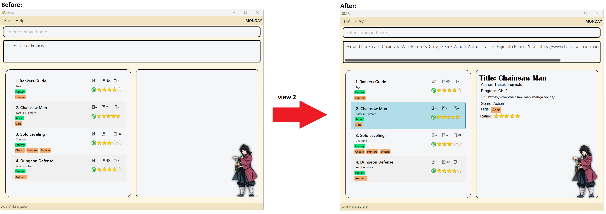

* Table of Contents
{:toc}
--------------------------------------------------------------------------------------------------------------------

## **Introduction**

MyLib is a desktop bookmarking application originally built to serve as a single platform for organising and tracking all the online webnovels and comics that you may be reading. However, its general bookmarking features is more than capable of handling any other bookmarking tasks you might have. This not only includes other types of novels, but also blogs, articles, reddit posts, Youtube videos and anything else that you want to track!

With MyLib, you have the ability to throw all your bookmarks onto a **single platform**, and organise them in a **highly personalized** way via a custom set of tags or labels that you can define on your own.

MyLib is optimized for use via a Command Line Interface (CLI) while still having the benefits of a Graphical User Interface (GUI). This means that most of MyLib's features are meant to be accessed through typed commands rather than mouse clicks. However, the commands are simple enough such that typing them out will not be much slower than using a GUI, if at all!

--------------------------------------------------------------------------------------------------------------------
## **About this User Guide**

### Target Audience
This User Guide is mainly targeted towards new users who want to get started using MyLib to bookmark their content. It can also serve as a comprehensive reference and guide for current users of the application.

### Objectives of this User Guide

This User Guide provides an easy-to-understand and comprehensive documentation, so you can easily start using MyLib. It covers how to download the application, launch the application and the various features in MyLib that will make it easy for you to bookmark all your content.

### How to use the User Guide

This User Guide is split into multiple important sections:
* The [Getting Started](#getting-started) section provides step-by-step instructions to download and get started with MyLib.
* The [Key Definitions](#key-definitions) section provides a concise explanation of the various key terms used in this User Guide. It will explain what a bookmark is in the context of MyLib.
* The [Graphical User Interface](#graphical-user-interface) section provides a quick rundown of the different components of MyLib's user interface.
* The [Features](#features) section provides detailed explanations of all the various features in MyLib to help you bookmark your content.

If you are a new user, we recommend going through the sections in the order provided above. If you are an experienced user and are just looking for a quick reference, we recommend either going through the [Features](#features) section or the [Command Summary](#command-summary) table. The [Features](#features) section will provide a detailed explanation of each feature. If you're only looking for a brief overview of the commands, we recommend the [Command Summary](#command-summary) table.

The user guide will contain certain visuals to aid in conveying information more effectively. These include:

:information_source: **Info** - Useful supplementary information

:bulb: **Tip** - Suggestions on how to enhance your experience

:exclamation: **Warning**  - Warning  of a potentially dangerous action that you should be aware of

--------------------------------------------------------------------------------------------------------------------

## Getting Started

1. Ensure you have Java `11` or above installed in your Computer.

2. Download the latest `MyLib.jar` from [here](https://github.com/AY2223S2-CS2103T-T13-4/tp/releases).

3. Copy the file to the folder you want to use as the _home folder_ for your Library.

4. Open a command terminal, `cd` into the folder you put the jar file in, and use the `java -jar myLib.jar` command to run the application.

5. A GUI similar to the one below should appear in a few seconds. You can get an overview of the various components that make up MyLib's GUI [here](#graphical-user-interface).

    

6. If this is your first time running the application, it should contain some sample bookmarks.

7. MyLib's functionality is accessed through typed commands. These commands are entered into the [command box](#graphical-user-interface) at the very top of the GUI. After entering the command, press enter to execute it and the result of that command will be displayed below the command box.

### Let's try out some of the features
1. Let's start by trying to add a bookmark.

   * Enter `add n/My Book a/My Book's Author g/Fantasy r/4` into the command box and press the Enter key.
   * Adds a bookmark for the book with the title `My Book`, the author `My Book's Author` and the genre `Fantasy` to your bookmark library.
   
2. Now, let's try editing the title in the bookmark you just added

   * Enter `edit 5 n/Edited Title` into the command box and press the Enter key.
   
   * This edits the title of your bookmark, changing it from `My Book` to `Edited Title`

3. Finally, let's delete that bookmark and exit the application

   * Enter `delete 5` into the command box and press the Enter key.
   
   * This will delete your bookmark

   * Next, use `exit` to exit the application.

4. You will be able to find a detailed guide on the list of available commands in the [Features](#features) section.

--------------------------------------------------------------------------------------------------------------------
## Key Definitions
This section provides explanations of important terms that will be used in this User Guide.

### Content

Content refers to anything that is tracked with bookmarks. These include, but are not limited to, novels, blogs, reddit posts, manga and web novels.

### Bookmark
A bookmark is the primary entity in MyLib and is used to track all your content for all your bookmarking tasks in MyLib. 

A bookmark may contain:
* A title - the title of the content that is being tracked by this bookmark
* An author - the author of the content that is being tracked by this bookmark
* A progress - consists of volume, chapter and page, and is used to track your progress with the content being tracked by this bookmark.
* A genre - the genre your content falls under. Examples genres include your typical book genres such as Action and Fantasy.
* A rating - to indicate how much you enjoyed the content being tracked by this bookmark
* Tag - a custom label attached to a bookmark for categorization purposes.
* URL - to hold the URL of the website that the content being tracked by this bookmark is hosted at.

For a bookmark in MyLib, everything except for title and genre is optional.

--------------------------------------------------------------------------------------------------------------------

## Graphical User Interface 
This section provides a quick rundown of the various components of MyLib's user interface.

   

### Purposes of each GUI component

|     Component      |                          Purpose                          |
|:------------------:|:---------------------------------------------------------:|
|    Command Box     |                 To accept user commands.                  |
|     Result Box     | To display the result of the commands that user executed. |
| BookmarkList Panel |         To display the current list of bookmarks          |
|     View Panel     |      To display the details of a specified bookmark       |

### Bookmark UI details

The bookmark in the BookmarkList panel will only contain the:
* Title
* Author
* Progress
* Genre
* Rating
* Tag

--------------------------------------------------------------------------------------------------------------------

## Features
This section provides an in-depth explanation of MyLib's features. For a quick reference of the available commands, use the [Command Summary](#command-summary) table.

**:information_source: Notes about the command format:** 

* Words in `UPPER_CASE` are the parameters to be supplied by the user. 
  e.g. in `add n/TITLE`, `TITLE` or name of `TITLE` is a parameter which can be used as `add n/The Odessey`.

* Items in square brackets are optional. 
  e.g `n/TITLE [t/TAG]` can be used as `n/The Odessey t/School` or as `n/The Odessey`.

* Items with `…`​ after them can be used multiple times including zero times. 
  e.g. `[t/TAG]…​` can be used as ` ` (i.e. 0 times), `t/School`, `t/School t/Literature` etc.

* Parameters can be in any order. 
  e.g. if the command specifies `n/TITLE a/AUTHOR`, `a/AUTHOR n/TITLE` is also acceptable.

* If a parameter is expected only once in the command, but you specified it multiple times, only the last occurrence of the parameter will be taken. 
  e.g. if you specify `a/John Butcher a/Jim Butcher`, only `a/Jim Butcher` will be taken.

* Extra parameters for commands that do not take in parameters (such as `help`, `list`, `exit`, `genre`, `tags` and `clear`) will be ignored. 
  e.g. if the command specifies `help 123`, it will be interpreted as `help`.

* List of prefixes used in commands :

### Adding a tag: `addtag`

Adds a tag to the list of tags.

:bulb: **Tip:** You need to add a tag to the tag list first before using it. 

Format: `addtag [t/TAG]…`

Examples:
* `addtag t/Novel t/MaleProtagonist`
* `addtag t/FemaleProtagonist`

### Deleting a tag: `dtag`

Deletes a tag from the tag list.

Format: `dtag TAGNAME`

Example:
* `dtag MaleProtagonist`

### Listing all tags: `tags`
Lists all tags in the tag list.

Format: `tags`

### Genres:
A genre in a bookmark indicates the genre of the content the bookmark is tracking.

In MyLib, a bookmark's genre may only be selected from a fixed list of genres provided by MyLib. This fixed list of genres can be viewed using the `genre` command. 

The format for the command is as follows: 

`genre`

The command should display the list of available genres in the `Result Box`.

### Adding a bookmark

To create a new bookmark and add it to your bookmark library you will need to use the `add` command.

The format for the `add` command is as follows:

`add n/TITLE g/GENRE [a/AUTHOR] [p/PROGRESS] [r/RATING] [u/URL] [t/TAG]…​`

The `add` command accepts the following items as user input:

| Prefix | Parameter | Description                                                                                                                                                                                                                                                                                                                                        |
|:------:|:---------:|:---------------------------------------------------------------------------------------------------------------------------------------------------------------------------------------------------------------------------------------------------------------------------------------------------------------------------------------------------|
|  `n/`  |   TITLE   | This is the title that you want to give to the bookmark. Usually, this is the name of the content the bookmark is tracking.   **Restrictions:** The title can contain any characters be it alphabets, numbers or symbols.     
❗ **Caution**: certain non-English alphabets or symbols may not display correctly in the application.
                                                                                                                                                                        |
|  `a/`  |  AUTHOR   | This is the author of the content the bookmark is tracking.  **Restrictions:** The title can contain any characters be it alphabets, numbers or symbols.     
❗ **Caution**: certain non-English alphabets or symbols may not display correctly in the application.
                                                                                                                                                                                                                                                                |
|  `p/`  | PROGRESS  | This is used to remember your progress with the content being tracked by this bookmark. For example, if the bookmark is tracking a novel, the progress can be used to denote the latest read chapter.  **Restrictions:** PROGRESS should have the format: `VOLUME CHAPTER PAGE`.    `VOLUME`, `CHAPTER` and `PAGE` should either be a positive number (without +) or `~`.   `~` is used to denote an empty `VOLUME`, `CHAPTER` and `PAGE`. For example, if you only want to use `CHAPTER` to track your progress you would do: `~ CHAPTER ~`. At least one of `VOLUME`, `CHAPTER` and `PAGE` must not be `~`.|
|  `g/`  |   GENRE   | The genre of the content the bookmark is tracking.  **Restrictions:** MyLib provides a fixed list of genres.  Only genres in that list can be used as the genre of a bookmark.  To find out more about this list, go to the [Genres](#genres) section.                   |
|  `u/`  |    URL    | This is the url to the website containing the bookmarked content.   **Restrictions:** Must contain [Protocol][Domain name] for example: [http://]www.[example.com]                                                                                                                                                        |
|  `r/`  |  RATING   | This is the rating to give the bookmark.  **Restrictions:** Must be a number from 0 to 5 (without any additional symbols like +/-)                                                                                                                                                                                                                                             |
|  `t/`  |    TAG    | This is a tag that you want to attach to the bookmark.   **Restrictions:** Only tags that are in your tag list can be added to a bookmark.  For more information on how to modify your tag list, go to the [Tags](#tags) section.                                                                                                                                                                                |

Examples:
* `add n/Solo Leveling a/Chugong p/~ 110 ~ r/4 g/Fantasy t/Novel` 
    * Adds a bookmark for a fantasy novel called Solo Leveling, authored by Chugong, giving it a rating of 4 and with the last read chapter being the 110th chapter.
* `add n/The Odyssey g/Action`
    * Adds a bookmark for a book called The Odyssey with the Action genre. All other items are optional and are left empty.

### Deleting a bookmark : `delete`

Deletes the specified bookmark from the library.

Format: `delete INDEX`

* Deletes the bookmark at the specified `INDEX`.
* The index refers to the index number shown in the displayed bookmark list.
* The index **must be a positive integer** 1, 2, 3, …​

Examples:
* `list` followed by `delete 2` deletes the 2nd bookmark in the library.
* `find n/Chainsaw Man` followed by `delete 1` deletes the 1st bookmark in the results of the `find` command.

### Editing a bookmark : `edit`

Edits an existing bookmark in the library.

Format: `edit INDEX [n/TITLE] [a/AUTHOR] [p/PROGRESS] [g/GENRE] [r/RATING] [u/URL] [t/TAG]…​`

* Edits the bookmark at the specified `INDEX`. The index refers to the index number shown in the displayed bookmark list. The index **must be a positive integer** 1, 2, 3, …​
* At least one of the optional fields must be provided.
* The genre and tags provided must be in the list of existing genre and tags respectively.
* Existing values will be updated to the input values.
* When editing tags, the existing tags of the bookmark will be removed i.e adding of tags is not cumulative.
* You can remove all the bookmark’s tags by typing `t/` without specifying any tags after it.

Examples:
*  `edit 1 n/Hobbit a/J. R. R. Tolkien` Edits the title and author of the 1st bookmark to be `Hobbit` and `J. R. R. Tolkien` respectively.
*  `edit 2 n/The Odyssey t/` Edits the name of the 2nd bookmark to be `The Odyssey` and clears all existing tags.

### Sorting bookmarks : `sort`

Sorts the list of bookmarks by ratings in either ascending or descending order.

Format : sort [ORDER]
* ORDER can only be either `asc` or `desc`
* ORDER is case-sensitive. e.g. `sort ASC` does not work.

Examples:
* sort asc
* sort desc

### Locating bookmarks by specific fields: `find`

Find bookmarks whose specified fields contain the given keywords.

`find` helps you to find bookmarks whose specified fields contain the given keywords. You can use this when you
want to filter out certain bookmarks from your large list of bookmarks. `find` allows you to search for bookmarks
using the title, author, genre and/or tags of a bookmark.

:bulb: **Tip:**
You can use the `list` command to get back the bookmarks that you have filtered out after `find`.

Format: `find [n/TITLE] [a/AUTHOR] [g/GENRE] [t/TAG]…​`

* At least one of the optional fields must be provided.
* The search for name and author is case-insensitive. e.g. `rankers` will match `Rankers`
* The search for genre and tag is case-sensitive. e.g. `fantasy` will not match `Fantasy`
* The genre and tags provided must be in the list of existing genre and tags respectively.
* The order of the keywords matter. e.g. `Guide Rankers` will not match `Rankers Guide`
* Only the fields of the specified prefixes are searched.
* Only full words will be matched e.g. `Ranker` will not match `Ranker's`.
* The search for tags will return any bookmark that has a tag that matches the given tag.

Examples:
* `find n/ranker's g/Fantasy` returns `Ranker's Guide to an Ordinary Life` that has the genre `Fantasy`
* `find n/Chainsaw Man` after `list` returns `chainsaw man` and `Chainsaw Man` as shown in figure 1 below.

<figcaption style="text-align:center"><em><strong>
   Figure 1
   </strong>
   : Executing find after start up
   </em></figcaption>

### Listing all bookmarks/ Resetting filters : `list`

Shows a list of all bookmarks in the library.

:bulb: **Tip:**
Use this command to get back the original list of bookmarks after using `find` command to filter out bookmarks.

Format: `list`

### Viewing a bookmark's details : `view`

Displays details of Bookmark in the right side panel.

Format: `view INDEX`

* gets bookmark at the specified `INDEX` and displays its details.
* The index refers to the index number shown in the displayed bookmark list.
* The index **must be a positive integer** 1, 2, 3, …​

Examples:
* `list` followed by `view 2` displays the 2nd bookmark in the library as shown in figure 2 below.
* `find n/Chainsaw Man` followed by `goto 1` displays 1st bookmark in the results of the `find` command.

<figcaption style="text-align:center"><em><strong>
   Figure 2
   </strong>
   : Executing view after list
   </em></figcaption>

:bulb: **Tip:**
Our Application also supports this feature in GUI format, simply click onto the bookmark you want and watch the magic happen.
But do note that there will not be a response in result box since this is not a CLI command.

### Going to a url : `goto`

Opens up specified bookmark's url in default browser

Format: `goto INDEX`

* Opens the url of bookmark at the specified `INDEX`.
* The index refers to the index number shown in the displayed bookmark list.
* The index **must be a positive integer** 1, 2, 3, …​

Examples:
* `list` followed by `goto 2` opens up the url of  2nd bookmark in the library.
* `find n/Chainsaw Man` followed by `goto 1` opens url of the 1st bookmark in the results of the `find` command.

:bulb: **Tip:**
Our Application also supports this feature in GUI format, clicking on the url in the right panel will open it on your default browser .
But do note that there will not be a response in result box since this is not a CLI command.

### Clearing all entries : `clear`

Clears all bookmark entries from the MyLib. You will still keep your list of genres and tags after using the `clear` command.

Format: `clear`

### Viewing help : `help`

Shows a message explaning how to access the help page.

Format: `help`

### Exiting the program : `exit`

Exits the program.

Format: `exit`

### Saving the data

MyLib data are saved in the hard disk automatically after any command that changes the data. There is no need to save manually.

### Editing the data file

MyLib data are saved as a JSON file `[JAR file location]/data/library.json`. Advanced users are welcome to update data directly by editing that data file.

:exclamation: **Caution:**
If your changes to the data file makes its format invalid, MyLib will discard all data and start with an empty data file at the next run.

### Archiving data files `[coming in v2.0]`

_Details coming soon ..._

--------------------------------------------------------------------------------------------------------------------

## FAQ

**Q**: How do I transfer my data to another Computer? 
**A**: Install the app in the other computer and overwrite the empty data file it creates with the file that contains the data of your previous MyLib home folder.

**Q**: Do I need an internet connection to run MyLib? 
**A**: No, MyLib can boot up and run all functionalities without an internet connection.

**Q**: Can I use MyLib on my mobile device? 
**A**: Unfortunately, MyLib is only designed to run on your desktop/laptop such that you can use the command line interface.

--------------------------------------------------------------------------------------------------------------------

## Command summary

 Action | Format, Examples
--------|------------------
**Add a bookmark** | `add n/TITLE g/GENRE [a/AUTHOR] [p/PROGRESS] [r/RATING] [u/URL] [t/TAG]…​`   e.g., `add n/The Odyssey 2 a/Homer p/1 ~ 32 g/Others t/Literature`
**Clear bookmarks** | `clear`
**Delete a bookmark** | `delete INDEX`  e.g., `delete 3`
**Edit a bookmark** | `edit INDEX [n/TITLE] [a/AUTHOR] [p/PROGRESS] [g/GENRE] [r/RATING] [u/URL] [t/TAG]…​`  e.g.,`edit 1 n/Hobbit a/J. R. R. Tolkien`
**Find bookmarks** | `find [n/TITLE] [a/AUTHOR] [g/GENRE] [t/TAG]…​`  e.g., `find n/ Chainsaw Man`
**GoTo url of bookmark** | `goto INDEX`  e.g., `goto 3`
**List all bookmarks** | `list`
**Sort bookmark by ratings** | `sort [ORDER]`   e.g., `sort asc`, `sort desc`
**Help**  | `help`
**List all tags** | `tags`
**Add a tag** | `addtag [t/TAG]…`   e.g., `addtag t/Novel`
**Delete a tag** | `dtag TAGNAME`   e.g., `dtag MaleProtagonist`
**List all genres** | `genre`

## **Parameters Summary**

| Prefix | Parameter | Description                                                                                                                                                                                                                                                                                                                                        |
|:------:|:---------:|:---------------------------------------------------------------------------------------------------------------------------------------------------------------------------------------------------------------------------------------------------------------------------------------------------------------------------------------------------|
|  `n/`  |   TITLE   | This is the title that you want to give to the bookmark. Usually, this is the name of the content the bookmark is tracking.   **Restrictions:** The title can contain any characters be it alphabets, numbers or symbols.     
❗ **Caution**: certain non-English alphabets or symbols may not display correctly in the application.
                                                                                                                                                                        |
|  `a/`  |  AUTHOR   | This is the author of the content the bookmark is tracking.  **Restrictions:** The title can contain any characters be it alphabets, numbers or symbols.     
❗ **Caution**: certain non-English alphabets or symbols may not display correctly in the application.
                                                                                                                                                                                                                                                                |
|  `p/`  | PROGRESS  | This is used to remember your progress with the content being tracked by this bookmark. For example, if the bookmark is tracking a novel, the progress can be used to denote the latest read chapter.  **Restrictions:** PROGRESS should have the format: `VOLUME CHAPTER PAGE`.    `VOLUME`, `CHAPTER` and `PAGE` should either be a positive number (without +) or `~`.   `~` is used to denote an empty `VOLUME`, `CHAPTER` and `PAGE`. For example, if you only want to use `CHAPTER` to track your progress you would do: `~ CHAPTER ~`. At least one of `VOLUME`, `CHAPTER` and `PAGE` must not be `~`.|
|  `g/`  |   GENRE   | The genre of the content the bookmark is tracking.  **Restrictions:** MyLib provides a fixed list of genres.  Only genres in that list can be used as the genre of a bookmark.  To find out more about this list, go to the [Genres](#genres) section.                   |
|  `u/`  |    URL    | This is the url to the website containing the bookmarked content.   **Restrictions:** Must contain [Protocol][Domain name] for example: [http://]www.[example.com]                                                                                                                                                        |
|  `r/`  |  RATING   | This is the rating to give the bookmark.  **Restrictions:** Must be a number from 0 to 5 (without any additional symbols like +/-)                                                                                                                                                                                                                                             |
|  `t/`  |    TAG    | This is a tag that you want to attach to the bookmark.   **Restrictions:** Only tags that are in your tag list can be added to a bookmark.  For more information on how to modify your tag list, go to the [Tags](#tags) section.                                                                                                                                                                                |

## **Glossary**

|           Term           |                                                            Explanation                                                             |
|:------------------------:|:----------------------------------------------------------------------------------------------------------------------------------:|
|  Command Line Interface  |           A text-based user interface used to run programs and interact with the computer  by typing in textual commands           |
| Graphical User Interface |  interface that uses icons, menus and a mouse (to click on the icon or pull down the menus) to manage interaction with the system  |
|         Terminal         |                             Text-based interface used to interact with the computer's operating system                             |
|        Parameter         |                A named value that is passed in by the user. This value changes depending on what the user  enters.                 |
|        Hard disk         |                            A data storage device that maintain stored data when computer is  turned off                            |
|         Bookmark         | The type of data being tracked by our app, It contains a compulsory TITLE and GENRE associated to it and other optional Parameters |

