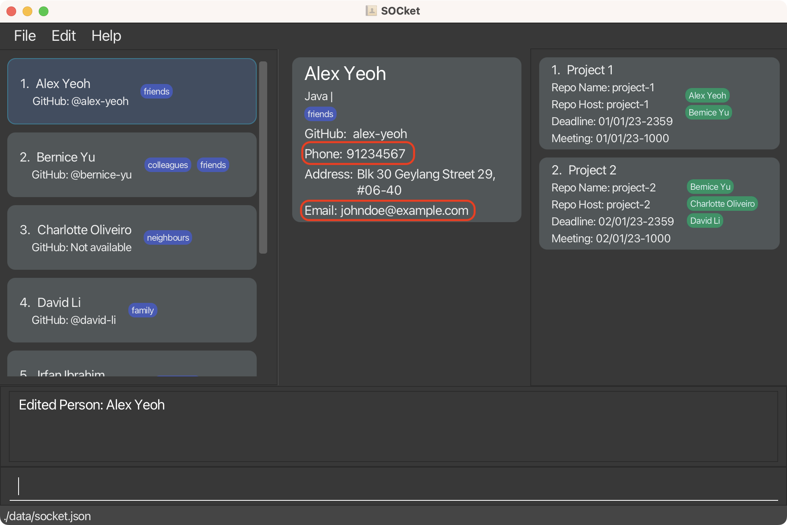
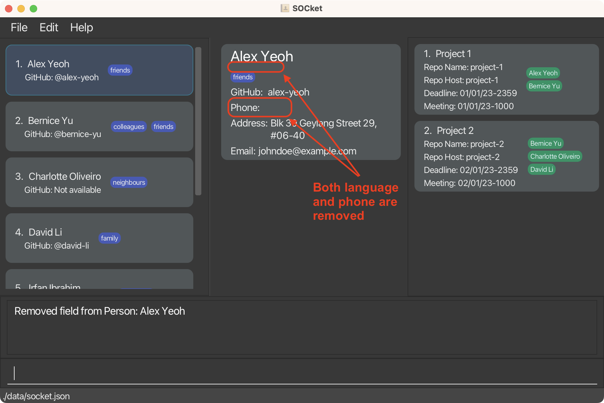
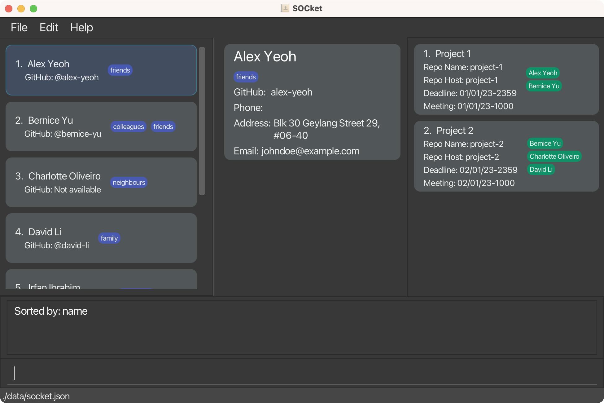
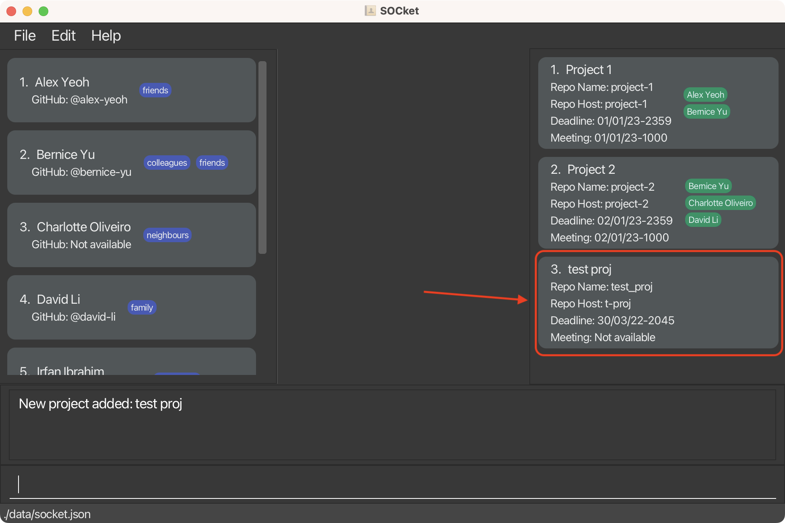
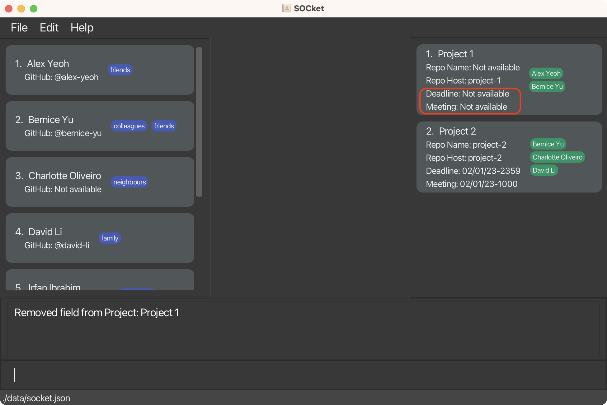
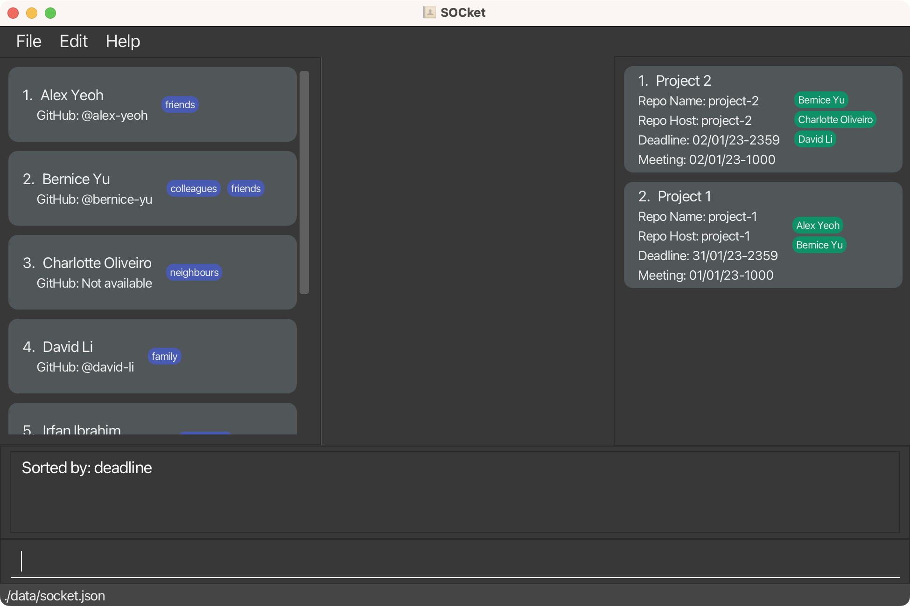
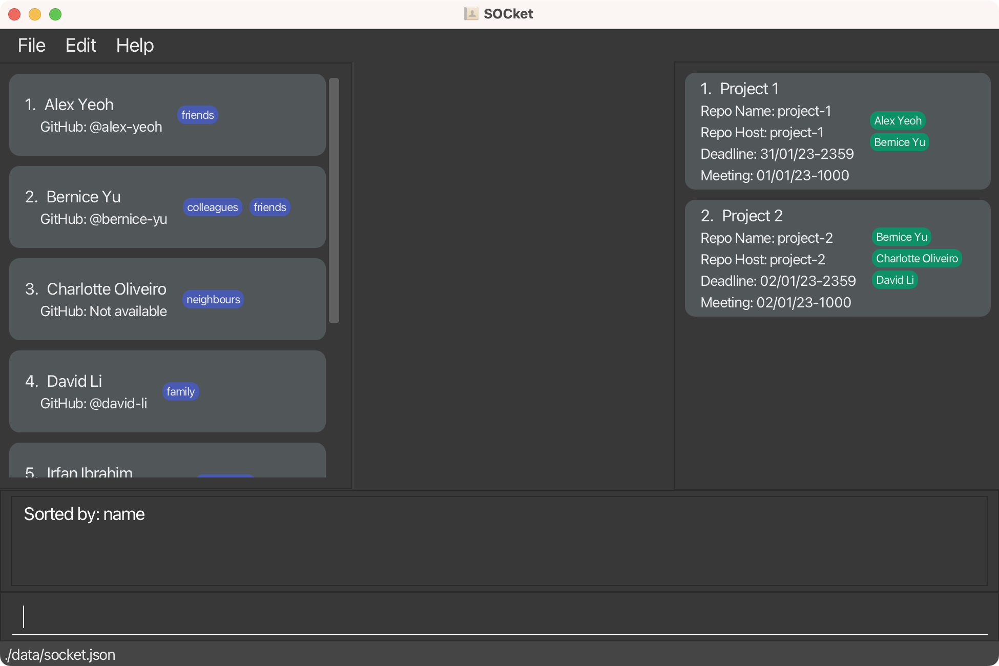

* Table of Contents
{:toc}

--------------------------------------------------------------------------------------------------------------------

## Introduction

SOCket is a **desktop app for NUS Software Engineering Students to manage the contact information of their peers and professors**. With SOCket, you can easily organize and access contact information. SOCket also allows you to efficiently manage information on projects you are involved in.

SOCket is optimized for use via a Command Line Interface (CLI) while still having the benefits of a Graphical User Interface (GUI). With the use of the CLI, you can manage contacts in SOCket without needing to move your mouse, allowing you to get your contact management tasks done faster than traditional GUI apps.

--------------------------------------------------------------------------------------------------------------------

## About this User Guide

The SOCket User Guide helps you quickly familiarise yourself with the features and command syntax of SOCket, imparting the knowledge necessary for you to utilise SOCket's functions. More experienced users can use the **[Command summary](#command-summary)** as a quick reference for the syntax of SOCket's commands.

You can use the links in the Table of Contents to quickly navigate through this document. To help you get started, refer to the **[Quick start](#quick-start)** section of the SOCket User Guide.

--------------------------------------------------------------------------------------------------------------------

## Quick start

1. Ensure you have Java `11` or above installed in your Computer.

1. Download the latest `socket.jar` from [here](https://github.com/AY2223S2-CS2103T-T12-4/tp/releases).

1. Copy the file to the folder you want to use as the _home folder_ for your SOCket.

1. Open a command terminal, `cd` into the folder you put the jar file in, and use the `java -jar socket.jar` command to run the application. A GUI containing __6 main components__ should appear as below in a few seconds. Note how the app contains some sample data. 
   

   

   <i>GUI of SOCket</i>
    
   

1. Type the command in the command box and press Enter to execute it. 
   * e.g. typing **`help`** and pressing Enter will open the help window.  
   * Some example commands you can try:

       * `list` : Lists all contacts.

       * `add n/John Doe p/98765432 e/johnd@example.com a/John street, block 123, #01-01` : Adds a contact named `John Doe` to SOCket.

       * `delete 3` : Deletes the 3rd contact shown in the current list.

       * `clear` : Deletes all contacts.

       * `exit` : Exits the app.

1. Refer to the [Features](#features) below for details of each command.

--------------------------------------------------------------------------------------------------------------------

## Features

**:information_source: Notes about the command format:** 

* `INDEX` must be a positive integer starting from 1 and ending with corresponding number of the contact or project in SOCket. e.g. `1,2,...`

* Keywords in `UPPER_CASE` are the parameters to be supplied by the user. 
  e.g. in `add n/NAME`, `NAME` is a parameter which can be used as `add n/John Doe`.

* Keywords in `UPPER_CASE` supplied to remove commands `remove` and `removepj`, are optional. 
  e.g. in `remove 1 p/PHONE`, `PHONE` can be left empty. 
  **Note:** If keyword is left empty, SOCket will assume that it has removed an empty field so an error message will not be shown even if there is a wrong keyword in a subsequent prefix.

* Fields in square brackets are optional. 
  e.g `n/NAME [t/TAG]` can be used as `n/John Doe t/friend` or as `n/John Doe`. 
  e.g `[p/[PHONE]]` can be used as `p/`.

* Fields with `…`​ after them can be used multiple times including zero times. 
  e.g. `[t/TAG]…​` can be used as ` ` (i.e. 0 times), `t/friend`, `t/friend t/family` etc.

* Fields can be in any order. 
  e.g. if the command specifies `n/NAME p/PHONE`, `p/PHONE n/NAME` is also acceptable.

* If a field is expected only once in the command but you specified it multiple times, only the last occurrence of the field will be taken. 
  e.g. if you specify `p/12341234 p/56785678`, only `p/56785678` will be taken.

* Extraneous fields for commands that do not take in fields (such as `help`, `list`, `exit` and `clear`) will be ignored. 
  e.g. if the command specifies `help 123`, it will be interpreted as `help`.

### Contact Commands

Commands that help you make changes to the contact list.

#### Adding a contact: `add`

Adds a contact to SOCket.

Format: `add n/NAME [p/PHONE] [e/EMAIL] [a/ADDRESS] [g/GITHUB_PROFILE] [l/LANGUAGE]…​ [t/TAG]…​`

:bulb: Tip:
A contact can have any number of languages/tags (including 0).

Examples:
* `add n/John Doe p/98765432 e/johnd@example.com a/John street, block 123, #01-01 g/johndoe l/Python`
  
  
  

  <i>Result of the <code>add n/John Doe ...</code> command</i>
   
  

* `add n/Betsy Crowe t/friend e/betsycrowe@example.com a/Newgate Prison p/1234567 t/criminal`

#### Editing a contact : `edit`

*For when you make a mistake in the details or to update new details of a contact.*

Edits an existing contact in SOCket.

Format: `edit INDEX [n/NAME] [p/PHONE] [e/EMAIL] [a/ADDRESS] [g/GITHUBPROFILE] [l/LANGUAGE]…​ [t/TAG]…​`

* Edits the information of the contact at the specified `INDEX`.
* The index refers to the index number shown in the displayed contact list.
* At least one of the optional fields must be provided.
* Existing values will be updated to the input keywords.
* When editing languages, the existing languages of the contact will **not** be removed.
* When editing tags, the existing tags of the contact will be removed.

:bulb: Tip:
You can remove all the tags of a contact by typing `t/` without specifying any keywords after it.

Examples:
*  `edit 1 p/91234567 e/johndoe@example.com` Edits the phone number and email address of the 1st contact to be `91234567` and `johndoe@example.com` respectively.
     
   
   

   <i>Result of the <code>edit 1 ...</code> command</i>
    
   

* `edit 2 n/Betsy Crower t/` Edits the name of the 2nd contact to be `Betsy Crower` and clears all existing tags.

#### Removing a contact's field : `remove`

*When you just want to wipe a value completely or remove specific values only.*

Removes the specific field value based on the given contact.

Format: `remove INDEX [p/PHONE] [p/GITHUBPROFILE] [e/EMAIL] [a/ADDRESS] [l/LANGUAGE] [t/TAG]...`

* Removes field value of the contact at the specific `INDEX`.
* At least one of the optional fields must be provided.
* Removes the corresponding field value(s) matching the `KEYWORD`.
  * e.g. `l/Java` will remove `Java` from the languages of the contact.
* Clears the field value(s) when no keyword is provided for the field.
  * e.g. `t/` will remove all the tags associated with the contact.

:bulb: Tip:
You can use the remove command to just remove specific tags/language and keep the rest unedited.

 :exclamation: Warning:
If no keyword is provided, `remove` will still **execute successfully** on an empty field.

Examples:
* `remove 1 p/ l/Java` Removes the phone number and `Java` from the languages from the first contact in the list.
    
  

  

  <i>Result of the <code>remove 1 p/ l/Java</code> command</i>
   
  

#### Listing all contacts : `list`

*For when you would like to look at a specific group of contacts.*

Lists all contacts in SOCket based on language and tag.

Format: `list [l/LANGUAGE] [t/TAG]`
* The search is carried out on ***all*** contacts stored in SOCket, not just the currently displayed list of contacts.
   * e.g. `list t/friend` will list out contacts tagged with `friend` from the original contact list whe already filtered list is displayed.
* The search for language or tag is case-sensitive.
* If no language or tag fields are given, all contacts are displayed.
    * e.g. `list` will list out all contacts.
* There can be one or more fields for each type of prefix (language/ tag).
    * e.g. `list l/Python t/friend` will match all contacts whose languages contain `Python` AND tags contain `friend`.
* Languages and tags keywords given are specific.
    *  e.g. `list t/school` will not match `list t/school friend`.
* Contacts with keywords matching all keywords for the respective fields will be returned (i.e. `AND` search).
    * e.g. `list t/friend l/C++` will return contacts containing the tag `friend` AND the language `C++`.
* Each contact is accompanied by an index number in the list.
* The list by default is sorted by time added (i.e most recently added contact being last in the list).

#### Locating contacts by keyword(s): `find`

*If you ever need to search out contacts that you have forgot parts of its details.*

Find contacts stored in SOCket based on the given keyword(s) for the respective fields.

Format: `find [n/NAME] [p/PHONE] [e/EMAIL] [a/ADDRESS] [g/GITHUBPROFILE] [l/LANGUAGE] [t/TAG]`

* The search is carried out on ***all*** contacts stored in SOCket, not just the currently displayed list of contacts.
* The search for keyword(s) is case-insensitive.
    * e.g `find n/hans` will match `find n/Hans`.
    * e.g `find t/cs2103t` will match `find t/CS2103T`.
* There can be one or more keyword(s) for each prefix type.
    * e.g. `find n/Hans Bo` will match all contacts whose name contains either `Hans` or `Bo`.
* The order of the keyword(s) and field(s) does not matter.
    * e.g. `find n/Hans Bo` will match `find n/Bo Hans`.
    * e.g. `find n/Hans Bo t/cs2103t` will match `find t/cs2103t n/Hans Bo`.
* Only full words will be matched.
    * e.g. `Han` will not match `Hans`.
    * e.g. `t/2103t` will not match `t/cs2103t`.

* Contacts with multiple keyword(s) in the prefix matching at least one keyword for the respective field will be returned (i.e. `OR` search).
    * e.g. `find n/Hans Bo` will return `Hans Gruber`, `Bo Yang`.
    * e.g. `find n/Hans l/Java` will return contacts whose name contains `Hans` or language contains `Java` or both.
    * e.g. `find t/friend` will return contacts who have either tag `friend` or `best friend` or both.

:exclamation: Warning:
If no field is specified, zero contacts will be returned!

Example:
* `find n/alex david` returns `Alex Yeoh`, `David Li`.
  
  

  

  <i>Result of the <code>find n/alex david</code> command</i>
   
  

#### Deleting a contact : `delete`

*Maybe if you want to tidy up your contacts.*

Deletes the specified contact from SOCket.

Format: `delete INDEX`

* Deletes the contact at the specified `INDEX`.
* The index refers to the index number shown in the displayed contact list.

:bulb: Tip:
You can use the find command or list command to narrow down your contact list before performing delete based on the filtered list.

Examples:
* `list` followed by `delete 2` deletes the 2nd contact in SOCket.
* `find Betsy` followed by `delete 1` deletes the 1st contact in the results of the `find` command.

#### Clearing all contacts or tags : `clear`

*Deleting contacts one by one is a hassle, clear can solve that hassle.*

Clears all contacts from SOCket based on the given tag(s); if tags are not included, clears all contacts in SOCket.

Format: `clear [t/TAG]...`

* Removes all contacts with the specified tags.
* Any tag included is **case-insensitive**.
  * e.g. `t/CS2103T` is equivalent to `t/cs2103t`.
* The tags **must exist** in SOCket.
* If tags are provided, only remove existing tags.
  * e.g. `clear t/cs2103t t/cs2103` will only remove the contacts associated with the tag `cs2103t` if there exists the `cs2103t` tag but not `cs2103` in SOCket.
* If no tag field is provided, remove all contacts in SOCket.
* A confirmation prompt will appear before removal of contacts.

#### Sorting contacts (by other fields) : `sort`

Sorts and displays contacts according to the provided category. Sorts contacts by name if no keyword is provided.

Format: `sort [CATEGORY]`

* If no category is provided, the contacts are sorted by their names alphanumerically.
* If a category is provided, the contacts are sorted by that category alphanumerically.
    * e.g. `sort address` will sort the contacts by their addresses alphanumerically. Contacts without addresses will be at the bottom.
* The available categories are:
  * name
  * github
  * phone
  * address
  * email

:bulb: Tip:
This command will sort the and display the full contact list.

Examples: 
* `sort` Sort contacts by **Name**.
  
  

  

  <i>Result of the <code>sort</code> command</i>
   
  

* `sort address` Sort the contacts by **Address**.
  
  

  

  <i>Result of the <code>sort address</code> command</i>
   
  

#### Viewing a contact's detailed information: `view`

*When you need to see the full details of a particular contact.*

Views the details of a contact present in the list.

Format: `view INDEX`
* Views the contact's detailed information at the specified `INDEX`.
* The index refers to the index number shown in the displayed contact list.
* Alternatively, click on the contact in the list to view detailed information.

### Project Commands

Commands that help you make changes to the project list.

#### Adding a project: `addpj`

Adds a project to SOCket.

Format: `addpj n/PROJECT_NAME h/REPO_HOST r/REPO_NAME d/DEADLINE [m/MEETING]`

* If a prefix is specified, it cannot be blank.
    * e.g `n/  ` is not allowed.
* Project Name should contain only alphanumeric & space.
    * e.g `n/project 1`.
* Repository Host should:
    * contain alphanumeric & hyphens only.
    * not start or end with hyphen.
    * not exceed 39 characters.
    * e.g `h/project-1`.
* Repository Name should:
    * contain alphanumeric, periods, hyphens, or underscores only.
    * not exceed 100 characters.
    * e.g `r/project_1`.
* Deadline & Meeting should be given in a date format (dd/MM/yy-HHmm).
    * e.g `d/ 30/03/22-2045` would be *30th March 2022, 8:45 p.m.
* A project is considered to be the same if it has the same project name (case-insensitive).

Examples:
* `addpj n/test proj h/t-proj r/test_proj d/ 30/03/22-2045`
  
  

  

  <i>Result of the <code>addpj n/test ...</code> command</i>
   
  

#### Editing a project: `editpj`

*For when you make a mistake in the details or to update new details of a project.*

Edits an existing project in SOCket.

Format: `editpj INDEX [n/PROJECT_NAME] [h/REPO HOST] [r/REPO NAME] [d/DEADLINE] [m/MEETING]`

* Edits the project at the specified `INDEX`.
* The index refers to the index number shown in the displayed project list.
* At least one of the optional fields must be provided.
* Existing values will be updated to the input values.

Examples:
* `editpj 1 n/Project Alpha d/02/01/23-2359`Edits the project name and deadline of the first project to be `Project Alpha` and `02/01/2023-2359` respectively.
  
  

  

  <i>Result of the <code>editpj 1 ...</code> command</i>
   
  

#### Removing a project's field: `removepj`

*When you just want to wipe a value completely or remove specific values only.*

Removes the specific field based on the given project in SOCket.

Format: `removepj INDEX [h/[REPO_HOST]] [r/[REPO_NAME]] [d/[DEADLINE]] [m/[MEETING]]`

* Removes field value of project at the specific `INDEX`.
* At least one of the optional fields must be provided.
* Removes all the corresponding field value in respect of the keyword.
  * e.g. `r/alex-yeoh` will remove project’s repository name.
* Removes the entire field value when that prefix has no keyword provided.
  * e.g. `m/` will remove project's meeting.

Examples:
* `removepj 1 r/` Removes repository name from first project in the project list.
    
  

  

  <i>Result of the <code>removepj 1 r/</code> command</i>
   
  

* `removepj 1 d/01/01/23-2359 m/` Removes deadline `01/01/23-2359` and meeting from first project in the project list.
    
  

  

  <i>Result of the <code>removpj 1 d/01/01/23-2359 m/</code> command</i>
   
  

#### Deleting a project: `deletepj`

*Maybe if you want to tidy up your projects.*

Deletes the specified project from SOCket.

Format: `deletepj INDEX`

* Deletes the project at the specified `INDEX`.
* The index refers to the index number shown in the displayed project list.

Examples:
* `deletepj 2` deletes the 2nd project in SOCket.

#### Clearing all projects: `clearpj`

Clears all the projects in SOCket.

Format: `clearpj`

#### Sorting projects (by other fields): `sortpj`

Sorts and displays the projects according to the provided category. Sorts the list of projects by deadline if no argument is provided.

Format: `sortpj [CATEGORY]`

* If no category is provided, the projects are sorted by their deadlines alphanumerically.
* If a category is provided, the projects are sorted by that category alphanumerically.
    * e.g. `sortpj reponame` will sort the projects by their Repository Names alphanumerically. Projects without Repository Names will be at the bottom.
* The available categories are:
  * name
  * reponame
  * repohost
  * deadline
  * meeting

:bulb: Tip:
Use the deadline category to sort your projects based on the nearest due dates!

Examples:
* `sortpj deadline` Sort the project list by **Deadline**.
  
  

  

  <i>Result of the <code>sortpj deadline</code> command</i>
   
  

* `sortpj name` Sort the project list by **Project Name**.
  
  

  

  <i>Result of the <code>sortpj name</code> command</i>
   
  

#### Assign a contact to a project: `assign`

Format: `assign CONTACT_INDEX PROJECT_INDEX`

* `CONTACT_INDEX` refers to the index number shown in the displayed contact list.
* `PROJECT_INDEX` refers to the index number shown in the displayed project list.

Examples:
* Before Assigning:  
  

  

  <i>Before the <code>assign 1 1</code> command</i>
   
  

* After Assigning:  
  

  

  <i>After the <code>assign 1 1</code> command</i>
   
  

#### Unassign a contact from a project: `unassign`

Removes the specified contact from the specified project.

Format: `unassign INDEX n/NAME`

* Removes the contact with the specified `NAME` from the project with the specified `INDEX`.
* `INDEX` refers to the index number shown in the displayed project list.
* `NAME` is case-insensitive.
* `NAME` must match in full.

Examples:
* Before Unassigning:  
  

  

  <i>Before the <code>unassign 1 n/Alex Yeoh</code> command</i>
   
  

* After Unassigning:  
  

  

  <i>After the <code>unassign 1 n/Alex Yeoh</code> command</i>
   
  

### General Commands

General commands to improve your experience with SOCket.

#### Undoing a change : `undo`

Undoes the last change made to SOCket.

Format: `undo`
Keyboard Shortcut:
1. <kbd>ctrl</kbd>+<kbd>Z</kbd> __(Windows)__.
2. <kbd>command</kbd>+<kbd>Z</kbd> __(Mac)__.

* A message is shown if no changes were made to SOCket.

#### Redoing an undone change : `redo`

Restores a previously undone change made to SOCket.

Format: `redo`
Keyboard Shortcut:
1. <kbd>ctrl</kbd>+<kbd>shift</kbd>+<kbd>Z</kbd> __(Windows)__.
2. <kbd>command</kbd>+<kbd>shift</kbd>+<kbd>Z</kbd> __(Mac)__.

* A message is shown if no undone changes exist.

 :bulb: Tip:
Changes made to SOCket are **not** saved upon exit.

#### Exiting the program : `exit`

Exits the program.

Format: `exit`

Shortcut key:
1. <kbd>ctrl</kbd>+<kbd>Q</kbd> __(Windows)__.
2. <kbd>command</kbd>+<kbd>Q</kbd>  __(Mac)__.

#### Viewing help : `help`

Displays window showing the list of commands and a clickable URL to access help page.

<i>Help Window displayed by the <code>help</code> command</i>
 

Format: `help`

Keyboard Shortcut: <kbd>F1</kbd>

### Saving the data

SOCket data is saved in the hard disk automatically after any command that changes the data. There is no need to save manually.

### Editing the data file

SOCket data is saved as a JSON file `[JAR file location]/data/socket.json`. Advanced users are welcome to update data directly by editing that data file.

:exclamation: **Warning:**
If your changes to the data file makes its format invalid, SOCket will discard all data and start with an empty data file at the next run.

--------------------------------------------------------------------------------------------------------------------

## FAQ

**Q**: How do I transfer my data to another Computer? 
**A**: Install the app in the other computer and overwrite the empty data file it creates with the file that contains the data of your previous SOCket home folder.

--------------------------------------------------------------------------------------------------------------------

## Command summary

| Action          | Format, Examples                                                                                                                                                                                     |
|-----------------|------------------------------------------------------------------------------------------------------------------------------------------------------------------------------------------------------| 
| **Add**         | `add n/NAME [p/PHONE] [e/EMAIL] [a/ADDRESS] [g/GITHUB_PROFILE] [l/LANGUAGE] [t/TAG]…​`   e.g. `add n/John Doe p/98765432 e/johnd@example.com a/John street, block 123, #01-01 g/johndoe l/Python` |
| **Clear**       | `clear [t/TAG]...`  e.g. `clear t/cs2103t`                                                                                                                                                        |
| **Delete**      | `delete INDEX`                                                                                                                                                                                       |
| **Remove**      | `remove INDEX [p/[PHONE]] [p/[GITHUBPROFILE]] [e/[EMAIL]] [a/[ADDRESS]] [l/[LANGUAGE]] [t/[TAG]]…​`   e.g. `remove 1 t/ l/Java e/`                                                                |
| **Edit**        | `edit INDEX [n/NAME] [p/PHONE] [e/EMAIL] [a/ADDRESS] [g/GITHUBPROFILE] [l/LANGUAGE] [t/TAG]…​`  e.g. `edit 2 n/James Lee e/jameslee@example.com`                                                  |
| **Sort**        | `sort [CATEGORY]`  e.g. `sort address`                                                                                                                                                            |
| **Find**        | `find KEYWORD [MORE_KEYWORDS]…​ [t/TAG]…​`  e.g. `find James Jake t/cs2103t`                                                                                                                      |
| **List**        | `list [l/language] [t/tag]`  e.g. `list l/Java`                                                                                                                                                   |
| **Add Project** | `addpj n/PROJECT_NAME h/REPO_HOST r/REPO_NAME d/DEADLINE [m/MEETING]`  e.g. `addpj n/test proj h/t-proj r/test_proj d/ 30/03/22-2045`                                                             |
| **Clear Projects** | `clearpj`                                                                                                                                                                                            |
| **Delete Project** | `deletepj INDEX`                                                                                                                                                                                     |
| **Remove Project** | `removepj INDEX [h/[REPO_HOST]] [r/[REPO_NAME]] [d/[DEADLINE]] [m/[MEETING]]`   e.g. `removepj 2 r/ d/ m/`                                                                                        |    
| **Edit Project** | `editpj INDEX [n/PROJECT_NAME] [h/REPO_HOST] [r/REPO_NAME] [d/DEADLINE] [m/MEETING]`  e.g. `editpj 2 n/Project Bravo r/bravo-project`                                                             |
| **Assign**      | `assign CONTACT_INDEX PROJECT_INDEX`  e.g. `assign 1 1`                                                                                                                                           |
| **Unassign**    | `unassign INDEX n/NAME`   e.g. `unassign 1 n/John Doe`                                                                                                                                            |
| **Sort Projects** | `sortpj [CATEGORY]`  e.g. `sortpj reponame`                                                                                                                                                       | 
| **View**        | `view INDEX`                                                                                                                                                                                         |
| **Undo**        | `undo` Keyboard Shortcut: <kbd>ctrl</kbd>+<kbd>Z</kbd> / <kbd>command</kbd>+<kbd>Z</kbd>                                                                                                          |
| **Redo**        | `redo` Keyboard Shortcut: <kbd>ctrl</kbd>+<kbd>shift</kbd>+<kbd>Z</kbd> / <kbd>command</kbd>+<kbd>shift</kbd>+<kbd>Z</kbd>                                                                        |
| **Help**        | `help` Keyboard Shortcut: <kbd>F1</kbd>                                                                                                                                                           |
| **Exit**        | `exit` Keyboard Shortcut: <kbd>ctrl</kbd>+<kbd>Q</kbd> / <kbd>command</kbd>+<kbd>Q</kbd>                                                                                                          |
