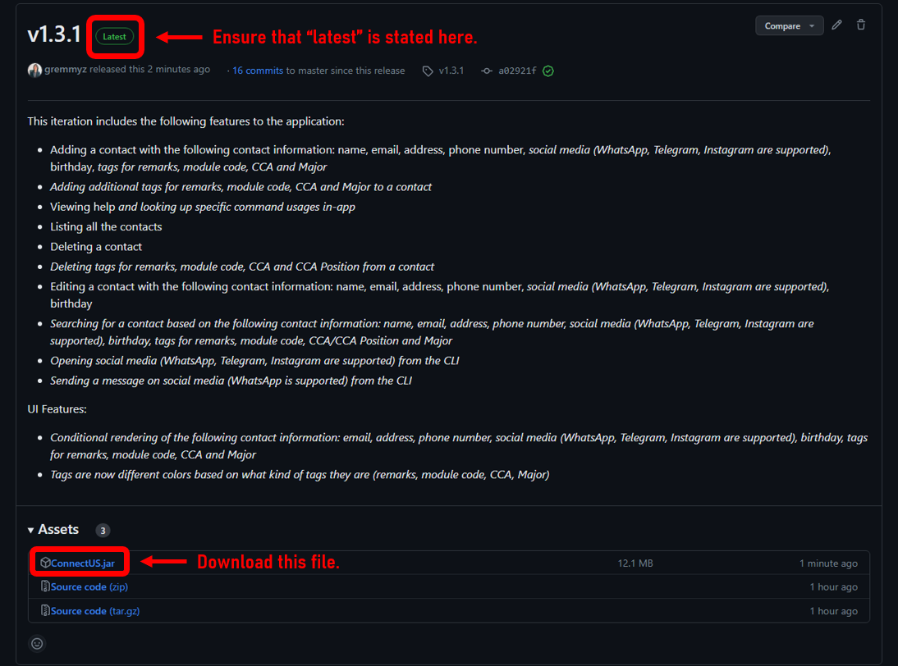
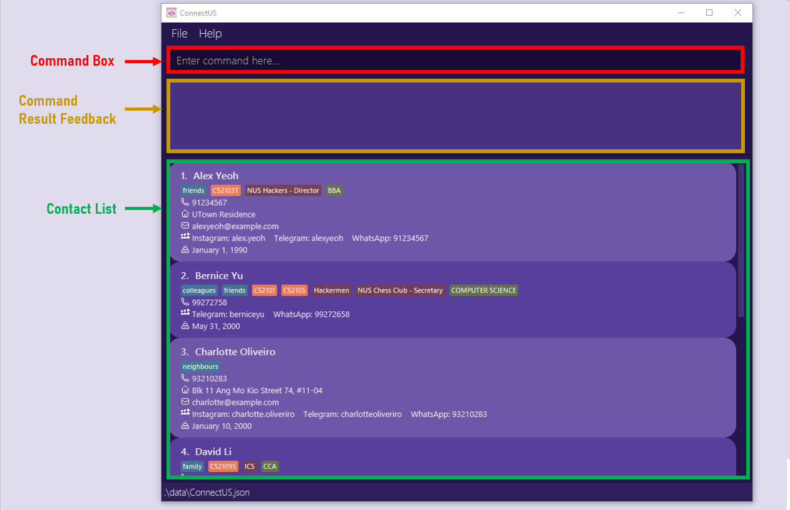
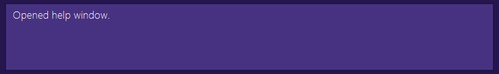

<!---
images with the path images/johndoe.png
are placeholder images to be changed.
-->

# Welcome to ConnectUS!

ConnectUS is the ultimate **contact management system** for your everyday needs. If you're a School of Computing student, this app is for you. With ConnectUS, you can **connect with people** without the stress of remembering who you met where (on top of the stress of a growing assignment backlog — ~~_trust us, we know!_~~) holding you back from socialising.

We're focused on:
- **Efficiency**: Optimized for use via a Command Line Interface (CLI), you can **easily view and edit your contacts** at your fingertips with ConnectUS.
- **User-friendliness**: With the benefits of having a Graphical User Interface (GUI), **easily navigate through your contact information** to find exactly what you need to **connect** with others.

This User Guide will provide you with an in-depth documentation for you to easily integrate ConnectUS into your daily life. It covers **step-by-step instructions** on setting up ConnectUS, core ConnectUS features and commands, and a glossary for definitions of terms used in ConnectUS.

So what are you waiting for? Get ready to **Connect** with others and let **US** handle the rest!

---

# Table of Contents

- [1. Using this guide](#1-using-this-guide)
  - [1.1 Notation](#11-notation)
  - [1.2 Navigation](#12-navigation)
- [2. Installation](#2-installation)
- [3. Quick Start Guide](#3-quick-start-guide)
  - [3.1 Layout](#31-layout)
    - [3.1.1 Command Box](#311-command-box)
    - [3.1.2 Command Result Feedback](#312-command-result-feedback)
    - [3.1.3 Contact List](#313-contact-list)
  - [3.2 Key Definitions](#32-key-definitions)
    - [3.2.1 Command](#321-command)
    - [3.2.2 Parameter](#322-parameter)
  - [3.3 Command Format](#33-command-format)
  - [3.4 How to Use the CLI](#34-how-to-use-the-cli)
- [4. Features](#4-features)
  - [4.1 Viewing help: `help`](#41-viewing-help-help)
  - [4.2 Listing all contacts: `list`](#42-listing-all-contacts-list)
  - [4.3 Clearing all entries: `clear`](#43-clearing-all-entries-clear)
  - [4.4 Adding a contact: `add`](#44-adding-a-contact-add)
  - [4.5 Editing a contact: `edit`](#45-editing-a-contact-edit)
  - [4.6 Adding additional tags to a contact: `add-t`](#46-adding-additional-tags-to-a-contact-add-t)
  - [4.7 Deleting tags from a contact: `delete-t`](#47-deleting-tags-from-a-contact-delete-t)
  - [4.8 Deleting a contact: `delete`](#48-deleting-a-contact-delete)
  - [4.9 Searching for contact information: `search`](#49-searching-for-contact-information-search)
  - [4.10 Opening a social media platform: `open`](#410-opening-a-social-media-platform-open)
  - [4.11 Sending chats to a contact: `chat`](#411-sending-chats-to-a-contact-chat)
  - [4.11 Exiting the program: `exit`](#412-exiting-the-program-exit)
  - [4.12 Saving the data](#413-saving-the-data)
  - [4.13 Editing the data file](#414-editing-the-data-file)
- [5. Information Fields & Prefixes](#5-information-fields--prefixes)
  - [5.1 Name: `n/`](#51-name-n)
  - [5.2 Phone: `p/`](#52-phone-p)
  - [5.3 Email: `e/`](#53-email-e)
  - [5.4 Address: `a/`](#54-address-a)
  - [5.5 Instagram: `ig/`](#55-instagram-ig)
  - [5.6 Telegram: `tg/`](#56-telegram-tg)
  - [5.7 WhatsApp: `wa/`](#57-whatsapp-wa)
  - [5.8 Birthday: `b/`](#58-birthday-b)
  - [5.9 Tags](#59-tags)
    - [5.9.1 Module Tag: `mod/`](#591-module-tags-mod)
    - [5.9.2 Major Tag: `major/`](#592-major-tags-major)
    - [5.9.3 CCA Tag: `cca/`](#593-cca-tags-cca)
    - [5.9.3 Remark Tag: `r/`](#594-remark-tags-r)
- [6. FAQ](#6-faq)
- [7. Command Summary](#7-command-summary)
- [8. Prefix Summary](#8-prefix-summary)
- [9. Glossary](#9-glossary)

---

# 1. Using this guide

Thank you for choosing ConnectUS! We are delighted to have you onboard with us as a user.

We **highly recommend** that you read through our User Guide in a sequential order.

## 1.1 Notation

Some special notations are used throughout this guide:

- [Links in blue](#11-notation) will help you navigate through this document, or take you to places on the Internet.
- **Bolded words** are phrases that you should pay attention to.
- <u>Underlined words</u> can be found in the [Glossary](#9-glossary).

## 1.2 Navigation

- If this is your **first time** using ConnectUS, head over to our [Installation](#2-installation) guide for instructions on setting up ConnectUS, and our [Quick Start Guide](#3-quick-start-guide) to begin using ConnectUS.

- If you need a **refresher on command syntax**, head over to [Command Summary](#7-command-summary) for a reference table of commands, or [Prefix Summary](#8-prefix-summary) for a reference table of prefixes.

- For detailed instructions about the features we offer and how to use each command, please refer to [Features](#4-features).

- For detailed information about the different information fields that you can assign to a contact, please refer to [Information Fields & Prefixes](#5-information-fields--prefixes).

- Refer to the [Glossary](#9-glossary) for definitions of terms used in ConnectUS.

[↑ Back to top of section](#1-using-this-guide)

[↑ Back to table of contents](#table-of-contents)

---

# 2. Installation

ConnectUS works on any mainstream OS as long as <u>Java `11`</u> installed.

If you have yet to install ConnectUS, simply follow these steps to set it up:

1. Ensure you have Java `11`(found [here](https://www.oracle.com/sg/java/technologies/javase/jdk11-archive-downloads.html)) installed in your computer.

2. Download the latest <u>`ConnectUS.jar`</u> from our [releases page on <u>GitHub</u>](https://github.com/AY2223S2-CS2103T-W15-1/tp/releases).  
   

3. Copy the file to the folder you want to use as the _home folder_ for your ConnectUS app. 
   

4. Double-click the `ConnectUS.jar` file to start the app. 
   A GUI similar to the below should appear in a few seconds. Note how the app contains some sample data. 
   

Congratulations! You have successfully set up ConnectUS.

[↑ Back to top of section](#2-installation)

[↑ Back to table of contents](#table-of-contents)

---

# 3. Quick Start Guide

## 3.1 Layout

Let's take a look at the different components in ConnectUS. 

### 3.1.1 Command Box

The command box allows you to enter commands that you wish to perform. For starters, try typing the `help` command and hit enter!

### 3.1.2 Command Result Feedback

The command result feedback box will provide you with a feedback message after a command is entered. For example, after typing `help`, you should see the above feedback in your ConnectUS application, along with a new Help Window!

If you enter an unrecognized command or a command with the wrong format, an error message will be shown in this feedback box: 

You can then use the scroll bars of the feedback box to navigate through the feedback given.

### 3.1.3 Contact List

The contact list shows the contacts that exist within your ConnectUS with all their registered information fields.

* There is a scroll bar beside the contact list container for you to scroll through your contact list.
* The index beside the contact name is the contact's index. It is used for certain commands such as `delete`. More details on this can be found in [Features](#4-features).
* The list of information fields and their details can be found in [Information Fields & Prefixes](#5-information-fields--prefixes). 
* You can also find a condensed summary table of these information fields in the [Prefix Summary](#8-prefix-summary).

## 3.2 Key Definitions

### 3.2.1 Command

Commands are actions that you want to perform using ConnectUS. Most commands will require user inputs, otherwise known as [parameters](#322-parameter), for ConnectUS to perform the action.

### 3.2.2 Parameter

Parameters are user inputs that ConnectUS requires to perform certain [commands](#321-command).

Example: `n/NAME`

In this case, `NAME` is the information field that you wish to input. The `n/` prefix must be used for ConnectUS to recognise that you intend on adding a `NAME` to a contact.

* The list of information fields, prefixes and their details can be found in [Information Fields & Prefixes](#5-information-fields--prefixes). 
* You can also find a condensed summary of these information fields in the [Prefix Summary](#8-prefix-summary).

## 3.3 Command Format

To use ConnectUS, type the [command](#321-command) along with its [parameters](#322-parameter), if required. You can leave the parameters empty if it is optional (i.e. if it is wrapped in square brackets like this: `help [COMMAND]`).

* The detailed list of commands and their command formats can be found in [Features](#4-features). 
* You can also find a condensed summary of these commands in the [Command Summary](#7-command-summary).

**:information_source: Notes about the command format:** 

* Words in `UPPER_CASE` are the information fields (referred to as *parameters*) to be supplied by the user. 
  e.g. in `add n/NAME`, `NAME` is a parameter which can be used as `add n/John Doe`.

* Items in square brackets are optional. 
  e.g `n/NAME [b/BIRTHDAY]` can be used as `n/John Doe b/14/02/2000` or as `n/John Doe`.

* Items with `…`​ after them can be used multiple times including zero times. 
  e.g. `[mod/MODULE]…​` can be used as ` ` (i.e. 0 times), `mod/CS2103T` (i.e. 1 time), `mod/CS2103T mod/CS2107` (i.e. 2 times) etc.

* Information fields can be in any order. 
  e.g. if the command specifies `n/NAME p/PHONE`, `p/PHONE n/NAME` is also acceptable.

* If a parameter is expected only once in the command, but you specify it multiple times, only the last occurrence of the parameter will be taken. 
  e.g. if you specify `p/12341234 p/56785678`, only `p/56785678` will be taken.

* Extraneous parameter for commands that do not take in parameters (such as `help`, `list`, `exit` and `clear`) will be ignored. 
  e.g. if the command specifies `list 123`, it will be interpreted as `list`.

* Commands are case-sensitive! 
  e.g. if you specify `ADD n/James` or `aDd n/James` instead of `add n/James`, ConnectUS will not register it as a valid command.

## 3.4 How to Use the CLI

To use the Command Line Interface(CLI), you can type a [command](#321-command) in the [Command Box](#311-command-box) and press Enter to execute it.e.g. typing **`help`** and pressing Enter will open the help window. 
     

To familiarise yourself with ConnectUS, let's try out the `add` command! The `add` command allows you to add a new contact into the [Contact List](#313-contact-list).

**Format:** `add n/NAME [p/PHONE] [a/ADDRESS] [e/EMAIL] [tg/TELEGRAM] [ig/INSTAGRAM] [wa/WHATSAPP] [b/BIRTHDAY] [mod/MODULE]…​ [cca/CCA]…​ [major/MAJOR]…​ [r/REMARK]…​`

**What does Format mean?**

The first word of every command allows ConnectUS to distinguish different commands.

* `add` tells ConnectUS that this command is to add a new contact
* Prefixes such as `n/` and `p/` are delimiters that allow ConnectUS to distinguish different parameters from the input that you supply
* Information fields such as `NAME` and `PHONE` show you what you should place in each portion of the command.

Notice how there are square brackets `[]` surrounding certain parameters like in `[p/PHONE]`. This indicates that the parameter is **optional**, i.e. a contact can exist even if it does not have this field.

Other parameters that end with `…​` like in `[mod/MODULE]…​` indicates that this parameter can be used multiple times.

**Let's test this out!**

Suppose you have a friend whom you call Lineup Larry. His phone number is 91234567, and he stays on campus in UTown Residences. His Telegram username is lineuplarry, takes the modules CS2103T and CS2101, and is in the Art Club.

>`NAME`: Lineup Larry 
>`PHONE`: 91234567 
>`ADDRESS`: UTown Residences 
>`TELEGRAM`: lineuplarry 
>`MODULE`: CS2103T, CS2101 
>`CCA`: Art Club

The command you would enter into the command box would be: 
`add n/Lineup Larry p/91234567 a/UTown Residences tg/lineuplarry mod/CS2103T mod/CS2101 cca/Art Club`

Go ahead and hit enter once you've entered the command. If you have a new contact added in the Contact List as follows: 

Congratulations! You have successfully added your first contact!

There are many other features in ConnectUS. Do refer to the [Features](#4-features) below for details on each feature and command!

[↑ Back to top of section](#3-quick-start-guide)

[↑ Back to table of contents](#table-of-contents)

---

# 4. Features

ConnectUS has a list of features to assist you in your contact management needs!

- [4.1 Viewing help: `help`](#41-viewing-help-help)
- [4.2 Listing all contacts: `list`](#42-listing-all-contacts-list)
- [4.3 Clearing all entries: `clear`](#43-clearing-all-entries-clear)
- [4.4 Adding a contact: `add`](#44-adding-a-contact-add)
- [4.5 Editing a contact: `edit`](#45-editing-a-contact-edit)
- [4.6 Adding additional tags to a contact: `add-t`](#46-adding-additional-tags-to-a-contact-add-t)
- [4.7 Deleting tags from a contact: `delete-t`](#47-deleting-tags-from-a-contact-delete-t)
- [4.8 Deleting a contact: `delete`](#48-deleting-a-contact-delete)
- [4.9 Searching for contact information: `search`](#49-searching-for-contact-information-search)
- [4.10 Opening a social media platform: `open`](#410-opening-a-social-media-platform-open)
- [4.11 Sending chats to a contact: `chat`](#411-sending-chats-to-a-contact-chat)
- [4.11 Exiting the program: `exit`](#412-exiting-the-program-exit)
- [4.12 Saving the data](#413-saving-the-data)
- [4.13 Editing the data file](#414-editing-the-data-file)

## 4.1 Viewing help: `help`

Format: `help [COMMAND]`

> Opens up the help window, or returns the usage instructions of a specific command.

If you are lost while using ConnectUS, simply use the `help` command! Using the `help` command alone will show a message explaining how to access this User Guide.

If you want to know the usage instructions of a specific command, simply use `help [COMMAND]`, where `[COMMAND]` is the command that you need help with.

Examples: `help`, `help add`, `help list`

[↑ Back to feature list](#4-features)

## 4.2 Listing all contacts: `list`

Format: `list`

> Shows a list of all contact in the ConnectUS app.

Use `list` when you need to view a list of *all* the contacts in your ConnectUS. The `list` command can be used directly without any additional parameters.

[↑ Back to feature list](#4-features)

## 4.3 Clearing all entries: `clear`

Format: `clear`

> Clears all contacts from the ConnectUS app.

ConnectUS comes with a set of default contacts. If you want to remove all default contacts, or you want to restart your ConnectUS contact list, you can use the `clear` command without any additional parameters.

:exclamation: **Caution:** 
Once the contact data in ConnectUS is cleared, it cannot be retrieved. Do proceed with caution!

## 4.4 Adding a contact: `add`

Format: `add n/NAME [p/PHONE] [a/ADDRESS] [e/EMAIL] [tg/TELEGRAM] [ig/INSTAGRAM] [wa/WHATSAPP] [b/BIRTHDAY] [mod/MODULE]…​ [cca/CCA]…​ [major/MAJOR]…​ [r/REMARK]…​`

>Adds a contact to the ConnectUS app.
 
You can add a contact using the `add` command followed by the parameters (as shown in the format above). While the `NAME` is mandatory, the rest of the fields (i.e. `ADDRESS`, `TELEGRAM`, `MODULE` etc.) are optional. 

:bulb: **Tip:** 
A contact can have any number of tags, <u>modules</u> and <u>CCAs</u>! (including 0)

**Example 1:**

**Input in Command Box:** `add n/James`

**Result:** 

**Example 2:**

**Input in Command Box:** `add n/James e/james@example.com ig/itsjameshere tg/itsjameshere mod/CS2103T mod/CS2101 cca/NUS Hackers r/Year 2 b/01/01/2000`

**Result:** 

Please refer to [Information Fields & Prefixes](#5-information-fields--prefixes) for details on how to use each parameter prefix.

[↑ Back to feature list](#4-features)

## 4.5 Editing a contact: `edit`

Format: `edit INDEX [n/NAME] [p/PHONE] [a/ADDRESS] [e/EMAIL] [ig/INSTAGRAM] [tg/TELEGRAM] [wa/WHATSAPP] [b/BIRTHDAY]`

>Edits an existing contact in the ConnectUS app.

If you accidentally added the wrong information when [adding a contact](#44-adding-a-contact-add), or if you want to update your contacts' information, you use the `edit`  command to update contact information. 

:bulb: **Tip:** 
If you want to edit a contact's tags, refer to these guides on <a href="#46-adding-additional-tags-to-a-contact-add-t" class="alert-link">Adding Additional Tags</a> or <a href="#47-deleting-tags-from-a-contact-delete-t" class="alert-link">Deleting Existing Tags</a> instead!

The `edit` command:

* Edits the contact at the specified `INDEX`. The index refers to the index number shown in the displayed contact list.
* The index **must be a positive integer** e.g. 1, 2, 3, …​
* At least one of the optional fields must be provided (e.g. `n/NAME`, `tg/TELEGRAM`).
* Existing values will be updated to the input values.

**Example:**

**Input in Command Box:** `edit 1 p/12345678 e/james@example.com` 

**Result:** 

Please refer to [Information Fields & Prefixes](#5-information-fields--prefixes) for details on how to use each parameter prefix.

[↑ Back to feature list](#4-features)

## 4.6 Adding additional tags to a contact: `add-t`

Format: `add-t PERSON_INDEX [r/REMARK] [mod/MODULE] [cca/CCA] [major/MAJOR]`

> Adds a tag to an existing contact.

If you want to add a new tag to a contact, you can use the `add-t` command.

The `add-t` command:
* Adds a tag to the contact at the specified `PERSON_INDEX`. The `PERSON_INDEX` refers to the index number shown in the displayed contact list.
* The index **must be a positive integer** e.g. 1, 2, 3, …​
* At least one of the optional fields must be provided (e.g. `r/REMARK_NAME`, `mod/MODULE_NAME`).
* A new tag will be created and assigned to the person specified at the `PERSON_INDEX`.

**Example:**

**Input in Command Box:** `add-t 1 r/friends mod/CS2103T`

**Result:** 

## 4.7 Deleting tags from a contact: `delete-t`

Format: `delete-t PERSON_INDEX [r/REMARK_INDEX] [mod/MODULE_INDEX] [cca/CCA_INDEX] [major/MAJOR_INDEX]`

> Deletes an existing tag from an existing contact.

If you want to delete an existing tag from a contact, you can use the `delete-t` command.

The `delete-t` command:
* Deletes a tag from the contact at the specified `PERSON_INDEX`. The `PERSON_INDEX` refers to the index number shown in the displayed contact list.
* The `REMARK_INDEX`, `MODULE_INDEX`, `CCA_INDEX` and `MAJOR_INDEX` refer to the index of the tag shown in the respective tag types, from left to right, starting from index 1.

* All indexes (i.e. `PERSON_INDEX`, `REMARK_INDEX`, `MODULE_INDEX`, `CCA_INDEX`, `MAJOR_INDEX`) **must be a positive integer** e.g. 1, 2, 3, …​
* At least one of the optional fields must be provided (i.e. `r/REMARK_INDEX`, `mod/MODULE_INDEX`, `cca/CCA_INDEX`, `MAJOR_INDEX`).
* The specified tag will be deleted from the contact specified at the `PERSON_INDEX`.

**Example:**

**Input in Command Box:** `delete-t 1 mod/1`

**Result:** 

## 4.8 Deleting a contact: `delete`

Format: `delete PERSON_INDEX`

> Deletes the specified contact from the ConnectUS app.

If you wish to remove a contact, use the `delete` command.

The `delete` command:

* Deletes the contact at the specified `PERSON_INDEX`.
* The `PERSON_INDEX` refers to the index number shown in the displayed contact list.
* The index **must be a positive integer** e.g. 1, 2, 3, …​

**Example 1:**

`list` followed by `delete 2` deletes the 2nd contact in the ConnectUS app.

**Result:** 

**Example 2:**

`search Betsy` followed by `delete 1` deletes the 1st contact in the results of the `search` command.

**Result:** 

[↑ Back to feature list](#4-features)

## 4.9 Searching for contact information: `search`

Format: `search KEYWORD`

> Finds all contacts whose information fields and tags contain any of the given keywords.

Examples:
* `search january` returns all contacts whose information fields contain the keyword `january`.
* `search alex may` returns all contacts whose information fields contain the keywords `alex` and `may`.

* The keywords are case-insensitive! This means that `search january`, `search JANUARY` and `search jAnUaRy` will all return the contacts whose information fields contain the keyword `january`.

**Example:**

**Input in Command Box:** `search january`

**Result:** 

[↑ Back to feature list](#4-features)

## 4.10 Opening a social media platform: `open`

Format: `open PERSON_INDEX [tg/] [wa/] [ig/]`

> Opens the respective social media platform of an existing contact.

You can directly open supported social media platforms (i.e. Instagram, Telegram, WhatsApp) from the CLI.

:bulb: **Tip:** 
You'll need to download the desktop applications for <a href="https://desktop.telegram.org/" class="alert-link">Telegram</a> and <a href="https://www.whatsapp.com/download" class="alert-link">WhatsApp</a> respectively if you want to use these features!

**Example:**

**Input in Command Box:** `open 1 tg/`

**Result:** 

[↑ Back to feature list](#4-features)

## 4.11 Sending chats to a contact: `chat`

Format: `chat PERSON_INDEX wa/ m/`

> Sends a chat to an existing contact.

:bulb: **Tip:** 
You'll need to download the desktop application <a href="https://www.whatsapp.com/download" class="alert-link">WhatsApp</a> if you want to use this feature!

**Example:**

**Input in Command Box:** `chat 1 wa/ m/hello world!`

**Result:** 

[↑ Back to feature list](#4-features)

## 4.12 Exiting the program: `exit`

Format: `exit`

> Exits the program.

When you are done with your contact management needs, you can exit ConnectUS with the `exit` command.

[↑ Back to feature list](#4-features)

## 4.13 Saving the data

You won't ever need to worry about losing your contacts. ConnectUS automatically saves your data in the hard disk after any command that changes the data. There is no need to save manually.

[↑ Back to feature list](#4-features)

## 4.14 Editing the data file

If you are an advanced user, you are welcome to update data directly by editing the data file.

ConnectUS data is saved as a <u>JSON</u> file `[JAR file location]/data/ConnectUS.json`.

:exclamation: **Caution:** 
If your changes to the data file makes its format invalid, ConnectUS will discard all data and start with an empty data file at the next run. Do remember to keep a backup of your data before attempting any changes in this manner!

[↑ Back to feature list](#4-features)

[↑ Back to table of contents](#table-of-contents)

# 5. Information Fields & Prefixes

Here is a list of prefixes that ConnectUS uses when taking parameters.

- [5.1 Name: `n/`](#51-name-n)
- [5.2 Phone: `p/`](#52-phone-p)
- [5.3 Email: `e/`](#53-email-e)
- [5.4 Address: `a/`](#54-address-a)
- [5.5 Instagram: `ig/`](#55-instagram-ig)
- [5.6 Telegram: `tg/`](#56-telegram-tg)
- [5.7 WhatsApp: `wa/`](#57-whatsapp-wa)
- [5.8 Birthday: `b/`](#58-birthday-b)
- [5.9 Tags](#59-tags)
  - [5.9.1 Module Tag: `mod/`](#591-module-tags-mod)
  - [5.9.2 Major Tag: `major/`](#592-major-tags-major)
  - [5.9.3 CCA Tag: `cca/`](#593-cca-tags-cca)
  - [5.9.3 Remark Tag: `r/`](#594-remark-tags-r)

## 5.1 Name: `n/`
* Name is a *compulsory* field, i.e. a contact cannot exist if it does not have a name.
* The prefix for a name is `n/`.
* Names should only contain <u>alphanumeric</u> characters and spaces.

[↑ Back to prefix list](#5-information-fields--prefixes)

## 5.2 Phone: `p/`
* Phone is an *optional* field, i.e. a contact can exist even if it does not have a phone number.
* The prefix for a phone is `p/`.
* Phone numbers should only contain <u>numeric</u> characters.
* Phone numbers should be at least 3 digits long.

[↑ Back to prefix list](#5-information-fields--prefixes)

## 5.3 Email: `e/`
* Email is an *optional* field, i.e. a contact can exist even if it does not have an email.
* The prefix for an email is `e/`.
* Emails should be of the format local-part@domain and adhere to the following constraints:
    * The local-part should only contain <u>alphanumeric</u> characters and these <u>special characters</u>:`+_.-`. The local-part may not start or end with any special characters.
    * This is followed by a '@' and then a domain name. The domain name is made up of domain labels separated by periods.
      The domain name must:
        - end with a domain label at least 2 characters long
        - have each domain label start and end with <u>alphanumeric</u> characters
        - have each domain label consist of alphanumeric characters, separated only by hyphens, if any.

[↑ Back to prefix list](#5-information-fields--prefixes)

## 5.4 Address: `a/`
* Address is an *optional* field, i.e. a contact can exist even if it does not have an address.
* The prefix for an address is `a/`.
* Addresses can take any values, including <u>special characters</u>.

[↑ Back to prefix list](#5-information-fields--prefixes)

## 5.5 Instagram: `ig/`
* Instagram is an *optional* field, i.e. a contact can exist even if it does not have an Instagram.
* The prefix for an Instagram username is `ig/`.
* Instagram usernames should be of the format `john.123.doe` and adhere to the following constraints:
    * The username should only contain <u>alphanumeric</u> characters and the special character: `.`.
    * The dots `.` must not be consecutive or at the end.
    * The username should contain at most 30 characters.

[↑ Back to prefix list](#5-information-fields--prefixes)

## 5.6 Telegram: `tg/`
* Telegram is an *optional* field, i.e. a contact can exist even if it does not have a Telegram.
* The prefix for a Telegram username is `tg/`.
* Telegram usernames should be of the format `johndoe` and adhere to the following constraints:
    * The username should only contain <u>alphanumeric</u> characters and the special character `_`.
    * The username should contain at least 5 characters.

[↑ Back to prefix list](#5-information-fields--prefixes)

## 5.7 WhatsApp: `wa/`
* WhatsApp is an *optional* field, i.e. a contact can exist even if it does not have a WhatsApp.
* The prefix for adding a WhatsApp is `wa/`.
* A WhatsApp's user identifier is a phone number, which should adhere to the following constraints:
    * Phone numbers should only contain <u>numeric</u> characters.
    * Phone numbers should be at least 3 digits long.

[↑ Back to prefix list](#5-information-fields--prefixes)

## 5.8 Birthday: `b/`
* Birthday is an *optional* field, i.e. a contact can exist even if it does not have a birthday.
* The prefix for a birthday is `b/`.
* Birthdays should be of the format DD/MM/YYYY:
  * `01/01/2000` would correspond to January 1st, 2000
  * `16/05/1990` would correspond to May 16th, 1990.

[↑ Back to prefix list](#5-information-fields--prefixes)

## 5.9 Tags

There are four kinds of tags in ConnectUS.

### 5.9.1 Module Tags: `mod/`
* <u>Module</u> is an *optional* field, i.e. a contact can exist even if it does not have a module.
* The prefix for a module is `mod/`.
* Module names should be <u>alphanumeric</u>, and can contain spaces.
* A contact can have any number of modules assigned to it.

[↑ Back to prefix list](#5-information-fields--prefixes)

### 5.9.2 Major Tags: `major/`
* Major is an *optional* field, i.e. a contact can exist even if it does not have a major.
* The prefix for a module is `major/`.
* Major names should be <u>alphanumeric</u>, and can contain spaces.
* A contact can have at most 2 majors assigned to it (i.e. a contact can have 0-2 majors).

[↑ Back to prefix list](#5-information-fields--prefixes)

### 5.9.3 CCA Tags: `cca/`
* <u>CCA</u> is an *optional* field, i.e. a contact can exist even if it does not have a CCA.
* The prefix for a CCA is `cca/`.
* CCA names should be <u>alphanumeric</u>, and can contain spaces.
* A contact can have any number of CCAs assigned to it.

[↑ Back to prefix list](#5-information-fields--prefixes)

### 5.9.4 Remark Tags: `r/`
* Remark is an *optional* field, i.e. a contact can exist even if it does not have a remark.
* The prefix for a remark is `r/`.
* Remark names should be <u>alphanumeric</u>, and can contain spaces.
* A contact can have any number of remarks assigned to it.
* Remarks are used for assigning other information to a contact, e.g. their Year of Study, Faculty, Company etc.

[↑ Back to prefix list](#5-information-fields--prefixes)

[↑ Back to top](#table-of-contents)

---

# 6. FAQ

**Q**: How do I transfer my data to another Computer? 
**A**: Install the app in the other computer and overwrite the empty data file it creates with the file that contains the data of your previous ConnectUS home folder.

[↑ Back to top](#table-of-contents)

--------------------------------------------------------------------------------------------------------------------

# 7. Command Summary

| Command               | Format                                                                                                                                          | Example                                                                               |
|-----------------------|-------------------------------------------------------------------------------------------------------------------------------------------------|---------------------------------------------------------------------------------------|
| **Add a Contact**     | `add n/NAME [p/PHONE] [a/ADDRESS] [e/EMAIL] [tg/TELEGRAM] [ig/INSTAGRAM] [wa/WHATSAPP] [b/BIRTHDAY] [mod/MODULE]…​ [cca/CCA]…​ [major/MAJOR]…​` | `add n/James p/12345678 e/james@example.com tg/itsjameshere b/14/02/2000 mod/CS2103T` |
| **Add Tag**           | `add-t PERSON_INDEX [r/REMARK] [mod/MODULE] [cca/CCA] [major/MAJOR]`                                                                            | `add-t 1 r/friends mod/CS2103T`                                                       |
| **Chat with Contact** | `chat PERSON_INDEX wa/ m/`                                                                                                                      | `chat 1 wa/ m/hello world!`                                                           |
| **Clear Data**        | `clear`                                                                                                                                         |                                                                                       |
| **Delete a Contact**  | `delete PERSON_INDEX`                                                                                                                           | `delete 3`                                                                            |
| **Delete Tag**        | `delete-t PERSON_INDEX [r/REMARK] [mod/MODULE] [cca/CCA] [major/MAJOR]`                                                                         | `delete-t 1 mod/1`                                                                    |
| **Edit a Contact**    | `edit PERSON_INDEX [n/NAME] [p/PHONE] [a/ADDRESS] [e/EMAIL] [tg/TELEGRAM] [ig/INSTAGRAM] [wa/WHATSAPP] [b/BIRTHDAY]`                            | `edit 1 p/12345678 e/james@example.com tg/itsjameshere`                               |
| **Help**              | `help [COMMAND]`                                                                                                                                | `help`, `help add`                                                                    |
| **List All Contacts** | `list`                                                                                                                                          |                                                                                       |
| **Open Social Media** | `open PERSON_INDEX [tg/] [wa/] [ig/]`                                                                                                           | `open 1 tg/`                                                                          |
| **Search**            | `search KEYWORDS`                                                                                                                               | `search alex january`                                                                 |
| **Exit**              | `exit`                                                                                                                                          |                                                                                       |

[↑ Back to top](#table-of-contents)

# 8. Prefix Summary

| Information Field | Prefix   | Example                        |
|-------------------|----------|--------------------------------|
| **Address**       | `a/`     | `a/Blk 456, Den Road, #01-355` |
| **Birthday**      | `b/`     | `b/01/01/2000`                 |
| **CCA Tag**       | `cca/`   | `cca/NUS Hackers`              |
| **Email**         | `e/`     | `e/johndoe@example.com`        |
| **Instagram**     | `ig/`    | `ig/john.doe`                  |
| **Major Tag**     | `major/` | `major/CompEng`                |
| **Module Tag**    | `mod/`   | `mod/CS2103T`                  |
| **Name**          | `n/`     | `n/John Doe`                   |
| **Phone**         | `p/`     | `p/91234567`                   |
| **Remark Tag**    | `r/`     | `r/School of Computing`        |
| **Telegram**      | `tg/`    | `tg/johndoe`                   |
| **WhatsApp**      | `wa/`    | `wa/91234567`                  |

[↑ Back to top](#table-of-contents)

# 9. Glossary

### A
> **Alphanumeric:**
> Alphabet letters and numbers only.

### C
> **CCA:**
> Co-curricular activities that students participate in.
> 
> **Command Line Interface (CLI):**
> A text-based user interface used to run programs.
> 
> **Command:**
> Commands are actions that you want to perform using ConnectUS. Most commands will require user inputs, otherwise known as parameters, for ConnectUS to perform the action.
> 
> **ConnectUS.jar:**
> `.jar` is short for Java ARchive. A file format that contains the executable Java application for ConnectUS.

### F
> **Format:**
> In this User Guide, the format of a command is the correct input usage of a command.

### G
> **GitHub:**
> A web-based version control and collaboration platform for software developers.
> 
> **Graphical User Interface (GUI):**
> A form of user interface that allows users to interact with programs through graphical icons and audio indicators.

### J
>**Java `11`**: A feature release of the Java SE platform, used to run ConnectUS. The download link for this release can be found <a href="https://www.oracle.com/sg/java/technologies/javase/jdk11-archive-downloads.html">here</a>.
> 
> **JavaFX:**
> A Java library used for creating and delivering desktop applications.
> 
> **JSON:**
> Short for JavaScript Object Notation. A standard text-based format for representing structured data based on JavaScript object syntax. *Basically, it stores your data.*

### M
> **Module:**
> Modules are courses that students take at the National University of Singapore.

### N
> **Numeric:**
> Numbers only.
> 
> **NUS:**
> Short for the National University of Singapore. 
> 

### P
> **Parameter:**
> Parameters are user inputs that ConnectUS requires to perform certain commands.

### S
> **School of Computing:**
> Also known as SoC. A computing school in the National University of Singapore.
> 
> **Special Characters:**
> Characters that are not alphabetic or numeric.

### U
> **UTown Residence:**
> Also known as UTR. On-campus accommodation for students at the National University of Singapore.

[↑ Back to top](#table-of-contents)
