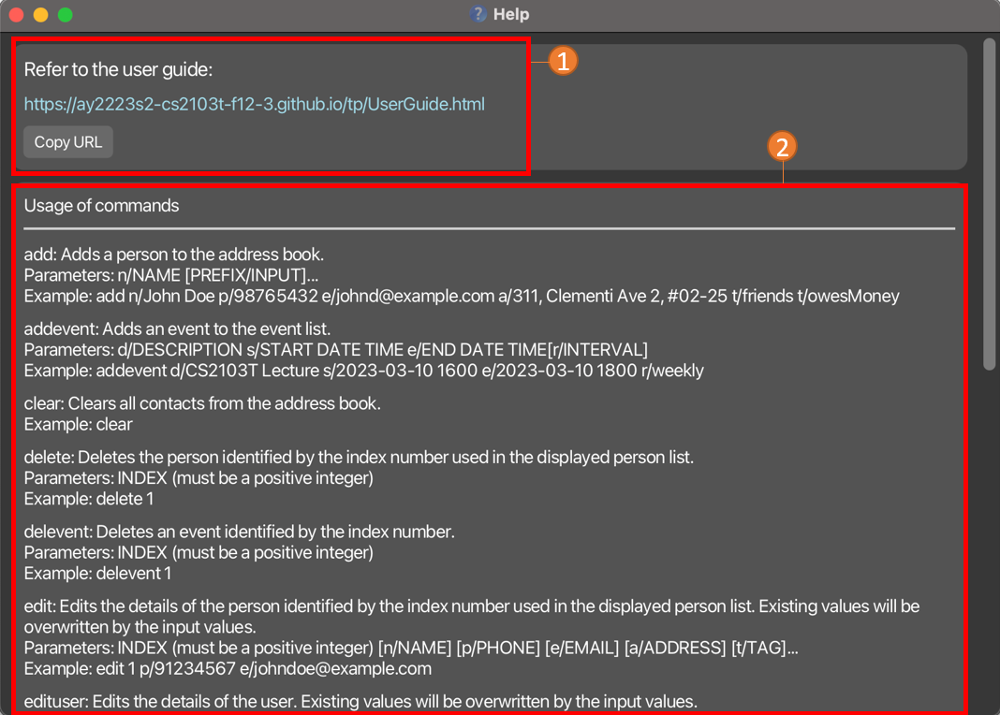

NeoBook is a **desktop app for managing contacts, optimized for use via a Command Line Interface** (CLI) while still having the benefits of a Graphical User Interface (GUI). If you can type fast, it can get your contact management tasks done faster than traditional GUI apps.

Apart from being your all-encompassing address book, NeoBook also has a calendar function for you to keep track of your daily schedule.

## Table Of Contents
* Table of Contents
{:toc}

--------------------------------------------------------------------------------------------------------------------

## Getting started

1. Ensure you have Java `11` or above installed in your Computer.

2. Download the latest `neobook.jar` from [here](https://github.com/AY2223S2-CS2103T-F12-3/tp/releases/tag/v1.2.1).

3. Copy the file to the folder you want to use as the _home folder_ for your NeoBook.

4. Open a command terminal, `cd` into the folder you put the jar file in, and use the `java -jar neobook.jar` command to run the application. 
   A GUI similar to the below should appear in a few seconds. Note how the app contains some sample data. 
   

5. Type the command in the command box and press Enter to execute it. e.g. typing **`help`** and pressing Enter will open the help window. 
   Some example commands you can try:

   * `list` : Lists all contacts.

   * `add n/John Doe p/98765432 e/johnd@example.com a/John street, block 123, #01-01` : Adds a contact named `John Doe` to the Address Book.

   * `delete 3` : Deletes the 3rd contact shown in the current list.

   *  `edit 3 n/pierce` : Edits the 3rd contact's name on the current list to pierce

   * `clear` : Deletes all contacts.

   * `exit` : Exits the app.

6. Refer to the [NeoBook Features](#neobook-features) below for details of each command.

[Back To Contents](#table-of-contents)

--------------------------------------------------------------------------------------------------------------------
## User Interface

1. Use these tabs to toggle between the NeoBook, Events and your own information!

### UI Breakdown For `NeoBook`

1. Current Displayed List
   * show contacts based on command input
   * contains the `index` you should use to refer to each contact
   * A : Contains favorite contacts for easy access
   * B : Contains all contacts
2. Information Of Specific Contact
   * displays all the saved information related to contact
   * toggle between different contacts by _clicking on them in the displayed list_ or using the [select command](#select-contact-to-expand-details--select)
3. Command Results:
   * displays the result of input command
4. Command Line:
   * type command and press enter to execute it
   * refer to the [NeoBook Features](#neobook-features) below for possible commands to execute

### UI Breakdown For `Events`

1. Events Display
   * displays all events you have saved and their respective details
2. Command Results:
   * displays the result of input command
3. Command Line
   * type command and press enter to execute it
   * refer to the [Events Features](#events-features) below for possible commands to execute

### UI Breakdown For `Me`

1. Display
    * contains your personal details

[Back To Contents](#table-of-contents)

____________________________________________________________________________________________________________________
## NeoBook Features

**:information_source: Notes about the command format:** 

* Words in `UPPER_CASE` are the parameters to be supplied by the user. 
  e.g. in `add n/NAME`, `NAME` is a parameter which can be used as `add n/John Doe`.

* Items in square brackets are optional. 
  e.g `n/NAME [t/TAG]` can be used as `n/John Doe t/friend` or as `n/John Doe`.

* Items with `…`​ after them can be used multiple times including zero times. 
  e.g. `t/TAG…​` can be used as ` ` (i.e. 0 times), `t/friend`, `t/friend t/family` etc.

* Parameters can be in any order. 
  e.g. if the command specifies `n/NAME p/PHONE_NUMBER`, `p/PHONE_NUMBER n/NAME` is also acceptable.

* If a parameter is expected only once in the command but you specified it multiple times, only the last occurrence of the parameter will be taken. 
  e.g. if you specify `p/12341234 p/56785678`, only `p/56785678` will be taken.

* Extraneous parameters for commands that do not take in parameters (such as `help`, `list`, `exit` and `clear`) will be ignored. 
  e.g. if the command specifies `help 123`, it will be interpreted as `help`.

### Viewing Help : `help`

Don't know how to get started? Don't worry!

Simply use this command to get access to our help page!

**Syntax:**

`help`

[Back To Contents](#table-of-contents)

### Adding A New Contact: `add`

Met a new friend?

Use this command to add him/her to your NeoBook.

**Syntax:**

`add n/NAME SPECIFIER/INPUT...`

Here are all the specifiers that can be used:

| Specifier | Name of Field                   | Optional? |
|-----------|---------------------------------|-----------|
| n         | Name                            | No        |
| e         | Email address                   | Yes       |
| a         | Address                         | Yes       |
| m         | Major                           | Yes       |
| mt        | Mods Taken                      | Yes       |
| f         | Faculty                         | Yes       |
| g         | Gender                          | Yes       |
| t         | Tags                            | Yes       |
| c         | Preferred Communication Channel | Yes       |
| f         | Faculty                         | Yes       |

:bulb: **Tip:**
A person can have any number of tags and modules taken(including 0).

IMPT: If you want to add multiple tags or modules in one statement,
every tag or module has to have its corresponding specifier.

Only modules that are a part of NUS' mod systems will be allowed. This is
to prevent any messiness and also allows for future syncing with the calendar.

Examples:
* `add n/John Doe p/98765432 e/johnd@example.com a/John street, block 123, #01-01`
* `add n/Betsy Crowe t/friend e/betsycrowe@example.com mt/CS2030s mt/CS2103T`

[Back To Contents](#table-of-contents)

### Listing All Contacts : `list`

Want to see all your contacts?

Use this command to gain access to all of them!

**Syntax:**

`list`

[Back To Contents](#table-of-contents)

### Favourite A Contact : `fav`

Contact someone very frequently?

Use this command to favourite it so that you have easy access to it!

**Syntax:**

`fav INDEX`

_Here are some important requirements for you to take note:_

* `INDEX` refers to the index of the contact you wish to edit in the current displayed list.
  * `INDEX` must be a **positive integer**.

Here's how NeoBook would look like after you favourite a contact!

1. The contact will appear in the `Favourites` section.
2. A :star: will appear next to the index in the detail panel.

[Back To Contents](#table-of-contents)

### Unfavourite A Contact : `unfav`

No longer contact someone as frequently as you used to?

Use this command to unfavourite it!

**Syntax:** `unfav INDEX`

_Here are some important requirements for you to take note:_

* `INDEX` refers to the index of the contact you wish to edit in the current displayed list.
  * `INDEX` must be a **positive integer**.

[Back To Contents](#table-of-contents)

### Editing a contact's details : `edit`

Learnt something new about your friend? Or perhaps he/she changed a particular detail?

Use this command to edit his/her details easily!

**Syntax:**

`edit INDEX SPECIFIER/DATA...`

_Here are some important requirements for you to take note:_

* `INDEX` refers to the index of the contact you wish to edit in the current displayed list.
  * `INDEX` must be a **positive integer**.
* At least one field must be provided.

For the following fields, they are considered a `SuperField`.
* Modules
* Tags

A `SuperField` can contain many inputs in that single field.
When using edit, the command looks for each input in the `SuperField`:
* If the input already exists in the `SuperField` it will be removed.
* Otherwise, the input will be added into the `SuperField`.
  * e.g. `edit mt/CS2103T` removes CS2103T from the Modules field
of a person if it already exists and adds it if it does not.
  
| Specifier | Name of Field                   | Optional? |
|-----------|---------------------------------|-----------|
| n         | name                            | No        |
| e         | Email address                   | Yes       |
| a         | Address                         | Yes       |
| m         | Major                           | Yes       |
| mt        | Mods Taken                      | Yes       |
| f         | Faculty                         | Yes       |
| g         | Gender                          | Yes       |
| t         | Tags                            | Yes       |
| c         | Preferred Communication Channel | Yes       |

Examples:
*  `edit 1 p/91234567 e/johndoe@example.com` Edits the phone number and email address of the 1st person to be `91234567` and `johndoe@example.com` respectively.
*  `edit 2 n/Betsy Crower t/` Edits the name of the 2nd person to be `Betsy Crower` and clears all existing tags.

### Selecting A Particular Contact To View: `select'

Want to see the details of a particular contact?

You can either use your cursor to click on the contact or use this command!

**Syntax:**

`select INDEX`

Here are some important requirements for you to take note:

* `INDEX` refers to the index of the contact you wish to edit in the current displayed list.
    * `INDEX` must be a **positive integer**.

[Back To Contents](#table-of-contents)

### Finding Particular Contacts: `find`

Want to narrow down your displayed contacts to a certain few?

Use this command to find contacts using keywords and fields you specify!

**Syntax:**

`find KEYWORD SPECIFIER/KEYWORDS...`

| Specifier | Name of Field                   | Optional? |
|-----------|---------------------------------|-----------|
| n         | name                            | No        |
| e         | Email address                   | Yes       |
| a         | Address                         | Yes       |
| m         | Major                           | Yes       |
| mt        | Mods Taken                      | Yes       |
| f         | Faculty                         | Yes       |
| g         | Gender                          | Yes       |
| t         | Tags                            | Yes       |
| c         | Preferred Communication Channel | Yes       |

_Here are some important requirements for you to take note:_
* The keywords are case-insensitive.
  * i.e. `find n/Abigail` can return people with names of 'Abigail', 'aBiGail', 'abigail', 'ABIGAIL'.

* For each field specified, as long as one of the keywords is contained
in that field, then the person will be returned.
  * i.e. `find n/John n/Peter James`
    * Can return:
      * people with names of 'John', 'Peter James', 'Peter James John'
    * Cannot return:
      * A person with name of 'Peter'.

* All fields specified must have at least one keyword contained within that
field for that person to be returned.
  * i.e. `find n/Caleb p/9123 p/456`
    * Can return: 
      * A person with a name of 'Caleb' who
has a phone number of '91234567', 
    * Cannot return:
      * A person whose name is 'Caleb' but has
a phone number of '98765432'
      * A person whose name is 'Joshua' even though
his phone number is '91234567'

[Back To Contents](#table-of-contents)

### Select contact to expand details: `select`

Want to see more details about a certain contact in your list?

Use this command to expand and view more information about the selected contact.

**Syntax:**

`select INDEX`

_Here are some important requirements for you to take note:_
* `INDEX` refers to the index of the contact you wish to view more information on.
    * `INDEX` must be a positive integer.

_Examples:_
* `select 1` expands the details of the first contact in your list.
* `select 4` expands the details of the fourth contact in your list.

[Back To Contents](#table-of-contents)

### Deleting A Contact : `delete`

No longer interact with someone in your contacts?

Use this command to delete the specified contact from your NeoBook.

**Syntax:**

`delete INDEX`

_Here are some important requirements for you to take note:_
* `INDEX` refers to the index of the contact you wish to delete in the current displayed list.
  * `INDEX` must be a **positive integer**.

_Examples:_
* `list` followed by `delete 2` deletes the 2nd person in the displayed list.
* `find Betsy` followed by `delete 1` deletes the 1st person in the results of the `find` command.

[Back To Contents](#table-of-contents)

### Clearing all contacts : `clear`

Want to start from a clean slate?

Simply use this command to clear all contacts from your NeoBook.

**Syntax:**

`clear`

[Back To Contents](#table-of-contents)

### Switching between UI tabs: `tab`

Looking for a faster way to switch between NeoBook and the Calendar?

Use this command to navigate to the specified tab.

**Syntax:**

`tab INDEX`

_Here are some important requirements for you to take note:_
* `INDEX` refers to the index of the tab to navigate to, shown before the name in the tab.
  * `INDEX` must be a positive integer.

_Examples:_
* `tab 1` switches to the NeoBook tab.
* `tab 2` switches to the Calendar tab.

[Back To Contents](#table-of-contents)

### Exiting NeoBook : `exit`

Finished what you needed to do?

Use this command to exit the application!

**Syntax:**

`exit`

[Back To Contents](#table-of-contents)

### NeoBook Command Summary

| Action     | Format, Examples                                                                                                                                                      |
|------------|-----------------------------------------------------------------------------------------------------------------------------------------------------------------------|
| **Add**    | `add n/NAME p/PHONE_NUMBER e/EMAIL a/ADDRESS [t/TAG]…​`   e.g., `add n/James Ho p/22224444 e/jamesho@example.com a/123, Clementi Rd, 1234665 t/friend t/colleague` |
| **Clear**  | `clear`                                                                                                                                                               |
| **Delete** | `delete INDEX`  e.g., `delete 3`                                                                                                                                   |
| **Edit**   | `edit INDEX [n/NAME] [p/PHONE_NUMBER] [e/EMAIL] [a/ADDRESS] [t/TAG]…​`  e.g.,`edit 2 n/James Lee e/jameslee@example.com`                                           |
| **Fav**    | `fav INDEX`  e.g., `fav 2`                                                                                                                                         |
| **Unfav**  | `unfav INDEX`  e.g., `unfav 2`                                                                                                                                     |
| **Select** | `select INDEX`  e.g., `select 2`                                                                                                                                   |
| **Find**   | `find KEYWORD [MORE_KEYWORDS]`  e.g., `find James Jake`                                                                                                            |
| **List**   | `list`                                                                                                                                                                |
| **Help**   | `help`                                                                                                                                                                |
| **Tab**    | `tab INDEX`  e.g., `tab 2`                                                                                                                                         |
| **Exit**   | `exit`                                                                                                                                                                |

[Back To Contents](#table-of-contents)

--------------------------------------------------------------------------------------------------------------------

## Events Features

### Adding an Event : `addevent`

Want to keep track of current events?

Use this command to add events into your Event Section of your NeoBook.

Moreover, you can add 2 types of Events:
1. One Time Events
2. Recurring Events (of various Intervals):
    * Daily Events
    * Weekly Events
    * Monthly Events
    * Yearly Events

You can specify the Recurrence Intervals within the Command as well!

Accepted Intervals:
1. None
2. Daily
3. Weekly
4. Monthly
5. Yearly

**Syntax:**

`addevent d/DESCRIPTION OF EVENT s/START DATE & START TIME e/END DATE & END TIME r/INTERVAL OF RECURRENCE`

_Here are some important requirements for you to take note:_

* `START DATE & START TIME` and `END DATE & END TIME` must follow this formatting YYYY-MM-DD HHMM.
    * `START TIME` and `END TIME` follows the 24-Hour Clock format e.g. instead of 6:00pm, you must enter 1800.
    * `START DATE & START TIME` must be before `END DATE & END TIME`
* `INTERVAL OF RECURRENCE` doesn't need to be specified to add an event
    *  Event will be automatically added as a `One Time Event`.

_Examples:_
* `addevent d/CS2103T Lecture s/2023-03-30 1600 e/2023-03-30 1800 r/weekly` will add a Weekly Recurring Event of CS2103T Lecture that occurs from 1600 to 1800, starting on 2023-03-30.
* `addevent d/Catchup with John s/2023-03-30 1600 e/2023-03-30 1800 r/None` will add a One Time Event of Catchup with John that occurs from 1600 to 1800, on 2023-03-30.
* `addevent d/Dinner with Family s/2023-03-30 1600 e/2023-03-30 1800` will add a One Time Event of Dinner with Family that occurs from 1600 to 1800, on 2023-03-30.

| Specifier | Name of Field                 | Optional? |
|-----------|-------------------------------|-----------|
| d         | Description of Event          | No        |
| s         | Start Date and Time of Event  | No        |
| e         | End Date and Time of Event    | No        |
| r         | Recurrence Interval           | Yes       |
>>>>>>> 6c2571badb8299bcb80616959f5499a70671b8df

[Back To Contents](#table-of-contents)

### Deleting An Event : `delevent`

You no longer need to track this particular event?

Use this command to delete the specified event from your NeoBook.

**Syntax:**

`delevent INDEX`

_Here are some important requirements for you to take note:_
* `INDEX` refers to the index of the Event you wish to delete in the current displayed Events List.
    * `INDEX` must be a **positive integer**.

_Examples:_
* `delevent 2` deletes the event tagged to Index 2 in your NeoBook's Event List.

[Back To Contents](#table-of-contents)

### Tagging Contacts to an Event: `tagpersonevent`

Want to remember who was a part of a certain event? 

Tag their contacts
to the event using this command!

**Syntax:**

`tagpersonevent et/EVENT INDEX pt/NAME`

_Here are some important requirements for you to take note:_
* The EVENT INDEX is the index of the event you want to tag the person to.
* NAME is the name of the person you want to tag to the event.
  * NAME is **case_sensitive**.
  * NAME must be the name of a contact already registered in NeoBook

_For more advanced users_
* Be careful when directly editing the tagged contacts in `userdata.json`.
It may cause the person to become unlinked from the event completely.

[Back To Contents](#table-of-contents)

### Untagging Contacts from an Event: `untagpersonevent`

Want to remove somebody who was a part of a certain event?

Untag their contacts from the event using this command!

**Syntax:**

`untagpersonevent et/EVENT INDEX pt/NAME`

_Here are some important requirements for you to take note:_
* The EVENT INDEX is the index of the event you want to tag the person to.
* NAME is the name of the person you want to tag to the event.
    * NAME is **case_sensitive**.
    * NAME must be the name of a contact already registered in NeoBook and
tagged to that event.

_For more advanced users_
* Be careful when directly editing the tagged contacts in `userdata.json`.
  It may cause the person to become unlinked from the event completely.

[Back To Contents](#table-of-contents)

### Events Command Summary

| Action                     | Format, Examples                                                                                                                                                                                |
|----------------------------|-------------------------------------------------------------------------------------------------------------------------------------------------------------------------------------------------|
| **Add Event**              | `addevent d/DESCRIPTION OF EVENT s/START DATE & START TIME e/END DATE & END TIME r/INTERVAL OF RECURRENCE`   e.g., `addevent d/CS2103T Lecture s/2023-03-30 1600 e/2023-03-30 1800 r/weekly` |   
| **Delete Event**           | `delevent INDEX`   e,g., `delevent 1`                                                                                                                                                       |
| **Tag Contact to Event**   | `tagpersonevent et/EVENT INDEX pt/NAME` e.g., `tagpersonevent et/1 pt/John`                                                                                                                     |
| **Untag Contact to Event** | `untagpersonevent et/EVENT INDEX pt/NAME`   e.g.,`untagpersonevent et/1 pt/John`                                                                                                             |

--------------------------------------------------------------------------------------------------------------------
## UI Features

### Light Mode: `light`

Want to use a brighter version of our UI?

Use Light mode!

**Syntax:**

`light`

### Dark Mode: `dark`

Want to use a darker version of our UI?

Use Dark mode!

**Syntax:**

`dark`

--------------------------------------------------------------------------------------------------------------------
## Data

### Saving the data

NeoBook data are saved in the hard disk automatically after any command that changes the data. There is no need for you to save manually.

### Editing the data file

NeoBook data are saved as JSON files. Two of which will be of interest to you:
- `[JAR file location]/data/addressbook.json`.
- `[JAR file location]/data/userdata.json`.

You are welcome to update the data directly by editing that data file.

:exclamation: **Caution:**
If you edit the taggedPerson in User data, beware that you may end up unlinking the person from any changes to the original contact in NeoBook

:exclamation: **Caution:**
If your changes to the data file makes its format invalid, AddressBook Neo will discard all data and start with an empty data file at the next run.

[Back To Contents](#table-of-contents)

--------------------------------------------------------------------------------------------------------------------
## FAQ

**Q**: How do I transfer my data to another Computer? 
**A**: Install the app in the other computer and overwrite the empty data file it creates with the file that contains the data of your previous NeoBook home folder.

[Back To Contents](#table-of-contents)

--------------------------------------------------------------------------------------------------------------------
