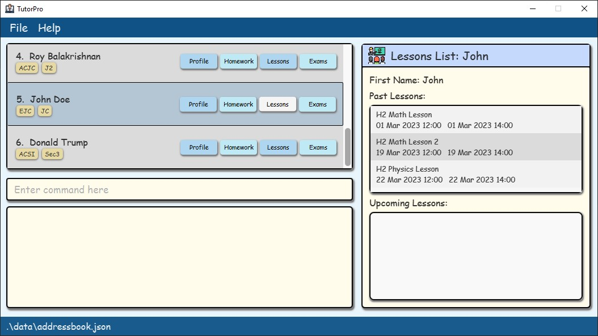
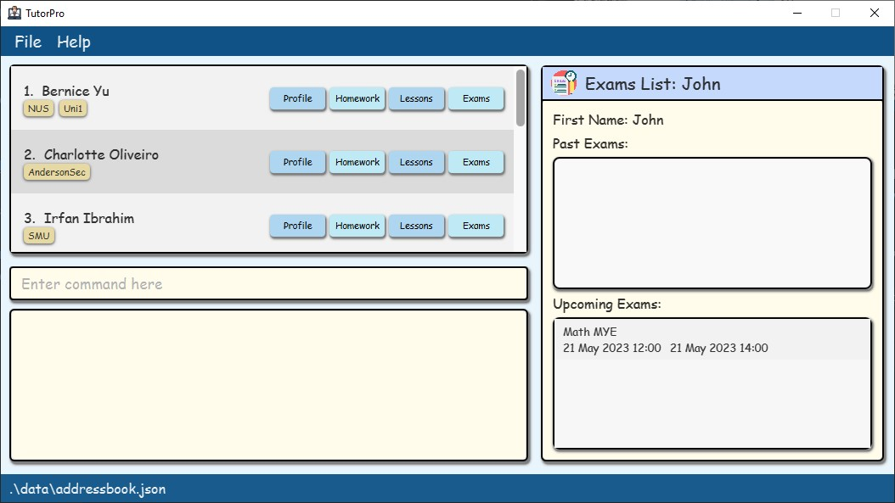
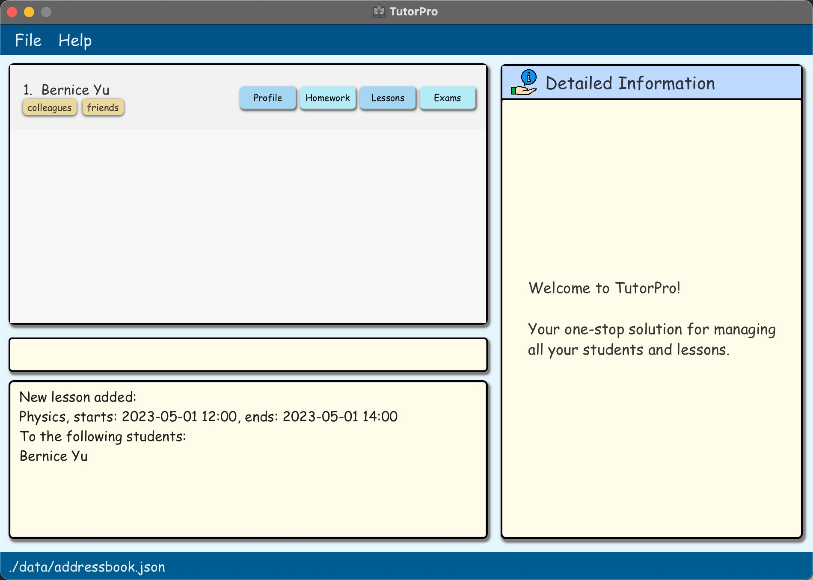
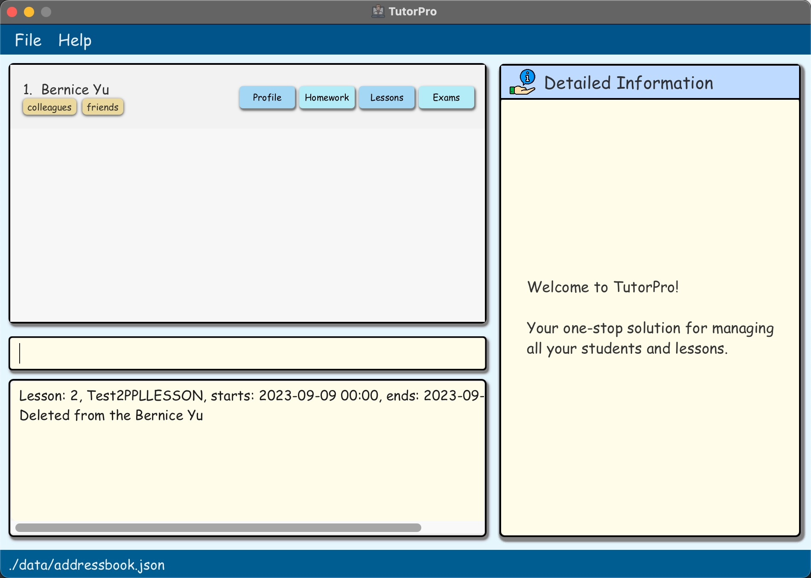
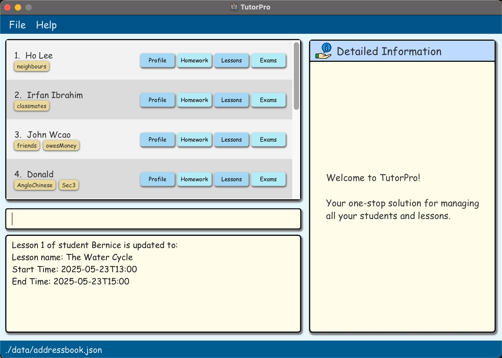

TutorPro is a **desktop app designed to help private tutors manage their student information effectively**. With TutorPro, tutors can easily keep track of their students' addresses, contact details, lessons, homework, and progress, all in one place. This app is optimized for use via a Graphical User Interface (GUI), allowing tutors to interact with the app using easy-to-understand buttons and menus. However, TutorPro also provides a Command Line Interface (CLI) for those who prefer a faster way of getting things done. Whether you're managing a handful of students or hundreds, TutorPro can help you streamline your workflow and make your tutoring experience more efficient.

--------------------------------------------------------------------------------------------------------------------
## Table of Contents

- [Table of Contents](#table-of-contents)
- [Quick start](#quick-start)
  * [Glossary](#glossary)
- [GUI](#gui)
  * [Quick Access Buttons and Detailed Information Section](#quick-access-buttons-and-detailed-information-section)
    + [Profile Page](#profile-page)
    + [Homework Page](#homework-page)
    + [Lessons Page](#lessons-page)
    + [Exams Page](#exams-page)
- [Commands](#commands)
  * [How to interpret the Command format](#how-to-interpret-the-command-format)
  * [Search by Name Mechanism](#search-by-name-mechanism)
  * [Profile Commands](#profile-commands)
    + [Create a new student profile](#create-a-new-student-profile)
    + [Update Student Information](#update-student-information)
  * [Homework Commands](#homework-commands)
    + [Assign Homework to a Student](#assign-homework-to-a-student)
    + [View the Homework of Students](#view-the-homework-of-students)
    + [Delete Homework from a Student](#delete-homework-from-a-student)
    + [Mark the Homework of a Student as Done](#mark-the-homework-of-a-student-as-done)
    + [Unmark Homework of a Student as Undone](#unmark-homework-of-a-student-as-undone)
    + [Update Homework of a Student](#update-homework-of-a-student)
  * [Lessons Commands](#lessons-commands)
    + [Create a New Lesson Plan for the Upcoming Lesson](#create-a-new-lesson-plan-for-the-upcoming-lesson)
    + [View Lessons](#view-lessons)
    + [Delete a Lesson from a student](#delete-a-lesson-from-a-student)
    + [Update a Lesson](#update-a-lesson)
  * [Exams Commands](#exams-commands)
    + [Add an Exam to be tracked](#add-an-exam-to-be-tracked)
    + [Remove an exam](#remove-an-exam)
    + [View exams tracked by TutorPro](#view-exams-tracked-by-tutorpro)
    + [Edit exam details](#edit-exam-details)
- [FAQ](#faq)
- [Summary](#summary)
  * [List of Commands](#list-of-commands)
  * [List of Prefixes](#list-of-prefixes)
  * [Supported date-time formats](#supported-date-time-formats)

<small><i><a href='http://ecotrust-canada.github.io/markdown-toc/'>Table of contents generated with markdown-toc</a></i></small>

--------------------------------------------------------------------------------------------------------------------

## Quick start

1. Ensure you have Java `11` or above installed on your Computer.

2. Download the latest `TutorPro.jar` from [here](https://github.com/AY2223S2-CS2103T-W13-4/tp/releases).

3. Copy the file to the folder you want to use as the _home folder_ for your address book.

4. Open a command terminal, `cd` into the folder in which you put the jar file, and use the `java -jar TutorPro.jar` command to run the application. 
   A GUI similar to the one below should appear in a few seconds. Note how the app contains some sample data. 
   

5. Type the command in the command box and press Enter to execute it. e.g. typing **`help`** and pressing Enter will open the help window. 

6. Refer to the [Commands](#commands) below for details of each command.

--------------------------------------------------------------------------------------------------------------------
### Glossary

You may come across some terms you don't understand in the user guide.
The following table provides clarification of the terms commonly used in TutorPro.

|       Term       | Description                                                                                                                                                                                                         |
|:----------------:|---------------------------------------------------------------------------------------------------------------------------------------------------------------------------------------------------------------------|
| **Alphanumeric** | Digits and letters only. For example, `AB3`, `TutorPro`, `coco123`, and `2103` are alphanumeric. `#01-04`, `email@domain.com`, and `white    spaces` are not.                                                       |
|  **Attribute**   | Words that follow prefixes to describe properties, states, characteristics, and traits. Examples are price, weight, name, and order status.                                                                         |
|   **Command**    | A command is a specific instruction you can give to TutorPro to perform an action. You can view the list of commands available [here](#list-of-commands).                                                           |
|     **CLI**      | Command-Line Interface (CLI) receives commands from a user in the form of lines of text. It refers to the input text box in this context.                                                                           |
|     **GUI**      | GUI stands for Graphical User Interface. It refers to the display window of the TutorPro application.                                                                                                               |
|    **Index**     | The index of the contact or item in the display list for contacts/items.                                                                                                                                            |
|   **Integer**    | Whole number                                                                                                                                                                                                        |
|  **Parameter**   | A parameter refers to the information you need to give to your command such that it can execute an action based on that information.                                                                                |
|    **Prefix**    | A prefix indicates the kind of information you are keying in. You can view the list of prefixes available [here](#list-of-prefixes).                                                                                |
|  **Whitespace**  | An empty character, or a placeholder character.                                                                                                                                                                     |
|   **Student**    | A `Student` whom the user (who is a tutor) teaches                                                                                                                                                                  |
|   **Homework**   | A `Homework` assignment whom the user (who is a tutor) has assigned to a `Student`                                                                                                                                  |
|    **Lesson**    | A `Lesson` that the user has scheduled with a `Student`                                                                                                                                                             |
|     **Exam**     | An `Exam` that a Student is scheduled to sit for                                                                                                                                                                    |

--------------------------------------------------------------------------------------------------------------------
## GUI
When you first run the app, you may see a display window pop up similar to the one below. We call this window the **Main Window**. 

* The **Command Box** on the left bottom refers to the text field where you can type in all your commands.
* The **Display List for Students** on the left top refers to the section where all the students are displayed.
* The **Detailed Information Section** on the right refers to the section where more specific information of the profile, homework, lessons, or exams of a particular student is displayed.

You may enter the following commands in the Command Box to see how the Display List changes:
* `list` lists all students.
* `delete 1` deletes the student with index 1.
* `view-homework` displays all the homework from all students.

You may also click the quick access buttons one each student card to see how the Detailed Information Section changes.
      
### Quick Access Buttons and Detailed Information Section
Upon launching the application or executing a command, a welcome page will be displayed in the Detailed Information Section. 
Each Student card has four buttons, which are profile, homework, lessons, and exams. When a user clicks on any of the buttons, the corresponding information will be presented in the Detailed Information Section.

#### Profile Page
Upon clicking the Profile Button, the Detailed Information section will be refreshed and show the detailed particulars of the student, including the student's full name, phone number, address, and email.

#### Homework Page

Upon clicking the Profile Button, the Detailed Information section will be refreshed and show the detailed homework information of the student. 

It includes a homework list, showing all the homework information.
The icon on the left of each homework represents its status,
with the tick icon being `completed` and the cross-icon being `pending`.
It also has a pie chart which represents a ratio between completed and pending homework.

#### Lessons Page

Upon clicking the Lesson Button,
the Detailed Information section will be refreshed and show the detailed Lessons Information for the student.

It includes a past lessons list, showing all the past lesson information and an upcoming lessons list,
showing all the upcoming lessons.

:bulb: **Tip:** Lesson Lists do not have indexes to avoid confusion with the indexes of the lessons in the original list.
If you want to see the index of the lessons in the list,
you can use the `view-lessons` command to view the list of lessons.

:bulb: **Tip:** This page only shows the most basic information of the lessons. If you want to see more details of the lessons, you can use the `view-lessons` command to view the list of lessons.

#### Exams Page

Upon clicking the Exam Button,
the Detailed Information section will be refreshed and show the detailed Exams Information for the student.

It includes a past exams list, showing all the past exams information and all the upcoming exams list,
showing all the upcoming exams. 

:bulb: **Tip:** Exam Lists do not have indexes to avoid confusion with the indexes of the exams in the original list.
If you want to see the index of the exams in the list,
you can use the `view-exams` command to view the list of exams.

:bulb: **Tip:** This page only shows the most basic information of the exams. If you want to see more details of the exams, you can use the `view-exams` command to view the list of exams.

## Commands

### How to interpret the Command format

* The terms in `UPPER_CASE` are placeholders need to replace with your n values. For example, in the command `new-student name/NAME`, `NAME` is a placeholder that can be substituted with a specific name, such as `new-student n/John Doe`.
* Items with `…`​ after them can be used multiple times including zero times. 
  e.g. `[name/STUDENT_NAME]…​` can be used as ` ` (i.e. 0 times), `name/John Doe`, `name/John Doe name/Jane Doe` etc.
* Extraneous parameters for commands that don't take in parameters
  (such as `help`, `exit,` and `clear`) will be ignored. 
  e.g. if the command specifies `help 123`, it will be interpreted as `help`.
* Unless otherwise specified, the order of prefixes doesn't matter. 
  e.g. if the command specifies `name/NAME phone/PHONE_NUMBER`, `phone/PHONE_NUMBER name/NAME` is also acceptable unless stated otherwise in a particular command.
* Parameters can be in any order.
* TutorPro allows you to execute commands on students in the entire student list, instead of just the displayed list. 
  For example: 
  - currently, the displaying list only shows one student, `Bernice Yu`.
    
    
  - However, you can still execute commands to `John Doe` even though he is not displayed in the list.
    
    
  - This is because `John Doe` is in the original student list, and the command will be executed on the original student list.
      
  - 
    
### Search by Name Mechanism

* TutorPro uses Students' Names as primary keys to identify students.
* Most of the commands (except) in TutorPro allow you to search for a student by name, rather than by index, which is more intuitive for the user and eliminates the need to remember the index of the student.
* Therefore, duplicate names are not allowed. Names that are substrings of other names or vice versa are not allowed. For example, `John Doe` and `John` are not allowed. If you have students with the exact name, say `John Doe`, you can add a number to the end of the name to differentiate them. For example, `John Doe 1` and `John Doe 2`.
* The search by name mechanism is case-insensitive, meaning that the search will be case-insensitive. For Example, `john doe` and `John Doe` will be treated as the same name.
* Partial names can be used as well. For example, `doe` will return all students with the name `John Doe` and `Jane Doe`.

### Profile Commands

#### Create a new student profile

Creates a new profile for a student given the student’s name.

Format: `new-student [name/STUDENT_NAME] [address/STUDENT_ADDRESS] [phone/PHONE] [email/EMAIL] [school/SCHOOL] [level/GRADE_LEVEL]`

Example:
`new-student name/John Doe address/21 Prince George’s Park email/jdoe@gmail.com phone/12345678 school/ACJC level/sec8`

* SCHOOL and GRADE_LEVEL are optional.
* SCHOOL and GRADE_LEVEL consist of numbers and letters only (no symbols or spaces).

#### Update Student Information

Updates the student's information given the student's label, field to change, and updated field value 

Format: `update-info [name/STUDENT_NAME] [f/FIELD] [v/VALUE]`

* if any parameters are missing in order, the command will display potential parameter options.
* The available field parameters are “Address”, “School”, and “Level”.

Examples:
* `update-info` Displays a list of all available student profiles
* `update-info name/John` Displays all students with the name “John” and prompts the user for clarification
* `update-info name/John f/address` Displays the value stored in the Address Field and prompts the user for a new Address.
* `update-info name/John f/address v/Block 123 #12-34` Updates student info and displays the new value to the user.

### Homework Commands
#### Assign Homework to a Student

Create a homework assignment with a deadline for a student

Format: `new-homework [name/STUDENT_NAME] [homework/HOMEWORK_NAME] [deadline/DEADLINE]`

* The `STUDENT_NAME` must be an existing student of the tutor.
* The `DEADLINE` must be in the format given in the support date and time formats' appendix.
* The `DEADLINE` must be in the future.

Examples:
* `new-homework name/John homework/listening comprehension ex1 deadline/2023-05-30 2359` adds the assignment `listening comprehension ex1` to the student named `John. The deadline is 02 Dec 2023 at 23:25.
* `new-homework name/Donald homework/english essay deadline/2023-05-14 2359` adds the assignment `English Essay` to the student named `Donald`. The deadline is 14 May 2023 at 23:59.
* `new-homework name/Kai Ze homework/math ex1 deadline/2023-05-23 2359` adds the assignment `math ex1` to the student named `Kai Ze`. The deadline is 23 May 2023 at 23:59.

:bulb: **Tip:** You can use the `view-homework` command to view the list of homework the student currently has.

:bulb: **Tip:** You can view the supported date and time formats [here](#supported-date-time-formats).

:exclamation: **Caution:** STUDENT_NAME is case-insensitive and supports partial matching.
For example, `john` will match `John Doe` and `john doe`. You can refer to the [search by name mechanism](#search-by-name-mechanism) for more details.

:exclamation: **Caution:** STUDENT_NAME, HOMEWORK_INDEX,
and DEADLINE should all only appear at most once and should not be empty.

:exclamation: **Caution:** A student can have multiple homework with the same name,
even if they have different deadlines.

#### View the Homework of Students

Displays a list of homework with the ability to filter by student name and homework status.

Format: `view-homework [name/STUDENT_NAME]... [status/STATUS]`

* By default, all homework will be displayed if no name or status parameter is provided.
* To view homework for specific students, specify the name using `name/STUDENT_NAME`s.
* To view homework with a specific status, specify the status using `status/STATUS`.
* It is possible to filter by both student name and status simultaneously.
* The available status values are `completed` and `pending`.

Examples:
* `view-homework` displays a list of all homework.
* `view-homework name/John` displays homework for a student named `John`.
* `view-homework status/completed` displays all completed homework from all students.
* `view-homework name/John status/pending` displays pending homework for a student named `John`.

:exclamation: **Caution:** STUDENT_NAME is case-insensitive and supports partial matching.
For example, `john` will match `John Doe` and `john doe`. You can refer to the [search by name mechanism](#search-by-name-mechanism) for more details.

:exclamation: **Caution:** STATUS should only appear at most once and should not be empty.
STUDENT_NAME can be zero or multiple, but they all can't be empty.

#### Delete Homework from a Student

Deletes a homework assignment for a student.

Format: `delete-homework [name/STUDENT_NAME] [index/HOMEWORK_INDEX]`

* The `STUDENT_NAME` must be an existing student of the tutor. Note that there can only be one student's name.
* The `HOMEWORK_INDEX` must be the index of an existing homework assignment for the specified student.
* A success message will be displayed if the homework assignment is successfully deleted. Otherwise, an error message will be displayed.

Examples:

* `delete-homework name/John index/1` deletes the first homework assignment for the student named John.
* `delete-homework name/Susan index/3` deletes the third homework assignment for the student named Susan.

:bulb: **Tip:** You can use the `view-homework` command to view the list of homework the student currently has.

:exclamation: **Caution:** STUDENT_NAME is case-insensitive and supports partial matching.
For example, `john` will match `John Doe` and `john doe`. You can refer to the [search by name mechanism](#search-by-name-mechanism) for more details.

:exclamation: **Caution:** STUDENT_NAME, and HOMEWORK_INDEX should all only appear at most once and should not be empty.

#### Mark the Homework of a Student as Done

Marks homework of a student as done.

Format: `mark-homework [name/STUDENT_NAME] [index/HOMEWORK_INDEX]`

* The `STUDENT_NAME` must be an existing student of the tutor. Note that there can only be one student's name.
* The `HOMEWORK_INDEX` must be the index of an existing homework assignment for the specified student.
* A success message will be displayed if the homework assignment is successfully deleted. Otherwise, an error message will be displayed.

Examples:

* `mark-homework name/John index/1` marks the first homework assignment for the student named John.
* `mark-homework name/Susan index/3` marks the third homework assignment for the student named Susan.

:exclamation: **Caution:** STUDENT_NAME is case-insensitive and supports partial matching.
For example, `john` will match `John Doe` and `john doe`. You can refer to the [search by name mechanism](#search-by-name-mechanism) for more details.

:exclamation: **Caution:** STUDENT_NAME, and HOMEWORK_INDEX should all only appear at most once and should not be empty.

#### Unmark Homework of a Student as Undone

Marks homework of a student as undone.

Format: `unmark-homework [name/STUDENT_NAME] [index/HOMEWORK_INDEX]`

* The `STUDENT_NAME` must be an existing student of the tutor. Note that there can only be one student's name.
* The `HOMEWORK_INDEX` must be the index of an existing homework assignment for the specified student.
* A success message will be displayed if the homework assignment is successfully deleted. Otherwise, an error message will be displayed.

Examples:

* `unmark-homework name/John index/1`unmarks the first homework assignment for the student named John.
* `unmark-homework name/Susan index/3` unmarks the third homework assignment for the student named Susan.

:exclamation: **Caution:** STUDENT_NAME is case-insensitive and supports partial matching.
For example, `john` will match `John Doe` and `john doe`. You can refer to the [search by name mechanism](#search-by-name-mechanism) for more details.

:exclamation: **Caution:** STUDENT_NAME, and HOMEWORK_INDEX should all only appear at most once and should not be empty.

#### Update Homework of a Student

Updates the information on homework of a student

Format: `update-homework [name/STUDENT_NAME] [index/HOMEWORK_INDEX] [homework/HOMEWORK_NAME] [deadline/DEADLINE]`

* The `STUDENT_NAME` must be an existing student of the tutor. Note that there can only be one student's name.
* The `HOMEWORK_INDEX` must be the index of an existing homework assignment for the specified student.
* The `DEADLINE` must be in the format given in the support date and time formats' appendix.
* The `DEADLINE` must be in the future.
* At least one of homework names and deadline must be in the command. They can't be absent concurrently.
* A success message will be displayed if the homework assignment is successfully deleted. Otherwise, an error message will be displayed.

Examples:

* `update-homework name/John index/1 homework/Math Assignment 1` updates the name of homework 1 of John to be `Math Assignment 1`.
* `updates-homework name/Susan index/3 deadline/2023-05-12 23:59` updates the deadline of homework 3 of Susan to be `2023-05-12 23:59`.
* `updates-homework name/Donald index/2 homework/Math Assignment 1 deadline/2023-05-12 23:59` updates the name of homework 2 of Donald to be `Math Assignment 1` and updates the deadline of homework 2 of Donald to be `2023-05-12 23:59`.

:bulb: **Tip:** You can use the `view-homework` command to view the list of homework the student currently has.

:bulb: **Tip:** You can view the supported date and time formats [here](#supported-date-time-formats).

:exclamation: **Caution:** STUDENT_NAME is case-insensitive and supports partial matching.
For example, `john` will match `John Doe` and `john doe`. You can refer to the [search by name mechanism](#search-by-name-mechanism) for more details.

:exclamation:  **Caution:** STUDENT_NAME, HOMEWORK_INDEX,
and DEADLINE should all only appear at most once and should not be empty.

:exclamation: **Caution:** A student can have multiple homework with the same name,
even if they have different deadlines.

### Lessons Commands

#### Create a New Lesson Plan for the Upcoming Lesson

Creates a new lesson for a given student, with a lesson title and time.

Format: `new-lesson [name/STUDENT_NAME] [lesson/LESSON_TITLE] [start/START_TIME] [end/END_TIME]`

* The `STUDENT_NAME` must be an existing student of the tutor.
* The `START_TIME` and `END_TIME` must be in the format given in the support date and time formats' appendix.
* `START_TIME` must be before `END_TIME`, and their difference must be at least 30 minutes and at most 3 hours.
* `START_TIME` and `END_TIME` must be in the future.
* A success message will be displayed if the lesson is successfully created. Otherwise, an error message will be displayed.

Examples:
* `new-lesson name/John Doe lesson/The Water Cycle start/2025-03-23 1300 end/2025-03-23 1500` creates a new lesson for the student named `John Doe` with the lesson title `The Water Cycle` starting at `2025 Mar 2023 13:00` and ending at `2025 Mar 2023 15:00`.
* `new-lesson name/Bernice Yu lesson/Photosynthesis start/2025-03-23 1300 end/2025-03-23 1500` creates a new lesson for the student named `Bernice Yu` with the lesson title `Photosynthesis` starting at `2025 Mar 2023 13:00` and ending at `2025 Mar 2023 15:00`.
* `new-lesson name/David Li lesson/Metamorphic Rocks start/2025-03-23 1300 end/2025-03-23 1500` creates a new lesson for the student named `David Li` with the lesson title `Metamorphic Rocks` starting at `2025 Mar 2023 13:00` and ending at `2025 Mar 2023 15:00`.

:bulb: **Tip:** You can use the `view-lesson` command to view the list of lessons the student currently has.

:bulb: **Tip:** You can view the supported date and time formats [here](#supported-date-time-formats).

:exclamation: **Caution:** STUDENT_NAME is case-insensitive and supports partial matching.
For example, `john` will match `John Doe` and `john doe`. You can refer to the [search by name mechanism](#search-by-name-mechanism) for more details.

:exclamation: **Caution:** STUDENT_NAME, LESSON_TITLE, START_TIME, and END_TIME should all appear exactly once and should not be empty.

:exclamation: **Caution:** A student can have multiple lessons with the same lesson title, even if they have different start and end times.

#### View Lessons

Displays the lessons for a given student/all students.

Format: `view-lesson (optional)[name/STUDENT_NAME] (optional)[subject/SUBJECT] (optional)[date/DATE] (optional)[done/DONE]`

* By default, the lessons for all the tutor’s students will be displayed if no parameters are specified.
* To view the lessons for specific students, specify the names using `name/STUDENT_NAME`s.
* To view the lessons for a specific subject, specify the subject using `subject/SUBJECT`.
* To view the lessons for a specific date, specify the date using `date/DATE`.
* To view the lessons that have been completed, include `done/done`.
* To view the lessons that have not been completed, include `done/not done`.

Examples:
* `view-lesson` Displays the lesson history for all the tutor’s students.
* `view-lesson name/John` Displays the lesson history for the student named John.
* `view-lesson name/John subject/Math date/2023-05-03` Displays the lessons for student John, which are of subject Math, on the day 2023-05-03.
* `view-lesson done/done` Displays all lessons that have been completed
* `view-lesson done/not done` Displays all lessons that have not been completed
* `view-lesson name/John done/done` Displays all lessons that have been completed for student John
* `view-lesson name/John name/Bernice done/not done` Displays all lessons that have not been completed for students John and Bernice

:exclamation: **Caution:** STUDENT_NAME is case-insensitive and supports partial matching.
For example, `john` will match `John Doe` and `john doe`. You can refer to the [search by name mechanism](#search-by-name-mechanism) for more details.

:exclamation: **Caution:** SUBJECT, DATE, and DONE should all only appear at most once and should not be empty.
STUDENT_NAME can appear multiple times, but none should empty.

#### Delete a Lesson from a student
Deletes a lesson for a given student.

Format: `delete-lesson [name/STUDENT_NAME] [index/LESSON_INDEX]`

* The `STUDENT_NAME` must be an existing student of the tutor. Note that there can only be one student's name.
* The `LESSON_INDEX` must be a positive integer that is within the range of the student's lesson list.
* A success message will be displayed if the lesson is successfully deleted. Otherwise, an error message will be displayed.

Example:
* `delete-lesson name/John Doe index/1` deletes the first lesson for the student named John Doe.
* `delete-lesson name/Bernice Yu index/2` deletes the second lesson for the student named Bernice Yu.

:bulb: **Tip:** You can use the `view-lesson` command to view the list of lessons the student currently has.

:exclamation: **Caution:** STUDENT_NAME is case-insensitive and supports partial matching.
For example, `john` will match `John Doe` and `john doe`. You can refer to the [search by name mechanism](#search-by-name-mechanism) for more details.

:exclamation: **Caution:** STUDENT_NAME and LESSON_INDEX should all appear exactly once and should not be empty.

#### Update a Lesson
Updates a lesson for a given student. This includes the lesson title, start time, and/or end time.

Format: `update-lesson [name/STUDENT_NAME] [index/LESSON_INDEX] (optional)[lesson/LESSON_TITLE] (optional)[start/START_TIME] (optional)[end/END_TIME]`

* The `STUDENT_NAME` must be an existing student of the tutor. Note that there can only be one student's name.
* The `LESSON_INDEX` must be a positive integer that is within the range of the student's lesson list.
* At least one of the optional parameters must be provided.
* The `START_TIME`, and `END_TIME` provided must be in any of the supported date-time formats (see appendix).
* The provided `START_TIME` must be before the provided `END_TIME`, or, if the `END_TIME` is not provided, it must be before the original end time of the lesson.
* The provided `END_TIME` must be after the provided `START_TIME`, or, if the `START_TIME` is not provided, it must be after the original start time of the lesson.
* The updated lesson's duration must be at least 30 minutes and at most 3 hours.
* A success message will be displayed if the lesson is successfully updated. Otherwise, an error message will be displayed.

Example:
* `update-lesson name/John Doe index/1 lesson/The Water Cycle start/2025-03-23 1300 end/2025-03-23 1500` updates the first lesson for the student named John Doe to have the lesson title "The Water Cycle", start time "2025-03-23 1300", and end time "2025-03-23 1500".
* `update-lesson name/Bernice Yu index/2 lesson/Photosynthesis` updates the second lesson for the student named Bernice Yu to have the lesson title "Photosynthesis".
* `update-lesson name/John Doe index/1 start/2025-03-23 1300` updates the first lesson for the student named John Doe to have the start time "2025-03-23 1300".
* `update-lesson name/Bernice Yu index/2 end/2025-03-23 1500` updates the second lesson for the student named Bernice Yu to have the end time "2025-03-23 1500".

:bulb: **Tip:** You can use the `view-lesson` command to view the list of lessons the student currently has.

:bulb: **Tip:** You can view the supported date and time formats [here](#supported-date-and-time-formats).

:exclamation: **Caution:** STUDENT_NAME is case-insensitive and supports partial matching.
For example, `john` will match `John Doe` and `john doe`. You can refer to the [search by name mechanism](#search-by-name-mechanism) for more details.

:exclamation: **Caution:** STUDENT_NAME, LESSON_INDEX should appear exactly once and should not be empty.

:exclamation: **Caution:** LESSON_TITLE, START_TIME, and END_TIME should appear at most once and should not be empty.

### Exams Commands

#### Add an Exam to be tracked

Create an Exam within TutorPro to be tracked for a given student.

Format: `new-exam [name/STUDENT_NAME_1] (optional)[name/STUDENT_NAME_2].. [exam/EXAM_NAME] [start/START_TIME] 
[end/END_TIME] (optional)[weightage/WEIGHTAGE] (optional)[grade/GRADE]`

* Creates an exam that is attributed to one or more students.
* At least one student name must be provided.
* `START_TIME` and `END_TIME` provided must be in any of the supported date-time formats (see appendix).
* the format of `GRADE` should be `grade/ACTUAL_SCORE/TOTAL_SCORE`

Examples:
* `new-exam name/John Doe exam/Math MYE start/2023-05-21 12:00 end/2023-05-21 14:00`
* `new-exam name/John Doe name/Faye Doe exam/Science MYE start/2023-05-22 12:00 end/2023-05-22 14:00`

#### Remove an exam

Format: `delete-exam [name/STUDENT_NAME_1] (optional)[name/STUDENT_NAME_2].. [index/INDEX_OF_EXAM]`

* Removes an exam that TutorPro is currently tracking.
* At least one student name must be provided.
* `INDEX_OF_EXAM` is in reference to the indexing of the exams listed when invoking the `view-exam` command on a 
student.

Examples:
* `delete-exam name/John Doe index/1`
* `delete-exam name/John Doe name/Faye Doe index/1`

#### View exams tracked by TutorPro

Format: `view-exam (optional)[name/STUDENT_NAME] (optional)[date/DATE] (optional)[exam/NAME_OF_EXAM] (optional)
[done/IS_DONE]`

* Lists of exams TutorPro are currently tracking, while filtering for the specified predicates
* All predicates are optional, leaving all parameters blank will list all currently tracked exams
* Field `[IS_DONE]` when filled with parameter 'done' `eg. done/done` will list all completed exams. Leave this field 
blank `eg. done/` when filtering for upcoming exams 

Examples:
* `view-exam` -lists all exams currently being tracked by TutorPro
* `view-exam name/John date/2023-05-01 exam/MYE done/` -list exams attributed to student 'John' on date '2023-05-01' 
with description 'MYE' which are undone.

#### Edit exam details

Format: `update-exam [name/STUDENT_NAME] [index/INDEX] (optional)[exam/NEW_EXAM_NAME] (optional)[start/START_TIME] 
(optional)[end/END_TIME] (optional)[grade/GRADE]`

* Updates the details of an exam tracked by TutorPro
* Of the optional fields, one must be provided in order to update the exam.
* `START_TIME` and `END_TIME` provided must be in any of the supported date-time formats (see appendix).
* `INDEX` is in reference to the indexing of the exams listed when invoking the `view-exam` command on a
student.

Examples:
* `update-exam name/John index/1 grade/20/25`

--------------------------------------------------------------------------------------------------------------------

## FAQ

**Q**: How can I transfer my data to another computer in TutorPro?  
**A**: You can transfer your data to another computer by installing TutorPro on the new computer and replacing its empty data file with the one that contains the data from your previous TutorPro home folder.

--------------------------------------------------------------------------------------------------------------------

## Summary

### List of Commands

| Action                       | Command Format                                                                                                                                                       | Example                                                                                                                |
|:-----------------------------|----------------------------------------------------------------------------------------------------------------------------------------------------------------------|------------------------------------------------------------------------------------------------------------------------|
| Create new student profile   | `new-student [name/STUDENT_NAME] [address/STUDENT_ADDRESS] [phone/PHONE] [email/EMAIL] [school/SCHOOL] [level/GRADE_LEVEL]`                                          | `new-student name/John Doe address/21 Prince George’s Park email/jdoe@gmail.com phone/12345678 school/ACJC level/sec8` |
| Update student information   | `update-info [name/STUDENT_NAME] [f/FIELD] [v/VALUE]`                                                                                                                | `update-info name/John f/address v/Block 123 #12-34`                                                                   |
| Assign homework to a student | `new-homework [name/STUDENT_NAME] [homework/HOMEWORK_NAME] [deadline/DEADLINE]`                                                                                      | `assign-homework name/John homework/listening comprehension ex1 deadline/02-12-2023-2359`                              |
| View student's homework      | `view-homework [name/STUDENT_NAME] [status/STATUS]`                                                                                                                  | `view-homework name/John status/pending`                                                                               |
| Delete student's homework    | `delete-homework [name/STUDENT_NAME] [index/HOMEWORK_INDEX]`                                                                                                         | `delete-homework name/John index/1`                                                                                    |
| Mark homework as done        | `mark-homework [name/STUDENT_NAME] [index/HOMEWORK_INDEX]`                                                                                                           | `mark-homework name/John index/1`                                                                                      |
| Unmark homework as undone    | `unmark-homework [name/STUDENT_NAME] [index/HOMEWORK_INDEX]`                                                                                                         | `unmark-homework name/John index/1`                                                                                    |
| Update student's homework    | `update-homework [name/STUDENT_NAME] [index/HOMEWORK_INDEX] [homework/HOMEWORK_NAME] [deadline/DEADLINE]`                                                            | `update-homework name/John index/1 homework/Math Assignment 1`                                                         |
| Create new lesson plan       | `new-lesson [name/STUDENT_NAME] [lesson/LESSON_TITLE] [start/START_TIME] [end/END_TIME]`                                                                             | `new-lesson name/John Doe lesson/The Water Cycle start/25-03-23-1300 end/25-03-23-1500`                                |
| View lessons history         | `view-lesson [name/STUDENT_NAME]`                                                                                                                                    | `view-lesson name/John`                                                                                                |
| Add an exam                  | `new-exam [name/STUDENT_NAME_1] [name/STUDENT_NAME_2].. [exam/EXAM_NAME] [start/START_TIME] [end/END_TIME] (optional)[weightage/WEIGHTAGE] (optional)[grade/GRADE]`  | `new-exam name/John Doe exam/Math MYE start/2023-05-21 12:00 end/2023-05-21 14:00`                                     |
| Remove an exam               | `delete-exam [name/STUDENT_NAME_1] [name/STUDENT_NAME_2].. [index/INDEX_OF_EXAM]`                                                                                    | `delete-exam name/John Doe index/1`                                                                                    |
| Update an exam               | `update-exam [name/STUDENT_NAME] [index/INDEX_OF_EXAM] (optional)[exam/NEW_EXAM_NAME] (optional)[start/START_TIME] (optional)[end/END_TIME] (optional)[grade/GRADE]` | `update-exam name/John Doe index/1 exam/Math MYE`                                                                      |
| View exams                   | `view-exam [name/STUDENT_NAME] (optional)[date/DATE] (optional)[exam/EXAM_NAME] (optional)[done/DONE_STATUS]`                                                        | `view-exam name/John Doe date/2023-05-01 exam/MYE done/`                                                               |

### List of Prefixes

| Prefix       | Meaning     | Usage                                               | Example                           |
|:-------------|-------------|-----------------------------------------------------|-----------------------------------|
| `name/`      | Name        | Student name                                        | `name/John Doe`                   |
| `phone/`     | Phone       | Phone number of a Student                           | `phone/12345678`                  |
| `email/`     | Email       | Email address of a Student                          | `email/johndoe@gmail.com`         |
| `address/`   | Address     | Home address of a Student                           | `address/21 Prince George's Park` |
| `level/`     | Grade Level | Grade level of a Student                            | `level/sec8`                      |
| `school/`    | School      | School name of a Student                            | `school/ACJC`                     |
| `tag/`       | Tag         | Tag on a Student                                    | `tag/favorite`                    |
| `homework/`  | Homework    | name of Homework assigned to a Student              | `homework/Math Assignment`        |
| `deadline/`  | Deadline    | Due date                                            | `deadline/02-12-2023 2359`        |
| `exam/`      | Exam        | Exam name                                           | `exam/Math MYE`                   |
| `status/`    | Status      | Indicates whether a homework is completed           | `status/pending`                  |
| `index/`     | Index       | Index of a homework assignment/lesson/exam          | `index/1`                         |
| `lesson/`    | Lesson      | Lesson title                                        | `lesson/The Water Cycle`          |
| `start/`     | Start Time  | Start time of a lesson/exam                         | `start/2025-03-23 1300`           |
| `end/`       | End Time    | End time of a lesson/exam                           | `end/2025-03-23 1500`             |
| `date/`      | Date        | Date of a lesson/exam                               | `date/2023-03-29`                 |
| `subject/`   | Subject     | Subject of a lesson                                 | `subject/Mathematics`             |
| `done/`      | Done        | indicates if a lesson/exam is past the current time | `done/done`                       |

### Supported date-time formats
* `MMM dd yyyy HHmm`
* `MMM dd yyyy HH:mm`
* `yyyy-MM-dd'T'HH:mm `
* `dd/MM/yyyy HHmm`
* `dd/MM/yyyy HH:mm`
* `yyyy/MM/dd HHmm`
* `yyyy/MM/dd HH:mm `
* `yyyy/MM/dd'T'HHmm`
* `yyyy/MM/dd'T'HH:mm `
* `yyyy-MM-dd HHmm`
* `yyyy-MM-dd HH:mm `
* `dd MMM yyyy HHmm`
* `dd MMM yyyy HH:mm `
* `MMM dd, yyyy HHmm`
* `MMM dd, yyyy HH:mm `

