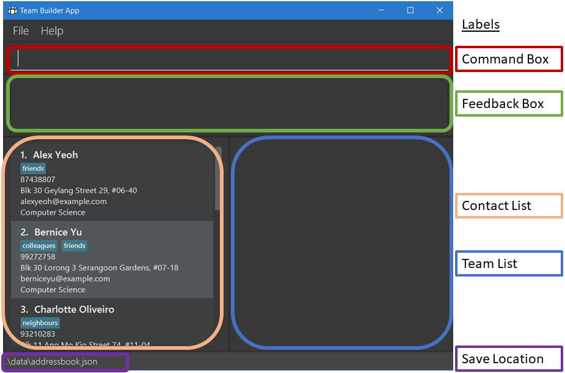
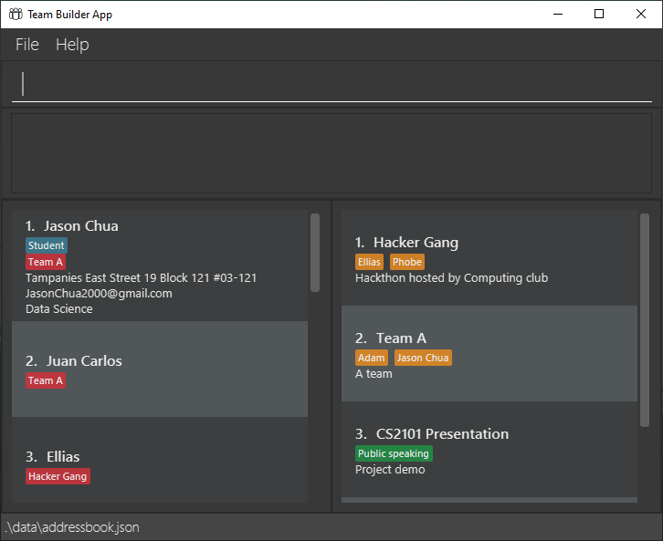
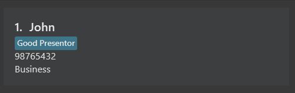
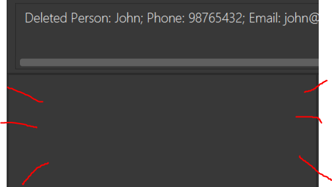
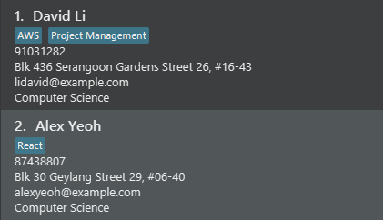
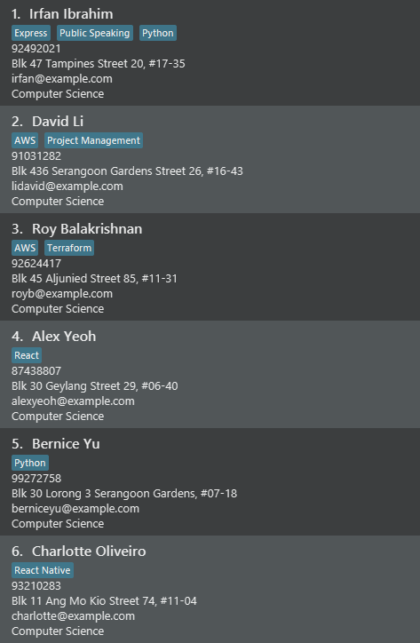
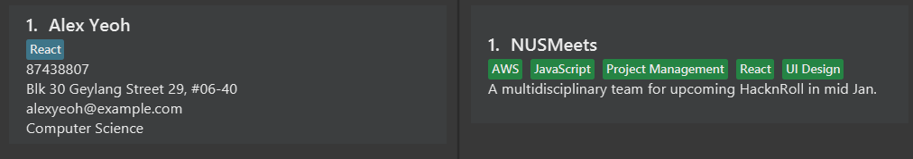

:information_source: **Preface:**

* This guide is on the **usage** of Team Builder. 
* For a guide on **developing** Team Builder with us, see our [developer guide](DeveloperGuide.html).
* We are **still working** on making our user guide as user friendly as possible. You can help us by providing feedback [here](https://github.com/AY2223S2-CS2103T-T17-1/tp/issues/new)

**Team Builder (TB)** is a desktop app primarily for cross-faculty students to manage their contacts and build a multidisciplinary team based on soft skills and technical skills.

It is optimized for use via a Command Line Interface (CLI) while still having the benefits of a Graphical User Interface (GUI). If you can type fast, TB can help you build your team through your contacts much faster than traditional GUI apps.

## About this guide <!-- omit in toc -->

:bulb: <a id="help-command" style="color:black"> **Tip:** </a>
Access this guide quickly through the `help` command or by clicking the **help** menu icon.
 

Welcome to Team Builder, we hope that this product will allow you 
to manage your contacts to build fantastic teams for your events/competitions.

This guide is designed for users with and without technical experience and is to be followed narratively from top to bottom. However, if you are an experienced user, feel free to skip the Example context. If you are looking for a specific command, you can view the [table of commands here](#full-table-of-commands).

:information_source: **What do the symbols and formatting mean?:**

* :information_source: - are important specific information to note

* :bulb: - are usage tips/shortcuts

* :exclamation: - are some warnings about certain actions

* `keyword s/` - are command/special character to be typed. **They are case-sensitive and strip excessive spaces.**

* `UPPER_CASE` - are the input fields to be supplied by the user. 
  e.g. in `add n/NAME`, `NAME` is an input field which can be used as `add n/John Doe`.

* `[]` - are optional input fields. 
  e.g. `[e/optional]` can be used like ` ` (i.e. not used) or `e/lmao@lmao.com` 

* `[]...` - are input fields that can be supplied any number of times including zero times. 
  e.g. `[t/multi]...` can be used like ` ` (i.e. 0 times), `t/React`, `t/React t/AWS` etc.

### This guide is split into 6 sections: <!-- omit in toc -->

1. [Full Table of Commands](#full-table-of-commands)
2. [Quick Start](#quick-start)
3. [Managing Contacts](#managing-contacts)
4. [Making a Team](#making-a-team)
5. [Extra Team Builder Features](#extra-team-builder-features)
6. [FAQ](#faq)

Sections 3,4,5 contain descriptions and instructions for the main features of Team Builder.

Below is the full table of contents, in case you are looking for something very specific.

:information_source: **Full Table of Content:**

- [Full Table of Commands](#full-table-of-commands)
- [Quick start](#quick-start)
- [Managing Contacts](#managing-contacts)
  - [Adding a new contact : `add`](#adding-a-new-contact--add)
  - [Listing all contacts : `list`](#listing-all-contacts--list)
  - [Updating a contact : `edit`](#updating-a-contact--edit)
  - [Deleting a contact : `delete`](#deleting-a-contact--delete)
- [Making a Team](#making-a-team)
  - [Creating a team: `create`](#creating-a-team-create)
  - [Finding the right teammate I : `find`](#finding-the-right-teammate-i--find)
  - [Finding the right teammate II : `sort`](#finding-the-right-teammate-ii--sort)
  - [Add a person to a team : `edit`](#add-a-person-to-a-team--edit)
  - [Listing all teammates in a team : `show`](#listing-all-teammates-in-a-team--show)
  - [Removing a team : `remove`](#removing-a-team--remove)
- [Extra Team Builder Features](#extra-team-builder-features)
  - [Clearing all entries : `clear`](#clearing-all-entries--clear)
  - [Undoing a command : `undo`](#undoing-a-command--undo)
  - [Redoing an undo command : `redo`](#redoing-an-undo-command--redo)
  - [Exiting the program : `exit`](#exiting-the-program--exit)
  - [Saving the data](#saving-the-data)
  - [Editing the data file](#editing-the-data-file)
- [FAQ](#faq)
- [**Coming soon!:** Future Features](#future-features)

--------------------------------------------------------------------------------------------------------------------

## Full Table of Commands

Action |          Type          |Format, Examples
:--------:|:----------------------:|:--------:
[**Add**](#adding-a-new-contact--add) |       Modifying        |`add n/NAME [p/PHONE_NUMBER] [e/EMAIL] [a/ADDRESS] [m/MAJOR] [t/TAG]... [T/TEAM_NAME]...`
[**Clear**](#clearing-all-entries--clear) |       Modifying        |`clear`
[**Delete**](#deleting-a-contact--delete) |       Modifying        |`delete INDEX`  e.g., `delete 3`
[**Edit**](#updating-a-contact--edit) |       Modifying        |`edit INDEX [n/NAME] [p/PHONE_NUMBER] [e/EMAIL] [a/ADDRESS] [t/TAG]... [T/TEAM_NAME]... ​`
[**Find**](#finding-the-right-teammate-i--find) |        Listing         | `find NAME/MAJOR/TAG [MORE_KEYWORDS]`  e.g., `find James Jake`
[**Sort**](#finding-the-right-teammate-ii--sort) |        Listing         |`sort ORDER SORT_BY`  e.g., `sort desc tcount`
[**Create**](#creating-a-team-create) |       Modifying        |`create tn/TEAM_NAME td/TEAM_DESC [t/TAG]`   e.g., `create tn/TeamA td/2103T_tP t/Java`
[**Show**](#listing-all-teammates-in-a-team--show) |        Listing         |`show TEAM_NAME [OTHER_TEAM_NAME]...`
[**List**](#listing-all-contacts--list) |        Listing         |`list`
[**Remove**](#removing-a-team--remove) |       Modifying        |`remove TEAM_NAME`
[**Undo**](#undoing-a-command--undo) | Special  Modifying | `undo`
[**Redo**](#redoing-an-undo-command--redo) |       Modifying        |`redo`
[**Help**](#help-command) |         Window         |`help`

--------------------------------------------------------------------------------------------------------------------

## Quick start

Prerequisite:

1. Downloaded [Java JDK 11](https://www.oracle.com/sg/java/technologies/javase/jdk11-archive-downloads.html) for your operating system.

Team Builder Installation:

1. Open a command terminal

2. Ensure you have **Java 11** or above installed in your Computer by typing `java --version` in the command terminal.
Information on the Java version installed should appear in the command terminal. Otherwise, [click here to troubleshoot](https://www.java.com/download/help/troubleshoot_java.html#:~:text=Temporarily%20turn%20off%20firewall%20or,successfully%20completed%20the%20Java%20install.).

3. Download the latest **teambuilder.jar** from [here](https://github.com/AY2223S2-CS2103T-T17-1/tp/releases).

4. Copy the file to the folder you want to use as the _home folder_ for your TeamBuilder.

5. In the command terminal, `cd` into the folder you put the jar file in, and use the `java -jar teambuilder.jar` command to run the application. 
   A GUI (seen below) should appear in a few seconds. Note how the app contains some sample data. 
    
    As you can see there are two main panels. The left panels shows your contacts, and the right panel shows the teams that you have in TeamBuilder. 
    
    - The _blue_ tags are the **skill tags** of a person, to denote the skills or specialisation of the person.
    - The _red_ tags are the **team tags**, which tell you which team a person is in
    - The _yellow-orange_ tags are the **members** of a team, which tells you the names of the team members in a team
    - The _green_ tags are the **skill tags** of a team, which are the skills that you think this team needs.

   You will find more details below the tags of the respective person/team, such as the team description or the contact's phone number.

6. Type the command in the command box and press Enter to execute it. e.g. typing `help` and pressing Enter will open the help window. 
   Some example commands you can try:

   * `list` : Lists all contacts.

   * `add n/John Doe p/98765432 e/johnd@example.com a/John street, block 123, #01-01 m/computer science` : Adds a contact named `John Doe` to the TeamBuilder.

   * `delete 3` : Deletes the 3rd contact shown in the current list.

   * `clear` : Deletes all contacts.

   * `exit` : Exits the app.

7. Refer to the [Full Table of Commands](UserGuide.html#full-table-of-commands) above for details of each command.

--------------------------------------------------------------------------------------------------------------------

## Managing Contacts

This section convers on how to manage potential teammates in your Team Builder.

This includes:
1. Adding new potential teammates
2. Updating existing teammates' information and tags
3. Deleting contacts that you no longer want to be teammates with or have lost contact.

**:information_source: Notes about the command format:** 

* Input fields can be in any order. 
  e.g. if the command specifies `n/NAME p/PHONE_NUMBER`, `p/PHONE_NUMBER n/NAME` is also acceptable.

* If a parameter is expected only once in the command but you specified it multiple times, only the last occurrence of the parameter will be taken. 
  e.g. if you specify `p/12341234 p/56785678`, only `p/56785678` will be taken.

* If extraneous input fields are supplied for commands that do not require them (such as `help`, `list`, `exit` and `clear`), the command will execute as per normal while ignoring the fields. 
  e.g. if the command specifies `help 123`, it will be interpreted as `help`.

### Adding a new contact : `add`

Format: `add n/NAME [p/PHONE_NUMBER] [e/EMAIL] [a/ADDRESS] [m/MAJOR] [t/TAG]... [T/TEAM_NAME]...​`

:bulb: **Tip:**
A contact can have any number of tags (including 0). Tags are especially useful for keeping track of skills and traits!
A contact must have a name, other features are optional.

:exclamation: **Caution:**
You can only add a team tag to a person if the team has been created beforehand!

**Example context**:

You have exchanged contacts with a person named **John** at a Computer Science Event.
He seems like a nice guy that you might want to do projects with. You note that he is a business major with **great presentations skills**.

Let's add his contacts to Team Builder as a new potential teammate for future events and projects!

**What to type**:

`add n/John p/98765432 m/Business t/Good Presentor`

**Result**:

:information_source: **Note:**
The order of persons added in the list may not be in chronological order.

### Listing all contacts : `list`

Format: `list`

**Example context**:

Now that we have added **John**, we should be able to see him in the Team Builder.

**What you can type**:

`list`, `list 123`, `list ada adw v zklw`, etc.

If you have accidentally added extra input fields after `list`, the command would be accepted as anything after `list` is discarded.

### Updating a contact : `edit`

Format: `edit INDEX [n/NAME] [p/PHONE] [e/EMAIL] [a/ADDRESS] [m/MAJOR] [t/TAG]… [T/TEAM_NAME]​`

**Example context**:

It seems that we forgot to add some information about **John**.
We missed out the back of his card that has his **email**.
Let's use the `edit` command to update his information.

 

 We see <b>John</b> is index 1 in our display. 

**What to type**:

`edit 1 e/john@example.com`

**Result**:

 <b>John's email</b> is now reflected on our contact list. 

**:information_source: Notes about the edit command:** 

* Edits the person at the specified `INDEX`. The index refers to the index number shown in the displayed person list. The index **must be a positive integer** 1, 2, 3, …​
* At least one of the optional fields must be provided.
* Existing values will be updated to the input values.
* When editing tags and teams, the existing tags and teams of the person will be removed i.e adding of tags and teams is not cumulative.
* You can remove all the person’s tags or teams by respectively typing `t/` or `T/` without
    specifying any after it.

### Deleting a contact : `delete`

Format: `delete INDEX`

**Example context**:

You hear from your friends that **John** is actually a **snake*** :snake: and we do not want a snake as a teammate.

Let's delete him from our Team Builder.

Again, we see **John** is index 1 in our display.

**What to type**:

`delete 1 `

**Result**:

 John is no longer in your TeamBuilder contact list! 

 * snake refers to a backstabber. 

## Making a Team

This section converse on how to make a team in your Team Builder.

This includes:
1. Creating a team
2. Finding the right teammate using `find` and `sort`
3. Adding a person to a team
4. Listing all teammates in a team
5. Remove a team

### Creating a team: `create`

Format: `create tn/TEAM_NAME td/TEAM_DESC [t/TAG]...`

**Example context**:

You have decided to participate in NUS Hack&Roll hackathon. Let's create a team called "NUSMeets"! Since your idea involves creating 
a web application, you will need someone with technical experience in React and AWS. You would also prefer to have a UI 
person to make your web app presentable. As this hackathon involves a tight timeline, proper project management skills 
are required too.

**What to type**:

`create tn/NUSMeets td/A multidisciplinary team for upcoming HacknRoll in mid Jan. t/JavaScript t/React t/AWS 
t/Project Management t/UI Design`

**Result**:

### Finding the right teammate I : `find`

<a id="find-command" style="color:black"> Format: `find NAME/MAJOR/TAG [MORE_KEYWORDS]...` </a>

**Example context 1**:

You recall that two of your tutorial classmate named Alex and David are good at UI Design and you want to invite them
to your team, but you have forgotten their full name and contact numbers.

**What to type**:

`find alex david`

**Result**:

**Example context 2**:

You still feel your team needs more people, and you decide to find someone who majored in computer science.

**What to type**:

`find computer science`

**Result**:

**Example context 3**:

Now your team is almost formed, but you still need a person who mastered JavaScript.

**What to type**:

`find javascript`

**Result**:

:information_source: **Specificity of `find`**:

* The search is case-insensitive. e.g `hans` will match `Hans`
* The order of the keywords does not matter. e.g. `Hans Bo` will match `Bo Hans`
* Only the name is searched.
* Only full words will be matched e.g. `Han` will not match `Hans`
* Persons matching at least one keyword will be returned (i.e. `OR` search).
  e.g. `Hans Bo` will return `Hans Gruber`, `Bo Yang`

### Finding the right teammate II : `sort`

<a id="sort-command" style="color:black"> Format: `sort ORDER SORT_BY` </a>

**Example context**:

Perhaps you are not too sure which skills are required in your team, so you want to list persons who know a wide range 
of skills first.

**What to type**:

`sort desc tcount`

**Result**:

:information_source: **Specificity of `sort`**:

* The ORDER and SORT_BY are case-insensitive. e.g `tcount` will match `tCount`
* The ORDER can only be either ascending (`asc`) or descending (`desc`)
* The following SORT_BY are available:
    * `tcount` Sorts by person's tag count

:information_source: **Note:**
Sort would be performed on the current list of persons displayed on the UI. If you are looking to sort all persons after
performing a `find` command etc., remember to use `list` command before using `sort`. 

### Add a person to a team : `edit`

Format: `edit INDEX [T/TEAM_NAME]...`

**Example context**:

You recall participating in a Hackathon previously with Alex Yeoh and knows he is familiar with React. You decide to 
reach out to him to form your team for Hack&Roll.

:information_source: **Note:**
`edit` command is used here as adding a person to a team is equivalent to editing the team tags of a person.

:exclamation: **Caution:**
You can only add a person to the team if the team has been created beforehand!

**What to type**:

`edit 1 T/NUSMeets`

**Result**:

### Listing all teammates in a team : `show`

Format: `show TEAM_NAME [OTHER_TEAM_NAME]...`

**Example context**:

The Hack&Roll announced that there is a limit on team size. You want to list all people who are currently added to your
NUSMeets team.

**What to type**:

`show NUSMeets`

**Result**:

### Removing a teammate from a team : `edit`

Format: `edit INDEX [T/TEAM_NAME]`

**Example context**:

Alex reached out to you later that he is now unable to attend Hack&Roll due to some personal circumstances.
We have no choice but to remove Alex from our team.

**What to type**:

`edit 1 T/`

**Result**:

 We see that Alex's team tag is removed and the team no longer has Alex as a member 

### Removing a team : `remove`

Format: `remove TEAM_NAME`

**Example context**:

Oh no, you realised that you have a number of deadlines during the period of time Hack&Roll would run.
Taking into account Alex's absence as well, You decide to not participate in it anymore. 

**What to type**:

`remove NUSMeets`

**Result**:

NUSMeets will be removed from the team list panel.

## Extra Team Builder Features

This section covers some quality of life features for Team Builder.

This includes:
1. Clearing all entries
2. Undoing a command
3. Redoing an undo command
4. Exiting the program
5. Saving data
6. Editing the data file

### Clearing all entries : `clear`

Format: `clear`

Clears all entries from the Team Builder, instead of manually removing teams and persons.

**What you can type**:

`clear`, `clear 123`, `clear ada adw v zklw`, etc.

These are all acceptable as anything after `clear` is discarded.

### Undoing a command : `undo`

Format: `undo`

Oops! It looks like we accidentally used the `clear` command to remove all our contacts.

Let's use the `undo` command to revert our Team Builder back to before we typed the `clear` command.

**What you can type**:

`undo`, `undo 123`, `undo ada adw v zklw`, etc.

These are all acceptable as anything after `undo` is discarded.

:exclamation: **Caution:**

* You can only `undo` up to 10 times in a row! After the 10th `undo`, no more `undo` is possible.

* You can only `undo` [modifying commands](#full-table-of-commands).

* You may also undo into a state where `find` was called and so your contact list is not shown fully.
Simply use `list` to view the full contact list again.

### Redoing an undo command : `redo`

Format: `redo`

Perhaps we want to `clear` the example contacts after all.

Let's use the `redo` command to revert our Team Builder back to before we typed the `undo` command.

**What you can type**:

`redo`, `redo 123`, `redo ada adw v zklw`, etc.

These are all acceptable as anything after `redo` is discarded.

:exclamation: **Caution:**
Typing any [modifying command](#full-table-of-commands) (other than an undo) after an `undo` makes it impossible to `redo` that `undo` command!

### Exiting the program : `exit`

Format: `exit`

Exits the program.

### Saving the data

TeamBuilder data are saved in the hard disk automatically after any command that changes the data. There is no need to save manually.

### Editing the data file

TeamBuilder data are saved as a JSON file `[JAR file location]/data/teambuilder.json`. Advanced users are welcome to update data directly by editing that data file.

:exclamation: **Caution:**
If your changes to the data file makes its format invalid, TeamBuilder will discard all data and start with an empty data file at the next run.

--------------------------------------------------------------------------------------------------------------------

## FAQ

**Q**: How do I transfer my data to another Computer? 
**A**: Install the app in the other computer and overwrite the empty data file it creates with the file that contains the data of your previous TeamBuilder home folder.

**Q**: Why is my command text in red and not working? 
**A**: You might have input an invalid command. Either the command word doesn't exist or the parameters entered are invalid.

--------------------------------------------------------------------------------------------------------------------
# Future features
These are features that will improve your experience using TeamBuilder, to be added in the future. Look forward to them!

## Support for long tags
Currently, whether it is a skill tag or a team tag, TeamBuilder will try to display the whole tag regardless of how long it is, causing it to overflow out of the window and be un-readable.
Future changes:
- Tags that exceed a character count of 20 characters will be truncated and have a "..." after it.
- Users will be able to view the full tag by hovering their cursor over the tag.
- This will not change the behaviour of the `add`, `edit`, or `find` commands.

## Phone number limit 
Currently, there is no limit to the length of a contacts phone number.
Future changes:
- Phone number will have a maximum length of 15 digits, as that is the longest viable phone number.

