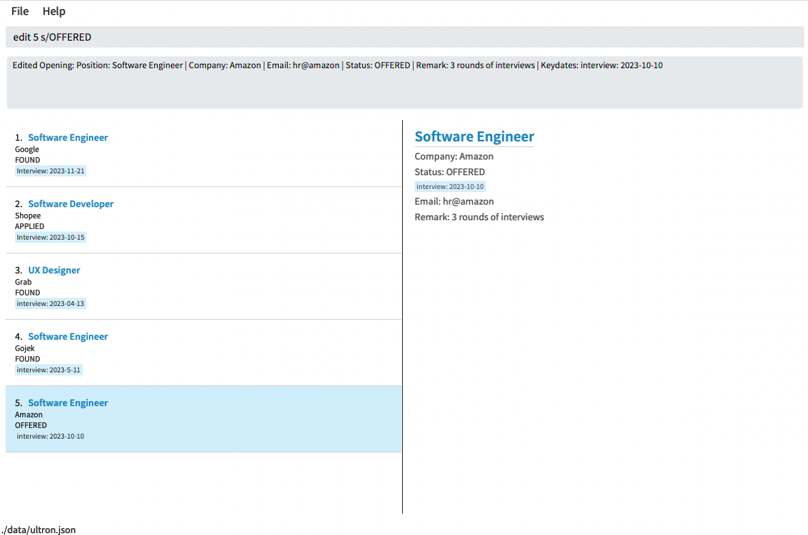
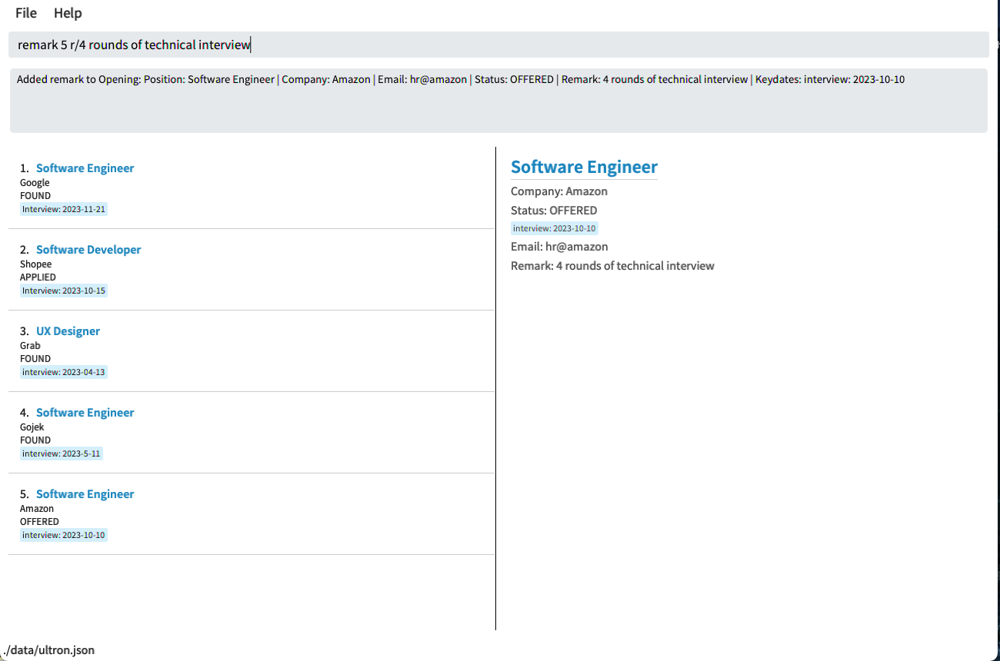
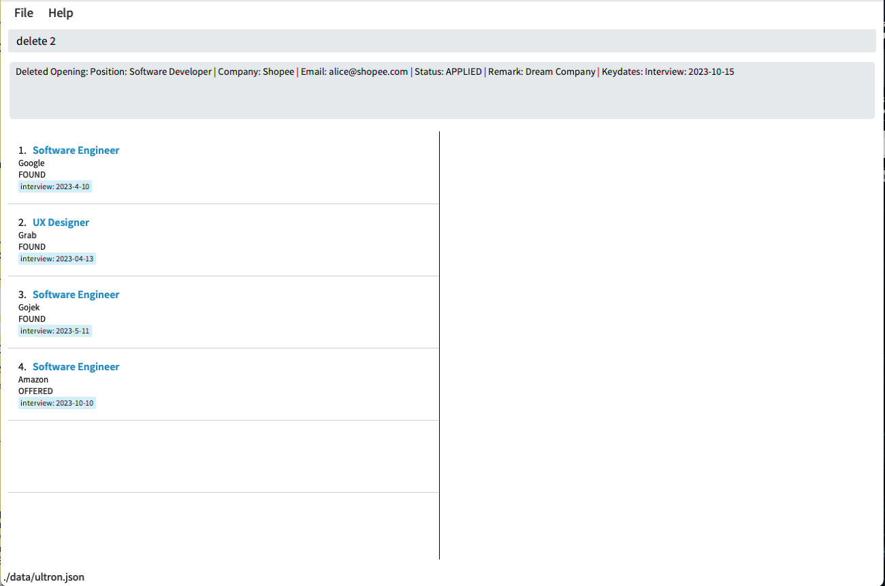

Ultron is a **desktop app for compiling job and internship applications, optimized for use through keyboard typing and minimizing mouse clicking.**

If you are familiar with the Ultron interface and can type fast, it can help you organise your internship applications in a much more efficient and structured manner compared to traditional methods such as using spreadsheets.

---

## Table of Contents

- [Table of Contents](#table-of-contents)
- [Navigation](#navigation)
- [Glossary](#glossary)
  - [Opening](#opening)
  - [Keydate](#keydate)
- [Quick Start](#quick-start)
  - [Java Instructions](#java-instructions)
- [Command Overview](#command-overview)
  - [Command Structure](#command-structure)
  - [Command Usage](#command-usage)
- [Features](#features)
  - [1. Adding an opening : `add`](#1-adding-an-opening--add)
    - [Additional notes](#additional-notes)
  - [2. Listing all openings : `list`](#2-listing-all-openings--list)
  - [3. Editing an opening : `edit`](#3-editing-an-opening--edit)
    - [Additional notes](#additional-notes-1)
  - [4. Editing an opening's remarks : `remark`](#4-editing-an-openings-remarks--remark)
    - [Additional notes](#additional-notes-2)
  - [5. Showing full details of opening: `show`](#5-showing-full-details-of-opening-show)
  - [6. Listing upcoming dates : `upcoming`](#6-listing-upcoming-dates--upcoming)
  - [7. Filtering openings by company or position: `find`](#7-filtering-openings-by-company-or-position-find)
    - [Additional notes](#additional-notes-3)
  - [8. Filtering openings by status: `status`](#8-filtering-openings-by-status-status)
    - [Additional notes](#additional-notes-4)
  - [9. Deleting an opening : `delete`](#9-deleting-an-opening--delete)
  - [10. Deleting all openings : `clear`](#10-deleting-all-openings--clear)
  - [11. Accessing help window : `help`](#11-accessing-help-window--help)
  - [12. Exiting the program : `exit`](#12-exiting-the-program--exit)
  - [13. Saving the data](#13-saving-the-data)
- [FAQ](#faq)
- [Command summary](#command-summary)

---

## Navigation

All sections of the User Guide(UG) is organized neatly into the Table of Contents in a hierarchical structure. Clickable text, such as in the Table of Contents, can be used to easily navigate to relevant sections of the UG. Some are also links that will navigate you to relevant websites.

---

## Glossary

### Opening

Representation of an internship application, which contains all relevant information needed in your application journey.

### Keydate

Representation of important dates or deadlines of key events such as an Online Assessment or Zoom Interview, allowing you to neatly organise and track all dates, past and future.

---

## Quick Start

1. Ensure you have Java version `11` or above installed in your Computer. Instructions to check or download Java version `11` can be found [here](#java-instructions).

2. Download the latest `ultron.jar` [here](https://github.com/AY2223S2-CS2103T-F12-4/tp/releases/download/v1.3/ultron.jar).

3. Copy the file to the folder you want to use as the _home folder_ for your Ultron.

4. Open a command terminal, `cd` into the folder you put the jar file in, and use the `java -jar ultron.jar` command to run the application. 
   You should see something similar to the image below in a few seconds. Note how the app contains some sample data. 

5. The app provides you with a text input box at the top for user commands, as well as both a summary list of openings on the left panel and a right panel containing more details of any particular opening.

6. Type the command in the command box and press Enter to execute it. e.g. typing **`help`** and pressing Enter will open the help window. 
   Some example commands you can try:
    - `list` : Lists all openings.
    - `add c/Google p/Engineer e/google@gmail.com s/applied` : Adds an opening to Ultron, representing having applied at Google for an Engineer position.
    - `delete 3` : Deletes the 3rd opening shown in the current list.
    - `show 1` : Displays on the right panel, more details of the 1st opening in the current list
    - `clear` : Deletes all openings.
    - `exit` : Exits the app.

Refer to the [Features](#features) below for details of each command.

### Java Instructions

For Windows users:

1. Open the **Windows Start Menu** and launch the **Command Prompt**.

2. Type in the `java -version` command to confirm the status of your Java version.

3. Example response : `java version "11.0.17"` or `openjdk version "11.0.18"`
    1. If the first number in the number list is `11`, it indicates that you are using Java version `11` and you are done!
    2. If the number is not `11`, you can update Java by first uninstalling Java, following the instructions [here](https://explainjava.com/uninstall-java-windows/).
    3. You can then download Java version `11` from this [source](https://www.oracle.com/java/technologies/javase/jdk11-archive-downloads.html), following the instructions [here](https://explainjava.com/install-java-windows/).
    4. Finally, you can type `java -version` in your Command Prompt again to ensure you have Java version `11`.

4. Example response : `java is not recognized...`.
    1. This means Java is not downloaded, so you need to download Java version `11` from this [source](https://www.oracle.com/java/technologies/javase/jdk11-archive-downloads.html), following the instructions [here](https://explainjava.com/install-java-windows/).
    2. Then, you can type `java -version` in your Command Prompt again to ensure you have Java version `11`.

For macOS users:

1. Open the **Terminal**.

2. Type in the `java -version` command to confirm the status of your Java version.

3. Example response : `java version "11.0.17"`
    1. If the first number in the number list is `11`, it indicates that you are using Java version `11` and you are done!
    2. If the number is not `11`, you can update Java by first uninstalling Java, following the instructions [here](https://www.java.com/en/download/help/mac_uninstall_java.html)
    3. You can then download Java version `11` from this [source](https://www.oracle.com/java/technologies/javase/jdk11-archive-downloads.html), following the instructions [here](https://docs.oracle.com/en/java/javase/11/install/installation-jdk-macos.html#GUID-2FE451B0-9572-4E38-A1A5-568B77B146DE)
    4. Finally, you can type `java -version` in your **Terminal** again to ensure you have Java version `11`.

4. Example response : `java: command not found`.
    1. This means Java is not downloaded, so you need to download Java version `11` from this [source](https://www.oracle.com/java/technologies/javase/jdk11-archive-downloads.html), following the instructions [here](https://docs.oracle.com/en/java/javase/11/install/installation-jdk-macos.html#GUID-2FE451B0-9572-4E38-A1A5-568B77B146DE)
    2. Then, you can type `java -version` in your **Terminal** again to ensure you have Java version `11`.

After ensuring you have Java version `11`, you can return to [Quick Start](#quick-start).

[Return to Table of Contents](#table-of-contents)

---

## Command Overview

### Command Structure
All commands consists of a command word e.g add. Commands that add or edit fields require fields which start with their corresponding prefixes e.g. r/ for remarks. Indexes are required for some commands to specify the exact opening of interest. e.g. delete 1 deletes the first opening.

### Command Usage
Commands can be entered into the input box at the top of the application as shown below.

After command is inputted as shown with `upcoming 500`, you can press Enter. Ultron will then execute your command if it is a valid command. If it is an invalid command, Ultron will provide additional details as to what the right command should be.

[Return to Table of Contents](#table-of-contents)

---

## Features

**:information_source: Notes about the command format:** 

- Words in `UPPER_CASE` are the fields to be supplied by the user. 

  e.g. in `add p/POSITION`, `POSITION` is a field which can be used as `add p/Software Engineer`.

- Items in square brackets are optional. 
  e.g. `c/COMPANY [d/KEYDATE]` can be used as `c/Google d/Interview@2023-04-01` or as `c/Google`.

- Items with `…`​ after them can be used multiple times including zero times. 
  e.g. `[d/KEYDATE]…​` can be used as ` ` (i.e. 0 times), `d/Interview@2023-04-01`, `d/Interview@2023-04-01 d/OA@2023-05-02` etc.

- Fields can be in any order. 
  e.g. if the command specifies `p/POSITION c/COMPANY`, `c/COMPANY p/POSITION` is also acceptable.

- If a field is expected only once in the command but you specified it multiple times, only the last occurrence of the field will be taken, excluding `status` command. 
  e.g. if you specify `c/Google c/Shopee`, only `c/Shopee` will be taken.

- Extraneous fields for commands that do not take in fields (such as `exit`) will be ignored. 
  e.g. if the command specifies `exit 123`, it will be interpreted as `exit`.

### 1. Adding an opening : `add`

Having too many internships offers and being unable to keep track of all of them?
Ultron provides you with a platform to remember all your openings so you don't have to!
Just type `add` followed by details of your opening in the format below and you can see
it being added to Ultron.

Format: `add p/POSITION c/COMPANY e/EMAIL s/STATUS [r/REMARK] [d/KEYDATE]…​`

|     Field     |    Format                     |
|---------------|---------------------------------------------------------------|
|   POSITION    |  Alphanumeric characters are allowed. Blanks are not allowed.|
| COMPANY |  Alphanumeric characters are allowed. Blanks are not allowed. |
| EMAIL | Should be of the format local-part@domain   |
|STATUS | Must be of either **found, applied, interviewing, offered, accepted or rejected** and is case-insensitive.|
| REMARK | Should not be blank, if user chooses to add a remark |
| KEYDATE | Must be in the form `KEY@DATE`, where `KEY` is a key event in the application process and `DATE` is the date of the event in `YYYY-MM-DD` format. `KEY` must only contain alphabetic characters, cannot be blank and cannot only contain whitespaces.|

#### Additional notes

- If both `COMPANY` and `POSITION` of a new opening matches a current opening, the new opening will not be added.
- The openings in the list only display `POSITION`, `COMPANY`, `STATUS` and `KEYDATES`.
- To view the full details of the opening, use the `show` command.

Examples:

- `add p/Software Engineer c/Google e/chinese@google.com s/interviewing d/Interview@2023-03-14`

[Return to Table of Contents](#table-of-contents)

### 2. Listing all openings : `list`

Ultron gives you the option to view all your recorded openings in one window. Just type 'list'
and the full list of openings will be displayed starting with the earliest added opening.

Format: `list`

- Openings are displayed in order of when it was added, with the latest added opening at the bottom.

💡 **Tip:** You can use `list` to return to the full list of openings after filtering the list using commands like `find` [here](#7-filtering-openings-by-company-or-position-find) and `upcoming` [here](#6-listing-upcoming-dates--upcoming).

[Return to Table of Contents](#table-of-contents)

### 3. Editing an opening : `edit`

Accidentally typed the wrong company name? Don't worry, Ultron allows you to edit a previously
added opening without having to delete and start over. Just type in 'edit' followed by the index
number of the desired opening with the field you want to change. Ultron will update the opening with just a single line of command.

Format: `edit INDEX [p/POSITION] [c/COMPANY] [e/EMAIL] [s/STATUS] [d/KEYDATE]…​`

- Edits the opening at the specified `INDEX`. The index refers to the index number shown in the displayed opening list. The index **must be a positive integer** 1, 2, 3, …​
- At least one of the optional fields must be provided.

#### Additional notes

- When editing any field, the existing field values of the opening will be removed i.e editing of fields are not cumulative.
- Since `KEYDATES` are optional, you can remove all the `KEYDATES` of the opening by typing `d/` without
  specifying any `KEYDATE` after it.

Examples:

- `edit 1 c/Goggle e/johndoe@example.com` Edits the company and email address of the 1st opening to be `Goggle` and `johndoe@example.com` respectively.
- `edit 2 c/Shopee d/` Edits the company of the 2nd opening to be `Shopee` and clears all existing `KEYDATE`.

[Return to Table of Contents](#table-of-contents)

### 4. Editing an opening's remarks : `remark`

What happens when there is a change of information? Ultron gives you the flexibility to edit the remarks of any opening
so that you can keep track of real time data without the need for any unnecessary additions.

Format: `remark INDEX r/REMARK`

- Edits the remark of the opening at the specified `INDEX`. The index refers to the index number shown in the displayed opening list.
- The index **must be a positive integer** 1, 2, 3, …​

#### Additional notes

- When editing `REMARK`, the existing `REMARK` of the opening will be removed i.e editing of `REMARK` is not cumulative.
- You can remove all the `REMARK` of the opening by typing `r/` without
  specifying any `REMARK` after it.

[Return to Table of Contents](#table-of-contents)

### 5. Showing full details of opening: `show`

Ultron stays organised by only showing key details on the left panel. This feature allows you to view full details of any opening on the right panel, by using the index of the opening. Ultron even has added functionality to allow you to simply click on the opening of interest on the left panel, achieving the same result.

Format: `show INDEX`

- Show details of the opening at the specified `INDEX`.
- The index refers to the index number shown in the displayed opening list.
- The index **must be a positive integer** 1, 2, 3, …​

[Return to Table of Contents](#table-of-contents)

### 6. Listing upcoming dates : `upcoming`

Got too many dates or events to track? Ultron allows you to focus on only the most upcoming and urgent dates or deadlines, by filtering the displayed list to only show openings with keydates within a specific time frame.

Format: `upcoming DAYS`

- Lists all openings which has events within the time frame, i.e. today or within the next `DAYS` days, sorted in order of most urgent events.
- `DAYS` **must be a positive integer** 1, 2, 3, …​

Examples:

- `upcoming 1` lists all openings with events happening in the next 1 day, ie. today or tomorrow.

[Return to Table of Contents](#table-of-contents)

### 7. Filtering openings by company or position: `find`

Want to find specific openings for a certain company or position? Ultron provides you the
capability to filter Ultron based on the opening's company or position, so you do not have to scroll through the entire
list to find the opening you are interested in.

Format: `find KEYWORD [MORE_KEYWORDS]`

- Only the company and position field is searched.
- Only full words will be matched e.g. `Amaz` will not match `Amazon`
- Openings with COMPANY or POSITION matching at least one keyword will be returned (i.e. `OR` search).
  e.g. `find google amazon software` will return openings of `Google`, `Software Engineer`, `Amazon Web Services`

#### Additional notes

- The search is case-insensitive. e.g. `google` will match `Google`
- The order of the keywords does not matter. e.g. `Goldman Sachs` will match `Sachs Goldman`

Examples:

- `find Google` returns `google` and `Google Cloud`
- `find bank america` returns `Bank of America`, `Bank of Singapore`, `Bank Manager` 

[Return to Table of Contents](#table-of-contents)

### 8. Filtering openings by status: `status`

Want to find out which openings are at a specific stage of the application progress? Ultron allows you to filter the full list of openings to only display the exact status you want to see.

Format: `status KEYWORD`

- `KEYWORD` **must be of either found, applied, interviewing, offered, accepted or rejected**.
- Only the status field is searched.

#### Additional notes

- The search is case-insensitive. e.g. `Applied` will match `applied`
- Partially spelled words will not be matched e.g. `off` will not match `offered`

Examples:

- `status Interviewing` returns openings with status Interviewing.

[Return to Table of Contents](#table-of-contents)

### 9. Deleting an opening : `delete`

Have unwanted openings cluttering up your app? Ultron makes it easy for you to delete specific openings that you no longer need.

Format: `delete INDEX`

- Deletes the opening at the specified `INDEX`.
- The index refers to the index number shown in the displayed opening list.
- The index **must be a positive integer** 1, 2, 3, …​

Examples:

- `list` followed by `delete 2` deletes the 2nd opening in the opening list.

[Return to Table of Contents](#table-of-contents)

### 10. Deleting all openings : `clear`

Want to start from scratch? Just use `clear` and you will be presented with a clean Ultron ready for
use!

Format: `clear`

- This command allows you to delete all openings from the list in a single command. Useful when you want to start a fresh new list!

### 11. Accessing help window : `help`

Confused about Ultron or any of its commands? Just use this command and Ultron will provide you a link that will answer all your questions!

Format: `help`

### 12. Exiting the program : `exit`

Finished utilising the capabilities Ultron offers? Just exit and your openings will remain until you come back again!

Format: `exit`

### 13. Saving the data

Ultron's data is saved in the hard disk automatically after any command that changes the data. There is no need to save manually.

[Return to Table of Contents](#table-of-contents)

## FAQ

**Q**: For the `upcoming` command, how is the filtered list sorted?

**A**: Out of the keydates within the time range, the keydate with the earliest date for each opening is chosen. The list is then sorted in ascending order based on each opening's chosen date.

---

**Q**: I have too many keydates for my opening, and it is not displaying properly on the left panel. How do I view them properly?

**A**: You can use the `show` command with the index of the opening of interest, shown [here](#5-showing-full-details-of-opening-show). The full information will then be displayed on the right panel.

---

**Q**: Why can't I see details such as emails or remarks when I add or edit openings?

**A**: These details will only be displayed on the right panel when the `show` command is used, shown [here](#5-showing-full-details-of-opening-show).

---

**Q**: How do I transfer my data to another Computer?

**A**:
Make sure the other system is compatible with Java version `11`. Install ultron.jar into the system from [here](https://github.com/AY2223S2-CS2103T-F12-4/tp/releases/download/v1.3/ultron.jar) and navigate to the `data` folder.
Afterwards, copy the `ultron.json` file from the old system and replace it with
the `ultron.json` file in the new system.

---

**Q**: What if I want to delete all openings from a specific company?

**A**: Filter the list by the company of interest using the find command. e.g `find Google`.
Then you can delete each opening one by one based on the filtered list by using the `delete` command.

---

**Q**: I am a macOS user and cannot open my ultron.jar file as it is from an unidentified developer. How do I solve that?

**A**: Your system might have security settings in place to block access to potentially malicious files.
For macOS users, you might want to refer [here](https://www.macworld.com/article/672947/how-to-open-a-mac-app-from-an-unidentified-developer.html) for troubleshooting.

---

[Return to Table of Contents](#table-of-contents)

## Command summary

| Action       | Format, Examples                                                                                                                                                              |
|--------------|-------------------------------------------------------------------------------------------------------------------------------------------------------------------------------|
| **Add**      | `add p/POSITION c/COMPANY e/EMAIL s/STATUS [r/REMARK] [d/KEYDATE]…​`   e.g., `add p/Software Engineer c/Google e/chinese@google.com s/interviewing d/Interview@2023-03-14` |
| **List**     | `list`                                                                                                                                                                        |
| **Edit**     | `edit INDEX [p/POSITION] [c/COMPANY] [e/EMAIL] [s/STATUS] [d/KEYDATE]…​`   e.g., `edit 1 c/Goggle e/johndoe@example.com`                                                   |
| **Remark**   | `remark INDEX r/REMARK`  e.g., `remark 1 r/1 round of interview`                                                                                                          |
| **Show**     | `show INDEX`  e.g., `show 1`                                                                                                                                              |
| **Upcoming** | `upcoming DAYS`  e.g., `upcoming 1`                                                                                                                                       |
| **Find**     | `find KEYWORD [MORE_KEYWORDS]...`  e.g., `find Engineer data Software`                                                                                                    |
| **Status**   | `status STATUS`  e.g., `status interviewing`                                                                                                                               |
| **Delete**   | `delete INDEX`  e.g., `delete 3`                                                                                                                                           |
| **Clear**    | `clear`                                                                                                                                                                       |
| **Help**     | `help`                                                                                                                                                                        |
| **Exit**     | `exit`                                                                                                                                                                        |

[Return to Table of Contents](#table-of-contents)
