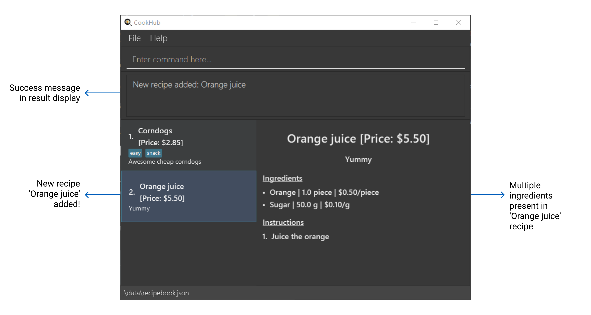
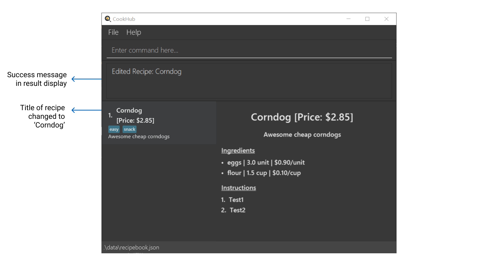
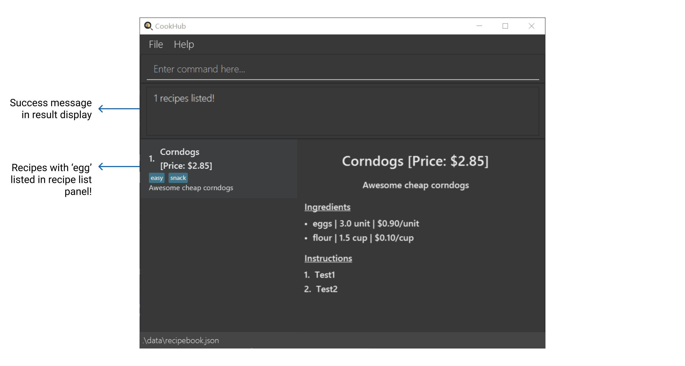
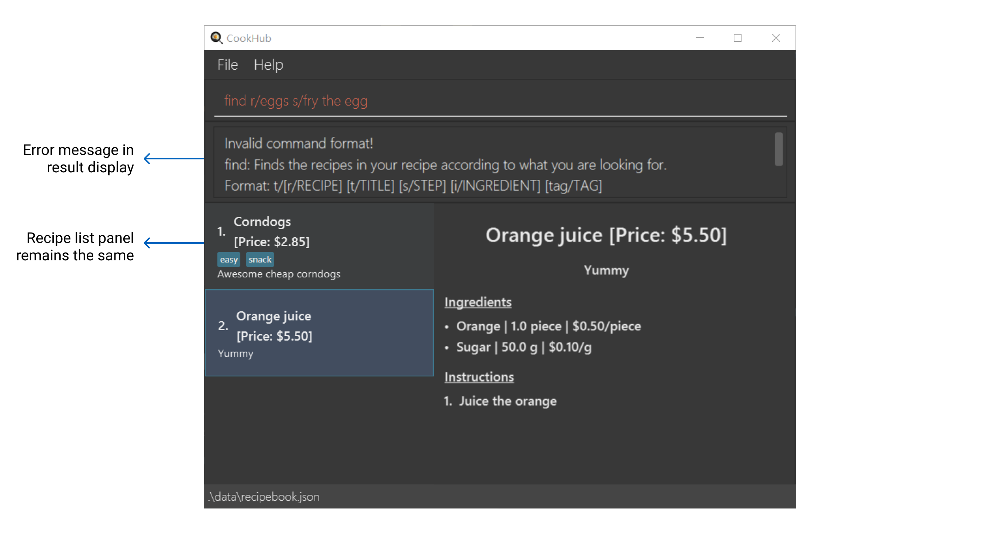
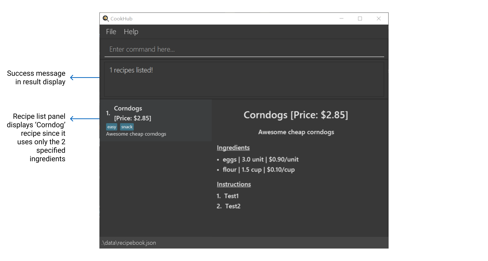
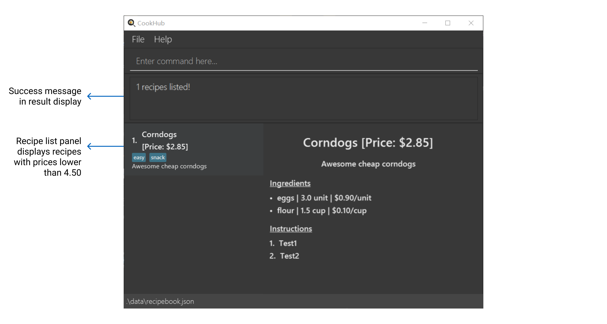
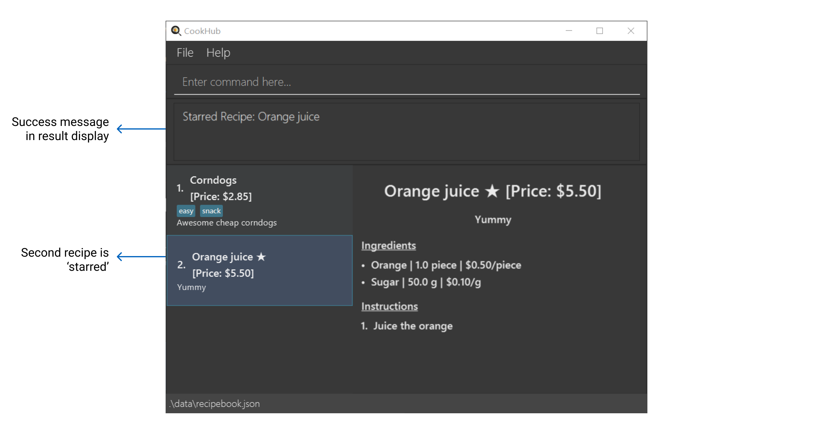
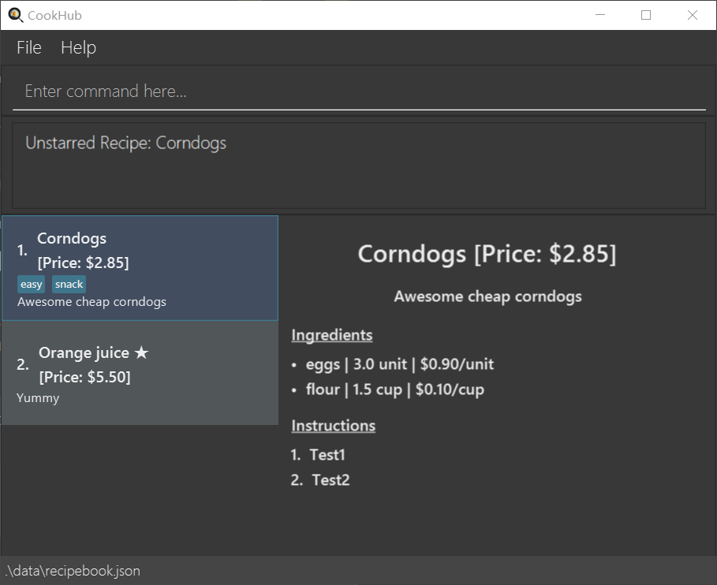

## Welcome to CookHub
**CookHub** is a powerful, but lightweight application for your recipe management needs. 
It sports a sleek and minimalist design that allows you to clearly view all your personal recipes at a glance!

**CookHub** mainly uses the [command line interface](#glossary) that is optimised for fast typists who aim to manage their recipes quickly, while still 
enjoying the benefits of a Graphical User Interface(GUI).

**CookHub** excels in its simplicity and optimisation for the student cook's recipe management needs. 
It supports management via recipe ingredients and price. Having a gentle learning curve and requiring 
minimal setup, it is perfect for the contemporary student cook!

Here is a short overview of the features and capabilities of CookHub:
* Creating recipes with specified titles, ingredients, steps, and tags.
* [Starring](#glossary) and [unstarring](#glossary) each recipe.
* Getting all your [favourite](#glossary) recipes. 
* Finding recipes by titles, ingredients, steps, or tags.
* Sorting or filtering by price.
* Getting all the combined ingredients for a set of recipes. 

|   If you are   |                                         You should                                         |
|:--------------:|:------------------------------------------------------------------------------------------:|
|   a new user   | proceed to our [quick start](#quick-start) section to set up CookHub and try its features |
| returning user |       skip to our [command summary](#command-summary) for a summary of our features!       |

* Table of Contents
{:toc}

## Quick start

1. Ensure you have Java `11` or above installed in your Computer.

2. Download the latest `cookhub.jar` from [here](https://github.com/AY2223S2-CS2103T-W09-1/tp/releases).

3. Copy the file to the folder you want to use as the _home folder_ for your CookHub.

4. Open a command terminal, `cd` into the folder you put the jar file in, and use the `java -jar cookhub.jar` command to run the application. 

   A GUI similar to the below should appear in a few seconds. Note how the app contains some sample data. 
   
5. Type the command in the command box and press Enter to execute it. e.g. typing **`help`** and pressing Enter will open the help window. 

   To get you familiarised, here are some example commands you can try:
   * `add t/Watermelon juice d/Quick and easy watermelon juice i/Watermelon, 3, Slices, 0.10 s/Juice the watermelon` : Add a new recipe titled `Watermelon juice` that has a description `Quick and easy watermelon juice`, an ingredient of `Watermelon, 3, Slices, 0.10`, and a step of `Juice the watermelon`
   * `delete 1 ` : Delete a recipe at index 1
   * `list` : Lists all recipes
   * `exit`: Exits the app

1. Refer to the [Features](#features) below for details of each command.

## Features

**:information_source: Notes about the command format:** 

* Words in `lower_case` are commands or flags that must be typed literally.
* Words in `UPPER_CASE` are placeholder texts that are to be replaced by the user.
* Command flags (e.g. `t/`, `d/`) can be typed in any order
  - For example, the two commands below are the same, despite the swapped order of the command flags `t/` and `d/`
    - `add t/Corndogs d/Delicious i/Flour, 3.5, Cup, 0.30 s/Mix batter` 
    - `add d/Delicious t/Corndogs i/Flour, 3.5, Cup, 0.30 s/Mix batter`

* Items in square brackets are optional.
  - e.g  `add t/Corndogs d/Delicious i/Flour, 3.5, Cup, 0.30 s/Mix batter` is a valid command, even though the command flag `tag/` is missing

* *TITLE*, *DESCRIPTION*, *STEP*, *TAG* must be a word or sentence.
  - e.g. *TITLE* can be `I am a title`
  - e.g. *TAG* can be `Tag`

* *INGREDIENT* is of the format `INGREDIENT_NAME, QUANTITY, UNIT_OF_MEASUREMENT, PRICE_PER_UNIT`
  - *INGREDIENT_NAME*, *QUANTITY*, *UNIT_OF_MEASUREMENT*, *PRICE_PER_UNIT* are placeholder text meant to be replaced by the user following the below rules:
    - *INGREDIENT_NAME*, *UNIT_OF_MEASUREMENT* must be a word or sentence
    - *QUANTITY*, *PRICE_PER_UNIT* must be numeric
  - e.g. *INGREDIENT* can be `White wine vinegar, 2, tbsp, 0.10`
  - e.g. *INGREDIENT* can be `Large egg, 4, unit, 0.80`

---

## Beginners' commands

### Add a recipe : `add`

This command adds a recipe to your recipe book.

Format: `add t/TITLE d/DESCRIPTION i/INGREDIENT... s/STEP... [tag/TAG]...`

:bulb: Reminder: A recipe can have one or more ingredients, and one or more steps. A recipe can also have zero or more tags.

Examples:

Our initial recipe book:

- `add t/Orange juice d/Yummy i/Orange, 1, piece, 0.50 s/Juice the orange` is valid and a recipe similar to the image
shown below will be added to the recipe book:
  

- `add t/Orange juice d/Yummy i/Orange, 1, piece, 0.50 i/Sugar, 50, g, 0.10 s/Juice the orange` is valid as 
multiple `i/` command flags are allowed. A recipe similar to the image shown below will be added to the recipe book:

- `add t/Orange juice d/Yummy i/Orange, 1, piece, 0.50` is not valid because the command flag `s/` is compulsory. An error message will appear, similar to the one shown below:

---
### Edit a recipe: `edit RECIPE_NUMBER`
This command edits a recipe in your recipe book.

Format: `edit RECIPE_NUMBER [t/TITLE] [d/DESCRIPTION] [i/INGREDIENT] [s/STEP] [tag/TAG]...`

:warning: CAUTION: At least one of the command flags need to be present

- The *RECIPE_NUMBER* should refer to the index number shown in the displayed recipe book
- The *RECIPE_NUMBER* must be a positive integer starting from 1 and must exist in the recipe book

Example:

Our initial recipe book:

- `edit 1 t/Corndog` is valid and the recipe will be edited like the image shown below:

- `edit 1 t/Corndogs i/flour, 200, g, 0.05` is valid as multiple flags are accepted. The recipe will be edited as shown below:

- `edit 1` is not valid as at least one flag is required and you will see an error message similar to that of the one shown below:

---
### Delete a recipe : `delete RECIPE_NUMBER`
This command deletes the recipe at the specified *task number* from your recipe book.

Format: `delete RECIPE_NUMBER`

- The *RECIPE_NUMBER* refers to the index number shown in the displayed recipe book
- The *RECIPE_NUMBER* must be a positive integer starting from 1 and must exist in the recipe book

Examples:

Our initial recipe book:

- `delete 1` will result in a recipe book as shown below:

- `delete 2` is invalid. When there is currently only one recipe in the recipe book, you will see an error message as shown below:

---
### List recipe : `list`

This command lists out all the recipes that you have added to the recipe book

Format: `list`

Example: `list` will list all the recipes similar to the image shown below:

---
### Clear recipe : `clear`

This command clears your recipe book of all its recipes.

Format: `clear`

Example: `clear` will clear all recipes similar to the image shown below:

---
## Advanced commands

### Find recipe : `find`

This command finds the recipes in your recipe book according to what you are looking for.

Format: `find [r/RECIPE] [t/TITLE] [s/STEP] [i/INGREDIENT] [tag/TAG]`

:warning: WARNING: Only one command flag can be present!

- the flag `r/` searches through the entire recipe and its components
- the flag `t/` searches only through the recipe's title
- the flag `s/` searches only through the recipe's steps
- the flag `i/` seaches only through the recipe's ingredient names
- the flag `tag/` searches only through the recipe's tags

:exclamation: Constraint: `find i/INGREDIENT` should only be used to find the name of  the ingredients, and not its quantity, unit of measurement, or price per unit. e.g. `find i/lemons` is OK, but `find i/30g` should not be used.

Examples:

Our initial recipe book:

- `find r/eggs` is valid and the result of the recipe book is as shown below:

- `find r/eggs s/fry the egg` is not valid as only one command flag is allowed. You should see an error message similar to
  the one in the image shown below:

- `find` is not valid as at least one flag is required. You should see an error message like the one in the image
shown below:

---
### Search recipe with limited ingredients: `only`

This command searches for recipes that can be made with only those ingredients.

Format: `only INGREDIENT...`
:bulb: Reminder: One or more ingredients can be provided

Examples:

Our initial recipe book:

- e.g. `only eggs` is valid, and will search for recipes that have ingredients that at most contain eggs, and nothing more. The result of the command is as shown below:

- e.g. `only eggs flour` will search for recipes that have ingredients that at most contains eggs and flour.
A recipe that only needs eggs will also be valid. The result of the command is shown below:

- e.g. `only` is not valid as at least one parameter is needed. You should see an error message similar to the one in the image shown
  below:

---
### Sort recipe by cost: `sort ORDER`

This command sorts the recipes in your recipe book by price in the order specified. 

Format: `sort ORDER`
- *ORDER* can only be `asc` or `desc`.
- `asc` is used for ascending order, and `desc` is used for descending order
- The price of a recipe is determined by cost of all ingredients required.

Example: 

Our initial recipe book:

- `sort desc` will display your sorted recipe book similar to the image shown below:

---

### Filter recipe by price: `fp COMPARATOR PRICE`

This command filters the recipes in your recipe book by price according to the comparator specified. 

Format: `fp COMPARATOR PRICE`

- *COMPARATOR* can only be `<` or `>`.
- `<` is used to represent "less than"
- `>` is used to represent "more than"
- *PRICE* can take on any positive real number
- The price of a recipe is determined by cost of all ingredients required.

Example: 

Our initial recipe book:

- `fp < 4.50` will display all recipes that have a lower price than $4.50, as shown in the image below:

---
### Add a recipe to the favorites: `star RECIPE_NUMBER`

This command adds the recipe at the specified *task number* into your favorites, which include all recipes you like the most!

Format: `star RECIPE_NUMBER`

- The *RECIPE_NUMBER* refers to the index number shown in the displayed recipe book
- The *RECIPE_NUMBER* must be a positive integer starting from 1 and must exist in the recipe book

Examples:

Our initial recipe book:

- `star 1` will star the first recipe, as shown in the image below:

- `star 2` will star the second recipe, as shown in the image below:

---
### Remove a recipe from the favorites: `unstar RECIPE_NUMBER`

This command removes the recipe at the specified *task number* from your favorites.

Format: `unstar RECIPE_NUMBER`

- The *recipe number* refers to the index number shown in the displayed recipe book
- The *recipe number* must be a positive integer starting from 1 and must exist in the recipe book

Examples:

Our initial recipe book:

- `unstar 1` will remove the star of the first recipe, as shown in the image below:

- `unstar 2` will remove the star of the second recipe, as shown in the image below:

---
### List all recipes in the favorites : `favorites`

This command lists out all the recipes that you have added to your favorites.

Format: `favorites`

Example:

Our initial recipe book:

- `favorites` will display all your starred recipes, as shown in the image below:

---
### Provide link to the user guide : `help`

This command generates a link to our user guide.

- A window should pop up, and it should look like the one in the image below:

Format: `help`

### Saving the data

CookHub data are saved in the hard disk automatically after any command that changes the data. There is no need to save manually.

### Editing the data file

CookHub data are saved as a JSON file `[JAR file location]/data/cookhub.json`. Advanced users are welcome to 
update data directly by editing that data file.

:exclamation: **Caution:**
If your changes to the data file makes its format invalid, CookHub will discard all data and start with an empty data file at the next run.

### Archiving data files `[coming in v2.0]`

_Details coming soon ..._

## FAQ

**Q**: How do I transfer my data to another Computer? 
**A**: Install the app in the other computer and overwrite the empty data file it creates with the file that contains the data of your previous CookHub home folder.

## Command summary
Format meanings:

- Words in lower_case are commands or flags to be typed as-is
- Words in UPPER_CASE are values of parameters to be supplied by the user
- Words in [Square brackets] are optional parameters (Note:ls can stack filters)
- Words that are followed by * are parameters that can be used multiple times

| Action                   | Format                  | Examples  |
|--------------------------|-------------------------|-----------|
| Delete Recipe            | delete RECIPE_NUMBER    | delete 1  |
| Sort Recipes by price    | sort ORDER              | sort asc  |
|  Filter Recipes by price | filter COMPARATOR PRICE | fp < 4.20 |

## Glossary
| Word	|    Definition                                                  |
|-------|----------------------------------------------------------------------|

**Command Line Interface (CLI)** | 	A program that mainly uses typed commands to interact with the app. 
**Graphical User Interface (GUI)** | 	What the user sees when interacting with the app.                   
Alphanumeric | A combination of both letters and numbers without space.             
Terminal| A text-based interface for the computer.                             

[Back to top](#top)

