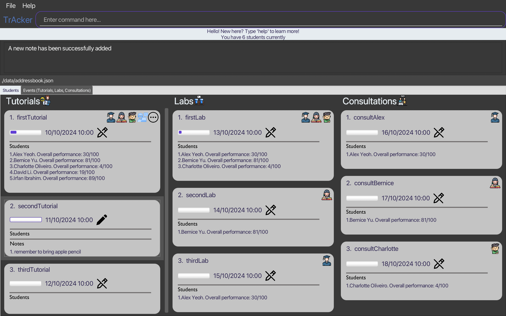

# TrAcker User Guide

--------------------------------------------------------------------------------------------------------------------

# Table of Contents
- [Quick Start](#quick-start)
- [About TrAcker and User Guide](#about-tracker)
- [Event Features](#event-features)
    - [Adding Tutorial](#adding-tutorial--add-tutorial)
    - [Adding Lab](#adding-lab--add-lab)
    - [Adding Consultation](#adding-consultation--add-consultation)
    - [Adding Recurring Event](#adding-recurring-event--add-recur)
    - [Edit An Event](#edit-event)
    - [Delete Events](#delete-events--delete-events)
    - [Open File in Event](#open-file)
- [Student Features](#student-features)
    - [Adding Student](#adding-student--add-student)
    - [Deleting Student](#deleting-student--delete-student)
    - [Add Student to Event](#add-student-to-event)
    - [Delete Student from Event](#delete-student-from-event)
- [Note Features](#note-features)
    - [Add Note For Event](#add-note-for-event)
    - [Delete Note From Event](#delete-note-from-event)
    - [Edit Note in Event](#edit-note-in-event)
- [Sort Features](#sort-students)
    - [Sort Students](#sort-students)
    - [Filter Students](#filter-students)
- [Help Features](#help-features)
- [Application Features](#application-features)
    - [Exit from TrAcker](#exit)
    - [Switch Tabs](#switch-tabs)
- [Command Summary](#command-summary)

--------------------------------------------------------------------------------------------------------------------


## Quick start

1. Ensure you have Java `11` or above installed in your Computer.

2. Download the latest `TrAcker.jar` from [here](https://github.com/AY2223S2-CS2103-F11-1/tp).

3. Copy the file to the folder you want to use as the _home folder_ for your TrAcker.

4. Open a command terminal, `cd` into the folder you put the jar file in, and use the `java -jar TrAcker.jar` command to run the application.<br>
   A GUI similar to the below should appear in a few seconds. Note how the app contains some sample data.<br>
   
   
   
   

--------------------------------------------------------------------------------------------------------------------

<div id='about-tracker'></div>

About TrAcker and User Guide

TrAcker is a **desktop app for CS2040 Teaching Assistants to centralise the CS2040 tasks involving them.
It is optimised for use via a Command Line Interface (CLI)** while still having benefits of a Graphical User Interface (GUI).
If you can type fast, TrAcker will aid the task management for CS2040 TAs. Commands are similar to vim / terminal commands since
CS2040 TAs are familiar with it

Let's clear a little confusion that might arise:
- Why are commands more terminal and vim like instead of simply just an intuitive command? 
  - It is because this app is targeted towards CS2040 TA, and CS2040 TAs are suppose to be proficient with vim and terminal like commands.
   After all, the TAs have done well for CS2040 PE and that is conducted via terminal only
- Why are students not allowed to be added together with the creation of an event?
  - This ie because the app is meant for an attendance taking for a CS2040 TA who plans ahead. So, if a student can be added with an event,
   it defeats the purpose of it being an attendance taking application
- Why can't I see the notes even after adding it?
  - You are supposed to navigate into the events tab and double-click on the event card that you have added the event to
- Why are overlapping event date and time not allowed to be added?
  - It is because TrAcker also functions as a schedule application for the CS2040 TA. So, if overlapping events
    can be added, the TA will be unsure if they are actually free during that period
- How do I use the UG?
  - [UPPER_CASE], i.e upper case letters in [], are parameters to be supplied by the user
  - So, if the command is `rm [INDEX]`, it can be `rm 1`. Of course, the parameters have to abide by TrAcker's restrictions
  - Other than -date and -file in the event features, there are no other optional parameters
- What do the symbols mean?
  - :information_source: - are important information to note
  - :bulb: - are usage tips/shortcuts
  - :exclamation: - are some warnings about certain actions
- :information_source: Every Tutorial, Consultation and Lab prefix are case-sensitive

**Features**
--------------------------------------------------------------------
--------------------------------------------------------------------

## Event Features

### Adding tutorial: `add tutorial`

Adds a tutorial to the TA’s schedule. Tutorial is assumed to be 1 hour long (adhering to CS2040 Tutorial timing) and no modification of duration is allowed

- Name need not be unique
- Cannot be clashes in the time with any other events
- Only .pdf file attachments allowed
- FULL file path to a VALID pdf can be given
- dd/MM/yyyy all in numbers
- Tutorial name cannot have consultation or lab in it
- Tutorial name cannot be just Tutorial alone
- date and attachment is optional. Date will assume the current time if not specified

Format: `touch Tutorial/[NAME] -date [dd/MM/yyyy HH:mm] -file [FULL_FILE_PATH_TO_PDF]`

:information_source:

TrAcker only accepts the following date format
```
date format: dd/MM/yyyy HH:mm
```

Examples:

* `touch Tutorial/makeUpTutorial`
* `touch Tutorial/examReview -date 01/01/2023 16:00`
* `touch Tutorial/examReview -date 01/01/2023 16:00 -file /Users/JohnDoe/Desktop/Introduction.pdf`

### Adding lab: `add lab`

Adds a lab to the TA’s schedule. Lab is assumed to be 1 hour long (adhering to CS2040 Lab timing) and no modification of duration is allowed

- Name need not be unique
- Cannot be clashes in the time with any other events
- Only .pdf file attachments allowed
- FULL file path to a VALID pdf can be given
- dd/MM/yyyy all in numbers
- Lab name cannot have tutorial or consultation in it
- Lab name cannot be just Lab alone
- date and attachment is optional. Date will assume the current time if not specified

Format: `vim Lab/[NAME] -date [dd/MM/yyyy HH:mm] -file [FULL_FILE_PATH_TO_PDF]`

:information_source:

TrAcker only accepts the following date format

```
date format: dd/MM/yyyy HH:mm
```

Examples:

* `vim Lab/pancakeSort`
* `vim Lab/KosarajuAlgorithm -date 01/01/2023 16:00`
* `vim Lab/StronglyConnected -date 01/01/2023 16:00 -file /Users/JohnDoe/Desktop/StronglyConnectedComponents.pdf`

### Adding consultation: `add consultation`

Adds a consultation to the TA’s schedule. Consultation is assumed to be 1 hour long (adhering to CS2040 Consultation timing) and no modification of duration is allowed

- Name need not be unique
- Cannot be clashes in the time with any other events
- dd/MM/yyyy all in numbers
- Consultation name cannot have tutorial or lab in it
- Consultation name cannot be just Consultation alone
- date is optional. Date will assume the current time if not specified
- No attachments allowed

Format: `mkdir Consultation/[NAME] -date [dd/MM/yyyy HH:mm]`

:information_source:

TrAcker only accepts the following date format

```
date format: dd/MM/yyyy HH:mm
```

Examples:

* `mkdir Consultation/reviewConnectedComponents`
* `mkdir Consultation/reviewDijsktra -date 01/01/2023 16:00`

### Adding recurring event: `add recur`

Adds a recurring event to the TA’s schedule. Recurring event is assumed to be 1 hour long (adhering to CS2040 timing) and no modification of duration is allowed

- Name need not be unique
- Cannot be clashes in the time with any other events
- Maximum number of occurrences of the event is 10
- Event is assumed to be conducted weekly only (Adhering to CS2040 Timetables)

Format: `schedule Recur/[EVENT_TYPE]/[EVENT_NAME] -n [REPETITION]`

Examples:

* `schedule Recur/Tutorial/weeklyWrapUp -n 3`
* `schedule Recur/Lab/weeklyVisuAlgoQuiz -n 8`

<div id='edit-event'></div>

### Edit an event: `editEvent event`

Edits an event current in the TA’s schedule.

- Name need not be unique
- Cannot be clashes in the time with any other events
- Only .pdf valid files can be added
- FULL file path to the pdf file MUST be given
- index starts from 1
- Consultation does not allow attachments as mentioned in add consultation section

:bulb: You can use the pwd in unix terminal to get the full path of the folder which the pdf file is in

Format: `editEvent [INDEX] [EVENT_TYPE]/[NEW_EVENT_NAME] -date [NEW_DATE] -file [NEW_VALID_PDF_FILE_PATH]`

Examples:

* `editEvent 1 Tutorial/BellmanFord -date 10/10/2023 10:00 -file /Users/JohnDoe/Desktop/CS2040/BellmanFord.pdf`
* `editEvent 2 Lab/VisuAlgo`
* `editEvent 1 Consultation/ConsultWithEmily -date 10/10/2023 16:00`

### Delete events: `delete events`

:exclamation: You will not be able to undo the deletion

Deletes valid indexed events from TA's schedule.

- Index starts from 1
- Valid index must be provided
- If range is provided, it is inclusive
- If range is provided, all values in the inclusive range must be valid
- If range is provided, start index cannot be longer greater end index

Format: `delete [EVENT_TYPE]/[INDEX]`

Examples:

* `delete Tutorial/1`
* `delete Lab/1-5`

<div id='open-file'></div>

### Open file in event: `open file`

Opens a file in either Tutorial or Lab if the TA has added one.

- Index starts from 1
- Valid index for event must be provided
- Consultation events have no attachments
- Only .pdf files will be parsed and opened

Format: `openFile [EVENT_TYPE]/[INDEX]`

Examples:

* `openFile Tutorial/1`
* `openFile Lab/5`

--------------------------------------------------------------------
## Student Features

### Adding student: `add student`

Adds a student to the student list.

- Duplicate nus email address is not allowed since each student has a unique nus email
- Duplicate telegram handle or phone number is not allowed since each student has a
  unique telegram handle or unique phone number
- Duplicate names are allowed

Format: `add student n/[NAME] telegram/[PHONE_NUMBER or TELEGRAM_HANDLE] e/[NUS_EMAIL] score/[SCORE]`

Examples:

* `add student n/Bellman telegram/97482842 e/e1234567@u.nus.edu score/100`

### Deleting student: `delete student`

:exclamation: You will not be able to undo the deletion


Removes a student from the student list.

- Index starts from 1
- Valid index must be provided

Format: `rm [INDEX]`

Examples:

* `rm 1`

<div id='add-student-to-event'></div>

### Add student to event: `addStudent to Event`

Add a student to an event.

- The STUDENT_INDEX input refers to the index of the student in the student list.
- The EVENT_INDEX input refers to the index of the event within its own list (tutorial list/lab list/consultation list).
- The index inputs are 1-based.
- Valid indexes must be provided.
- EVENT_TYPE refers to the type of event (Tutorial/Lab/Consultation).
- Event type input must be valid and the first letter must be capitalized.

Format: `addStudent [STUDENT_INDEX] [EVENT_TYPE]/[EVENT_INDEX]`

Examples:

* `addStudent 1 Tutorial/2`
* `addStudent 4 Lab/1`

<div id='delete-student-from-event'></div>

### Delete student from event: `deleteStudent from Event`

Deletes a student from an event.

- The STUDENT_INDEX input refers to the index of the student in the student list.
- The EVENT_INDEX input refers to the index of the event within its own list (tutorial list/lab list/consultation list).
- The index inputs are 1-based.
- Valid indexes must be provided.
- EVENT_TYPE refers to the type of event (Tutorial/Lab/Consultation).
- Event type input must be valid and the first letter must be capitalized.

Format: `deleteStudent [STUDENT_INDEX] [EVENT_TYPE]/[EVENT_INDEX]`

Examples:

* `deleteStudent 1 Tutorial/1`
* `deleteStudent 4 Lab/5`

--------------------------------------------------------------------
## Note Features

<div id='add-note-for-event'></div>

### Add note for event: `Add Note`

Add notes for events that are both normal and recurring, or for students in the classes this TA is in charge of. Mainly serves to help TAs take down notes and todos from meeting and student queries from classes.

Note that there can be an unlimited amount of notes to be created for each event or student.

Each addition increases node index by one.

Format: `addNote note -content [CONTENT] -type [EVENT_TYPE] -name [EVENT_NAME]`

Examples:

* `addNote note -content rmb to bring along apple pencil -type Tutorial -name DummyTutorial`
* `addNote note -content grade student labs timely -type Lab -name DummyLab`
* `addNote note -content solve this student's query via email -type Recur -name DummyRecur`

<div id='delete-note-from-event'></div>

### Delete note from event: `delete note`

:exclamation: You will not be able to undo the deletion

Delete notes for events that are both normal and recurring, or for students in the classes this TA is in charge of.

Format: `deleteNote -type [EVENT_TYPE] -name [EVENT_NAME or EVENT_INDEX] -index [NOTE_INDEX]`

Examples:

* `deleteNote -type Tutorial -name 2 -index 3`
* `deleteNote -type Lab -name 2 -index 1`
* `deleteNote -type Recur -name 2 -index 0`

<div id='edit-note-in-event'></div>

### Edit note in event: `edit note`

Update notes with the new note for events that are both normal and recurring, or for students in the classes this TA is in charge of.

Note that when a particular note index does not exist, it does nothing.

Format:

* `editNote -content [NEW_CONTENT] -type [EVENT_TYPE] -name [EVENT_NAME or EVENT_INDEX] -index [NOTE_INDEX]`

Examples:


* `editNote -content rmb to bring along apple pencil -type Tutorial -name 2 -index 3`
* `editNote -content grade student labs timely -type Lab -name 2 -index 1`
* `editNote -content solve this student's query via email -type Recur -name 2 -index 0`

--------------------------------------------------------------------

<div id='sort-students'></div>

## Sort / Filter features*

### Sort students in recurring events: `Sort Students`

Sorts the students in recurring events available in the order specified by the TA. The sorting method can either be alphabetical, participation level or urgency level. With each sorting method, the TA can also choose top down or bottom up order as well. If the TA wishes to sort all students under his supervision (regardless of type), he can specify type to be “all”.

The sorted list should be a secondary list and does not replace the existing, non-sorted one. Additional features to replace the existing one may be added in the future if deemed useful.

Format: `sort-student [GROUP] [METRIC] [SORTING_ORDER]`
For the [group], it can be only lab, tutorial, consultation, or all.
For the [metric], it can be only name, address, email, performance or remark.

Examples:

* `sort-student lab name reverse`
* `sort-student tutorial performance nonreverse`
* `sort-student consultation email nonreverse`
* `sort-student all remark nonreverse`

<div id='filter-students'></div>

### Filter students in recurring events: `Filter Students`

Filters all students depending on the metric specified by the TA. The metric can either be by a cut-off participation level (out of 100%) or minimum urgency level (out of 100).

The filtered list should be a secondary list and does not replace the existing, non-sorted one. Additional features to replace the existing one may be added in the future if deemed useful.

Format: `filter [METRIC] [THRESHOLD]`
For the [metric], it can be only performance or urgency.
The [threshold] value must be an integer between 0 to 100 (inclusive).

Examples:

* `filter performance 60 `
* `filter performance 50`
* `filter urgency 20`
* `filter urgency 90`

--------------------------------------------------------------------
## Help Features

<div id='help-section'></div>

### Help for the application: `help`

Returns a list of instructions on what are the commands and also what input format is required to successfully execute certain functions.

This should help new TAs understand the syntax better and also reduces the need to memorise the syntax or refer to any external documentations.

Format: `help [TYPE]`

Examples:
* `help`
* `help student`
* `help event`
* `help event lab`
* `help event tutorial`
* `help event consultation`
* `help organisation`

--------------------------------------------------------------------

## Application Features

<div id='exit'></div>

### Exit from application: `Exit application`

Exits from TrAcker

Format: `:wq`

Examples:

* `:wq`

<div id='switch-tabs'></div>

### Navigate tabs: `Navigate Tabs`

Navigates to the event or student tab

Format: `cd_[TAB_TYPE]`

Examples:

* `cd_event`
* `cd_student`

--------------------------------------------------------------------------------------------------------------------

## Command Summary

<table>
   <tr>
      <td>Action
      </td>
      <td>Format
      </td>
      <td>Examples
      </td>
   </tr>
   <tr>
      <td><strong>Add Tutorial</strong>
      </td>
      <td><code>touch Tutorial/[NAME] -date [dd/MM/yyyy HH:mm] -file [FULL_FILE_PATH_TO_PDF]</code>
      </td>
      <td>
         <ul>
            <li><code>touch Tutorial/makeUpTutorial</code>
            <li><code>touch Tutorial/examReview -date 01/01/2023 16:00</code>
            <li><code>touch Tutorial/examReview -date 01/01/2023 16:00 -file /Users/JohnDoe/Desktop/Introduction.pdf</code></li>
         </ul>
      </td>
   </tr>
   <tr>
      <td><strong>Add Lab</strong>
      </td>
      <td><code>vim Lab/[NAME] -date [dd/MM/yyyy HH:mm] -file [FULL_FILE_PATH_TO_PDF]</code>
      </td>
      <td>
         <ul>
            <li><code>vim Lab/pancakeSort</code>
            <li><code>vim Lab/KosarajuAlgorithm -date 01/01/2023 16:00</code>
            <li><code>vim Lab/StronglyConnected -date 01/01/2023 16:00 -file /Users/JohnDoe/Desktop/StronglyConnectedComponents.pdf</code>
            </li>
         </ul>
      </td>
   </tr>
   <tr>
      <td><strong>Add Consultation</strong>
      </td>
      <td><code>mkdir Consultation/[NAME] -date [dd/MM/yyyy HH:mm]</code>
      </td>
      <td>
         <ul>
            <li><code>mkdir Consultation/reviewConnectedComponents</code>
            <li><code>mkdir Consultation/reviewDijsktra -date 01/01/2023 16:00</code>
            </li>
         </ul>
      </td>
   </tr>
   <tr>
      <td><strong>Add Recurring Event</strong>
      </td>
      <td><code>schedule Recur/[EVENT_TYPE]/[EVENT_NAME] -n number_of_times_to_repeat</code>
      </td>
      <td>
         <ul>
            <li><code>schedule Recur/Tutorial/weeklyWrapUp -n 3</code>
            <li><code>schedule Recur/Lab/weeklyVisuAlgoQuiz -n 8</code>
            </li>
         </ul>
      </td>
   </tr>
   <tr>
      <td><strong>Edit event</strong>
      </td>
      <td><code>editEvent [INDEX] [EVENT_TYPE]/[NEW_EVENT_NAME] -date [NEW_DATE] -file [NEW_VALID_PDF_FILE_PATH]</code>
      </td>
      <td>
         <ul>
            <li><code>editEvent 2 Lab/VisuAlgo</code>
            <li><code>editEvent 1 Consultation/ConsultWithEmily -date 10/10/2023 16:00</code>
            <li><code>editEvent 1 Tutorial/BellmanFord -date 10/10/2023 10:00 -file /Users/JohnDoe/Desktop/CS2040/BellmanFord.pdf</code>
            </li>
         </ul>
      </td>
   </tr>
   <tr>
      <td><strong>Delete Events</strong>
      </td>
      <td><code>delete [EVENT_TYPE]/[INDEX]</code>
      </td>
      <td>
         <ul>
            <li><code>delete Tutorial/1</code>
            <li><code>delete Lab/1-5</code>
            </li>
         </ul>
      </td>
   </tr>
   <tr>
      <td><strong>Open File in Events</strong>
      </td>
      <td><code>openFile [EVENT_TYPE]/[INDEX]</code>
      </td>
      <td>
         <ul>
            <li><code>openFile Tutorial/1</code>
            <li><code>openFile Lab/5</code>
            </li>
         </ul>
      </td>
   </tr>
   <tr>
      <td><strong>Add Student</strong>
      </td>
      <td>
         <code>add student n/[NAME] telegram/[PHONE_NUMBER_OR_TELEGRAM_HANDLE e/[NUS_EMAIL] score/[SCORE]</code>
         </li>
      </td>
      <td>
         <ul>
            <li><code>add student n/Bellman telegram/97482842 e/e1234567@u.nus.edu score/100</code></li>
         </ul>
      </td>
   </tr>
   <tr>
      <td><strong>Remove Student</strong>
      </td>
      <td>
         <code>rm INDEX</code>
         </li>
      </td>
      <td>
         <ul>
            <li><code>rm 1</code></li>
         </ul>
      </td>
   </tr>
   <tr>
      <td><strong>Add Student To Event</strong>
      </td>
      <td>
         <code>addStudent [INDEX] [EVENT_TYPE]/[EVENT_NAME]</code>
         </li>
      </td>
      <td>
         <ul>
            <li><code>addStudent 1 Tutorial/tut1</code>
            <li><code>addStudent 4 Lab/mock_lab_session</code></li>
         </ul>
      </td>
   </tr>
   <tr>
      <td><strong>Delete Student From Event</strong>
      </td>
      <td><code>deleteStudent [INDEX] [EVENT_TYPE]/[EVENT_NAME]</code>
      </td>
      <td>
         <ul>
            <li><code>deleteStudent 1 Tutorial/tut1</code>
            <li><code>deleteStudent 4 Lab/mock_lab_session</code></li>
         </ul>
      </td>
   </tr>
   <tr>
      <td><strong>Add Note To Event</strong>
      </td>
      <td><code>addNote note -content hello world -type tutorial -name 2</code>
      </td>
      <td>
         <ul>
            <li><code>addNote note -content rmb to bring along apple pencil\n -type Tutorial -name 2</code>
            <li><code>addNote note -content grade student labs timely\n -type Lab -name 2</code></li>
            <li><code>addNote note -content solve this student's query via email\n -type Recur -name 2</code></li>
         </ul>
      </td>
   </tr>
   <tr>
      <td><strong>Delete Note From Event</strong>
      </td>
      <td><code>deleteNote [TYPE] [NAME or INDEX] [NOTE_INDEX]</code>
      </td>
      <td>
         <ul>
            <li><code>deleteNote -type Tutorial -name 2 -index 3</code>
            <li><code>deleteNote -type Lab -name 2 -index 1</code></li>
            <li><code>deleteNote -type Recur -name 2 -index 0</code></li>
         </ul>
      </td>
   </tr>
   <tr>
      <td><strong>Edit Note In Event</strong>
      </td>
      <td><code>editNote [TYPE] [NAME or INDEX] [NOTE_INDEX] [NEW_CONTENT]</code>
      </td>
      <td>
         <ul>
            <li><code>editNote -content rmb to bring along apple pencil\n -type Tutorial -name 2 -index 3</code>
            <li><code>editNote -content grade student labs timely\n -type Lab -name 2 -index 1</code></li>
            <li><code>editNote -content solve this student's query via email\n -type Recur -name 2 -index 0</code></li>
         </ul>
      </td>
   </tr>
   <tr>
      <td><strong>Help</strong>
      </td>
      <td><code>help [TYPE]</code>
      </td>
      <td>
         <ul>
            <li><code>help</code>
            <li><code>help tutorial</code>
            <li><code>help lab</code>
            <li><code>help consultation</code>
            </li>
         </ul>
      </td>
   </tr>
   <tr>
      <td><strong>Sort Students</strong>
      </td>
      <td><code>sort-student [GROUP] [METRIC] [SORTING_ORDER]</code>
      </td>
      <td>
         <ul>
            <li><code>sort-student lab name reverse</code>
            <li><code>sort-student tutorial performance nonreverse</code>
            <li><code>sort-student consultation email nonreverse</code>
            <li><code>sort-student all remark nonreverse</code>
            </li>
         </ul>
      </td>
   </tr>
   <tr>
      <td><strong>Filter Students</strong>
      </td>
      <td><code>filter [TYPE] [METRIC] [THRESHOLD]</code>
      </td>
      <td>
         <ul>
            <li><code>filter lab performance 60</code>
            <li><code>filter tutorial performance 50</code>
            <li><code>filter consultation urgency 20</code>
            <li><code>filter all urgency 90</code>
            </li>
         </ul>
      </td>
   </tr>
   <tr>
      <td><strong>Navigate Tabs</strong>
      </td>
      <td><code>cd_[TAB_TYPE]</code>
      </td>
      <td>
         <ul>
            <li><code>cd_event</code>
            </li>
            <li><code>cd_student</code>
            </li>
         </ul>
      </td>
   </tr>
   <tr>
      <td><strong>Exit application</strong>
      </td>
      <td><code>:wq</code>
      </td>
      <td>
         <ul>
            <li><code>:wq</code>
            </li>
         </ul>
      </td>
   </tr>
</table>

-----------------------------------------------------------------
End of User Guide
-----------------------------------------------------------------
