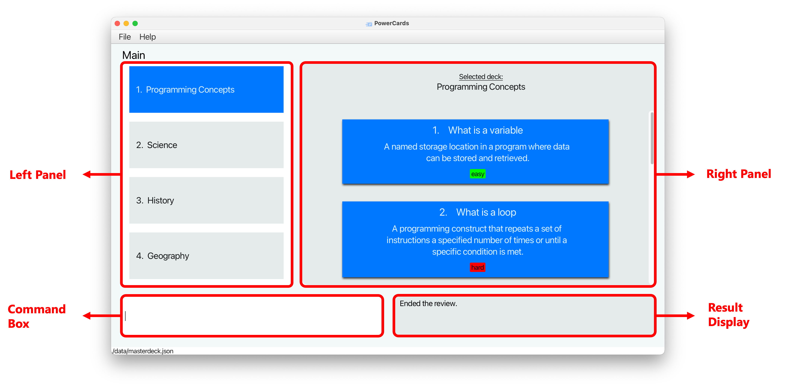
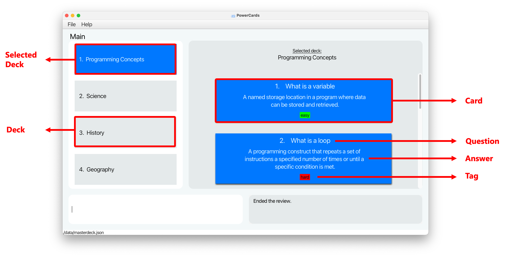

# Introduction

Welcome to PowerCards, a **lightweight flashcard application** that helps students streamline their learning process, enabling faster mastery of course materials through the use of flashcards _(which we will simply refer as **cards** from now on)_.
As a university student, you can capitalise on our **powerful card management system** and **minimalist interface** to create multiple decks of cards quickly to manage your course content and spend more time on learning instead.

This user guide will help you use PowerCards with ease and integrate it into your learning workflow in no time. It explains the key features of PowerCards and provides guidance on how to use them effectively to meet your specific learning needs.

* Table of Contents
{:toc}

--------------------------------------------------------------------------------------------------------------------

## How to use the User Guide

* For a quick and easy way to **get started** with PowerCards, you can visit the [Quick Start](#quick-start) section.
* To **understand the terms** we use in PowerCards, you can visit the [Key Terms](#key-terms) section.
* To learn about the **features** that PowerCards provides and how to use them, you can visit the [Features](#features) section.
* Having **issues**? Check out the [FAQ](#faq) section and see if you can find your solutions there!
* Have a **question** for us or require our **assistance**? Feel free to [contact us](#contact-us), and we will do our best to assist you!

**:bulb: Tip:** 
* There's a lot of information in this guide, so it's a good idea to skim through the contents first. This will give you a better understanding on how PowerCards works. Then, you can dive into the sections that interest you the most. We hope this approach will make it easier for you to digest the content.

## Components of PowerCards

## Description of the components

| Component          | Description                                                                                                  |
|--------------------|--------------------------------------------------------------------------------------------------------------|
| **Left Panel**     | This shows either a **list of decks** or the **current review statistics** depending on the mode you are in. |
| **Right Panel**    | This shows either a **list of cards** or the **current card in review** depending on the mode you are in.    |
| **Command Box**    | This is where you enter your **commands**.                                                                   |
| **Result Display** | This is where the **results** of your commands will be shown.                                                |

## Quick Start

1. Ensure you have Java `11` or above installed in your Computer. If you don't have it, you can download and install it by clicking here (for [Windows]([url](https://docs.oracle.com/en/java/javase/11/install/installation-jdk-microsoft-windows-platforms.html#:~:text=the%20JDK%20Silently-,Downloading%20the%20JDK%20Installer,patch_windows%2Dx64_bin.exe%20.)) users) or here (for [Mac]([url](https://docs.oracle.com/en/java/javase/11/install/installation-jdk-macos.html)) users).

2. Download the latest `powercards.jar` from [here](https://github.com/AY2223S2-CS2103T-W11-3/tp/releases).

3. Copy the file to the folder you want to use as the _home folder_ for your PCs.

4. Open a command terminal, enter the folder you put the jar file in using the `cd` command, and use the `java -jar powercards.jar` command to run the application. 
   A GUI similar to the below should appear in a few seconds. Note how the app contains some sample data. 
   

5. Type any command in the command box and press Enter to execute it. e.g. typing **`help`** and pressing Enter will open the help window. 

6. Refer to the [Features](#features) below for details of each command.

## Key Terms

### Deck
A deck refers to a collection of flashcards that are organized together based on a specific topic or subject.
For example, you might create a deck of flashcards to study for a math test, with each card containing a different math problem and solution.

### Card
A card refers to a flashcard within a deck. A card contains a question or prompt, and the corresponding answer or solution.
During a review session, the card will only show the question, encouraging you to actively recall the answer.
Once you attempt the question, you can command the card to reveal the answer and test your knowledge.

--------------------------------------------------------------------------------------------------------------------

# Features

## Command Components

This section explains some common components in a command.

| Component                 | Example              | Usage                                                                                                                                                                                                                                                                                                                    |
|---------------------------|----------------------|--------------------------------------------------------------------------------------------------------------------------------------------------------------------------------------------------------------------------------------------------------------------------------------------------------------------------|
| **Parameter**             | `QUESTION`, `ANSWER` | Parameters are placeholders where you have to insert your input.   Suppose `add q\QUESTION a\ANSWER` is a valid command to add a card. You can simply replace `QUESTION` and `ANSWER` with the question and answer of your choice.                                                                               |  
| **Prefix**                | `q\ `, `a\ `, `t\ `  | Prefixes are used to identify the parameters of a command.    For example, prefix `q\ ` identifies the parameter `QUESTION` in the command `add q\QUESTION`.                                                                                                                                                       |
| **Optional Component**    | `[t\TAG]`            | Optional components can be omitted in the certain commands.   For example, `add q\QUESTION a\QUESTION [t\TAG]` is a valid command to add a card.  The first two components `q\QUESTION`, `a\ANSWER` are compulsory. The last component `t\TAG` is optional.                                             |
| **Multi-value Parameter** | `KEYWORDS...`        | These are parameters that can appear **multiple times**.    For example, the command `findCards KEYWORD...` filters all the cards based on the keywords specified.  This means that the parameter `KEYWORD` can: - Appear one time: `findCards cell` - Appear multiple times: `findCards cell biology` | 
| **Index**                 | `INDEX`              | Index refers to the index of the card/deck you want to target from the list. The index must be positive integer (1, 2, 3...).    For example, `deleteDeck 1` deletes the first deck in the deck list.                                                                                                            |
| **Flag**                  | `-e`, `-m`, `-h`     | Flags are used to toggle a particular setting or behavior.   For example, `review 1 -e` lets you review questions in the first deck that are tagged as easy only.                                                                                                                                                |

**:information_source: Notes about the command format:** 

- If a parameter is expected only once in the command, but you specified it multiple times, only the last occurrence of the parameter will be considered.
  e.g. if you specify `q\What is photosynthesis q\What is a cell`, only `q\What is a cell` will be considered.
- Extraneous parameters succeeding commands that do not take in parameters (such as `help`, `list`, `exit` and `clear`) will be ignored. e.g. if the command specified is `help 123`, it will be interpreted as `help`.

## Main Mode

Welcome to the Main Mode of the PowerCards application! This is the default mode you will see when you open the app. 

In the Main Mode, you can quickly and easily create new decks, add new cards to your decks, delete and modify existing cards or decks as needed, and more!

| Component         | Description                                                                                                                    |
|-------------------|--------------------------------------------------------------------------------------------------------------------------------|
| **Deck**          | A **deck** contains a list of **cards**. The existing decks are displayed in the left panel.                                   |
| **Selected Deck** | The **deck** currently selected. The cards in this deck are displayed in the right panel.                                      |
| **Card**          | A card contains a question, an answer and an optional difficulty tag.                                                          |
| **Question**      | The question that you assign to the card.                                                                                      |
| **Answer**        | The corresponding answer to the question.                                                                                      |
| **Tag**           | The tag indicating the difficulty level of the card, based on your evaluation. Each card can only be tagged with 1 difficulty. |

## Main Mode - Before Selecting a Deck

### Adding a new Deck : `addDeck`

Before you can add any cards, you must first create a deck. Creating a deck is done through the simple command below. 

Format: `addDeck DECK_NAME`
- `DECK_NAME` is the name of the deck you want to create. 
  - Deck name cannot be duplicated, e.g., if you already have a deck named Science, you cannot create another Science deck.
  - You do not need any prefix before deck name.

Example:
* `addDeck Science` will create a deck titled Science.

### Editing a Deck : `editDeck`

You just created a deck, but you realised you made a typo! Fret not, you can easily edit the name of the deck with this command.  

Editing a deck name will not affect the cards stored inside it.

Format: `editDeck INDEX DECK_NAME`
- `INDEX` is the index of the deck you want to edit.
- `DECK_NAME` is the new name you want to assign to the specified deck.
  - The new deck name cannot be the name of an existing deck.

Example: 
- `editDeck 1 Chemistry` will edit the name of the first deck in the deck list to Chemistry.

### Deleting a Deck : `deleteDeck`

Once you have no use for a deck, you can delete the deck and all the cards within it with this command.  

Be careful, a deck once deleted cannot be retrieved! 

Format: `deleteDeck INDEX`
- `INDEX` is the index of the deck in the deck list.

Example: `deleteDeck 1` deletes the deck at index 1 and all the cards in deck 1. 

### Selecting a Deck : `selectDeck`

Once you have created your deck, you can access the list of cards inside it with this command. 
Refer to the [Main Mode - After Selecting a Deck](#Main-Mode---After-Selecting-a-Deck) section to find out what commands you can run with a deck selected!

Format: `selectDeck INDEX`
- `INDEX` is the index of the deck in the deck list.

Examples:
* `selectDeck 2` will select the deck at index 2. 
  * The cards in this deck (if exist) will be displayed on the right panel. 

## Main Mode - After Selecting a Deck

With a deck selected, you can see all the cards in the deck on the right panel! 
Now you can `addCard`, `deleteCard`, `editCard` or `findCards` in the deck.

You will not be able to make any deck-related changes (e.g. `addDeck`, `deleteDeck`) until you unselect the current deck.

### Unselecting a Deck : `unselectDeck`

Unselects the currently selected deck. 
Refer to the [Main Mode - Before Selecting a Deck](#Main-Mode---Before-Selecting-a-Deck) section to find out what commands you can run without a deck selected!

Format: `unselectDeck`

### Adding a Card: `addCard`

Adds a card to the **selected** deck.

Format: `addCard q\QUESTION a\ANSWER [t\TAG]`

<!-- 
:bulb: **Tip:**
Tagging is optional and should be of value Easy, Medium, or Hard.

 -->

Examples:
* `add q\What is chemical symbol for Oxygen? a\O`
* `add q\What is gravity? a\A force of attraction between objects due to their mass t\Easy`

### Deleting a Card : `deleteCard`

Deletes an existing card from the **selected** Deck. 

:exclamation: **Caution:**
Note that this is irreversible!

Format: `deleteCard INDEX`

* Deletes the card at the specified `INDEX`. The card's index can be found in the displayed card list.

Example:
- `deleteCard 2`

### Editing a Card : `editCard`

Edits an existing card in the **selected** Deck.

Format: `editCard INDEX [q\QUESTION] [a\ANSWER] [t\TAG]`

* Edits the card at the specified `INDEX`. The card's index can be found in the displayed card list.
* At least one of the optional fields must be provided.
* Existing values will be updated to the input values.

Examples:
*  `editCard 1 q\What is chemical symbol for Carbon? a\C` Edits the question and answer of the 1st card to be `What is chemical symbol for Carbon?` and `C` respectively.

### Finding Cards by Keywords in Question : `findCards`

Show only cards in the **selected** Deck with questions containing any of the given keyword(s).
Note that the find function does not support partial words.

Format: `findCards KEYWORD...`
- You can include multiple KEYWORDS - as long as a card's question contains at least one keyword, the card will be found
- At least one KEYWORD must be given.

### Showing all Cards : `showCards`

Show all the cards in the **selected** Deck.

Format: `showCards`

### Clearing the data : `clear`

Clears existing decks and cards.

:exclamation: **Caution:**
Note that this is irreversible!

Format: `clear`

## Before entering Review Mode

### Setting the Limit of Cards per Review: `setLimit`

Suppose you have a really long deck of cards but you only want to test yourself on 20 cards this session, use this function to set an upper limit on the number of cards per review.
While a limit is set, the review deck will be truncated to the card limit. 

You can set the limit back to 'none' to view all cards in the deck for future reviews.

Format: `setLimit LIMIT_NUM` or `setLimit none`
- LIMIT_NUM is a non-zero positive integer

Examples:
* `setLimit 30`
* `setLimit none`

--------------------------------------------------------------------------------------------------------------------

## Review Mode

Once ready, you can enter the Review Mode to test yourself on the cards of a deck. You can also specify the difficulties of the cards of the deck you want to test - e.g. you just want test medium and hard cards only.

In the review mode, you will see:
- On the left panel - updated statistics of the current review (current deck, current card number, number of cards tagged each difficulty) and a navigation guide of the keys.
- On the right panel - the card that is currently under review, which you can flip to reveal the answer and then tag with a given difficulty.

To review a card, you can attempt the question on the card (in your mind or on a paper if you prefer!) before flipping it. 

Flipping a card reveals the answer - based on how close your guess was to the answer or how confident you were when attempting, you can tag the card with a difficulty of easy, medium or hard.

Your goal would be to eventually have all cards in a deck be tagged as easy!

### Starting a Review: `review`
From the Main Mode, run this command to enter the Review Mode!

Format: `review INDEX [-e] [-m] [-h]`

* Reviews the cards from the deck with the specified INDEX. The deck's index can be found in the displayed deck list.
  - `-e` include this flag to test cards tagged as "easy"
  - `-m` include this flag to test cards tagged as "medium"
  - `-h` include this flag to test cards tagged as "hard"
  - Omit any flags to test all cards in the deck

Examples:
* `review 5 -e -h`
* `review 2`

### Ending the Review: `endReview`

Ends the review and returns to the main mode. You can use this when you reach the end of the review deck or at any point during the review.

Format: `endReview`

### Review Keystrokes

The diagram above shows the keystrokes you will use to interact with the cards in the Review mode. 
Notice that the keys are all close to the enter key so that you can breeze through decks of cards with ease!
- The top row of keys are commands to flip cards, or move to the previous/next cards. 
- The bottom row of keys are commands to tag the difficulty of the current card.

### Flipping the Card: `p`

Flips the card to reveal the answer. 

Format: `p`

### Next Card: `]`

Displays the next card. After tagging the current card, you use this command to move on to the next card.

Format: `]`

### Previous Card: `[`

Displays the previous card. Useful if you want to amend the tag of the previous card!

Format: `[`

### Tagging the Card as Easy: `l`

Tags the current card as easy. This replaces any previous tags.

Format: `l`

### Tagging the Card as Medium: `;`

Tags the current card as medium. This replaces any previous tags.

Format: `;`

### Tagging the Card as Hard: `'`

Tags the current card as hard. This replaces any previous tags.

Format: `'`

--------------------------------------------------------------------------------------------------------------------

### Viewing help : `help`

If you are unsure about how to use PowerCard, you can always execute this command.
This command creates a pop-up with a link to this User Guide, where you can access clear and concise instructions for each command and features of the app.

[//]: # (![help message]&#40;images/helpMessage.png&#41;)

Format: `help`

### Exiting the program : `exit`

At any point, run this command to exit the programme.

Format: `exit`

--------------------------------------------------------------------------------------------------------------------

### Saving the data

PCs data are saved in the hard disk automatically after any command that changes the data. There is no need to save manually.

### Editing the data file

PCs data are saved as a JSON file `[JAR file location]/data/masterdeck.json`. Advanced users are welcome to update data directly by editing that data file.

:exclamation: **Caution:**
If your changes to the data file makes its format invalid, PowerCards will discard all data and start with an empty data file at the next run.

### Archiving data files `[coming in v2.0]`

_Details coming soon ..._

--------------------------------------------------------------------------------------------------------------------

## FAQ

**Q**: How do I transfer my data to another Computer? 
**A**: Install the app in the other computer and overwrite the empty data file it creates with the file that contains the data of your previous PCs home folder.

**Q**: Will my data be automatically saved? 
**A**: **Yes**, PowerCards automatically saves your data after every command entered.

**Q**: Where is my data saved? 
**A**: Go to where you have downloaded your `powercards.jar` file, there a `/data` folder will be created and the data will be saved under `powercards.json`.

**Q**: Can I rename my saved data file? 
**A**: **No**, PowerCards currently only supports the use of `powercards.json` as the name of the saved data file.

--------------------------------------------------------------------------------------------------------------------

## Command Summary

### Main Mode - before selecting a Deck

| Action         | Format, Examples                                             |
|----------------|--------------------------------------------------------------|
| Select Deck    | `selectDeck INDEX`   e.g., `selectDeck 2`               |
| Add Deck       | `addDeck DECK_NAME`   e.g., `addDeck Science`           |
| Edit Deck      | `editDeck INDEX DECK_NAME`   e.g., `editDeck 3 Physics` |
| Delete Deck    | `deleteDeck INDEX`                                           |
| Find Decks     | `findDecks KEYWORDS...`                                      |
| Show All Decks | `showDecks`                                                  |
| Start Review   | `review INDEX`                                               |
| Set Limit      | `setLimit LIMIT_NUM`   e.g., `setLimit 30`              |
| Clear          | `clear`                                                      |
| Help           | `help`                                                       |
| Exit           | `exit`                                                       |

### Main Mode - after selecting a Deck

| Action         | Format, Examples                                                                                                                                 |
|----------------|--------------------------------------------------------------------------------------------------------------------------------------------------|
| Unselect Deck  | `unselectDeck`                                                                                                                                   |
| Add Card       | `addCard q\QUESTION a\ANSWER [t\TAG]`   e.g., `addCard q\What is gravity? a\A force of attraction between objects due to their mass t\Easy` |
| Edit Card      | `editCard INDEX [q\QUESTION] [a\ANSWER] [t\TAG]`   e.g., `editCard 1 q\What is chemical symbol for Caarbon? a\C t\Hard`                     |
| Delete Card    | `deleteCard INDEX`                                                                                                                               |
| Find Cards     | `findCards KEYWORDS...`                                                                                                                          |
| Show All Cards | `showCards`                                                                                                                                      |
| Start Review   | `review INDEX`                                                                                                                                   |
| Set Limit      | `setLimit LIMIT_NUM`   e.g., `setLimit 30`                                                                                                  |
| Clear          | `clear`                                                                                                                                          |
| Help           | `help`                                                                                                                                           |
| Exit           | `exit`                                                                                                                                           |

### Review mode

| Action        | Format, Examples |
|---------------|------------------|
| End Review    | `endReview`      |
| Flip          | `p`              |
| Previous Card | `[`              |
| Next Card     | `]`              |
| Tag Easy      | `l`              |
| Tag Medium    | `;`              |
| Tag Hard      | `'`              |
| Help          | `help`           |
| Exit          | `exit`           |
