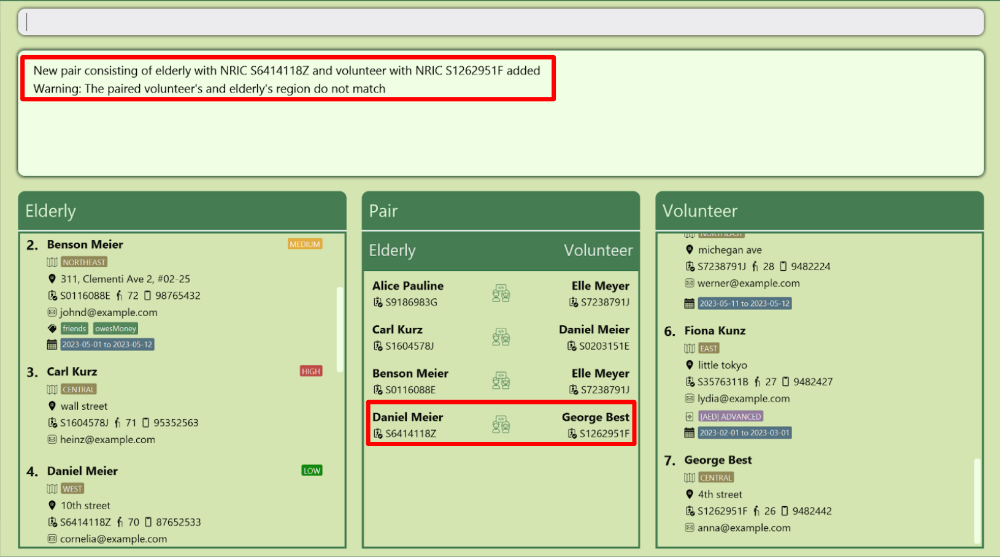
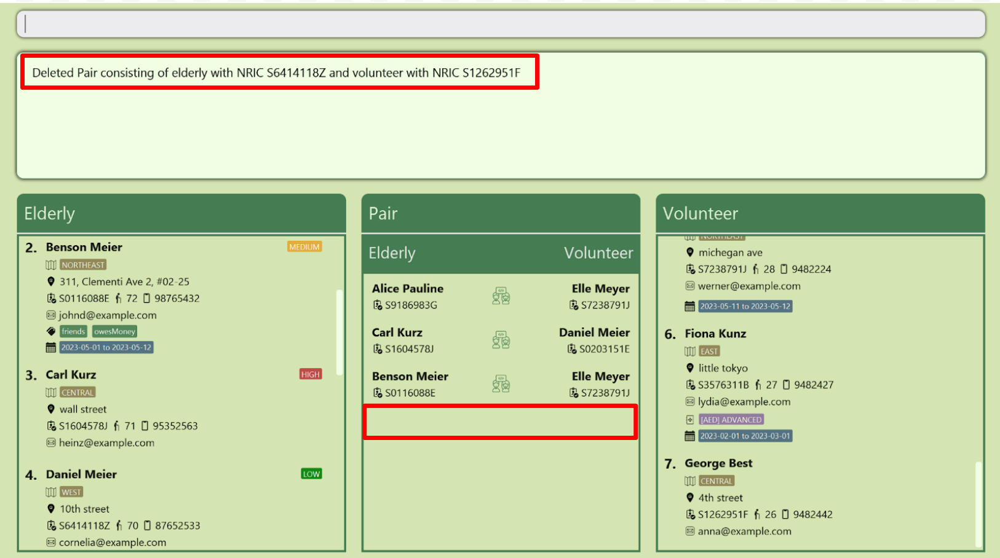
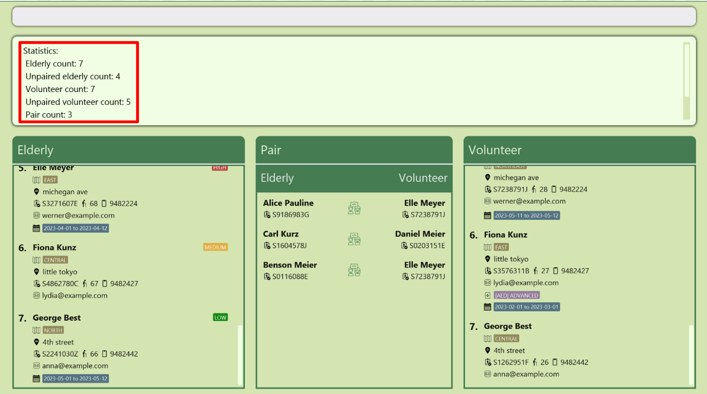
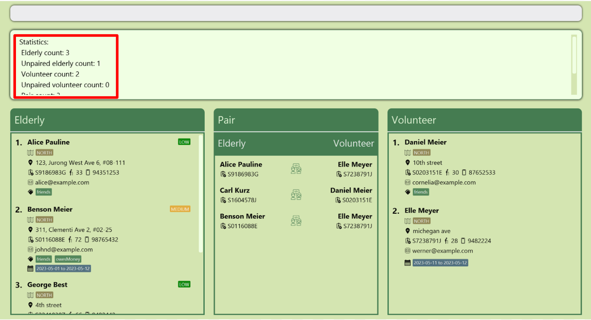

## Table of Contents
{:.no_toc}

* Table of Contents
{:toc}

----------------------------------------------------

## Introduction
FriendlyLink **streamlines volunteer and elderly management** for single administrators of small VWOs. With FriendlyLink, administrators such as yourself can easily manage your database and pair volunteers with the elderly as you wish, all through an intuitive, user-friendly interface. Our goal is to make volunteer and elderly management simple, efficient, and effective, so that you can focus on making a difference in your communities.

With its easy-to-use **text-based interface** and contact management features, say goodbye to manual record-keeping and hello to a more efficient and organised way of managing the volunteers’ and elderly’s contact details.

With FriendlyLink, you can record elderly and volunteer information and pair them up automatically. You can also update and delete records easily, and see a summary of all records in FriendlyLink!

----------------------------------------------------

## Before you Begin

Please read this and [Quick Start](#quick-start) before skipping to specific parts ahead.

### How to use this User Guide

This guide aims to quickly get you started in using and navigating FriendlyLink.

We suggest reading this guide in sequential order (or at least the [Terminology](#terminology) section) to familiarise yourself with the keywords used in this guide in the glossary and differently styled text which have special meanings.

If you are already familiar with the [Terminology](#terminology),  you might want to go ahead to see the [Quick Start](#quick-start) guide, [Features](#features) explained with examples, or [Fields](#fields) and their specification (Such as Email, phone numbers and addresses). All terms used are summarised in the [Glossary](#glossary)

You may see the following icons throughout our user guide, which are styled differently according to their purpose.

#### Information Box

<div markdown="span" class="alert alert-info">:information_source: **Info:**
This provides some additional information that you are recommended to know.
</div>

#### Tip Box

<div markdown="block" class="alert alert-primary">:bulb: **Tip:**
This provides some quick and convenient hacks that you can use to optimize your experience with FriendlyLink.
</div>

#### Danger Box

<div markdown="block" class="alert alert-danger">:exclamation: **Warning:**
Danger zone! Do pay attention to the information here carefully.
</div>

#### Code highlight

`Highlights` are used to denote specific terms, commands or output from the application.

* Highlighted commands consists special characters or capitalisation, which have special meaning.
    * Words that are `CAPITALISED` are placeholders that should be replaced by you.<br>
      E.g. in `add n/NAME`, `NAME` should be replaced with actual information `add n/John Doe`.

    * Items in `[square brackets]` are optional.<br>
      E.g. `n/NAME [t/TAG]` can be entered as `n/John Doe t/friend` or just `n/John Doe`.

    * Items in `<angled brackets>` are the [preamble](#preamble).
      E.g. `edit_elderly <NRIC> n/NAME ...` can be entered as `edit_elderly S1234567A n/John Doe`.
      In some cases, they are also specified as `<[PREAMBLE]>` which indicates that the preamble is optional.

    * Items with `[ellipsis]…` after them can be entered 0 or more times.<br>
      E.g. `add_elderly n/NAME [t/TAG]…` can be entered as `add_elderly n/John Doe` (no tags included), `add_elderly n/John Doe t/friend` (1 tag), `add_elderly n/John Doe t/friend t/family` (2 tags) and more.

#### Icons

The following icons are used in FriendlyLink. For more information about what they represent, refer to the [Fields](#fields) section.

 : Available dates<br />

 : Region<br />

 : Address<br />

 : NRIC<br />

 : Age<br />

 : Phone number<br />

 : Email<br />

 : Tags<br />

 : Medical Qualifications<br />

### Terminology

The following terms are commonly used in this guide.

#### Command
A command is an instruction given by you to FriendlyLink to perform a specific task. For example, `add_elderly n/John Doe ...` tells FriendlyLink to record the information of a new person in FriendlyLink. More details about each command is given in the [Features](#features) section.

#### Prefix
Prefix refers to characters appearing before a slash in a command. Prefixes label the information that they represent. For example, the add elderly command `add_elderly ic/S1234567A ...` contains the prefix `ic` to indicate that the text that follows is the NRIC of the elderly.
* Prefixes should be entered in all **lower case** (E.g. n/Abdul instead of N/Abdul)
* Fields after prefixes have leading and trailing whitespaces removed (E.g. `n/ Mary` is trimmed to `n/Mary`)

#### Field
Field refers to information following a slash in a command, providing information to the relevant prefix, such as indicating a volunteer's name, phone number, email and other information.
* For example, `add_elderly n/John Doe ic/...` has the prefix `n` followed by a slash, followed by the field `John Doe`. This tells FriendlyLink to record the newly added elderly with the name `John Doe`.
* Fields can be entered in any order.
    * E.g. Specifying `n/John Doe p/97129078` or `p/97129078 n/John Doe` is acceptable.
* If a field is expected only once in the command, but you specify it multiple times, only the last occurrence of the field will be taken.<br>
    * E.g. If you specify `p/12341234 p/56785678`, only `p/56785678` will be taken.
* Extraneous fields for commands that do not take in fields (such as `help`, `list`, `exit` and `clear`) will be ignored.<br>
    * E.g. If you specify `help 123`, it will be interpreted as `help`.
* For more information on each specific field, refer to the [Fields](#fields) section

#### Preamble
Preamble is a special piece of information specified for certain commands that are entered without prefixes.
* They need to be specified right after the [command](#command) word and before any other [Fields](#field).
  * For example, `edit_elderly S1234567A n/John Doe` has the preamble `S1234567A`
  * On the other hand, specifying `edit_elderly n/John Doe S1234567A` is invalid as the preamble `S1234567A` has to come before all other fields.

#### Duplicate Entry
* Person (Elderly and Volunteers)
  * Two persons having the same [NRIC](#nric) are considered the same person and therefore a duplicate entry in FriendlyLink, and is not allowed.
  * The same person in FriendlyLink cannot be both an elderly and a volunteer at the same time.
* Pair
  * Two pairs having the same elderly and volunteer are considered a duplicate entry in FriendlyLink, and is not allowed.

[Back to top](#table-of-contents)

-------------------------------------------

## Quick Start

<div markdown="block" class="alert alert-danger">:exclamation: **Notes on display resolution**

FriendlyLink is designed to work best on a display resolution of 1920 X 1200 and a display zoom of 125%.
It is recommended that you switch to this resolution before using FriendlyLink.

</div>

1. Ensure you have [Java 11](https://www.oracle.com/sg/java/technologies/javase/jdk11-archive-downloads.html) installed in your Computer.

1. Download the latest `friendlylink.jar` from [here](https://github.com/AY2223S2-CS2103T-W12-1/tp/releases).

1. Move the `friendlylink.jar` to an empty folder where you want FriendlyLink to store information.

1. Double-click on the `friendlylink.jar` file. If the app does not open, follow the following steps instead.
    * Open a terminal
      * On **Windows**: Click Start and search for `Command Prompt`
      * On **macOS**: Open Launchpad and search for `terminal`
    * Move into the folder you are keeping FriendlyLink by entering `cd FILE/PATH/TO/FRIENDLYLINK` into the terminal
    * Open the app by entering `java -jar friendlylink.jar` into the terminal.
   
   The main window should appear in a few seconds.
   

1. Type the command in the command box and press Enter to execute it. E.g. typing **`help`** and pressing Enter will open the help window.<br>
   Some example commands you can try:

    * `add_elderly n/John Doe ic/S1234567A bd/1959-09-09 re/WEST r/LOW` : [Adds an elderly](#adding-an-elderly--addelderly) named `John Doe`with [NRIC](#nric) 
`S1234567A` to FriendlyLink, whose birthday is `1959-09-09`, lives in the `WEST` [region](#region) and has `LOW` [risk level](#risk-level).

    * `delete_elderly S1234567A` : [Deletes the elderly](#deleting-an-elderly--deleteelderly) with [NRIC](#nric) `S1234567A`.

    * `exit` : [Exits](#exiting-the-program--exit) the app.

1. Refer to the [Features](#features) below for details of each command.

<div markdown="block" class="alert alert-danger">:exclamation: **Opening multiple instances of the application**

Please ensure that you only have **one** running instance of the application. 
Opening multiple instances may result in unexpected behaviours.

</div>

[Back to top](#table-of-contents)

-------------------------------------------

## Features

### Adding records

Adds an elderly, a volunteer, or a pairing between one elderly and one volunteer to FriendlyLink.

#### Adding an elderly: `add_elderly`

Adds an elderly to FriendlyLink.

Format: `add_elderly n/NAME ic/NRIC bd/BIRTH_DATE [re/REGION] [r/RISK_LEVEL] [p/PHONE] [e/EMAIL] [a/ADDRESS] [t/TAG]… [dr/AVAILABLE_DATE_START, AVAILABLE_DATE_END]…`

* Every elderly must have a unique [NRIC](#nric).
* `AVAILABLE_DATE_START, AVAILABLE_DATE_END` represents the start and end of the [dates](#date) that the elderly is available.

<div markdown="span" class="alert alert-info">:information_source: **Info:**

An elderly can have any number of [tags](#tags) and available dates.

</div>

Examples:
* `add_elderly n/Betsy Crowe p/98765432 a/John street ic/S5034567C bd/1950-02-03 r/HIGH` adds an elderly named `Betsy Crowe` with [NRIC](#nric)
  `S5034567C` to FriendlyLink, with [birth date](#birthdate) `1950-02-03`, [address](#address) `John street`, [risk level](#risk-level) `HIGH` and [phone number](#phone-number) `98765432`.
* `add_elderly n/Sarah Zest ic/S3334567C bd/1933-02-03` adds an elderly named `Sarah Zest` with [NRIC](#nric)
  `S3334567C` to FriendlyLink, with [birth date](#birthdate) `1933-02-03`.


#### Adding a volunteer: `add_volunteer`

Adds a volunteer to FriendlyLink.

Format: `add_volunteer ic/NRIC n/NAME bd/BIRTH_DATE [re/REGION] [p/PHONE] [e/EMAIL] [a/ADDRESS] [t/TAG]…​ [mt/MEDICAL_QUALIFICATIONS]… [dr/AVAILABLE_DATE_START, AVAILABLE_DATE_END]…​`

* Every volunteer must have a unique [NRIC](#nric).
* `AVAILABLE_DATE_START, AVAILABLE_DATE_END` represents the start and end of the [dates](#available-dates) that the volunteer is available.

<div markdown="span" class="alert alert-info">:information_source: **Info:**

A volunteer can have any number of [tags](#tags), [medical qualifications](#medical-qualification) and [available dates](#available-dates). 

</div>

Examples:

* `add_volunteer n/John Wick bd/1990-11-05 e/johnwick@example.com a/New york p/99887432 ic/S9054567D` adds a volunteer named `John Wick` with [NRIC](#nric)
  `S9054567D` to FriendlyLink, with [birth date](#birthdate) `1990-11-05`, [address](#address) `New york`, [email address](#email) `johnwick@example.com` and [phone number](#phone-number) `99887432`.
* `add_volunteer n/Sally White bd/1989-03-11 ic/S8957677H` adds a volunteer named `Sally White` with [NRIC](#nric)
  `S8957677H` to FriendlyLink, with [birth date](#birthdate) `1989-03-11`.


#### Pair volunteer and elderly: `pair`

Adds a pairing between an existing elderly and volunteer.
This allows you to track which elderly members are assigned to which volunteers.

Format: `pair eic/ELDERLY_NRIC vic/VOLUNTEER_NRIC`

* After pairing, the newly added pairs appear in the pair list in the window.
* Only elderly members and volunteers existing in FriendlyLink's data can be paired.
* [Duplicate pairs](#duplicate-entry) will fail to be added to FriendlyLink.

<div markdown="block" class="alert alert-info">
   
**:information_source: Info**<br>

If the elderly and volunteer to be paired:
  * has clashes in [availability dates](#available-dates); or
  * lives in different [regions](#region)

The pair will be successfully added but a warning will be given.
</div>

Examples:
* `pair eic/s6414118Z vic/S1262951f` pairs up the elderly with NRIC S6414118Z with the volunteer with NRIC S1262951F.
  
* `pair eic/s1135243A vic/S0773423a` pairs up the elderly with NRIC S1135243A with the volunteer with NRIC S0773423A.

#### Auto pairing of volunteers and elderly: `auto_pair`

Automatically pairs all unpaired elderly and volunteers, if possible. This command is intended to give
you a starting point for how the pairs can be formed, and aims to make the manual process of pairing
slightly easier. 

Format: `auto_pair`

* The volunteer and elderly in each pair generated will 
always have **compatible [regions](#region) and [available dates](#date)**.
   * We consider a volunteer/elderly with no specified region to be compatible with _any_ region. Similarly, a volunteer/elderly with no availabilities specified will be considered to be available at _any_ time. 
* In the event that no pairs can be formed satisfying the above constraints 
(either because there are no unpaired volunteers or elderly, or all the unpaired volunteers 
and elderly have incompatible regions or availabilities)
then a simple "_No pairs were formed._" message will be displayed.

<div markdown="block" class="alert alert-info">

**:information_source: How are the volunteers and elderly paired?**<br>

* The volunteers and elderly are paired in a _greedy_ manner: FriendlyLink essentially matches each unpaired volunteer
with the first unpaired elderly that is compatible with it. 
* Furthermore, the pairs will be **one-to-one** i.e. every unpaired volunteer will be paired with at most
one unpaired elderly, and vice versa.
* This approach will not necessarily maximise the number of possible pairs, but it should serve as a good
starting point.

</div>

[Back to top](#table-of-contents)

-------------------------------------------

### Editing records

Edits the information of an existing elderly or volunteer in FriendlyLink, based on their [index](#index) or [NRIC](#nric).

#### Editing an elderly by index : `edit_elderly`

Edits an existing elderly based on their [index](#index) in the elderly list.

Format: `edit_elderly <INDEX> [n/NAME] [ic/NRIC] [p/PHONE] [e/EMAIL] [a/ADDRESS] [bd/BIRTH_DATE] [re/REGION] [r/RISK_LEVEL] [t/TAG]… [dr/AVAILABLE_DATE_START, AVAILABLE_DATE_END]…`

* Edits the elderly at the specified `INDEX` in the displayed elderly list.
* Any combination of the optional fields is possible but **at least one** optional field must be specified. 
* Existing values will be updated to the input values.

<div markdown="block" class="alert alert-danger">:exclamation: **Warning**

When editing fields allowing multiple inputs, the existing contents of the field will be removed. i.e. editing of [tags](#tags) or [available dates](#available-dates) will overwrite previous ones instead of being cumulative.

</div>

<div markdown="span" class="alert alert-primary">:bulb: **Tip:**

You can remove all the elderly’s tags by typing `t/` without specifying any tags after it. Available dates have the same behaviour if you type `dr/`.

</div>

Examples:
* `edit_elderly 1 p/91234567 e/johndoe@example.com` edits the [phone number](#phone-number) and [email address](#email) of the 1st elderly to be `91234567` and `johndoe@example.com` respectively.
* `edit_elderly 2 n/Betsy Crower t/` edits the name of the 2nd elderly to be `Betsy Crower` and clears all existing [tags](#tags).

#### Editing a volunteer by index: `edit_volunteer`

Edits an existing volunteer based on their [index](#index) in the volunteers list.

Format: `edit_volunteer <INDEX> [n/NAME] [ic/NRIC] [p/PHONE_NUMBER] [e/EMAIL] [a/ADDRESS] [bd/BIRTH_DATE] [re/REGION] [mt/MEDICAL_QUALIFICATIONS]… [t/TAG]… [dr/AVAILABLE_DATE_START, AVAILABLE_DATE_END]…`

* Edits the volunteer at the specified `INDEX` in the displayed volunteer list. 
* Any combination of the optional fields is possible but **at least one** optional field must be specified.
* Existing values will be updated to the input values.

<div markdown="block" class="alert alert-danger">:exclamation: **Warning**

When editing fields allowing multiple inputs, the existing contents of the field will be removed. i.e. editing of [tags](#tags), [medical qualifications](#medical-qualification) or [available dates](#available-dates) will overwrite previous ones instead of being cumulative.

</div>

<div markdown="span" class="alert alert-primary">:bulb: **Tip:**
You can remove all the volunteer’s tags by typing `t/` without specifying any tags after it. Available dates and medical qualifications have the same behaviour if you type `dr/` and `mt/` respectively.
</div>

Examples:

* `edit_volunteer 1 p/91234567 e/johndoe@example.com` edits the [phone number](#phone-number) and [email address](#phone-number) of the 1st volunteer to be `91234567` and `johndoe@example.com` respectively.
* `edit_volunteer 2 n/Betsy Crower mt/` edits the name of the 2nd volunteer to be `Betsy Crower` and clears all existing [medical qualifications](#medical-qualification).
* `edit_volunteer 3 mt/CPR, BASIC mt/CARETAKING, ADVANCED` replaces all existing [medical qualifications](#medical-qualification) of the 3rd volunteer with `CPR, BASIC` and `CARETAKING, ADVANCED`.

#### Editing a person by NRIC: `edit`

Edits an existing elderly or volunteer identified by their [NRIC](#nric).

Format: `edit <NRIC> [n/NAME] [ic/NRIC] [p/PHONE] [e/EMAIL] [a/ADDRESS] [bd/BIRTH_DATE] [re/REGION] [r/RISK_LEVEL] [mt/MEDICAL_QUALIFICATIONS]… [t/TAG]… [dr/AVAILABLE_DATE_START, AVAILABLE_DATE_END]…`

* Edits the person identified by `NRIC`. As [duplicate records](#duplicate-entry) of people are not allowed in FriendlyLink, one `NRIC` uniquely identifies one elderly or volunteer.
* Any combination of the optional fields is possible but **at least one** optional field must be specified.
* Existing values will be updated to the input values.
* When editing elderly or volunteer-specific fields, if such fields do not match the identity of the target person, the change will be ignored. Example: `edit S1234567A r/LOW` will ignore the change of `RISK_LEVEL` to be `LOW` if `S1234567A` identifies a volunteer 
(as volunteers do not have a [Risk Level](#risk-level)).


<div markdown="block" class="alert alert-danger">:exclamation: **Warning:**
When editing fields allowing multiple inputs, the existing contents of the field will be removed. i.e. editing of [tags](#tags), [medical qualifications](#medical-qualification) or [available dates](#available-dates) will overwrite previous ones instead of being cumulative. 
</div>

<div markdown="span" class="alert alert-primary">:bulb: **Tip:**
You can remove all the person's tags by typing `t/` without specifying any tags after it. Available dates and medical qualifications have the same behaviour if you type `dr/` and `mt/` respectively.
</div>
Examples:

* `edit S2568212B t/Overseas t/Undergrad` replaces all existing [tags](#tags) of the person identified by `S2568212B` with the tags `Overseas` and `Undergrad` 

    **Before editing:**

    

    **After editing:**

    

* `edit S2233556T p/91642345 re/NORTH` edits the [phone number](#phone-number) and [region](#region) of the person identified by `S2233556T` to be `91642345` and `NORTH` respectively.
* `edit S8833657U re/CENTRAL r/HIGH` edits the [region](#region) and [risk level](#risk-level) of the person identified by `S8833657U` to be `CENTRAL` and `HIGH` respectively. However, if `S8833657U` identifies a volunteer, the [risk level](#risk-level) edit will be ignored (since volunteers do not have a risk level).

[Back to top](#table-of-contents)

-------------------------------------------

### Deleting records

Deletes the specific existing elderly or volunteer in FriendlyLink with the given [NRIC](#nric).

#### Deleting an elderly: `delete_elderly`

Deletes the specified elderly from FriendlyLink.

Format: `delete_elderly <NRIC>`

* Deletes the elderly with the specified [NRIC](#nric).
* If no existing elderly matches the specified `NRIC`, FriendlyLink will inform the user that no such elderly exists.
* If the deleted elderly has existing pairings, the corresponding volunteer will be unpaired.

Examples:
* `delete_elderly S8238657A` deletes an existing elderly with NRIC `S8238657A`, as well as all the pairings containing this elderly.

#### Deleting a volunteer: `delete_volunteer`

Deletes the specified volunteer from FriendlyLink.

Format: `delete_volunteer <NRIC>`

* Deletes the volunteer with the specified [NRIC](#nric).
* If no existing volunteer matches the specified `NRIC`, FriendlyLink will inform the user that no such volunteer exists.
* If the deleted volunteer has existing pairings, the corresponding elderly will be unpaired.

Examples:
* `delete_volunteer S8238658J` deletes an existing volunteer with NRIC `S8238658J`, as well as all the pairings containing this volunteer.

#### Unpair volunteer and elderly: `unpair`

Unpairs an elderly from its assigned volunteer.
This deletes the pair while still keeping the elderly and volunteer in FriendlyLink.

Format: `unpair eic/ELDERLY_NRIC vic/VOLUNTEER_NRIC`

* After deletion, the pair is removed from the list of pairs in the window.

Examples
* `unpair eic/s6414118Z vic/S1262951f` unpairs the elderly with NRIC S6414118Z with the volunteer with NRIC S1262951F.
  
  **Before unpairing:**

  
  
  **After unpairing:**

  

* `unpair eic/s1135243A vic/S0773423a` unpairs the elderly with NRIC S1135243A with the volunteer with NRIC S0773423A.

[Back to top](#table-of-contents)

-------------------------------------------

### Finding records

Finds the information of an existing elderly, volunteer or pairs in FriendlyLink, based on some keywords or conditions.

#### Finding people and their related pairs: `find`

Finds any elderly or volunteers matching **all** the relevant specified fields, and pairings that they are involved in.

Format: `find [n/NAME] [ic/NRIC] [p/PHONE_NUMBER] [e/EMAIL] [a/ADDRESS] [bd/BIRTH_DATE] [re/REGION] [r/RISK_LEVEL] [mt/MEDICAL_QUALIFICATIONS] [t/TAG]… [dr/AVAILABLE_DATE_START, AVAILABLE_DATE_END]…`

* The fields are optional so any combination of them is possible but **at least one** field must be specified.
* The search is case-insensitive for all fields. E.g. `jANe` will match `Jane`.
* Elderly specific fields will not be searched for in the volunteer list and vice versa.
  * `find r/HIGH` will show all volunteers since volunteers do not contain [risk level](#risk-level) field.
  * `find mt/cpr, basic` will show all elderly since elderly do not contain [medical qualifications](#medical-qualification) field.
* `[n/NAME]` `[ic/NRIC]` `[p/PHONE_NUMBER]` `[e/EMAIL]` `[a/ADDRESS]` `[t/TAG]` need not be specified in full E.g. `Joh` for the `n/NAME` field will match `John` and `John Doe`.
  * Such fields can contain any value but cannot be empty.
* `[r/RISK_LEVEL]`, `[bd/BIRTH_DATE]`, `[re/REGION]` and `[dr/AVAILABLE_DATE_START, AVAILABLE_DATE_END]` are required to be fully specified.
* `[dr/AVAILABLE_DATE_START, AVAILABLE_DATE_END]` will find any [date range](#available-dates) that contains the specified range.
  * People with no dates will be found because having no dates means that they are available all the time.
* For `[mt/MEDICAL_QUALIFICATIONS]` you can either specify just the type E.g. `mt/cpr` or the type and its level separated by comma E.g. `mt/cpr, basic`.
    * The type need not be specified in full, so it can contain any non-empty value.
    * Qualification level needs to be fully specified if present.

Examples:
* `find n/john` finds all volunteers or elderly whose name contains `john`.
* `find re/NORTH t/lonely` finds all volunteers or elderly who has the region `NORTH` and tag containing `lonely`.

#### Listing persons: `list`

Shows a list of all persons in FriendlyLink or paired and unpaired persons if specified.
* If `PAIRED` or `UNPAIRED` keyword is not specified, this command helps you to easily see all the elderly, volunteer and pairs in the database, especially if you want to revert to the full list after filtering the list with the `find` command.
* If `PAIRED` or `UNPAIRED` keyword is specified, it allows you to quickly view the persons who are paired or not paired, therefore helps the decision-making.

Format: `list <[PAIRED \ UNPAIRED]>`

* `<[PAIRED \ UNPAIRED]>` indicates that either "paired" or "unpaired" can be specified after the list command.
    * If "paired" or "unpaired" is not specified, all persons will be listed.
* The preamble is case-insensitive E.g. `pAIReD` is equivalent to `paired`.
* Pair list will always list all pairs when the command executes.

<div markdown="span" class="alert alert-primary">:bulb: **Tip:**

`list` is useful if you want to see all persons and pairs after they have been filtered by the [find](#finding-records) command.

</div>

Examples:
* `list` lists all elderly, volunteers and pairs.
* `list paired` lists all paired elderly, paired volunteers and all pairs.
* `list unpaired` lists all unpaired elderly, unpaired volunteers.

[Back to top](#table-of-contents)

-------------------------------------------

### Command Recommendation

FriendlyLink provides command recommendations for registered [commands](#command) and [field's](#field) [prefixes](#prefix).
Autocompletion and command recommendation are crucial features that help to improve the user experience when interacting
with our application. 


For example, when adding an elderly, the recommendation engine will automatically recommend all available field prefixes.
No new suggestions will be given once all possible prefixes has at least one value provided. If the user continues
to specify more attributes like `t/`, the recommendation will be done on a case-by-case basis.

Example:

* Typing `add_volunteer n/Harry p/12345686 `, FriendlyLink will
  suggest `ic/NRIC bd/BIRTH_DATE re/[REGION] a/[ADDRESS] e/[EMAIL] mt/[MEDICAL_QUALIFICATION] dr/[AVAILABLE_DATE_START, AVAILABLE_DATE_END] t/[TAG]` as
  these fields have not been filled.
* Typing `add_volunteer n/Betsy p/1234567 e/test@test.com a/Linken Drive bd/1990-01-01 ic/S8959886I re/NORTH t/experienced mt/CPR,ADVANCED dr/2023-06-03,2023-06-17`
  will not suggest anything by default as all possible fields have at least one value.

<div markdown="block" class="alert alert-info">

**:information_source: Notes on Command Recommendation**<br>

* When invalid inputs are detected, the text field will turn red, indicating a warning. You are, however, free to continue typing.
* You can see the warning in the terminal used to open this application.

</div>

[Back to top](#table-of-contents)

---------------------------------------

### Show Summary Statistics: `stats`

Shows the statistics of FriendlyLink.

This shows the total number of elderly, volunteers and pairs. It also shows the maximum number of elderly paired to each volunteer and vice versa.
This command can be entered after the [find](#finding-records) command to show statistics on a subset of data (E.g. Find statistics of people in a particular region)

Format: `stats`

* The summary is shown below.
  

Examples
* `stats` Display summary statistics on every person and pair.

* ```
  find re/NORTH
  stats
  ```
  Display summary statistics for all persons (and associated pairs) living in the north.
  

[Back to top](#table-of-contents)

-------------------------------------------

### Viewing help : `help`

Shows a message explaining how to access the help page.


Format: `help`

### Exiting the program : `exit`

Exits the program.

Format: `exit`

[Back to top](#table-of-contents)

-------------------------------------------

### Saving the data

FriendlyLink data are saved in the hard disk automatically after every command. There is no need to
save manually.

### Editing the data file

FriendlyLink data are saved in the [JSON](#glossary) files `JAR_FILE_LOCATION/data/elderly.json`, `JAR_FILE_LOCATION/data/volunteer.json` and `JAR_FILE_LOCATION/data/pair.json`. Advanced users are welcome to update data directly by editing that data file.

<div markdown="block" class="alert alert-danger">:exclamation: **Warning**

If your changes to the data file makes its format invalid, FriendlyLink will discard all data and start with an empty data file at the next run.
</div>

[Back to top](#table-of-contents)

-------------------------------------------

## Fields
This section describes the format and specifications of each field.

<div markdown="span" class="alert alert-info">:information_source: **Note on character limits** 

There is <em>no</em> max character limit enforced on most fields. The reasoning behind this is that we do not want to unnecessarily restrict you from entering possible long fields (For example, a long name). 
We recommend using entering fields of length at most 100.

</div>

### Name
The name of a person.
* Names should only contain alphanumeric characters and spaces, and it should not be blank.
* Particularly, non-alphanumeric characters or special characters like `/`, `@` and `?` are disallowed.

### Address
The home address of a person.
* Addresses can take any values.

### NRIC
NRIC is a unique identifier given to all Singaporeans.
* NRIC is case-insensitive.
* The structure of the NRIC should be `@XXXXXXX#`, where:
    * `@` is a letter that can be "S", "T", "F", "G", "M"
    * `XXXXXXX` is a 7-digit serial number
    * `#` is a letter from A to Z
* There is no cross validation of birthdate against NRIC (There are no checks for the birth year in first 2 digits of NRIC).

### Index
Indexes are natural numbers (numbers used for counting) that are used for numbering persons in a list.
* An index must be a positive integer (E.g. 1, 2, 3, …​).

### Phone number
The phone number of a person.
* Phone number is strictly numeric (digits from 0 to 9) and have more than or equal to 3 digits.
* Country code like `+65` or `0065` are disallowed. Currently, all phone numbers are assumed to be Singapore phone numbers.

### Email
The email of a person.

Emails should be of the format `local-part@domain` and adhere to the following constraints:

The `local-part` must
* only contain alphanumeric characters and these special characters, excluding the parentheses, (+_.-).
* not start or end with any special characters. 

This is followed by a '@' and then a domain. The domain is made up of alphanumeric domain labels separated by 1 or more periods.

The `domain` must:
* end with a domain label at least 2 characters long
* have each domain label start and end with alphanumeric characters
* have each domain label consist of alphanumeric characters, separated only by hyphens, if any.

E.g. JohnDoe@email.sg

### Date
A date represents a point in time, such as birthdate or starting or ending days when someone is available for meet ups.
* Date must be in the format `YYYY-MM-DD`

<div markdown="span" class="alert alert-info">:information_source: **Info:**
When a person's available dates have passed, it will not be removed from FriendlyLink.
</div>

<div markdown="block" class="alert alert-primary">:bulb: **Tip:**
You can enter a person's available date for record keeping purposes, even if the date has already passed
</div>

### BirthDate
The birthdate of a person, in the same format as other [dates](#date)

<div markdown="span" class="alert alert-info">:information_source: **Info:**
Although a birthdate is required for personal information input, it is not displayed on personal information cards; only the age is displayed.

If you wish to view the specific birthdate of a particular person, you can refer to the [file where the corresponding data is stored](#editing-the-data-file).
</div>

### Region
The regional area in **Singapore**.
* Region must be one of the following values: `NORTH`, `NORTHEAST`, `CENTRAL`, `WEST` and `EAST`.

### Risk Level
The susceptibility level of an elderly to injury or sickness.
* Risk level can only be one of the following values: `LOW`, `MEDIUM` or `HIGH`.
* Specified for elderly only.

### Medical Qualification
* Medical qualification must be in the format `SKILL_NAME, LEVEL`.
    * The `LEVEL` must be one of the following value: `BASIC`, `INTERMEDIATE` or `ADVANCED`.
    * Example: `CPR, BASIC`, `AED, INTERMEDIATE`.
    * The `SKILL_NAME` should not include any spaces.
* Specified for volunteers only.

### Available Dates

The availability of a person, in the same format as other [dates](#date).
* The start date of the available period must come before its end date.
* A person with no specified available dates is considered as available all the time.

<div markdown="span" class="alert alert-info">:information_source: **Info:**
FriendlyLink does not check and merge overlapping available date ranges,
such as `2022-01-03,2022-01-20` and `2022-01-10,2022-01-23`. Therefore, to ensure maximum efficiency for the software,
please ensure your input available date ranges are non-overlapping.
</div>

### Tags
A tag is a generic description for a group of people.
* Consists of only alphanumeric, non-space characters.

[Back to top](#table-of-contents)

-------------------------------------------

## Coming Soon

The following features are planned for the coming update
* Edit and add pair by index
* Delete elderly, volunteers and pairs by index
* View in-depth pair details (without hovering mouse over them)
* Warning message appears when typing commands

[Back to top](#table-of-contents)

-------------------------------------------

## FAQ

**Q**: How do I transfer my data to another Computer?<br>
**A**: Install the app in the other computer and overwrite the empty data file it creates with the file that contains the data of your previous FriendlyLink home folder.

[Back to top](#table-of-contents)

-------------------------------------------

## Command summary

| Action               | Format, Examples                                                                                                                                                                                                                                                                                                           |
|----------------------|----------------------------------------------------------------------------------------------------------------------------------------------------------------------------------------------------------------------------------------------------------------------------------------------------------------------------|
| **Add Elderly**      | `add_elderly n/NAME ic/NRIC bd/BIRTH_DATE [p/PHONE] [e/EMAIL] [a/ADDRESS] [re/REGION] [r/RISK_LEVEL] [t/TAG]… [dr/AVAILABLE_DATE_START, AVAILABLE_DATE_END]…` <br> <br> E.g.`add_elderly n/John ic/S1234567C bd/1950-02-03 p/98765432 e/johnd@example.com a/John street re/NORTH r/HIGH t/lonely dr/2023-06-03,2023-06-17` |
| **Add Volunteer**    | `add_volunteer ic/NRIC n/NAME bd/BIRTH_DATE [p/PHONE] [e/EMAIL] [a/ADDRESS] [re/REGION] [t/TAG]… [mt/MEDICAL_QUALIFICATIONS]… [dr/AVAILABLE_DATE_START, AVAILABLE_DATE_END]…` <br> <br> E.g.`add_volunteer n/Doe bd/1998-02-01 ic/S8457677H p/98765432 e/johnd@example.com a/block 123 re/WEST t/graduate mt/CPR, BASIC`   |
| **Pair Up**          | `pair eic/ELDERLY_NRIC vic/VOLUNTEER_NRIC`<br> <br> E.g. `pair eic/S2235243I vic/t0123423a`                                                                                                                                                                                                                                |
| **Auto Pair**        | `auto_pair`                                                                                                                                                                                                                                                                                                                |
| **Edit Elderly**     | `edit_elderly <INDEX> [n/NAME] [ic/NRIC] [p/PHONE] [e/EMAIL] [a/ADDRESS] [bd/BIRTH_DATE] [re/REGION] [r/RISK_LEVEL] [t/TAG]… [dr/AVAILABLE_DATE_START, AVAILABLE_DATE_END]…` <br> <br> E.g. `edit_elderly 1 p/91234567 e/johndoe@example.com`                                                                              |
| **Edit Volunteer**   | `edit_volunteer <INDEX> [n/NAME] [ic/NRIC] [p/PHONE_NUMBER] [e/EMAIL] [a/ADDRESS] [bd/BIRTH_DATE] [re/REGION] [mt/MEDICAL_QUALIFICATIONS]… [t/TAG]… [dr/AVAILABLE_DATE_START, AVAILABLE_DATE_END]…` <br> <br> E.g. `edit_volunteer 2 n/Betsy Crower mt/`                                                                   |
| **Edit Person**      | `edit <NRIC> [n/NAME] [ic/NRIC] [p/PHONE] [e/EMAIL] [a/ADDRESS] [bd/BIRTH_DATE] [re/REGION] [r/RISK_LEVEL] [mt/MEDICAL_QUALIFICATIONS]… [t/TAG]… [dr/AVAILABLE_DATE_START, AVAILABLE_DATE_END]…` <br> <br> E.g. `edit S1234567A p/12334455`                                                                                |
| **Delete Elderly**   | `delete_elderly <NRIC> `<br> <br> E.g. `delete_elderly S8238655C`                                                                                                                                                                                                                                                          |
| **Delete Volunteer** | `delete_volunteer <NRIC> `<br> <br> E.g. `delete_volunteer S8238658J`                                                                                                                                                                                                                                                      |
| **Unpair**           | `unpair eic/ELDERLY_NRIC vic/VOLUNTEER_NRIC`<br> <br> E.g. `unpair vic/t0123423a eic/S2235243I`                                                                                                                                                                                                                            |
| **Listing people**   | `list <[PAIRED \ UNPAIRED]>`                                                                                                                                                                                                                                                                                               |                                                                                                                                                                                                                                                                                                          |
| **Find People**      | `find [n/NAME] [ic/NRIC] [p/PHONE_NUMBER] [e/EMAIL] [a/ADDRESS] [bd/BIRTH_DATE] [re/REGION] [r/RISK_LEVEL] [mt/MEDICAL_QUALIFICATIONS] [t/TAG]… [dr/AVAILABLE_DATE_START, AVAILABLE_DATE_END]…` <br> <br> E.g. `find n/John Doe`                                                                                           |
| **Summarise Data**   | `stats`                                                                                                                                                                                                                                                                                                                    |
| **Help**             | `help`                                                                                                                                                                                                                                                                                                                     |
| **Exit Program**     | `exit`                                                                                                                                                                                                                                                                                                                     |

[Back to top](#table-of-contents)

-------------------------------------------

## Glossary

### Non-Technical

These terms have specific meanings in the context of FriendlyLink. For a more detailed description, refer to the [Terminology](#terminology) and the [Fields](#fields) section.

| Term                  | Meaning                                                                                                                                                     |
|-----------------------|-------------------------------------------------------------------------------------------------------------------------------------------------------------|
| Command               | An instruction given by you to FriendlyLink to perform a specific task.                                                                                     |
| Date                  | A date representing the timestamp of an event, in the format `YYYY-MM-DD`                                                                                   |
| Duplicate Pairs       | Two pairs having the same elderly and volunteer are considered a duplicate entry in FriendlyLink                                                            |
| Duplicate Persons     | Two persons having the same NRIC are considered a duplicate entry in FriendlyLink                                                                           |
| Elderly               | Elderly are people under the care of your VWO                                                                                                               |
| Email                 | The email of a person, in the `localPart@domain` format, containing the `@`                                                                                 |
| FriendlyLink          | The name of our application                                                                                                                                 |
| Field                 | A field is the information following the slash in a command.                                                                                                |
| Index                 | An index represents the position of the referred item in a displayed list of persons. It must be a positive integer.                                        |
| Medical Qualification | The level of care taking or first aid of a volunteer. It consists of the type of skill (E.g. CP, AED) and a skill level (`BASIC`, `INTERMEDIATE` or `HIGH`) |
| NRIC                  | A unique identifier given to all Singaporeans. It is case-insensitive.                                                                                      |
| Pair                  | A pair consists of an elderly and a volunteer assigned to accompany and take care of the elderly                                                            | 
| Phone number          | The phone number of a person. Must be numeric and has more than 3 digits                                                                                    |
| Prefix                | Prefix refers to the characters appearing before a slash in a command. Prefix describe the field that it represents.                                        |
| Region                | The general portion of area in Singapore. Must be one of the following values: `NORTH`, `NORTHEAST`, `CENTRAL`, `WEST` or `EAST`                            |
| Risk level            | The susceptibility level of an elderly to injury or sickness. Must be one of the following values: `LOW`, `MEDIUM` or `HIGH`                                |
| Tag                   | A generic description for a group of people. Must contain only alphanumeric characters                                                                      |
| Volunteer             | Volunteers that signed up to pair up with and accompany elderly members                                                                                     |
| VWO                   | Voluntary Welfare Organisations such as yourself                                                                                                            |


### Technical

| Term     | Meaning                                                                                                                                                                                  |
|----------|------------------------------------------------------------------------------------------------------------------------------------------------------------------------------------------|
| Terminal | The terminal is an interface that lets you access the command line.                                                                                                                      |
| JSON     | JavaScript Object Notation. A lightweight data format that is easy for both humans and computers to read and write.                                                                      |
| JAR      | Java Archive (JAR) is a package file format typically used to aggregate many Java class files and associated metadata and resources (text, images, etc.) into one file for distribution. |
| Java     | Java is a programming language that FriendlyLink is written in. It is required to run the application.                                                                                   |

[Back to top](#table-of-contents)

-------------------------------------------
