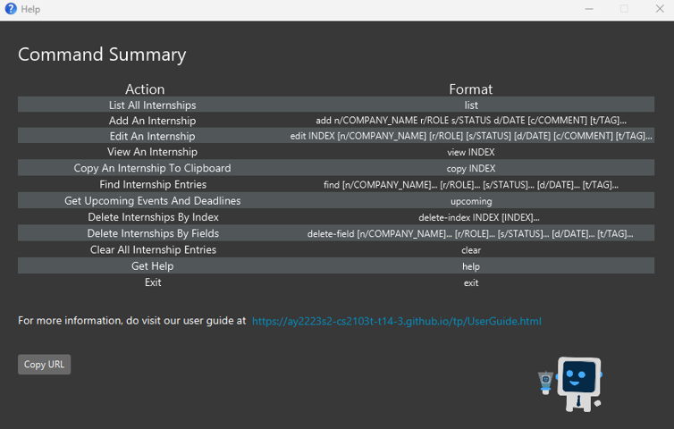
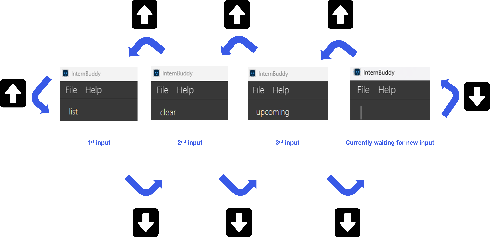
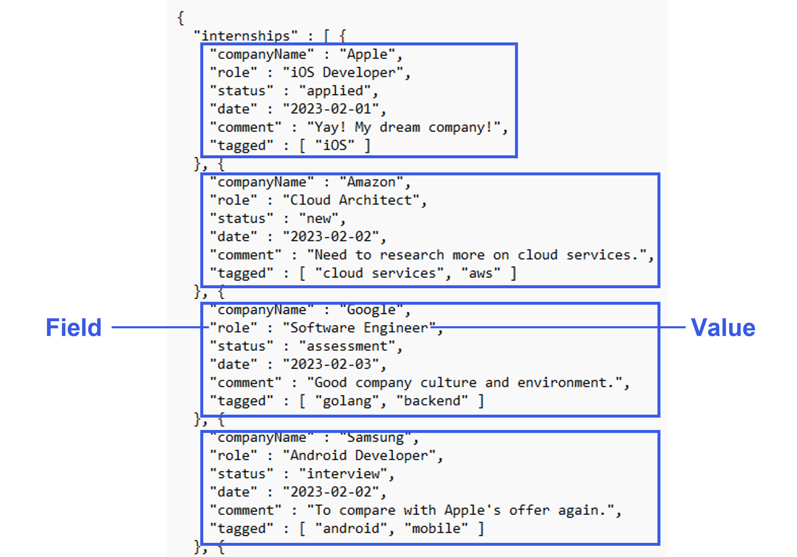

## **Table of Contents**
* Table of Contents
{:toc}

## **Introducing InternBuddy**

InternBuddy is a desktop application for university undergraduates to manage their internship applications.
It is optimized for typing where it allows you to complete internship management tasks much more efficiently via
the keyboard as compared to using traditional [Graphical User Interface](#glossary) (GUI) applications. If you are a fast typist
who is seeking a one-stop platform to systematically organise your internship applications,
then InternBuddy is the perfect buddy to accompany you during your internship hunt.

InternBuddy runs using Java 11 and is available on the Windows, macOS, and Linux operating systems.

 

  

## **About the User Guide**

### Objectives of the User Guide
This user guide aims to provide comprehensive instructions for learning how to use InternBuddy,
including details on the installation process and features. For more advanced users,
this guide will also help customize your experience.

[//]: # (@@author eugenetangkj - reused with modifications)
[//]: # (Adapted from https://ay2223s1-cs2103t-w17-4.github.io/tp/UserGuide.html#navigating-the-user-guide)

### Using the User Guide
This uses guide uses a set of formatting standards and visuals to better communicate information.

**Information Box**

:information_source: **Info:** Provides useful information that supplements the main text

**Tip Box**

:bulb: **Tip:**  Suggestions on how to enhance your experience

**Warning Box**

:warning: **Warning:**  Warns of a dangerous action that you should be aware of and to consider
carefully before committing

**Syntax Highlighting**

[Commands](#glossary), [fields](#glossary), file paths and class names are highlighted.

`command`, `FIELD`, `filepath.json`, `ClassName`

**Keyboard Actions**

Keyboard keys are indicated using rounded buttons.

<button>Ctrl</button> <button>Alt</button> <button>Space</button> <button>Enter</button> <button>&uarr;</button>

## **Quick Start**

1. Ensure you have Java `11` or above installed in your computer.
     
   

   :information_source: **Info:** If you are unsure of whether you have Java 11 installed, or need help installing
   it, you can refer to <a href="#appendix-a-installing-java-11">Appendix A</a>.
   

2. Download the latest `internbuddy.jar` from [here](https://github.com/AY2223S2-CS2103T-T14-3/tp/releases).

3. Copy the file `internbuddy.jar` to the folder you want to use as the _home folder_ for InternBuddy.
     
   

   :information_source: **Info:** The home folder is the folder that you will navigate to when you want to launch
   InternBuddy. It will contain a subfolder where your InternBuddy data will be stored.
   

    
   
4. Double-click on the file `internbuddy.jar` to launch InternBuddy. A GUI similar to Figure 1 should
   appear in a few seconds. Note how the app contains some sample data. 
   

    
   

   
   
Figure 1: InternBuddy's GUI

    

5. You can interact with InternBuddy by typing into the box with the text `Enter command here...`, then pressing
   <button>Enter</button> to execute your command. For example, typing `help` and pressing <button>Enter</button> will open
   the help window.

6. Here are some other example commands you can try:

    - `list`: Lists all internships stored in InternBuddy
    - `add n/Food Panda r/Web Developer s/Applied d/2023-04-01`: Adds a new internship into InternBuddy.
    - `delete-index 3` : Deletes the 3rd internship of the current list displayed in InternBuddy.
    - `exit` : Exits InternBuddy.

Do refer to [Features](#features) below for a comprehensive list of supported features and their associated details.

[//]: # (@@author eugenetangkj - reused with modifications)
[//]: # (Adapted from https://ay2223s1-cs2103t-w17-4.github.io/tp/UserGuide.html#navigating-the-user-guide)

## **Exploring the Graphical User Interface**
Figure 2 provides a visual representation of the different parts of InternBuddy's GUI, while
Table 1 explains what each part is used for.

  

Figure 2: Different parts of InternBuddy's GUI

 

| Part           | Usage                                                                                        |
|----------------|----------------------------------------------------------------------------------------------|
| Command Box    | You can type in your commands here to interact with InternBuddy.                             |
| Result Display | This is where the results of your command will be displayed.                                 |
| List Panel     | Displays a list of internship entries.                                                       |
| View Panel     | Displays either the welcome message or detailed information of a specified internship entry. |
| Status Bar     | States where your InternBuddy data file is located on your computer.                         |

Table 1: Explanation of the different parts of InternBuddy's GUI

:bulb: **Tip:**  The GUI is resizeable. You can resize it according to your preferences.

:bulb: **Tip:**  You can left-click on any of the entries displayed in the List Panel to view more information
about an entry. Your selected entry will be highlighted blue. You can also use <button>&uarr;</button>
and <button>&darr;</button> to change your selected entry.

:information_source: **Info:** Commands in InternBuddy will not change your selected entry in the
List Panel. To change your selected entry, you will have to manually change it either via
left-clicking and/or using <button>&uarr;</button> and <button>&darr;</button>

## **Command Information**

[//]: # (@@author potty10)
### Command Format

* Words in `UPPER_CASE` are the fields that are to be supplied by you. 
  e.g. If the command format is `add n/COMPANY_NAME`, you may input the command as `add n/Apple` where you supply the
  value `Apple` to the field `COMPANY_NAME`.

* Items in square brackets are optional. 
  e.g. If the command format is `edit INDEX [n/COMPANY_NAME] [c/COMMENT]`, you may input the command as `edit 2 n/Apple` where
  you omit the value for the field `COMMENT`.

* Items with `…`​ after them can be used multiple times including zero times. 
  e.g. `[t/TAG]…​` can be used as `   ` (i.e. 0 times), `t/Java`, `t/Java t/Python` etc.

* Fields can be in any order. 
  e.g. If the command format is `n/COMPANY_NAME r/ROLE`, both `n/Apple r/Software Engineer` and `r/Software Engineer n/Apple`
  are acceptable.

* If a field is expected only once in the command, but you specified it multiple times, only the last occurrence of
  the field will be taken. 
  e.g. If the command format is `r/ROLE`, typing in `r/Front-end Developer r/Back-end Developer` will cause your
  input to be interpreted as `r/Back-end Developer`.

* Extraneous values for commands that do not take in fields (such as `help`, `list`, and `exit`) will be
  ignored. 
  e.g. If the command format is `help`, typing in `help 123` will cause your input to be interpreted as `help`.

* Command names are case-sensitive. For example, `help` will work, but `HELP` or `Help` will not.

[//]: # (@@author eugenetangkj)
### Prefixes and Constraints for Fields
In InternBuddy's commands, we refer to a range of fields that you can replace with values to input information that
is customised to your internship applications.

There are 3 important things that you should note:
1. Most fields have associated [**prefixes**](#glossary). 
    * Prefixes are short character combinations that you can use to identify the field to which a value belongs.
      They are a convenient shorthand that allows you to refer a field without having to type out its
      entire name, saving precious time.
    * For example, in `add n/Apple`, the value `Apple` is associated with the
      field `COMPANY_NAME` since the `n/` prefix is used.
    * Prefixes are **case-sensitive**. `n/` will work but `N/` will not.

2. When entering a command, do remember to use **spaces** to separate different fields of information. If you enter multiple fields without using space(s) to separate them, InternBuddy will interpret them as a single field.
    * For example, `edit 1 n/Visa r/Software Engineer` associates `Visa` with the field `COMPANY_NAME` and `Software Engineer` with the field `ROLE`.
    * Conversely, `edit 1 n/Visar/Software Engineer` associates `Visar/Software Engineer` with the field `COMPANY_NAME`.

3. There are **constraints** that you must adhere to when replacing fields with values. 
   * Constraints differ based on the fields.
   * If you do not adhere to these constraints and enter invalid values, an error message will be
     displayed in the [Result Display](#exploring-the-graphical-user-interface) when you
     press <button>Enter</button>. The message will alert you to the invalid input and provide information
     on how to correct the command.

Table 2 provides a summary of the fields with their descriptions, prefixes and constraints.

| Field          | Description                                                                                                        | Prefix | Constraints                                                                                                                                                                             |
|----------------|--------------------------------------------------------------------------------------------------------------------|--------|-----------------------------------------------------------------------------------------------------------------------------------------------------------------------------------------|
| `COMPANY_NAME` | The name of the company                                                                                            | `n/`   | Cannot be blank and must be at most 50 characters.                                                                                                                                      |
| `ROLE`         | The role that you applied for                                                                                      | `r/`   | Cannot be blank and must be at most 50 characters.                                                                                                                                      |
| `STATUS`       | The status of the internship application                                                                           | `s/`   | Must be one of the following: `New`, `Applied`, `Assessment`, `Interview`, `Offered`, `Accepted`, `Rejected`. Note that this is **not** case-sensitive.                                 |
| `DATE`         | The date associated with the internship application                                                                | `d/`   | Must be a valid date in the format of `YYYY-MM-DD`.                                                                                                                                     |
| `COMMENT`      | A comment that you can make on an internship application                                                           | `c/`   | Cannot be blank (except when used in the `edit` command).                                                                                                                               |
| `TAG`          | A label that you can give to an internship application                                                             | `t/`   | Cannot be blank (except when used in the `edit` command) and must be at most 30 characters.                                                                                             |
| `INDEX`        | The index number of the internship entry as displayed in the [List Panel](#exploring-the-graphical-user-interface) | -      | A positive integer that is smaller than or equal to the largest index number shown in the [List Panel](#exploring-the-graphical-user-interface). Note that 0 is not a positive integer. |

Table 2: Fields with their descriptions, prefixes and constraints

### Details on `STATUS` and `DATE`
The field `STATUS` represents the current status of an internship application. It can only take on one
of the following values: `New`, `Applied`, `Assessment`, `Interview`, `Offered`, `Accepted` and `Rejected`.
Note that this is **not case-sensitive**. Table 3 explains the meaning of each status.

| `STATUS`     | Description                                                                                                                       |
|--------------|-----------------------------------------------------------------------------------------------------------------------------------|
| `New`        | You have recently saw this internship opportunity and would like to record it in InternBuddy. Also, you have yet to apply for it. |
| `Applied`    | You have applied for this internship opportunity and you are currently waiting for the company's response.                        |
| `Assessment` | You are currently in the technical assessment stage of the application process.                                                   |
| `Interview`  | You are currently in the behavioral interview stage of the application process.                                                   |
| `Offered`    | You have been offered the internship opportunity.                                                                                 |
| `Accepted`   | You have accepted the internship opportunity.                                                                                     |
| `Rejected`   | You have either been rejected by the company, or that you have rejected the internship offer.                                     |

Table 3: Description of statuses

Depending on the status of the internship application, the `DATE` field will be interpreted differently. Table 4
documents the meaning of `DATE` with respect to each `STATUS` value.

| `STATUS`     | Interpretation of `DATE`     |
|--------------|------------------------------|
| `New`        | Deadline of Application      |
| `Applied`    | Date Applied                 |
| `Assessment` | Date of Technical Assessment |
| `Interview`  | Date of Behavioral Interview |
| `Offered`    | Deadline of Offer Acceptance |
| `Accepted`   | Date of Acceptance           |
| `Rejected`   | Date of Rejection            |

Table 4: Description of dates

[//]: # (@@author seadragon2000341)
### Duplicate Internships
InternBuddy does not allow for the storage of duplicate internships. Should you enter a command that attempts to store 
a duplicate internship, InternBuddy will remind you that the internship already exists.

2 internships are considered to be duplicates if they have matching `COMPANY_NAME`, `STATUS`, `ROLE` **and**
`DATE`. The comparison is **case-insensitive**.

In Table 5, internships A and B are considered as duplicate internships, because they have the same
`COMPANY_NAME`, `ROLE`, `STATUS` and `DATE`. Note how the capitalisation differences in `COMPANY_NAME`
and `ROLE` do not affect the comparison.

| `Field`        | Internship A      | Internship B      |
|----------------|-------------------|-------------------|
| `COMPANY_NAME` | Google            | google            |
| `ROLE`         | Frontend Engineer | frontend engineer |
| `STATUS`       | New               | New               |
| `DATE`         | 2023-02-02        | 2023-02-02        |
| `COMMENT`      | NA                | NA                |
| `TAGS`         | C++               | Java              |

Table 5: Duplicate internships

Meanwhile, in Table 6, internships C and D are not considered as duplicate
internships, because they have different values for `COMPANY_NAME`.

| `Field`        | Internship C      | Internship D      |
|----------------|-------------------|-------------------|
| `COMPANY_NAME` | Apple             | Apple Inc         |
| `ROLE`         | Frontend Engineer | frontend engineer |
| `STATUS`       | New               | New               |
| `DATE`         | 2023-02-02        | 2023-02-02        |
| `COMMENT`      | NA                | NA                |
| `TAGS`         | Java              | Java              |

Table 6: Non-duplicate internships

[//]: # (@@author potty10)
### Duplicate Tags
If you attempt to store duplicate tags within the same internship entry, InternBuddy would only store one of them. A duplicate tag refers to a tag that is identical to another tag in every way, including the spelling and capitalisation (tags are **case-sensitive**). In other words, a duplicate tag is a tag that is an exact copy of another tag.

## **Features**
InternBuddy offers a variety of features that can empower you to systematically track your internships.

[//]: # (@@author eugenetangkj)
### Listing all Internships : `list`
Shows the list of all internship entries that you have stored in InternBuddy.

:information_source: **Info:** `list` will always reset the
[View Panel](#exploring-the-graphical-user-interface) to display the welcome message.

Format: `list`

[//]: # (@@author eugenetangkj)
### Adding an Internship : `add`

Do you have a new internship to track? Add it to InternBuddy using the `add` command.

Format: `add n/COMPANY_NAME r/ROLE s/STATUS d/DATE [c/COMMENT] [t/TAG]...`

* The optional `COMMENT` field has a default value of `NA`. This means that if you do not specify any value for it,
  the comment for the newly added internship will be `NA`.
* The optional `TAG` field will be empty by default. This means that if you do not specify any value for it, there
  will be no tags associated with the newly added internship.

:information_source: **Info:** You will not be able to add [duplicate internships](#duplicate-internships) into InternBuddy (an error message will be shown). If you attempt to add [duplicate tags](#duplicate-tags) into the same internship entry, InternBuddy will only store one of the tags.

Examples:
* `add n/Food Panda r/Web Developer s/New d/2023-02-01 c/I love Food Panda! t/React t/Front-end` Adds a new internship entry
  with company name `Food Panda`, role `Web Developer`, status `New`, deadline of application `2023-02-01`,
  comment `I love Food Panda!` and tags `React` and `Front-End`. This example is illustrated in Figure 3.
* `add n/Deliveroo r/Software Engineer s/Assessment d/2023-02-01` Adds a new internship entry with
  company name `Deliveroo`, role `Software Engineer`, status `Assessment` and date of technical assessment
  `2023-02-01`.
* `add n/Food Panda s/New d/2023-02-01` Displays an error because the `ROLE` field is missing.
* `add n/Apple r/App Developer s/New d/2023-02-01 t/Java t/Java` Adds a new internship entry 
  with company name `Apple`, role `App Developer`, status `New`, deadline of application `2023-02-01`,
  and tag `Java` (only one tag is stored since the two tags provided are duplicates).

   
Figure 3: Example of the add command in action

 

[//]: # (@@author seadragon2000341)
### Editing an Internship : `edit`

Made a mistake, or wish to update your internship entry? The `edit` command allows you to make modifications.

Format: `edit INDEX [n/COMPANY_NAME] [r/ROLE] [s/STATUS] [d/DATE] [c/COMMENT] [t/TAG]...`

* Edits the internship whose index number is `INDEX`.
* You have to provide at least one of the optional fields.
* You can reset the comment of an internship to the default value of `NA` by typing `c/` without specifying any comments
  after it.
* You can remove all of an internship’s tags by typing `t/` without specifying any other tags after it.

:warning: **Warning:**  When editing tags, the existing tags of the internship will be removed. For example, if the
internship with index 1 currently has the tags `iOS` and `Swift`, editing the internship via `edit 1 t/macOS` will lead
to the internship only having the tag `macOS`. To have all 3 tags, you need to type `edit 1 t/iOS t/Swift t/macOS`.

Examples:

Suppose you have at least 2 internships displayed in the [List Panel](#exploring-the-graphical-user-interface).

* `edit 2 s/Assessment r/Software Developer` Sets the status and role of the second internship entry as `Assessment` and
  `Software Developer` respectively. This example is illustrated in Figure 4.
* `edit 2` Displays an error because the command does not satisfy the criteria of having at least one optional field.
* `edit 2 t/Java t/Go` Sets the tags of the second internship entry as Java and Go (existing tags will be removed).
* `edit 2 c/` Sets the comment of the second internship entry to be `NA`.
* `edit 2 t/` Removes all the tags of the second internship entry.

   
Figure 4: Example of the edit command in action

 

[//]: # (@@author eugenetangkj)
### Viewing an Internship : `view`
Want to view the details of a specific internship entry? You can do so using the `view` command.

Format: `view INDEX`
* Views the details of the internship entry with index number `INDEX` as indicated in
  the [List Panel](#exploring-the-graphical-user-interface).
* The details will be shown in the [View Panel](#exploring-the-graphical-user-interface).
* Apart from the internship details, a custom tips box is also included in the
  [View Panel](#exploring-the-graphical-user-interface). The tips provide you with suggestions on how to improve your internship experience,
  where their content change according to the status of the internship entry.

Examples:
* `view 3` Assuming that you have at least 3 internships displayed in the
[List Panel](#exploring-the-graphical-user-interface), this displays the details of the third internship in the
[View Panel](#exploring-the-graphical-user-interface).
* `view -1` Displays an error because `INDEX` must be a positive integer.
* `view 8` Assuming that you have 7 internships displayed in the
  [List Panel](#exploring-the-graphical-user-interface), this displays an error because `INDEX` cannot be greater
  than the maximum index shown in the [List Panel](#exploring-the-graphical-user-interface), which is 7 in this case.

[//]: # (@@author DerrickSaltFish)
### Copying an Internship to Clipboard : `copy`
Need to quickly export the details of an internship? Use `copy` to copy the details of an internship to
your clipboard.

Format: `copy INDEX`

* Copies the details of the internship entry with index number `INDEX` as indicated in
  the [List Panel](#exploring-the-graphical-user-interface).
* The copied text will be in the format of
  `Company Name: COMPANY_NAME; Role: ROLE; Status: STATUS; Date: DATE; Comment: [COMMENT]; Tags: [TAG]`.

Examples:
* Suppose the first internship displayed in the [List Panel](#exploring-the-graphical-user-interface)
  has company name `Amazon`, role `Cloud Architect`, status `New`, date `2023-03-28`, comment `I love Amazon!`,
  and tags `AWS` and `Cloud Services`. Then, `copy 1` copies `Company Name: Amazon; Role: Cloud Architect; Status: New; Date: 2023-03-28; Comment: [I love Amazon!]; Tags: [Cloud Services][AWS]` to your clipboard.

* `copy -1` Displays an error because `INDEX` must be a positive integer.
* `copy 8` Assuming that you have 7 internships displayed in the
  [List Panel](#exploring-the-graphical-user-interface), this displays an error because `INDEX` cannot be greater
  than the maximum index shown in the [List Panel](#exploring-the-graphical-user-interface), which is 7 in this case.

[//]: # (@@author kohkaixun)
### Finding Internships : `find`
Want to locate selected internship entries? Use the `find` command to filter through
your entries and narrow down your search.

Format: `find [n/COMPANY_NAME]... [r/ROLE]... [s/STATUS]... [d/DATE]... [t/TAG]...`

* You have to provide at least one of the optional fields.
* The `find` command is **case-insensitive**, and it returns **exact matches only**. For example,
  `find n/Google Ltd` will not return an entry with company name `Google` because `Google`
  does not exactly match with `Google Ltd`. On the other hand, `find t/Java` will return
  an entry with tag `java` because the search is case-insensitive.

There are 2 possible ways for you to use the `find` command.

**Method 1: Use a single field type**

e.g. `find s/Applied`, `find s/Applied s/New`, `find n/Google n/Apple n/Meta`

* The `find` command returns all internship entries that match with **any** of the values that you provide.

More examples:
* `find s/Applied s/New` returns all internship entries that have a status of **either**
  `Applied` **or** `New`.

**Method 2: Use 2 or more different field types**

e.g. `find n/Google n/Apple s/New`, `find n/Google n/Apple s/Applied s/New`, `find n/Google r/Engineer t/Python t/Java`

* The `find` command returns all internship entries that match with **at least one** value for
  **every** field type that is specified.

Detailed example:
* Figure 5 below shows InternBuddy starting with 5 internship entries. After entering `find n/Google n/Apple t/python t/java`,
  the internships in green boxes were returned while those in red boxes were not.

  

  

   
Figure 5: Example of the find command in action

 

* Table 7 explains the reasoning behind Figure 5.
  

| Index of Internship | Returned? | Explanation                                                                       |
|---------------------|-----------|-----------------------------------------------------------------------------------|
| 1                   | Yes       | It contains at least one company name `Google` and both tags `python` and `java`. |
| 2                   | Yes       | It contains at least one company name `Google` and at least one tag `python`.     |
| 3                   | Yes       | It contains at least one company name `Apple` and at least one tag `java`.        |
| 4                   | No        | It lacks both of the searched tags, `python` and `java`.                          |
| 5                   | No        | It lacks both of the searched company names, `Google` and `Apple`.                |

Table 7: Explanation of Figure 5 

More examples:
* `find n/Google n/Apple s/Interview` returns internship entries that have a status `Interview` **and** have
  a company name of `Google` **or** `Apple`.
* `find n/Google n/Apple s/Applied s/Interview` returns internship entries that have company names
  of `Google` **or** `Apple` **and** roles of `Applied` **or** `Interview`.

  

:information_source: **Info:** The `find` command always searches through all of your internship entries
that are stored in InternBuddy. This means that it will also search through entries that are not currently displayed
in the [List Panel](#exploring-the-graphical-user-interface).

[//]: # (@@author seadragon2000341)
### Getting Upcoming Events and Deadlines : `upcoming`
Want to view your upcoming events and deadlines? You can do so using the `upcoming` command.

Format: `upcoming`
* The `upcoming` command provides the list of internships that have events (interviews/assessments) or deadlines (application deadline/offer acceptance deadline) within the upcoming week.
* In other words, it gives you the list of internships that have a `STATUS` of `New/Offered/Assessment/Interview` and a `DATE` that  falls within the upcoming week.
* Upcoming week is defined as the current day and the 6 days that follow it.

Examples: 
* `upcoming` If today's date is 5 January 2023, it will list all internships that have a `STATUS` of `New/Offered/Assessment/Interview` and a `DATE` that is from 5 January 2023 to 11 January 2023 inclusive.

[//]: # (@@author potty10)
### Deleting Internships by Indices : `delete-index`
Need to keep your screen neat and tidy? `delete-index` can help you achieve this by deleting multiple internships using their indices.

Format: `delete-index INDEX [INDEX]...`

* Deletes the internship whose index number is `INDEX`.
* If multiple `INDEX` are provided, multiple internships can be deleted.
* At least 1 `INDEX` must be provided.
* `INDEX` does not need to be unique. If 2 or more of `INDEX` have the same value, only the first one will be taken.

Examples:
* If you run `delete-index 1` after `find`, it will delete the first entry as displayed by `find` in the [List Panel](#exploring-the-graphical-user-interface).
* If you run `delete-index 1` after `list`, it will delete the first entry as displayed by `list` in the [List Panel](#exploring-the-graphical-user-interface).
* `delete-index 1 3` Deletes the first and third
  internships in the [List Panel](#exploring-the-graphical-user-interface).
* `delete-index 3 1 3 3 1` Deletes the first and third
  internships in the [List Panel](#exploring-the-graphical-user-interface).
* `delete-index` Displays an error because at least one `INDEX` must be specified.

[//]: # (@@author potty10)
### Deleting Internships by Fields : `delete-field`
Wish that you can delete internships using fields instead of indices? You can
certainly do so using `delete-field`.

Format: `delete-field [n/COMPANY_NAME]... [r/ROLE]... [s/STATUS]... [d/DATE]... [t/TAG]...`

* You have to provide at least one of the optional fields.
* The `delete-field` command is **case-insensitive**. For example, `delete-field n/Google` deletes all internships with company names `google`, `Google` or `gOOgle`.
  Also, `delete-field t/java` deletes all internships with tags `Java`, `java` or `JaVa`.
* `delete-field` deletes entries with **exact matches only**. For example, `delete-field n/Google Ltd` will not delete an entry with company name `Google` because
  `Google` does not exactly match with `Google Ltd`.

There are 2 possible ways for you to use the `delete-field` command.

**Method 1: Use a single field type**

e.g. `delete-field s/Applied`, `delete-field s/Applied s/New`,
`delete-field n/Google n/Apple n/Meta`

* The `delete-field` command deletes all internship entries that match with **any** of the values that you provide.

More Examples:
* `delete-field s/Applied s/New` deletes all internship entries that have a status of **either**
  `Applied` **or** `New`.

**Method 2: Use 2 or more different field types**

e.g. `delete-field n/Google n/Apple s/New`, `delete-field n/Google n/Apple s/Applied s/New`,
`delete-field n/Google r/Engineer t/Python t/Java`

* The `delete-field` command deletes all internship entries that matches with **at least one** value for
  **every** field type that is specified.

More Examples:
* `delete-field n/Google n/Apple s/Interview` Deletes internship entries that have a status `Interview` **and** have
  a company name of `Google` **or** `Apple`.
* `delete-field n/Google n/Apple s/New s/Interview` Deletes internship entries that have company names
  of `Google` **or** `Apple` **and** roles of `New` **or** `Interview`.

:information_source: **Info:** The `delete-field` command only searches through the internship entries
that are displayed in the [List Panel](#exploring-the-graphical-user-interface). This means that it
will never delete entries that are not currently displayed in the
[List Panel](#exploring-the-graphical-user-interface).

:warning: **Warning:**  If you use an unknown prefix or a prefix not specific to this command, it will be interpreted as
part of your input value. For example, `delete-field r/Engineer c/Good company` will try to delete internships with a role
of `Engineer c/Good company`.

[//]: # (@@author potty10)
### Clearing all Internships : `clear`
The `clear` command permanently deletes all entries from InternBuddy.

Format: `clear`

:warning: **Warning:**  It will be good to think twice before running this command because
once you run this command, all your internship data will be deleted. In the event that you
accidentally ran `clear`, you can refer to [Appendix C](#appendix-c-populating-internbuddy-with-sample-data)
to repopulate InternBuddy with sample data.

[//]: # (@@author eugenetangkj)
### Getting Help : `help`
Forgot the commands for InternBuddy? Fret not! You can easily view the list of supported commands and their formats
using the `help` command.

Format: `help`
* Opens a new window which displays the list of supported commands in InternBuddy, and provides a link to InternBuddy's
  user guide where you can view more detailed information about each command. Figure 6 shows how the Help Window looks like.
* You can click on the <button>Copy URL</button> button to copy the link to your clipboard.

  

   
Figure 6: Help Window

 

:information_source: **Info:** Clicking on the hyperlink in the help window may not work on some Linux
devices as the functionality is dependent on Gnome libraries. If you are using a Linux device and
the hyperlink does not work, you can click on the <Button>Copy URL</Button> button instead.

### Exiting InternBuddy : `exit`

Done with tracking your internships for the day? Exit InternBuddy using the `exit` command.

Format: `exit`

[//]: # (@@author kohkaixun)
### Navigating through Past Commands

Want to reuse a command you entered just now but too lazy to type it all out again? InternBuddy has got your back!
After clicking on the [Command Box](#exploring-the-graphical-user-interface), pressing <button>&uarr;</button> and <button>&darr;</button> will fill the [Command Box](#exploring-the-graphical-user-interface) with commands that you have recently entered.
This allows you to effortlessly access and use past commands without having to go through the tedious process of typing them all over again.

:information_source: **Info:** InternBuddy only tracks your past commands from the current run of
InternBuddy. This means that if you restart InternBuddy, you can no longer navigate to the commands that
you entered during the previous run.

:information_source: **Info:** Once you have navigated to the first command that you have ever entered into
InternBuddy, pressing <button>&uarr;</button> will not lead to any further change. Similarly, once you have
navigated to the current state of waiting for new input, pressing <button>&darr;</button> will not
change anything.

:bulb: **Tip:**  InternBuddy keeps track of all past commands entered, regardless of whether they were
valid or not. Hence, if you accidentally entered an invalid command, you can easily navigate to it and
make amendments accordingly without having to type out the entire command again.

Example:
- Figure 7 illustrates how you can navigate through past commands where the inputs
  `list`, `clear` and `upcoming` are entered in this particular order. The <button>&uarr;</button> and
  <button>&darr;</button> keys are used to navigate between the different inputs.

  

   
Figure 7: Navigating between commands

 

### Saving your Internship Data

Your internship data for InternBuddy are saved automatically after any command that changes the data. The data are saved
in a file `internbuddy.json` which is located in a subfolder `data` in the [home folder](#quick-start)
where you placed `internbuddy.json`. There is no need to save manually.

:information_source: **Info:** The file location of `internbuddy.json` is stated in the
<a href="#exploring-the-graphical-user-interface">Status Bar</a> of the GUI.

### Loading the Data

InternBuddy data is loaded from `internbuddy.json` automatically at the beginning of each run. There is no need to load
manually.
* If `internbuddy.json` is missing, InternBuddy will start with a new data file containing the sample internship
  entries.
* If the content in `internbuddy.json` was altered and as a result has an invalid format, InternBuddy will start with an
   empty data file.

:warning: **Warning:**  Starting with an empty data file means that all internship entries previously stored in
InternBuddy will no longer be present. This is equivalent to a data wipeout. Therefore, we advise against tampering
with the content in `internbuddy.json` unless you are confident in doing so. If you are interested, you can refer to
      [Appendix B](#appendix-b-customising-the-data-file) for instructions on how to do so.

## **FAQ**

**Q**: How do I transfer my data to another Computer? 
**A**: Install InternBuddy in the other computer and overwrite the file `internbuddy.json` that it creates with the
file `internbuddy.json` that is stored on your existing computer.

**Q**: Does InternBuddy support undoing of commands? For example, can I undo a `delete-index` action? 
**A**: Unfortunately, the current version of InternBuddy does not support the `undo` command. However, it is a feature
that we are exploring and hope to implement in the future!

[//]: # (@@author potty10)
## **Command Summary**
Table 8 provides an overview of the commands supported in InternBuddy.

| Action                          | Format, Examples                                                                                                                             |
|---------------------------------|----------------------------------------------------------------------------------------------------------------------------------------------|
| List all Internships            | `list`                                                                                                                                       |
| Add an Internship               | `add n/COMPANY_NAME r/ROLE s/STATUS d/DATE [c/COMMENT] [t/TAG]...`    e.g. `add n/Apple r/Software Engineer s/New d/2023-03-01`           |
| Edit an Internship              | `edit INDEX [n/COMPANY_NAME] [r/ROLE] [s/STATUS] [d/DATE] [c/COMMENT] [t/TAG]...`  e.g.`edit 2 s/Assessment r/Software Developer`         |
| View an Internship              | `view INDEX`  e.g. `view 1`                                                                                                               |
| Copy an Internship to Clipboard | `copy INDEX`  e.g. `copy 1`                                                                                                               |
| Find Internships                | `find [n/COMPANY_NAME]... [r/ROLE]... [s/STATUS]... [d/DATE]... [t/TAG]...` e.g. `find n/Apple n/Google`                                 |
| Get Upcoming Events/Deadlines   | `upcoming`                                                                                                                                   |
| Delete Internships by Indices   | `delete-index INDEX [INDEX]...`  e.g. `delete-index 1 3`                                                                                  |
| Delete Internships by Fields    | `delete-field [n/COMPANY_NAME]... [r/ROLE]... [s/STATUS]... [d/DATE]... [t/TAG]...` e.g. `delete-field n/Apple n/Google s/New s/Applied` |
| Clear all Internships           | `clear`                                                                                                                                      |
| Get Help                        | `help`                                                                                                                                       |
| Exit InternBuddy                | `exit`                                                                                                                                       |

Table 8: Commands in InternBuddy

## **Appendix A: Installing Java 11**
Follow the following steps to set up Java 11 on your computer.
1. Open up a terminal on your computer.
    - If you are using Windows, click on the `Windows` icon at the bottom left of your computer. Then, type in `terminal` in
      the search bar and double-click the application called `Terminal`.
    - If you are using macOS, click on the `Spotlight` search icon at the top right of your computer. Then, type in `terminal`
      in the search bar and double-click the application called `Terminal`.
    - If you are using Linux, press <Button>CTRL</Button> + <Button>ALT</Button> + <Button>T</Button> to launch the terminal.
2. In the terminal, type in `java -version` and press <button>Enter</button>. The terminal will display the version of
   Java that you have installed on your computer.
3. If you do not have any versions of Java installed, or you have a version older than Java 11, download [Java 11](https://www.oracle.com/java/technologies/downloads/#java11) here.
   You may then return to Step 1 to check whether you have the correct version of Java installed.

 

## **Appendix B: Customising the Data File**
If you are an advanced user of InternBuddy, you can directly edit the contents of your data through the `internbuddy.json`
file without using the GUI. The `internbuddy.json` file is found in the `data` subfolder of your InternBuddy
[home folder](#quick-start).

:warning: **Warning:**  If you are new to InternBuddy or are not confident in reading JSON files, we will advise you against
directly editing the `internbuddy.json` file. This is because if you accidentally make a mistake that leads to the JSON
file not having the correct format, InternBuddy would restart with the sample data file, wiping out any data that you had
previously.

The following steps outline how you can properly edit the `internbuddy.json` file:
1. Open the `internbuddy.json` file by double-clicking on it. If you are prompted to select an application to open
   the file, you can choose any text editor such as `Notepad`.
2. Once opened, you will see the JSON data file in a format as shown in Figure 8. Referring to Figure 8,
   each box contains the data for one specific internship entry.
3. Within each box, you can see that there are pairings where each pair is made up of a `FIELD` and `VALUE`.
   

    
   

   
Figure 8: Sample JSON data file

    

4. To manually change the value of a field, simply replace the text for `VALUE`. Figure 9 illustrates an example
   where we change the value of `STATUS` from `assessment` to `interview` for the internship entry with company name
   `Google`. Once your changes have been made, you can save the file by pressing <button>CTRL</button> + <button>S</button>.
     
   

    :warning: **Warning:**  Make sure that you follow the <a href="#prefixes-and-constraints-for-fields">constraints</a>
    when substituting in your own values. If the constraints are not satisfied, InternBuddy will not be able to
    read your data in the `internbuddy.json` file and will restart with all your internship data cleared.

    

     

   
    
Figure 9: Editing the JSON file

     
5. Launch InternBuddy and you will see that your data have been updated accordingly.

## **Appendix C: Populating InternBuddy with Sample Data**
Follow the following steps to populate InternBuddy with sample data.
1. Visit this [link](https://github.com/AY2223S2-CS2103T-T14-3/tp/blob/master/internbuddy.json).
2. Left-click the button labelled `Raw`. Figure 10 shows where the `Raw` button is.
   
   
   
Figure 10: Raw button on the GitHub interface

     

   

3. Your screen will look like Figure 11. Right click, then click on `Save As`.
   

    
   

   
Figure 11: InternBuddy Sample Data

     
4. You will be prompted to choose a folder to save the file in. Choose the `data` subfolder that is found in the [home folder](#quick-start) that
   you have chosen for InternBuddy.
5. Click `Save`.
     
    

    :warning: **Warning:**  If you already have an internbuddy.json file in the subfolder, you will be prompted to
    confirm whether you want to overwrite it when attempting to populate InternBuddy with sample data.
    It is important to only choose to overwrite the existing file if you are absolutely certain that you
    do not need your old InternBuddy data anymore. If you are unsure, you can always make a backup copy
    of the file before overwriting.
    

6. You are done! InternBuddy will be populated with the sample data the next time you launch it.

## **Glossary**
Table 9 provides a glossary for the technical terms used in this user guide.

| Term                           | Definition                                                                                                                                                                                                  |
|--------------------------------|-------------------------------------------------------------------------------------------------------------------------------------------------------------------------------------------------------------|
| Command                        | An instruction for InternBuddy to perform an action.                                                                                                                                                        |
| Command Line Interface (CLI)   | A CLI is the text-based interface that you can use to provide instructions to your computer. Examples of instructions include opening files and running programs.                                           |
| Graphical User Interface (GUI) | A GUI is the visual interface that you see when an application launches, allowing you to interact with it by clicking on its various buttons and components.                                                |
| Mainstream Operating Systems   | Include Windows, macOS, Linux and Unix.                                                                                                                                                                     |
| Field                          | A part of the command where you have to supply a value for the command to be valid.                                                                                                                         |
| Prefix                         | A short form for the name of a field. It indicates which field does a value belongs to. For example, in `n/Apple`, the value `Apple` is supplied to the field `COMPANY_NAME` since the `n/` prefix is used. |

Table 9: Glossary for InternBuddy's User Guide

## **Acknowledgements**

* InternBuddy is written in **Java 11**.
* It is adapted from the [AddressBook Level 3](https://github.com/se-edu/addressbook-level3) project created by
  the [SE-EDU initiative](https://se-education.org).
* Libraries and frameworks used: [JavaFX](https://openjfx.io/), [Jackson](https://github.com/FasterXML/jackson),
  [JUnit5](https://github.com/junit-team/junit5) and [TestFX](https://github.com/TestFX/TestFX).
* GUI testing is implemented with references from [AddressBook Level 4](https://github.com/se-edu/addressbook-level4)
  and [Please Hire Us](https://github.com/AY2223S1-CS2103T-W17-4/tp). We utilised code from these projects to set
  up GUI testing and added our own test cases to test the UI components that we created.
* The feature of Navigating Through Past Commands is primarily adapted from  [HackNet](https://github.com/AY2122S2-CS2103T-W13-3/tp),
  but we added code modifications and test cases.
* The sections on explaining the formatting standards and GUI interface in the User and Developer Guides are
  inspired by [Please Hire Us](https://github.com/AY2223S1-CS2103T-W17-4/tp).
