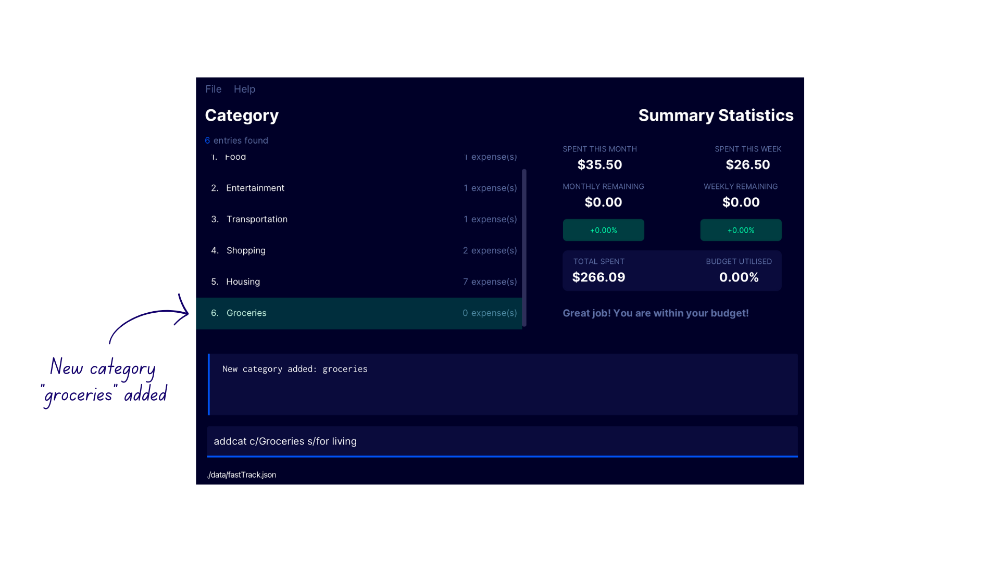
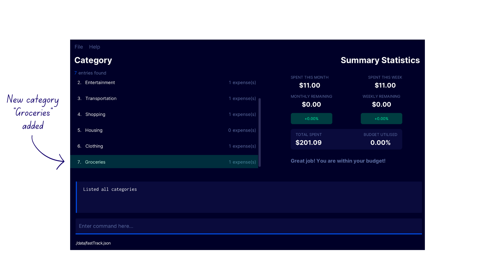

--------------------------------------------------------------------------------------------------------------------
<div id="top">
</div>

# **Table of Contents**
{:toc}
1. [Introduction to FastTrack](#introduction-to-fasttrack)
2. [Why You Should Use FastTrack](#why-you-should-use-fasttrack)
3. [Purpose of this guide](#purpose-of-this-guide)
4. [How to understand this guide](#understanding-this-guide)
   1. [Icons](#icons)
   2. [Command Syntax](#command-syntax)
5. [Quick Start and Installation](#quick-start-and-installation)
6. [GUI Walkthrough](#graphical-user-interface-gui-walkthrough)
7. [Features](#features)
    1. [Category Features](#category-features)
    2. [Expense Features](#expense-features)
    3. [General Features](#general-features)
    4. [Expense Statistics Feature](#expense-statistics-feature)
8. [Saving the data](#saving-the-data)
9. [Editing the data file (For Advanced Users)](#editing-the-data-file)
10. [Frequently Asked Questions](#frequently-asked-questions)


--------------------------------------------------------------------------------------------------------------------
# Introduction to FastTrack

FastTrack is an easy-to-use **financial management desktop application** designed for NUS SoC undergraduate students who are living on a tight budget.

With a combination of a Command Line Interface (CLI) and Graphical User Interface (GUI), our app provides a user-friendly and efficient way to track your expenses and manage your finances.

FastTrack prioritizes speed and efficiency to save your precious time and money, so you have more resources to spend on the important things in life.


--------------------------------------------------------------------------------------------------------------------
## Why you should use FastTrack

**FastTrack** is an expense tracking app that helps computing students keep track of their expenses by providing a simple and convenient command-line interface. Here are some reasons why you should consider using FastTrack:
1. **Simplicity:** FastTrack provides a _simple_ and _easy-to-use_ command-line interface that allows you to quickly add and track your expenses. This makes it ideal for computing students who prefer to use the command line to work with data.<br/><br/>
2. **Speed:** FastTrack prioritizes speed and efficiency. With its command-line interface and all commands being a simple and one-line, it skips the hassle of clicking through screens like other expense tracking apps. The entire interface is shown in one screen.<br/><br/>
3. **Convenience:** FastTrack can be used on any platform, including Windows, Mac, and Linux, making it convenient for computing students to track their expenses regardless of the platform they are using.<br/><br/>
4. **Customizable:** FastTrack is highly customizable, allowing you to tailor it to your specific needs. You can add categories, set budgets, add recurring expenses, and even see statistics on your expenses.<br/><br/>
5. **Security:** FastTrack is a locally hosted app that allows you to keep your expenses and financial information private. It does not require any personal information or financial details to use, ensuring that your information remains secure.<br/><br/>
6. **Free and Open Source:** FastTrack is a free and open-source app, meaning that it is available for download and use by anyone.

--------------------------------------------------------------------------------------------------------------------

# Purpose of this Guide

This User Guide provides information on how to use FastTrack. It includes:
* [Installation](#quick-start-and-installation) and setup of app
* Detailing [features](#features) of the app
* Usage of app and its commands
* Tips, tricks and warnings on usage of commands
* Troubleshooting tips
* Answering [Frequently Asked Questions](#frequently-asked-questions)

--------------------------------------------------------------------------------------------------------------------

# Understanding this guide

## Icons
Throughout FastTrack's user guide, you may encounter unfamiliar symbols. This is a quick overview of what these symbols
mean and what to look out for.

| **Icon**             | **Meaning** |
|----------------------|-------------|
| :warning:            | Warning     |
| :information_source: | Information |
| :bulb:               | Tip         |

#### Warning Box

<div markdown="block" class="alert alert-danger">:warning: Warning:
Danger zone! Do pay attention to the information here carefully. Careless usage of this function may cause certain
things to not work as expected.
</div>

#### Information Box

<div markdown="span" class="alert alert-info">:information_source: Info:
This provides additional useful information that may help you with using FastTrack's features.
</div>

#### Tip Box

<div markdown="block" class="alert alert-primary">:bulb: Tip:
This provides some quick and convenient hacks that you can use to optimize your experience with FastTrack.
</div>

## Command Syntax

First-time users may have difficulty understanding the syntax described in the command instructions. 

If you are new to using a **Command Line Interface (CLI)**, we recommend reading this brief section before using FastTrack. 
Understanding the **CLI** will help you enter commands more efficiently, which can save you time in the long run.

In simple terms, the **Command Line Interface (CLI)** is a way to interact with FastTrack by typing in commands using just one line of text. This means you can add expenses quickly and easily.

Here is a quick guide on how to read the syntax mentioned in the User Guide for using FastTrack's commands.

```
command tag1/ PARAMETER_1 tag2/ PARAMETER_2 [tag3/ PARAMETER_3]
```

| Element     | Format                                        | Usage                                                                                                                   |
|-------------|-----------------------------------------------|-------------------------------------------------------------------------------------------------------------------------|
| `command`   | Name of command <br/> eg. `add`, `find`       | Specifies the command to be executed.                                                                                   |
| `tag/`      | Prefix for a field, followed by `/`           | Specifies which field given input argument is for                                                                       |
| `PARAMETER` | All capitalized                               | Specifies user input for field specified by `tag/`                                                                      |
| `[]`        | Square brackets around `tag/` and `PARAMETER` | Indicates that field specified by `tag/` is optional. <br/><br/>If left unspecified, it will be set to a default value. |

For example, the command format for `add`:
```
add c/CATEGORY_NAME n/ITEM_NAME p/PRICE [d/DATE]
```
* `add` is the `command` name.
* `c/`, `n/`, `p/`, `d/` are `tag/`s to denote fields of _category_, _name_, _price_ and _date_ respectively.
* `CATEGORY_NAME`, `ITEM_NAME`, `PRICE`, `DATE` are `PARAMETERS` to be supplied to the aforementioned `tag/`s.
* `[d/DATE]` indicates that the field for the date is optional.

Don't worry if it takes a bit of time to get used to the commands. Once you're familiar with the commands, you'll be able to add expenses quickly and easily.

--------------------------------------------------------------------------------------------------------------------
## Quick start and Installation

1. Ensure you have Java `11` or above installed in your Computer.

2. Download the latest `fastTrack.jar` from [here](https://github.com/AY2223S2-CS2103T-W09-2/tp/releases).

3. Drag the file into a folder you want to use as the _home folder_ for FastTrack.

4. Double-click the FastTrack JAR file to run the application.

       
   A Graphical User Interface (pictured below) will appear. Note how the app contains some sample data.<br>


6. Type a command in the command box and press Enter to execute it. e.g. typing **`help`** and pressing Enter will open the help window.<br>
   Some example commands you can try:

    * `list` : Lists all expenses
   
    * `clear` : Clears the sample data

    * `add c/groceries n/milk p/4.50 d/14/2/23` : Adds an expense named `milk` to the expenses list with a price of $4.50 and a date of 14/02/2023

    * `delete 3` : Deletes the 3rd expense shown in the current list

    * `exit` : Exits the app


7. Refer to the [Features](#features) below for details of each command.

--------------------------------------------------------------------------------------------------------------------

# Graphical User Interface (GUI) Walkthrough

The following diagrams highlight the different sections of the _Graphical User Interface (GUI)_ of FastTrack.


The **main display**. It displays all added expenses on the left, showing each expense's price, category and date added.


The **Category display**. It shows all currently added Categories for expenses. This display is shown only after using the 
command to list categories.


The **Recurring Expense display**. It shows all currently added Recurring Expenses. This display is shown only after using the
command to list recurring expenses.


| **FastTrack UI Part**     | **Description**                                                                                                                                                                                   |
|---------------------------|---------------------------------------------------------------------------------------------------------------------------------------------------------------------------------------------------|
| One-time Expense Display  | Displays the list of saved one-time expenses with filters applied (if any). This display occupies the _Main View_ section.                                                                        |
| Category Display          | Displays the list of saved categories, including the number of expenses associated with each category. This display occupies the _Main View_ section.                                             |
| Recurring Expense Display | Displays the list of saved recurring expenses. This display occupies the _Main View_ section.                                                                                                     |
| Results Display           | Displays feedback from the application after entering a command, which can be used to indicate the outcome of the command. It provides guidance for the user, especially if a command has failed. |
| Command Box               | A text input field where you can type in a command for FastTrack to execute.                                                                                                                      |
| Expense Summary Display   | A visual display containing expense statistics (Refer to the feature [Expense Statistics](#expense-statistics-feature) below for details.                                                         |
| Toolbar                   | Contains buttons which allow you to access the user guide and exit from the application.                                                                                                          |


## Understanding Categories, Expenses, and Recurring Expenses in FastTrack

FastTrack makes it easy for you to keep track of your spending by organizing expenses into categories. 
A category is like a folder that holds all your expenses that fall under a specific theme. For example, you might have a category called `Groceries` where you record all purchases from Fairprice or NTUC.

To create a category in FastTrack, simply give it a name, such as `Entertainment` or `Transportation`. You can also add a short text summary to give yourself more context about the category. 

FastTrack even has a default `Misc` category for any expenses that you haven't categorized yet, however, this category is not modifiable or accessible. 

See more detailed instructions in [Category Commands](#Category Features).

<div markdown="block" class="alert alert-info">

**:information_source: Info**<br>
Note that category names in FastTrack are case-insensitive. For example, a category named `Groceries` will be treated as the exact same category as `groceries`.
</div>

An expense is a single purchase that you want to track. Each expense has a name, price, category, and date. With FastTrack, you can easily duplicate an expense if you happen to make the same purchase multiple times, such as buying a coffee from CoolSpot every morning on your way to NUS.

Finally, there are recurring expenses. These are expenses that are charged on a regular basis, such as a monthly subscription to Netflix or an annual Heroku subscription. Instead of manually creating an expense every time the payment is due, you can set up a recurring expense in FastTrack. 
Simply specify the start date, interval (daily, weekly, monthly, yearly), and end date (if applicable), and FastTrack will automatically generate the expenses for you.

See more detailed instructions in [Expense Commands](#Expense Features).

Overall, FastTrack's categories, expenses, and recurring expenses help you stay organized and on top of your spending. Keep reading to find out more about how to use these features in more detail!


## Features

The features of FastTrack can be divided into 4 groups, **Category Features**, **Expense Features**, **General Features** and **Expense Statistics Feature**. With these 4 groups in mind, remembering the different commands becomes extremely convenient, as each group contains mainly 4 types of operations - add, delete, edit and list!
1. [**Category features**](#category-features)
    * [Add a category](#adding-a-category-addcat)
    * [Edit a category](#editing-a-category-edcat)
    * [Delete a category](#deleting-a-category-delcat)
    * [List categories](#listing-categories-lcat)
2. [**Expense features**](#expense-features)
    * [Add an expense](#adding-an-expense-add)
    * [Edit an expense](#editing-an-expense-edexp)
    * [Delete an expense](#deleting-an-expense-delete)
    * [Find an expense by keyword](#search-for-an-expense-by-keyword-find)
    * [List expenses](#listing-expenses-list)
        * [By category](#list-expenses-by-category)
        * [By timeframe](#list-expenses-by-timeframe)
    * [Add a recurring expense](#adding-a-recurring-expense-addrec)
    * [Edit a recurring expense](#editing-a-recurring-expense-edrec)
    * [Delete a recurring expense](#deleting-a-recurring-expense-delrec)
    * [List recurring expenses](#listing-recurring-expenses-lrec)
3. [**General features**](#general-features)
    * [Set a budget](#setting-a-budget-set)
    * [Category autocompletion](#category-autocompletion)
    * [Clear all entries](#clearing-all-entries-clear)
    * [Exit FastTrack](#exiting-fasttrack-exit)
    * [View help](#viewing-help-help)
4. [**Expense Statistics Feature**](#expense-statistics-feature)
   * [Monthly spending statistic](#monthly-spending-statistic)
   * [Monthly remaining statistic](#monthly-remaining-statistic)
   * [Monthly percentage change statistic](#monthly-percentage-change-statistic)
   * [Weekly spending statistic](#weekly-spending-statistic)
   * [Weekly remaining statistic](#weekly-remaining-statistic)
   * [Weekly percentage change statistic](#weekly-percentage-change-statistic)
   * [Total spent statistic](#total-spent-statistic)
   * [Budget utilisation percentage statistic](#budget-utilisation-percentage-statistic)


FastTrack offers a variety of commands that you can use to take advantage of its many features. The following tables provide a summary of all the available commands in FastTrack, along with examples on how to use them effectively.

### Category Features Command Summary

| Feature                                            | Command Format                              | Examples                           |
|----------------------------------------------------|---------------------------------------------|------------------------------------|
| [**List Categories**](#listing-categories-lcat)    | `lcat`                                      | `lcat`                             |
| [**Add Category**](#adding-a-category-addcat)      | `addcat c/CATEGORY_NAME s/SUMMARY`          | `addcat c/Groceries s/for living`  |
| [**Delete Category**](#deleting-a-category-delcat) | `delcat INDEX`                              | `delcat 1`                         |
| [**Edit Category**](#editing-a-category-edcat)     | `edcat INDEX [c/CATEGORY_NAME] [s/SUMMARY]` | `edcat 1 c/New Name s/New Summary` |


### Expense Features Command Summary

| Feature                                                              | Command Format                                                                        | Examples                                                       |
|----------------------------------------------------------------------|---------------------------------------------------------------------------------------|----------------------------------------------------------------|
| [**List Expenses**](#listing-expenses-list)                          | `list [c/CATEGORY_NAME] [t/TIMEFRAME]`                                                | `list c/Food t/month`                                          |
| [**Add Expense**](#adding-an-expense-add)                            | `add c/CATEGORY_NAME n/ITEM_NAME p/PRICE [d/DATE]`                                    | `add c/Food p/20 n/Mac d/14/2/23`                              |
| [**Delete Expense**](#deleting-an-expense-delete)                    | `delete INDEX`                                                                        | `delete 1`                                                     |
| [**Edit Expense**](#editing-an-expense-edexp)                        | `edexp INDEX [c/CATEGORY_NAME] [n/EXPENSE_NAME] [d/DATE] [p/PRICE]`                   | `edexp 1 c/Food n/Mac d/20/4/23 p/10`                          |
| [**Find Expense**](#search-for-an-expense-by-keyword-find)           | `find KEYWORD [MORE_KEYWORDS]`                                                        | `find KFC chicken`                                             |
| [**List Recurring Expense**](#listing-recurring-expenses-lrec)       | `lrec`                                                                                | `lrec`                                                         |
| [**Add Recurring Expense**](#adding-a-recurring-expense-addrec)      | `addrec c/CATEGORY_NAME n/ITEM_NAME p/PRICE t/INTERVAL sd/START_DATE [ed/END_DATE]`   | `addrec c/Shows n/Netflix p/10 t/month sd/10/3/23 ed/10/03/24` |
| [**Delete Recurring Expense**](#deleting-a-recurring-expense-delrec) | `delrec INDEX`                                                                        | `delrec 1`                                                     |
| [**Edit Recurring Expense**](#editing-a-recurring-expense-edrec)     | `edrec INDEX [c/CATEGORY_NAME] [n/EXPENSE_NAME] [p/PRICE] [t/INTERVAL] [ed/END_DATE]` | `edrec 1 c/Show n/Disney Plus p/2 t/week ed/10/5/24`           |


### General Features Command Summary

| Feature                                       | Command Format | Examples     |
|-----------------------------------------------|----------------|--------------|
| [**Set Budget**](#setting-a-budget-set)       | `set p/AMOUNT` | `set p/1000` |
| [**Help**](#viewing-help-help)                | `help`         | `help`       |
| [**Exit program**](#exiting-fasttrack-exit)   | `exit`         | `exit`       |
| [**Clear data**](#clearing-all-entries-clear) | `CLEAR`        | `CLEAR`      |


<div markdown="block" class="alert alert-info">

**:information_source: Information about the command format**<br>

Before diving further into the guide, here are some things to take note about the way we formatted commands for FastTrack in this user guide.
* Words in `UPPER_CASE` are called parameters. These are inputs that need to be supplied by the user.<br>
  e.g. in `add c/CATEGORY_NAME`, `CATEGORY_NAME` is a parameter, which the user decides is "groceries". The final command will be entered as `add c/groceries`.

* Items in square brackets are optional.<br>
  e.g `p/PRICE [d/DATE]` means the `DATE` parameter is optional, and can be omitted from the command.`p/4.50 d/14/2/2023` can also be used as `p/4.50`.

* Parameters can be in any order.<br>
  e.g. if the command specifies `c/CATEGORY_NAME p/PRICE`, `p/PRICE c/CATEGORY_NAME` is also acceptable.

* If a parameter is expected only once in the command, but you specified it multiple times, only the **last occurrence** of the parameter will be taken.<br>
  e.g. if you specify `p/4.50 p/5.80`, only `p/5.80` will be taken.

* Extraneous parameters for commands that do not take in parameters (such as `help`, `exit`) will be ignored.<br>
  e.g. if the command specifies `help 123`, it will be interpreted as `help`.

</div>

<p align="right">
    <a href="#top">Back to Top </a>
</p>

# Category Features

## Listing Categories `lcat`

Displays the list of categories in FastTrack.

Format: `lcat`

### Demonstration
1. Type `lcat` into the command box
2. FastTrack displays the list of categories with the confirmation message `Listed all categories`


## Adding a category `addcat`

Adds a new category to FastTrack. If a category with the same name already exists, this command will not execute.

Format: `addcat c/CATEGORY_NAME s/SUMMARY`

| Parameter       | Description                                         |
|-----------------|-----------------------------------------------------|
| `CATEGORY_NAME` | Title of the category to be added.                  |
| `SUMMARY`       | Short summary of what this category keeps track of. |


### Examples
* `addcat c/Groceries s/for living` creates a new `Groceries` category with the summary of `for living`.
* `addcat c/Entertainment s/for fun!` creates a new `Entertainment` category with the summary of `for fun!`.

### Demonstration
1. Enter the command `lcat` to switch to the **Category Display**
2. Enter the command `addcat c/Groceries s/for living` into the command box
3. FastTrack adds the new category to the category list with the confirmation message `New category added: groceries`



## Deleting a category `delcat`

Deletes the category at the specified `INDEX` in the category list.

Format: `delcat INDEX`

| Parameter | Description                                                                                                                                                                                                                                                |
|-----------|------------------------------------------------------------------------------------------------------------------------------------------------------------------------------------------------------------------------------------------------------------|
| `INDEX`   | The index number shown in the displayed category list.<br/><br/>It must be a positive integer i.e. 1, 2, 3, ...<br/><br/>Expenses previously categorised under the specified category will be automatically re-categorized under the `Misc` category.<br/> |


<div markdown="block" class="alert alert-info">
**:information_source: Info:**<br>

If you delete a category that has existing expenses associated with it, those expenses will be automatically reassigned to the default internal `Misc` category. But don't worry! You can still re-assign them later with the [edit expense command](#editing-an-expense-edexp). To avoid losing track of expenses, we recommend that you review and update your categories periodically, rather than deleting them altogether.

</div>


### Examples
* `lcat` followed by `delcat 2` deletes the second category in the category list
* `lcat` followed by `delcat 1` deletes the first category in the category list

### Demonstration
1. Enter the command `lcat` to switch to the **Category Display**
2. Enter the command `delcat 7` into the command box
3. FastTrack deletes the seventh category `Food` from the category list with the confirmation message `Deleted category: food`


## Editing a category `edcat`

Edits the category at the specified `INDEX` in the category list.

Format: `edcat INDEX [c/CATEGORY_NAME] [s/SUMMARY]`

Both `CATEGORY_NAME` and `SUMMARY` are optional by themselves, but **at least** one of them must be specified in addition
to `INDEX`, otherwise the command will not be executed.

| Parameter       | Description                                                                                               |
|-----------------|-----------------------------------------------------------------------------------------------------------|
| `INDEX`         | The index of the category to be edited.<br/><br/>It must be a positive integer i.e. 1, 2, 3, ...          |
| `CATEGORY_NAME` | The new name of the category being edited at the specified index.<br/><br/>This parameter is optional.    |
| `SUMMARY`       | The new summary of the category being edited at the specified index.<br/><br/>This parameter is optional. |

### Examples
- `edcat 1 c/Drink` changes the name of the first category in the category list to `Drink`
- `edcat 2 c/Food s/Eating out` changes the name and summary of the second category in the category list to `Food` and `Eating out` respectively.

### Demonstration
1. Enter the command `lcat` to switch to the **Category Display**
2. Enter the command `edcat 1 c/Drink` into the command box
3. FastTrack edits the name of the first category `Food` from the category list to `Drink` with the confirmation message `Edited category: Drink`


<p align="right">
    <a href="#top">Back to Top </a>
</p>

# Expense Features

## Listing expenses `list`

The `list` feature in FastTrack allows you to view all your expenses. You can filter the list based on specific categories and timeframes to get a more customized view of your spending.

If you apply the `CATEGORY_NAME` filter, only expenses associated with that particular category will be displayed. For instance, if you filter by `groceries`, you'll only see the expenses you've categorized as `groceries`.

If you apply the `TIMEFRAME` filter, you can see expenses that fall within a particular time period. For example, you could filter by `month` to see only the expenses you incurred in the current month.

If you don't specify any filters, the expense list will show all your expenses by default.

Format: `list [c/CATEGORY_NAME] [t/TIMEFRAME] [r/RECUR_PERIOD]`

| Parameter       | Description                                                                                                                                                                                                 |
|-----------------|-------------------------------------------------------------------------------------------------------------------------------------------------------------------------------------------------------------|
| `CATEGORY_NAME` | The name of the category of which expenses are classed under.<br/><br/>This parameter is optional.                                                                                                          |
| `TIMEFRAME`     | The timeframe of which expenses were added. <br/><br/>The timeframes available are:<br/>1. `week` (alias: `w`) <br/>2. `month` (alias: `m`)<br/>3. `year` (alias: `y`)<br/><br/>This parameter is optional. |

<div markdown="block" class="alert alert-info">
**:information_source: What is a timeframe?**<br>

A `TIMEFRAME` allows you to set a specific interval to filter your expenses. `t/w` or `t/week` is a timeframe representing the current week, while `t/m` or `t/month` is a timeframe representing the current month, and `t/y` or `t/year` is a timeframe representing the current year.

</div>

### Examples
* `list`
* `list c/Groceries t/week`
* `list c/Entertainment t/month`
* `list c/Food`
* `list t/w`
* `list c/Entertainment t/year`

### Demonstration

### List Expenses by Category
1. Enter the command `list c/drink` into the command box
2. FastTrack displays the expenses under the category `Drink` with the confirmation message `2 expenses listed`. The number of expenses may differ for every user.


### List All Expenses
1. Enter the command `list` into the command box
2. FastTrack displays all expenses with the confirmation message `5 expenses listed`. The number of expenses may differ for every user.


### List Expenses by Timeframe

1. Enter the command `list t/w` into the command box
2. FastTrack displays all expenses within the current week with the confirmation message `2 expenses listed`. The number of expenses may differ for every user.


<div markdown="block" class="alert alert-info">

**:information_source: Using both `CATEGORY_NAME` and `TIMEFRAME` filters:**<br>
* Using both the category and timeframe filters will only display expenses that satisfy both the filter conditions.<br>
  e.g. in `list c/food t/week`, only expenses with both the category name "Food" and date falling within the current week will be displayed.
</div>


## Adding an expense `add`

Adds a new one-time expense to FastTrack.

Format: `add c/CATEGORY_NAME n/ITEM_NAME p/PRICE [d/DATE]`

| Parameter       | Description                                                                                                                                                                                                              |
|-----------------|--------------------------------------------------------------------------------------------------------------------------------------------------------------------------------------------------------------------------|
| `CATEGORY_NAME` | The category which the expense should be classified under.<br/><br/>If there is no such category in FastTrack, a new category will be created with the specified category name.                                          |
| `ITEM_NAME`     | Name of the expense being added.                                                                                                                                                                                         |
| `PRICE`         | The price of the expense being added.<br/><br/>The specified price should be a number, e.g. 4, 4.50.                                                                                                                     |
| `DATE`          | The date of the expense being added.<br/><br/> The date format should be d/m/yyyy.<br/><br/> This is an optional input, and if left unspecified, the date of the expense will be set to the **current date** by default. |


### Examples
* `add c/groceries n/milk p/4.50 `
* `add c/entertainment p/20 n/movie night d/14/2/23`

### Demonstration
1. Enter the command `add c/groceries n/milk p/4.50` into the command box
2. FastTrack adds the new expense under the new category `Groceries` with the confirmation message `New expense added: Name: milk, Amount: $4.5, Date: 2023-04-07, Category: groceries`.


3. Enter the command `lcat` to switch to the **Category Display**. Notice how FastTrack has automatically created a new category `Groceries` in the category list!




## Deleting an expense `delete`

Deletes an expense at the specified `INDEX` in the expense list.

Format: `delete INDEX`

| Parameter | Description                                                                                                       |
|-----------|-------------------------------------------------------------------------------------------------------------------|
| `INDEX`   | The index number shown in the displayed categories list.<br/><br/>It must be a positive integer i.e. 1, 2, 3, ... |

### Examples
* `list` followed by `delete 2` deletes the second expense in the expense list
* `find movie` followed by `delete 1` deletes the first expense in the results of the `find` command

### Demonstration
1. Type the command `list` to switch to the **Expense Display**
2. Enter the command `delete 2` into the command box
3. FastTrack deletes the second expense in the expense list with the confirmation message `Deleted expense: Name: milk, Amount: $4.5, Date: 2023-04-07, Category: groceries`.


## Editing an expense `edexp`

Edits the expense at the specified `INDEX` in the expense list.

Format: `edexp INDEX [c/CATEGORY_NAME] [n/EXPENSE_NAME] [d/DATE] [p/PRICE] [r/RECUR_PERIOD]`

Every parameter except for `INDEX` is optional by themselves, but **at least** one of them must be specified in addition
to `INDEX`, otherwise the command will not be executed.

| Parameter       | Description                                                                                                                                        |
|-----------------|----------------------------------------------------------------------------------------------------------------------------------------------------|
| `INDEX`         | The index of the expense to be edited.<br/><br/>It must be a positive integer i.e. 1, 2, 3, ...                                                    |
| `CATEGORY_NAME` | The new category name of the expense to be changed to.<br/><br/>This parameter is optional.                                                        |
| `EXPENSE_NAME`  | The new expense name of the expense to be changed to.<br/><br/>This parameter is optional.                                                         |
| `DATE`          | The new date of the expense to be changed to.<br/><br/> The date format should be d/m/yyyy.<br/><br/>This parameter is optional.                   |
| `PRICE`         | The new price of the expense to be changed to.<br/><br/>The specified price should be a number, e.g. 4, 4.50.<br/><br/>This parameter is optional. |

### Examples
* `edexp 1 c/groceries` changes the category of the first expense in the expense tracker
* `edexp 2 p/20 n/movie night` changes the price and name of the second expense in the expense tracker


### Demonstration
1. Type the command `list` to switch to the **Expense Display**
2. Enter the command `edexp 2 p/20 n/movie night c/entertainment`
3. FastTrack edits the second expense in the expense list with the confirmation message `Edited expense: Name: movie night, Amount: $20.0, Date: 2023-04-03, Category: entertaiment`.


## Search for an expense by keyword `find`

Find expenses whose names contain any of the given keywords.

Format: `find KEYWORD [MORE_KEYWORDS]`

* The search is case-insensitive. e.g. `dinner` will match `Dinner`
* The order of the keywords does not matter. e.g. `ramen Dinner` will match `Dinner ramen`
* Only the name of the expense is searched
* Only full words will be matched e.g. `dinn` will not match `dinner`
* Expenses matching at least one keyword will be returned
  e.g. `movie dinner` will return `dinner with Alex`, `movie with friends`

### Examples

Suppose you have 3 expenses logged:
```
Date: 2023-03-02, Category: Food, Name: McDonald's, Price: $7.50
Date: 2023-03-02, Category: Food, Name: KFC, Price: $6.00
Date: 2023-03-03, Category: Groceries, Name: Milk, Price: $4.00
```
* `find kfc milk` returns `Milk` and `KFC`
* `find mcdonald's` returns `McDonald's`<br>

### Demonstration
1. Enter the command `find movie` into the command box to find expenses with the keyword `movie`
2. FastTrack filters the expense list to show only the expenses matching the given keyword, with the confirmation message `Edited expense: Name: movie night, Amount: $20.0, Date: 2023-04-03, Category: entertaiment`.


<p align="right">
    <a href="#top">Back to Top </a>
</p>


## Listing Recurring Expenses `lrec`

Displays the list of recurring expenses in FastTrack.

Format: `lrec`

### Demonstration
1. Type `lrec` into the command box
2. FastTrack displays the list of recurring expenses with the confirmation message `Listed all recurring expenses`


## Adding a Recurring Expense `addrec`

Adds a recurring expense to FastTrack.

Format: `addrec c/CATEGORY_NAME n/ITEM_NAME p/PRICE t/INTERVAL sd/START_DATE [ed/END_DATE]`

| Parameter       | Description                                                                                                                                                                  |
|-----------------|------------------------------------------------------------------------------------------------------------------------------------------------------------------------------|
| `CATEGORY_NAME` | The category which the recurring expense should be classified under.<br/><br/>If there is no such category, a new category will be created with the specified category name. |
| `ITEM_NAME`     | Name of the recurring expense being added.                                                                                                                                   |
| `PRICE`         | The price of the recurring expense being added.<br/><br/>The specified price should be a number, e.g. 4, 4.50.                                                               |
| `INTERVAL`      | The period with which the expense is recurring.<br/><br/> The timeframes available are:<br/>1. `day` <br/>2. `week` <br/>3. `month` <br/> 4. `year`                          |
| `START_DATE`    | The starting date of the recurring expense. <br/><br/> The date format should be d/m/yyyy.                                                                                   |
| `END_DATE`      | The ending date of the recurring expense.<br/><br/> The date format should be d/m/yyyy. <br><br> This parameter is optional.                                                 |

<div markdown="block" class="alert alert-info">

**:information_source: Info**<br>

Note that once a recurring expense is added, it automatically adds a series of expenses to the expense list at the specified interval until the `END_DATE`. If an `END_DATE` is not yet specified, the expenses will be added up to the current date.
</div>


<div markdown="block" class="alert alert-primary">:bulb: Tip:

FastTrack's recurring expense feature is designed to help you keep track of regular expenses that occur at a fixed interval, such as monthly subscription fees or cloud storage bills. 
By setting up a recurring expense, you save precious time and effort by automating the process of adding these expenses to FastTrack.

</div>


<div markdown="block" class="alert alert-warning">

**:exclamation: Caution**<br>

Avoid setting an `END_DATE` that is too far in the future or a `START_DATE` that is too far in the past. Setting a date range that spans a large number of years or generates a large number of expenses may cause FastTrack to become temporarily unresponsive. 
For example, if the current date is `3/2/2023` and the `START_DATE` is set to `3/2/2000` with an `INTERVAL` of `day`, this will generate over 8,000 expenses and may cause performance issues.
</div>


### Examples
* `addrec n/milk c/groceries p/4.50 sd/20/3/2023 t/month`
* `addrec n/milk c/groceries p/4.50 sd/20/3/2023 ed/15/5/2023 t/w`

### Demonstration
1. Enter the command `addrec n/milk c/groceries p/4.50 sd/20/1/2023 t/week` to create a weekly recurring expense starting on 20/1/2023.
2. FastTrack creates the new recurring expense with the confirmation message `New recurring expense added: Recurring Expense: milk, Amount: 4.5, Category: groceries, Start Date: 2023-01-20, End Date: Ongoing, Recurring Expense Type: WEEKLY`


3. Enter the command `list` to switch to the **Expense Display**. Notice that FastTrack has automatically added the weekly expenses in the expense list!


## Deleting a recurring expense `delrec`

Deletes an expense category at the specified `INDEX` in the recurring expense list.

Format: `delrec INDEX`

| Parameter | Description                                                                                                              |
|-----------|--------------------------------------------------------------------------------------------------------------------------|
| `INDEX`   | The index number shown in the displayed recurring expense list.<br/><br/>It must be a positive integer i.e. 1, 2, 3, ... |


<div markdown="span" class="alert alert-info">:information_source: Automatic Deletion of Recurring Expenses:

If a recurring expense's end date has already passed, and the current date too is already past the end date, FastTrack automatically deletes the recurring expense the next time the application is started. This means you do not need to worry about manually deleting recurring expenses which are no longer applicable!

</div>


### Examples
* `lrec` followed by `delrec 2` deletes the second recurring expense in the recurring expense list
* `lrec` followed by `delrec 1` deletes the first recurring expense in the recurring expense list


### Demonstration
1. Enter the command `lrec` to switch to the **Recurring Expense Display**
2. Enter the command `delrec 2`
3. FastTrack deletes the second recurring expense in the recurring expense list with the confirmation message `Deleted recurring expense: Recurring Expense: Netflix, Amount: 16, Category: entertainment, Start Date: 2023-01-01, End Date: Ongoing, Recurring Expense Type: MONTHLY`.


## Editing a recurring expense `edrec`

Edits the expense at the specified `INDEX`

Format: `edrec INDEX [c/CATEGORY_NAME] [n/EXPENSE_NAME] [p/PRICE] [t/INTERVAL] [ed/END_DATE]`

Every parameter except for `INDEX` is optional by themselves, but **at least** one of them must be specified in addition
to `INDEX`, otherwise the command will not go through.

| Parameter       | Description                                                                                                                                                                                |
|-----------------|--------------------------------------------------------------------------------------------------------------------------------------------------------------------------------------------|
| `INDEX`         | The index of the recurring expense to be edited.<br/><br/>It must be a positive integer i.e. 1, 2, 3, ...                                                                                  |
| `CATEGORY_NAME` | The new category name of the recurring expense to be changed to.<br/><br/>This parameter is optional.                                                                                      |
| `EXPENSE_NAME`  | The new expense name of the recurring expense to be changed to.<br/><br/>This parameter is optional.                                                                                       |
| `PRICE`         | The new price of the recurring expense to be changed to.<br/><br/>The specified price should be a number, e.g. 4, 4.50.<br/><br/>This parameter is optional.                               |
| `INTERVAL`      | The new recurrence period of the expense to be changed. <br>The timeframes available are:<br/>1. `day` <br/>2. `week` <br/>3. `month` <br/> 4. `year`<br/><br/>This parameter is optional. |
| `END_DATE`      | The new ending date of recurring expense.<br/><br/> The date format should be d/m/yyyy. <br/><br/>This parameter is optional.                                                              |


<div markdown="block" class="alert alert-warning">

**:exclamation: Caution**<br>
If you want to stop a recurring expense before its intended `END_DATE`, make sure to terminate it before the current date. 
If you edit the recurring expense to end before the current date, this only prevents new expenses from being added, but expenses that were previously generated will still exist in FastTrack.
</div>

### Examples
* `edrec 1 c/groceries t/week` updates the category and recurrence period first recurring expense in the expense tracker.
* `edrec 2 p/4.50 ed/15/5/2023` updates the price and ending date of the second recurring expense in the expense tracker.

### Demonstration
1. Enter the command `lrec` to switch to the **Recurring Expense Display**
2. Say you have upgraded to a Netflix yearly subscription plan - enter the command `edrec 2 p/200 t/year` 
3. FastTrack edits the second recurring expense in the recurring expense list with the confirmation message `Edited recurring expense generator: Recurring Expense: Netflix, Amount: 200.0, Category: entertainment, Start Date: 2023-01-20, End Date: Ongoing, Recurring Expense Type: YEARLY`.


<p align="right">
    <a href="#top">Back to Top </a>
</p>

# General Features

## Setting A Budget `set`

Sets a monthly budget for FastTrack. For first-time users of FastTrack, no budget is set and some expense statistics are not updated. 

In order to view all the expense statistics, you must first set a budget using this command.

FastTrack derives the weekly budget from this monthly budget by dividing the monthly budget by 4.

Format `set p/AMOUNT`

| Parameter | Description                                                                              |
|-----------|------------------------------------------------------------------------------------------|
| `AMOUNT`  | The monthly budget amount to set. The specified budget should be a number, e.g. 4, 4.50. |


<div markdown="block" class="alert alert-warning">

**:exclamation: Caution**<br>

FastTrack does not allow setting a budget of $0

</div>


### Examples
* `set p/500` sets the monthly budget of FastTrack to $500

### Demonstration
1. Enter the command `set p/500` to set the monthly budget of FastTrack to $500
2. FastTrack updates the monthly budget to $500 with the confirmation message `Monthly budget successfully set to $500.0`


## Category Autocompletion

FastTrack offers a powerful and time-saving feature that autocompletes your category names for you! When you start typing `c/`, FastTrack provides a list of suggested category names as a popup above the command box.
Give it a try and see how much time you can save with this feature!

### How to Use Category Autocompletion?

- Type `c/` in the command box to trigger the autocompletion feature.
- FastTrack will display a list of suggested category names above the command box.
- To select a category name from the list, use the `UP` and `DOWN` arrow keys to navigate through the suggestions list.
- Press `ENTER` to autocomplete the selected category name.
- If the category you're looking for is conveniently at the bottom of the list, simply press `TAB` to autocomplete the first suggested category without having to navigate through the list manually!
- If you decide not to use any of the suggested categories, just continue typing your own category name as per normal.

<div markdown="block" class="alert alert-primary">:bulb: Tip:

Want to use `TAB` directly without navigating inside the suggestion list?
Narrow down the list of suggested categories by typing the first few words of your desired category name. Once the option appears at the bottom of the list, simply press `TAB` for autocompletion.

</div>


<div markdown="block" class="alert alert-warning">
**:exclamation: Caution**<br>

To use category autocompletion, make sure that `c/` is the last text you've entered into the command box. 
If there's any other text in front of `c/`, the autocompletion feature will be disabled. 
</div>


### Demonstration

1. Enter `list c/` into the command box
2. A list of suggested categories appear in a popup above the command box
3. Navigate into the suggestion list using the `UP` arrow key and press `ENTER` on the desired category `Transportation`. 
4. This autocompletes the category name
5. If you need to navigate out of the suggestion list, press the `DOWN` arrow key until the cursor returns to the command box


1. Enter `list c/` into the command box
2. A list of suggested categories appear in a popup above the command box
3. If the desired category `Shopping` is the first suggestion in the list (the bottom-most suggestion), press `TAB` within the command box.
4. This autocompletes the category name


## Clearing all entries `CLEAR`

Clears all entries from FastTrack. This command removes all stored expenses, recurring expenses and categories.

Format: `CLEAR`

<div markdown="block" class="alert alert-warning">
**:exclamation: Caution**<br>

This command will delete **all** the data stored in FastTrack apart from the stored monthly budget. To minimise the risk of accidentally using this command, we have made it such that the command only works when the `CLEAR` is fully uppercase.

Exercise caution before using this command.
</div>

### Demonstration

1. Enter `CLEAR` in the command box
2. FastTrack clears all previously logged expenses, recurring expenses and categories, with the confirmation message `Deleted all prior entries`.


## Exiting FastTrack `exit`

After logging your expenses, you might want to close the application and ensure your data is saved.
This command closes FastTrack and saves the data to the `fastTrack.json` file located on computer's hard disk.

Format: `exit`


## Viewing help `help`

Shows a message explaining how to access the help page, as well as a quick rundown of what commands can be used.

Format: `help`


<p align="right">
    <a href="#top">Back to Top </a>
</p>

# Expense Statistics Feature

FastTrack provides you with real-time statistics on your spending to help you keep track of your monthly budget. 
Here are the types of statistics displayed and what they mean.


## Monthly spending statistic
This statistic represents the total amount of money you have spent in the current month. 
It includes all expenses recorded in the current month. 

For example, if the current month is March, this statistic shows the total amount of money spent in March.

## Monthly remaining statistic

This statistic represents the amount of money you have left from your monthly budget.
It gives you an idea of how much money you have left to spend for the rest of the month.

## Monthly percentage change statistic

This statistic represents the percentage increase or decrease in your monthly spending relative to the previous month. 
The indicator colour is red if it is a percentage increase and green if it is a percentage decrease.

For example, if you spent $500 last month and $750 this month, the monthly percentage change indicator would be `+50.00%` and be displayed in a red colour. 
If you spent $750 last month and $500 this month, the monthly percentage change would be `-33.30%` and be displayed in a green color.

## Weekly spending statistic

This statistic represents the total amount of money you have spent in the current week, starting from Monday to Sunday. 
This gives you an idea of how much money you are spending on a weekly basis.

## Weekly remaining statistic

This statistic represents the amount of money you have left from your weekly budget. 
Your weekly budget is the value of your monthly budget divided by four. This gives you an idea of how much money you have left to spend for the rest of the week.

<div markdown="span" class="alert alert-warning">:exclamation: **Caution:**

Please take note that this value should be treated as a rough guide. 
Even if you have exceeded your previous week's budget, this statistic will show that you have more remaining, as the weekly budget is fixed based on the monthly budget. 
Therefore, it is important to use this value as an estimate and not solely rely on it for your spending decisions!

</div>


## Weekly percentage change statistic

This statistic represents the percentage increase or decrease in your weekly spending relative to the previous week.
The indicator colour is red if it is a percentage increase and green if it is a percentage decrease.

For example, if you spent $500 last week and $750 this week, the weekly percentage change indicator would be `+50.00%` and be displayed in a red colour. 
If you spent $750 last week and $500 this week, the weekly percentage change would be `-33.30%`.

## Total spent statistic

This statistic represents the total amount of money you have spent to date, starting from the first expense you recorded in FastTrack. 
This gives you an idea of how much money you have spent over the period of time from when you started tracking your expenses.


## Budget utilisation percentage statistic

This statistic represents the percentage of your monthly budget that you have already utilised in the current month. 

For example, if your monthly budget is $1000, and you have already spent $500, your budget utilised percentage would be `50%`. 
This gives you an idea of how much of your monthly budget you have used up.


<div markdown="block" class="alert alert-warning">

**:exclamation: Caution**<br>

Even if you have exceeded your budget, this statistic will reflect that you have fully utilised your budget, and will remain at `100%`. 

</div>


<p align="right">
    <a href="#top">Back to Top </a>
</p>

--------------------------------------------------------------------------------------------------------------------
# Saving the data

All data in FastTrack are saved in the hard disk automatically after any command that changes the data. There is no need to save manually.

# Editing the data file

FastTrack's data are saved as a JSON file `[JAR file location]/data/fastTrack.json`. Advanced users who are familiar with JSON (JavaScript Object Notation) are welcome to update data directly by editing that data file.

<div markdown="span" class="alert alert-warning">:exclamation: **Caution:**
If your changes to the data file makes its format invalid, FastTrack will discard all data and start with an empty data file at the next run.
</div>

# Frequently Asked Questions

**Q**: How do I transfer my data to another Computer?<br>
**A**: Install the app in the other computer and overwrite the empty data file it creates with the file that contains the data of your previous FastTrack home folder.

**Q**: Does FastTrack require a Wi-Fi network?<br>
**A**: No, FastTrack does not need any sort of internet connection to run! You can be rest assured that your data is kept safe locally on your computer. However, accessing the user guide and developer guide which are hosted online will require an internet connection.

**Q**: Why are some of my expenses being categorised as `Misc`?<br>
**A**: `Misc` is an internal default category in FastTrack that represents an unclassified expense. If you see an expense with the `Misc` category, chances are, the category it was previously associated with was deleted.

**Q**: My expense name gets cut off with trailing ellipses `...`, how do I fix this?<br>
**A**: Try resizing the FastTrack window size by increasing its width until the full expense names are within view.

**Q**: Can I set reminders for recurring expenses in FastTrack?<br>
**A**: No, FastTrack does not currently have a built-in feature for setting reminders for recurring expenses. 
However, you can use an external calendar or reminder app to keep track of recurring expenses.

**Q**: Does FastTrack integrate with payment systems like credit cards or PayPal?<br>
**A**: Currently, FastTrack does not support integration with external payment systems. However, we are constantly improving and expanding our features, and we plan to explore integrating with popular payment systems in the future. Stay tuned for more updates!

<p align="right">
    <a href="#top">Back to Top </a>
</p>

