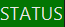
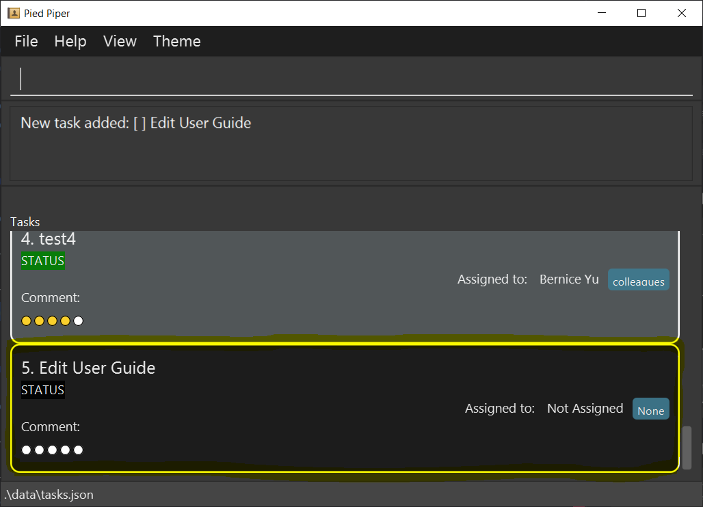
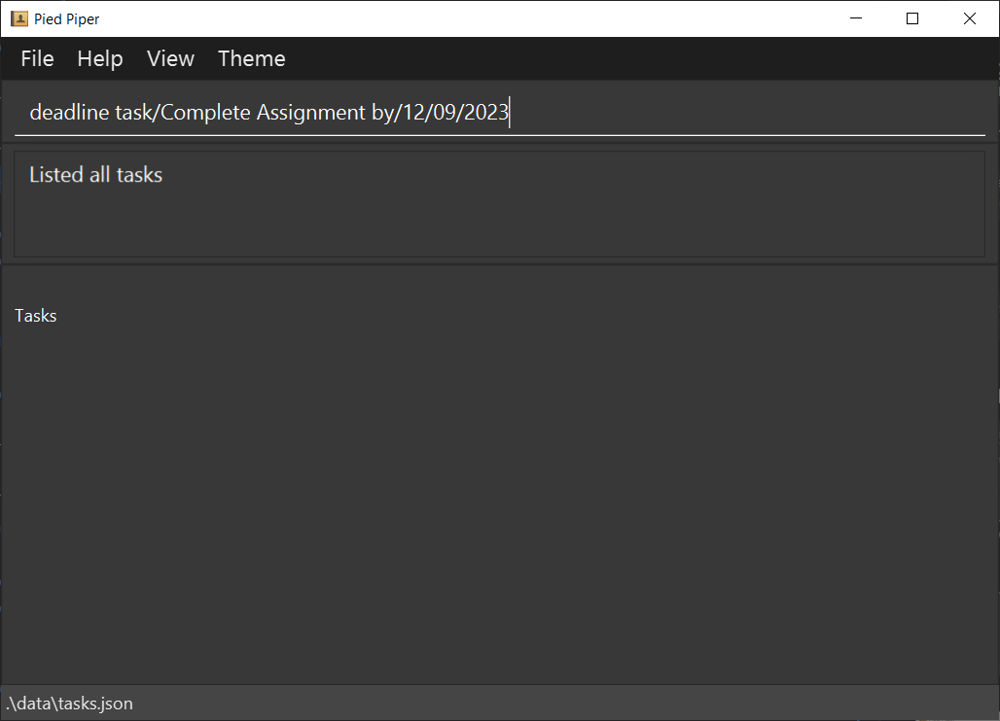

# Pied Piper

Pied Piper is a user-friendly task management application tailored for current and future university student leaders. 
The app helps them stay organised and prepare for real-world situations by helping them manage project groups, and 
simulate the real world review system. Key features include creating tasks, assigning tasks to team members, setting 
due dates, rating completed tasks out of 5, and providing feedback through comments. The ability to seamlessly toggle 
between a person list and task list also helps team leaders easily identify each team members' roles and their assigned 
task to complete. Ideal for personal projects and team collaboration, Pied Piper aims to improve productivity and equip 
university students with valuable skills for their future careers.

Some of our main features:
- **Adding tasks with or without due dates.**
- **Adding team members and assigning them to created tasks.**
- **Mark tasks as complete and give a rating to gauge the performance of each member.**
- **Review each member's overall performances based on the tasks completed.**

This user guide provides a broad overview of how the various features work and how to use them properly. We hope you 
have fun using Pied Piper and may all your future endeavors be elevated with our product!

---

# Table of Contents

- [1. Quick Start](#1-quick-start)
  - [1.1 Installation](#11-installation)
  - [1.2 Layout walk through](#12-app-overview)
    - [1.2.1 Types of interfaces](#121-types-of-interfaces)
    - [1.2.2 Layout](#122-layout)
    - [1.2.3 Key definitions](#123-key-definitions)
- [2. Features](#2-features)
  - [2.1 Add person](#21-adding-a-person-add)
  - [2.2 Add regular task](#22-creating-a-regular-task-todo)
  - [2.3 Add deadline task](#23-creating-a-task-with-a-deadline-deadline)
  - [2.4 Add event task](#24-creating-a-task-that-is-an-event-event)
  - [2.5 Add comment to task](#25-commenting-on-a-task-comment)
  - [2.6 Edit a person](#26-editing-a-person-edit)
  - [2.7 Edit a task](#27-editing-a-task-edittask)
  - [2.8 Assign task to member](#28-assigning-task-to-member-assign)
  - [2.9 Mark a task](#29-marking-a-task-mark)
  - [2.10 Unmark a task](#210-unmarking-a-task-unmark)
  - [2.11 Delete a person](#211-deleting-a-person-delete)
  - [2.12 Delete a task](#212-deleting-a-task-deletetask)
  - [2.13 List persons](#213-listing-tasks-list)
  - [2.14 View tasks](#214-viewing-persons-view)
  - [2.15 Review](#215-viewing-statistics-review)
  - [2.16 Help](#216-getting-help-help)
  - [2.17 Lighting modes](#217-toggling-light-and-dark-mode)
- [3. FAQ](#3-faq)
- [4. Checking Java Version](#4-how-do-i-check-my-java-versionbr)
- [5. Command summary](#5-command-summary)

---

# 1. Quick start

## 1.1 Installation

1. Ensure you have Java `11` or above installed in your Computer. If you aren't sure of the version, follow these 
[instructions](#4-how-do-i-check-my-java-versionbr).
If you don't have Java downloaded or have an outdated version, download it 
[here](https://www.oracle.com/sg/java/technologies/javase/jdk11-archive-downloads.html).

2. Download the latest `piedpiper.jar` [here](https://github.com/AY2223S2-CS2103T-W15-3/tp/releases).

3. Copy the file to the folder you want to use as the _home folder_ for Pied Piper.

4. Open a command terminal, `cd` into the folder you put the jar file in, and use the `java -jar piedpiper.jar` command 
to run the application. If you need help on how to navigate the command terminal, check out 
[this](https://www.wikihow.com/Open-a-Folder-in-Cmd#:~:text=The%20%22cd%22%20command%20is%20used,not%20press%20Enter%20just%20yet.&text=Type%20the%20address%20of%20the,the%20folder%20is%20located%20in.) 
link. 
   
A GUI similar to the below should appear in a few seconds. Note how the app contains some sample data. 
   

[↑ Back to table of contents](#table-of-contents)

## 1.2 App overview

### 1.2.1 Types of interfaces

Pied Piper supports 2 types of lists, a `PersonList` and a `TaskList`.

The person list can be viewed using the [list](#214-viewing-persons-view) command. 

The task list can be viewed using the [view](#213-listing-tasks-list) command. 

[↑ Back to table of contents](#table-of-contents)

### 1.2.2 Layout

**Command Box**: This is where you type in commands to work your way around Pied Piper. A quick summary of commands can 
be found [here](#5-command-summary).

**Message Box**: This is where Pied Piper provides feedback to show what actions have just been done, as well as to 
display error messages if you input the wrong commands.

**Lists**: Depending on whether you chose to display the `PersonList` or the `TaskList`, this window shows you all 
currently stored persons or tasks.

[↑ Back to table of contents](#table-of-contents)

### 1.2.3 Key definitions

* Words in `UPPER_CASE` are the parameters to be supplied by the user.

* All dates must be in the format of `DD/MM/YYYY`. Dates also cannot be from a date before the present date.

* Words in front of `/` are parameter prefixes that need to be included when inputting the parameters. 
  e.g. When adding a `todo` task, the format is `todo task/TASK_NAME`. If your task name is 'Homework',
  the full command will be `todo task/Homework`.

* As a result of the above, the character `/` cannot be used in any parameters.

* Items in square brackets are optional. 
  e.g. `a/ADDRESS [r/ROLE]` can be used as `a/John street, block 123 r/Member` or as `a/John street, block 123`.

* Extraneous parameters for commands that do not take in parameters (such as `view`) will be ignored. 
  e.g. if the command specifies `view 123`, it will be interpreted as `view`.

* Note what the status colours denote:
  *  default colour for status.
  *  task has been marked as completed.
  *  today is the deadline for the task.
  *  deadline has passed.

[↑ Back to table of contents](#table-of-contents)

---

# 2. Features

- [2.1 Add person](#21-adding-a-person-add)
- [2.2 Add regular task](#22-creating-a-regular-task-todo)
- [2.3 Add deadline task](#23-creating-a-task-with-a-deadline-deadline)
- [2.4 Add event task](#24-creating-a-task-that-is-an-event-event)
- [2.5 Add comment to task](#25-commenting-on-a-task-comment)
- [2.6 Edit a person](#26-editing-a-person-edit)
- [2.7 Edit a task](#27-editing-a-task-edittask)
- [2.8 Assign task to member](#28-assigning-task-to-member-assign)
- [2.9 Mark a task](#29-marking-a-task-mark)
- [2.10 Unmark a task](#210-unmarking-a-task-unmark)
- [2.11 Delete a person](#211-deleting-a-person-delete)
- [2.12 Delete a task](#212-deleting-a-task-deletetask)
- [2.13 List persons](#213-listing-tasks-list)
- [2.14 View tasks](#214-viewing-persons-view)
- [2.15 Review](#215-viewing-statistics-review)
- [2.16 Help](#216-getting-help-help)
- [2.17 Lighting modes](#217-toggling-light-and-dark-mode)

[↑ Back to table of contents](#table-of-contents)

## 2.1 Adding a person: `add`

Adds a person.

Format: `add n/NAME p/PHONE e/EMAIL a/ADDRESS [r/ROLE]`

Examples:
* `add n/John Doe p/98765432 e/johnd@nus.com a/John street, block 123`
* `add n/Jane Roe p/98123456 e/janer@nus.com a/Jane street, block 321 r/Member`

**Before**: 

**After**: 

[↑ Back to list of features](#2-features)

## 2.2 Creating a regular task: `todo`

Creates a new task.

Format: `todo task/TASK_NAME`

Example:
* `todo task/Edit User Guide` 
**Before**: 

**After**: 

[↑ Back to list of features](#2-features)

## 2.3 Creating a task with a deadline: `deadline`

Creates a new deadline task.

Format: `deadline task/TASK_NAME by/DATE`

Example:
* `deadline task/Complete Assignment by/12/09/2023`

**Before**: 

**After**: 

[↑ Back to list of features](#2-features)

## 2.4 Creating a task that is an event: `event`

Creates a new event task.

Format: `event task/TASK_NAME from/DATE to/DATE`

Note: The dates input must follow chronological order, meaning the date supplied to the `to/` field must come after the 
date supplied to the `from/` field.

Example:
* `event task/Manage Open House from/11/12/2023 to/16/12/2023`

**Before**: 

**After**: 

[↑ Back to list of features](#2-features)

## 2.5 Commenting on a task: `comment`

Adds a comment to a task that exists in the task list. The task index follows  
The task list can be viewed by using the `view` command.

Format: `comment t/TASK_INDEX c/COMMENTS`

Example:
* `comment t/1 c/task was done well and on time` 

[↑ Back to list of features](#2-features)

## 2.6 Editing a person: `edit`

Edits the properties of an existing person in the persons list. At least one optional field must be supplied. 
The person list can be viewed by using the `list` command.

Format: `edit INDEX [n/NAME] [p/PHONE] [e/EMAIL] [a/ADDRESS] [r/ROLE]`

Example:

* `edit 1 p/98761234 e/john@nus.com`
* 
**Before**: 

**After**: 

[↑ Back to list of features](#2-features)

## 2.7 Editing a task: `edittask`

Edits the details of the task identified by the index number used in the displayed task list. 
Existing values will be overwritten by the input values. The desired task type must be specified, and the date 
modifiers must match the format of the task type input. At least one optional field must be supplied. 
Todo tasks should not include a DATE field. 
The task list can be viewed using the `view` command.

Format: `edittask INDEX type/TASK_TYPE [task/TASK_DESCRIPTION] [c/COMMENT] [DATE]`

Note: 
* To denote todo, deadline and event tasks, parameters for `TASK_TYPE` are `T`, `D` and `E` respectively.
* When editing a task to change types, the DATE parameters follow the formats of 
[deadline task](#23-creating-a-task-with-a-deadline-deadline) and [event task](#24-creating-a-task-that-is-an-event-event).
* Editing a task removes the assigned member from the task.

Examples:
* Changing an existing task at index 1 to a `deadline` task, with a different name
  * `edittask 1 type/D task/Assignment 1 by/20/04/2023` 
  
  
* Changing an existing task at index 2 to an `event` task, with the date changed
  * `edittask 2 type/E from/05/04/2023 to/10/04/2023` 
  

[↑ Back to list of features](#2-features)

## 2.8 Assigning task to member: `assign`

Assign a task to a person. The indexes used follows the index on the task and person list respectively. 
The task list can be viewed using the `view` command, and the persons list can be viewed using the `list` command.

Note:
* For every task, only one person can be assigned to it.

Format: `assign  t/TASK_INDEX i/MEMBER_INDEX`

Examples:
* `assign t/1 i/3` 

[↑ Back to list of features](#2-features)

## 2.9 Marking a task: `mark`

Marks the target task as completed and give a score to the marked task. 
The task list can be viewed using the `view` command.

Format: `mark t/TASK_INDEX s/PERFORMANCE_SCORE`

Examples:
* `mark t/1 s/4` 

[↑ Back to list of features](#2-features)

## 2.10 Unmarking a task: `unmark`

Sets the target task's status as incomplete and remove any given score. 
The task list can be viewed using the `view` command.

Format: `unmark t/TASK_INDEX`

Examples:
* `unmark t/1` 

[↑ Back to list of features](#2-features)

## 2.11 Deleting a person: `delete`

Deletes an existing person at the given index. 
The task list can be viewed using the `view` command.

Format: `delete MEMBER_INDEX`

Examples:
* `delete 1`

[↑ Back to list of features](#2-features)

## 2.12 Deleting a task: `deletetask`

Deletes an existing task at the given index. 
The task list can be viewed using the `view` command.

Format: `deletetask TASK_INDEX`

Examples:
* `deletetask 2`

[↑ Back to list of features](#2-features)

## 2.13 Listing tasks: `list`

Shows all tasks.

Format: `list`

[↑ Back to list of features](#2-features)

## 2.14 Viewing persons: `view`

Shows all persons.

Format: `view`

[↑ Back to list of features](#2-features)

## 2.15 Viewing statistics: `review`

Shows task and score statistics of all persons in the persons list.

Format: `review`

[↑ Back to list of features](#2-features)

## 2.16 Getting help: `help`

Opens a window linking to this user guide

[↑ Back to list of features](#2-features)

## 2.17 Toggling between light and dark mode

Allows for toggling between light mode and dark mode based on user preference.

[↑ Back to list of features](#2-features)

[↑ Back to table of contents](#table-of-contents)

---

# 3. FAQ

**Q**: How do I transfer my data to another Computer? 
**A**: Install the app in the other computer and overwrite the empty data file it creates with the file that contains 
the data of your previous Pied Piper home folder.

**Q**: How do I check my Java version? 
**A**: Check [here](#4-how-do-i-check-my-java-versionbr).

**Q**: Where do I download the correct Java version?
**A**: Download from [here](https://www.oracle.com/sg/java/technologies/javase/jdk11-archive-downloads.html).

[↑ Back to table of contents](#table-of-contents)

---

# 4. How do I check my Java version? 
For windows:
1. Open your system's command line by searching `cmd` in the windows search bar.
2. Enter the command `java -version`.
3. You should see the version of java installed here highlighted in yellow: 

For mac:
1. Use the spotlight search bar and search using `terminal`.
2. Enter the command `java -version`.
3. You should see the version of java installed here highlighted in yellow: 

[↑ Back to table of contents](#table-of-contents)

---

# 5. Command summary

| Action              | Format, Examples                                                                                                                          |
|---------------------|-------------------------------------------------------------------------------------------------------------------------------------------|
| **Add**             | `add n/NAME p/PHONE e/EMAIL a/ADDRESS [r/ROLE]`  e.g., `add n/Jane Roe p/98123456 e/janer@nus.com a/Jane street, block 321 r/Member`   |
| **Assign**          | `assign t/TASK_INDEX i/MEMBER_INDEX`  e.g., `assign t/1 i/3`                                                                           |
| **Comment**         | `comment t/TASK_INDEX c/COMMENTS`  e.g., `comment t/1 c/task was done well and on time`                                                |
| **Deadline**        | `deadline task/TASK_NAME by/DATE`  e.g., `deadline task/Complete Assignment by/12/09/2023`                                             |
| **Delete person**   | `delete MEMBER_INDEX`  e.g., `delete 1`                                                                                                |
| **Delete task**     | `deletetask TASK_INDEX`  e.g., `deletetask 2`                                                                                          |
| **Edit person**     | `edit INDEX [n/NAME] [p/PHONE] [e/EMAIL] [a/ADDRESS] [r/ROLE]`  e.g., `edit 1 p/98761234 e/john@nus.com`                               |
| **Edit task**       | `edittask INDEX type/TASK_TYPE [task/TASK_DESCRIPTION] [c/COMMENT] [DATE]`   e.g., `edittask 1 type/D task/Assignment 1 by/20/04/2023` |
| **Event**           | `event task/TASK_NAME from/DATE to/DATE`  e.g., `event task/Manage Open House from/11/12/2023 to/16/12/2023`                           |
| **Help**            | `help`                                                                                                                                    |
| **List tasks**      | `list`                                                                                                                                    |
| **Mark**            | `mark t/TASK_INDEX s/PERFORMANCE_SCORE`  e.g., `mark t/1 s/4`                                                                          |
| **Todo**            | `todo task/TASK_NAME`  e.g., `todo task/Edit User Guide`                                                                               |
| **Unmark**          | `unmark t/TASK_INDEX`  e.g., `unmark t/1`                                                                                              |
| **View persons**    | `view`                                                                                                                                    |
| **View statistics** | `review`                                                                                                                                  |

[↑ Back to table of contents](#table-of-contents)
