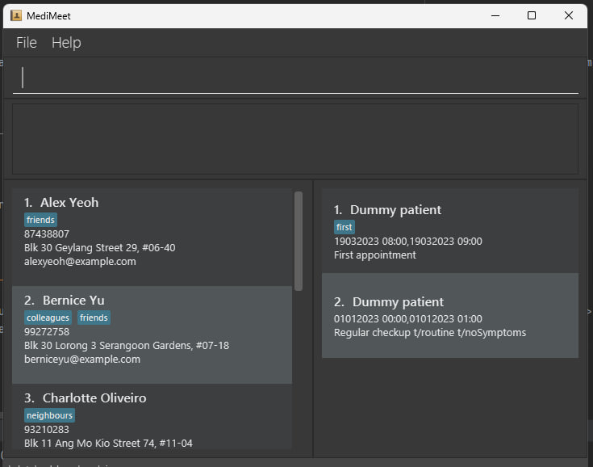

---
layout: page
title: User Guide

## Table of Contents
* [What is MediMeet](#what-is-medimeet)
* [Quick start](#quick-start)
* [Features](#features)
  * [Viewing help : `help`](#viewing-help--help)
* [FAQ](#faq)
* [Command summary](#command-summary)

--------------------------------------------------------------------------------------------------------------------
## What is MediMeet

**MediMeet** is a desktop application for doctors to manage their patients’ details and appointment dates. It helps them manage their own appointments and mitigates the need for a personal assistant or appointment manager, while also saving costs in the process.

--------------------------------------------------------------------------------------------------------------------
## Quick start

1. Ensure you have Java `11` or above installed in your Computer.

1. Download the latest `medimeet.jar` from [here]().

1. Copy the file to the folder you want to use as the _home folder_ for MediMeet.

1. Open a command terminal, `cd` into the folder you put the jar file in, and use the `java -jar medimeet.jar` command to run the application. 
   A GUI similar to the below should appear in a few seconds. Note how the app contains some sample data. 
   

1. Type the command in the command box and press Enter to execute it. e.g. typing **`help`** and pressing Enter will open the help window. 
   Some example commands you can try:

   * `list` : Lists all patients.

   * `add n/John Doe p/98765432 e/johnd@example.com a/John street, block 123, #01-01` : Adds a patient named `John Doe` to MediMeet.

   * `delete 3` : Deletes the 3rd patient shown in the current list.

   * `clear` : Deletes all contacts.

   * `exit` : Exits the app.

1. Refer to the [Features](#features) below for details of each command.

--------------------------------------------------------------------------------------------------------------------

## Features

**:information_source: Notes about the command format:** 

* Words in `UPPER_CASE` are the parameters to be supplied by the user. 
  e.g. in `add n/NAME`, `NAME` is a parameter which can be used as `add n/John Doe`.

* Items in square brackets are optional. 
  e.g `n/NAME [t/TAG]` can be used as `n/John Doe t/friend` or as `n/John Doe`.

* Items with `…`​ after them can be used multiple times including zero times. 
  e.g. `[t/TAG]…​` can be used as ` ` (i.e. 0 times), `t/friend`, `t/friend t/family` etc.

* Parameters can be in any order. 
  e.g. if the command specifies `n/NAME p/PHONE_NUMBER`, `p/PHONE_NUMBER n/NAME` is also acceptable.

* If a parameter is expected only once in the command but you specified it multiple times, only the last occurrence of the parameter will be taken. 
  e.g. if you specify `p/12341234 p/56785678`, only `p/56785678` will be taken.

* Extraneous parameters for commands that do not take in parameters (such as `help`, `list`, `exit` and `clear`) will be ignored. 
  e.g. if the command specifies `help 123`, it will be interpreted as `help`.

### Viewing help : `help`

Shows a message explaning how to access the help page.

Format: `help`

### Adding a patient: `add`

Adds a patient to MediMeet.

Format: `add n/NAME p/PHONE_NUMBER e/EMAIL a/ADDRESS [t/TAG]…​`

:bulb: **Tip:**
A patient can have any number of tags (including 0)

Examples:
* `add n/John Doe p/98765432 e/johnd@example.com a/John street, block 123, #01-01`
* `add n/Betsy Crowe t/friend e/betsycrowe@example.com a/Newgate Prison p/1234567 t/criminal`

### Listing all patients : `list`

Shows a list of all patients in MediMeet.

Format: `list`

### Editing a patient : `edit`

Edits an existing patient in MediMeet.

Format: `edit INDEX [n/NAME] [p/PHONE] [e/EMAIL] [a/ADDRESS] [t/TAG]…​`

* Edits the patient at the specified `INDEX`. The index refers to the index number shown in the displayed patient list. The index **must be a positive integer** 1, 2, 3, …​
* At least one of the optional fields must be provided.
* Existing values will be updated to the input values.
* When editing tags, the existing tags of the patient will be removed i.e adding of tags is not cumulative.
* You can remove all the patient’s tags by typing `t/` without
    specifying any tags after it.

Examples:
*  `edit 1 p/91234567 e/johndoe@example.com` Edits the phone number and email address of the 1st patient to be `91234567` and `johndoe@example.com` respectively.
*  `edit 2 n/Betsy Crower t/` Edits the name of the 2nd patient to be `Betsy Crower` and clears all existing tags.

### Locating patients by name: `find`

Finds patients whose names contain any of the given keywords.

Format: `find KEYWORD [MORE_KEYWORDS]`

* The search is case-insensitive. e.g `hans` will match `Hans`
* The order of the keywords does not matter. e.g. `Hans Bo` will match `Bo Hans`
* Only the name is searched.
* Only full words will be matched e.g. `Han` will not match `Hans`
* Patients matching at least one keyword will be returned (i.e. `OR` search).
  e.g. `Hans Bo` will return `Hans Gruber`, `Bo Yang`

Examples:
* `find John` returns `john` and `John Doe`
* `find alex david` returns `Alex Yeoh`, `David Li` 
  

### Locating patients by details: `find_details`

Finds patients whose details contain any of the given keywords.

Format: `find_details KEYWORD [MORE_KEYWORDS]`

* The search is case-insensitive. e.g `hans` will match `Hans`
* The order of the keywords does not matter. e.g. `Hans Bo` will match `Bo Hans`
* All patient details are searched.
* Only full words will be matched e.g. `Han` will not match `Hans`
* Patient details matching at least one keyword will be returned (i.e. `OR` search).
  e.g. `Hans Bo` will return `Hans Gruber`, `Bo Yang`

Examples:
* `find 22224444` returns the patient with a phone number `22224444`
* `find alex david` returns `Alex Yeoh`, `David Li` 
  

Examples:
* `find John` returns `john` and `John Doe`
* `find alex david` returns `Alex Yeoh`, `David Li` 
  

### Deleting a patient : `delete`

Deletes the specified patient from MediMeet.

Format: `delete INDEX`

* Deletes the patient at the specified `INDEX`.
* The index refers to the index number shown in the displayed patient list.
* The index **must be a positive integer** 1, 2, 3, …​

Examples:
* `list` followed by `delete 2` deletes the 2nd patient in the MediMeet.
* `find Betsy` followed by `delete 1` deletes the 1st patient in the results of the `find` command.

### Adding patient notes: `remark`

Adds a remark to a patient in MediMeet.

Format: `remark INDEX [r/REMARK]`

* Remarks cannot be edited and can only be overwritten.
* In order to remove notes from a patient, use `remark INDEX` without the optional `[r\REMARK]`.

* Example:
* `remark 1 r/Immunocompromised` Adds a note `Immunocompromised` to the patient.
* `remark 1` Removes any existing note from the patient.

### Adding an appointment: `add_appt`

Adds an appointment for an existing patient in MediMeet.

Format: `add n/NAME ts/TIMESLOT d/DESCRIPTION [t/TAG]…​`

:bulb: **Tip:**
A patient can have any number of tags (including 0)

Example:
* `add_appt n/John Doe ts/01012023 00:00,01012023 01:00 d/Regular checkup`

### Listing all appointments : `list_appt`

Shows a list of all appointments in MediMeet.

Format: `list_appt`

### Editing an appointment : `edit_appt`

Edits an existing appointment in MediMeet.

Format: `edit_appt INDEX [ts/TIMESLOT] [d/DESCRIPTION] [t/TAG]…​`

* Edits the appointment at the specified `INDEX`. The index refers to the index number shown in the displayed patient list. The index **must be a positive integer** 1, 2, 3, …​
* At least one of the optional fields must be provided.
* Existing values will be updated to the input values.

Examples:
*  `edit_appt 1 ts/01012023 00:00,01012023 01:00 d/Regular checkup` Edits the timeslot of the 1st appointment to be `01012023 00:00,01012023 01:00` and the description to be `Regular checkup`, respectively.

### Locating appointments: `find_appt`

Finds all appointments whose timeslots cover the specified time.
If a second timeslot is specified, all appointments that occur during that time period are found.

Format: `find_appt TIMESLOT [TIMESLOT]`

Examples:
*  `find_appt 01012023 00:00` Finds all appointments during `01012023 00:00`.
*  `find_appt 01012023 00:00 01012023 01:00` Finds all appointments between `01012023 00:00` and `01012023 01:00`.

### Deleting an appointment: `delete_appt`

Deletes an existing appointment in MediMeet.

Format: `delete APPOINTMENT_INDEX`

Example:
* `delete_appt 1`

### Clearing all entries : `clear`

Clears all entries from MediMeet.

Format: `clear`

### Exiting the program : `exit`

Exits the program.

Format: `exit`

### Saving the data

AddressBook data are saved in the hard disk automatically after any command that changes the data. There is no need to save manually.

### Editing the data file

AddressBook data are saved as a JSON file `[JAR file location]/data/addressbook.json`. Advanced users are welcome to update data directly by editing that data file.

:exclamation: **Caution:**
If your changes to the data file makes its format invalid, AddressBook will discard all data and start with an empty data file at the next run.

### Archiving data files `[coming in v2.0]`

_Details coming soon ..._

--------------------------------------------------------------------------------------------------------------------

## FAQ

**Q**: How do I transfer my data to another Computer? 
**A**: Install the app in the other computer and overwrite the empty data file it creates with the file that contains the data of your previous AddressBook home folder.

--------------------------------------------------------------------------------------------------------------------

## Command summary

| Action                      | Format, Examples                                                                                                                                                      |
|-----------------------------|-----------------------------------------------------------------------------------------------------------------------------------------------------------------------|
| **Add**                     | `add n/NAME p/PHONE_NUMBER e/EMAIL a/ADDRESS [t/TAG]…​`   e.g., `add n/James Ho p/22224444 e/jamesho@example.com a/123, Clementi Rd, 1234665 t/friend t/colleague` |
| **Add appointment**         | `add n/NAME ts/TIMESLOT d/DESCRIPTION [t/TAG]…​`   e.g., `add_appt n/John Doe ts/01012023 00:00,01012023 01:00 d/Regular checkup`                                  |                                                                                                       |
| **Clear**                   | `clear`                                                                                                                                                               |
| **Delete**                  | `delete INDEX`  e.g., `delete 3`                                                                                                                                   |
| **Delete appointment**      | `delete_appt INDEX`  e.g., `delete_appt 3`                                                                                                                         |
| **Edit**                    | `edit INDEX [n/NAME] [p/PHONE_NUMBER] [e/EMAIL] [a/ADDRESS] [t/TAG]…​`  e.g.,`edit 2 n/James Lee e/jameslee@example.com`                                           |
| **Edit appointment**        | `edit_appt INDEX [ts/TIMESLOT] [d/DESCRIPTION] [t/TAG]…​`   e.g.,`edit_appt 1 ts/01012023 00:00,01012023 01:00 d/Regular checkup`                                  |
| **Find**                    | `find KEYWORD [MORE_KEYWORDS]`  e.g., `find James Jake`                                                                                                            |
| **Find in patient details** | `find_details KEYWORD [MORE_KEYWORDS]`  e.g., `find 22224444`                                                                                                      |
| **Find appointment**        | `find_appt TIMESLOT [TIMESLOT]`  e.g., `find_appt 01012023 00:00 01012023 01:00`                                                                                   |
| **List**                    | `list`                                                                                                                                                                |
| **List appointments**       | `list_appt`                                                                                                                                                           |
| **Help**                    | `help`                                                                                                                                                                |
| **Add patient notes**       | `remark INDEX [r/REMARK]`   e.g., `remark 3 r/Immunocompromised`                                                                                                   |
