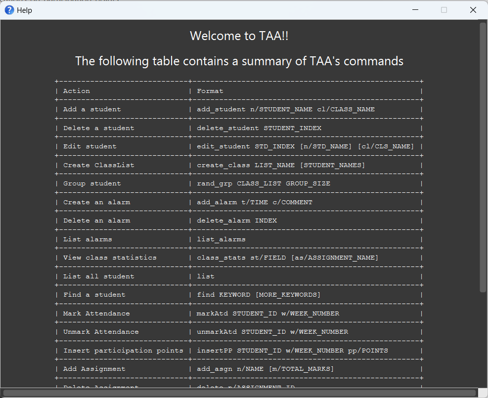
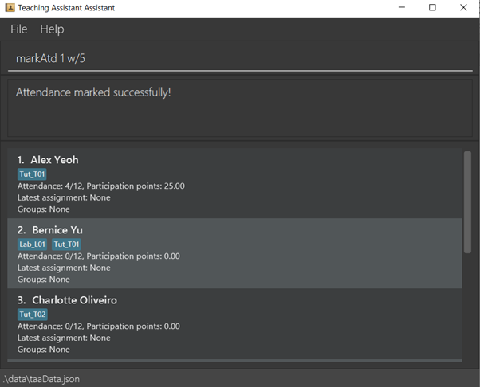
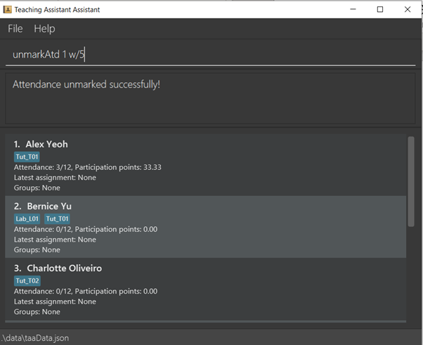
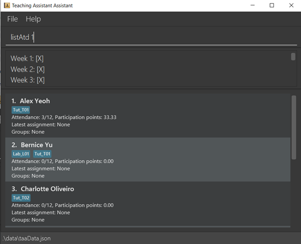
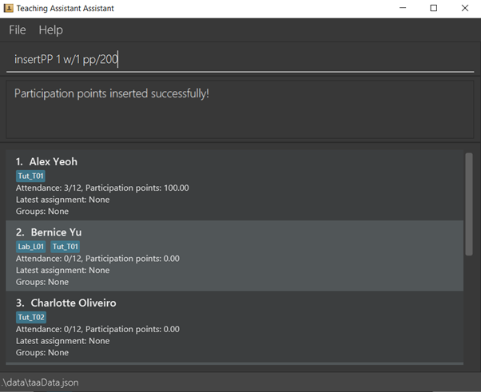
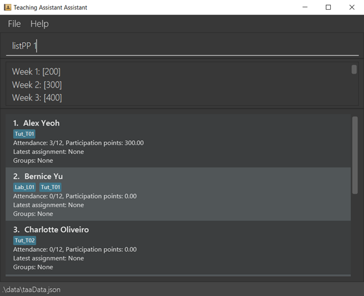
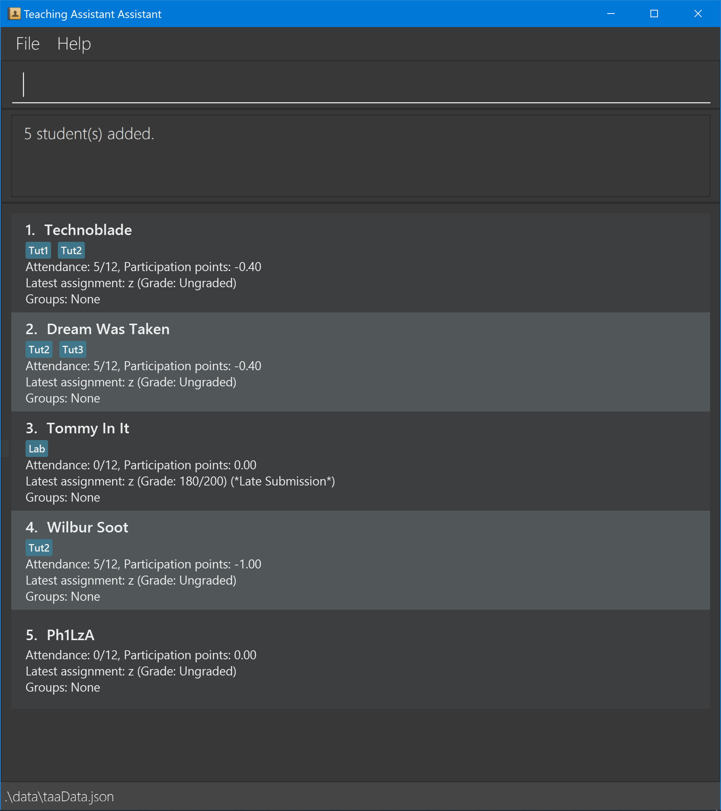

* Table of Contents
{:toc}

## **Introduction**


### About this application

Teaching Assistant Assistant (TAA) is a desktop app for managing teaching assistant activities, optimized for use via a
Command Line Interface (CLI) while still retaining the benefits of a Graphical User Interface (GUI).

TAA provides a one-stop solution that meets the following teaching needs of a TA in just one single application:

1. You can easily track student attendance and grades using just a keyboard, eliminating the need for multiple clicks.
2. You can even view grade statistics without the use of a dedicated data analysis application!
3. You can schedule alarms that help you manage your time during class. Gone are the days of you unknowingly spending
   too much time on a single question during tutorial or forgetting to mark students' attendance at the end of class.
4. You can save the troubles of manually importing and exporting data into and out of the TAA application, thanks to our
   CSV parser!

Say goodbye to the hassle of managing teaching assistant tasks and hello to increased efficiency with TAA!

### Objectives of this guide

This guide is written to provide comprehensive instructions for users to use TAA effectively and efficiently. More
advanced users can also benefit from this guide by following the additional information provided in each feature.

If you are a teaching assistant who can type fast, this guide is for you!

### Using the guide

#### Navigation

To use the guide, you may wish to take a look at the table of contents at the start of the page. You can click on the
relevant sections you wish to visit, and the hyperlink will bring you straight to the relevant section.

Alternatively, you may wish to use the built-in search function in your browser (<Button>Ctrl</Button> + <Button>
F</Button>) to look for specific keywords relevant to your query.

#### Formatting

Aside from the usual text format, this guide includes certain special formats that are used for different purposes.

##### Callouts

Callouts are identified by a coloured box containing some text.

**Note**
<div markdown="span" class="alert alert-warning">
:page_with_curl: **Note:** Contains important information on how the application is designed to be used.
</div>

**Information**
<div markdown="span" class="alert alert-primary">
:information_source: **Info:** Provides information that is not essential, but may be useful (especially for advanced users!).
</div>

**Tip**
<div markdown="span" class="alert alert-success">
:bulb: **Tip:** Provides recommendations on how you can use the app more effectively.
</div>

**Warning**
<div markdown="span" class="alert alert-danger">
:warning: **Warning:** Describes actions that may cause the application to function unexpectedly.
</div>

##### Syntax highlighting

Text contained within a `grey background` are used to denote either of the following:

- commands that can be entered into the command bar
- file names
- command line commands, to be run in the [terminal](#glossary) of the host machine

##### Keys

Keys such as <Button>A</Button> <Button>B</Button> <Button>C</Button> are used to denote keys on the keyboard that can
be pressed to perform certain things.

They can also be used to denote keys that should be held together, at the same time. For example, <Button>Ctrl</Button>

+ <Button>F</Button> indicates that the user can press both the Ctrl and F keys together to perform a given action.

--------------------------------------------------------------------------------------------------------------------

## **Quick start**

1. Ensure you have Java 11 or above installed in your Computer.

1. Download the latest `taa.jar` from [here](https://github.com/AY2223S2-CS2103T-T14-4/tp/releases).

1. Copy the file to the folder you want to use as the _home folder_ for your TAA.

1. Open a command terminal, `cd` into the folder you put the jar file in, and use the `java -jar taa.jar` command to run
   the application.<br>
   A GUI similar to the below should appear in a few seconds. Note how the app contains some sample data.<br><br>
   
   <figcaption style="text-align:center"><em><strong>
   Figure 1
   </strong>
   : TAA window
   </em></figcaption>

1. Type the command in the command box and press Enter to execute it. e.g. typing `help` and pressing Enter will open
   the help window.<br>
   Some example commands you can try:

    * `list` : Lists all students.

    * `add_student n/John Doe cl/T01 cl/L02` : Adds a contact named `John Doe` to the Class Lists `T01` and `L02`.

    * `delete_student 3` : Deletes the 3rd student shown in the current list.

    * `exit` : Exits the app.

1. Refer to the [Features](#features) below for details of each command.

--------------------------------------------------------------------------------------------------------------------

## **Graphical User Interface**


<figcaption style="text-align:center"><em><strong>
Figure 2
</strong>:
Labelled components of the TAA GUI
</em></figcaption>

<br />
<div markdown="span" class="alert alert-primary">
:information_source: **Info:** Each Class List consists of 0 or more Student Cards.
</div>

The purposes of each component, as labelled in Figure 2 above, are described in Table 1 below.
<br />

<div style="text-align:center"><strong>
Table 1
</strong>:
Purposes of each GUI component
</div>

|     Component      |                                      Purpose                                       |
|:------------------:|:----------------------------------------------------------------------------------:|
|    Command Box     |                         To accept commands from the user.                          |
|     Output Box     |             To display the result of the commands issued by the user.              |
| Class List Display |        To display the list of students in the currently active class list.         |
|    Student Card    | To display the relevant information for a single Student in the active class list. |

<div markdown="span" class="alert alert-warning">
:page_with_curl: **Note:** To send your command, first type in your command in the command box. Then, press the <Button>Enter</Button> key to send it!
</div>

<div markdown="span" class="alert alert-primary">
:information_source: **Info:** The commands below will operate on the active class list being displayed in the Class List display.
If the students being displayed are not the ones you wish to update, do remember to update the active class list before continuing.
</div>


--------------------------------------------------------------------------------------------------------------------

## **Features**

<div markdown="span" class="alert alert-warning">
:page_with_curl: **Note:** The commands stated below will follow the syntax defined in Table 2. Come back here if you're ever confused on what the symbols mean!
</div>

<div style="text-align:center"><strong>
Table 2
</strong>:
Command syntax
</div>

|            Syntax            |                                                                      Explanation                                                                       |
|:----------------------------:|:------------------------------------------------------------------------------------------------------------------------------------------------------:|
|          `prefix/`           |           Prefixes that are used to separate the parameters supplied by the user. These are usually lower-case and are 1-2 characters long.            |
|         `UPPER_CASE`         |            [Parameters](#glossary) to be specified by the user. These parameters are compulsory if they are not wrapped in square brackets.            |
| `[Items in square brackets]` |                                       Optional parameters. The command will work fine if these are not included.                                       |
|   `param...`/`[param]...`    | More than one of the parameter `param` is accepted. The first case allows for 1 or more `params`, while the second case allows for 0 or more `params`. |

<div markdown="span" class="alert alert-success">
:bulb: **Tip:** Parameters can be specified in any order!
</div>

<div markdown="span" class="alert alert-primary">
:information_source: **Info:** If a parameter is expected to be passed in only once, but is specified multiple times by the user, only the last occurrence of the parameter will be taken by the application.
</div>

<div markdown="span" class="alert alert-primary">
:information_source: **Info:** Extraneous parameters for commands that do not take in parameters will be ignored.
</div>

### General

These commands are either used to interact with students across all class lists, or just general commands that are not
related to any of the sections below:

- `list`
- `find`
- `clear`
- `help`

#### List all students : `list`

Lists all students tracked by TAA, across all class lists.

Format: `list`

#### Find a particular student : `find`

Find students across all classes whose names contain any of the specified keywords.

Format: `find KEYWORD [MORE_KEYWORDS]...`

- The given `KEYWORD`/`MORE_KEYWORDS` are not case-sensitive.

Examples:

- `find Alice Bob Charlie`
- `find bAlAKRiSHNan`

<div markdown="span" class="alert alert-warning">
:page_with_curl: **Note:** A given keyword must exist as a whole word in a name for it to be considered as a match.
e.g. The keyword `bala` does not match the name `Roy Balakrishnan` as `Bala` is not the full word `Balakrishnan`.
</div>

#### Clear all students: `clear`

Removes all students currently being tracked by TAA.

Format: `clear`

<div markdown="span" class="alert alert-danger">
:warning: **Warning:** This will delete all student records in TAA. Only use this command if you are sure you want to start off with a totally empty student list.
</div>

#### Display the help menu: `help`

Displays the help menu.

Format: `help`


<figcaption style="text-align:center"><em><strong>
Figure 3:
</strong>
A preview of the help menu displayed.
</em></figcaption>

### Attendance

For attendance, you can make the following calls:

* markAtd
* unmarkAtd
* listAtd

#### Mark attendance: `markAtd`

Marks the attendance of a student for that week<br>
Format: `markAtd STUDENT_INDEX w/WEEK_NUMBER`

`STUDENT_INDEX`: A positive integer that represents the index of student as shown in Class List display portion of TAA
GUI<br>
`WEEK_NUMBER`: A integer between 1 and 12 (inclusive of both 1 and 12) <br>
Marking the attendance for a week that is already marked will result in a
message `This student's attendance has already been marked.`

Examples

* `markAtd 1 w/1` (marks attendance of student with index 1 for week 1)
* `markAtd 2 w/1` (marks attendance of student with index 2 for week 1)



#### Unmark attendance: `unmarkAtd`

Unmarks the attendance of a student for that week<br>
Format: `unmarkAtd STUDENT_INDEX w/WEEK_NUMBER`

`STUDENT_INDEX`: A positive integer that represents the index of student as shown in Class List display portion of TAA
GUI <br>
`WEEK_NUMBER`: A integer between 1 and 12 (inclusive of both 1 and 12) <br>
Unmarking the attendance for a week that is already unmarked will just result in the successful unmarking message being
displayed `Attendance unmarked successfully!`

Examples

* `unmarkAtd 1 w/1` (unmarks attendance of student with index 1 for week 1)
* `unmarkAtd 2 w/1` (unmarks attendance of student with index 2 for week 1)



#### List Attendance: `listAtd`

Lists the attendance of a student from week 1 to week 12<br>
Format: `listAtd STUDENT_INDEX`

`STUDENT_INDEX`: A positive integer that represents the index of student as shown in Class List display portion of TAA
GUI <br>

Examples

* `listAtd 1` (list attendance of student with index 1)
* `listAtd 2` (list attendance of student with index 2)

The listed attendance will be such that every line will be in the format `Week NUM: [PRESENT]` <br>
where `NUM` represents the week number, and `PRESENT` takes the value of `X` is the student is present, and empty
otherwise

Example

```
Week 1: [X]
Week 2: [X]
Week 3: [X]
Week 4: []
Week 5: []
Week 6: []
Week 7: []
Week 8: []
Week 9: []
Week 10: []
Week 11: []
Week 12: []
```



The above example shows that the student is present for week 1,2,3 and absent for the rest of the weeks

### Participation

For participation, you can make the following calls:

* insertPP
* listPP

#### Clarifications on Participation points

* Participation points is represented by an integer from `0` to `700` (inclusive of both `0` and `700`) <br>
  Except for the special situation where the attendance is not marked, then the participation points will be `-1` <br>
  If users are inserting participation points, only an integer from `0` to `700` (inclusive of both `0` and `700`) is
  allowed
* When the attendance of a student for a week is marked (not present -> present for the week) <br>
  TAA will automatically change the participation points of the student from `-1` to `0`
* Unmarking a student's attendance automatically changes the participation points of a student to `-1`
* The participation points displayed in Class List portion of the TAA GUI is the average points, which is calculated
  using `Total participation points` / `Number of weeks present` <br>
  `Total participation points` is the sum of all participation points for weeks when the student is present <br>
  `Number of weeks present` refers to the number of week present from week 1 to week 12

#### Insert participation points: `insertPP`

Inserts participation points of a student for that week<br>
Format: `insertPP STUDENT_INDEX w/WEEK_NUMBER pp/POINTS`

`STUDENT_INDEX`: A positive integer that represents the index of student as shown in Class List display portion of TAA
GUI <br>
`WEEK_NUMBER`: A integer between 1 and 12 (inclusive of both 1 and 12) <br>
`POINTS`: A integer between 0 and 700 (inclusive of both 0 and 700)

Participation points can only be inserted for a week when the attendance is already marked. <br>
Violation of this will result in a message `Mark the attendance of the student first before inserting points!`

Examples

* `insertPP 1 w/1 pp/200` (inserts participation points of 200 for week 1 of student with index 1)
* `insertPP 2 w/1 pp/300` (inserts participation points of 300 for week 1 of student with index 2)



#### List participation points: `listPP`

Lists the participation points of a student from week 1 to week 12<br>
Format: `listPP STUDENT_INDEX`

`STUDENT_INDEX`: A positive integer that represents the index of student as shown in Class List display portion of TAA
GUI <br>

Examples

* `listAtd 1` (list participation points of student with index 1)
* `listAtd 2` (list participation points of student with index 2)

The listed participation points will be such that every line will be in the format `Week NUM: [POINTS]` <br>
where `NUM` represents the week number, and `POINTS` is the participation points for that week

Example

```
Week 1: [200]
Week 2: [300]
Week 3: [400]
Week 4: [-1]
Week 5: [-1]
Week 6: [-1]
Week 7: [-1]
Week 8: [-1]
Week 9: [-1]
Week 10: [-1]
Week 11: [-1]
Week 12: [-1]
```

The above example shows that the student have a participation point of 200 for week 1, 300 for week 2, 400 for week 3,
and -1 for the rest of the weeks (attendance is not marked)



### Assignments & Submissions

#### Preface

Assignment: A school assignment. Has an alphanumeric name, a non-negative integer total marks, and student submissions
associated with it.

Submission: Linked to an assignment. Each student has a submission for every existing assignment.

For assignments & submissions, you can make the following calls:

* add_asgn
* delete_asgn
* grade
* ungrade
* list_asgn

#### Add Assignment: `add_asgn`

Adds an assignment with a specified name and total marks.

If the total marks for the assignment is unspecified, a default value of 100 will be given.

Student submissions for that assignment will be immediately created for all existing students. All student submissions
for that assignment will initially be ungraded.

Format: `add_asgn n/ASSIGNMENT_NAME [m/TOTAL_MARKS]`<br>
Example:

* `add_asgn n/Lab 1`
* `add_asgn n/Lab 2 m/50`


#### Delete Assignment: `delete_asgn`

Deletes the assignment of assignment_name you provided, along with the student submissions for that assignment.

Format: `delete n/ASSIGNMENT_NAME`<br>

Example:

* `delete_asgn n/Lab 1`

#### Grade Assignment: `grade`

Grades the student submission of assignment_name and student_id with the provided marks.

You can also indicate whether a student submission is late by adding "late/" at the end.

A submission can be graded multiple times, even if it is already graded. In that case, the latest grade will be taken.

Format: `grade n/ASSIGNMENT_NAME i/STUDENT_ID m/MARKS [late/]`<br>
Example:

* `grade n/Lab 1 i/2 m/20`
* `grade n/Lab 1 i/3 m/30 late/`


#### Ungrade Assignment: `ungrade`

Resets the grade of the submission of assignment_name and student_id. It will also reset the late submission status of
the submission, if the submission was marked as late.

A submission can be ungraded multiple times, even if it is already ungraded. In that case, the subsequent ungrades will
have no effect.

Format: `ungrade n/ASSIGNMENT_ID i/STUDENT_ID`<br>
Example:

* `ungrade n/Lab 1 i/2`

#### List all assignments: `list_asgn`
Lists all assignments, submissions and their respective information.

Format: `list_asgn`

Example Output:
* `Assignment Lab 1:` <br>
`  [X] Alice: 50/100 marks.` <br>
`  [ ] Bob: 0/100 marks.` <br>
*  `Assignment Lab 2:` <br>
`  [ ] Alice: 0/100 marks.` <br>
`  [X] Bob: 77/100 marks. (*Late Submission*)` <br>

The example output above shows that there are 2 assignments: Lab 1 & Lab 2.

Alice has a graded submission for Lab 1, and Bob has a graded late submission for Lab 2.


### Class List

The class list is list of the students enrolled in a class. For class lists, you can call the following commands:

- Create class list: `create_class`
- View class statistics: `class_stats`
- (Random) Groupings: `rand_grp`
- Adding a student: `add`
- Deleting a student: `delete`
- Listing all students in a class: `list`
- Find student: `find`

#### Create a class list: `create_class`

Creates a class list to store the information about a group of students.

Format: `create_class LIST_NAME`

- The argument `LIST_NAME` should be the name of the new class list

Examples:

- `create_class cs6244` creates an empty class list.

#### Add a student: `add_student`

Adds a student to a given class list.

Format: `add_student n/STUDENT_NAME cl/CLASS_NAME...`

- The argument `STUDENT_NAME` should be the name of the student to be added. It only accepts alphanumeric inputs and
  spaces.
- The argument `CLASS_NAME` should be the name of a given class the student belongs to

Examples:

- `add_student n/Tom cl/cs2103t-t14` adds Tom to the class CS2103T-T14
- `add_student n/Harry cl/cs6244` adds Harry to the class CS6244

<div markdown="span" class="alert alert-primary">
:information_source: **Info:** If the class list `CLASS_NAME` does not exist, it will automatically be created with student
`STUDENT_NAME` as its first student
</div>

<div markdown="span" class="alert alert-success">
:bulb: **Tip:** You can add a student to multiple classes at once! Just specify multiple `cl/` prefixes in your command. e.g. `add n/Harry cl/cs6244 cl/cs1231s`
</div>

<div markdown="span" class="alert alert-success">
:bulb: **Tip:** As `STUDENT_NAME` accepts alphanumeric inputs, student numbers such as `A1234567X` are perfectly valid student names!
</div>

#### Edit a student: `edit_student`

Edits a student in the active class list.

Format: `edit_student STUDENT_INDEX [n/STUDENT_NAME] [cl/CLASS_NAME]`

- The `STUDENT_INDEX` is the index of the student that is currently being shown on screen.
- At least one of the optional fields must be present. (i.e. either `STUDENT_NAME` and/or `CLASS_NAME`)

Examples:

- `edit_student 3 n/Barry Allen` changes the name of the 3rd student to "Barry Allen"
- `edit_student 5 cl/Tutorial_T14` assigns the 5th student only to the class "Tutorial_14"
- `edit_student 12 n/Tom Hanks cl/Lab_L11` changes the name of the 12th student to "Tom Hanks", and assigns him to the
  class "Lab_L11"

<div markdown="span" class="alert alert-danger">
:warning: **Warning:**  The new fields will override the fields of the targeted student completely. i.e. to add an extra field, you will have to copy over the previous fields and add one additional parameter containing the new field to be added.
</div>

#### Delete a student: `delete_student`

Deletes a student from the active class list.

Format: `delete_student STUDENT_INDEX`

- The `STUDENT_INDEX` is the index of the student that is currently being shown on screen.

Examples:

- `delete_student 3` removes the 3rd student in the currently active/displayed class list

<div markdown="span" class="alert alert-warning">
:page_with_curl: **Note:** This command will delete the student with the given ID on the active class list, not from the list of all students obtained from using the `list` command.
</div>

#### View class statistics: `class_stats`

Displays statistics for the class, based on the specified field.

Format: `class_stats st/FIELD [as/ASSIGNMENT_NAME]`

- The argument `FIELD` must only be one of `attendance`/`grades`
- If `attendance` is entered as the `FIELD` parameter, then `ASSIGNMENT_NAME` is not required and will be ignored.
- If `grades` is entered as the `FIELD` parameter, then `ASSIGNMENT_NAME` is required.

Examples:

- `class_stats st/attendance` -- see Figure 4 below
- `class_stats st/grades as/Test 2` -- see Figure 5 below

<div markdown="span" class="alert alert-warning">
:page_with_curl: **Note:** To view grade statistics, the assignment `ASSIGNMENT_NAME` must have at least 2 graded submissions, and the submission grades must contain some variance. (i.e. if all the submissions are graded with the exact same marks, then no curve will be drawn as a normal distribution cannot be modelled with 0 variance.)
</div>

<div markdown="span" class="alert alert-primary">
:information_source: **Info:** The `FIELD` parameter is case-insensitive!
i.e. `atTenDanCE`, while unusual, is still a valid argument to `FIELD`.
</div>

<div markdown="span" class="alert alert-success">
:bulb: **Tip:** Want to save the chart? Right click on it, mouseover 'Save As' and click on 'PNG'!
</div>


<figcaption style="text-align:center"><em><strong>
Figure 4
</strong>
: An example of the chart displayed for the command `class_stats st/attendance`
</em></figcaption>

<br/>


<figcaption style="text-align:center"><em><strong>
Figure 5
</strong>
: An example of the chart displayed for the command `class_stats st/grades as/Test 2`
</em></figcaption>

### Alarm


For Alarm, you can call the following commands:

- Schedule an alarm: `add_alarm`
- Remove a scheduled alarm: `delete_alarm`
- List all scheduled alarms: `list_alarms`

#### Schedule an alarm : `add_alarm`

Add an alarm to the current application.

Format: `add_alarm t/TIME c/COMMENT`

- The TIME field must be numbers representing minutes
- The COMMENT field contains content of the alarm

Examples:

- add_alarm t/5 c/finish question one
- The above command adds an alarm that rings in 5 minutes, with comment "finish question 1"

#### Remove a scheduled alarm : `delete_alarm`

Delete a scheduled alarm from the current alarm list. It will not ring on the scheduled time after deletion.

Format: `delete_alarm INDEX`

- the INDEX is the number assigned to the alarm in the alarm list when we call the list_alarms command

Examples:

- delete_alarm 1

#### List all scheduled alarms : `list_alarms`


List all alarms scheduled, arranged in the order of creation, containing time left and comment of each alarm.

Examples:

- list_alarms

### CSV Parser

Stores and loads student data in with CSV files.

* Import data in CSV format: `import`
* Export data in CSV format: `export`

Our CSV files follow the following format:

1. All our CSV files are header-less.
2. The student data must have exactly 5 columns separated by colons in order:

* Name: Non-blank alphanumeric words. Two students cannot have the same name.
* (Optional) Attendance: Exactly 12 numbers separated by semicolons. Each number is either 0 (absent) or 1 (attended).
    * If unspecified, the default value is all absent.
* (Optional) Participation point: exactly 12 numbers separated by semicolons. Each number is either -1 (unmarked) or an
  integer between 0-700 (inclusive).
    * If unspecified, the default value is all unmarked.
* (Optional) Submission: submission entries separated by semicolons.
    * Each submission entry has exactly 4 fields separated by colons in order:
        * Assignment name: must exist in the assignment list upon import. No student can have multiple submissions of
          same assignment name.
        * Graded: either 0 (ungraded) or 1 (graded).
        * Late: either 0 (on time) or 1 (late).
        * Mark: integer between 0 and the total marks of the assignment.
    * If a student made no submission to an assignment, TAA creates a submission record that is ungraded, on time, and
      marked 0 for this assignment for this student.
* (Optional) Class: Non-blank alphanumeric words separated by semicolons.

2. Optional fields still requires a colon to be represented in the CSV file
   because ["if a column is defined as optional, it means that the column is required to exist, but the value can be blank."](https://www.ibm.com/docs/en/atlas-policy-suite/6.0.3?topic=files-rules-creating-populating-csv)

Acceptable CSV format example: (suppose )

```
Technoblade,1;0;0;1;1;1;0;1;0;0;0;0,-1;0;-1;2;-1;-1;-1;-1;200;-1;-1;-1,"x,0,0,1;y,0,0,2;z,0,0,3;",Tut1;Tut2;
 Dream Was Taken,    1  ;0;0 ; 1;1;1; 0;1  ;0;0;0;0,-1;0; -1;2;-1;-1;-1  ;-1;200;-1;-1;-1,"  x ,0, 0,2;y,0 ,0,100 ; z,0  ,  0,0 ;  ", Tut2   ;Tut3;
Tommy In It,,-1;0;-1;2;-1;-1;-1;-1;2;-1;-1;-1,"x,0,0,15;z,0,0,0;",Lab
Wilbur Soot,1;0;0;1;1;1;0;1;0;0;0;0, ,"y,0,0,0", ;Tut2;
Philza Minercaft,,,,
```

Excel spreadsheet format that exports acceptable CSV files: (please ignore the first empty row)

|                  |                              |                                      |                                    |             |
|------------------|------------------------------|--------------------------------------|------------------------------------|-------------|
| Technoblade      | 1;0;0;1;1;1;0;1;0;0;0;0      | -1;0;-1;2;-1;-1;-1;-1;200;-1;-1;-1   | x,0,0,1;y,0,0,2;z,0,0,3;           | Tut1;Tut2;  |
| Dream Was Taken  | 1 ;0;0 ; 1;1;1; 0;1 ;0;0;0;0 | -1;0; -1;2;-1;-1;-1 ;-1;200;-1;-1;-1 | x ,0, 0,2;y,0 ,0,100 ; z,0 , 0,0 ; | Tut2 ;Tut3; |
| Tommy In It      |                              | -1;0;-1;2;-1;-1;-1;-1;2;-1;-1;-1     | x,0,0,15;z,0,0,0;                  | Lab         |
| Wilbur Soot      | 1;0;0;1;1;1;0;1;0;0;0;0      |                                      | y,0,0,0                            | ;Tut2;      |
| Philza Minercaft |                              |                                      |                                    |             |

#### Import data in CSV format: `import`

Import data in CSV format from file.

Format: `import [-force] FILE_PATH`

* Option -force overwrites records of existing students.
* Nothing is changed to TAA if data reading meets any error.

Successful import of a file containing the example data should display this:


#### Export data in CSV format: `export`

Export data in CSV format to file.

Format: `export [-force] FILE_PATH`

* If file exists, export is blocked unless -force flag is used. Otherwise, create file and export.
* Option -force overwrites existing file.
* Nothing is saved to disk if file access denied.

--------------------------------------------------------------------------------------------------------------------

## **Glossary**

|           Term           |                                                                               Explanation                                                                                |
|:------------------------:|:------------------------------------------------------------------------------------------------------------------------------------------------------------------------:|
|       Desktop App        |                           A software program that runs on a computer's desktop or laptop operating system, rather than through a web browser.                            |
|  Command Line Interface  |            A way of interacting with a computer program by typing in text commands instead of using a graphical user interface (GUI) with buttons and menus.             |
| Graphical User Interface | A type of user interface that allows users to interact with a computer program using graphical elements such as buttons, menus, and icons instead of typing in commands. |
|         Terminal         |                    Text-based interface used to interact with the computer's operating system. For Windows, it is usually called the Command Prompt.                     |
|       Host Machine       |                                                    The computer that is used to run the software/program in question.                                                    |
|        Parameter         |                                  A value that is passed in by the user. This value changes depending on what the user decides to enter.                                  |
|         Student          |                                  A person recorded in our app. Has an alphanumeric name and may have class list tags associated to it.                                   |
|        Assignment        |                      A school assignment. Has an alphanumeric name, a non-negative integer total marks, and student submissions associated with it.                      |
|        Submission        |                                          Linked to an assignment. Each student has a submission for every existing assignment.                                           |


