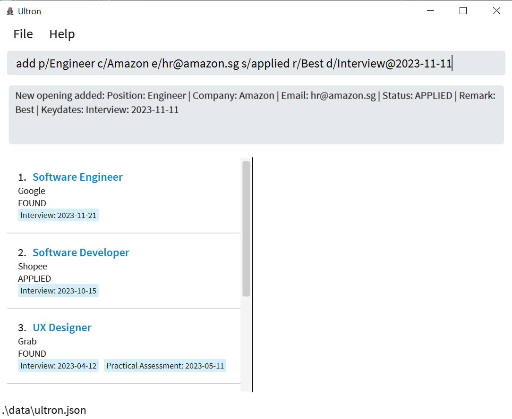
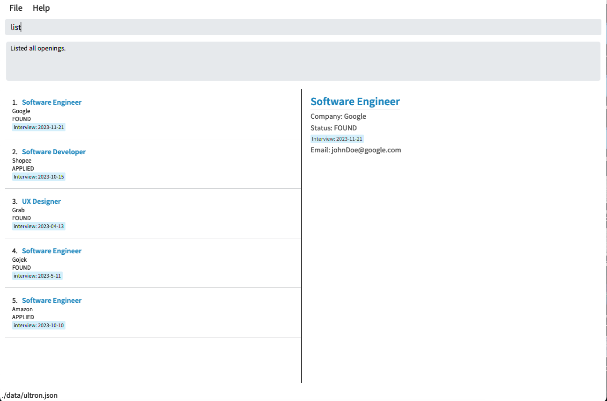
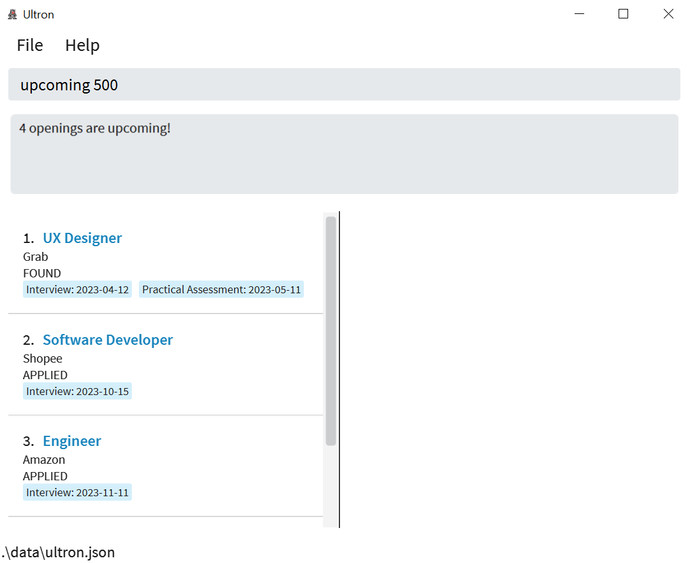
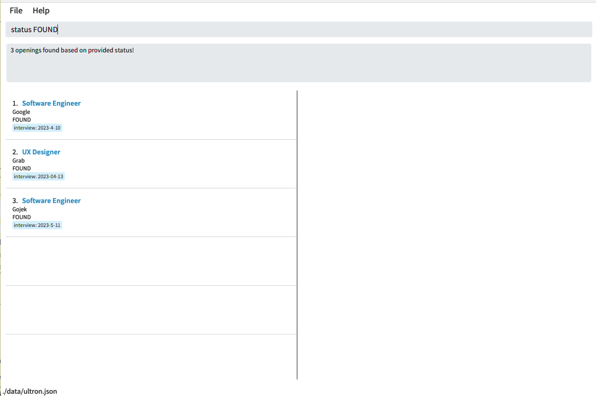

Ultron is a **desktop app for compiling job and internship openings, optimized for use via typing**. The application interface provides you both a summary list and a detailed display, with a text input box for commands. If you are familiar with the Ultron interface and type fast, it can help you organise your openings in a quick and structured manner.

- Table of Contents
  {:toc}

---

## Quick start
1. Ensure you have Java `11` or above installed in your Computer.

1. Download the latest `Ultron.jar` from [here](https://github.com/se-edu/addressbook-level3/releases).

1. Copy the file to the folder you want to use as the _home folder_ for your Ultron.

1. Open a command terminal, `cd` into the folder you put the jar file in, and use the `java -jar Ultron.jar` command to run the application. 
   You should see something similar to the image below. Note how the app contains some sample data. 

   

1. Type the command in the command box and press Enter to execute it. e.g. typing **`help`** and pressing Enter will open the help window. 
   Some example commands you can try:

   * `list` : Lists all contacts.
   * `delete 3` : Deletes the 3rd contact shown in the current list.

Refer to the [Features](#features) below for details of each command.

---

## Features

**:information_source: Notes about the command format:** 

- Words in `UPPER_CASE` are the parameters to be supplied by the user. 

  e.g. in `add p/POSITION`, `POSITION` is a parameter which can be used as `add p/Software Engineer`.

- Items in square brackets are optional. 
  e.g. `c/COMPANY [d/KEYDATE]` can be used as `c/Google d/Interview@2023-04-01` or as `c/Google`.

- Items with `…`​ after them can be used multiple times including zero times. 
  e.g. `[d/KEYDATE]…​` can be used as ` ` (i.e. 0 times), `d/Interview@2023-04-01`, `d/Interview@2023-04-01 d/OA@2023-05-02` etc.

- Parameters can be in any order. 
  e.g. if the command specifies `p/POSITION c/COMPANY`, `c/COMPANY p/POSITION` is also acceptable.

- If a parameter is expected only once in the command but you specified it multiple times, only the last occurrence of the parameter will be taken, excluding `status` command. 
  e.g. if you specify `c/Google c/Shopee`, only `c/Shopee` will be taken.

- Extraneous parameters for commands that do not take in parameters (such as `exit`) will be ignored. 
  e.g. if the command specifies `exit 123`, it will be interpreted as `exit`.

### Adding an opening : `add`

Having too many internships offers and being unable to keep track of all of them? 
Ultron provides you with a platform to remember all your openings so you don't have to! 
Just type 'add' followed by details of your opening in the format below and you can see 
it being added to Ultron. 

Format: `add p/POSITION c/COMPANY e/EMAIL s/STATUS [r/REMARK] [d/KEYDATE]…​`

- `KEYDATE` must be in the form `KEY@DATE`, where `KEY` is a key event in the application process and `DATE` is the date of the event in `YYYY-MM-DD` format.
- `KEY` must only contain alphabetic characters, cannot be blank and cannot only contain whitespaces. 
- `STATUS` **must be of either found, applied, interviewing, offered, accepted or rejected**.
- If both `COMPANY` and `POSITION` of a new opening matches a current opening, the new opening will not be added. 
- Opening displayed after adding only displays `POSITION`, `COMPANY`, `STATUS` and `KEYDATES`. 
- To view the full details of the opening, use `show` command. 

Examples:

- `add p/Software Engineer c/Google e/chinese@google.com s/interviewing d/Interview@2023-03-14`

### Listing all openings : `list`

Ultron gives you the option to view all your recorded openings in one window. Just type 'list' 
and the full list of openings will be displayed starting with the earliest added opening. 

Format: `list`

- The most recently added opening will be displayed last. 

### Editing an opening : `edit`

Accidentally typed the wrong company name? Don't worry, Ultron allows you to edit a previously 
added opening without having to delete and start over. Just type in 'edit' followed by the index 
number of the desired opening with the field you want to change. Ultron will update the opening with just a single command line. 

Format: `edit INDEX [p/POSITION] [c/COMPANY] [e/EMAIL] [s/STATUS] [d/KEYDATE]…​`

- Edits the opening at the specified `INDEX`. The index refers to the index number shown in the displayed opening list. The index **must be a positive integer** 1, 2, 3, …​
- At least one of the optional fields must be provided.
- Existing values will be updated to the input values.
- When editing `KEYDATE`, the existing `KEYDATE` of the opening will be removed i.e adding of `KEYDATE` is not cumulative.
- You can remove all the `KEYDATE` of the opening by typing `d/` without
  specifying any `KEYDATE` after it.

Examples:

- `edit 1 c/Goggle e/johndoe@example.com` Edits the company and email address of the 1st opening to be `Goggle` and `johndoe@example.com` respectively.
- `edit 2 c/Shopee d/` Edits the company of the 2nd opening to be `Shopee` and clears all existing `KEYDATE`.

### Editing an opening's remarks : `remark`

Edits the remark field of the opening at the specified INDEX to REMARK. 

Format: `remark INDEX r/REMARK`

- Edits the remark of the opening at the specified `INDEX`. The index refers to the index number shown in the displayed opening list. 
- The index **must be a positive integer** 1, 2, 3, …​
- Existing values will be updated to the input values.
- When editing `REMARK`, the existing `REMARK` of the opening will be removed i.e editing of `REMARK` is not cumulative.
- You can remove all the `REMARK` of the opening by typing `d/` without
  specifying any `REMARK` after it.

# Showing full details of opening: `show`

Displays the full details of the opening at the specified INDEX. 

Format: `show INDEX`

- Show details of the opening at the specified `INDEX`.
- The index refers to the index number shown in the displayed opening list.
- The index **must be a positive integer** 1, 2, 3, …​

# Listing upcoming dates : `upcoming`

Lists openings which has events today or within the next `DAYS` days, sorting in order of the first keydate of each relevant opening in ascending order.

Format: `upcoming DAYS`

* Lists all openings which has events today or within the next `DAYS` days.
* `DAYS` **must be a positive integer** 1, 2, 3, …​

Examples:
* `upcoming 1` lists all openings with events happening in the next 1 day, ie. today or tomorrow.

### Filtering openings by company or position: `find`

Finds openings whose COMPANY or POSITION contain any of the given keywords.

Format: `find KEYWORD [MORE_KEYWORDS]`

- The search is case-insensitive. e.g. `google` will match `Google`
- The order of the keywords does not matter. e.g. `Goldman Sachs` will match `Sachs Goldman`
- Only the company and position field is searched.
- Only full words will be matched e.g. `Amaz` will not match `Amazon`
- Openings with COMPANY or POSITION matching at least one keyword will be returned (i.e. `OR` search).
  e.g. `find google amazon software` will return openings of `Google`, `Software Engineer`, `Amazon Web Services`

Examples:

- `find Google` returns `google` and `Google Cloud`
- `find bank america` returns `Bank of America`, `Bank of Singapore`, `Bank Manager` 

Format: `find ORDER`

- `ORDER` **must be of asc or desc**.
- The `ORDER` is case-insensitive. e.g. `AsC` will still order the relevant openings in ascending order
- The openings without keydates or with keydates that have already passed today will not be shown.

### Filtering openings by status: `status`

Finds openings whose STATUS is the given KEYWORD.

Format: `status KEYWORD`

- `KEYWORD` **must be of either found, applied, interviewing, offered, accepted or rejected**.
- The search is case-insensitive. e.g. `Applied` will match `applied`
- Only the status field is searched.
- Partially spelled words will not be matched e.g. `off` will not match `offered`

Examples:

- `status Interviewing` returns openings with status Interviewing

### Deleting an opening : `delete`

Deletes an opening from the list.

Format: `delete INDEX`

- Deletes the opening at the specified `INDEX`.
- The index refers to the index number shown in the displayed opening list.
- The index **must be a positive integer** 1, 2, 3, …​

Examples:

- `list` followed by `delete 2` deletes the 2nd opening in the opening list.

### Deleting all openings : `clear`

Deletes all openings from the list.

Format: `clear`

* This command allows you to delete all openings from the list in a single command
* Useful when you want to start a fresh new list!

### Accessing help window : `help`

Displays the help window.

Format: `help`

### Exiting the program : `exit`

Exits the program.

Format: `exit`

### Saving the data

Ultron data are saved in the hard disk automatically after any command that changes the data. There is no need to save manually.

## FAQ

**Q**: Why does the remarks not show up after editing?

**A**: Remarks will only be displayed when `show` command is used.

**Q**: How do I transfer my data to another Computer?

**A**: Install the app in the other computer and overwrite the empty data file it creates with the JSON file 'data/ultron.json'.

---

## Command summary

| Action       | Format, Examples                                                                                                                                                              |
|--------------|-------------------------------------------------------------------------------------------------------------------------------------------------------------------------------|
| **Add**      | `add p/POSITION c/COMPANY e/EMAIL s/STATUS [r/REMARK] [d/KEYDATE]…​`   e.g., `add p/Software Engineer c/Google e/chinese@google.com s/interviewing d/Interview@2023-03-14` |
| **Edit**     | `edit INDEX [p/POSITION] [c/COMPANY] [e/EMAIL] [s/STATUS] [d/KEYDATE]…​`   e.g., `edit 1 c/Goggle e/johndoe@example.com`                                                   |
| **Delete**   | `delete INDEX`  e.g., `delete 3`                                                                                                                                           |
| **Status**   | `status STATUS`  e.g., `status interviewing`                                                                                                                               |
| **List**     | `list`                                                                                                                                                                        |
| **Clear**    | `clear`                                                                                                                                                                       |
| **Upcoming** | `upcoming DAYS`  e.g., `upcoming 1`                                                                                                                                       |
| **Show**     | `show INDEX`  e.g., `show 1`                                                                                                                                              |
| **Remark**   | `remark INDEX r/REMARK`  e.g., `remark 1 r/1 round of interview`                                                                                                          |
| **Find**     | `find KEYWORD [MORE_KEYWORDS]...`  e.g., `find Engineer data Software`                                                                                                    |
| **Help**     | `help`                                                                                                                                                                        |
| **Exit**     | `exit`                                                                                                                                                                        |

