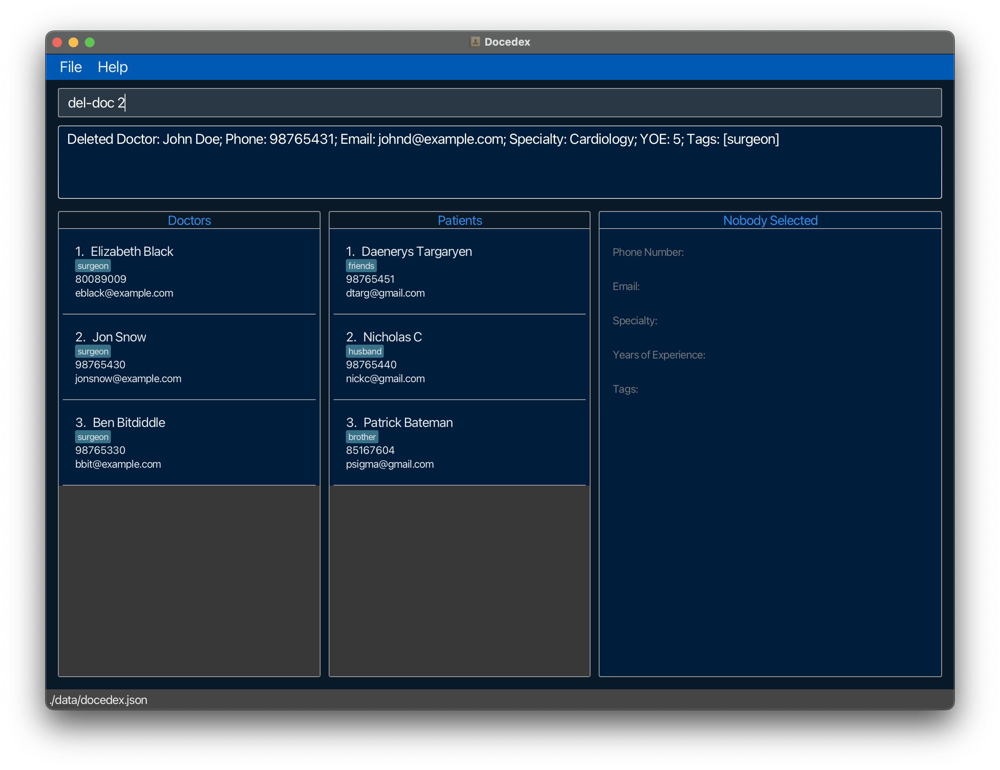

### Welcome to Docedex, your solution to doctor and patient management <!-- omit in toc -->

Docedex is a **desktop application** is built for **administrative assistants** to manage patients within clinics.

Docedex is **optimized for** use via a **Command Line Interface (CLI)** while still having the benefits of a **Graphical User Interface (GUI).** If you type fast, Docédex can get your patient management tasks done faster than traditional GUI apps.

Unlike your traditional contact management application, keep track of patients' **health information**, their **doctors** and much more.

With Docedex, taking control of patient management is just a few keystrokes away!


For **new users** visit our [quick start](#quick-start) to get you started .


## Table of Contents <!-- omit in toc -->
* Table of Contents
{:toc}
--------------------------------------------------------------------------------------------------------------------

## Quick start

1. Make sure that you have **Java 11 or above** installed on your computer.
   - [How do I check my version of Java?](#checking-java-version)

2. Download the latest jar file (`docedex.jar`) from our [Github Releases](https://github.com/AY2223S2-CS2103T-F12-1/tp/releases/).
   

3. Move the jar file to a Docedex's new folder
   - Create a new folder called Docedex where you would like to house the application (e.g., Desktop, Documents, etc.). 
   - Move the downloaded jar file to this folder as shown below.
     - For Mac Users:
     
     - For Windows Users:

4. Launch Docedex
   - For Mac Users:
     - Right-click `docedex.jar` > Open With > JavaLauncher.app
     
     - First time users may be prompted with a warning that the file was downloaded from the Internet. Simply click Open in the prompt to continue.
   - For Windows Users:
     - Double-click `docedex.jar` to launch the application.
   - If this still does not work follow the instructions listed [here.](#launching-docedex)
   
   - You should notice the GUI of the application pop up.<br>
   

6. Test out some commands in [Docedex Tutorial](#docedex-tutorial)

7. Refer to the [Features](#features) section for details of each command.

[Scroll back to Table of Contents](#table-of-contents)

--------------------------------------------------------------------------------------------------------------------

## Notes about the command format

| Notes                                                                                                       | Explanation                                                        | Examples                                                                                          |
|-------------------------------------------------------------------------------------------------------------|--------------------------------------------------------------------|---------------------------------------------------------------------------------------------------|
| Words in `UPPER_CASE`                                                                                       | These are parameters that are supplied by the user                 | `add-doc n/NAME...` can be used as `add-doc n/John Doe...`                                        |
| Items in square brackets                                                                                    | These are optional fields (can be left empty by user)              | `add-doc n/NAME ... [t/TAG]` can be used as `add-doc n/John Doe t/friend` or `add-doc n/John Doe` |
| Items with `…`​ after them                                                                                  | These are fields that can be used multiple times including 0 times | `add-doc ... [t/TAG]…​` can be used as `add-doc ... t/friend t/surgeon` or `add-doc ...`          |
| Parameters can be in any order.                                                                             | N/A                                                                | `add-doc n/NAME p/PHONE_NUMBER ...` is equivalent to `add-doc p/PHONE_NUMBER n/NAME`              |
| If a parameter is **expected only once** and entered multiple times, only the latest occurence is accepted. | N/A                                                                | `add-doc n/John Doe n/Shawn Koh ...` is equivalent to `add-doc n/Shawn Koh ...`                   |
| Extraneous parameters for commands that do not take in parameters will be ignored.                          | N/A                                                                | `help 123`, `list 123` is equivalent to `help` or `list`                                          |

[Scroll back to Table of Contents](#table-of-contents)

## Features
### Doctor Commands
#### Adding a doctor

- Command format: `add-doc n/NAME p/PHONE_NUMBER e/EMAIL s/SPECIALITY y/YEARS_OF_EXPERIENCE [t/TAGS]…`
- What it does: Adds a doctor to the address book.


- Examples:
    - `add-doc n/John Doe p/98765432 e/johnd@example.com s/Cardiology y/5 t/surgeon`
    - `add-doc n/Gabriel Tan p/98765432 e/gabt@example.com s/Neurosurgery y/5`

[Scroll back to Table of Contents](#table-of-contents)

#### Editing a doctor
- Command format: `edit-doc INDEX [n/NAME] [p/PHONE_NUMBER]`
- What it does: Edits the doctor at the specified `INDEX`. The index refers to the index number shown in the displayed doctor list. The index **must be a positive integer** 1, 2, 3, …​
- Note to users:
    - Users can edit specific doctors in the clinic by providing at least one of the optional fields. Existing values will be updated to the input values and all other values will remain the same.
    - At least one of the optional fields must be provided.
    - Existing values will be updated to the input values.
    - When editing tags, the existing tags of the person will be removed i.e adding of tags is not cumulative. You can remove all the person’s tags by typing `t/` without


- Examples:
    - `edit-doc 1 p/91234567` Edits the phone number of the 1st doctor to be `91234567`.
    - `edit-doc 2 n/Gabriel Tan p/12345678 t/` Edits the name and phone number of the 2nd doctor to be `Gabriel Tan` and `91234567` respectively. Adding t/ also clears all existing tags.

[Scroll back to Table of Contents](#table-of-contents)

#### Deleting a doctor
- Command format: `del-doc INDEX`
- What it does: Deletes the specified doctor from the address book.
- Note to user:
    - The index refers to the index number shown in the displayed doctor list.
    - The index **must be a positive integer** 1, 2, 3, …​



Examples:
* `list-doc` followed by `del-doc 2` deletes the 2nd doctor in the address book.
* `find-doc Gabriel` followed by `del-doc 1` deletes the 1st doctor in the results of the `find-doc` command.

[Scroll back to Table of Contents](#table-of-contents)

#### Finding a doctor
- Command format: `find-doc [n/NAME] [p/PHONE_NUMBER] [e/EMAIL] [s/SPECIALTY] [y/YEARS_OF_EXPERIENCE] [t/TAGS]…`
- What it does: Users can search up doctors with specific fields using this command.
- Note to user:
    - Matches are case-insensitive.
    - Fields are matched if they contain the search string (substring matched).
    - At least one of the fields must be provided.
    - More than one tag can be provided.
    - Blank fields will be ignored.


- Examples:
    - `find-doc n/Gabriel` matches any doctor with the name containing the string `Gabriel`.
    - `find-doc n/Gabriel t/friend t/expert` matches any doctor with the name containing the string `Gabriel` and has tags `friend` and `expert`.
    - `find-doc y/3` matches any doctor that has the number 3 in their years of experience, i.e. `3`,`30`,`23` will be matched but `5` and `10` will not be matched.

[Scroll back to Table of Contents](#table-of-contents)

#### Listing all doctors
- Command format: `list-doc`
- What it does: This command will list all doctors saved in Docedex together with their information.


[Scroll back to Table of Contents](#table-of-contents)

### Patient Commands

#### Adding a patient
- Command format: `add-ptn n/NAME p/PHONE e/EMAIL h/HEIGHT w/WEIGHT d/DIAGNOSIS st/STATUS [r/REMARK] [t/TAGS]…`
- What it does: Adds a patient to the address book.


- Examples:
  - `add-ptn n/Patrick Bateman p/85167604 e/psigma@gmail.com h/1.88 w/80.5 d/Rhinitis st/Outpatient r/Dust allergy t/brother`
  - `add-ptn n/Patrick Bateman p/85167604 e/psigma@gmail.com h/1.88 w/80.5 d/Rhinitis st/Outpatient`

[Scroll back to Table of Contents](#table-of-contents)

#### Assigning a patient to a doctor
- Command format: `assign-ptn ptn/PATIENT_INDEX doc/DOCTOR_INDEX`
- What it does: Assigns the patient at the specified `PATIENT_INDEX` to the doctor at the specified `DOCTOR_INDEX`. The indexes provided **must be a positive integer** 1, 2, 3, …
- Examples:
  - `assign-ptn ptn/1 doc/1` assigns the first patient to the first doctor.


[Scroll back to Table of Contents](#table-of-contents)

#### Unassigning a patient from a doctor
- Command format: `unassign-ptn ptn/PATIENT_INDEX doc/DOCTOR_INDEX`
- What it does: Unassigns the patient at the specified `PATIENT_INDEX` from the doctor at the specified `DOCTOR_INDEX`. The indexes provided **must be a positive integer** 1, 2, 3, …  
- Examples:
  - `unassign-ptn ptn/1 doc/1` unassigns the first patient from the first doctor.


[Scroll back to Table of Contents](#table-of-contents)

#### Editing a patient
- Command format: `edit-ptn INDEX [n/NAME] [p/PHONE_NUMBER]`
- What it does: Edits the patient at the specified `INDEX`. The index refers to the index number shown in the displayed patient list. The index **must be a positive integer** 1, 2, 3, …​
- Note to users:
    - Users can edit specific patients in the clinic by providing at least one of the optional fields. Existing values will be updated to the input values and all other values will remain the same.
    - At least one of the optional fields must be provided.
    - Existing values will be updated to the input values.
    - When editing tags, the existing tags of the person will be removed i.e adding of tags is not cumulative. You can remove all the person’s tags by typing `t/` without
      specifying any tags after it.


- Examples:
    - `edit-ptn 1 n/Daenerys Targaryen` Edits the name of the 1st patient to be `Daenerys Targaryen`.
    - `edit-ptn 2 n/Daenerys Targaryen st/Inpatient t/` Edits the name and status of the 2nd patient to be `Daenerys Targaryen` and `Inpatient` respectively. Adding t/ also clears all existing tags.

[Scroll back to Table of Contents](#table-of-contents)

#### Deleting a patient
- Command format: `del-ptn INDEX`
- What it does: Deletes the specified patient from the address book.
- Note to user:
  - The index refers to the index number shown in the displayed patient list. 
  - The index **must be a positive integer** 1, 2, 3, …​


Examples:
* `list-ptn` followed by `del-ptn 2` deletes the 2nd patient in the address book.
* `find-ptn Gabriel` followed by `del-ptn 1` deletes the 1st patient in the results of the `find-ptn` command.

[Scroll back to Table of Contents](#table-of-contents)

#### Finding a patient
- Command format: `find-ptn [n/NAME] [p/PHONE] [e/EMAIL] [h/HEIGHT] [w/WEIGHT] [d/DIAGNOSIS] [st/STATUS] [r/REMARK] [t/TAGS]…`
- What it does: Users can search up patients with specific fields using this command.
- Note to users:
    - Matches are case-insensitive.
    - Fields are matched if they contain the search string (substring matched).
    - At least one of the fields must be provided.
    - More than one tag can be provided.
    - Blank fields will be ignored.


- Examples:
  - `find-ptn n/Alice` matches any patient with the name containing the string `Alice`.
  - `find-ptn h/1` match any patient with the height containing the string `1`, i.e. `1.70` and `0.91` will be matched but `0.99` and `2.00` will not be matched.

[Scroll back to Table of Contents](#table-of-contents)

#### Listing all patients
- Command format: `list-ptn`
- What it does: This command will list all patients saved in Docedex together with their information.


[Scroll back to Table of Contents](#table-of-contents)

### Common Commands
#### Viewing help

- Command format: `help`
- What it does: Shows a message explaining how to access the help page.


[Scroll back to Table of Contents](#table-of-contents)

#### Exiting the program
- Command format: `exit`
- What it does: This command is equivalent to closing the application (exits the program).

[Scroll back to Table of Contents](#table-of-contents)

#### Clearing all data
- Command format: `clear`
- What it does: This command will clear all data in Docedex.
- **Warning** :
  - This command will clear all data in Docedex. This includes all doctors and patients.
  - This command **cannot be undone**.

[Scroll back to Table of Contents](#table-of-contents)

### Saving the data

Docedex data is saved automatically after any command that changes data. There is no need to save manually.

[Scroll back to Table of Contents](#table-of-contents)

### Editing the data file

Docedex data is saved as a JSON file at this specified path: `[JAR file location]/data/docedex.json`.

DO NOT modify data directly, as it might result in the malfunction of the application. In the worst case scenario, all your data may be reset. Only modify data directly if you know what you are doing and accept the risks of such actions.

[Scroll back to Table of Contents](#table-of-contents)

--------------------------------------------------------------------------------------------------------------------

## FAQ

### Launching Docedex
**Q**: How can I launch docedex if the clicking on the JAR file does not work?<br>
**A**: There are two possible methods to launch Docedex.

Method 1: For users familiar with the command prompt
1. Open the command prompt
2. Navigate to the directory where the JAR file is located using `cd [JAR file location]`
3. Type `java -jar docedex.jar` and press enter
4. Docedex should launch

Method 2: For users that wish to create a script to launch Docedex (**Recommended**)
1. Create a new text file
2. Copy and paste the following into the text file:
```
java -jar [JAR file location]/docedex.jar
```
3. Save the text file as `docedex.bat` (Windows) or `docedex.sh` (MacOS/Linux)
4. Change the admin settings of the script to allow it to run as a program:
   1. Windows: Right-click on the script and select `Properties`. Under `General`, check the box that says `Allow this file to run as a program`.
   2. MacOS/Linux: Open the terminal and navigate to the directory where the script is located. Type `chmod +x [script name]` and press enter. (`chmod +x` changes permissions of the script to allow it to be executed.)
5. Double-click on the script to launch Docedex
6. Docedex should launch

If you have any further issues, please raise an issue on our [GitHub page](https://github.com/AY2223S2-CS2103T-F12-1/tp/issues). We will attend to you as soon as we can.

### Checking Java version
**Q**: How can I check my Java version?<br>
**A**: Open a command prompt and type `java -version`. If you do not have Java installed, you can download it [here](https://www.oracle.com/java/technologies/javase-jdk11-downloads.html).

For Mac Users you may wish to follow the instructions listed [here](https://nus-cs2103-ay2223s2.github.io/website/admin/programmingLanguages.html)

### Loading Data from another computer

**Q**: How can I load data from another computer into Docedex installed on another computer?<br>
**A**: Delete the `docedex.json` file (stored at `[JAR file location]/data/docedex.json`) from the computer that you wish to use Docedex on. Then, copy over the `docedex.json` file from the computer which you no longer wish to use Docedex on. After which, boot up Docedex to check whether your doctor information is properly loaded into the new computer.

[Scroll back to Table of Contents](#table-of-contents)

--------------------------------------------------------------------------------------------------------------------

## Command summary

| Action               | Format, Examples                                                                                                                                                                                                                               |
|----------------------|------------------------------------------------------------------------------------------------------------------------------------------------------------------------------------------------------------------------------------------------|
| **Add Doctor**       | `add-doc n/NAME p/PHONE_NUMBER e/EMAIL s/SPECIALTY y/YEARS_OF_EXPERIENCE [t/TAGS]…` <br> E.g. `add-doc n/John Doe p/98765432 e/johnd@example.com s/Cardiology y/5 t/surgeon`                                                                   |
| **Add Patient**      | `add-ptn n/NAME p/PHONE e/EMAIL h/HEIGHT w/WEIGHT d/DIAGNOSIS st/STATUS r/REMARK [t/TAGS]…` <br> E.g. `add-ptn n/John Doe p/98765432 e/jdoe@gmail.com h/1.85 w/70.5 d/Fever st/Outpatient r/Patient was given paracetamol for fever t/friends` |
| **Assign Patient**   | `assign-ptn ptn/PATIENT_INDEX doc/DOCTOR_INDEX`<br> E.g. `assign-ptn ptn/1 doc/1`                                                                                                                                                              |
| **Unassign Patient** | `unassign-ptn ptn/PATIENT_INDEX doc/DOCTOR_INDEX`<br> E.g. `unassign-ptn ptn/1 doc/1`                                                                                                                                                          |
| **Delete Doctor**    | `del-doc INDEX`<br> E.g. `del-doc 3`                                                                                                                                                                                                           |
| **Delete Patient**   | `del-ptn INDEX`<br> E.g. `del-ptn 3`                                                                                                                                                                                                           |
| **Edit Doctor**      | `edit-doc INDEX [n/NAME] [p/PHONE_NUMBER]`<br> E.g. `edit-doc 3 n/Gabriel Tan p/12345678`                                                                                                                                                      |
| **Edit Patient**     | `edit-ptn INDEX [n/NAME] [p/PHONE_NUMBER]`<br> E.g. `edit-ptn 3 n/Gabriel Tan p/12345678`                                                                                                                                                      |
| **Find Doctor**      | `find-doc [n/NAME] [p/PHONE_NUMBER] [e/EMAIL] [s/SPECIALTY] [y/YEARS_OF_EXPERIENCE] [t/TAGS]…`<br> E.g. `find-doc n/Gabriel`                                                                                                                   |
| **Find Patient**     | `find-ptn [n/NAME] [p/PHONE] [e/EMAIL] [h/HEIGHT] [w/WEIGHT] [d/DIAGNOSIS] [st/STATUS] [r/REMARK] [t/TAGS]…`<br> E.g. `find-ptn n/Gabriel`                                                                                                     |
| **List Doctors**     | `list-doc`                                                                                                                                                                                                                                     |
| **List Patients**    | `list-ptn`                                                                                                                                                                                                                                     |
| **Help**             | `help`                                                                                                                                                                                                                                         |
| **Clear**            | `clear`                                                                                                                                                                                                                                        |
| **Exit**             | `exit`                                                                                                                                                                                                                                         |

[Scroll back to Table of Contents](#table-of-contents)