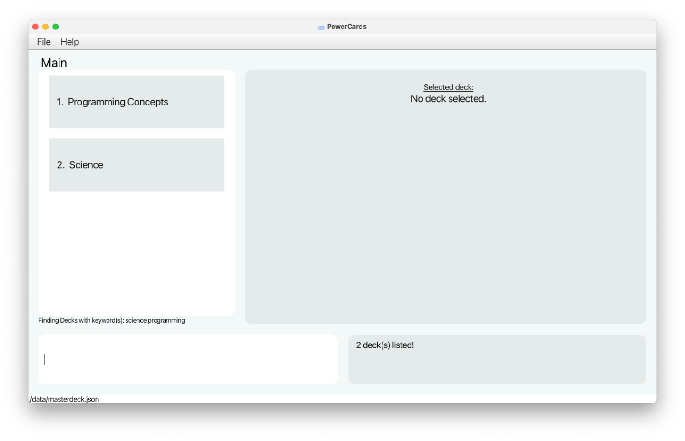
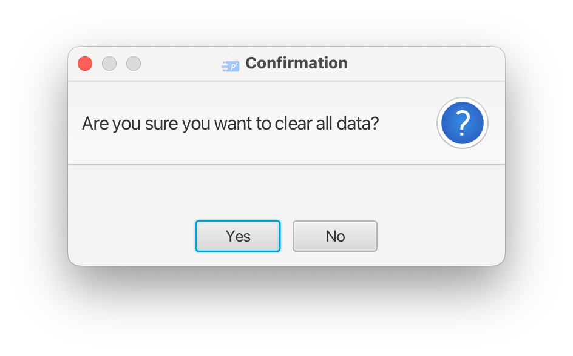
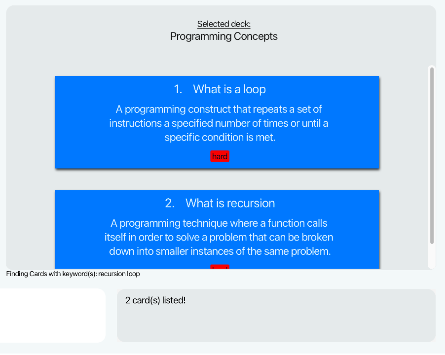
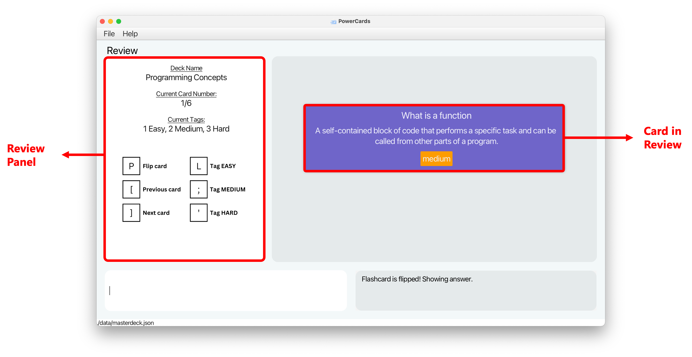

# 1. Introduction

Welcome to PowerCards, a **lightweight flashcard application** that helps you streamline your learning process, enabling faster mastery of course materials through the use of flashcards _(which we will simply refer as **cards** from now on)_.
As a university student, you can capitalise on our **powerful card management system** and **minimalist interface** to create multiple decks of cards quickly to manage your course content and spend more time on learning instead.

This user guide will help you use PowerCards with ease and integrate it into your learning workflow in no time. It explains the key features of PowerCards and provides guidance on how to use them effectively to meet your specific learning needs.

* Table of Contents
{:toc}

--------------------------------------------------------------------------------------------------------------------

## 1.1. How to use the User Guide

* For a quick and easy way to **get started** with PowerCards, you can visit the [Quick Start](#2-quick-start) section.
* To **understand the terms** we use in PowerCards, you can visit the [Key Terms](#12-key-terms) section.
* To learn about the **features** that PowerCards provides and how to use them, you can visit the [Features](#3-features) section.
* Having **issues**? Check out the [FAQ](#4-faq) section and see if you can find your solutions there!

**:bulb: Tip:** 
* There's a lot of information in this guide, so it's a good idea to skim through the contents first. This will give you a better understanding on how PowerCards works. Then, you can dive into the sections that interest you the most. We hope this approach will make it easier for you to digest the content.

## 1.2. Key Terms

**Deck** 

A deck refers to a collection of flashcards that are organized together based on a specific topic or subject.
For example, you might create a deck of flashcards to study for a math test, with each card containing a different math problem and solution.

**Card** 

A card refers to a flashcard within a deck. A card contains a question or prompt, and the corresponding answer or solution.
During a review session, the card will only show the question, encouraging you to actively recall the answer.
Once you attempt the question, you can command the card to reveal the answer and test your knowledge.

**Tag** 

A tag refers to the level of difficulty (easy/medium/hard) you can assign to each card. It helps you prioritize your study time and focus on the flashcards that are more challenging or require more review.
A card can only have at most one tag at any time.

## 1.3. User Interface Components 

This section highlights the key components of PowerCards’ user interface. Refer to the description below for more information.

| Component          | Description                                                                                                  |
|--------------------|--------------------------------------------------------------------------------------------------------------|
| **Left Panel**     | This shows either a **list of decks** or the **current review statistics** depending on the mode you are in. |
| **Right Panel**    | This shows either a **list of cards** or the **current card in review** depending on the mode you are in.    |
| **Command Box**    | This is where you enter your **commands**.                                                                   |
| **Result Display** | This is where the **results** of your commands will be shown.                                                |

--------------------------------------------------------------------------------------------------------------------

# 2. Quick Start

1. Ensure you have Java `11` or above installed in your Computer. If you don't have it, you can download and install from this [link](https://www.oracle.com/sg/java/technologies/javase/jdk11-archive-downloads.html). Remember to download the correct version for your Operating System! (e.g. Window or Mac) 

2. Download the latest `powercards.jar` from [here](https://github.com/AY2223S2-CS2103T-W11-3/tp/releases).

3. Copy the file to the folder you want to use as the _home folder_ for your PCs.

4. Open a command terminal, enter the folder you put the jar file in using the `cd` command, and use the `java -jar powercards.jar` command to run the application.  

   A GUI similar to the below should appear in a few seconds. Note how the app contains some sample data. 
   

5. Type any command in the command box and press Enter to execute it. e.g. typing **`help`** and pressing Enter will open the help window. 

6. Refer to the [Features](#3-features) below for details of each command.

--------------------------------------------------------------------------------------------------------------------

# 3. Features

## 3.1. Command Components

This section explains some common components you may find in a command.

| Component                 | Example              | Usage                                                                                                                                                                                                                                                                                                                    |
|---------------------------|----------------------|--------------------------------------------------------------------------------------------------------------------------------------------------------------------------------------------------------------------------------------------------------------------------------------------------------------------------|
| **Parameter**             | `QUESTION`, `ANSWER` | Parameters are placeholders where you have to insert your input.   Suppose `add q\QUESTION a\ANSWER` is a valid command to add a card. You can simply replace `QUESTION` and `ANSWER` with the question and answer of your choice.                                                                               |  
| **Prefix**                | `q\ `, `a\ `, `t\ `  | Prefixes are used to identify the parameters of a command.    For example, prefix `q\ ` identifies the parameter `QUESTION` in the command `add q\QUESTION`.                                                                                                                                                       |
| **Optional Component**    | `[t\TAG]`            | Optional components can be **omitted** in certain commands.   For example, `add q\QUESTION a\QUESTION [t\TAG]` is a valid command to add a card.  The first two components `q\QUESTION`, `a\ANSWER` are compulsory. The last component `t\TAG` is optional.                                                |
| **Multi-value Parameter** | `KEYWORDS...`        | These are parameters that can appear **multiple times**.    For example, the command `findCards KEYWORD...` filters all the cards based on the keywords specified.  This means that the parameter `KEYWORD` can: - Appear one time: `findCards cell` - Appear multiple times: `findCards cell biology` | 
| **Index**                 | `INDEX`              | Index refers to the index of the card/deck you want to target from the list. The index must be a positive integer (1, 2, 3...).    For example, `deleteDeck 1` deletes the first deck in the deck list.                                                                                                          |
| **Flag**                  | `-e`, `-m`, `-h`     | Flags are used to toggle a particular setting or behavior.   For example, `review 1 -e` lets you review questions in the first deck that are tagged as **easy** only.                                                                                                                                            |

**:information_source: Notes about the command format:** 

- If a parameter is expected only once in the command, but you specified it multiple times, only the last occurrence of the parameter will be considered.
  e.g. if you specify `q\What is photosynthesis q\What is a cell`, only `q\What is a cell` will be considered.
- Extraneous parameters succeeding commands that do not take in parameters (such as `help`, `list`, `exit` and `clear`) will be ignored. e.g. if the command specified is `help 123`, it will be interpreted as `help`.

## 3.2. Main Mode

Welcome to the Main Mode of the PowerCards application! This is the default mode you will see when you open the app. 

In the Main Mode, you can quickly and easily create new decks, add new cards to your decks, delete and modify existing cards or decks as needed, and more!

| Component         | Description                                                                                                                                |
|-------------------|--------------------------------------------------------------------------------------------------------------------------------------------|
| **Deck**          | A deck contains a list of cards. The existing decks are displayed in the **left** panel.                                                   |
| **Selected Deck** | The deck currently selected. The cards in this deck are displayed in the **right** panel.                                                  |
| **Card**          | A card contains a question, an answer and an optional difficulty tag.                                                                      |
| **Question**      | The question that you assign to the card.                                                                                                  |
| **Answer**        | The corresponding answer to the question.                                                                                                  |
| **Tag**           | The tag indicating the difficulty level of the card, based on your evaluation. Each card can only be tagged with **at most** 1 difficulty. |

## 3.3. Main Mode - Before Selecting a Deck

### 3.3.1. Adding a Deck : `addDeck`

Before you can add any cards, you must first create a deck. Creating a deck is done through the simple command below. 

Format: `addDeck DECK_NAME`
- `DECK_NAME` is the name of the deck you want to create. 
  - Deck name is case-sensitive and cannot be duplicated, e.g., if you already have a deck named `Science`, you cannot create another deck named `Science`. However, you can create a deck named `SCIENCE` since `SCIENCE` may be an acronym.
  - You do not need any prefix before deck name.

Example:
* `addDeck Science` will create a deck titled Science.

### 3.3.2. Editing a Deck : `editDeck`

You just created a deck, but you realised you made a typo! Fret not, you can easily edit the name of the deck with this command.  

Editing a deck name will not affect the cards stored inside it.

Format: `editDeck INDEX DECK_NAME`
- `INDEX` is the index of the deck you want to edit.
- `DECK_NAME` is the new name you want to assign to the specified deck.
  - The new deck name must not match any existing deck names (Deck names are case-sensitive).

Example: 
- `editDeck 1 Chemistry` will edit the name of the first deck in the deck list to "Chemistry".

### 3.3.3. Deleting a Deck : `deleteDeck`

Once you have no use for a deck, you can delete the deck and all the cards within it with this command.  

Be careful, a deck once deleted cannot be retrieved! 

Format: `deleteDeck INDEX`
- `INDEX` is the index of the deck in the deck list.

Example: `deleteDeck 1` deletes the deck at index 1 and all the cards in that deck. 

### 3.3.4. Finding Decks by Keywords: `findDecks`

If you want to find a specific deck among the many decks you have created, use this command to filter the decks based on their deck names!

Format: `findDecks KEYWORD...`
- You can include multiple KEYWORDS - as long as a deck's name contains at least one keyword, the deck will be found.
- At least one KEYWORD must be given.
- This command does not support partial words, e.g., `findDecks program` will not return the same list of decks as `findDecks programming`, despite `program` being a partial word of `programming`.
- Keywords are **case-insensitive**. `findDecks programming` and `findDecks PROGRAMMING` will return the same filtered decks.
- Deck names matching at least one keyword will be returned (i.e. `OR` search).

Example:
- `findDecks science programming` filters decks whose names match keywords `science` **or** `programming`. Below is the application display right after this command is executed.

💡 **Tip:** 
- Notice there is a small text box `Finding Decks with keyword(s): science programming` below the filtered list of decks. This text box is displayed as long as the decks are filtered. It is to help you remember what you have previously searched for!
- Notice that the result display will show how many decks have been listed.

### 3.3.5. Showing all Decks : `showDecks`

After you filtered the decks using `findDecks`, you can see all the existing decks again using this command.

Format: `showDecks`

### 3.3.6. Selecting a Deck : `selectDeck`

Once a deck has been created, you can access the list of cards inside it with this command. 
Refer to the [Main Mode - After Selecting a Deck](#34-main-mode---after-selecting-a-deck) section to find out what commands you can run with a deck selected!

💡 **Tip:**  

- A deck can be selected and accessed anytime as long as you are in the Main Mode.
- This means you can switch to different deck while already selecting another deck!

Format: `selectDeck INDEX`
- `INDEX` is the index of the deck in the deck list.

Examples:
* `selectDeck 2` will select the deck at index 2. 
  * The cards in this deck (if exist) will be displayed on the right panel. 

### 3.3.7. Clearing the data : `clear`

Perhaps you want to start over and create new sets of decks and cards. 
This command clears all the existing decks and their associated cards from the application database. 

:exclamation: **Caution:** This command is irreversible! You cannot retrieve your data after executing this command.

Format: `clear`
- Upon executing the command, a pop-up alert will appear and request you to confirm your decision.
  

- Selecting `Yes` will clear all data.  

## 3.4. Main Mode - After Selecting a Deck

With a deck selected, you can see all the cards in the deck on the right panel! 
Now you can interact with the cards in the selected deck.

Note that you will not be able to make any deck-related changes (e.g. `addDeck`, `deleteDeck`) until you unselect the current deck.

### 3.4.1. Adding a Card: `addCard`

This command allows you to add a card to the **selected** deck. 

A card must contain a question and an answer. It may contain at most **one** difficulty tag. 

Format: `addCard q\QUESTION a\ANSWER [t\TAG]`
- `QUESTION` field of the card is **case-sensitive** and cannot be duplicated in the same deck.
  - For example, if you already have a card with question `What is a loop` in the deck, you cannot create another card in the same deck with question `What is a loop`. 
  - However, you can create another card with question `What is a LOOP` since `LOOP` may be an acronym.
- The same `QUESTION` may exist in multiple decks, i.e., a card can belong to multiple decks.  

💡 **Tip:**  

- A tag can only be of value Easy, Medium, or Hard.
- Tags are **case-insensitive** (`easy` and `EASY` are treated the same).

Examples:
* `addCard q\What is chemical symbol for Oxygen? a\O` adds an untagged card with the given question and answer to the deck.
* `addCard q\What is gravity? a\A force of attraction between objects due to their mass t\Easy` adds a card tagged as Easy with the given question and answer to the deck.

### 3.4.2. Deleting a Card : `deleteCard`

You can easily delete an existing card from the current selected deck with this command. 

:exclamation: **Caution:**
Note that this is irreversible!

Format: `deleteCard INDEX`
* Deletes the card at the specified `INDEX`. The card's index can be found in the displayed card list.

Example:
- `deleteCard 2` will delete the 2nd card in the deck.

### 3.4.3. Editing a Card : `editCard`

You realised you made some mistakes after creating a card. 
Worry not, as you can easily edit any existing card with this command!

Format: `editCard INDEX [q\QUESTION] [a\ANSWER] [t\TAG]`

* Edits the card at the specified `INDEX`. The card's index can be found in the displayed card list.
* At least **one** of the optional components must be provided.
* Existing values of the card will be replaced by the input values.
* If the same prefix appears multiple times, only the **last** occurrence of the prefix will be considered. 

Examples:
* `editCard 1 q\What is chemical symbol for Carbon? a\C` edits the question and answer of the 1st card to be `What is chemical symbol for Carbon?` and `C` respectively.
* `edit 2 q\What is a recursion?` will only edit the question of the 2nd card to `What is a recursion?`. The other fields of the card (answer, tag) remain unchanged.
* `edit 3 q\What is a recursion? q\What is a loop?` edits the question of the 3rd card to be `What is a loop?`. 

### 3.4.4. Finding Cards by Keywords in Question : `findCards`

This command allows you to find specific flashcards you want to interact with based on the keyword(s) you enter.

It shows all the cards in the selected deck whose **questions** contain **any** of the given keyword(s).

You can interact with the filtered cards using their new indices, through commands such as `editCard` and `deleteCard`.

Format: `findCards KEYWORD...`
- You can include multiple KEYWORDS - as long as a card's question contains at least one keyword, the card will be found.
- At least one KEYWORD must be given.
- Keywords are case-insensitive. `findCards what` and `findCards WHAT` will return the same filtered cards.
- Question field of cards matching at least one keyword will be returned (i.e. `OR` search).
- This command does not support partial words, e.g., `findCards partia` and `findCards partial` will **not** return the same result despite "partia" being a partial word of "partial".

:exclamation: **Caution:**
Since the command does not support partial words, take extra caution when searching for words ending with punctuation! For example `findCards loop` will **not** return a Card with question `What is a loop?`. For this example, you should search `findCards loop?` instead.  

Example:
- `findCards recursion loop` shows all the cards whose questions match the keywords `recursion` **or** `loop`.

💡 **Tip:** 
- There is a small text box `Finding Cards with keyword(s): recusion loop` below the filtered list of cards. It remains on display as long as the cards are filtered. This is to help you remember what keywords you are searching for!  
- The result display will show how many cards matching the keywords have been found.

### 3.4.5. Showing all Cards : `showCards`

After you filtered the cards using `findCards`, you can see all the cards in the selected deck again using this command.

Format: `showCards`

### 3.4.6. Unselecting a Deck : `unselectDeck`

If you want to make deck-related changes, you must first unselect the current deck you are in.
Refer to the [Main Mode - Before Selecting a Deck](#33-main-mode---before-selecting-a-deck) section to find out what commands you can run without a deck selected!

This command allows you to unselect the currently selected deck.

Format: `unselectDeck`
- Upon unselecting a deck, you can no longer see the cards inside that deck.

## 3.5. Before entering Review Mode

### 3.5.1. Setting the Limit of Cards per Review: `setLimit`

Suppose you have a really long deck of cards, but you only want to test yourself on 20 cards this session. 
Use this function to set an upper limit on the number of cards per review.
While a limit is set, the review deck will be truncated to the card limit. 

You can set the limit back to 'none' to view all cards in the deck for future reviews.

Format: `setLimit LIMIT_NUM` or `setLimit none`
- LIMIT_NUM must be an integer between 1 and 2147483647 inclusive. 

Examples:
* `setLimit 30`
* `setLimit none`

--------------------------------------------------------------------------------------------------------------------

## 3.6. Review Mode

Once ready, you can enter the Review Mode to test yourself on the cards of a deck. You can also specify the difficulties of the cards of the deck you want to test - e.g. you just want test medium and hard cards only.

In the review mode, you will see:
- On the left panel - a review panel with the updated statistics of the current review (current deck, current card number, number of cards tagged each difficulty) and a navigation guide of the keys.
- On the right panel - the card that is currently under review, which you can flip to reveal the answer and then tag with a given difficulty.

To review a card, you can attempt the question on the card (in your mind or on a paper if you prefer!) before flipping it. 

Flipping a card reveals the answer - based on how close your guess was to the answer or how confident you were when attempting, you can tag the card with a difficulty of easy, medium or hard.

Your goal would be to eventually have all cards in a deck be tagged as easy!

### 3.6.1. Starting a Review: `review`
From the Main Mode, run this command to enter the Review Mode!

Format: `review INDEX [-e] [-m] [-h]`

* Reviews the cards from the deck with the specified INDEX. The deck's index can be found in the displayed deck list.
  - `-e` include this flag to test cards tagged as "easy"
  - `-m` include this flag to test cards tagged as "medium"
  - `-h` include this flag to test cards tagged as "hard"
  - Omit any flags to test all cards in the deck

Examples:
* `review 5 -e -h` lets you review all the cards tagged as Easy or Hard in the 5th deck.
* `review 2` lets you review all the cards in the 2nd deck.

### 3.6.2. Ending the Review: `endReview`

Ends the review and returns to the main mode. You can use this when you reach the end of the review deck or at any point during the review.

Format: `endReview`

### 3.6.3. Review Keystrokes

The diagram above shows the keystrokes you will use to interact with the cards in the Review mode. 
Notice that the keys are all close to the enter key so that you can breeze through decks of cards with ease!
- The top row of keys are commands to flip cards, or move to the previous/next cards. 
- The bottom row of keys are commands to tag the difficulty of the current card.
- You must press the enter key after typing in the command to execute it, e.g., pressing the key `p` alone will not flip the card. 

### 3.6.4. Flipping the Card: `p`

Flips the card to reveal the answer. 

Format: `p`
- `p` is case-insensitive (`P` is also a valid command).
  

### 3.6.5. Next Card: `]`

Displays the next card. After tagging the current card, you use this command to move on to the next card.

Format: `]`

### 3.6.6. Previous Card: `[`

Displays the previous card. Useful if you want to amend the tag of the previous card!

Format: `[`

### 3.6.7. Tagging the Card as Easy: `l`

Tags the current card as easy. This replaces any previous tags.

Format: `l`
- `l` is case-insensitive (`L` is also a valid command).

### 3.6.8. Tagging the Card as Medium: `;`

Tags the current card as medium. This replaces any previous tags.

Format: `;`

### 3.6.9. Tagging the Card as Hard: `'`

Tags the current card as hard. This replaces any previous tags.

Format: `'`

--------------------------------------------------------------------------------------------------------------------

## 3.7. Other Features

### 3.7.1. Viewing Help : `help`

If you are unsure about how to use PowerCard, you can always execute this command.
This command creates a pop-up with a link to this User Guide, where you can access clear and concise instructions for each command and features of the app.

[//]: # (![help message]&#40;images/helpMessage.png&#41;)

Format: `help`

### 3.7.2. Exiting the Program : `exit`

At any point, run this command to exit the program.

Format: `exit`

### 3.7.3. Saving the Data

PCs data are saved in the hard disk automatically after any command that changes the data. There is no need to save manually.

### 3.7.4. Editing the Data File

PCs data are saved as a JSON file `[JAR file location]/data/masterdeck.json`. Advanced users are welcome to update data directly by editing that data file.

:exclamation: **Caution:** 

- If your changes to the data file make its format invalid, PowerCards will start with an empty data file at the next run. 
- Do **not** type in any command as this will overwrite and discard your previous data! Simply close the application manually and edit the data file again until it is in valid format. 

--------------------------------------------------------------------------------------------------------------------

# 4. FAQ

**Q**: How do I transfer my data to another Computer? 
**A**: Install the app in the other computer and overwrite the empty data file it creates with the file that contains the data in your previous PC's home folder.

**Q**: Will my data be automatically saved? 
**A**: **Yes**, PowerCards automatically saves your data after every command entered.

**Q**: Where is my data saved? 
**A**: Go to where you have downloaded your `powercards.jar` file, there a `/data` folder will be created and the data will be saved under `masterdeck.json`.

**Q**: Can I rename my saved data file? 
**A**: **No**, PowerCards currently only supports the use of `masterdeck.json` as the name of the saved data file.

**Q**: How can I verify if my answer is correct? 
**A**: PowerCards operates on a self-testing basis. You can check your answer by writing it down before flipping the card to verify if you got it right or wrong.

**Q**: Can I have two cards with the same question? 
**A**: **No**, if the two cards are in the same deck. `QUESTION` field of Card is case-sensitive and cannot be duplicated within the same deck. **However**, two cards with the same question can exist **if they belong to different decks**.

**Q**: Can I have two decks with the same name?  
**A**: **No**. The name of the deck is case-sensitive and cannot be duplicated, e.g., if you already have a deck named `Science`, you cannot create another deck named `Science`. However, you can create a deck named `SCIENCE` since `SCIENCE` may be an acronym.

**Q**: What if I would like to include the prefix within my card (question or answer) or deck name? (For example `addCard q\What is q\a a\It means q slash a` should add a card with question `What is q\a` instead of `a`) 
**A**: At the moment we do not support that. However, we plan to support this feature in the next iteration. We also like to point out that this is the reason why we used backslash `&#92;` rather than forward slash `/` for this current iteration as backslash is less commonly use than forward slash.  
--------------------------------------------------------------------------------------------------------------------

# 5. Command Summary

## 5.1. Main Mode - before selecting a Deck

| Action         | Format, Examples                                                     |
|----------------|----------------------------------------------------------------------|
| Select Deck    | `selectDeck INDEX`   e.g., `selectDeck 2`                       |
| Add Deck       | `addDeck DECK_NAME`   e.g., `addDeck Science`                   |
| Edit Deck      | `editDeck INDEX DECK_NAME`   e.g., `editDeck 3 Physics`         |
| Delete Deck    | `deleteDeck INDEX`                                                   |
| Find Decks     | `findDecks KEYWORDS...`   e.g., `findDecks programming history` |
| Show All Decks | `showDecks`                                                          |
| Start Review   | `review INDEX`                                                       |
| Set Limit      | `setLimit LIMIT_NUM`   e.g., `setLimit 30` or `setLimit none`   |
| Clear          | `clear`                                                              |
| Help           | `help`                                                               |
| Exit           | `exit`                                                               |

## 5.2. Main Mode - after selecting a Deck

| Action         | Format, Examples                                                                                                                                 |
|----------------|--------------------------------------------------------------------------------------------------------------------------------------------------|
| Select Deck    | `selectDeck INDEX`   e.g., `selectDeck 2`                                                                                                   |
| Unselect Deck  | `unselectDeck`                                                                                                                                   |
| Add Card       | `addCard q\QUESTION a\ANSWER [t\TAG]`   e.g., `addCard q\What is gravity? a\A force of attraction between objects due to their mass t\Easy` |
| Edit Card      | `editCard INDEX [q\QUESTION] [a\ANSWER] [t\TAG]`   e.g., `editCard 1 q\What is chemical symbol for Carbon? a\C t\Hard`                      |
| Delete Card    | `deleteCard INDEX`                                                                                                                               |
| Find Cards     | `findCards KEYWORDS...`                                                                                                                          |
| Show All Cards | `showCards`                                                                                                                                      |
| Start Review   | `review INDEX`                                                                                                                                   |
| Set Limit      | `setLimit LIMIT_NUM`   e.g., `setLimit 30`                                                                                                  |
| Clear          | `clear`                                                                                                                                          |
| Help           | `help`                                                                                                                                           |
| Exit           | `exit`                                                                                                                                           |

## 5.3. Review mode

| Action        | Format, Examples |
|---------------|------------------|
| End Review    | `endReview`      |
| Flip          | `p` or `P`       |
| Previous Card | `[`              |
| Next Card     | `]`              |
| Tag Easy      | `l` or `L`       |
| Tag Medium    | `;`              |
| Tag Hard      | `'`              |
| Help          | `help`           |
| Exit          | `exit`           |

