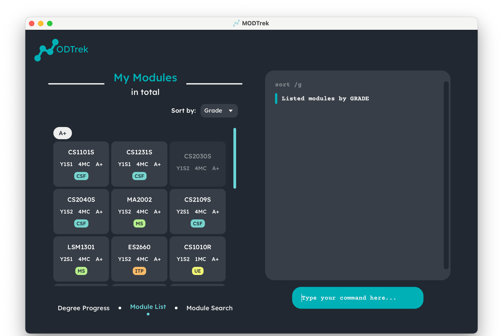

 
 

ModTrek is a desktop application for managing a typical NUS Computer Science student’s modules and degree progression, optimised for use via a Command Line Interface (CLI). The app provides a convenient platform for students to easily access and update their modules within presses of a keyboard.  

--------------------------------------------------------------------------------------------------------------------

## Table of Contents

1. [Quick Start](#quick-start)
2. [Features](#features) 
   2.1 [Add a module:](#add-module) `add` 
   2.2 [Remove a/all module:](#delete-module) `delete` 
   2.3 [Change module details:](#edit-module) `edit` 
   2.4 [Tag a module:](#tag-module) `tag` 
   2.5 [Find modules by keyword:](#find-module) `find` 
   2.6 [Sort all modules:](#sort-module) `sort` 
   2.7 [Toggle between module lists and progress:](#change-view) `view` 
   2.8 [Exiting the program:](#exit-app) `exit` 
   2.9 [Saving the data](#save-data) 
   2.10 [Editing the data file](#edit-data)
3. [Frequently Asked Questions (FAQ)](#faq)
4. [Command Summary](#command-summary)

--------------------------------------------------------------------------------------------------------------------

## 1. Quick Start 

1. Ensure you have Java 11 or above installed in your Computer.
1. Download `modtrek.jar` here. (To be inserted)
1. Copy the file to the folder you want to use as the _home folder_ for ModTrek
1. Open a command terminal, `cd` to the folder you put your jar file in, and use `java -jar modtrek.jar` to run the application
1. A GUI similar to the below should appear in a few seconds.
1. Type commands within the command line interface (CLI) and press enter to execute it. For a list of executable commands, refer to the [Features / Commands Section](#features).

--------------------------------------------------------------------------------------------------------------------

## 2. Features 

**Notes about command format:** 
- Words enclosed by `<>` are the parameters to be supplied by the user. 
   - E.g. in `add /m <code> /c <credits> /y <year-semester> /g <grade> /t <tag>...`, `<code>`, `<credits>`, `<year-semester>`, `<grade>`, `<tag>` are parameters which can be used as `add /m CS2103T /c 4 /y Y2S2 /g A+ /t University Level Requirements /t Computer Science Foundation`
- Extraneous parameters for commands that do not take in parameters (such as `list`, `exit` and `delete all`) will be ignored.
- Parameters encapsulated in between brackets ('()') are optional.

### MODTrek supports the following features:

#### 2.1 Add a Module : `add` 

Adds a module to the module list. Modules must be distinct.

**Command syntax:** `add /m <code> /c <credits> /y <year-semester> (/g <grade>) (/t <tag>...)`

Additional details:
* `<code>` refers to the module code
* `<credits>` refers to the module's modular credits
* `<year-semester>` refers to the year and semester the module is taken. E.g y1s2, y3st1
* `<grade>` refers to the grade obtained for the module. Range from A+ to U.
* `<tag>` refers to the requirement the modules fulfils.  This includes:
   * `ULR` University Level Requirements
   * `CSF` Computer Science Foundations
   * `CSBD` Computer Science Breadth & Depth
   * `UE` Unrestricted Electives
   * `ITP` IT Professionalism
   * `MS` Math & Science
   
:exclamation: For `...`, specify one or more tags to be added, separated by space (' ').

**Example:** `add /m CS2103T /c 4 /y y2s2 /g A /t ULR`

#### 2.2 Delete a Module : `delete` 

Deletes all/the specified module(s) from the module list.

**Command syntax:**   _To delete specific modules:_ `delete /m <code1> (/m <code2>) ...`    :exclamation: For `...`, specify one or more module codes of modules to be deleted, separated by space (' ').   _To delete all modules:_ `delete all`

**Example:** `delete /m CS2100 /m CS2040S`

#### 2.3 Edit a Module : `edit` 

Edits an existing module in the module list.

**Command syntax:** `edit <code> ...`

_Specify one or more parameters in_ `...` :
* `/m <new code>`
* `/c <credits>`
* `/y <year-semester>`
* `/g <grade>`
* `/t <tag>`

**Example:** `edit ES2660 /m CS2101 /g B+`

:exclamation: Past data will be overridden and not be saved

#### 2.4 Tag a Module : `tag` 

Tags a module to include or remove one or more degree requirements (e.g. University Level Requirements, Computer Science Foundation etc) that the module fulfils. 
Refer to [2.1 Add a module](#add-module) for the available tags.

**Command syntax:**
* _To include tags:_ `tag /m <code> include <tag1> (<tag2>) ...`
* _To remove tags:_ `tag /m <code> remove <tag1> (<tag2>) ...`

:exclamation: For `...`, specify one or more tags to be included or removed, separated by space (' ').

**Example:**
* `tag CS2030S include CSF`
* `tag ES2660 remove ULR ITP`

#### 2.5 Find modules by keyword : `find` 

Displays specific module(s) satisfying the search query (by code, credits, year-semester, and/or grade) and their details previously logged by the user.

**Command syntax:** `find (/m <code>) (/c <credits>) (/y <year-semester>) (/g <grade>)`

**Example:**
* `find /c 4 /g A+`
* `find /y y2s2`
* `find /m cs /g A+` 

#### 2.6 Sort all modules : `sort` 

Sort the modules according to the category indicated by the user.

**Command syntax:** `sort <category>`

Categories that modules can be sorted by are:
* `/m` to sort by module code
* `/c` to sort by credit
* `/y` to sort by year-semester
* `/g` to sort by grade
* `/t` to sort by tag

**Example:** `sort /g`

#### 2.7 Toggle screens : `view` 

Toggles between the display of module progress or module lists.

**Command syntax:**
* _To view module progression:_ `view progress` 
* _To view module list:_ `view modules` 

#### 2.8 Exit MODTrek : `exit` 

Exits the program. Alternatively you can exit the program by clicking the top-right X button to close the window.

**Command syntax:** `exit`

#### 2.9 Saving MODTrek data 

Saves the modified data regarding the modules into the hard disk automatically after any command that changes the data. There is no need to save manually.

#### 2.10 Editing MODTrek data 

ModTrek data is saved as a JSON file [JAR file location]/data/modtrek.json. Advanced users are welcome to update data directly by editing that data file.   :warning: **Caution!** If your changes to the data file makes its format invalid, ModTrek will discard all data and start with an empty data file at the next run.

--------------------------------------------------------------------------------------------------------------------

## 3. Frequently Asked Questions (FAQ) 

**Q**: Why is it that I can add in modules not offered in NUS 
**A**: Unfortunately we do not have a database to store all the available modules in NUS.
We can only check if the module code is formatted correctly, and we trust users to key in modules that
are provided only by NUS.

**Q**: Why are the old terms (modules, CAP, MCs) used when referring to modules information 
**A**: We used these terms to specifically cater to our target audience, who are CS students students matriculated in AY 21/22.

--------------------------------------------------------------------------------------------------------------------

## 4. Command Summary 

| Action                   | Format, Examples                                                                                                                                            |
|--------------------------|-------------------------------------------------------------------------------------------------------------------------------------------------------------|
| **Add**                  | `add /m <code> /c <credits> /y <year-semester> (/g <grade>) (/t <tag>...)`   e.g., `add /m CS2103T /c 4 /y y2s2 /g A /t ULR`                             |
| **Delete**               | `delete /m <code1> (/m <code2>) ...` or `delete all`   e.g. `delete /m CS2100 /m CS2040S`                                                                |
| **Edit**                 | `edit <existing code> (/m <new code>) (/c <credits>) (/y <year-semester>) (/g <grade>) (/t <tag>...)`   e.g., `edit ES2660 /m CS2101`                    |
| **Tag**                  | `tag /m <code> include <tag1> (<tag2>) ...` or `tag /m <code> remove <tag1> (<tag2>) ...`   e.g., `tag CS2030S include CSF`, `tag ES2660 remove ULR ITP` |
| **Find**                 | `find (/m <code>) (/c <credits>) (/y <year-semester>) (/g <grade>)`   e.g., `find A+`                                                                    |
| **Sort**                 | `sort <category>` e.g. `sort /m`                                                                                                                            |
| **View Degree Progress** | `view progress` or `view modules`                                                                                                                           |
| **Exit**                 | `exit`                                                                                                                                                      |

 **Notes:**
- Parameters encapsulated in between brackets `()` are optional.
- For `edit`, at least one optional parameter has to be specified.
