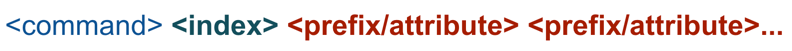
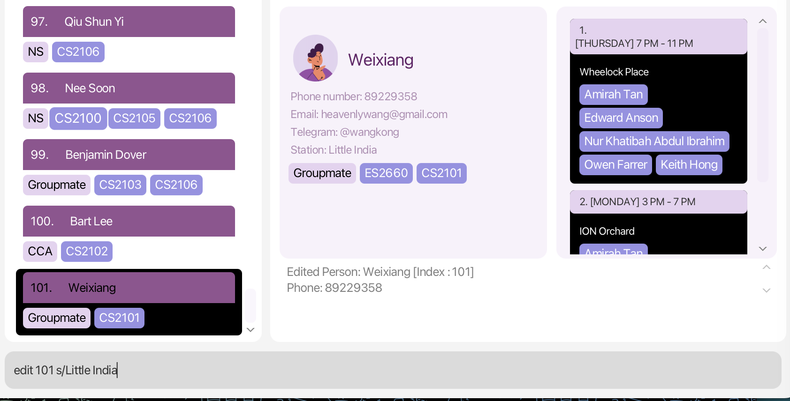
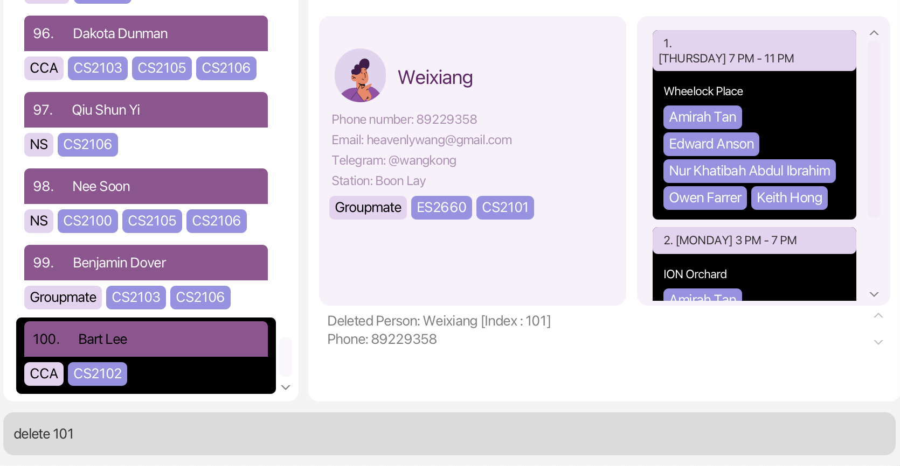

# EduMate User Guide

#### Are you a _busy NUS student_ who wants to efficiently manage your **academic** and **social** life?
We acknowledge that for brilliant individuals like yourself, the time you spend in university presents an opportunity to connect with others and establish long-lasting friendships. We have built this [personalised desktop app](#what-is-edumate) to help **YOU** do just that!

## Using this Guide
If you are new to this user guide, we strongly recommend you to read the [Overview](#overview) section. Otherwise,

* If you want to run EduMate for the first time, check out our [Quick Start](#quick-start) guide.
* If you want to learn to use EduMate, check out our [Commands](#commands) section for a detailed guide.
* If you want a more hands-on learning experience with EduMate, check out our [Try-it-out](#try-it-out-recommended) section.
* If you want to contribute to this project, check out our [Developer Guide](https://ay2223s2-cs2103t-w14-2.github.io/tp/DeveloperGuide.html).

For **experienced users**, you may refer to the [Command Summary](#command-summary) for a summarised table of all the commands available. 
## Table of Contents
* [**Using this Guide**](#using-this-guide)
* [**Table of Contents**](#table-of-contents)
* [**Overview**](#overview)
  * [**What is EduMate?**](#what-is-edumate)
  * [**Understanding the Symbols**](#understanding-the-symbols)
  * [**Glossary**](#glossary)
* [**Quick Start**](#quick-start)
  * [**System Requirements**](#system-requirements)
  * [**Installation Instructions**](#installation-instructions)
  * [**Try it out! (Recommended)**](#try-it-out-recommended)
  * [**Getting Help**](#getting-help)
* [**User Interface**](#user-interface)
  * [**Breakdown of EduMate's UI**](#breakdown-of-edumates-ui)
    * [**Person List**](#person-list)
    * [**Profile Panel**](#profile-panel)
    * [**Command Box**](#command-box)
    * [**Command Response**](#command-response)
    * [**Meet Up Recommendation Panel**](#meet-up-recommendation-panel)
    * [**Scheduled Meet Up Panel**](#scheduled-meet-up-panel)
* [**Set Your Own Profile**](#set-your-own-profile)
* [**Commands**](#commands)
  * [**How to interpret the command format**](#how-to-interpret-the-command-format)
  * [**Attributes**](#attributes)
    * [**Basic Attributes**](#basic-attributes)
      * [**Basic Attributes Table**](#basic-attributes-table)
    * [**Other Attributes**](#other-attributes)
      * [**Group**](#group)
      * [**Module**](#module)
      * [**Module with Lessons**](#module-with-lessons)
  * [**Basic Commands**](#basic-commands)
    * [**Add a contact `add`**](#add-a-contact-add)
    * [**View a contact's profile `view`**](#view-a-contacts-profile-view)
    * [**Edit a contact's details `edit`**](#edit-a-contacts-details-edit)
    * [**Delete a contact `delete`**](#delete-a-contact-delete)
    * [**Add a label to a contact `tag`**](#add-a-label-to-a-contact-tag)
    * [**Remove a label from a contact `untag`**](#remove-a-label-from-a-contact-untag)
    * [**Listing all your contacts `list`**](#listing-all-your-contacts-list)
* [**Advanced Commands**](#advanced-commands)
  * [**Search Commands**](#search-commands)
    * [**Filter contacts by keywords `find`**](#filter-contacts-by-keywords-find)
    * [**Arrange contacts based on criteria `sort`**](#arrange-contacts-based-on-criteria-sort)
  * [**Storage Commands**](#storage-commands)
    * [**Save a copy of EduMate `save`**](#save-a-copy-of-edumate-save)
    * [**Load a copy of EduMate `load`**](#load-a-copy-of-edumate-load)
  * [**Meet Commands**](#meet-commands)
    * [**Suggest places to meet with your contacts `meet`**](#meet-commands)
  * [**Schedule Commands**](#schedule-commands)
    * [**Organise a meet up with your contacts `organise`**](#organise-a-meet-up-organise)
    * [**Unorganise a meet up with your contacts `unorganise`**](#unorganise-a-meet-up-unorganise)
* [**Other Commands**](#other-commands)
    * [**Exit the application `exit`**](#exit-the-application-exit)
* [**FAQ**](#faq)
* [**Summary**](#summary)
  * [**Prefixes**](#prefixes)
  * [**Command Summary**](#command-summary)
* [**Troubleshooting**](#troubleshooting)
  * [**How to check your Java version**](#how-to-check-your-java-version)

--------------------------------------------------------------------------------------------------------------------

## Overview

The following subsections explain the overarching functionality of EduMate, as well as the various terminology we will use in this guide.

### What is EduMate?

EduMate is a desktop app designed for NUS students to manage their academic and social lives. It works as an address book
but has other interesting features as well. It works mostly by commands and can behave like a
Command Line Interface (CLI).

### Understanding the Symbols

Here is a breakdown of the different symbols and colours we will use throughout this guide.

:information_source: Useful information for you to know.

:bulb: Tips and tricks to enhancing your experience in using EduMate.

:warning: Warnings for you to heed so that EduMate works as intended.

### Glossary

* **Command Line Interface (CLI)**: A text-based user interface (UI) used to run programs, manage computer files and interact with the computer
* **Graphical User Interface (GUI)**: A form of user interface that allows users to interact with electronic devices through graphical icons
* **Mainstream OS**: Windows, Linux, Unix, OS-X
* **Mass Rapid Transit (MRT)**: Singapore's high-speed rail system.

[Return to the top](#table-of-contents)

--------------------------------------------------------------------------------------------------------------------

## Quick start

### System Requirements

Here is everything you need to install and set up EduMate. For the best possible experience, we recommend that you run the application on the following supported operating systems:

* Windows
* macOS (Both Intel and M1/M2 Chips)
* Linux

Do also ensure that you have Java `11` or above installed in your Computer. If you don’t already have Java `11` or above on your system, head over to [Oracle’s Java download page](https://www.oracle.com/java/technologies/downloads/). To check whether your Java version is compatible with EduMate, please refer to [this section]().

### Installation Instructions

**Step 1.** Download the latest `eduMate.jar` from [here](https://github.com/AY2223S2-CS2103T-W14-2/tp/releases).

**Step 2.** Copy the file to the folder you want to use as the _home folder_ for your EduMate.

**Step 3.** Open a command terminal, change directory into the folder where you put the jar file in via the command `cd`, and use the `java -jar eduMate.jar` command to run the application. 

After a few seconds, a GUI resembling the one shown below will appear. Please take note that the application already includes some sample data. 
   

Figure 1: The GUI upon start up.

### Try it out! (Recommended)

:bulb: **Important:**  
Ensure you have met the system requirements and installed EduMate properly on a computer. If you have not,
please see [System Requirements](#system-requirements) and [Installation Instructions](#installation-instructions)
before continuing.
 

Before we dive into exploring the various features of EduMate, please choose whether you prefer a guided or unguided experience.

1. For a guided experience, please enter `sample 100` in the command box located at the top left of the application. This will generate 100 sample contacts in your EduMate, which you can use to familiarize yourself with the application's functionalities.
2. If you would like to start with a fresh EduMate, simply type `clear` in the same command box.

:warning: **Before you clear or sample**
Performing either action will remove any contacts you currently have on your EduMate. To save your progress, have a look at our [Save Command](#save-a-copy-of-edumate-save).

As you navigate through the application, we encourage you to experiment with different [commands](#commands) to further enhance your understanding.

### Getting help

If you require assistance while using EduMate, you may find the solution in the [Commands](#commands) section of this User Guide. Alternatively, you can type in the `help` command to access a quick reference guide.

If you need more assistance, do not hesitate to head over to our
[Github](https://github.com/AY2223S2-CS2103T-W14-2/tp) page and file an issue with a tag *customer-assistance-required*.
A member of our core team will attend to you as soon as possible.

[Return to the top](#table-of-contents)

--------------------------------------------------------------------------------------------------------------------

## User Interface

`EduMate`'s UI components are built to fulfil a specific functionality. We designed `EduMate` to be aesthetically pleasing and easy for users to navigate.

We also used light purple and white as our main colour scheme as they are cool colours.

Diagram 2: <code>EduMate</code>'s UI

### **Breakdown of EduMate's UI**

`EduMate` consists of the following main UI components
1. Person List
2. Meet Up Recommendation Panel
3. Profile Panel
4. Scheduled Meet Up Panel
5. Command Response Box
6. Command Input Box
7. Help Button
8. Exit Button

The following diagram shows the layout of components numbered exactly as above.

Diagram 3: Labelled layout of <code>EduMate</code>'s UI components.

### Person List

You may locate the Person List at the center-left of `EduMate`. This is where you will see all your saved contacts (or sample data if you are trying out for the first time).

Diagram 3: Person List with some contacts displayed.

### Profile Panel

The Profile Panel allows you to display your own or your contact's information.

The Profile Panel will display basic information like your / contact's name, phone number, email address, nearest home station and the modules you are taking in NUS.

Diagram 4: Sample user profile displayed on Profile Panel.

### Command Box

The Command Box is where you can input the [Commands](#commands) when using `EduMate`.

The Command Box is located at the bottom of the application. You may refer to the [User Interface](#user-interface) section to locate it.

:bulb: **Pro Tip:**  
Did you know that the UP and DOWN arrow keys can be used to quickly access previously typed commands in the Command Box? This feature has been specially designed for you to save time and increase your productivity. 
 
In the current session, all of your previously typed commands can be accessed using the UP and DOWN arrow keys. Additionally, we automatically save up to 100 of your most recent commands to a file for your convenience in the next session. This way, you can easily refer back to your previous commands without having to retype them, saving you time and increasing your efficiency.

### Command Response

The Command Response box is where you will receive feedback for any command you execute. It could give you some information if the command execution was successful or if you had executed a command of an invalid format.

The Command Response box is located directly below the [Profile Panel](#profile-panel) and above the [Command Box](#command-box).

Diagram 5: Successful command execution feedback shown

### Meet Up Recommendation Panel

The Meet Up Recommendation Panel (located at the top right of `EduMate`) suggests recommendations of optimal timings and locations
where you can meet your friends.

Diagram 6: Recommended timings and locations for meetups displayed

### Scheduled Meet Up Panel

The Scheduled Meet Up Panel (located directly to the right of [Profile Panel](#profile-panel)) will show your confirmed meetings with your contacts.

Diagram 7: Sample scheduled meet ups displayed.

[Return to the top](#table-of-contents)

--------------------------------------------------------------------------------------------------------------------
## Set Your Own Profile

Once you have familiarized yourself with EduMate, you are now ready to begin customizing the application to suit your preferences and needs!

**Step 1.** Run `java -jar eduMate.jar`. The application window will open and show you where you have left off
(if you have tried out `sample` from earlier)  

**Step 2.** On the Command Box, execute `edit n/[YOUR NAME] p/[YOUR CONTACT NUMBER] t/@[YOUR TELEGRAM HANDLE] 
s/[NEAREST MRT STATION TO YOUR HOUSE] e/[YOUR EMAIL]`
 

:information_source: To know more about what `n/`, `/e` etc. symbolises, you may want to check out [Prefixes](#prefixes).

:bulb: **Tip:**  
You do not have to enter all your information at once! You can omit some information
and **its corresponding prefix** and enter them in the future!
 

Moreover, eduMate will replace the missing fields with placeholders which you
can then edit over later!

**Step 3.** To add the modules that you are studying as such :
`tag m/[MODULE_CODE] DAY START_TIME END_TIME`
 

:bulb: **Tip:**  
E.g `tag m/CS2103T MON 8 10 m/CS2101 WED 14 15`

**Step 4.** To add groups that you currently belong to as such: 
`tag g/[GROUP_NAME]`

:bulb: **Tip:**  
E.g `tag g/SoC g/Sailing`

**Step 5.** You are done! Enjoy!  

[Return to the top](#table-of-contents)

------------

## Commands

EduMate is a command-driven application, which means that its various functionalities can be accessed by executing specific commands.

### How to interpret the command format

**:information_source: Basic Command Format** 

* The first word is the type of command that you are running. 
  e.g. for the command `delete 5`, we are running the `delete` command.

* We use [Prefixes](#prefixes) like `p/` and `g/` to label our arguments for the command. Additionally, we use numbers to specify the index of contacts in our list. 
  e.g. `edit 2 n/Steven Tan` runs the `edit` command with an index of 2 and an `n/` argument of Steven Tan.

* Words in `UPPER_CASE` are arguments you are meant to fill in. 
  e.g. in `view n/NAME`, you can fill in the `NAME` argument like `view n/Tan Kah Kee`.

* We use `z/` to denote any prefix. 
  e.g. `z/FIELD` could mean `n/FIELD` or `s/FIELD`.

* Items in square brackets are optional. 
  e.g. `n/NAME [g/GROUP]` can be used as `n/Tan Kah Kee g/Friend` or as `n/Tan Kah Kee`.

* Items with `…`​ after them can be used multiple times including zero times. 
  e.g. `[m/MODULE]…​` can be used as ` ` (i.e. 0 times), `m/`, `m/CS2108 m/CS2101` etc.

* Unless otherwise specified, arguments can be in any order. 
  e.g. if the command specifies `n/NAME s/STATION`, `s/STATION n/NAME` is also acceptable.

* If an argument is expected only once in the command, but you specified it multiple times, only the **last** occurrence of the argument will be taken. 
  e.g. `p/86544145 p/81353055` will be interpreted as `p/81353055`.

* Unnecessary arguments will be ignored. 
  e.g. `help 123` will be interpreted as `help`.

**:warning: Invalid Command Formats** 

* Indices must be positive numbers. 
  e.g. `delete one` is not an accepted command.

* [Prefixes](#prefixes) must be preceded by a space. 
  e.g. `sort m/an/Tan` is not an accepted command for prefixes `m/` and `n/`.

:bulb: **General format of commands:**  

* **Bolded** portions of the command format implies that inputs could be optional.

[Return to the top](#table-of-contents)

## Attributes

Contacts in EduMate have two types of attributes: single-valued and multi-valued.

Single-valued attributes for each contact can only have one value. Examples of single-valued attributes include a contact's name, phone number, email address, Telegram handle, and home station.

Multi-valued attributes, on the other hand, can have multiple values associated with a single contact. Examples of multi-valued attributes include the groups and modules that a contact belongs to.

### Basic Attributes

Below, you can find the basic attributes we use to make up a person's profile in `EduMate`.

#### **Basic Attributes Table**

| Attribute       | Description                                                    | Format           | Rules                                                                                                                                                                                                  | Example             |
|-----------------|----------------------------------------------------------------|------------------|--------------------------------------------------------------------------------------------------------------------------------------------------------------------------------------------------------|---------------------|
| Name            | The name of the person.                                        | `n/NAME`         | - Only contain alphanumeric characters and spaces.   - **Must also be unique**.                                                                                                                    | `n/Wen Li`          |
| Phone Number    | The phone number of the person.                                | `p/PHONE_NUMBER` | - Should only contain numbers.  - At least 3 digits long. Maximum of 15 digits allowed.                                                                                                            | `p/89229358`        | 
| Email Address   | The email address of the person.                               | `e/EMAIL`        | Should be of the form `local@domain`, where: - `local` consists of only alphanumeric and the special characters `+`, `_`, `.`, `-`. -`domain` consists of an `@` symbol followed by web site.  | `e/wenli@gmail.com` |
| Home Station    | The name of the **closest MRT station** to the person's home.  | `s/STATION`      | Name of a valid MRT station.                                                                                                                                                                           | `s/Boon Lay`        |
| Telegram Handle | The Telegram Handle of the person.                             | `t/TELEGRAM`     | - Should start with `@` symbol  - At least 5 characters long - Only combinations of letters, numbers and underscores are allowed after the `@` symbol                                          | `t/@wenli`          |

### Other Attributes

Below are some special attributes that complement the [Basic Attributes](#basic-attributes) of a person's profile.

#### **Group**

**Description:** The group that you and the person belong to. 

**Pattern:** `g/GROUP` 

**Rules:** `GROUP` should only contain alphanumeric characters. 

**Example:** `g/Groupmate`

:information_source: Important! 
* EduMate's [Person List](#person-list) will only show labels of common groups that you are in with that contact. Do not be alarmed that some groups you tagged did not
appear in the Person List.
* You may still view the label when you [view the contact's profile](#view-a-contacts-profile-view).
* When you tag (untag) a group common to you to (from) a contact, it will appear (disappear) on the person's contact card in the Person List automatically.

#### **Module**

**Description:** The name of the module the person is taking. 

**Pattern:** `m/MODULE` 

**Rules:** `MODULE` should be the name of a valid NUS module. 

**Example:** `m/CS2107`

:information_source: Important! 
* EduMate's [Person List](#person-list) will only show common modules that you are enrolled in with the contact. Do not be alarmed that some modules you tagged did not
appear in the Person List.
* You may still view the label when you [view the contact's profile](#view-a-contacts-profile-view).
* When you tag (untag) a module common to you to (from) a contact, it will appear (disappear) on the person's contact card in the Person List automatically.

#### **Module with Lessons**

**Description:** The name of the module the person is taking, and a lesson associated with the module. 

**Pattern:** `m/MODULE DAY START_TIME END_TIME` 

**Rules:** `MODULE` should be the name of a valid NUS module. `DAY` should be a valid day of the week. `START_TIME` and `END_TIME` should be valid hour in a day. 

**Example:** `m/CS1234 mon 12 13`

## Basic Commands

These commands will help you to perform basic functions on EduMate. These are functions that will be expected to be present in a typical address book.

### Add a contact `add`

You can easily add a new contact to EduMate using the `add` command. This allows you to quickly store their information for future reference, such as their name, phone number, email address, Telegram handle, and home station. Once added, you can also assign them to groups or modules using the `tag` command.

:information_source: **Format** (See [Interpreting Command Formats](#how-to-interpret-the-command-format)): 
* `add n/NAME [z/FIELD]…​`: Adds a contact with the given details. Notice that `NAME` is a compulsory field.

What you should see: 

Diagram 8: A new contact: Weixiang is added to <code>EduMate</code>.

##### Explanation:
The `add` command creates a new contact for a friend named Weixiang whose information does not exist in `EduMate` yet. The contact will be assigned index 101 and his information profile will be shown on the Profile Panel.

:bulb: **Example 1 : All fields are present** 
* `add n/Wen Li p/89229358 s/Boon Lay e/wenli@gmail.com t/@wenli g/Groupmate m/CS2101 m/CS2107`: Adds a contact with the following details:
    * Name: `Wen Li`
    * Phone number: `89229358`
    * Station: `Boon Lay`
    * Email: `wenli@gmail.com`
    * Telegram handle: `@wenli`
    * Groups: `Groupmate`
    * Modules: `CS2101`, `CS2107`
  
:bulb: **Example 2 : Some fields are present** 
* `add n/Wen Qing`: Adds a contact with the following details. Note the default values for each attribute:
    * Name: `Wen Qing`
    * Phone number: `00000000`
    * Station: `Kent Ridge`
    * Email: `wenqing@gmail.com`
    * Telegram handle: `@wenqing00000`
    * Groups: Empty
    * Modules: Empty

:information_source: Important! 
As you may have already see above, when adding a contact with some fields present, EduMate will give placeholders for the respective
missing information.  

Notice that for `Telegram handle`, there are 5 '0's appended at the back of the name (E.g Wen Qing results in `@wenqing0000`).
This is done to conform to Telegram's username restrictions of being at least 5 characters long for short names like Bob, Sam etc.

### View a contact's profile `view`

You can use the `view` command to retrieve and view either your own information or a contact's information. This will display the relevant details on the [Profile Panel](#profile-panel).

:information_source: You can use this command if:
* you want to view a contact's full details on the [Profile Panel](#profile-panel).
* you are unsure what index to use for a particular contact

The `view` command retrieves either the user's information or the contact's information and display them on the [Profile Panel](#profile-panel).

:information_source: **Formats** (See [Interpreting Command Formats](#how-to-interpret-the-command-format)): 
* `view`: Views your profile.
* `view INDEX`: Views the contact at index `INDEX`.
* `view n/NAME`: Views the contact with name `NAME`.

What you should see: 

Diagram 9: Weixiang's profile displayed after execution of the <code>view</code> command

 

:bulb: **Examples** 
* `view` : Displays your profile.
* `view 5`: Displays the profile of the fifth contact in EduMate.
* `view n/Wen Li`: Displays Wen Li's profile.

### Edit a contact's details `edit`

With EduMate's `edit` command, you can easily update the profile of a contact. You have the flexibility to modify as many fields as required, ensuring that your contact's information is always up-to-date.

:information_source: **Formats** (See [Interpreting Command Formats](#how-to-interpret-the-command-format)): 

* `edit INDEX [z/FIELD]…​`: Edits the fields for the contact at index `INDEX`.
* `edit [z/FIELD]…​`: Edits your user profile.

What you should see: 

Diagram 10: MRT station nearest to his home updated to Little India after execution of the <code>edit</code>command.

 

##### Explanation:
Suppose you realised that Weixiang has just moved house and the nearest MRT station from his house is Little India. Running
`edit 101 s/Little India` will update the nearest station recorded on his profile.

:bulb: **Examples** 

* `edit 3 n/Wen Qing`: Changes the name of the third contact to `Wen Qing`.
* `edit 6 p/89229358 t/@wenqing`: Changes the phone number and telegram handle of the sixth contact.
* `edit s/Bedok`: Updates your address to `Bedok`.

### Delete a contact `delete`

If you no longer need a contact in EduMate, you can remove them using the `delete` command.

:information_source: **Formats** (See [Interpreting Command Formats](#how-to-interpret-the-command-format)): 
* `delete INDEX`: Deletes the contact at index `INDEX`.

What you should see: 

Diagram 11: Weixiang's contact deleted after execution of the <code>delete</code>command.

:bulb: **Example** 
* `delete 5`: Removes the fifth contact from EduMate.

### Add a label to a contact `tag`

With EduMate's `tag` command, you can tag your existing contacts with groups and modules using this command. You can also assign lessons to the contacts to indicate their availability during specific time periods. This will enable EduMate to suggest more suitable meet up times when using the `meet` command.

:information_source: **Formats** (See [Interpreting Command Formats](#how-to-interpret-the-command-format)): 
* `tag m/MODULE_TAG`
* `tag m/MODULE_TAG DAY START END`
* `tag INDEX m/MODULE_TAG`
* `tag INDEX m/MODULE_TAG DAY START END`
* `tag g/GROUP`
* `tag INDEX g/GROUP`

What you should see: 

Diagram 12: Amirah tagged with CS2109S Module Tag with a lesson from 4pm - 6pm on a Monday

##### Explanation:

Say you know that Amirah has got a CS2109S lesson from 4pm - 6pm, tagging CS2109S with the lesson information will allow you result in
CS2109S tag displaying at her profile in the Profile Panel.

:bulb: **Module Tag Examples** 

* `tag 1 m/CS1234`: Adds CS1234 tag to the first contact from EduMate.
* `tag m/CS1234` : Adds CS1234 tag to your own profile.
* `tag 2 m/CS2103T MONDAY 8 10` : Adds CS2103T tag (if not present yet) to your second contact with a Monday lesson from 8am - 10am.
* `tag m/CS2103T MONDAY 8 10` : Adds CS2103T tag (if not present yet) to your profile with a Monday lesson from 8am - 10am.

:bulb: **Group Tag Examples** 

* `tag 1 g/Cycling` : Adds Cycling tag to the first contact from EduMate.
* `tag g/Project` : Adds Project tag to your own profile.

### Remove a label from a contact `untag`

With EduMate's `untag` command, you can remove groups or modules from your existing contacts. Additionally, you can unassign lessons from a contact to indicate their availability during that specific period of time. This will help EduMate to suggest more appropriate meet up times when using the meet command.

:information_source: **Formats** (See [Interpreting Command Formats](#how-to-interpret-the-command-format)): 
* `untag m/MODULE_TAG`
* `untag m/MODULE_TAG DAY START END`
* `untag INDEX m/MODULE_TAG`
* `untag INDEX m/MODULE_TAG DAY START END`
* `untag g/GROUP`
* `untag INDEX g/GROUP`

What you should see: 

Diagram 13: Amirah after removing the CS2109S Module Tag.

 

##### Explanation:
Say you realise that Amirah accidentally told you the wrong information, you can remove the CS2109S module tag
with the `untag 1 m/CS2109S MONDAY  16 18` command. The tag will disappear from Amirah's profile in the Profile Panel. 

:bulb: **Module Tag Examples** 

* `untag 1 m/CS1234`: Removes CS1234 tag from the first contact from EduMate.
* `untag m/CS1234` : Removes CS1234 tag to your own profile.
* `untag 2 m/CS2103T MONDAY 8 10` : Removes CS2103T tag (if not present yet) from your second contact with a Monday lesson from 8am - 10am.
* `untag m/CS2103T MONDAY 8 10` : Removes CS2103T tag (if not present yet) from your profile with a Monday lesson from 8am - 10am.

:bulb: **Group Tag Examples** 

* `untag 1 g/Cycling` : Removes Cycling tag from the first contact from EduMate.
* `untag g/Project` : Removes Project tag from your own profile.

### Listing all your contacts `list`

With the `list` command, you can get EduMate to display all your contacts in the [Person List](#person-list)

:information_source: **Format** (See [Interpreting Command Formats](#how-to-interpret-the-command-format)): 
* `list`

:bulb: **Tips:** `list` is especially useful when 

- You need to view all contacts again after [`find`](#filter-contacts-by-keywords-find) and [`sort`](#arrange-contacts-based-on-criteria-sort).
- Find out the index of the contact you want to view on the [Person List](#person-list).

## Advanced Commands

Now that you have become familiar with the basics of EduMate, it's time to explore its more advanced features. For a more guided experience, you can run the `sample 100` command to navigate through this section.

### Search Commands

The search commands in EduMate help you to efficiently navigate and manage your contacts. Instead of manually searching through a long list of contacts, these commands allow you to customise how EduMate displays them, making the process much more efficient.

#### Filter contacts by keywords `find`

EduMate's `find` command helps you quickly locate specific contacts by searching for keywords within their fields. This tool allows you to generate a list of contacts that meet certain criteria and manage your contacts more efficiently. 

To use the `find` command, simply type `find` followed by the relevant keywords or criteria. 

The command can also be used with multiple prefixes to refine your search. The results returned will contain at least one keyword from each specified field. Use the `find` command to save time and easily locate the information you need.

:information_source: **Format** (See [Interpreting Command Formats](#how-to-interpret-the-command-format)): 
* `find z/KEYWORD [MORE_KEYWORDS]... z/KEYWORD [MORE_KEYWORDS]...`

What you should see: 

Diagram 14: Only contacts tagged with CCA and CS2100 are shown.

 

##### Explanation:

Say you want to filter out contacts who are in the same CCA as you to study for the upcoming finals for CS2100. `find g/CCA m/CS2100`
will filter out contacts who have are tagged with CCA and CS2100.

:bulb: **Examples** 

* `find m/CS2103T CS2109S`: Returns all persons with modules CS2103T or CS2109S
* `find n/Edward Richards`: Returns all persons with names Edward or Richards
* `find p/9093`: Returns all persons with phone numbers starting with 9093
* `find n/Edward m/CS2103T` : Returns all persons with name Edward and module CS2103T
* `find n/Edward Richards m/CS2103T CS2109S` : Returns all persons named Edward or Richards with module CS2103T or CS2109S.

:bulb: Tips on usage 
* The search is case-insensitive. e.g hans will match Hans
* The order of the keywords does not matter. e.g. Hans Bo will match Bo Hans
* Only the field specified by the prefix is searched. e.g. n/ means only the name field is searched
* Words matching the first part of the string will be matched e.g. Han will match Hans
* Persons matching at least one keyword will be returned (i.e. OR search). e.g. Hans Bo will return Hans Gruber, Bo Yang

**:warning: Filtered list** 

* The `find` command returns a filtered list, so command operations only work on persons present in the filtered list. 
  e.g. If the filtered list does not contain any person with contact index 2, any operation relating to contact index 2 will throw error.
* If you want to run commands related to persons not in the filtered list, just run the `list` command to obtain the full list of your contacts.

#### Arrange contacts based on criteria `sort`

With EduMate's `sort` command, you have the power to organize your contacts in a way that's most helpful for you. Whether you want to find out who shares the most modules with you or who's likely to become a close friend this semester, the `sort` command can help you out. 

By simply typing `sort` followed by the relevant criteria, you can sort your contacts by name, the number of shared modules, or any other specified field. This feature can help you identify potential study or social groups within your contacts, making it easier to connect and collaborate with others.

:information_source: **Formats** (See [Interpreting Command Formats](#how-to-interpret-the-command-format)): 
* `sort`: Sorts the contacts by their indices.
* `sort z/a`: Sorts the contacts by their `z` attribute **in ascending order**
* `sort z/d`: Sorts the contacts by their `z` attribute **in descending order**
* `sort z/`: Sorts the contacts by their `z` attribute based on our **default ordering**
* `sort z1/ z2/`: Sorts the contacts by their `z1` attribute, and breaks ties using their `z2` attribute
* `sort [z/]...​`: Sorts the contacts by multiple attributes

We will now teach you how to effectively use the `sort` command.

:information_source: How we sort the attributes:

* The `NAME`, `EMAIL`, `STATION`, `PHONE` and `TELEGRAM` attributes are sorted by alphabetical order, and is default in **ascending** order.
* For `GROUP`, we sort the contacts based on the number of groups the contact belongs to. By default, we sort in **descending order**. 
  e.g. if Alex has 2 groups (TA, NS), and Ben has one group (TA), Alex will be placed before Ben in the default ordering.
* For `MODULE`, we sort the contacts based on the number of **common modules** they share with you. By default, we sort in **descending order**. 
  e.g. if Alex has 2 modules (CS1101S, CS1231S), Ben has one module (CS1101S), and you have 2 modules (CS1231S, MA2001), then Alex has 1 module in common with you (CS1231S) and Ben has 0 modules in common with you. As such, Alex will be placed before Ben in the default ordering.

What you should see: 

Diagram 16: Contacts ranked according to sorting criteria specified in the Command Box

 

##### Explanation:

The command `sort m/d n/a` would mean that `EduMate` would first sort contacts by decreasing number of common modules with you, and tie-break by increasing alphabetical order.

Hence, Alex Quinn is ranked higher than Astrid Holland as Alex's name is lexicographically smaller than Astrid even though they share the same common modules as you.

:bulb: **Examples** 
* `sort n/d`: Sorts by name in descending order
* `sort m/a`: Sorts by the number of modules they have in common with you (in ascending order)
* `sort t/`: Sorts by Telegram handle in its default ordering (ascending)

### Storage Commands

The storage commands allow you to save and load your EduMate data into a file. This means you can easily backup your data and access it from different devices or share it with others.

:information_source: You can use these commands if:
* You want to create backups of your EduMate
* You want to explore the functions of EduMate without fear of losing your data
* You want to maintain multiple versions of EduMate

#### Save a copy of EduMate `save`

Using the `save` command in EduMate, you can easily save your data into a file with a name of your choice. This allows you to back up your data and access it later or share it with others.

:information_source: **Format** (See [Interpreting Command Formats](#how-to-interpret-the-command-format)): 
* `save FILENAME`: Saves the EduMate into a file at `FILENAME.json`.

:bulb: **Examples** 
* `save backup`: Saves the EduMate in the `backup.json` file.

#### Load a copy of EduMate `load`

Using the `load` command in EduMate, you can easily load a previously saved data file into the application. This allows you to access your data from different devices or recover it in case of data loss.

:information_source: **Format** (See [Interpreting Command Formats](#how-to-interpret-the-command-format)): 
* `load FILENAME`: Loads the EduMate from a file at `FILENAME.json`.

:bulb: **Examples** 
* `load backup`: Loads the EduMate from the `backup.json` file.

### Meet Commands

The `meet` command in EduMate is used to suggest suitable meet-up locations and times for users and their contacts, based on various criteria such as availability and proximity. It is useful for finding a mutually convenient time and place to meet up with friends or study partners. EduMate also offers more specialized commands such as `eat` for suggesting places to eat and `study` for suggesting places to study.

:information_source: **Format** (See [Interpreting Command Formats](#how-to-interpret-the-command-format)): 
* `meet INDEX_1 INDEX_2 ...`
* `study INDEX_1 INDEX_2 ...`
* `eat INDEX_1 INDEX_2 ...`

What you should see: 

Diagram 17: Recommended study spots and the common available days and timings displayed

 

##### Explanation:

After sorting your contacts, you decided to ask Astrid, Grover, Kevin and Alex from your CCA to study for CS2100. You can execute the `meet` command
whilst referring to their index on the Person List and find out what are the most optimal places and the best possible time to meet and study for the final.

:bulb: **Examples** 
* `meet 12 32 8 4` : Recommends a meeting time and location for a potential meetup with friends with the following indices `12, 32, 4, 8`.
* `eat 5 2 8 1 3` : Recommends a meeting time and eating spot for friends with the following indices `5, 2, 8, 1, 3`
* `study 6 2` : Recommends a meeting time and study spot for friends with the following indices `6 and 2`.

### Schedule Commands

The `organise` command in EduMate is used to add meet ups with selected contacts, whether they are customised or recommended by the meet commands. It is useful for keeping track of your upcoming meetups in an organised and efficient way. In addition, EduMate also offers the `unorganise` command, which helps you manage and clean up scheduled meetups by removing them - making it easy to stay on top of your schedule.

#### Organise a meet up `organise`

:information_source: **Format** (See [Interpreting Command Formats](#how-to-interpret-the-command-format)): 
* `organise INDEX`
* `organise INDEX_1 INDEX_2 ... d/DAY T/START_TIME END_TIME l/LOCATION`

What you should see: 

Diagram 18: A new meet up: Monday 8AM to 11AM at Queenstown Public Library is added to <code>EduMate</code>.

##### Explanation:
After deciding you want to meet with Samantha and Ian, you execute the `meet` command to generate recommended timings and locations. Scrolling through the list of recommendations, you decide that Queenstown Public Library on a Monday morning sounds the best. You can then execute the `organise` command to add that recommendation to your scheduled meet ups list.

:bulb: **Example 1 : Adding a meet up from the recommendation list** 
* `organise 1`: Adds the recommendation with index 1 on the [Meet Up Recommendation Panel](#meet-up-recommendation-panel) to the [Scheduled Meet Up Panel](#scheduled-meet-up-panel).

:bulb: **Example 2 : Adding a customised meet up** 
* `organise 1 3 d/TUESDAY T/10 11 l/Starbucks`: Adds a customised meet up with the following details to the [Scheduled Meet Up Panel](#scheduled-meet-up-panel):
  * Participants: `contacts with index 1 and 3`
  * Day: `TUESDAY`
  * Start time: `10AM`
  * End time: `11AM`
  * Location: `Starbucks`

#### Unorganise a meet up `unorganise`

If you wish to remove a scheduled meetup from your [Scheduled Meet Up Panel](#scheduled-meet-up-panel), simply use the `unorganise` command.

:information_source: **Format** (See [Interpreting Command Formats](#how-to-interpret-the-command-format)): 
* `unorganise INDEX`

:bulb: **Example : Removing a meet up from the scheduled meet up list** 
* `unorganise 1`: Removes the scheduled meet up with index 1 on the [Scheduled Meet Up Panel](#scheduled-meet-up-panel).

### Other Commands

#### Exit the application `exit`

If you want to end the application, simply type `exit`, or click on the `Exit` button located on the left of the interface.

---

## FAQ

**Q**: Can I add multiple module tags to a user

**A**: Yes, you can add multiple tags to a single user by using the "Module Tagging" feature multiple times.

**Q**: Can I edit my own profile?

**A**: Yes you may! Refer to [Editing a Contact's Details](#edit-a-contacts-details-edit)

**Q**: How is `EduMate` better than Microsoft Outlook or uWave?

**A**: We have features that Microsoft Outlook or uWave don't have but we think should be integrated into these platforms, like the [meet up recommenders](#meet-commands)
and several search functions like [sort](#arrange-contacts-based-on-criteria-sort) and [find](#filter-contacts-by-keywords-find). It is also open-source so student developers can 
suggest new features, and it is easily extensible!

**Q**: What is the difference between `tag` and `edit` feature when it comes to tagging groups and modules?

**A**: When you edit a profile, you might have to type in a lot of information and the command can get very long. This may
potentially lead to careless edits. We want to have a dedicated command to do specific tagging (or untagging) so you have
the option to do editing of tags separately.

## Summary

### Prefixes

| Prefix | Representation  |
|--------|-----------------|
| n/     | Name            |
| s/     | Station         | 
| p/     | Telegram Handle | 
| e/     | Email           | 
| g/     | Group           | 
| m/     | Module          | 
| d/     | Day             |
| l/     | Location        |
| T/     | Time Period     |
| "   "  | Empty           | 

### Command Summary

| Action                   | Format (See [Interpreting Command Formats](#how-to-interpret-the-command-format))    | Examples                                                       |
|--------------------------|--------------------------------------------------------------------------------------|----------------------------------------------------------------|
| **Add a contact**        | `add n/NAME p/PHONE...`                                                              | `add n/Wen Li...`                                              |
| **View a profile**       | `view`, `view INDEX`, `view n/NAME`                                                  | `view 5`, `view n/Wen Li`                                      |
| **Edit a contact**       | `edit INDEX [z/FIELD]…​`, `edit [z/FIELD]…​`                                         | `edit 4 n/Wen Qing`, `edit s/NUS t/@wenqing`                   |
| **Delete a contact**     | `delete INDEX`                                                                       | `delete 3`                                                     |
| **Tag a contact**        | `tag INDEX m/MODULE...`, `tag m/MODULE...`, `tag INDEX g/GROUP`, `tag g/GROUP`       | `tag m/CS1234`, `tag m/CS2345 mon 12 1`, `tag 1 g/Friend`      |
| **Untag a contact**      | `untag INDEX m/MODULE...`, `untag m/MODULE...`, `untag INDEX g/GROUP`, `untag g/GROUP` | `untag m/CS1234`, `untag m/CS2345 mon 12 1`, `untag 1 g/Friend` |
| **Filter contacts**      | `find z/FIELD... z/FIELD...`                                                           | `find n/Tan`, `find m/CS1231`, `find n/Tan m/CS1231`           |
| **Sort contacts**        | `sort [z/a]…​`, `sort [z/d]…​`, `sort [z/]…​`                                        | `sort`, `sort n/a`, `sort m/ p/d`                              |
| **Save a copy**          | `save FILE_NAME`                                                                     | `save backup`                                                  |
| **Load a copy**          | `load FILE_NAME`                                                                     | `load backup`                                                  |
| **Suggest meet ups**     | `meet [INDEX]…​`, `eat [INDEX]…​`, `study [INDEX]…​`                                 | `meet 1 6 4`, `eat 10 4 7`                                     |
| **Organise a meet up**   | `organise INDEX`, `organise [INDEX]... d/DAY T/START_TIME END_TIME l/LOCATION`       | `organise 1`, `organise 1 2 3 d/MONDAY T/10 12 l/NUS`          |
| **Unorganise a meet up** | `unorganise INDEX` | `unorganise 1`                                                 |

## Troubleshooting

### How to check your Java version

#### For **Windows** Users
**Step 1** Open up Command Prompt

**Step 2** Run the command `java -version`

**Step 3** Check the version number from the output.

#### For **Mac** and **Linux** Users
**Step 1** Open up Terminal.

**Step 2** Run the command `java -version`

**Step 3** Check the version number from the output.

