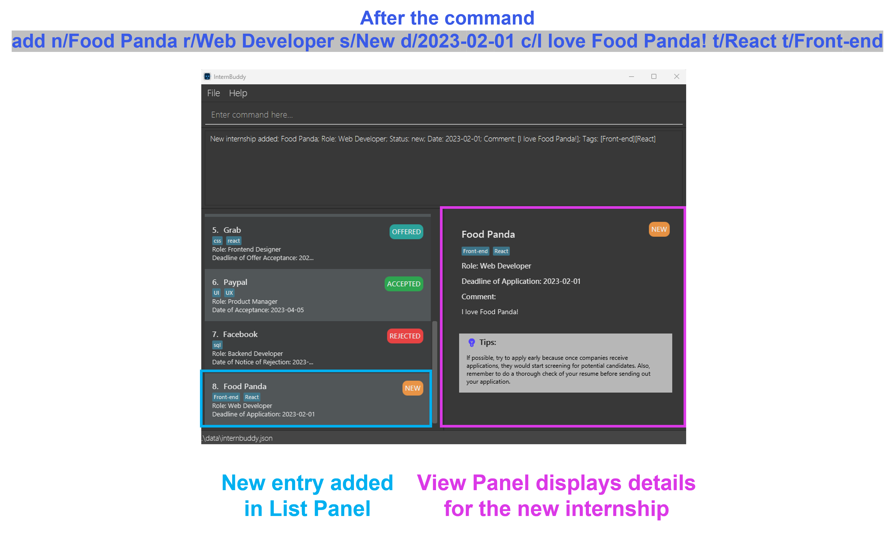

## **Table of Contents**
* Table of Contents
  {:toc}

## **Introducing InternBuddy**

InternBuddy is a desktop application for Computing undergraduates to manage their internship applications.
It is optimized for typing where it allows you to complete internship management tasks much more efficiently via
the keyboard as compared to using traditional Graphical User Interface (GUI) applications. If you are a fast typist
who is seeking for a one-stop platform to systematically organise your internship applications,
then InternBuddy is the perfect buddy to accompany you during your internship hunt.

InternBuddy runs using Java 11, and is available on the Windows, macOS and Linux operating systems.

 

  

## **About the User Guide**

### Objectives of the User Guide
This user guide aims to provide comprehensive instructions for users to learn how to use InternBuddy,
providing details on the installation process and features provided by InternBuddy. It also contains information
for advanced users to customise the usage of InternBuddy for a tailored user experience.

### Using the User Guide
This uses guide uses a set of formatting standards and visuals to better communicate information.

**Information Box**

:information_source: **Info:** Provides useful information that supplements the main text

**Tip Box**

:bulb: **Tip:**  Suggestions on how to enhance your experience

**Warning Box**

:warning: **Warning:**  Warns of a dangerous action that you should be aware of and to consider
carefully before committing

**Syntax Highlighting**

Commands, parameters, file paths and class names are highlighted.

`command`, `PARAMETER`, `filepath.json`, `ClassName`

**Keyboard Actions**

Keyboard keys are indicated using rounded buttons.

<button>Ctrl</button> <button>Alt</button> <button>Space</button> <button>Enter</button> <button>&uarr;</button>

## **Quick Start**

1. Ensure you have Java `11` or above installed in your computer
     
   

   :information_source: **Info:** If you are unsure of whether you have Java 11 installed, or need help installing
   it, you can refer to <a href="#appendix-a-installing-java-11">Appendix A</a>.
   

2. Download the latest `internbuddy.jar` from [here](https://github.com/AY2223S2-CS2103T-T14-3/tp/releases).
3. Copy the file `internbuddy.jar` to the folder you want to use as the _home folder_ for InternBuddy.
     
   

   :information_source: **Info:** The home folder is the folder where you will navigate to in order to launch
   InternBuddy, and it is where your InternBuddy data file will be stored in.
   

    
4. Double-click on the file `internbuddy.jar` to launch InternBuddy. A GUI similar to Figure 1 should
   appear in a few seconds. Note how the app contains some sample data. 
   

    
    

   
Figure 1: InternBuddy's GUI

    

5. You can interact with InternBuddy by typing into the box with the text `Enter command here...`, then pressing
   <button>Enter</button> to execute your command. For example, typing help and pressing <button>Enter</button> will open
   the help window.
6. Here are some other example commands you can try:

    - `list`: List all internship entries stored in InternBuddy
    - `add n/Food Panda r/Web Developer s/Applied d/2023-04-01`: Adds a new internship entry into InternBuddy.
    - `delete 3` : Deletes the 3rd internship entry of the current list displayed in InternBuddy.
    - `exit` : Exits InternBuddy.

Do refer to [Features](#features) below for a comprehensive list of supported features and their associated details.

## **Exploring the Graphical User Interface**
Figure 2 provides a visual representation of the different parts of InternBuddy's GUI,  while
Figure 3 explains what each part is used for.

  

Figure 2: Different parts of InternBuddy's GUI

 

| Part            | Usage                                                                                        |
|-----------------|----------------------------------------------------------------------------------------------|
| Input Box       | You can type in your commands here to interact with InternBuddy.                             |
| Results Display | This is where the results of your command will be displayed.                                 |
| List Panel      | Displays a list of internship entries.                                                       |
| View Panel      | Displays either the welcome message or detailed information of a specified internship entry. |
| Location Bar    | States where your InternBuddy data file is located on your computer.                         |

Figure 3: Explanation of the different parts of InternBuddy's GUI

:bulb: **Tip:**  The GUI is resizeable. You can resize it according to your preferences.

## **Command Information**

### Notes about Commands and Parameters

* Words in `UPPER_CASE` are the parameters to be supplied by the user. 
  e.g., If the command format is `add n/COMPANY_NAME`, you may input the command as `add n/Apple` where you supply the
  value `Apple` to the parameter `COMPANY_NAME`.

* Items in square brackets are optional. 
  e.g., If the command format is `edit INDEX [n/COMPANY_NAME] [c/COMMENT]`, you may input the command as `edit 2 n/Apple` where
  you omit the value for the parameter `COMMENT`.

* Items with `…`​ after them can be used multiple times including zero times. 
  e.g., `[t/TAG]…​` can be used as ` ` (i.e. 0 times), `t/friend`, `t/friend t/family` etc.

* Parameters can be in any order. 
  e.g., If the command format is `n/COMPANY_NAME r/ROLE`, both `n/Apple r/Software Engineer` and `r/Software Engineer n/Apple`
  are acceptable.

* If a parameter is expected only once in the command, but you specified it multiple times, only the last occurrence of
  the parameter will be taken. 
  e.g., If the command format is `r/ROLE`, typing in `r/Front-end Developer r/Back-end Developer` will cause your
  input to be interpreted as `r/Back-end Developer`.

* Extraneous parameters for commands that do not take in parameters (such as `help`, `list`, and `exit`) will be
  ignored. 
  e.g., If the command format is `help`, typing in `help 123` will cause your input to be interpreted as `help`.

### Descriptions, Prefixes and Constraints for Parameters
In InternBuddy's commands, we refer to a range of parameters that you can replace with values to input information that
is customised to your internship applications.

There are 2 important things that you should note:
1. Most parameters have associated **prefixes**. Prefixes are convenient shorthands that allow you to easily identify
   which parameter does a value belong to. For example, in `add n/Apple`, the value `Apple` is associated with the
   parameter `COMPANY_NAME` since the `n/` prefix is used.
2. There are **constraints** to the values that you can replace parameters with. The constraints differ based on
   the parameters. If you do not adhere to these constraints in your input, your input will be valid and an error
   message will be shown in the Results Display when you type the input in and press <button>Enter</button>.

Figure 4 provides a summary of the parameters with their descriptions, prefixes and constraints.

| Parameter      | Description                                                                                                        | Prefix | Constraints                                                                                                                                             |
|----------------|--------------------------------------------------------------------------------------------------------------------|--------|---------------------------------------------------------------------------------------------------------------------------------------------------------|
| `COMPANY_NAME` | The name of the company                                                                                            | `n/`   | Cannot be blank and must be at most 50 characters.                                                                                                      |
| `ROLE`         | The role that you applied for                                                                                      | `r/`   | Cannot be blank and must be at most 50 characters.                                                                                                      |
| `STATUS`       | The status of the internship application                                                                           | `s/`   | Must be one of the following: `New`, `Applied`, `Assessment`, `Interview`, `Offered`, `Accepted`, `Rejected`. Note that this is **not** case-sensitive. |
| `DATE`         | The date associated with the internship application                                                                | `d/`   | Must be a valid date in the format `YYYY-MM-DD`.                                                                                                        |
| `COMMENT`      | A comment that you can make on an internship application                                                           | `c/`   | Cannot be blank.                                                                                                                                        |
| `TAG`          | A label that you can give to an internship application                                                             | `t/`   | Cannot be blank and must be at most 30 characters.                                                                                                      |
| `INDEX`        | The index number of the internship entry as displayed in the [List Panel](#exploring-the-graphical-user-interface) | -      | A positive integer that is smaller than or equal to the largest index number shown in the List Panel. Note that 0 is not a positive integer.            |

Figure 4: Parameters with their descriptions, prefixes and constraints

### Details on `STATUS` and `DATE`
The parameter `STATUS` is used to represent the current status of an internship application. It can only take on one
of the following values: `New`, `Applied`, `Assessment`, `Interview`, `Offered`, `Accepted` and `Rejected`.
Note that this is not case-sensitive. Figure 5 explains the meaning of each status.

| `STATUS`     | Description                                                                                                                       |
|--------------|-----------------------------------------------------------------------------------------------------------------------------------|
| `New`        | You have recently saw this internship opportunity and would like to record it in InternBuddy. Also, you have yet to apply for it. |
| `Applied`    | You have applied for this internship opportunity and you are currently waiting for the company's response.                        |
| `Assessment` | You are currently in the technical assessment stage of the application process.                                                   |
| `Interview`  | You are currently in the behavioral interview stage of the application process.                                                   |
| `Offered`    | You have been offered the internship opportunity.                                                                                 |
| `Accepted`   | You have accepted the internship opportunity.                                                                                     |
| `Rejected`   | You have either been rejected by the company, or that you have rejected the internshop offer.                                     |

Figure 5: Description of statuses

Depending on the status of the internship application, the `DATE` parameter will be interpreted differently. Figure 6
documents the meaning of `DATE` with respect to each `STATUS` value.

| `STATUS`     | Interpretation of `DATE`     |
|--------------|------------------------------|
| `New`        | Deadline of Application      |
| `Applied`    | Date Applied                 |
| `Assessment` | Date of Technical Assessment |
| `Interview`  | Date of Behavioral Interview |
| `Offered`    | Deadline of Offer Acceptance |
| `Accepted`   | Date of Acceptance           |
| `Rejected`   | Date of Rejection            |

Figure 6: Description of dates

### Duplicate Internships
InternBuddy does not allow for the storage of duplicate internships. Should you enter a command that attempts to store
a duplicate internship, InternBuddy will remind you that the internship already exists.

2 internships are considered to be duplicates if they have matching `COMPANY_NAME`, `STATUS`,`ROLE` **and**
`DATE`. The comparison is case-insensitive. Do refer to Figures XX and XX for illustrative examples.

In Figure 7, internships A and B are considered as duplicate internships, because they have the same
`COMPANY_NAME`, `STATUS`, `DATE` **and** `ROLE`. Note how the capitalization differences in `COMPANY_NAME`
and `ROLE` do not affect the comparison.

| `PARAMETER`    | Internship A      | Internship B      |
|----------------|-------------------|-------------------|
| `COMPANY_NAME` | Google            | google            |
| `ROLE`         | Frontend Engineer | frontend engineer |
| `STATUS`       | New               | New               |
| `DATE`         | 2023-02-02        | 2023-02-02        |
| `COMMENT`      | NA                | NA                |
| `TAGS`         | C++               | Java              |

Figure 7: Duplicate internships

Meanwhile, as shown in Figure 8, internships C and D are not considered as duplicate internships, because
they have different values for `COMPANY_NAME`.

| `PARAMETER`    | Internship C      | Internship D      |
|----------------|-------------------|-------------------|
| `COMPANY_NAME` | Apple             | Apple Inc         |
| `ROLE`         | Frontend Engineer | frontend engineer |
| `STATUS`       | New               | New               |
| `DATE`         | 2023-02-02        | 2023-02-02        |
| `COMMENT`      | NA                | NA                |
| `TAGS`         | Java              | Java              |

Figure 8: Non-duplicate internships

## **Features**

### Listing all Internships : `list`
Shows the list of all internship entries that you have stored in InternBuddy.

Format: `list`

### Adding an Internship : `add`

Do you have a new internship to track? Add it to InternBuddy using the `add` command.

Format: `add n/COMPANY_NAME r/ROLE s/STATUS d/DATE [c/COMMENT] [t/TAG]...`

* The optional `COMMENT` parameter has a default value of `NA`. This means that if you do not specify any value for it,
  the comment for the newly added internship will be `NA`.
* The optional `TAG` parameter will be empty by default. This means that if you do not specify any value for it, there
  will be no tags associated with the newly added internship.

Examples:
* `add n/Food Panda r/Web Developer s/New d/2023-02-01 c/I love Food Panda! t/React t/Front-end` Adds a new internship entry
  with company name `Food Panda`, role `Web Developer`, status `New`, deadline of application `2023-02-01`,
  comment `I love Food Panda` and tags `React` and `Front-End`. This example is illustrated in Figure 9.
* `add n/Deliveroo r/Software Engineer s/Assessment d/2023-02-01` Adds a new internship entry with
  company name `Deliveroo`, role `Software Engineer`, status `Assessment` and date of technical assessment
  `2023-02-01`.
* `add n/Food Panda s/new d/2023-02-01` Displays an error because the `ROLE` parameter is missing.

   
Figure 9: Example of the add command in action

 

### Editing an Internship : `edit`

Made a mistake, or wish to update your internship entry? The `edit` command allows you to make modifications.

Format: `edit INDEX [n/COMPANY_NAME] [r/ROLE] [s/STATUS] [d/DATE] [c/COMMENT] [t/TAG]...`

* Edits the internship whose index number is `INDEX`.
* You have to provide at least one of the optional parameters.
* You can reset the comment of an internship to the default value of `NA` by typing `c/` without specifying any comments after it.
* You can remove all of an internship’s tags by typing `t/` without specifying any other tags after it.

:warning: **Warning:**  When editing tags, the existing tags of the internship will be removed. For example, if the
internship with index 1 currently has the tags `iOS` and `Swift`, editing the internship via `edit 1 t/macOS` will lead
to the internship only having the tag `macOS`. To have all 3 tags, you need to type `edit 1 t/iOS t/Swift t/macOS`.

Examples:
* `edit 2 s/Asessment r/Software Developer` Sets the status and role of the second internship entry as `Assessment` and `Software Developer` respectively. This example is illustrated in Figure 10.
* `edit 2` Displays an error because the command does not satisfy the criteria of having at least one optional parameter.
* `edit 2 t/Java t/Go` Sets the tags of the second internship entry as Java and Go (existing tags will be removed).
* `edit 2 c/` Sets the comment of the second internship entry to be `NA`.
* `edit 2 t/` Removes all the tags of the second internship entry.

  
   
Figure 10: Example of the edit command in action

 

### Viewing an Internship : `view`
Want to view the details of a specific internship entry? You can do so using the `view` command.

Format: `view INDEX`
* Views the details of the internship entry with index number `INDEX` as indicated in
  the [List Panel](#exploring-the-graphical-user-interface).
* The details will be shown in the [View Panel](#exploring-the-graphical-user-interface).
* Apart from the internship details, a custom tips box is also included in the
  [View Panel](#exploring-the-graphical-user-interface), where the tips change according to the status of the
  internship entry.

Examples:
* `view 3` Assuming that you have at least three internships displayed in the
  [List Panel](#exploring-the-graphical-user-interface), this displays the details of the third internship in the
  [View Panel](#exploring-the-graphical-user-interface). This example is illustrated in Figure 11.
* `view -1` Displays an error because `INDEX` must be a positive integer.
* `view 8` Assuming that you have 7 internships displayed in the
  [List Panel](#exploring-the-graphical-user-interface), this displays an error because `INDEX` cannot be greater
  than the maximum index shown in the [List Panel](#exploring-the-graphical-user-interface), which is 7 in this case.

   
Figure 11: Example of the view command in action

 

### Copying an Internship to Clipboard : `copy`
Need to quickly export the details of an internship? Use `copy` to copy the details of an internship to your
clipboard.

Format: `copy INDEX`
* Copies the details of the internship entry with index number `INDEX` as indicated in
  the [List Panel](#exploring-the-graphical-user-interface).
* The copied text will be in the format of
  `COMPANY_NAME; Role: ROLE; Status: STATUS, Date: DATE; Comment: [COMMENT]; Tags:  [TAG]`

Examples:
* `copy 2` Assuming that you have at least three internships displayed in the
  [List Panel](#exploring-the-graphical-user-interface), this copies the details of the
  third internship to your clipboard.
* `view -1` Displays an error because `INDEX` must be a positive integer.
* `copy 8` Assuming that you have 7 internships displayed in the
  [List Panel](#exploring-the-graphical-user-interface), this displays an error because `INDEX` cannot be greater
  than the maximum index shown in the [List Panel](#exploring-the-graphical-user-interface), which is 7 in this case.

### Finding Internships : `find`
Want to locate selected internship entries? Use the `find` command to filter through
your entries and narrow down your search.

Format: `find [n/COMPANY_NAME]... [r/ROLE]... [s/STATUS]... [d/DATE]... [t/TAG]...`

* You have to provide at least one of the optional parameters.
* The `find` command is case-insensitive, and it returns exact matches only. For example,
  `find n/Google Ltd` will not return an entry with company name `Google` because `Google`
  does not exactly match with `Google Ltd`.

There are 2 possible ways for you to use the `find` command.

**Method 1: Use a single parameter type**

e.g., `find s/Applied`, `find s/Applied s/New`, `find n/Google n/Apple n/Meta`

* The `find` command returns all internship entries that match with **any** of the values that you provide.
* For example, `find s/Applied s/New` returns all internship entries that have a status of **either**
  `Applied` **or** `New`.

**Method 2: Use 2 or more different parameter types**

e.g., `find n/Google n/Apple s/New`, `find n/Google n/Apple s/Applied s/New`, `find n/Google r/Engineer t/Python t/Java`

* The `find` command returns all internship entries that matches with **at least one** value for
  **every** parameter type that is specified.
* For example, `find n/Google n/Apple s/new` returns internship entries that have a status `New` and have
  a company name of `Google` **or** `Apple`.
* Another example is that `find n/Google n/Apple s/Applied s/New` returns internship entries that have company names
  of `Google` **or** `Apple` **and** roles of `Applied` **or** `New`.

   
Figure 12: Example of the find command in action

### Getting Upcoming Events and Deadlines : `upcoming`
Want to view your upcoming events and deadlines? You can do so using the `upcoming` command.

Format: `upcoming`
* The `upcoming` command provides the list of internships that have events (interviews/assessments) or deadlines (application deadline/offer acceptance deadline) within the upcoming week
* In other words, it gives you the list of internships that have a `STATUS` of `NEW/OFFERED/ASSESSMENT/INTERVIEW`, and the `DATE`  falls within the upcoming week.
* Upcoming week is defined as the current day and the 6 days that follow it.

Examples:
* `upcoming` If today's date is 5 January 2023, it will list all internships that have a `STATUS`of `NEW/OFFERED/ASSESSMENT/INTERVIEW` and `DATE` is from 5 January 2023 to 11 January 2023 inclusive.

### Deleting Internships by Index : `delete-index`
Having multiple internships that you wish to quickly delete using their indices? You can achieve this
via the `delete-index` command.

Format: `delete-index INDEX [INDEX]...`

* Deletes the internship whose index number is `INDEX`.
* If multiple `INDEX` are provided, multiple internships can be deleted.

Examples:
* `delete-index 1` Assuming that you have at least one internship displayed in the
  [List Panel](#exploring-the-graphical-user-interface), this deletes the first
  internship in the [List Panel](#exploring-the-graphical-user-interface).
* `delete-index 1 3` Assuming that you have at least three internships displayed in the
  [List Panel](#exploring-the-graphical-user-interface), this deletes the first and third
  internship in the [List Panel](#exploring-the-graphical-user-interface).
* `delete-index` Displays an error because at least one `INDEX` must be specified.

   
Figure 13: Example of the delete-index command in action

### Deleting Internships by Parameters : `delete-parameter`
Wishing that you could delete internships using parameters instead of indices? You can
certainly do so using `delete-parameter`.

Format: `delete-parameter [n/COMPANY_NAME]... [r/ROLE]... [s/STATUS]... [d/DATE]... [t/TAG]...`

* You have to provide at least one of the optional parameters.
* The `delete` command is case-insensitive, and it deletes entries with exact matches only.
  For example, `delete n/Google Ltd` will not delete an entry with company name `Google` because
  `Google` does not exactly match with `Google Ltd`.

There are 2 possible ways for you to use the `delete` command.

**Method 1: Use a single parameter type**

e.g., `delete-parameter s/Applied`, `delete-parameter s/Applied s/New`,
`delete-parameter n/Google n/Apple n/Meta`

* The `delete-parameter` command deletes all internship entries that match with **any** of the values that you provide.
* For example, `delete-parameter s/Applied s/New` deletes all internship entries that have a status of **either**
  `Applied` **or** `New`.

**Method 2: Use 2 or more different parameter types**

e.g., `delete-parameter n/Google n/Apple s/New`, `delete-parameter n/Google n/Apple s/Applied s/New`,
`delete-parameter n/Google r/Engineer t/Python t/Java`

* The `delete-parameter` command deletes all internship entries that matches with **at least one** value for
  **every** parameter type that is specified.
* For example, `delete-parameter n/Google n/Apple s/new` delete internship entries that have a status `New` and have
  a company name of `Google` **or** `Apple`.
* Another example is that `delete-parameter n/Google n/Apple s/Applied s/New` deletes internship entries that have company names
  of `Google` **or** `Apple` **and** roles of `Applied` **or** `New`.

### Clearing all Internships : `clear`
The `clear` command permanently deletes all entries from InternBuddy.

Format: `clear`

Example:
- `clear` Deletes all entries currently stored in InternBuddy. This example is illustrated in Figure 14.

   
Figure 14: Example of the clear command in action

:warning: **Warning:**  It would be good to think twice before running this command because
once you run this command, all your internship data will be deleted. If you wish to repopulate
InternBuddy with sample data in the event that you accidentally ran `clear`, do refer
to [Appendix C](#appendix-c-populating-internbuddy-with-sample-data).

### Getting Help : `help`
Forgot the commands for InternBuddy? Fret not! You can easily view the list of supported commands and their formats
using the `help` command.

Format: `help`
* Opens a new window which displays the list of supported commands in InternBuddy, and provides a link to InternBuddy's
  user guide where you can view more detailed information about each command. Figure 15 shows how the Help Window looks like.
* You can click on the <button>Copy URL</button> button to copy the link to your clipboard.

  

   
Figure 15: Help Window

 

:information_source: **Info:** Clicking on the hyperlink in the help window may not work on some Linux
devices as the functionality is dependent on Gnome libraries. If you are using a Linux device and
the hyperlink does not work, you can click on the <Button>Copy URL</Button> button instead.

### Exiting InternBuddy : `exit`

Done with tracking your internships for the day? Exit InternBuddy using the `exit` command.

Format: `exit`

### Saving your Internship Data

Your internship data for InternBuddy are saved automatically after any command that changes the data. The data are saved
in a file `internbuddy.json` which is located in a subfolder `data` in the [home folder](#quick-start)
where you placed `internbuddy.json`. There is no need to save manually.

:information_source: **Info:** The file location of `internbuddy.json` is stated in the
<a href="#exploring-the-graphical-user-interface">Location Bar</a> of the GUI.

### Loading the Data

InternBuddy data is loaded from `internbuddy.json` automatically at the beginning of each run. There is no need to load
manually.
* If `internbuddy.json` is missing, InternBuddy will start with a new data file containing the sample internship
  entries.
* If the content in `internbuddy.json` was altered and as a result has invalid format, InternBuddy will start with an
  empty data file.

:warning: **Warning:**  Starting with an empty data file means that all internship entries previously stored in
InternBuddy will no longer be present. This is equivalent to a data wipeout. Therefore, we advise against tampering
with the content in `internbuddy.json` unless you are confident in doing so. If you are interested, you can refer to
<a href="#appendix-b--customising-the-data-file">Appendix B</a> for instructions on how to do so.

### Review input history

Want to reuse an input you entered just now but too lazy to type it all out again? InternBuddy's got you!
After the text box has been clicked, pressing the up and down key arrows will fill the text box with inputs you entered recently and you will be able to just enter or edit before entering any of those inputs again.
This will allow you to easily access and navigate through inputs you entered recently.
* InternBuddy keeps a history of your past inputs.
* Pressing the up key will cause your next most recent input to appear in the text box. However, once you reach the least recent input, pressing the up arrow key further will not result in any change and the least recent input will remain in the text box.
* Pressing the down key will cause your next least recent input to appear in the text box. Once you reach the most recent input, pressing the down key once more will clear the text box. Pressing the down arrow key further, however, will not result in any change and the text box will remain empty.
* However, InternBuddy only starts keeping track of your inputs from its most recent launch. Suppose you have already inputted some commands into InternBuddy and it has recorded these commands into its input history. Exiting InternBuddy and launching it again will result in InternBuddy forgetting those past inputs and start afresh.
* InternBuddy will keep track of all past inputs, regardless of whether or not they were valid commands. This is so that in the case where a past input was an invalid command, it can be navigated to and edited to be used again instead of having to type out the entire command again.

Example:
- Suppose InternBuddy has just been launched and the inputs `find n/google`, `help` and `oops` are entered into InternBuddy in this order.
  - Pressing the up arrow key once will cause the text box to be filled with the most recent input which was `oops`. Pressing the up arrow key again will cause `oops` to disappear and the next most recent input, which is `help`, to fill the text box. Pressing the up arrow key yet again will cause `help` to disappear and the next most recent input, which is `find n/google`, to fill the text box. However, as `find n/google` is the least recent input, pressing the up arrow key again will not result in any change and the text box will continue to be filled with the input `find n/google`.
  - Now that you have navigated to the least recent input, `find n/google`, pressing the down arrow key once will cause `find n/google` to disappear and the next least recent input, which is `help`, to fill the text box. Pressing the down arrow key again will cause `help` to disappear and the next least recent input, which is `oops`, to fill the text box. However, as `oops` is the most recent input, pressing the down arrow key again will cause `oops` to disappear and clear the text box. Pressing the down arrow key further will not result in any change and the text box will remain empty.

- Suppose InternBuddy has just been launched again and the inputs `delete 1`, `clear` and `blah` are entered into InternBuddy in this order.
  - Pressing the up arrow key once will cause the text box to be filled with the most recent input, which is `blah`. Pressing the up arrow key again will cause `blah` to disappear and the next most recent input, which is `clear`, to fill the text box.
  - Pressing the down arrow key next will cause `clear` to disappear and the next least recent input, which is `blah`, to fill the text box again.
  - Finally, pressing the down arrow key again will cause `blah` to disappear and the next most recent input, which is `clear`, to appear in the text box again.

## **FAQ**

**Q**: How do I transfer my data to another Computer? 
**A**: Install InternBuddy in the other computer and overwrite the file `internbuddy.json` that it creates with the
file `internbuddy.json` that is stored on your existing computer.

**Q**: Does InternBuddy support undoing of commands? For example, can I undo a `delete` action? 
**A**: Unfortunately, the current version of InternBuddy does not support the `undo` command. However, it is a feature
that we are exploring and hope to implement in the future!

## **Command Summary**
Figure 16 provides an overview of the commands supported in InternBuddy.

| Action                        | Format, Examples                                                                                                                                      |
|-------------------------------|-------------------------------------------------------------------------------------------------------------------------------------------------------|
| List                          | `list`                                                                                                                                                |
| Add                           | `add n/COMPANY_NAME r/ROLE s/STATUS d/DATE [c/COMMENT] [t/TAG]...`    e.g., `add n/Apple r/Software Engineer s/New d/2023-03-01`                   |
| Edit                          | `edit INDEX [n/NAME] [r/ROLE] [s/STATUS] [d/DATE] [c/COMMENT] [t/TAG]...`  e.g.,`edit 2 s/Assessment r/Software Developer`                         |
| View                          | `view INDEX`  e.g., `view 1`                                                                                                                       |
| Copy to Clipboard             | `copy INDEX`  e.g., `copy 1`                                                                                                                       |
| Find                          | `find [n/COMPANY_NAME]... [r/ROLE]... [s/STATUS]... [d/DATE]... [t/TAG]...` e.g., `find n/Apple n/Google`                                         |
| Get Upcoming Events/Deadlines | `upcoming`                                                                                                                                            |
| Delete by Index               | `delete-index INDEX [INDEX]...`  e.g., `delete 1 3`                                                                                                |
| Delete by Parameters          | `delete-parameter [n/COMPANY_NAME]... [r/ROLE]... [s/STATUS]... [d/DATE]... [t/TAG]...` e.g., `delete-parameter n/Apple n/Google s/New s/Applied` |
| Clear                         | `clear`                                                                                                                                               |
| Help                          | `help`                                                                                                                                                |
| Exit                          | `exit`                                                                                                                                                |

Figure 16: Commands in InternBuddy

## **Appendix A: Installing Java 11**
Follow the following steps to set up Java 11 in your computer.
1. Open up a terminal on your computer.
    - For Windows users, click on the `Windows` icon at the bottom left of your computer. Then, type in `terminal` in
      the search bar and double-click the application called `Terminal`.
    - For macOS users, click on the `Spotlight` search icon at the top right of your computer. Then, type in `terminal`
      in the search bar and double-click the application called `Terminal`.
    - For Linux users, press <Button>CTRL</Button> + <Button>ALT</Button> + <Button>T</Button> to launch the terminal.
2. In the terminal, type in `java -version` and press <button>Enter</button>. The terminal will display the version of
   Java that you have installed on your computer.
3. If you do not have any versions of Java installed, or you have a version older than Java 11, download [Java 11](https://www.oracle.com/java/technologies/downloads/#java11) here.
   You may then return to Step 1 to check whether you have the correct version of Java installed.

 

## **Appendix B: Customising the Data File**
If you are an advanced user of InternBuddy, you can directly edit the contents of your data through the `internbuddy.json`
file without using the GUI.

:warning: **Warning:**  If you are new to InternBuddy or are not confident in reading JSON files, we would advise you against
directly editing the `internbuddy.json` file. This is because if you accidentally make a mistake that leads to the JSON
file not having the correct format, InternBuddy would restart with the sample data file, wiping out any data that you had
previously.

The following steps outline how you can properly edit the `internbuddy.json` file:
1. Open the `internbuddy.json` file by double-clicking on it. If you are prompted to select an application to open
   the file, you can choose any text editor such as `Notepad`.
2. Once opened, you will see the JSON data file in a format as shown in Figure 17. Each box contains the data for one
   specific internship entry.
3. Within each box, you can see that there are pairings where each pair is made up of a `PARAMETER` and `VALUE`.
   

    
   

   
Figure 17: Sample JSON data file

    
    

4. To manually change the value of a parameter, simply replace the text for `VALUE`. Figure 18 illustrates an example
   where we change the value of `STATUS` from `assessment` to `interview` for the internship entry with company name
   `Google`. Once your changes have been made, you can save the file by pressing <button>CTRL</button> + <button>S</button>.
     
   

    :warning: **Warning:**  Make sure that you follow the [constraints](#descriptions-prefixes-and-constraints-for-parameters)
    when substituting in your own values. If the constraints are not satisfied, InternBuddy would not be able to
    read your data in `internbuddy.json` file and would restart with a new sample data file instead.

    

     

   

    
Figure 18: Editing the JSON file

     
5. Launch InternBuddy and you will see that your data have been updated accordingly.

## **Appendix C: Populating InternBuddy with Sample Data**
Follow the following steps to populate InternBuddy with sample data.
1. Visit this [link](https://github.com/AY2223S2-CS2103T-T14-3/tp/blob/master/internbuddy.json).
2. In the top right corner, click the button labelled `Raw`. Figure 19 shows where the `Raw` button is.
   
   
Figure 19: Raw button on GitHub interface

     

   

3. Your screen will look like Figure 20. Right click, then click on `Save As`.
   

    
   

   
Figure 20: InternBuddy Sample Data

     
4. You will be prompted to choose a folder to save the file in. Choose the [home folder](#quick-start) that
   you have chosen for InternBuddy.
5. Click `Save`.
     
    

    :warning: **Warning:**  If you have an existing `internbuddy.json` file in the [home folder](#quick-start),
    you will be prompted to confirm whether you want to overwrite the existing file. Only overwrite if you
    are sure that you do not need your old InternBuddy data anymore, and would like to populate InternBuddy with
    the sample data instead.
    

6. You are done! InternBuddy will be populated with the sample data the next time you launch it.

## **Glossary**
Figure 21 provides a glossary for the technical terms used in this user guide.

| Term                           | Definition                                                                                                                                                                                                                                                                                                                           |
|--------------------------------|--------------------------------------------------------------------------------------------------------------------------------------------------------------------------------------------------------------------------------------------------------------------------------------------------------------------------------------|
| Command                        | An instruction for InternBuddy to perform an action.                                                                                                                                                                                                                                                                                 |
| Command Line Interface (CLI)   | A CLI is the text-based interface that you can use to provide instructions to your computer. Examples of instructions include opening files and running programs.                                                                                                                                                                    |
| Graphical User Interface (GUI) | A GUI is the visual interface that you see when an application launches, allowing you to interact with it by clicking on its various buttons and components.                                                                                                                                                                         |
| Mainstream OS                  | Includes Windows, macOS, Linux and Unix.                                                                                                                                                                                                                                                                                             |
| Parameter                      | A part of the command where you have to supply a value for the command to be valid.                                                                                                                                                                                                                                                  |
| Prefix                         | A short form for the name of a parameter. It indicates which parameter does a value belongs to. For example, in `n/Apple`, the value `Apple` is supplied to the parameter `COMPANY_NAME` since the `n/` prefix is used.                                                                                                              |

Figure 21: Glossary for InternBuddy's User Guide

## **Acknowledgements**

* InternBuddy is written in **Java 11**.
* It is adapted from the [AddressBook Level 3](https://github.com/se-edu/addressbook-level3) project created by
  the [SE-EDU initiative](https://se-education.org).
* Libraries and frameworks used: [JavaFX](https://openjfx.io/), [Jackson](https://github.com/FasterXML/jackson),
  [JUnit5](https://github.com/junit-team/junit5) and [TestFX](https://github.com/TestFX/TestFX).
* Other references: [AddressBook Level 4](https://github.com/se-edu/addressbook-level4)
  and [Please Hire Us](https://github.com/AY2223S1-CS2103T-W17-4/tp).