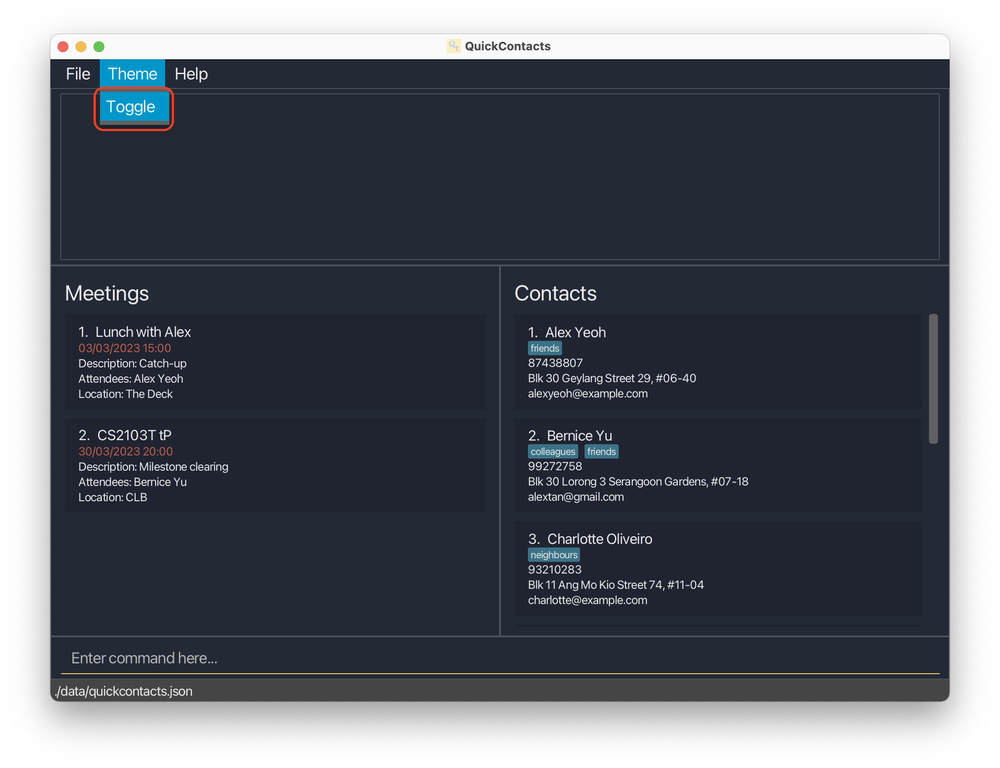

<!---
Overall structure of this user guide is adapted from https://ay2223s1-cs2103t-t12-2.github.io/tp/UserGuide.html
--->

## About QuickContacts

QuickContacts is a **contacts and schedule management system** that enables you to track your contacts and manage your
schedule with ease! As a busy individual with a considerable number of contacts and meetings to attend, you can
**seamlessly save contact and meeting information** with QuickContacts. QuickContacts provides you with a **bird's eye
view of all your meetings**, making sure that you will never miss any of them again.

We, the developers at QuickContacts, understand the amount of time required to manage many contacts and maintaining a
schedule with many meetings with them. Perfect for individuals that are looking for efficiency, QuickContacts can be
used without having you to ever reach for your mouse. Complete with an **autocomplete assistance**, you can be assured
that your time spent managing your contacts and schedule is minimised!

<div markdown="block" class="alert alert-info">

**:bulb: Tip**<br>
For more details about QuickContacts' features, you may head over to the [Features](#features) section below!

</div>

QuickContacts is specially designed for:

* Seamless creation and management of contacts and meetings
* Users who have a large number of contacts and meetings
* Typists

This user guide provides a detailed documentation on QuickContacts and serves as an introduction on how to incorporate
QuickContacts into your daily workflow. From having QuickContacts installed to making the best use out of QuickContacts,
this user guide has everything you need. Head over to the [Getting started](#getting-started) section to get onboard!

## Table of Contents

* Table of Contents
{:toc}

--------------------------------------------------------------------------------------------------------------------

## Using this User Guide

Welcome to QuickContacts!

If you have yet to install QuickContacts, head over to the [Installation](#installation) section to install
QuickContacts.

### Icon Coloured Boxes

Throughout this user guide, you may observe coloured boxes that provide useful information with an icon on its top-left
indicating the type of information present.

<div markdown="block" class="alert alert-primary">

**:bulb: Tip**<br>
Tips empower you to make full use of QuickContacts.

</div>

<div markdown="block" class="alert alert-info">

**:information_source: Note**<br>
Notes are general information that gives you a better understand of QuickContacts.

</div>

<div markdown="block" class="alert alert-warning">

**:warning: Caution**<br>
Cautions are warnings for you to note when using QuickContacts.

</div>

## Installation

1. Ensure you have [Java 11](https://docs.oracle.com/en/java/javase/11/install/overview-jdk-installation.html) or above
   installed in your computer

2. Download the latest version of `quickcontacts.jar` from [here](https://github.com/AY2223S2-CS2103T-T11-2/tp/releases)

3. Copy the file to an empty folder you want to use as the _home folder_ for QuickContacts

4. Double-click on the downloaded `.jar` file to launch QuickContacts

And that's it! You are good to go with QuickContacts.

<div markdown="block" class="alert alert-primary">

**:bulb: Tip**<br>
QuickContacts is packaged with sample contacts and meetings. To delete the default data, simply execute the `clear`
command.

</div>

<div markdown="block" class="alert alert-warning">

**:warning: Caution**<br>
QuickContacts will generate default files in the same directory it is installed in on its first launch. Avoid
editing or deleting such files unless you know what you are doing!

</div>

--------------------------------------------------------------------------------------------------------------------

## Quick Reference Guide

This section will walk you through the essential parts of understanding and using QuickContacts in detail.

### User Interface Layout

Upon launching QuickContacts, you will be greeted by the following Graphical User Interface (GUI).


We can break the GUI into several parts:

1. **Menu Bar**: This is where you find auxiliary features
2. **Result Display Box**: This is where you get feedback from the command executed
3. **Meetings List**: This is where you view all your meetings
4. **Contacts List**: This is where you view all your contacts
5. **Command Box**: This is where you input commands to interact with QuickContacts

### Command Format

QuickContacts provides a powerful Command Line Interface (CLI) which rely heavily on commands. In this
subsection, we will discover how the commands are designed.

#### Prefix

Prefixes are placeholders in a command that uniquely identify different input parameters. Each prefix is
_typically_ followed by the corresponding input data.

<div markdown="block" class="alert alert-info">

**:information_source: Note**<br>

* There are some input parameters that do not require any corresponding input data.
* There are some input data that share the same prefix. For example: `CONTACT_PHONE_NUMBER` and `MEETING_ATTENDEE`
  share the same prefix `p/`.

</div>

| Prefix   | Corresponding Input Data                     |
|----------|----------------------------------------------|
| `a/`     | `CONTACT_ADDRESS`                            |
| `des/`   | `MEETING_DESCRIPTION`                        |
| `dt/`    | `MEETING_DATE_TIME`                          |
| `e/`     | `CONTACT_EMAIL`                              |
| `end/`   | `MEETING_EXPORT_END_DATE`                    |
| `f/`     | -                                            |
| `l/`     | `MEETING_LOCATION`                           |
| `m/`     | `MEETING_TITLE`                              |
| `n/`     | `CONTACT_NAME`                               |
| `p/`     | `CONTACT_PHONE_NUMBER` or `MEETING_ATTENDEE` |
| `start/` | `MEETING_EXPORT_START_DATE`                  |
| `t/`     | `CONTACT_TAG`                                |

#### Understanding Commands

Now that we are familiar with the prefixes and corresponding input data, let us put them together and see how
a command works. Take the following as an example:

Command: `add n/CONTACT_NAME [p/CONTACT_PHONE_NUMBER] [e/CONTACT_EMAIL] [a/CONTACT_ADDRESS] [t/CONTACT_TAG]...`

| Command Component                                                                                     | Component Type  | Description                                                     |
|-------------------------------------------------------------------------------------------------------|-----------------|-----------------------------------------------------------------|
| `add`                                                                                                 | Command Keyword | Represents the action executed by QuickContacts                 |
| `n/`, `p/`, `e/`, `a/`, `t/`                                                                          | Prefix          | Uniquely identifies the corresponding input data                |
| `CONTACT_NAME`<br/>`CONTACT_PHONE_NUMBER`<br/>`CONTACT_EMAIL`<br/>`CONTACT_ADDRESS`<br/>`CONTACT_TAG` | Input Data      | Placeholders for the actual data to be supplied for the command |

<div markdown="block" class="alert alert-info">

**:information_source: Note**

* `[]` means that the parameter is **optional**.
* `...` means that the parameter can be **supplied multiple times** in the same command input.

</div>

A valid executable command of this example form is:

`add n/Noah t/friend t/nus t/cs2103t`

The above command would create a new contact with the name `Noah` and tags `friend`, `nus` and `cs2103t`.
The phone number, email address and address of `Noah` will be left empty as they are not provided.

<div markdown="block" class="alert alert-primary">

**:bulb: Tip**<br>
Command prefixes can be specified in any order. For example: `add t/friend t/nus n/Noah t/cs2103t` is equivalent to our
example above.

</div>

<div markdown="block" class="alert alert-info">

**:information_source: Note:**

* If a parameter is expected only once in the command, but you specified it multiple times, only the last occurrence of
  the parameter will be taken.<br>e.g. if you specify `n/Noah n/Peter`, only `n/Peter` will be taken.
* Extraneous parameters for commands that do not take in parameters (such as `help`, `list`, `exit` and `clear`) will
  be ignored.<br>e.g. `help 123` will be interpreted as `help`.

</div>

### Date and Time Formats

QuickContacts allow for various date and time formats to be inputted for commands that takes them in as arguments, for
example [`addm`](#adding-a-meeting--addm). Below, we can find the valid date and time formats.

<div markdown="block" class="alert alert-primary">

**:bulb: Tip**<br>
Date and time formats can be mixed and matched. For example, `ddMMyyyy HHmm`.

</div>

#### Date Formats

|   | Date Format | Example    | Meaning                         |
|---|-------------|------------|---------------------------------|
| 1 | ddMMyyyy    | 01012023   | 1st January 2023                |
| 2 | dd-MM-yyyy  | 01-01-2023 | 1st January 2023                |
| 3 | dd.MM.yyyy  | 01.01.2023 | 1st January 2023                |
| 4 | dd/MM/yyyy  | 01/01/2023 | 1st January 2023                |
| 5 | ddMM        | 0101       | 1st January of the current year |

<div markdown="block" class="alert alert-info">

**:information_source: Note:**

* `dd` refers to the date represented with 2 digits (e.g. `01` for the first day of the month instead of `1`)
* `MM` refers to the month represented with 2 digits (e.g. `08` for August instead of `8`)
* `yyyy` refers to the year represented with 4 digits (e.g. `2023` instead of `23`)

</div>

<div markdown="block" class="alert alert-primary">

**:bulb: Tip**<br>
`ddMM` is a quick way to specify a date of the current year without needing the year. For example, specifying `0101`
in year 2023 is the same as `01012023`.

</div>

#### Time Formats

|   | Time Format | Example |
|---|-------------|---------|
| 1 | HHmm        | 0100    |
| 2 | HH:mm       | 01:00   |
| 3 | HH.mm       | 01.00   |
| 4 | hmma        | 100AM   |
| 5 | h:mma       | 1:00AM  |
| 5 | h.mma       | 1.00AM  |

<div markdown="block" class="alert alert-info">

**:information_source: Note:**

* `HH` refers to the hour in 24-hour time format represented with 2 digits (e.g. `00` for 12 midnight instead of `1`)
* `h` refers to the hour in 12-hour time format represented with 1 or 2 digits (e.g. `1` for 1 o'clock, `12` for 12
  o'clock)
* `mm` refers to the minute represented with 2 digits (e.g. `01` for the first minute instead of `1`)
* `a` represents `AM` or `PM` for 12-hour time format

</div>

## Features

Here, you may find all the details about every feature that QuickContacts provide to empower you to
make full use of the power of QuickContacts.

### Autocomplete inputs

Simply hit the `TAB` key on your keyboard when you are entering a certain command to have QuickContacts autocomplete the
next nearest command word similar to the one you are typing!

Examples:

* `a` -> `add` after hitting `TAB` (since `add` is the next most similar command word)
* `ex` -> `export` after hitting `TAB`

Autocompletion also works for the next possible prefix for a given command! This way, you will never have to memorise
any prefix nor syntax for commands.

Examples:

* `add` -> `add n/` after hitting `TAB` (since `n/` is the next prefix for `add`)
* `add n/Bobby` -> `add n/Bobby p/` after hitting `TAB` (since `p/` is the next prefix for `add` after `n/`)

<div markdown="block" class="alert alert-primary">

**:bulb: Tip**<br>
Prefix autocomplete behaviour defers from commands to enhance user experience. For example:<br>
* `edit 1 n/` -> `edit 1 p/` after hitting `TAB` (if you did not input anything for the prefix `n/`, it would be probable
that you do not want to edit that field)

</div>

### Traversing commands

Have you ever wanted to input commands similar to one that you have just inputted? With command traversal provided in
QuickContacts, you will **never** have to copy and paste commands ever again.

All you have to do is to hit the `UP` and `DOWN` arrow keys on your keyboard to go to the previous and next command
respectively. It is as simple as that!



## Person-Related Commands

In this subsection, you may find all the commands that are related to contacts.

### Adding a person: `add`

Adds a person to the address book.

- The name of a person is case-sensitive, thus `John Doe` and `john doe` are considered different persons.

Format: `add n/CONTACT_NAME [p/CONTACT_PHONE_NUMBER] [e/CONTACT_EMAIL] [a/CONTACT_ADDRESS] [t/CONTACT_TAG]...`

<div markdown="span" class="alert alert-primary">:bulb: **Tip:**
A person can have any number of tags (including 0)
</div>

<div markdown="block" class="alert alert-warning">
**:warning: Caution**<br>
Tags of more than 10 characters are unsupported! UI artifacts may occur.
</div>

Examples:

* `add n/John Doe p/98765432 e/johnd@example.com a/John street, block 123, #01-01`
* `add n/Betsy Crowe t/friend e/betsycrowe@example.com a/Newgate Prison p/1234567 t/criminal`

### Listing all persons : `list`

Shows a list of all persons in the address book.

Format: `list`

### Editing a person : `edit`

Edits an existing person in the address book.

Format: `edit INDEX [n/CONTACT_NAME] [p/CONTACT_PHONE_NUMBER] [e/CONTACT_EMAIL] [a/CONTACT_ADDRESS] [t/CONTACT_TAG]...`

* Edits the person at the specified `INDEX`. The index refers to the index number shown in the displayed person list.
  The index **must be a positive integer** 1, 2, 3, …​
* At least one of the optional fields must be provided.
* Existing values will be updated to the input values.
* When editing tags, the existing tags of the person will be removed i.e adding of tags is not cumulative.
* You can remove all the person’s tags by typing `t/` without
  specifying any tags after it.

Examples:

* `edit 1 p/91234567 e/johndoe@example.com` Edits the phone number and email address of the 1st person to be `91234567`
  and `johndoe@example.com` respectively.
* `edit 2 n/Betsy Crower t/` Edits the name of the 2nd person to be `Betsy Crower` and clears all existing tags.

### Finding persons by name : `find`

Finds persons whose names contain any of the given keywords.

Format: `find KEYWORD [MORE_KEYWORDS]`

* The search is case-insensitive. e.g `hans` will match `Hans`
* The order of the keywords does not matter. e.g. `Hans Bo` will match `Bo Hans`
* Only the name is searched.
* Only full words will be matched e.g. `Han` will not match `Hans`
* Persons matching at least one keyword will be returned (i.e. `OR` search).
  e.g. `Hans Bo` will return `Hans Gruber`, `Bo Yang`

Examples:

* `find John` returns `john` and `John Doe`
* `find alex david` returns `Alex Yeoh`, `David Li`<br>
  

### Deleting a person : `delete`

Deletes the specified person from the address book.

Format: `delete INDEX`

* Deletes the person at the specified `INDEX`.
* The index refers to the index number shown in the displayed person list.
* The index **must be a positive integer**: 1, 2, 3...

Examples:

* `list` followed by `delete 2` deletes the 2nd person in the address book.
* `find Betsy` followed by `delete 1` deletes the 1st person in the results of the `find` command.

### Exporting of contact : `export`

* Exports the persons at the specified `INDEX`es.
* The index refers to the index number shown in the displayed person list.
* The index **must be a positive integer**: 1, 2, 3...

Format: `export p/INDEX [p/MORE_INDEXES]...`

### Importing of contacts : `import`

* Imports the persons in the provided JSON.
* The JSON **must contain a valid array of persons**

Example:

```json
[
  {
    "name": "Alice Pauline",
    "phone": "94351253",
    "email": "alice@example.com",
    "address": "123, Jurong West Ave 6, #08-111",
    "tagged": [
      "friends"
    ]
  },
  {
    "name": "Benson Meier",
    "phone": "98765432",
    "email": "johnd@example.com",
    "address": "311, Clementi Ave 2, #02-25",
    "tagged": [
      "owesMoney",
      "friends"
    ]
  }
]
```

<div markdown="block" class="alert alert-primary">

**:bulb: Tip**<br>
You can append `f/` to force import regardless of duplicate values.

</div>

<div markdown="block" class="alert alert-info">

**:information_source: Note**<br>
`f/` will be your last argument, if added.

Duplicate values will still be ignored, but you can be assured the value is added if it did not exist before.
</div>

Format: `import JSON [f/]`

## Meeting-Related Commands

In this subsection, you may find all the commands that are related to meetings.

### Adding a Meeting : `addm`

Adds a meeting to the address book.

Format: `addm m/MEETING_TITLE dt/MEETING_DATE_TIME [p/MEETING_ATTENDEE]... [l/MEETING_LOCATION] [des/MEETING_DESCRIPTION]`

Constraints:

* `MEETING_DATE_TIME` must be provided in the format as shown [here](#date-and-time-formats).
* `MEETING_ATTENDEE` must be a valid contact in the address book.

Examples:

* `addm m/CS2103T Tutorial p/John Doe p/Jane Doe dt/04-01-2023 10:00 l/COM1-B103 des/CS2103T Tutorial`
* `addm m/CS2103T Tutorial p/John Doe p/Mary Jane dt/04-01-2023 22:22 l/COM1-B103 des/CS2101 Tutorial`

### Editing a Meeting : `editm`

Edits an existing meeting in the meeting book.

Format: `editm INDEX [m/MEETING_TITLE] [p/MEETING_ATTENDEE]... [dt/MEETING_DATE_TIME] [l/MEETING_LOCATION] [des/MEETING_DESCRIPTION]`

* Edits the meeting at the specified `INDEX`. The index refers to the index number shown in the displayed meeting list.
  The index **must be a positive integer** 1, 2, 3,...
* At least one of the optional fields must be provided.
* Existing values will be updated to the input values.
* `MEETING_DATE_TIME` must be provided in the format as defined [here](#date-and-time-formats).

Example:

* `editm 1 m/Project Update dt/04-01-2023 10:00`  Edits the date/time first meeting to be on `04-01-2023 10:00`, and
  changes its title to `Project Update`.

### Sorting Meetings : `sortm`

Sorts meetings in the currently displayed address book by a specified attribute, in **ascending** order.

Format: `sortm ATTRIBUTE [r]`

* Sorts the meetings in the address book by the specified `ATTRIBUTE`:

| Prefix | ATTRIBUTE     |
|--------|---------------|
| `m/`   | Meeting Title |
| `dt/`  | Date/Time     |
| `l/`   | Location      |
| `des/` | Description   |

* If the `r` option is included, the meetings will be sorted in reverse(descending) order.
* Meetings with the same value for the specified attribute will be sorted by date/time in ascending order.
* Example: `sortm m/` sorts meetings by title in ascending order.
* Example: `sortm dt/r` sorts meetings by date/time in descending order.

### Finding Meetings by Attendee Name : `findm`

Find meetings whose names contain any of the given keywords.

Format: `findm KEYWORD [MORE_KEYWORDS]`

* The search is case-insensitive. e.g. `hans` will match `Hans`
* Space is delimiter, so if you search `John Doe` it will list all people with either `John` or `Doe` in their name.
* Only the name of attendees in meeting are searched
* Only full words will be matched e.g. `Han` will not match `Hans`
* Meetings matching at least one keyword will be returned (i.e. `OR` search).
  e.g. `John Doe` will return Meetings that contain either `John Doe`, or `Doe John`

Examples:

* `findm John` returns `Meeting` that contains `attendees` whose Name contains `John`
* `findm John Mary` returns `Meeting` that contains `attendees` whose Name contains `John` or `Mary`

### View all Meetings : `findm` without arguments

Shows a list of all meetings in the meeting book.

Format: `findm`

* No parameters are required.
* If arguments are given, will instead behave like as stated [here](#finding-meetings-by-attendee-name--findm)

### Export Meetings : `exportm`

Exports the meetings at the specified `INDEX`es and between `start` and `end` dates.
* If only START_DATE provided, meetings after START_DATE, inclusive, will be exported
* If only END_DATE is provided, meetings after END_DATE, inclusive, will be exported
* If both are provided, meetings between the two dates, inclusive, will be exported
* Regardless of the above, meetings at provided INDEXes will be provided
* At least one of the parameters must be provided
* The indexes refer to the index numbers shown in the displayed meetings list.
* The indexes **must be positive integers** 1, 2, 3
* The start and end dates must be valid dates in the DD/MM/YY format

Format: `exportm p/INDEX [p/MORE_INDEXES]... [start/MEETING_EXPORT_START_DATE] [end/MEETING_EXPORT_END_DATE]`

Example: `exportm start/01/01/23 m/1` will export the first meeting and any meetings starting from 01/01/23

### Import Meetings : `importm`

* Imports the meetings in the provided JSON.
* The JSON **must contain a valid array of meetings**

Example:

```json
[
  {
    "title": "Dinner with Alice",
    "dateTime": "01/02/2023 19:00",
    "attendees": [
      {
        "name": "Alice Pauline",
        "phone": "94351253",
        "email": "alice@example.com",
        "address": "123, Jurong West Ave 6, #08-111",
        "tagged": [
          "friends"
        ]
      }
    ],
    "location": "NUS",
    "description": "Weekly catchup"
  },
  {
    "title": "Study session with Benson and Carl",
    "dateTime": "02/03/2023 15:00",
    "attendees": [
      {
        "name": "Benson Meier",
        "phone": "98765432",
        "email": "johnd@example.com",
        "address": "311, Clementi Ave 2, #02-25",
        "tagged": [
          "owesMoney",
          "friends"
        ]
      },
      {
        "name": "Carl Kurz",
        "phone": "95352563",
        "email": "heinz@example.com",
        "address": "wall street",
        "tagged": []
      }
    ],
    "location": "Central Library",
    "description": "Study for finals"
  },
  {
    "title": "Zoom meeting for agenda planning",
    "dateTime": "13/03/2023 12:45",
    "attendees": [
      {
        "name": "Alice Pauline",
        "phone": "94351253",
        "email": "alice@example.com",
        "address": "123, Jurong West Ave 6, #08-111",
        "tagged": [
          "friends"
        ]
      }
    ],
    "location": "https://us02web.zoom.us/j/99999999999?pwd=ABCdEfGHiJkYkRuYW5WTLmNopQrSt12",
    "description": "Plan for project work"
  }
]


```

Optional Parameter `f/` that forces imports regardless of duplicate values. `f/` does not take any values.

Format: `importm JSON f/`

### Delete Meetings : `delm`

Deletes the specified meeting.

Format: `delm INDEX`

* Deletes the meeting at the specified `INDEX`.
* The index refers to the index number shown in the displayed meetings list.
* The index **must be a positive integer**: 1, 2, 3...

Examples:

* `findm` followed by `delm 2` deletes the 2nd meeting.

### Marking Meetings as done or undone : `mark` or `unmark`

Marks the specified meetings as either done or undone.


Format: `mark m/INDEX [m/INDEXES]...` or `unmark m/INDEX [m/INDEXES]...`

* The index refers to the index number shown in the displayed meetings list.
* The index **must be a positive integer**: 1, 2, 3...

<div markdown="block" class="alert alert-info">

**:information_source: Note**<br>
Meetings marked as done will have green colored titles.

</div>

### Showing pending meetings : `pending`

<div markdown="block" class="alert alert-info">

**:bulb: Tip**<br>
To view all meetings, use `findm` with no parameters.

</div>

Shows meetings that are not marked as done and those that are in the future i.e not over yet.

Format: `pending`

## General Features

### Theme toggling

Toggles the theme from dark to light or vice versa.


### Viewing help : `help`

Shows a message explaining how to access the help page.


Format: `help`

### Clearing all entries : `clear`

Clears all entries from the address book.

Format: `clear`

### Saving the data

QuickContacts data are saved in the hard disk automatically after any command that changes the data. There is no need to
save manually.

### Editing the data file

QuickContacts data are saved as a JSON file `[JAR file location]/data/quickcontacts.json`. Advanced users are welcome to
update data directly by editing that data file.

<div markdown="span" class="alert alert-warning">:exclamation: **Caution:**
If your changes to the data file makes its format invalid, QuickContacts will discard all data and start with an empty data file at the next run.
</div>

### Exiting the program : `exit`

Exits the program.

Format: `exit`

--------------------------------------------------------------------------------------------------------------------

## FAQ

**Q**: How do I transfer my data to another Computer?<br>
**A**: Install the app in the other computer and overwrite the empty data file it creates with the file that contains
the data of your previous QuickContacts home folder.

--------------------------------------------------------------------------------------------------------------------

## Command summary

| Action                       | Format, Examples                                                                                                                                                                                                     |
|------------------------------|----------------------------------------------------------------------------------------------------------------------------------------------------------------------------------------------------------------------|
| **Create a contact**         | `add n/CONTACT_NAME [p/CONTACT_PHONE_NUMBER] [e/CONTACT_EMAIL] [a/CONTACT_ADDRESS] [t/CONTACT_TAG]...` <br> e.g., `add n/James Ho p/22224444 e/jamesho@example.com a/123, Clementi Rd, 1234665 t/friend t/colleague` |
| **Reset all data**           | `clear`                                                                                                                                                                                                              |
| **Delete a contact**         | `delete INDEX`<br> e.g., `delete 3`                                                                                                                                                                                  |
| **Edit a contact**           | `edit INDEX [n/CONTACT_NAME] [p/CONTACT_PHONE_NUMBER] [e/CONTACT_EMAIL] [a/CONTACT_ADDRESS] [t/CONTACT_TAG]...`<br> e.g.,`edit 2 n/James Lee e/jameslee@example.com`                                                 |
| **Find a contact**           | `find KEYWORD [MORE_KEYWORDS]`<br> e.g., `find James Jake`                                                                                                                                                           |
| **List all contacts**        | `list`                                                                                                                                                                                                               |
| **Help**                     | `help`                                                                                                                                                                                                               |
| **Create a meeting**         | `addm m/MEETING_TITLE dt/MEETING_DATE_TIME [p/MEETING_ATTENDEE]... [l/MEETING_LOCATION] [des/MEETING_DESCRIPTION]`                                                                                                   |
| **Edit a meeting**           | `editm INDEX [m/MEETING_TITLE] [dt/MEETING_DATE_TIME] [p/MEETING_ATTENDEE]... [l/MEETING_LOCATION] [des/MEETING_DESCRIPTION]`                                                                                        |
| **Find a meeting**           | `findm KEYWORD [MORE_KEYWORDS]` <br> e.g, `findm James Jake`                                                                                                                                                         |
| **List all meetings**        | `findm`                                                                                                                                                                                                              |
| **Mark meeting as done**     | `mark m/INDEX [m/MORE_INDEXES]...`                                                          <br/>                        <br/>                                                                                       |
| **Mark meeting as not done** | `unmark m/INDEX [m/MORE_INDEXES]...`                                                        <br/>            <br/>                                                                                                   |
| **View pending Meetings**    | `pending`                                                                                                                                                                                                            |                                                                                                                                                                                                           
| **Delete a meeting**         | `delm INDEX` <br> e.g., `delm 3`                                                                                                                                                                                     |
| **Export a contact**         | `export p/INDEX [p/MORE_INDEXES]...` <br> e.g., `export p/1 p/2 p/3`                                                                                                                                                 |
| **Export a meeting**         | `exportm m/INDEX [m/MORE_INDEXES]...` <br> e.g., `exportm m/1 m/2 m/3`                                                                                                                                               |
| **Import a contact**         | `import VALID_JSON`                                                                                                                                                                                                  |
| **Import a meeting**         | `importm VALID_JSON`                                                                                                                                                                                                 |
| **Sort meetings**            | `sortm SORT_FIELD [r]` <br> e.g., `sortm dt/`                                                                                                                                                                        |
