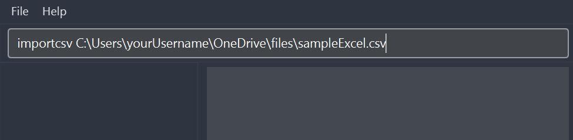
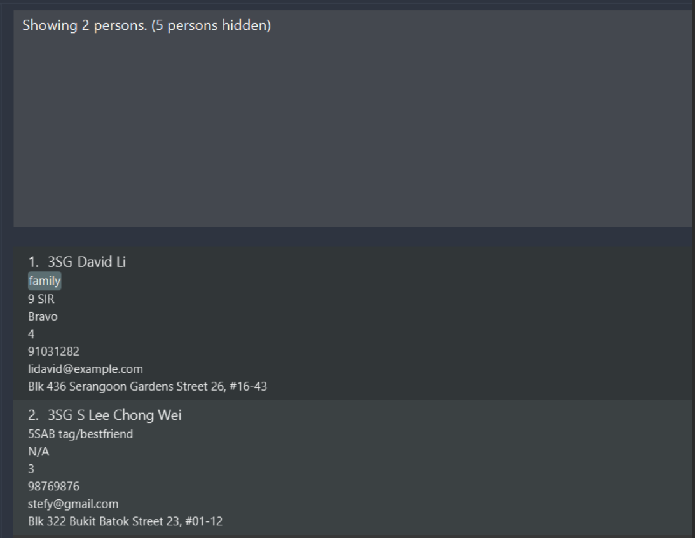
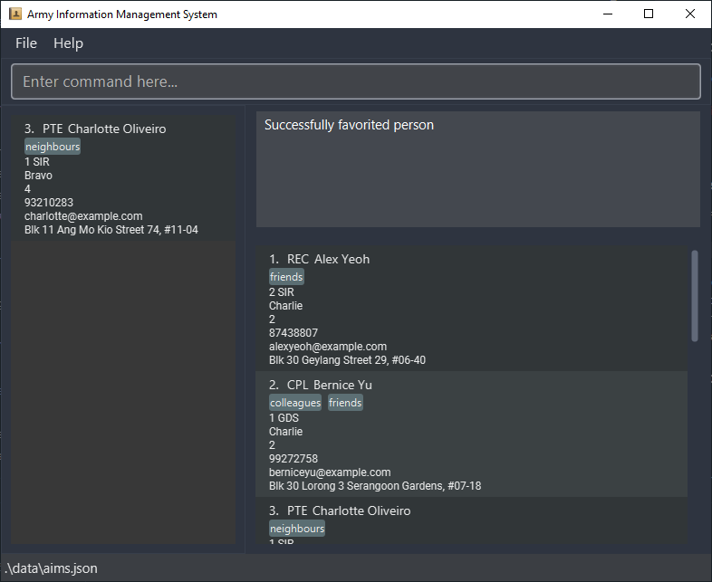

<!-- omit from toc -->
## **Table of Contents**

- [**Introduction**](#introduction)
  - [What is AIMS?](#what-is-aims)
  - [Our Mission](#our-mission)
  - [User Guide](#user-guide)
- [**Legend**](#legend)
- [**Quick Start**](#quick-start)
- [**Overview of AIMS GUI**](#overview-of-aims-gui)
- [**Features**](#features)
  - [Viewing help : `help`](#viewing-help--help)
  - [Adding a person : `add`](#adding-a-person--add)
  - [Importing multiple persons from a CSV file : `importcsv`](#importing-multiple-persons-from-a-csv-file--importcsv)
  - [Listing all persons : `list`](#listing-all-persons--list)
  - [Copying information to clipboard : `copy`](#copying-information-to-clipboard--copy)
  - [Editing a person : `edit`](#editing-a-person--edit)
  - [Searching for persons by any field : `find`](#searching-for-persons-by-any-field--find)
  - [Searching for persons using filters on fields : `filter`](#searching-for-persons-using-filters-on-fields--filter)
  - [Deleting a person : `delete`](#deleting-a-person--delete)
  - [Clearing all entries : `clear`](#clearing-all-entries--clear)
  - [Undoing last modification : `undo`](#undoing-last-modification--undo)
  - [Viewing command history](#viewing-command-history)
  - [Toggling the favorite status of a person : `favorite`](#toggling-the-favorite-status-of-a-person--favorite)
  - [Exiting the program : `exit`](#exiting-the-program--exit)
  - [Saving the data](#saving-the-data)
  - [Editing the data file](#editing-the-data-file)
- [**FAQ**](#faq)
- [**Command Summary**](#command-summary)

---

## **Introduction**

### What is AIMS?

Army Information Management System (AIMS) is **the** desktop app built for army admin clerks, intended to make your life easier. With an emphasis on proper checking and validation of contact information fields, AIMS eradicates time wasted on dealing with erroneous data and ensures that contact information can be collected properly on the first try. AIMS is optimized for use via a **Command Line Interface** (**CLI**) while still having the benefits of a **Graphical User Interface** (**GUI**). If you can type fast, AIMS can get your contact management tasks done faster than traditional GUI apps.

### Our Mission

AIMS was designed to achieve **3 main objectives:**

1. Enable you to **quickly** and **easily** access the personal information of soldiers with simple to use [find](#searching-for-persons-by-any-field--find) and [filter](#searching-for-persons-using-filters-on-fields--filter) commands and an optimally placed [favorites](#toggling-the-favorite-status-of-a-person--favorite) sidebar.
2. Ensure that your data is **properly checked and validated** before storing it in AIMS.
3. Make your **transition** from other contact storage applications **as smooth as possible** through our [import CSV feature](#importing-multiple-persons-from-a-csv-file--importcsv).

### User Guide

This user guide shows you how to get started with using AIMS -- it has easy-to-understand explanations and examples to help you grasp its various features.

We hope that this user guide will help you adopt, learn and ultimately master AIMS. Mastering the use of AIMS will vastly improve your experience in tackling the administrative workflow of managing army personnel's contact information. For the best learning experience, we recommend leaving this guide open for reference during your first few uses of AIMS. Let's start your journey with AIMS today!

For a more technical and comprehensive overview of AIMS's codebase, please refer to our [Developer Guide](DeveloperGuide.md).

<br>

[Back to Top ↑](#table-of-contents)

---

## **Legend**

Here are some symbols used throughout the user guide to inform you of additional details.

:information_source: **Notes:** Notes aim to provide you with extra information.

:bulb: **Tip:** Tips are useful suggestions that you can follow.

:exclamation: **Caution:** Cautions are used as warnings for actions that may cause data loss.

<br>

[Back to Top ↑](#table-of-contents)

---

## **Quick Start**

1. Ensure you have Java `11` or above installed on your computer. If not, you can download it from [here](https://www.oracle.com/sg/java/technologies/javase/jdk11-archive-downloads.html).

1. Download the latest `aims.jar` from [here](https://github.com/AY2223S2-CS2103T-W10-3/tp/releases).

1. Copy the file to the folder you want to use as the *home folder* for AIMS.

1. Open a command terminal, `cd` into the folder you put the jar file in, and use the `java -jar aims.jar` command to run the application. A GUI similar to the below should appear in a few seconds. Note how the app contains some sample data.

   <div style="text-align: center;">
     
     <p style="font-style: italic;"><br>Default state of the app on startup</p>
     <br>
   </div>

1. Refer to the [Features](#features) section below for details of each command.

<br>

[Back to Top ↑](#table-of-contents)

---

## **Overview of AIMS GUI**


| UI Component          | Description                                                                                                              |
|-----------------------|--------------------------------------------------------------------------------------------------------------------------|
| Menu bar              | You can exit the app through File > Exit, or open the help window located under Help                                     |
| Command box           | You can enter commands here to interact with AIMS                                                                        |
| Message box           | You can view the result of your last command here (e.g., command ran successfully, syntax errors, etc.)                  |
| Favorites list        | You can view all your favorite contacts here                                                                             |
| Main list             | You can view a list of AIMS contacts here. If you perform a search, this list will update to show you the search results |
| Location of data file | This shows you the location of the AIMS data file should you ever need to migrate to another device                      |

[Back to Top ↑](#table-of-contents)

---

## **Features**

<div markdown="block" class="alert alert-info">

**:information_source: Notes about the command format:**

- Words in `UPPER_CASE` are the parameters to be supplied by you.<br>
  e.g. in `add n/NAME`, `NAME` is a parameter which can be used as `add n/John Doe`.

- Items in square brackets are **optional**.<br>
  e.g. `n/NAME [t/TAG]` can be used as `n/John Doe t/friend` or as `n/John Doe`.

- Items with `…` after them can be used multiple times including zero times.<br>
  e.g. `[t/TAG]…​` can be used as <code>&nbsp;</code> (i.e. 0 times), `t/friend`, `t/friend t/family` etc.

- You can give parameters in any order.<br>
  e.g. if the command specifies `n/NAME p/PHONE`, `p/PHONE n/NAME` is also acceptable.

- If a parameter is expected only once in the command, but you specified it multiple times, only the last occurrence of
  the parameter will be taken.<br>
  e.g. if you specify `p/12341234 p/56785678`, only `p/56785678` will be taken.

- Extraneous parameters for commands that do not take in parameters (such as `help`, `list`, `exit` and `clear`) will be
  ignored.<br>
  e.g. if the command specifies `help 123`, it will be interpreted as `help`.

</div>

### Viewing help : `help`

Shows you a message explaining how to access the help page.

<div markdown="span" class="alert alert-success">

Format: `help`

</div>

<div style="text-align: center;">
  
  <p style="font-style: italic;"><br>Dialog with instructions to navigate to the help page</p>
  <br>
</div>

[Back to Top ↑](#table-of-contents)

### Adding a person : `add`

Lets you add a person to AIMS.

<div markdown="span" class="alert alert-success">

Format: `add r/RANK n/NAME [u/UNIT] [c/COMPANY] [pl/PLATOON] p/PHONE e/EMAIL a/ADDRESS [t/TAG]…​`

</div>

<div markdown="span" class="alert alert-info">

:information_source: **Note:** You can have any number of tags for a person (including 0).

</div>

<br>

Examples:

- `add r/3SG n/Lawrence Tay u/1 GDS p/91649723 e/lawrencetay@gmail.com a/124 Drummond Street t/PlatoonSergeant t/AllergySeafood`

  Adds a new person named `Lawrence Tay` to AIMS with the information seen in the message box below. Optional fields that are left blank are recorded as `N/A`.

  <div style="text-align: center;">
    
    <p style="font-style: italic;"><br>Success screen upon successful addition of Lawrence Tay</p>
    <br>
  </div>

[Back to Top ↑](#table-of-contents)

### Importing multiple persons from a CSV file : `importcsv`

Lets you adds all persons from a given valid CSV (Comma-Separated Values) file to AIMS. Excel and Google spreadsheets can be easily converted into CSV files for quick importing.

<div markdown="span" class="alert alert-success">

Format: `importcsv PATH_TO_CSV_FILE`

</div>

The given CSV file must fulfill the following conditions:

1. The file given must end in `.csv`.
2. Each row in the CSV file must have the same number of columns.
3. The first row of the CSV file must be reserved for headers.
4. Each field (namely `rank`, `name`, `unit`, `company`, `platoon`, `phone`, `email`, `address`, `tags`) must appear exactly once in the headers.
5. Each header in the CSV file can appear in any order (except `tag` which must be the last header).
6. Each row in the CSV file must not have blank entries for the `rank`, `name`, `phone`, `email` and `address` fields.
7. If a person has more than one tag, the tags must all be listed in different columns (see the step-by-step example below).

<br>

Step-by-step example of converting and importing an Excel spreadsheet:

1. Ensure that Excel sheet passes conditions 4 to 6 above. It should look something like this:

   <div style="text-align: center;">
     
     <p style="font-style: italic;"><br>Excel sheet containing contact information in the correct format</p>
     <br>
   </div>

1. Click on "Save As" and save the Excel sheet as a CSV file. Take note where the saved file is located in your computer.

   <div style="text-align: center;">
     
     <p style="font-style: italic;"><br>Saving Excel sheet as a CSV file</p>
     <br>
   </div>

1. Find the new CSV file in your computer and copy its path.

   <div style="text-align: center;">
     
     <p style="font-style: italic;"><br>Copying the path to the new CSV file</p>
     <br>
   </div>

1. Open AIMS. Into the command box input `importcsv` followed by pasting the path to the CSV file. Remove any inverted commas at the front and end of the path that might be added by copy and pasting.

   <div style="text-align: center;">
     
     <p style="font-style: italic;"><br>Entering ImportCsv Command into AIMS</p>
     <br>
   </div>

1. Make changes based on any error messages received. For example, if there is an issue with phone numbers, you have to make sure that the Excel file you want to import has no empty entries or invalid characters (i.e. spaces, alphabets, any other non-numeric characters)

   <div style="text-align: center;">
     
     <p style="font-style: italic;"><br>Responding to error messages</p>
     <br>
   </div>

1. You should see the following screen if you are successful!

   <div style="text-align: center;">
     
     <p style="font-style: italic;"><br>Success message!</p>
     <br>
   </div>

[Back to Top ↑](#table-of-contents)

### Listing all persons : `list`

Shows you a list of all existing persons in AIMS.

<div markdown="span" class="alert alert-success">

Format: `list`

</div>

<br>

[Back to Top ↑](#table-of-contents)

### Copying information to clipboard : `copy`

Copies the information of a person to your clipboard.

<div markdown="span" class="alert alert-success">

Format: `copy INDEX [r/RANK] [n/NAME] [u/UNIT] [c/COMPANY] [pl/PLATOON] [p/PHONE] [e/EMAIL] [a/ADDRESS] [t/TAG]`

</div>

- Copies the required information of the person at the specified `INDEX` to the user's clipboard.
- The index refers to the index number shown in the displayed main list.
- The index **must be a positive integer** 1, 2, 3, …​
- To only copy certain fields, you just need to type its prefix. (e.g. To only copy the name of a person, type `copy INDEX n/`)
- If no fields are specified, all information will be copied.

<div markdown="span" class="alert alert-info">

:information_source: **Note:** If AIMS fails to access your clipboard, the information will be displayed in the result
display box instead. You can then highlight the text using your mouse and copy it to your clipboard by using `Ctrl + C`
on Windows/Linux or `Command + C` on Mac. The display window is extendable if you find that more space is required to
see all the text.

</div>

<div markdown="span" class="alert alert-primary">

:bulb: **Tip:** You can use `find`/`filter` to find a person first before using `copy`!

</div>

<br>

Examples:

- `copy 2`

  If your clipboard is accessible, a success message will be displayed.

  <div style="text-align: center;">
    
    <p style="font-style: italic;"><br>Success screen upon successful copying of information to clipboard</p>
    <br>
  </div>

  The following text will be copied into your clipboard.

  ```text
  Rank: CPL
  Name: Bernice Yu
  Unit: 1 GDS
  Company: Charlie
  Platoon: 2
  Phone: 99272758
  Email: berniceyu@example.com
  Address: Blk 30 Lorong 3 Serangoon Gardens, #07-18
  Tags: [colleagues][friends]
  ```

  <br>

- `copy 2`

  If your clipboard is not accessible, the information will be displayed in the message box which can be manually selected and copied.

  <div style="text-align: center;">
    
    <p style="font-style: italic;"><br>Screen when the AIMS detects that the clipboard is not accessible</p>
    <br>
  </div>

[Back to Top ↑](#table-of-contents)

### Editing a person : `edit`

Lets you edit an existing person in AIMS.

<div markdown="span" class="alert alert-success">

Format: `edit INDEX [r/RANK] [n/NAME] [u/UNIT] [c/COMPANY] [pl/PLATOON] [p/PHONE] [e/EMAIL] [a/ADDRESS] [t/TAG]…​`

</div>

- Edits the person at the specified `INDEX`.
- The index refers to the index number shown in the displayed main list.
- The index **must be a positive integer** 1, 2, 3, …​
- At **least** one of the optional fields must be provided.
- Existing values will be updated to the input values.
- When editing tags, the existing tags of the person will be removed. (i.e. adding of tags is not cumulative)
- You can remove all the person's tags by typing `t/` without specifying any tags after it.

<br>

Examples:

- `edit 1 p/91234567 e/johndoe@example.com` <br>
  Edits the phone number and email address of the 1st person in the existing main list to be `91234567`and `johndoe@example.com` respectively.

- `edit 2 n/Betsy Crower t/`<br>
  Edits the name of the 2nd person in the existing main list to be `Betsy Crower` and clears all existing tags.

<br>

[Back to Top ↑](#table-of-contents)

### Searching for persons by any field : `find`

Lets you find persons who have any fields that contain any of the given keywords.

<div markdown="span" class="alert alert-success">

Format: `find KEYWORD [MORE_KEYWORDS]`

</div>

- The search is case-insensitive. (e.g `hans` will match `Hans`)
- Keywords cannot contain spaces. Instead, spaces are used to separate keywords.
- The order of the keywords does not matter. (e.g. `Hans Bo` will match `Bo Hans`)
- All fields (`rank`, `name`, `unit`, `company`, `platoon`, `phone`, `email`, `address`, `tags`) are searched.
- Only part of a field is needed for a successful match. (e.g. `tani` will match `Botanic Gardens`)
- Persons matching at least one keyword will be returned. (e.g. `Hans Bo` will return `Hans Gruber`, `Bo Yang` and `Bo Hans`)

<br>

Example:

- When running `find live delta`, 3 persons will be found:
  - `Charlotte Oliveiro` (name matches `live`)
  - `Irfan Ibrahim` (email matches `live`)
  - `Roy Balakrishnan` (company matches `delta`)

    <div style="text-align: center;">
      
      <p style="font-style: italic;"><br>Screen showing the result of finding 3 persons using partial keyword matching</p>
      <br>
    </div>

[Back to Top ↑](#table-of-contents)

### Searching for persons using filters on fields : `filter`

Lets you filter all persons to only show those whose fields contain **all** the given keywords.

<div markdown="span" class="alert alert-success">

Format: `filter [r/RANK] [n/NAME] [u/UNIT] [c/COMPANY] [p/PLATOON] [p/PHONE] [e/EMAIL] [a/ADDRESS] [t/TAG]…​`

</div>

- The search is case-insensitive. (e.g. `hanS` will match `Hans`)
- The order of the keywords does not matter. (e.g. `n/Hans r/3sg` will match `r/3sg n/Hans`)
- Only persons matching all keywords will be returned. (i.e. `AND` search)
- If multiple keywords for the same field are provided, only the last keyword for that field will be used. (i.e. `r/3sg r/cpl` has the same result as `r/cpl`)
- Only part of a field is needed for a successful match. (e.g. `tanic g` will match `Botanic Gardens`)
- At **least** one of the optional fields must be provided.

<br>

Example:

- `filter a/street r/sg`

  2 persons named `David Li` and `S Lee Chong Wei`, both with an address that contains `street` and a rank that contains `sg` will be shown.

  <div style="text-align: center;">
    
    <p style="font-style: italic;"><br>Screen showing the results of filtering by address and rank</p>
    <br>
  </div>

[Back to Top ↑](#table-of-contents)

### Deleting a person : `delete`

Lets you delete a specified person from AIMS.

<div markdown="span" class="alert alert-success">

Format: `delete INDEX`

</div>

- Deletes the person at the specified `INDEX`.
- The index refers to the index number shown in the displayed main list.
- The index **must be a positive integer** 1, 2, 3, …​

<br>

Examples:

- `list` followed by `delete 2`<br>
  The 2nd existing person in the main list will be deleted.

- `find Betsy` followed by `delete 1`<br>
  The 1st person in the main list of the `find` command will be deleted.

<br>

[Back to Top ↑](#table-of-contents)

### Clearing all entries : `clear`

Lets you clear all existing entries in AIMS.

<div markdown="span" class="alert alert-success">

Format: `clear`

</div>

<br>

[Back to Top ↑](#table-of-contents)

### Undoing last modification : `undo`

Lets you undo the last modification done to AIMS. However, commands like `list`, `find` and `filter` that **do not** modify
AIMS are not recorded in the undo history.

<div markdown="block" class="alert alert-warning">

:exclamation: **Caution:** Once AIMS is closed, the undo history will be lost.

</div>

<div markdown="span" class="alert alert-success">

Format: `undo`

</div>

<br>

[Back to Top ↑](#table-of-contents)

### Viewing command history

You can view the history of previously run commands and re-run them as needed -- this saves you from having to retype
the entire command again. To view the command history, in the command box, press the up arrow (`↑`) on your keyboard to
view an earlier command and the down arrow (`↓`) on your keyboard to view a later command.

- The command that you've entered into the command box before viewing the command history will be saved temporarily --
  you can navigate back to it by pressing the down arrow (`↓`) multiple times.
- If you're already at the *earliest* command, pressing the up arrow (`↑`) will move the cursor to the *beginning* of
  the text in the command box instead.
- If you're already at the *latest* command, pressing the down arrow (`↓`) will move the cursor to the *end* of the text
  in the command box instead.
- At any point in the command history, you can simply edit the command and re-run it. Note that once you navigate away
  from this point in the command history, the changes you've made to this current command in history will be lost.
- The command history file is located at `[JAR file location]/data/command_history.txt`. Whenever you run a command **successfully**, the command history file will be automatically updated. In other words, commands that fail to run due to syntax errors or otherwise will **not** be recorded in the command history.

<br>

[Back to Top ↑](#table-of-contents)

### Toggling the favorite status of a person : `favorite`

Lets you toggle the favorite status of a person from AIMS.

<div markdown="span" class="alert alert-success">

Format: `favorite INDEX`

</div>

- Toggles favorite status for the person at the specified `INDEX`.
- If the command is run on a person who is not in the favorite list, he will be added to the favorite list.
- If the command is run on a person who is already in the favorite list, he will be removed from the favorite list.
- The index refers to the index number shown in the displayed main list.
- The index **must be a positive integer** 1, 2, 3, …​
- The favorites list on the sidebar is sorted according to the index number of the persons that is shown after running the `list` command.

<div markdown="span" class="alert alert-primary">

:bulb: **Tip:** You can use `find`/`filter` to find a person first before using `favorite`!

</div>

<br>

Example:

- `favorite 3`

  The third person in the existing main list will be added to and pinned in the favorites list.

  <div style="text-align: center;">
    
    <p style="font-style: italic;"><br>Screen showing the result of favoriting person 3, causing the contact to be pinned to the sidebar</p>
    <br>
  </div>

[Back to Top ↑](#table-of-contents)

### Exiting the program : `exit`

Exit from AIMS.

<div markdown="span" class="alert alert-success">

Format: `exit`

</div>

<br>

[Back to Top ↑](#table-of-contents)

### Saving the data

AIMS data is saved in the hard disk automatically after any command that changes the data. There is no need for you to save manually.

<br>

[Back to Top ↑](#table-of-contents)

### Editing the data file

AIMS data is saved as a JSON file `[JAR file location]/data/aims.json`. Advanced users are welcome to update data
directly by editing that data file.

<div markdown="span" class="alert alert-warning">

:exclamation: **Caution:** If your changes to the data file makes its format invalid, AIMS will discard all data and
start with an empty data file in the next run.

</div>

<br>

[Back to Top ↑](#table-of-contents)

---

## **FAQ**

**Q**: How do I transfer my data to another computer?<br>
**A**: Install the app in the other computer and overwrite the empty data file it creates with the file that contains
the data of your previous AIMS home folder.

---

## **Command Summary**

| Action              | Format, Examples                                                                                                                                                                                                                    |
|---------------------|-------------------------------------------------------------------------------------------------------------------------------------------------------------------------------------------------------------------------------------|
| **Help**            | `help`                                                                                                                                                                                                                              |
| **Add**             | `add r/RANK n/NAME [u/UNIT] [c/COMPANY] [pl/PLATOON] p/PHONE e/EMAIL a/ADDRESS [t/TAG]…` <br> e.g., `add r/3SG n/James Ho u/9 SIR c/Charlie pl/1 p/22224444 e/jamesho@example.com a/123, Clementi Rd, 1234665 t/friend t/colleague` |
| **ImportCsv**       | `importcsv PATH_TO_CSV_FILE` <br> e.g., `importcsv C:\Users\myUsername\files\convertedExcel.csv`                                                                                                                                    |
| **List**            | `list`                                                                                                                                                                                                                              |
| **Copy**            | `copy INDEX [r/] [n/] [u/] [c/] [pl/] [p/] [e/] [a/] [t/]`<br> e.g., `copy 1 n/ e/ t/`                                                                                                                                              |
| **Edit**            | `edit INDEX [r/RANK] [n/NAME] [u/UNIT] [c/COMPANY] [pl/PLATOON] [p/PHONE] [e/EMAIL] [a/ADDRESS] [t/TAG]…`<br> e.g.,`edit 2 n/James Lee e/jameslee@example.com`                                                                      |
| **Find**            | `find KEYWORD [MORE_KEYWORDS]`<br> e.g., `find James Jake`                                                                                                                                                                          |
| **Filter**          | `filter [r/RANK] [n/NAME] [u/UNIT] [c/COMPANY] [pl/PLATOON] [p/PHONE] [e/EMAIL] [a/ADDRESS] [t/TAG]…`<br> e.g., `filter n/john e/example.com`                                                                                       |
| **Delete**          | `delete INDEX`<br> e.g., `delete 3`                                                                                                                                                                                                 |
| **Clear**           | `clear`                                                                                                                                                                                                                             |
| **Undo**            | `undo`                                                                                                                                                                                                                              |
| **Command history** | `↑` / `↓`                                                                                                                                                                                                                           |
| **Favorite**        | `favorite INDEX`<br> e.g., `favorite 3`                                                                                                                                                                                             |
| **Exit**            | `exit`                                                                                                                                                                                                                              |

[Back to Top ↑](#table-of-contents)
