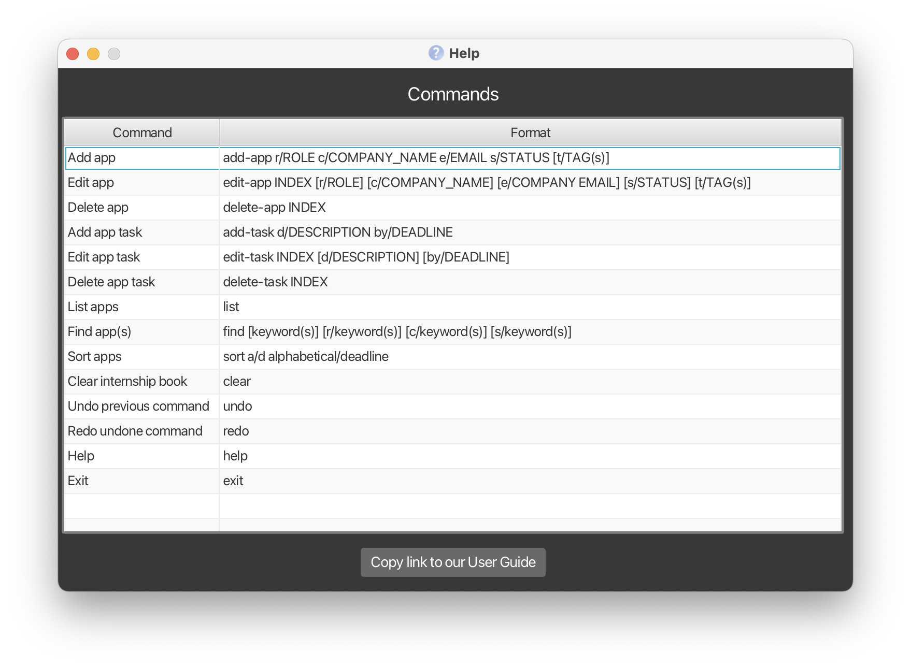

### Welcome to Docedex, your solution to doctor and patient management

Docedex is a **desktop application** is built for **administrative assistants** to manage patients within clinics.

Docedex is **optimized for** use via a **Command Line Interface (CLI)** while still having the benefits of a **Graphical User Interface (GUI).** If you type fast, Docédex can get your patient management tasks done faster than traditional GUI apps.

Unlike your traditional contact management application, keep track of patients' **health information**, their **doctors** and much more.

With Docedex, taking control of patient management is just a few keystrokes away!

For **new users** visit our [quick start](#quick-start) to get you started .

## Table of Contents
* Table of Contents
{:toc}
* 
--------------------------------------------------------------------------------------------------------------------

## Quick start

1. Make sure that you have **Java 11 or above** installed on your computer.
   - [How do I check my version of Java?]()
   - If not, follow the instructions [here]()

2. Download the latest jar file (`docedex.jar`) from our [Github Releases](https://github.com/AY2223S2-CS2103T-F12-1/tp/releases/).
   

3. Move the jar file to a Docedex's new folder
   - Create a new folder called Docedex where you would like to house the application (e.g., Desktop, Documents, etc.). 
   - Move the downloaded jar file to this folder as shown below.
     - For Mac Users:
     
     - For Windows Users:

4. Launch Docedex
   - For Mac Users:
     - Right-click `docedex.jar` > Open With > JavaLauncher.app
     
     - First time users may be prompted with a warning that the file was downloaded from the Internet. Simply click Open in the prompt to continue.
     - If this still does not work follow the instructions listed [here.]()
   - For Windows Users:
   
   - You should notice the GUI of the application pop up. 
   

6. Test out some commands in [Docedex Tutorial](#docedex-tutorial)

7. Refer to the [Features](#features) section for details of each command.

--------------------------------------------------------------------------------------------------------------------

## Notes about the command format
| Notes                                                                                                       | Explanation                                                        | Examples                                                                                          |
|-------------------------------------------------------------------------------------------------------------|--------------------------------------------------------------------|---------------------------------------------------------------------------------------------------|
| Words in `UPPER_CASE`                                                                                       | These are parameters that are supplied by the user                 | `add-doc n/NAME...` can be used as `add-doc n/John Doe...`                                        |
| Items in square brackets                                                                                    | These are optional fields (can be left empty by user)              | `add-doc n/NAME ... [t/TAG]` can be used as `add-doc n/John Doe t/friend` or `add-doc n/John Doe` |
| Items with `…`​ after them                                                                                  | These are fields that can be used multiple times including 0 times | `add-doc ... [t/TAG]…​` can be used as `add-doc ... t/friend t/surgeon` or `add-doc ...`          |
| Parameters can be in any order.                                                                             | N/A                                                                | `add-doc n/NAME p/PHONE_NUMBER ...` is equivalent to `add-doc p/PHONE_NUMBER n/NAME`              |
| If a parameter is **expected only once** and entered multiple times, only the latest occurence is accepted. | N/A                                                                | `add-doc n/John Doe n/Shawn Koh ...` is equivalent to `add-doc n/Shawn Koh ...`                   |
| Extraneous parameters for commands that do not take in parameters will be ignored.                          | N/A                                                                | `help 123`, `list 123` is equivalent to `help` or `list`                                          |

## Features

### Viewing help

- Command format: `help`
- Explanation: Shows a message explaining how to access the help page.

### Adding a doctor: 

- Command format: `add-doc n/NAME p/PHONE_NUMBER e/EMAIL s/SPECIALITY y/YEARS_OF_EXPERIENCE [t/TAGS]…`
- Explanation: Adds a doctor to the address book.

- Examples:
  - `add-doc n/John Doe p/98765432 e/johnd@example.com s/Cardiology y/5 t/surgeon`
  - `add-doc n/Gabriel Tan p/98765432 e/gabt@example.com s/Neurosurgery y/5`

### Adding a patient: `add-ptn n/NAME p/PHONE e/EMAIL h/HEIGHT w/WEIGHT d/DIAGNOSIS st/STATUS [r/REMARK] [t/TAGS]…`

Adds a patient to the address book.

Format: `add-ptn n/NAME p/PHONE e/EMAIL h/HEIGHT w/WEIGHT d/DIAGNOSIS st/STATUS [r/REMARK] [t/TAGS]…`

:bulb: **Tip:**
A patient can have any number of tags (including 0)

Examples:

* `add-ptn n/John Doe p/98765432 e/jdoe@gmail.com h/1.85 w/70.5 d/Fever st/Outpatient r/Patient was given paracetamol for fever t/friends`

### Editing a doctor : `edit-doc`

Users can edit specific doctors in the clinic by providing at least one of the optional fields. Existing values will be updated to the input values and all other values will remain the same.

Format: `edit-doc INDEX [n/NAME] [p/PHONE_NUMBER]`

* Edits the doctor at the specified `INDEX`. The index refers to the index number shown in the displayed doctor list. The index **must be a positive integer** 1, 2, 3, …​
* At least one of the optional fields must be provided.
* Existing values will be updated to the input values.
* When editing tags, the existing tags of the person will be removed i.e adding of tags is not cumulative.
* You can remove all the person’s tags by typing `t/` without
    specifying any tags after it.

Examples:
*  `edit 1 p/91234567` Edits the phone number of the 1st doctor to be `91234567`.
*  `edit-doc 2 n/Gabriel Tan p/12345678 t/` Edits the name and phone number of the 2nd doctor to be `Gabriel Tan` and `91234567` respectively. Adding t/ also clears all existing tags.

### Deleting a doctor : `del-doc`

Deletes the specified doctor from the address book.

Format: `del-doc INDEX`

* Deletes the doctor at the specified `INDEX`.
* The index refers to the index number shown in the displayed doctor list.
* The index **must be a positive integer** 1, 2, 3, …​

Examples:
* `list-doc` followed by `del-doc 2` deletes the 2nd doctor in the address book.
* `find-doc Gabriel` followed by `del-doc 1` deletes the 1st doctor in the results of the `find-doc` command.
* 
### Deleting a patient : `del-ptn`

Deletes the specified patient from the address book.

Format: `del-ptn INDEX`

* Deletes the patient at the specified `INDEX`.
* The index refers to the index number shown in the displayed patient list.
* The index **must be a positive integer** 1, 2, 3, …​

Examples:
* `list-ptn` followed by `del-ptn 2` deletes the 2nd patient in the address book.
* `find-ptn Gabriel` followed by `del-ptn 1` deletes the 1st patient in the results of the `find-ptn` command.

### Finding a doctor

Command: `find-doc KEYWORD`

Users can search up doctors that contain a specific text (KEYWORD) using this command.

* KEYWORD can contain multiple words.
    > e.g. The command `find-doc Hans Bo` will use `Hans Bo` as the KEYWORD.
* The search is case-insensitive.
    > e.g. `hans` will match `Hans`.
* All doctor entries that contain KEYWORD in their fields will be listed.

### Listing all doctors

Command: `list-doc`

This command will list all doctors saved in Docedex together with their information.

### Exiting the program

Command: `exit`

Exit the program.

### Saving the data

Docedex data is saved automatically after any command that changes data. There is no need to save manually.

### Editing the data file

Docedex data is saved as a JSON file at this specified path: `[JAR file location]/data/docedex.json`.

DO NOT modify data directly, as it might result in the malfunction of the application. In the worst case scenario, all your data may be reset. Only modify data directly if you know what you are doing and accept the risks of such actions.

--------------------------------------------------------------------------------------------------------------------

## FAQ

**Q**: How can I load data from another computer into Docedex installed on another computer? 
**A**: Delete the `docedex.json` file (stored at `[JAR file location]/data/docedex.json`) from the computer that you wish to use Docedex on. Then, copy over the `docedex.json` file from the computer which you no longer wish to use Docedex on. After which, boot up Docedex to check whether your doctor information is properly loaded into the new computer.
--------------------------------------------------------------------------------------------------------------------

## Command summary

| Action             | Format, Examples                                                                                                                                                                                                                              |
|--------------------|-----------------------------------------------------------------------------------------------------------------------------------------------------------------------------------------------------------------------------------------------|
| **Add Doctor**     | `add-doc n/NAME p/PHONE_NUMBER e/EMAIL s/SPECIALTY y/YEARS_OF_EXPERIENCE [t/TAGS]`   E.g. `add-doc n/John Doe p/98765432 e/johnd@example.com s/Cardiology y/5 t/surgeon`                                                                   |
| **Add Patient**    | `add-ptn n/NAME p/PHONE e/EMAIL h/HEIGHT w/WEIGHT d/DIAGNOSIS st/STATUS r/REMARK [t/TAGS]`   E.g. `add-ptn n/John Doe p/98765432 e/jdoe@gmail.com h/1.85 w/70.5 d/Fever st/Outpatient r/Patient was given paracetamol for fever t/friends` |
| **Delete Doctor**  | `del-doc INDEX`  E.g. `del-doc 3`                                                                                                                                                                                                          |
| **Delete Patient** | `del-ptn INDEX`  E.g. `del-ptn 3`                                                                                                                                                                                                          |
| **Edit Doctor**    | `edit-doc INDEX [n/NAME] [p/PHONE_NUMBER]`  E.g. `edit-doc 3 n/Gabriel Tan p/12345678`                                                                                                                                                     |
| **Find Doctor**    | `find-doc KEYWORD`  E.g. `find-doc Gabriel`                                                                                                                                                                                                |
| **List Doctors**   | `list-doc`                                                                                                                                                                                                                                    |
| **Help**           | `help`                                                                                                                                                                                                                                        |
| **Exit**           | `exit`                                                                                                                                                                                                                                        |
