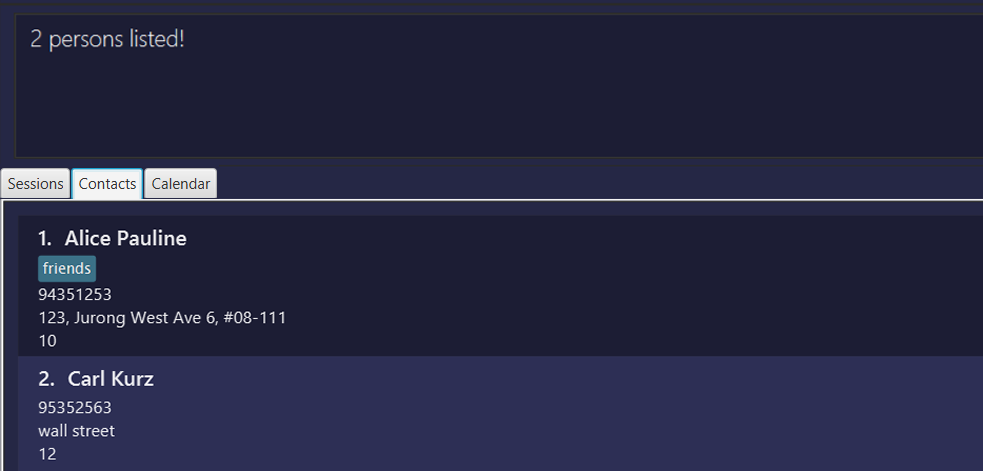

SportSync is a **desktop app for managing training sessions and athletes, optimized for use via a Command Line Interface** (CLI) while still having the benefits of a Graphical User Interface (GUI). If you can type fast, SportSync can get your training management tasks done faster than traditional GUI apps.
* Table of Contents
  {:toc}

--------------------------------------------------------------------------------------------------------------------

## **Quick start**

### Prerequisites
Ensure that you have Java 11 or above installed on your computer. If you don't have Java installed, you can download it from the official Java website [here](https://www.oracle.com/java/technologies/downloads/).

1. Download the latest `sportsync.jar` from [here](https://github.com/AY2223S2-CS2103T-W13-2/tp/releases).

2. Copy the file to the folder you want to use as the _home folder_ for your SportSync.

3. Open a command terminal, `cd` into the folder you put the jar file in, and use the `java -jar sportsync.jar` command to run the application. 
   e.g. `cd Desktop\New_Folder` and then `java -jar sportsync.jar` 

   A GUI similar to the below should appear in a few seconds. This shows the session list, which is currently empty. 
   Below that is the income analytics, which tabulates how much you've earned through your sessions.  
     
   Click the `Contacts` tab, or press the shortcut `CTRL + 2`. You have just navigated to the contact list. 
   Note how the app contains some sample data.  
   

4. Type the command in the command box and press Enter to execute it. e.g. typing **`help`** and pressing Enter will open the help window. 
   Some example commands you can try:

    * `list` : Lists all athletes.

    * `add n/John Doe p/98765432 a/311, Clementi Ave 2, r/35 t/friends t/owesMoney` : Adds athlete `John Doe` to SportSync.

    * `delete 3` : Deletes the 3rd athlete shown in the current list.

    * `clear` : Deletes all athletes.

    * `exit` : Exits the app.

Refer to the [Features](#features) below for details of each command.

5. Click the `Calendar` tab, or press the shortcut `CTRL + 3`. You have just navigated to the calendar, which is currently empty. 
   All future scheduled sessions will automatically show up on the calendar.  
    

:bulb: **Tip:**
Here are some useful shortcuts that can help you save time: 
**F1**: Opens the help menu.
**CTRL + 1**: Switches to the `Sessions` tab.
**CTRL + 2**: Switches to the `Contacts` tab.
**CTRL + 3**: Switches to the `Calendar` tab.

--------------------------------------------------------------------------------------------------------------------

## **Features**

**:information_source: Notes about the command format:** 
* Parameters are used to specify information that is required for the command to be executed correctly.

* Words in `UPPER_CASE` are the parameters to be supplied by the coach.  
  e.g. in `add n/NAME`, `NAME` is a parameter which can be used as `add n/John Doe…​`.

* Items in square brackets are optional. 
  e.g. `n/NAME [t/TAG]` can be used as `n/John Doe t/friend` or as `n/John Doe`.

* Items with `…`​ after them can be used multiple times including zero times. 
  e.g. `[t/TAG]…​` can be used as ` ` (i.e. 0 times), `t/friend`, `t/friend t/family` etc.

* Parameters can be in any order. 
  e.g. if the command specifies `n/NAME p/PHONE_NUMBER`, `p/PHONE_NUMBER n/NAME` is also acceptable.

* If a parameter is expected only once in the command but is specified multiple times, only the last occurrence of the parameter will be taken. 
  e.g. if you specify `p/12341234 p/56785678`, only `p/56785678` will be taken.

* Extraneous parameters for commands that do not take in parameters (such as `help`, `list`, `exit` and `clear`) will be ignored. 
  e.g. if the command specifies `help 123`, it will be interpreted as `help`.

## General
### Viewing help : `help`

Shows a message explaining how to access the help page.

Format: `help`

:bulb: **Tip:**
The help menu can also be accessed by pressing the F1 key.

### Undoing a previous command : `undo`

Undoes a previously entered command.

Format: `undo`

* Returns the state of the athlete list to the state before the last entered command.
* Cannot be used if no commands have been entered yet.

### Redoing a previous command : `redo`

Redoes a previously entered command.

Format: `redo`

* Returns the state of the athlete list to the state before undoing the last entered command.
* Cannot be used if no commands have been entered yet.

:exclamation: **Caution:**
If the athlete list is changed after an undo command, a redo cannot be done.

### Exiting the program : `exit`

Exits the program.

Format: `exit`

### Saving the data

SportSync data is saved in the hard disk automatically after any command that changes the data. There is no need to save manually.

### Editing the data file

SportSync data is saved as a JSON file `[JAR file location]/data/addressbook.json`. Advanced coaches are welcome to update data directly by editing that data file.

:exclamation: **Caution:**
If your changes to the data file makes its format invalid, SportSync will discard all data and start with an empty data file at the next run.

## Athelete Management

### Adding an athlete: `add`

Adds an athlete to SportSync.

Format: `add n/NAME p/PHONE_NUMBER a/ADDRESS r/PAY_RATE [t/TAG]…​`

:bulb: **Tip:**
An athlete can have any number of tags (including 0)

Examples:
 `add n/John Doe p/98765432 r/44 a/UTown Residences, #01-01`
  Adds an athlete with name "John Doe", phone number "98765432", Payrate "44" and address "UTown Residences, #01-01".
 `add n/Betsy Crowe t/friend a/Sheares Hall p/1234567 t/basketball r/5`
  Adds an athlete with name "Betsy Crowe", phone number "1234567", Payrate "5", address "Sheares Hall" and tags "friend", "basketball".

### Listing all athletes : `list`

Shows a list of all athletes.

Format: `list`

### Editing an athlete : `edit`

Edits an existing athlete in the athlete list.

Format: `edit INDEX [n/NAME] [p/PHONE] [r/PAY_RATE] [a/ADDRESS] [t/TAG]…​`

* The index refers to the index number shown in the displayed athlete list.
* The index **must be a positive integer** 1, 2, 3, …​
* At least one of the optional fields must be provided.
* Existing values will be updated to the input values.
* When editing tags, the existing tags of the athlete will be removed.  (i.e. adding of tags is not cumulative)
* You can remove all the athlete’s tags by typing `t/` without
  specifying any tags after it.

Examples:
 `edit 1 p/91234567 r/3`  Edits the phone number and pay rate of the 1st athlete to be `91234567` and `3` respectively.
 `edit 2 n/Betsy Crower t/`   Edits the name of the 2nd athlete to be `Betsy Crower` and clears all existing tags.

### Locating athletes by name: `find`

Finds athletes whose names contain any of the given keywords.

Format: `find KEYWORD [MORE_KEYWORDS]`

* The search is case-insensitive. e.g. `hans` will match `Hans`
* Full and partial words will be matched e.g. `Han` and `Hans` will both match `Hans`
* The order of the keywords does not matter. e.g. `Hans Bo` will match `Bo Hans`
* Only the name is searched.
* Athletes matching at least one keyword will be returned (i.e. `OR` search).
  e.g. `Hans Bo` will return `Hans Gruber`, `Bo Yang`

Examples:
 `find John`   Returns "john" and "John Doe"
 `find carl alice`  Returns "Alice Pauline", "Carl Kurz" 

### Deleting an athlete : `delete`

Deletes the specified athlete from the athlete list.

Format: `delete INDEX`

* The index refers to the index number shown in the displayed athlete list.
* The index **must be a positive integer** 1, 2, 3, …​

Examples:
 `list` followed by `delete 2`  Deletes the 2nd athlete in the athlete list.
 `find Betsy` followed by `delete 1`   Deletes the 1st athlete in the results of the `find` command.

### Clearing all athletes : `clear`

Clears all athletes from the athlete list.

Format: `clear`

### Sorting the athlete list : `sort`

Sorts all athletes in the athlete list according to provided attribute.

Format: `sort ATTRIBUTE`

* Sorts the athlete according to specified attribute `ATTRIBUTE`.
* Attributes:

  * 1 - Name
  * 2 - Pay rate

Examples:
* `sort 1` sorts the athlete list by name in alphabetical order.
* `sort 2` sorts the athlete list according to pay rate, from cheapest to most expensive.

## Tag Management
### Adding a tag : `add-tag`

Adds a specified tag to a specified athlete.

Format: `add-tag INDEX t/TAGNAME`

Examples:
`add-tag 1 t/Hall`
  Adds a tag of name "Hall" to the person at Index 1.

### Removing a tag : `remove-tag`

Removes a specified tag to a specified athlete.

Format: `remove-tag INDEX t/TAGNAME`

Examples:
`remove-tag 1 t/Hall`
 Remove a tag of name "Hall" from the person at Index 1.

### Showing athletes with the specified tag : `show`

Shows all athletes belonging to at least one of the tags specified.

Format: `show [TAG1]…​`

* Filters list of athletes to only contain athletes belonging to one or more of the specific tag(s).
* At least one tag name **must be provided.**

Examples:
 `show varsity`  shows people belonging to group `varsity`.
 `show hockey tennis` Shows people belonging to either group `hockey`, `tennis` or both.

## Session Management
### Create a session : `create-session`

Adds a new session to the session list.

Format: `create-session n/NAME s/SESSION l/LOCATION `

* Duplicate sessions cannot be created.

Examples:`create-session n/Hall s/10-03-2022 10:00 to 10-03-2022 11:00 l/MPSH2`   Creates a session with name Hall from 10 March 2022, 10-11 a.m. at MPSH2.

### Delete an existing session : `delete-session`

Removes an existing session from the session list.

Format: `delete-session INDEX `

* Sessions that do not exist cannot be deleted.

Examples:
`delete-session 3`   Deletes the 3rd session in the session list.

### Edit an existing session : `session-edit`

Edits the details of an existing session in the session list.

Format: `session-edit INDEX [n/NAME] [s/SESSION] [l/LOCATION]`

* At least one of the fields must be provided.
* Session must already exist.

Examples:
`session-edit 2 n/Hall`  Changes the location of the 2nd session in the session list to Hall.

### Mark an athlete's attendance : `mark`

Marks the athlete as present for a specified session.

Format: `mark INDEX n/NAME`

* Session and athlete must already exist.

Examples:
`mark 1 n/John Doe`   Marks John Doe's attendance as present in the 1st session in the session list.

### Unmark an athlete's attendance : `unmark`

Marks the athlete as absent for a specified session.

Format: `unmark INDEX n/NAME`

* Session and athlete must already exist.

Examples:
`unmark 1 n/John Doe`   Marks John Doe's attendance as absent in the 1st session in the session list.

### Adding an athlete to a session: `student-add`

Adds an athlete of a specified index to the specified session.

Format: `student-add INDEX n/HALL`

Examples:
`student-add 1 n/hall`  Adds an athlete at index 1 of the contact list to the session “Hall”.

### Removing an athlete from a session: `student-remove`

Removes an athlete of a specified index from the specified session.

Format: `student-remove INDEX n/HALL`

Examples:
`student-remove 1 n/hall`
  Removes an athlete at index 1 of the contact list from the session “Hall”.

## Income Analytics

The **Income Analytics** Panel is an automated feature that tracks and displays your coaching income based on athlete attendance and pay rates.

### How to view
The panel is automatically updated based on athlete attendance and pay rates. It displays today's income, weekly income, monthly income, and lifetime income.

### Features
The displayed income is based on the athlete's pay rate per hour and the session duration. It is only reflected if the athlete is marked as present.

--------------------------------------------------------------------------------------------------------------------

## **FAQ**

**Q**: How do I transfer my data to another Computer? 
**A**: Install the app in the other computer and overwrite the empty data file it creates with the file that contains the data of your previous SportSync home folder.

## **Glossary**

* **Pay rate**: The amount of fees paid by the athlete per training session.
* **Athlete**: A student of the Coach.
* **Attendance**: A record of the presence or absence of an athlete at a training session.
* **Coach**: A person who trains and directs athletes or a team.
* **Session**: A training period for athletes conducted by a coach.
* **Tag**: A label attached to an athlete in SportSync, used to group athletes together for easier management.

--------------------------------------------------------------------------------------------------------------------

## **Command summary**

| Action                | Format, Examples                                                                                                                                      |
|-----------------------|-------------------------------------------------------------------------------------------------------------------------------------------------------|
| **Help**              | `help`                                                                                                                                                |
| **Undo**              | `undo`                                                                                                                                                |
| **Redo**              | `redo`                                                                                                                                                |
| **Exit**              | `exit`                                                                                                                                                |
| **Add**               | `add n/NAME p/PHONE_NUMBER r/PAY_RATE a/ADDRESS [t/TAG]…​`   e.g. `add n/James Ho p/22224444 r/7 a/123, Clementi Rd, 1234665 t/friend t/colleague` |
| **List**              | `list`                                                                                                                                                |
| **Edit**              | `edit INDEX [n/NAME] [p/PHONE_NUMBER] [r/PAY_RATE] [a/ADDRESS] [t/TAG]…​`  e.g. `edit 2 n/James Lee r/3`                                           |
| **Find**              | `find KEYWORD [MORE_KEYWORDS]`  e.g. `find James Jake`                                                                                             |
| **Delete**            | `delete INDEX`  e.g. `delete 3`                                                                                                                    |
| **Clear**             | `clear`                                                                                                                                               |
| **Sort**              | `sort ATTRIBUTE ORDER`  e.g. `sort 1 2`                                                                                                            |
| **Add Tag**           | `add-tag INDEX t/TAGNAME​`   e.g. `add-tag 2 t/Private`                                                                                            |
| **Remove Tag**        | `remove-tag INDEX t/TAGNAME​`   e.g. `remove-tag 2 t/Private`                                                                                      |
| **Show**              | `show [TAG1]`  e.g. `show Hall`                                                                                                                    |
| **Create Session**    | `create-session n/NAME s/SESSION l/LOCATION`  e.g., `create-session n/Hall s/10-03-2022 10:00 to 10-03-2022 11:00 l/MPSH2`                         |
| **Delete Session**    | `delete-session INDEX`  e.g. `delete-session 3`                                                                                                    |
| **Edit Session**      | `session-edit INDEX [n/NAME] [s/SESSION] [l/LOCATION]`  e.g. `session-edit 2 n/Hall`                                                               |
| **Mark Attendance**   | `mark INDEX n/NAME`   e.g. `mark 1 n/John Doe`                                                                                                     |
| **UnMark Attendance** | `unmark INDEX n/NAME`   e.g. `unmark 1 n/John Doe`                                                                                                 |
| **Add Student**       | `student-add INDEX n/HALL`   e.g. `student-add 1 n/hall`                                                                                           |
| **Remove Student**    | `student-remove INDEX n/HALL`   e.g. `student-remove 1 n/hall`                                                                                     |

