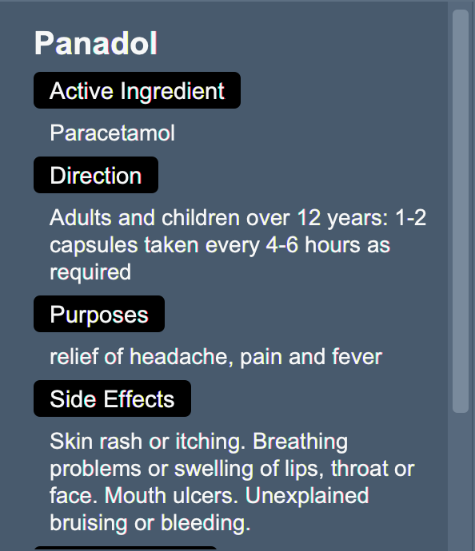
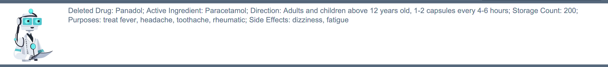
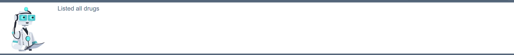

Welcome to CareFlow, your all-in-one solution for managing patient information and drug inventory in the General Practitioner clinic. Do you find yourself struggling to keep track of patient details? Are you tired of manually managing your drug inventory? CareFlow is here to help! Our easy-to-use desktop application is specifically designed for receptionists who want to improve their workflow and provide better patient care.

CareFlow is a **desktop application for [patient management](#31-patient-information-management) and [drug inventory
management](#32-drug-inventory-management), optimised for use
via a Command Line Interface (CLI)[1](#1)** while benefiting from a Graphical User Interface (GUI) [2](#2). With CareFlow, you can streamline your workflow, improve patient care, and reduce the stress of managing multiple systems and spreadsheets. If you are a receptionist at a GP clinic and are comfortable typing, CareFlow can streamline your daily patient and drug management tasks, saving you from tedious daily routines and allowing you to focus on what really matters —— your patients' well-being! Interested? Jump to Section [2. Quick Start](#2-quick-start) to get started. Enjoy!

  

  <i>Figure 1. Graphical User Interface (GUI) of CareFlow</i>

* Table of Contents
{:toc}

 

--------------------------------------------------------------------------------------------------------------------

# **1. About this user guide**

Welcome to the CareFlow user guide! This guide is designed to help you make the most of the software by providing detailed instructions on its features and functionalities.

## 1.1 How to navigate this user guide

To help you navigate the guide, we've divided it into several sections, each covering a different aspect of CareFlow. Here's a brief overview of what you'll find in each section:

1. Section [1. About this user guide](#1-about-this-user-guide)
    - If you want to learn more about the guide itself and how to use it, refer to section 1, "About this user guide". Here, you'll find useful information on the symbols used in this user guide and how to navigate it easily.

2. Section [2. Quick Start](#2-quick-start)
    - If you're new to CareFlow and need help getting started, head to Section 2, "Quick Start", where you'll find step-by-step instructions to set up and begin using the application.

3. Section [3. Overview of features](#3-overview-of-features)
    - If you want to get a better understanding of CareFlow's main features, head to Section 3, "Overview of
      features". This section provides a explanation of three main feature of CareFlow and how to use them.

4. Section [4. Commands](#4-commands)
    - If you're looking for information on specific command, check out Section 4, "Commands". Here you'll find a detailed explanation of each command and how to use it.

5. Section [5. Data Storage](#5-data-storage)
    - If you're looking for information on CareFlow's data storage mechanism, check out Section 5, "Data Storage".

6. Section [6. FAQ](#6-faq)
    - If you have any questions about using CareFlow or running into any issues, take a look at Section 6, "FAQ". We've included answers to common questions and troubleshooting tips to help you out.

7. Section [7. Command Summary](#7-command-summary)
    - If you want a quick reference for all the commands available in CareFlow, head to Section 7, "Command Summary". This section provides a list of all the commands and their functions, making it easy to find what you need.

8. Section [8. Glossary](#8-glossary)
    - If you come across a term you're not familiar with, the glossary in section 8 is a useful resource. It
      provides clear definitions and explanations for all the terminology used in the user guide.

To make the most of this user guide, we recommend reading through it in order, starting with the Introduction of
CareFlow and working your way through each section. You can also use the [table of contents](#top) to jump to specific
sections as needed.

## 1.2 Note on symbols and formatting used

Throughout this user guide, you may come across different formatting styles and symbols. These are used to make the guide more readable and easier to understand. Here are some of the formatting styles and symbols you may encounter:

| **Symbol/ Format**   | **Meaning**                                                                                                                                                                                                                                                                                               |
| -------------------- | --------------------------------------------------------------------------------------------------------------------------------------------------------------------------------------------------------------------------------------------------------------------------------------------------------- |
| 'p'/ 'd'/ 'g'        | Commands starting with 'p' are patient commands, those starting with 'd' are drug commands and those starting with 'g' are general commands.                                                                                                                                                              |
| :information_source: | This symbol is used to indicate information that you should know when using CareFlow.                                                                                                                                                                                                                     |
| :exclamation:        | This symbol is used to indicate important warning information that you should be mindful of when using CareFlow.                                                                                                                                                                                          |
| UPPER_CASE           | Words in UPPER CASE are the parameters that you need to supply to the system. E.g. in `add -n NAME`, `NAME` is a parameter which you specify the name of the patient that you wish to add. For instance, a possible value for the NAME parameter is John Doe, and the command would be `add -n John Doe`. |
| ...UPPER_CASE        | Words in UPPER CASE prefixed with ellipsis are the parameters that accepts multiple arguments. E.g. in `p find ...PATIENT_NAME`, you can indicate multiple names for the `PATIENT_NAME` parameter. So commands such as `p find Yu Yeoh` and `p find a b c d`are valid commands.                           |
| [brackets]           | Items in square brackets are optional. E.g. `update -n NAME [-ph PHONE]` can be used as `update -n Alice` or `update -n Alice -ph 12345678`                                                                                                                                                               |
| `command`            | The grey highlighting indicates that the word is a command to be entered by the user.                                                                                                                                                                                                                     |
| [1. About](#1-about) | Blue texts shown are clickable links. These links will take you to specific sections of this User Guide or external website.                                                                                                                                                                              |

  <i>Table 1. Symbols and formats used in this User Guide.</i>

 

[↑ Back to top](#top)

 

--------------------------------------------------------------------------------------------------------------------

# **2. Quick start**

1. Ensure you have Java 11 installed in your Computer.
   

   
Click here for more information on Java 11 installation

      

      
 I. Installing Java 11 on Windows: 

      <ul>
      <li>
      To install Java 11 on Window, you have to first download the jdk installer and then run the jdk installer to install Java 11. 
      </li>
       
      <li>
      Step 1: To download jdk installer, click on the <a href="https://docs.oracle.com/en/java/javase/11/install/installation-jdk-microsoft-windows-platforms.html#GUID-371F38CC-248F-49EC-BB9C-C37FC89E52A0">link</a> and scroll down to <code>Downloading the JDK installer</code> section:
   
        

          
          

        

          <i>Figure 2. Screenshot of the 'Downloading the JDK Installer' section on the link given.</i>
          

        </li>
       
      <li>
      Step 2: Click on the <code>Java SE Downloads</code> link, which leads you to this page:
        

            
          

        

          <i>Figure 3. Screenshot of the 'Java SE Downloads' page.</i>
          

      </li>

       
      <li>
      Step 3: Scroll down to this section, then, click on the <code>Java 11</code> tab in the top left corner:
        

          
        

        

          <i>Figure 4. Screenshot of the Java SE Development Kit 11.0.18 section.</i>
          

      </li>

       
      <li>
        Step 4: Click on the download linked circled out in the following picture. Note that you will be promoted to register an Oracle account. After registration, the download will start automatically.

          

          
          

          

          <i>Figure 5. Screenshot of Java SE 11 download page with download link for 'Windows x64' circled.</i>
          

          

          
          

          

          <i>Figure 6. Screenshot of Oracle account login page.</i>
          

      </li>

           
      <li>
      Step 5: Locate the downloaded file and double-click the icon to <code>run the jdk installer</code>. Then, simply follow the instructions provided by the installer.
        

          
        

        

          <i>Figure 7. Screenshot of the downloaded file.</i>
          

      </li>

         
      </ul>
        

     

     
II. Installing Java 11 on macOS

   <ul>
   <li>
     Click on the <a href="https://docs.oracle.com/en/java/javase/11/install/installation-jdk-macos.html">link</a> and scroll down to <code>Installing JDK on macOS</code> and simply follow the instructions there!
       

       
       

       

       <i>Figure 8. Screenshot of steps to download JDK on macOS.</i>
       

   </li>

    
   </ul>
       

       

2. Download the latest `careflow.jar` jar file from <a href="https://github.com/AY2223S2-CS2103T-W09-3/tp/releases">here</a>.

3. Copy the jar file to the folder you want to use as the home folder for your careflowBook. For instance, you can create a folder `CareFlow` on your desktop and put the jar file inside.

4. Open a `command terminal`
   

   
Click here for more information on how to open a command terminal

      

      
 I. For macOS: 

   <ul>
   <li>
    Step 1: Click on the <code>spotlight search</code> icon in the top right corner of your navigation bar, you'll see a search bar popping out.
        

          
        

        

         <i>Figure 9. spotlight icon.</i>
         

   </li>
         
   <li>
    Step 2: Type <code>terminal.app</code> into the search bar, and simply hit <code>Enter</code>
        

             
        

        

         <i>Figure 10. search bar on macOS.</i>
         

   </li>
         
   <li>
    Step 3: You're now looking at the <code>command terminal</code>, good job!
        

            
        

        

         <i>Figure 11. command terminal on macOS.</i>
         

   </li>
         

   </ul>
            

      

      
 II. For Windows:

   <ul>
   <li>
          To Be Added
   </li>
   </ul>
         

         

5. The next step is to navigate into the folder you put the jar file in with the `cd` command
   

   
 Click here for more information on navigating to jar file 

    <ul>
   <li>
    Suppose you have adopted the suggestion to put the jar file inside a folder called <code>CareFlow</code> on your desktop, you should type:<code>cd desktop/CareFlow</code> into your <code>command terminal</code> and hit <code>Enter</code>.  
   </li>

    
   <li>
    For keen learners, you can take a look at the short video below to fund out more about the <code>cd</code> command
         - For macOS: <a href="https://www.youtube.com/watch?v=VJZ9mk6D6pw">Change Directories in macOS Terminal (cd
   command)</a>
         - For Windows: <a href="https://www.youtube.com/watch?v=Q3XQpnQTy6Y">How to Use CD Command in CMD</a>
   </li>
   </ul>

   

6. Type the `java -jar careflow.jar` command into your `command terminal` and hit `Enter` to run the application. An application similar to the one shown below should appear in a few seconds. Note that the app contains some sample data.
  

    
  

  

    <i>Figure 12. Dark mode user interface with Patient tab opened. </i>
    

    
  

  

    <i>Figure 13. Dark mode user interface with Drug tab opened. </i>
    

    
  

  

    <i>Figure 14. Dark mode user interface with Hospital Hotlines tab opened. </i>
    

7. You can now start typing some command into the command box at the bottom and hit `Enter` to execute it. e.g. type in **`g help`** and hit `Enter` will open the help window. 
   

   
Click here for  Some example commands you can try

    <ul>
        <li><code>p list</code> : Lists all patients. </li>
        <li><code>d list</code> : Lists all drugs.</li>
        <li><code>p add -n John Lo -ph 98765431 -em johnl@example.com -ad John Street, Block 321, #02-02 -dob 22-02-2000 -g male -ic T3871910C</code> : Adds a patient named <code>John Lo</code> to the patient records.</li>
        <li><code>p delete -i 3</code> : Deletes the 3rd patient record shown in the current list.</li>
        <li><code>p clear</code> : Deletes all patient records.</li>
        <li><code>d clear</code> : Deletes all drug records.</li>
        <li><code>g exit</code> : Exits the app.</li>
    </ul>
    

     

[↑ Back to top](#top)

--------------------------------------------------------------------------------------------------------------------
# **3. Overview of Features**

If you work as a clinic receptionist, you understand how time-consuming and overwhelming it can be to manually
manage patient information and medicine inventory. That is why we have created CareFlow specifically designed to assist you in these tasks, making your job lot easier and more efficient. With our software, you can easily keep track of patient information and drug inventory, allowing you to focus on providing your patients the best care possible.

## 3.1 Patient Information Management

If you are a busy clinic receptionist who finds it challenging to manage patient information, CareFlow is the
solution for you.

CareFlow lets you keep all your patient data in one place and access it easily. With our user-friendly interface, you can add, update, or find patient info without any trouble. No more headaches from managing paper records or notes!

:information_source: Visit Section <a href="#42-patient-commands">4.2 Patient Commands</a> for more information on how to manage patient data in CareFlow.

## 3.2 Drug Inventory Management

If you find struggle to keep track of your drug inventory, CareFlow is here to help.

With CareFlow, you can easily keep track of your stock and avoid the risk of running out of important medications. You can quickly add or remove medications, and view drug inventory levels with just a glance at the pie chart. You no longer have to waste time manually counting pills or reading scribbled notes.

:information_source: Visit Section <a href="#43-drug-commands">4.3 Drug Commands</a> for more information on how to manage drug inventory in CareFlow.

## 3.3 Hospital Information Directory

If you encounter an emergency or serious medical issue that your clinic can't handle, our software provides you with a list of public hospitals and their contact details, including hospitals' name and emergency hotlines. This makes it easy for you to quickly locate and contact nearby hospitals for further medical attention.

:information_source: Please note that you are not allowed to edit or
change the hospital list in CareFlow. However, if you believe that a hospital is missing from our directory, please
feel free to <a href="https://ay2223s2-cs2103t-w09-3.github.io/tp/AboutUs.html">contact us</a> and let us know. We
are committed to constantly improving our software to meet your needs.

[↑ Back to top](#top)

--------------------------------------------------------------------------------------------------------------------
# **4. Commands**

## 4.1 General Commands

This section introduces the two general commands, `help` and `exit`. These commands are not specific to the patient or
drug of CareFlow.

### View help
* Feeling stuck or lost? Follow the link shown on the pop-up window to see a comprehensive guide on the functionalities of CareFlow.
    
  

    
  

  

    <i>Figure 15. Popped up window after typing 'g help'.</i>
  

   
* **Format:** `g help`

:information_source:  **Note:** Clicking** on `Open URL` button will open the CareFlow User Guide on a new tab if you already have a browser window opening OR a new browser window otherwise.

 

[↑ Back to top](#top)

 

### Exit the program
* Done with your session? You can exit the program with this command, your data will be automatically saved to the hard disk.
* **Format:** `g exit`

:information_source:   **Note:** Executing this command has the same effect as directly closing the application window

 

[↑ Back to top](#top)

 

___

## 4.2 Patient Commands

### Add a Patient record
* Have a new patient visiting your clinic for the first time? You can use this command to add a new patient to the patient records.
  &nbsp;
* **Format:** `p add -n PATIENT_NAME -ph PHONE_NUMBER -em EMAIL -ad ADDRESS -dob DATE_OF_BIRTH -g GENDER -ic NRIC [-da DRUG_ALLERGY] [-ec EMERGENCY_CONTACT_NUMBER]`
  &nbsp;
* **Parameter constraint:**

| Parameter                | Constraint                                                                                                                                                                                                                                                                                                                                                                                                                                                              | Example                               |
| ------------------------ | ----------------------------------------------------------------------------------------------------------------------------------------------------------------------------------------------------------------------------------------------------------------------------------------------------------------------------------------------------------------------------------------------------------------------------------------------------------------------- | ------------------------------------- |
| PATIENT_NAME             | Names should only contain alphanumeric characters, spaces, and special character like " . ", " - ", " ' " it should have a length between 1 and 50 characters and it must not be left blank                                                                                                                                                                                                                                                                             | John Smith                            |
| PHONE_NUMBER             | Phone numbers should contain numbers, special character like: space, +, -, (), and it should be at least 3 or at most 20 digit and special character long                                                                                                                                                                                                                                                                                                               | 12345678                              |
| EMAIL                    | The email address should follow the format of "username@domain.extension". The "username" can include letters, numbers, dots, hyphens, and underscores, it cannot start or end with any special character. The domain name must   - end with a domain label at least 2 characters long  - have each domain label start and end with alphanumeric characters - have each domain label consist of alphanumeric characters, separated only by hyphens, if any. | johnson@gmail.com                     |
| ADDRESS                  | Addresses can take any values, it should not be blank and equal or less than 200 characters long                                                                                                                                                                                                                                                                                                                                                                        | Robert Robertson, 1234 NW Bobcat Lane |
| DATE_OF_BIRTH            | Date of birth should only contain numeric characters and spaces, the format of date should be dd/mm/yyyy or dd.mm.yyyy or dd-mm-yyyy and the date should fall between 01/01/1900 and current date                                                                                                                                                                                                                                                                       | 01-01-2000, 01.01.2000, 01/01/2000    |
| GENDER                   | The gender field only accommodates two options, which are female or male.                                                                                                                                                                                                                                                                                                                                                                                               | male or m or female or f              |
| NRIC                     | The IC number begins with a letter followed by 7 digits and concludes with another letter.                                                                                                                                                                                                                                                                                                                                                                              | A1234567B                             |
| DRUG_ALLERGY             | Drug allergy should be alphanumeric and equal or less than 500 characters long.                                                                                                                                                                                                                                                                                                                                                                                         | penicillin                            |
| EMERGENCY_CONTACT_NUMBER | same constraint as PHONE_NUMBER.                                                                                                                                                                                                                                                                                                                                                                                                                                        | +(65)-1234 5678                       |

* **Example:** `p add -n John Doe -ph 91234567 -em johndoe@example.com -ad John Street, Block 123, #01-01 -dob 09-09-2000 -g male -ic S9284729C -da Xanax -ec 81234567`
    * Type the command into the command box and hit `Enter`
      

        
      

       

    * A message response will be printed on the screen, informing you that your command has been successfully executed!
      

        
      

       

    * John Doe is now added to the patient record. Click on John Doe and you will see his information being displayed at the right side.
      

        
      

       

:information_source: **Note:** You can indicate patient information in any order that you wish. But do make sure that you have entered all compulsory parameters (ie. those not in square bracket, such as `NAME`, `NRIC`, `PHONE`, etc).

:information_source: **Note:** In the event of unsuccessful addition, please check through the parameter constaints in the table [above](#patient-constraints) to make sure that all parameters comply with the constraints. Parameters such as `DATE_OF_BIRTH` and `EMAIL` are prone to error, so be careful with those when you enter patient information.

 

[↑ Go to Patient Commands](#42-patient-commands)
 

[↑ Back to top](#top)

 

### Delete a patient record by NRIC
* Trying to remove an irrelevant or dated patient record? This command deletes the specified patient from the patient list
  and records.
  \
  &nbsp;
* **Format:** `p delete -ic PATIENT_NRIC`
  \
  &nbsp;
* **Example:** `p delete -ic S9284729C`
    * Type the command into the command box and hit `Enter`
        

              
        

         

    * Patient to be deleted:
        

      
        

         

    * A message response will be printed on the screen, informing you that your command has been successfully executed!
        

        
        

         

    * You can scroll through the list of patient, and John Doe should not be present.

[↑ Go to Patient Commands](#42-patient-commands)
 

[↑ Back to top](#top)

 

### Delete a patient record by index
* Trying to remove an irrelevant or dated patient record without using their NRIC? You can also delete a patient by specifying the patient's index in the patient list you are currently looking at.
    * The index refers to the index number shown in the displayed person list.
    * The index must be a positive integer 1, 2, 3, …​
      \
      &nbsp;
* **Format:** `p delete -i PATIENT_INDEX`
  \
  &nbsp;
* **Example:** `p delete -i 8`
    * Then, scroll through the displayed list of patient record, and identify the index of the patient you wish to delete. Suppose we want to delete the 8th patient in the list, John Doe.
      

            
      

      

            
      

       
    * A message response will be printed on the screen, informing you that your command has been successfully executed!
        

             
        

       

:information_source: **Note:** 
  <ul style="list-style-type:none;">
    <li>
    The index of a patient can change depending on the filter you currently apply on the patient list.</li>
    <li>
    For example, if you execute the `p list` command, all filter will be removed and the patient's index will be his or her position in the main patient list.
    </li>
    <li>
    However, if you execute a `p find PATIENT_NAME` command, the patient's index will be his or her position in the **filtered** patient list.
    </li>
    <li>
    Subsequent deletion by index will be with respect to the list you're currently viewing.
    </li>
  </ul>   

 

[↑ Go to Patient Commands](#42-patient-commands)
 

[↑ Back to top](#top)

 

### Update a patient by name

* A patient reports a change of address, phone number, or any other information? You can easily update the information of that patient with the `p update` command.
  \
  &nbsp;
* **Format:** `p update PATIENT_NAME [-n NEW_NAME] [-ph NEW_PHONE_NUMBER] [-em NEW_EMAIL] [-ad NEW_ADDRESS] [-dob NEW_DATE_OF_BIRTH] [-g GENDER] [-ic IC] [-da PATIENT_DRUG_ALLERGY] [-ec NEW_EMERGENCY_CONTACT_NUMBER]`
    * When you wish to update some, if not all information of a patient, simply include the parameters that you wish to update.
      \
      &nbsp;
* **Example:**
    * Suppose we wish to update the phone number, email address, emergency contact number of John to be 91234567, johndoe@example.com and 98765432 respectively. The command would be:`p update John Doe -ph 91234567 -em johndoe@example.com -ec 98765432`
      

            
      

       
    * A message response will be printed on the screen, informing you that your command has been successfully executed!
      

            
      

       
    * Suppose we wish to update the name and drug allergy of Bety to be Betsy Crowers and Aspirin respectively. The command would be:`p update Bety -n Betsy Crower -da Aspirin`

:information_source: **Note:** 
  <ul style="list-style-type:none;">
    <li>You can update 1 to 9 items, 9 being all pieces of information of a patient.</li>
    <li> When updating, it is necessary that you use the full name of the patient. Since we do not allow duplicated names, indicating full name would be sufficient to eliminate any ambiguity duing update.</li>
  </ul>

 

[↑ Go to Patient Commands](#42-patient-commands)
 

[↑ Back to top](#top)

 

### Retrieve a patient record by name
* Need to promptly search for a specific patient record? You can quickly retrieve the information of a patient by searching with his or her name.
  \
  &nbsp;
* **Format:** `p find ...PATIENT_NAME`
    * The search is case-insensitive. e.g hans will match Hans
      \
      &nbsp;
* **Examples:**
    * `p find Doe` returns David Doe and John Doe
      

            
      

       
    * You can click on either record to see detailed information.

 

:information_source: **Note:** You can indicate multiple patient names, and a patient will be shown as long as the patient's name matches any of the names. So if you enter `p find Yu Yeoh`, both `Bernice Yu` and `Alex Yeoh` will be shown.

 

[↑ Go to Patient Commands](#42-patient-commands)
 

[↑ Back to top](#top)
 

### View a patient's full information

* Need to view additional information of a patient record? You can view detailed information of a patient with the `view` command.
The full detail of the retrieved patient will be shown on the right side of the application.
* The index refers to the index number shown in the displayed patient list.
  \
  &nbsp;
* **Format:** `p view -i PATIENT_INDEX`
  \
  &nbsp;
* **Example:** `p view -i 1`
    * You can enter `p view -i 1` to see the information of the first patient in the list.
      

            
      

 

[↑ Go to Patient Commands](#42-patient-commands)
 

[↑ Back to top](#top)

 

### Clear all patient records

* Wish to terminate your subscription with CareFlow and move to another system? :pensive:
You can also clear all patient records.

:exclamation: **Caution:**
Use this with command with caution!

  \
  &nbsp;
* **Format:** `p clear`
  \
  &nbsp;
* **Example:** `p clear`
    * All patient records will be permanantly removed from the system
      

            
      

 

[↑ Go to Patient Commands](#42-patient-commands)
 

[↑ Back to top](#top)

 

### List all patient records

* Want to have an overview of patient records? You can use the `list` command to see the list of
  all patients currently stored in the CareFlow system. Patient records will be presented in alphabetical order.
  \
  &nbsp;
* **Format:** `p list`
\
&nbsp; 
* 
:information_source: **Note:** In order to maximise user-friendliness, we do not prohibit extra input appended to the command. For Example, commands such as `p list hellothere` or `p list 1234?!` will not cause errors in the system

  \
  &nbsp;
* **Example:**
    

          
    

 

[↑ Go to Patient Commands](#42-patient-commands)
 

[↑ Back to top](#top)

 

___

## 4.3 Drug Commands

### Add a drug entry
* Decided to prescribe a new drug? You can add a new drug to the list of drug records with the `d add` command.
  \
  &nbsp;
* **Format:** `d add -tn TRADE_NAME -ai ACTIVE_INGREDIENT -dir DIRECTIONS -pur PURPOSE -se SIDE_EFFECTS -sc STORAGE_COUNT`
  \
  &nbsp;
* **Example:**
    * Suppose you wish to add Panadol to you list of drugs, including all relevant pieces of information such as the active ingredient, the direction, side effect and storage count. Your command could look something like:`d add -tn Panadol -ai Paracetamol -dir Adults and children above 12 years old, 1-2 capsules every 4-6 hours -pur treat fever, headache, toothache, rheumatic and muscle pains -se dizziness, fatigue -sc 500`
      

            
      

       
    * A message response will be printed on the screen, informing you that your command has been successfully executed!
      

            
      

:information_source: **Note:** You can indicate drug information in any order that you wish. But do make sure that you have entered all compulsory parameters.

 

[↑ Go to Drug Commands](#43-drug-commands)
 

[↑ Back to top](#top)

 

### Delete a drug entry by TRADE_NAME
* Decided to stop prescribing a certain drug? You can also delete the specified drug with the
  `d delete` command by specifying the trade name of the drug.
  \
  &nbsp;
* **Format:** `d delete -tn TRADE_NAME`
  \
  &nbsp;
* **Example:**
    * Suppose for some reason, you wish to delete Panadol, your command should look something like:`d delete -tn Panadol`
      

            
      

       
    * Drug to be Deleted:
      

          
      

       
    * A message response will be printed on the screen, informing you that your command has been successfully executed!
      

            
      

       

[↑ Go to Drug Commands](#43-drug-commands)
 

[↑ Back to top](#top)

 

### Delete a drug entry by INDEX
* Decided to stop prescribing a certain drug? You can also delete a specified drug from the drug list
  by specifying its index in the given drug list.
  \
  &nbsp;
* **Format:** `d delete -i DRUG_INDEX`
  \
  &nbsp;
* **Example:**
    * Suppose you wish to remove the 4th drug in the list you're currently looking at, your command should look something like:`d delete -i 4`
      

            
      

       
    * Drug to be Deleted:
      

            
      

       
    * A message response will be printed on the screen, informing you that your command has been successfully executed!
      

            
      

:information_source: **Note:** The index of a drug can change depending on the filter you currently apply on the drug list. For example, if you execute the `d list` command, all filter will be removed and the drug's index will be its position in the main drug list. However, if you execute a `d find TRADE_NAME` command, the drug's index will be its position in the **filtered** drug list. Subsequent deletion by index will be with respect to the list you're currently viewing.

 

[↑ Go to Drug Commands](#43-drug-commands)
 

[↑ Back to top](#top)

 

### Update storage count of a drug entry
* Dispensed or restocked a certain drug? You can update the storage count of specified drug entry
by specifying the trade name.
  \
  &nbsp;
* **Format:** `d update TRADE_NAME -by +VALUE` OR `d update TRADE_NAME -by -VALUE`
  \
  &nbsp;
* **Examples:**
    * If your clinic has prescribed 10 boxes of Panadol and you wish to reduce the storage of Panadol accordingly, your command should look something like: `d update Panadol -by -10`
    * Drug to be Updated (The storage is currently 55 boxes.):
      

              
      

       
    * Enter your command and hit `Enter`. A message response will be printed on the screen, informing you that your command has been successfully executed!
      

            
      

       

    * The storage of Panadol is now 45
        

          
        

         

:information_source: **Note:** You will need to prefix the value with + or - for addition and subtraction respectively.

:information_source: **Note:** The storage of a drug should be between 0 and 499. If you attempt to increase the storage of a drug to below the threshold or above the upper limit, the system will automatically set the storage to the boundary values of 0 and 499 respectively, without reporting an error.

 

[↑ Go to Drug Commands](#43-drug-commands)
 

[↑ Back to top](#top)

 

### Retrieve a drug entry by TRADE_NAME
* Need to access a drug information swiftly? You can quickly retrieve the information of
  a specific drug by using the `d find` command and specify the trade name of the drug you want to search.
  \
  &nbsp;
* **Format:** `d find TRADE_NAME`
    * The search is case-insensitive. e.g panadol will match Panadol.
      \
      &nbsp;

:bulb: **Tip:** Need to know the inventory count for a specific drug quick? Hover your cursor over the piechart!

* **Examples:**
    * If you want to check the information of Panadol, your command should look something like: `d find Panadol`
      

            
      

       
    * You should see Panadol being shown on the drug list as well as the display window on the right
      

            
      

       

[↑ Go to Drug Commands](#43-drug-commands)
 

[↑ Back to top](#top)

 

### Clear all drug entries
* Need to empty your dispensary and drug records? You can clear all records of drugs.

  :exclamation: **Caution:**Use this with command with caution!

  \
  &nbsp;
* **Format:** `d clear`
  \
  &nbsp;
* **Example:**
    * Enter the command `d clear` and all drug information will be permanently removed.
      

            
      

 

[↑ Go to Drug Commands](#43-drug-commands)
 

[↑ Back to top](#top)

 

### List all drug entries
* Want to have an overview of all drug records? You can view all drug records currently stored in the CareFlow system by
  using the `d list` command, drug records will be presented in alphabetical order.
  \
  &nbsp;
* **Format:** `d list`
\
&nbsp;
* **Example:** `d list`
    * Enter `d list` and all drug records will be shown on the screen.
      

            
      

       

  :information_source: **Note:** In order to maximise user-friendliness, we do not prohibit extra input appended to the command. For example: commands such as`d list hellothere` or `d list 1234?!` will not cause any errors in the system.

 

[↑ Go to Drug Commands](#43-drug-commands)
 

[↑ Back to top](#top)

 

### View a drug by index
* Need to view additional information of a drug record? You can view detailed information of
a drug in the CareFlow. The full details of the selected drug will be shown on the right side of the application.
* Index refers to the index number shown in the displayed drug list.
  \
  &nbsp;
* **Format:** `d view -i DRUG_INDEX`
  \
  &nbsp;
* **Example:**
    * If you wish to view details/all information of the drug at index 1, your commnad would be: `d view -i 1`
    * Type in the command and hit `Enter`, detailed information of Panadol will be shown on the window at the right side.
      

            
      

 

[↑ Go to Drug Commands](#43-drug-commands)
 

[↑ Back to top](#top)

--------------------------------------------------------------------------------------------------------------------
# **5. Data Storage**

## 5.1 Saving the data

* CareFlow data is saved in the hard disk automatically after any command that changes the data. There is no need to save manually.

 

[↑ Back to top](#top)

 

## 5.2 Editing the data file

* All CareFlow data is saved as a JSON file `[JAR file location]/data/careflow.json`. If you are an advanced user, you can also update data directly by editing that data file.

:exclamation: **Caution:**
If your changes to the data file makes its format invalid, CareFlow will discard all data and start with an empty data file at the next run.

 

[↑ Back to top](#top)

 

## 5.3 Archiving data files `[coming in v2.0]`

_Details coming soon ..._

--------------------------------------------------------------------------------------------------------------------

# **6. FAQ**

**Q**: How do I transfer my data to another computer? 
**A**: You can install the app in the other computer and **replace** the empty data file it creates with the file that contains the data of your previous CareFlow home folder. 

**Q**: Do I need internet access to use CareFlow? 
**A**: No, CareFlow does not require internet access to be used. 

**Q**: Do I have to pay to use CareFlow? 
**A**: No, CareFlow does not require any form of payment. 

 

[↑ Back to top](#top)

--------------------------------------------------------------------------------------------------------------------

# **7. Command Summary**

If you need a quick and easy way to find the commands available in CareFlow, simply refer to the list below

## 7.1 General Commands

The following are the general commands that are available in Careflow for you to use! You will need to use the prefix `g` to use the commands.

| Action   | Format, Example | Expected Outcome                                 |
| -------- | --------------- | ------------------------------------------------ |
| **Help** | `g help`        | Opens up a window with a link to the User Guide. |
| **Exit** | `g exit`        | Saves all data and safely exits.                 |

  <i>Table 2. Summary of general commands.</i>

## 7.2 Patient Commands

The following commands are patient-related commands that are available in Careflow for you to use! You will need to use the prefix `p` to use the commands.

| Action                      | Format, Example                                                                                                                                                                                                                                                                                  | Expected Outcome                                                                                 |
| --------------------------- | ------------------------------------------------------------------------------------------------------------------------------------------------------------------------------------------------------------------------------------------------------------------------------------------------ | ------------------------------------------------------------------------------------------------ |
| **Add patient**             | `p add -n PATIENT_NAME -ph PHONE_NUMBER -em EMAIL -ad ADDRESS -dob DATE_OF_BIRTH -g GENDER -ic NRIC [-da DRUG_ALLERGY] [-ec EMERGENCY_CONTACT_NUMBER]` 
 e.g., `p add -n John Doe -ph 98765432 -em johnd@example.com -ad John Street, Block 123, #01-01 -dob 21-01-2000 -g male -ic T3871918C` | Adds a patient record with the particulars that you have entered.                                |
| **Delete patient by index** | `p delete -i PATIENT_INDEX` e.g., `p delete -i 3`                                                                                                                                                                                                                                                | Removes patient record at the index you have selected.                                           |
| **Delete patient by NRIC**  | `p delete -ic PATIENT_NRIC` e.g., `p delete -ic T0021248C`                                                                                                                                                                                                                                       | Removes patient record associated with the provided IC number.                                   |
| **Update patient by name**  | `p update PATIENT_NAME [-n NAME] [-ph PHONE] [-em EMAIL] [-ad ADDRESS] [-dob DATE_OF_BIRTH] [-g GENDER] [-ic IC] [-da DRUG_ALLERGY] [-ec NEW_EMERGENCY_CONTACT_NUMBER]` 
 e.g., `p update John -ph 12345678 -em 23456789`                                                                      | Edit patient details located at the i-th position in the patient list with your given arguments. |
| **View patient by index**   | `p view -i PATIENT_INDEX` e.g. `p view -i 1`                                                                                                                                                                                                                                                     | Shows the patient record located at the i-th position in the patient list.                       |
| **Find patient by name**    | `p find PATIENT_NAME` e.g., `p find John`                                                                                                                                                                                                                                                        | Shows patient(s) record that match the patient name you have provided.                           |
| **Clear all patient**       | `p clear`                                                                                                                                                                                                                                                                                        | Removes all patient records stored in CareFlow.                                                  |
| **List patient**            | `p list`                                                                                                                                                                                                                                                                                         | Lists all the patients that have been recorded in CareFlow.                                      |

  <i>Table 3. Summary of patient commands.</i>

## 7.3 Drug Commands

The following commands are drug-related commands that are available in Careflow for you to use! You will need to use the prefix `d` to use the commands.

| Action                        | Format                                                                                                                                                                                                                                          | Expected Outcome                                                         |
| ----------------------------- | ----------------------------------------------------------------------------------------------------------------------------------------------------------------------------------------------------------------------------------------------- | ------------------------------------------------------------------------ |
| **Add a drug**                | `d add -tn TRADE_NAME -ai ACTIVE_INGREDIENT -dir DIRECTIONS -pur PURPOSE -se SIDE_EFFECTS -sc STORAGE_COUNT`   e.g., `d add -tn Panadol -ai paracetamol, sodium -dir Adults, 1-2 capsules -pur treat fever, headache -se dizziness -sc 500` | Adds a drug record with the particulars that you have entered.           |
| **Delete drug by index**      | `d delete -i INDEX`  e.g.,`d delete -i 7`                                                                                                                                                                                                   | Removes drug record at the index you have selected.                      |
| **Delete drug by trade name** | `d delete -tn TRADE_NAME`  e.g., `d delete -tn Panadol Flu Max`                                                                                                                                                                             | Removes drug record associated with the provided trade name.             |
| **Update drug storage count** | `d update TRADE_NAME -by +-VALUE`  e.g.,`d update -tn Panadol Flu Max -by +90`                                                                                                                                                              | Edit drug's storage count with the provided trade name.                  |
| **View drug by index**        | `d view -i DRUG_INDEX`   e.g. `d view -i 1`                                                                                                                                                                                                 | Shows the drug record located at the i-th position in the drug list.     |
| **Find drug by trade name**   | `d find TRADE_NAME`   e.g., `d find Panadol`                                                                                                                                                                                                | Shows drug(s) record that match the drugs' trade name you have provided. |
| **List drug**                 | `d list`                                                                                                                                                                                                                                        | Lists all the drugs that have been recorded in CareFlow.                 |
| **Clear all drugs**           | `d clear`                                                                                                                                                                                                                                       | Removes all drug records stored in CareFlow                              |

  <i>Table 4. Summary of drug commands.</i>

[🠉 Back to top](#top)

--------------------------------------------------------------------------------------------------------------------
# **8. Glossary**

* Command Line Interface (CLI)  
A way to interact with a computer using text commands instead of using a mouse to click on buttons or icons. Think
of it like texting your computer to get it to do things.

  

* Graphical User Interface (GUI)  
A way to interact with a computer using pictures and graphics like buttons, icons, and menus. You can see everything on the screen and can usually click on things to make them happen.

  

[🠉 Back to top](#top)

