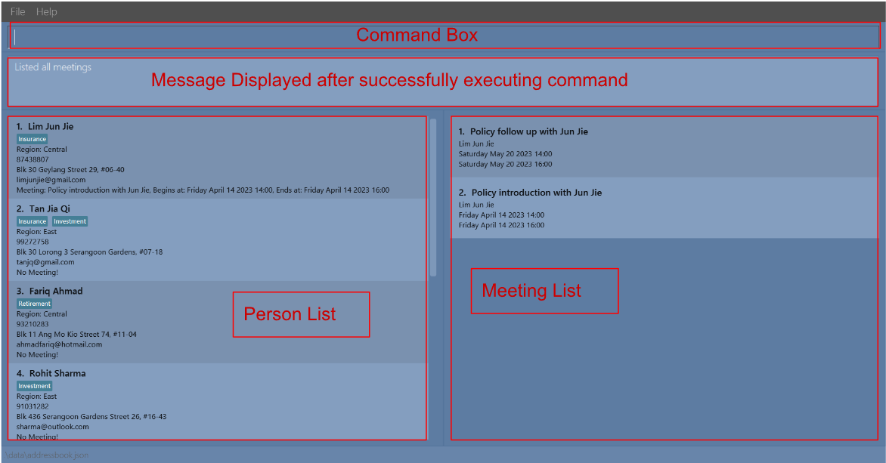
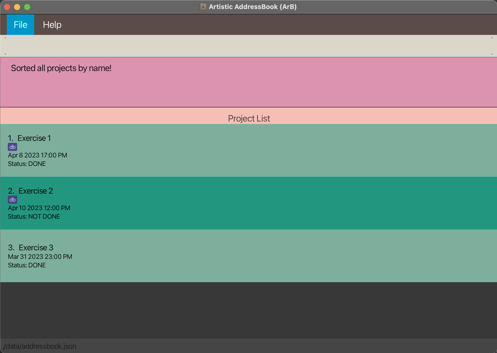

Artistic Addressbook (ArB) is a **desktop app for artists, meant to help with efficiently managing clients and project information**. It is optimized for use via keyboard commands that you can enter quickly and easily while displaying your data in an appealing and well-organised visual format so you can always find what you need. If you can type fast, ArB can get your client and project management tasks done faster than other applications that only use the mouse.

## **Table of Contents**
{:toc}
* [Quick Start](#quick-start)
* [Detailed Setup Guide](#detailed-setup)
* [Command Format](#command-format)
* [Prefixes](#prefixes)
* [Command Summary](#command-summary)
* [Features](#features)
  * [Client Commands](#client-commands)
  * [Project Commands](#project-commands)
  * [Tag Commands](#tag-commands)
  * [General Commands](#general-commands)
* [FAQ](#faq)

--------------------------------------------------------------------------------------------------------------------

## **Quick start**

1. Ensure you have [Java `11`](https://www.oracle.com/sg/java/technologies/javase/jdk11-archive-downloads.html) or above installed in your Computer.

1. Download the latest `arb.jar` from [here](https://github.com/AY2223S2-CS2103T-T14-1/tp/releases).

1. Copy the file into a new folder. For example, you can create a new folder in your desktop folder called `ArB` and place the file there.

1. Open a command terminal ([Windows](https://www.howtogeek.com/235101/10-ways-to-open-the-command-prompt-in-windows-10/), [Mac](https://support.apple.com/en-sg/guide/terminal/apd5265185d-f365-44cb-8b09-71a064a42125/mac#:~:text=Terminal%20for%20me-,Open%20Terminal,%2C%20then%20double%2Dclick%20Terminal), [Linux](https://www.makeuseof.com/how-to-open-terminal-in-linux/#:~:text=Use%20Keyboard%20Shortcuts%20to%20Open%20the%20Linux%20Terminal&text=If%20you%20are%20a%20fan,to%20fire%20up%20the%20terminal)).<br>
   Use the [`cd` command](https://www.ibm.com/docs/en/aix/7.1?topic=c-cd-command) to navigate to the folder you placed the jar file in. Following the previous example, you can type `cd Desktop/ArB` into the command terminal.<br>
   Then use the `java -jar arb.jar` command to run the application.<br>
   A window similar to the below should appear in a few seconds. The app will contain some sample data if being opened for the first time.<br>
   <br><br>
   Below is the same window annotated to show what each part is for.<br>
   

1. Type a command in the command box and press Enter to execute it. e.g. typing **`help`** and pressing Enter will open the help window.<br>
   Some example commands you can try:

   * `list-client` : Lists all clients.

   * `list-project`: Lists all projects.

   * `add-client name/John Doe phone/98765432 email/johnd@example.com` : Adds a client named `John Doe` to the ArB.

   * `delete-client 3` : Deletes the 3rd client shown in the current client list.

   * `exit` : Exits the app.

1. Refer to the [Features](#features) below for details of each command.

--------------------------------------------------------------------------------------------------------------------
[<small>Back to top</small>](#table-of-contents)

## **Command format**

* All command formats given in this user guide come in the form of `command-word additional-details`.
<br>Example:<br>


* Additional details come in the form of `prefix/detail`, where detail is in UPPER_CASE and is to be supplied by the user, and [prefix](#command-summary) indicates what detail is being provided.
<br>Example:<br>


* Additional details in square brackets are optional. Additional details in angle brackets are required and must be supplied by the user.
<br>Example:<br>


* Additional details with * after them can be used multiple times, including zero times.
<br>Example:<br>
<br>
In the example above, `[tag/TAG]*` can be used as `‎` (i.e. 0 times), `tag/friend`, `tag/friend tag/family` etc.

* Some command formats require an index to be provided. This is the index of the object of interest in the currently displayed list. The index must be a positive integer 1, 2, 3, …
<br>Example:<br>

* All command-words are case-insensitive.

* Additional notes:
    * Additional details can be given in any order.
      <br>
      Example: If the command specifies `name/NAME phone/PHONE_NUMBER`, `phone/PHONE_NUMBER name/NAME` is also acceptable.

    * If some detail is expected only once in the command, but it has been specified multiple times, only the last occurrence will be taken.
      <br>
      Example: If you specify `phone/12341234 phone/56785678`, only `phone/56785678` will be taken.

    * Extraneous details for commands that do not take in any (such as `help`, `list-client`, `list-project`, `list-tag`, `exit`, `clear-client`, `clear-project` and `sort-client`) will be ignored.
      <br>
      Example: If the command specifies `help 123`, it will be interpreted as `help`.
  
    * Extraneous details for commands that take in only one (such as `delete-client`) will be ignored.
      <br>
      Example: If the command specifies `delete-client 1 abc` it will be interpreted as `delete-client 1`.
  
    * Most command words and prefixes have shorter short forms that can be used the same way, so that you can complete the same tasks faster once you’re used to the app. For example, `list-project` has the short form `lp` and `name/` has the short form `n/`.
      <br>
      Example: Specifying `list-project` is the same as specifying `lp` and specifying `add-project name/John Doe` is the same as specifying `add-project n/John Doe`.

### **Prefixes**

| Prefix      | Short form | Description                                                                                  |
|-------------|------------|----------------------------------------------------------------------------------------------|
| `name/`     | `n/`       | Name of client/project                                                                       |
| `email/`    | `e/`       | Email address                                                                                |
| `phone/`    | `p/`       | Phone number                                                                                 |
| `deadline/` | `d/`       | Deadline for project ('DD-MM-YY' or natural language such as 'tomorrow' and '3pm next week') |
| `price/`    | `pr/`      | Price of project (0 or 2 decimals)                                                           |
| `tag/`      | `t/`       | Alphanumeric tag                                                                             |
| `client/`   | `c/`       | Keywords to search for client to link to a project                                           |
| `option/`   | `o/`       | Option to sort projects with                                                                 |
| `start/`    | `s/`       | Start of timeframe for finding projects                                                      |
| `end/`      | `e/`       | End of timeframe for finding projects                                                        |
| `status/`   | `st/`      | Status for finding projects                                                                  |

<br>

--------------------------------------------------------------------------------------------------------------------
[<small>Back to top</small>](#table-of-contents)

## Command summary

| Action                        | Short Form | Format, Examples                                                                                                                                                      |
|-------------------------------|------------|-----------------------------------------------------------------------------------------------------------------------------------------------------------------------|
| **List Clients**              | `lc`       | `list-client`                                                                                                                                                         |
| **Add a Client**              | `ac`       | `add-client <name/NAME> [email/EMAIL] [phone/PHONE_NUMBER] [tag/TAG]*​` <br> e.g., `add-client name/Bob phone/12345678 email/bob@gmail.com tag/friend`                |
| **Edit a Client**             | `ec`       | `edit-client <index> [name/NAME] [email/EMAIL] [phone/PHONE] [tag/TAG]*​` <br> e.g.,`edit-client 3 name/Alice Risa phone/1234 tag/classmate`                          |
| **Delete a Client**           | `dc`       | `delete-client <index>`<br> e.g., `delete-client 1`                                                                                                                   |
| **Clearing the Client List**  | `cc`       | `clear-client`                                                                                                                                                        |
| **Finding a Client**          | `fc`       | `find-client [name/NAME]* [tag/TAG]*` <br> e.g., `find-client name/bob name/alice tag/friend`                                                                         |
| **Sorting all Clients**       | `sc`       | `sort-client`                                                                                                                                                         |
| **List Projects**             | `lp`       | `list-project`                                                                                                                                                        |
| **Add a Project**             | `ap`       | `add-project <name/NAME> [deadline/DEADLINE] [price/PRICE] [tag/TAG]*` <br> e.g., `add-project name/Background Commission deadline/2023-05-05 price/400 tag/painting` |
| **Edit a Project**            | `ep`       | `edit-project <index> [name/NAME] [deadline/DEADLINE] [price/PRICE] [tag/TAG]*` <br> e.g., `edit-project 2 name/The Starry Night`                                     |
| **Delete a Project**          | `dp`       | `delete-project <index>`<br> e.g., `delete-project 1`                                                                                                                 |
| **Mark a Project**            | `mp`       | `mark <index>` <br> e.g., `mark 3`                                                                                                                                    |
| **Unmark a Project**          | `up`       | `unmark <index>` <br> e.g., `unmark 3`                                                                                                                                |
| **Clearing the Project List** | `cp`       | `clear-project`                                                                                                                                                       |
| **Finding a Project**         | `fp`       | `find-project [name/NAME]* [start/START] [end/END] [tag/TAG]* [status/STATUS]` <br> e.g., `find-project name/sky start/yesterday tag/painting`                        |
| **Sorting all Project**       | `sp`       | `sort-project option/Option` <br> e.g., `sort-project option/name`                                                                                                    |

--------------------------------------------------------------------------------------------------------------------
[<small>Back to top</small>](#table-of-contents)

## **Features**

## Client commands

The available client-related commands are:
* [List all clients](#listing-all-clients)
* [Add a client](#adding-a-client)
* [Edit a client](#editing-a-client)
* [Delete a client](#deleting-a-client)
* [Clear client list](#clearing-the-client-list)
* [Find clients](#finding-clients)
* [Sort clients](#sorting-all-clients)


### Listing all clients
#### Format: `list-client`

Short form: `lc`

Lists out all clients and shows the client list.


### Adding a client
#### Format: `add-client <name/NAME> [email/EMAIL] [phone/PHONE] [tag/TAG]*`

Short form: `ac <n/NAME> [e/EMAIL] [p/PHONE] [t/TAG]*`

Adds a client to the application with the supplied details. The details that can be supplied are the name, email address and phone number of the client, along with any number of tags to be added.

Only the name of the client is compulsory.

The email address and phone number must be in a valid format. E.g. `XXX@gmail.com` or ```XXX@yahoo.com``` for emails and `12345678` for phone numbers.

Note:
* each tag to be added needs a separate `tag/TAG` prefix.
* Empty prefixes for optional details will be ignored.

Examples:
* `add-client name/Bob phone/12345678 email/bob@gmail.com tag/friend tag/default`
* `add-client name/Alice`
* `add-client name/Clary phone/87654321 email/clary@gmail.com`

### Editing a client
#### Format: `edit-client <index> [name/NAME] [email/EMAIL] [phone/PHONE] [tag/TAG]*`

Short form: `ec <index> [n/NAME] [e/EMAIL] [p/PHONE] [t/TAG]`

Edits the client at the given index of the **currently visible** client list, changing only the given details. Any prefixes that are provided but left empty will delete the corresponding detail of the client (apart from the name).

Details that can be changed:
* Name
* Email address
* Phone number
* Tags

Note:
* Provided details will overwrite existing ones entirely. E.g. `ec <index> tag/Friend` will change the client displayed at `<index>` to only have the tag `Friend`.
* Using an empty `tag/` prefix removes all tags of the client. This cannot be used with any non-empty `tag/` prefixes e.g. `edit-client 1 tag/ tag/friend` is not valid.
* At least one detail to edit must be provided.
* If used when a subset of clients is visible (e.g. due to a previous `find-client` command), the index provided is based on the currently displayed subset only. 

Examples:
*  `edit-client 1 email/new@email.com` Edits the email address of the 1st displayed client to be `new@email.com`.
*  `edit-client 3 name/Alice Risa phone/1234 tag/` Edits the name of the 3rd displayed client to `Alice Risa` and phone number to `1234`. Removes any tags.
*  `edit-client 1 phone/` Removes the phone number of the 1st displayed client.

### Deleting a client
#### Format: `delete-client <index>`

Short form: `dc <index>`

Deletes the client at the specified index of the **currently visible** client list.

Note:
* The index **must be a positive integer** 1, 2, 3, …​
* If used when a subset of clients is visible (e.g. due to a previous `find-client` command), the index provided is based on the currently displayed subset only.
* A client list needs to be shown for this command to be executed successfully.

<div markdown="span" class="alert alert-warning">:exclamation: **Caution:**
This command cannot be undone. A deleted client cannot be restored.
</div>

Example:
*  `list-client` followed by `delete-client 1` deletes the first client in the list (if there is one).

### Clearing the client list
#### Format: `clear-client`

Short form: `cc`

Deletes all clients in the client list.

Note:
* A client list needs to be shown for this command to be executed successfully.

<div markdown="span" class="alert alert-warning">:exclamation: **Caution:**
This command cannot be undone. All deleted clients cannot be restored.
</div>

### Finding clients
#### Format: `find-client [name/NAME]* [tag/tag]*`

Short form: `fc [n/NAME] [t/TAG]*`

Finds a client based on the details provided. Details that can be supplied are the names and tags.

Note:
* The matching with supplied names and tags are case-insensitive.
* Names and tags can either be separated by spaces or prefixes. E.g. `name/alice bob` is the same as `name/alice name/bob`
* Invalid names and tags will be ignored. E.g. `name/alice name/!!! name/` is treated the same as `name/alice`

<div markdown="block" class="alert alert-info">

:information_source: Can't find what you're looking for? You can find some tips in the [FAQ](#faq)!

</div>

Examples:
* `find-client name/bob tag/friend` will find any client whose name contains the word `bob` and is tagged with `friend`.
* `find-client name/bob name/alice tag/friend tag/husband` will find any client whose name contains either `bob` or `alice`, and is tagged with either `friend` or `husband`.

### Sorting clients
#### Format: `sort-client`

Short form: `sc`

Sorts the **currently visible** clients by name in ascending order.

Example:

Original List


Run `find-client name/bob`


Run `sort-client`


[<small>Back to top</small>](#table-of-contents)

## Project commands

The available project-related commands are:
* [List all projects](#listing-all-projects)
* [Add a project](#adding-a-project)
* [Edit a project](#editing-a-project)
* [Delete a project](#deleting-a-project)
* [Mark a project as done](#marking-a-project-as-done)
* [Mark a project as not done](#marking-a-project-as-not-done)
* [Clear project list](#clearing-the-project-list)
* [Find projects](#finding-projects)
* [Sort projects](#sorting-all-projects)
* [Link a project to a client](#linking-a-project-to-a-client)

### Listing all projects
#### Format: `list-project`

Short form: `lp`

Lists out all projects and shows the project list.


### Adding a project
#### Format: `add-project <name/NAME> [deadline/DEADLINE] [price/PRICE] [tag/TAG]* [client/CLIENT]*`

Short form: `ap <n/NAME> [d/DEADLINE] [p/PRICE] [t/TAG]* [c/CLIENT]*`

Adds a project to the application with the supplied details. The details that can be supplied are the name, deadline, price, tags and linked client of the project.

Only the name of the project is compulsory.

Deadline can either be in natural language, such as `tomorrow` or in recognisable formats like `3pm 2023-03-03`.

Price must be a positive number given in 0 or 2 decimal places.

Clients: Linking a project to a client means the project is for a certain client. You might do this if a specific client commissions a project. 
The project can be linked to a client by specifying individual keywords that are part of the client's name in the command after the `client/` prefix. If any such details are mentioned, the app will enter link mode. Further steps can be found [here](#linking-a-project-to-a-client).

Note:
* Each tag to be added needs a separate `tag/TAG` prefix.
* Client name keywords can be separated by either spaces or a prefix e.g. `client/alice client/wheeler` is the same as `client/alice wheeler`.
* Invalid client name keywords will be ignored. E.g. `client/alice client/!!! Client/` is treated the same as `client/Alice`.
* Empty prefixes for optional details will be ignored.

Examples:
* `add-project name/Background Commission deadline/2023-05-05 price/500 tag/painting client/alice client/wheeler` Adds a project with the name Background Commision, a deadline of 5th May 2023, a price of $500, is tagged painting; and links this project to a client whose name contains any of the keywords `alice` or `wheeler`.
* `add-project name/Oil Painting`
* `ap n/Background Commission d/2023-05-05 pr/500 t/painting c/alice c/wheeler`

### Editing a project
#### Format: `edit-project <index> [name/NAME] [deadline/DEADLINE] [price/PRICE] [client/CLIENT]`

Short form: `ep <index> [n/NAME] [d/DEADLINE] [p/PRICE] [c/CLIENT]`

Edits the project at the given index of the **currently visible** client list, changing only the given details. Any prefixes that are provided but left empty will delete the corresponding detail of the project (apart from the name).

Fields that can be changed:
* Name
* Deadline
* Price
* Tags
* Linked client

Note:
* Using an empty `tag/` prefix removes all tags of the project. This cannot be used with any non-empty `tag/` prefixes e.g. `edit-project 1 tag/ tag/painting` is not valid.
* Using an empty `client/` prefix removes the linked client of the project. This cannot be used with any non-empty `client/` prefixes e.g. `edit-project 1 client/ client/alice` is not valid.
* Client name keywords can be separated by spaces or prefixes. E.g. `name/alice bob` is the same as `name/alice name/bob`
* Invalid client name keywords will be ignored.
* At least one detail to edit must be provided.
* If used when a subset of projects is visible (e.g. due to a previous `find-project` command), the index provided is based on the currently displayed subset only.
* A project list must be shown for this command to be executed successfully.

The steps to link to a client can be found [here](#linking-a-project-to-a-client).

Example:
*  `edit-project 2 name/The Starry Night tag/` Edits the name of the 2nd project in the list to be `The Starry Night` and removes all tags.
* `edit-project 2 client/alice` Links the 2nd project in the list to a client whose name contains the keyword `alice`.
* `ep 2 n/The Starry Night pr/500`

### Deleting a project
#### Format: `delete-project <index>`

Short form: `dp <index>`

Deletes the project at the specified index of the **currently visible** project list.

Notes:
* The index refers to the index number shown in the displayed project list.
* The index **must be a positive integer** 1, 2, 3, …​
* If used when a subset of projects is visible (e.g. due to a previous `find-project` command), the index provided is based on the currently displayed subset only.

Example:
*  `list-project` followed by `delete-project 1` deletes the first project in the list (if there is one).

### Marking a project as done
#### Format: `mark <index>`

Short form: `mp <index>`

Marks the project at the specified index of the **currently visible** project list as done.

Notes:
* The index refers to the index number shown in the displayed list of projects.
* The index **must be a positive integer** 1, 2, 3, …​
* If used when a subset of projects is visible (e.g. due to a previous `find-project` command), the index provided is based on the currently displayed subset only.

Examples:
* `list-project` followed by `mark 2` marks the 2nd project in the list of projects as done.

### Marking a project as not done
#### Format: `unmark <index>`

Short form: `up <index>`

"Un-marks" the project at the specified index of the **currently visible** project list, indicating that it is not done.

Notes:
* The index refers to the index number shown in the displayed list of projects.
* The index **must be a positive integer** 1, 2, 3, …​
* If used when a subset of projects is visible (e.g. due to a previous `find-project` command), the index provided is based on the currently displayed subset only.

Examples:
* `list-project` followed by `unmark 2` indicates that the 2nd project in the list of projects is not done.

### Clearing the project list
#### Format: `clear-project`

Short form: `cp`

Deletes all projects in the project list.

Note:
* A project list needs to be shown for this command to be executed successfully.

<div markdown="span" class="alert alert-warning">:exclamation: **Caution:**
This command cannot be undone. All deleted projects cannot be restored.
</div>

### Finding projects
#### Format: `find-project [name/NAME]* [start/START] [end/END] [price/PRICE] [status/STATUS] [tag/TAG]* [client/CLIENT]*`

Short form: `fp [n/NAME]* [s/START] [e/END] [p/PRICE] [st/STATUS] [t/TAG]* [c/CLIENT]*`

Finds a project based on details provided. Details that can be supplied are the name, the start and end of the timeframe the deadline of the project should fall into, price, tags, the client the project is linked to, and the status of the project.

Note:
* The matching with supplied names and tags are case-insensitive.
* Project names, tags and linked client names can either be separated by spaces or prefixes. E.g. `name/alice bob` is the same as `name/alice name/bob`
* Invalid project names, tags and linked client names will be ignored. E.g. `name/alice name/!!! name/` is treated the same as `name/alice`.
* Status must be specified as either `not done`/`nd` or `done`/`d`. Overdue projects are included in "not done".
* At least one valid parameter must be provided.

<div markdown="block" class="alert alert-info">

:information_source: Can't find what you're looking for? You can find some tips in the [FAQ](#faq)!

</div>

Examples:
* `find-project name/sculpture client/alice` will find any project whose name contains `sculpture` and is linked to a client whose name contains `alice`.
* `find-project tag/personal start/yesterday end/tomorrow` will find any project that is tagged `personal`, has a price of $500, and has a deadline that falls between yesterday and tomorrow.
* `find-project status/not done` will find any project that is not done, including overdue ones.

### Sorting all projects
#### Format: `sort-project <option/Option>`

Short form: `sp <o/OPTION>`

Sorts all **currently visible** projects in ascending order by the specified option. The below options are accepted:
* Name
* Deadline
* Price

Note:
* Option matching is case-insensitive

Example:

Original List:


Run `find-project name/exercise`


Run `sort-project option/name`


### Linking a Project to a Client

This is only applicable if ArB has entered link mode, as instructed in the commands for [adding a project](#adding-a-project) or [editing a project](#editing-a-project).

ArB will display a list of clients that match the
keywords you provided in your command.<br>
For example, if `add-project name/oil painting client/alice` was entered, you might see something similar to the window below.


To choose a client in the displayed list to link to the project, you can enter an index.<br>
Following from the previous example, if `1` was entered, the project `oil painting` will be linked to the client `Alice Zheng`, as shown in the image below.


Entering `0` will cancel the linking operation, but the previously added or edited project will remain.<br>
Following from the previous example, if `0` was entered, the project `oil painting` will still be created, but it will not be linked to any client, as shown in the image below.


Examples:
* `1` links the 1st client in the shown list of clients
* `0` cancels the linking operation and returns to the project list

## Tag commands

### Listing all tags
#### Format: `list-tag`

Short form: `lt`

Lists all tags that exist in the ArB and shows the tag list. These include tags added to both clients and projects. The list shows how many clients and how many projects a particular tag is used with.


## General commands

### Viewing help
#### Format: `help`

Shows a message explaining how to access the help page (this guide).


### Exiting the program
#### Format: `exit`

Exits the program.

### Saving the data

ArB's data is saved in the hard disk automatically after any command that changes the data. There is no need to save manually.

### Editing the data file

ArB's data is saved as a [JSON file](https://docs.fileformat.com/web/json/) named `arb.json`, found in a folder named `data`, as shown in the image below.


Advanced users are welcome to update data directly by editing the JSON file.

<div markdown="span" class="alert alert-warning">:exclamation: **Caution:**
If your changes to the data file makes its format invalid, ArB will discard all data and start with an empty data file at the next run.
</div>

--------------------------------------------------------------------------------------------------------------------
[<small>Back to top</small>](#table-of-contents)

## FAQ

**Q**: How do I transfer my data to another Computer?<br>
**A**: [Install](#quick-start) the app in the other computer and overwrite the empty JSON file it creates with the JSON file that contains your previous data.

**Q**: I can't seem to find what I want using the `find commands`. What can I do?<br>
**A**: Here are some tips for when you can’t find what you’re looking for:
* If too many results are shown, you can provide more parameters to narrow down the search scope.
* If what you’re looking for is not among the results shown, you can provide fewer parameters to broaden the search scope.

