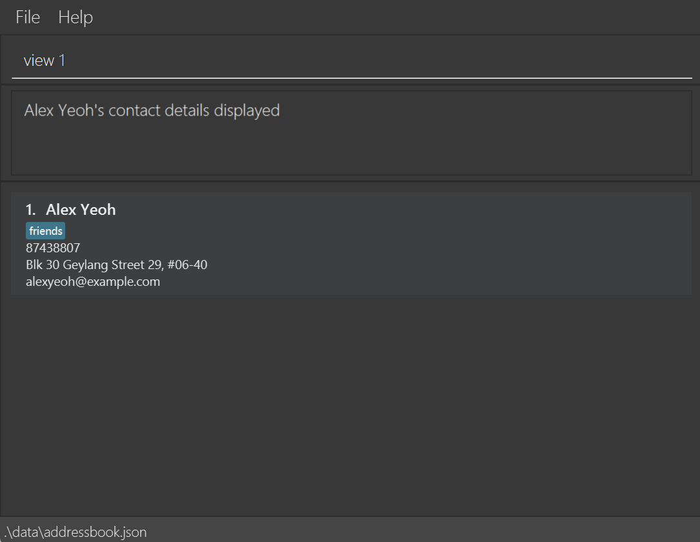
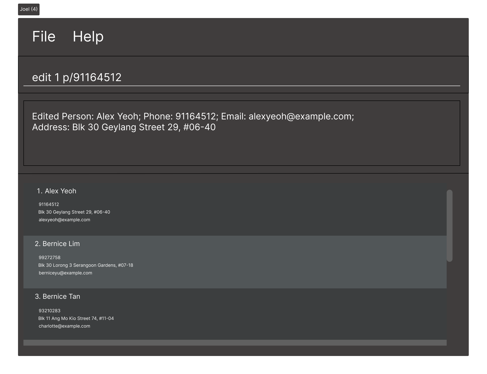
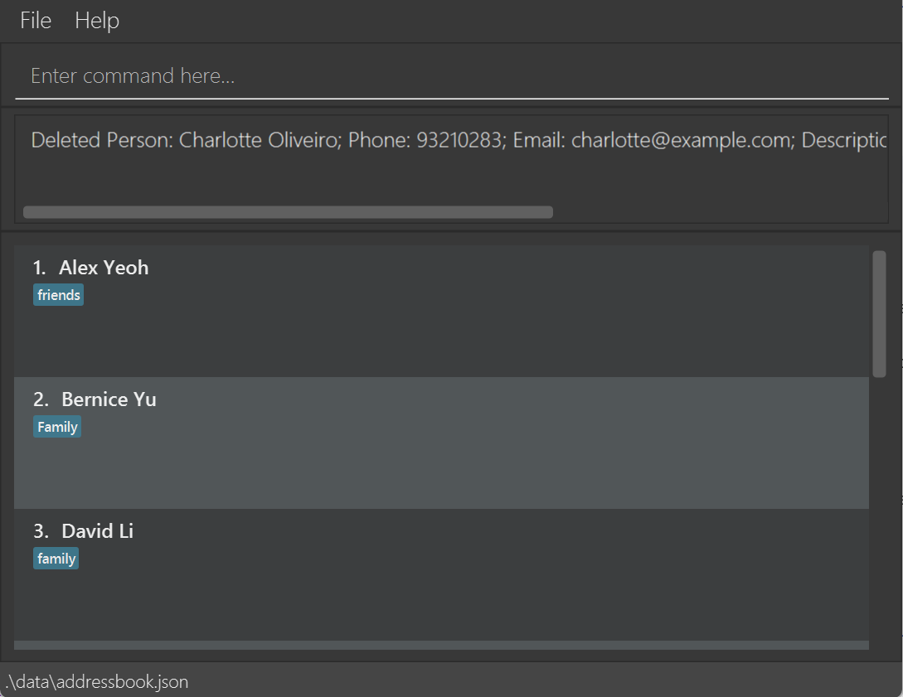

MODCheck is a **desktop app for managing contacts, optimized for use via a Command Line Interface** (CLI) while still having the benefits of a Graphical User Interface (GUI). If you can type fast, MODCheck can get your contact management tasks done faster than traditional GUI apps.

* Table of Contents
{:toc}

--------------------------------------------------------------------------------------------------------------------

## Quick start

1. Ensure you have Java `11` or above installed in your Computer.

2. Enter your desired command into the box and press `Enter`  
3. A GUI similar to the below should appear in a few seconds. Note how the app contains some sample data. 
   

1. Type the command in the command box and press Enter to execute it. e.g. typing **`help`** and pressing Enter will open the help window. 
   Some example commands you can try:

   * `list` : Lists all contacts.

   * `add n/John Doe p/98765432 e/johnd@example.com a/John street, block 123, #01-01` : Adds a contact named `John Doe` to ModCheck.

   * `delete 3` : Deletes the 3rd contact shown in the current list.

   * `clear` : Deletes all contacts.

   * `exit` : Exits the app.

1. Refer to the [Features](#features) below for details of each command.

--------------------------------------------------------------------------------------------------------------------

## Features

**:information_source: Notes about the command format:** 

* Words in `UPPER_CASE` are the parameters to be supplied by the user. 
  e.g. in `add n/NAME`, `NAME` is a parameter which can be used as `add n/John Doe`.

* Items in square brackets are optional. 
  e.g `n/NAME [t/TAG]` can be used as `n/John Doe t/friend` or as `n/John Doe`.

* Items with `…`​ after them can be used multiple times including zero times. 
  e.g. `[t/TAG]…​` can be used as ` ` (i.e. 0 times), `t/friend`, `t/friend t/family` etc.

* Parameters can be in any order. 
  e.g. if the command specifies `n/NAME p/PHONE_NUMBER`, `p/PHONE_NUMBER n/NAME` is also acceptable.

* If a parameter is expected only once in the command but you specified it multiple times, only the last occurrence of the parameter will be taken. 
  e.g. if you specify `p/12341234 p/56785678`, only `p/56785678` will be taken.

* Extraneous parameters for commands that do not take in parameters (such as `help`, `list`, `exit` and `clear`) will be ignored. 
  e.g. if the command specifies `help 123`, it will be interpreted as `help`.

### Viewing help : `help`

Shows a message explaning how to access the help page.

Format: `help`

### Adding a person: `add`

Adds a person contact details to ModCheck.

Compulsory Fields:
* `n/` : name of the person
* `d/` : description of the person
* `e/` : email 
* `p/` : phone number

Additional Fields:
* `t/` : tags 
* `m/` : module codes

:bulb: **Tips:**

A person can have any number of tags or modules (including 0)

The order of the fields is not important.

Examples:
* `add n/John d/Important friend e/leomessi@psg.com p/98101010`
* `add n/Gray d/Coolest Prof ever e/SIUUUUUU@gmail.com p/98070707 t/Prof m/CS2103 m/CS3230`

### Listing all persons : `list`

Shows a list of all persons in ModCheck.

Format: `list`

### Viewing a person's contact details : `view`

View a person's contact details.

Format: `view <index>`

Examples: 
* `view 1` returns the contact details of the first person in the list

### Editing a person : `edit`

Edits an existing person in ModCheck.

Format: `edit INDEX [n/NAME] [p/PHONE] [e/EMAIL] [a/ADDRESS] [t/TAG]…​`

* Edits the person at the specified `INDEX`. The index refers to the index number shown in the displayed person list. The index **must be a positive integer** 1, 2, 3, …​
* At least one of the optional fields must be provided.
* Existing values will be updated to the input values.
* When editing tags, the existing tags of the person will be removed i.e adding of tags is not cumulative.
* You can remove all the person’s tags by typing `t/` without
    specifying any tags after it.

Examples:
*  `edit 1 p/91164512` Edits the phone number of the 1st person to be `91164512`.
*  `edit 3 p/90011009 e/bernice512@example.com` Edits the phone number and email address of the 3rd person to be 
   90011009 and bernice512@example.com respectively

### Locating persons by name: `find`

Finds persons whose names contain any of the given keywords.

Format: `find KEYWORD [MORE_KEYWORDS]`

* The search is case-insensitive. e.g `hans` will match `Hans`
* The order of the keywords does not matter. e.g. `Hans Bo` will match `Bo Hans`
* Only the name is searched.
* Only full words will be matched e.g. `Han` will not match `Hans`
* Persons matching at least one keyword will be returned (i.e. `OR` search).
  e.g. `Hans Bo` will return `Hans Gruber`, `Bo Yang`

Examples:
* `find John` returns `john` and `John Doe`
* `find alex david` returns `Alex Yeoh`, `David Li` 
  

### Deleting a person : `delete`

Deletes the specified person from ModCheck.

Format: `delete INDEX`

* Deletes the person at the specified `INDEX`.
* The index refers to the index number shown in the displayed person list.
* The index **must be a positive integer** 1, 2, 3, …​

Examples:
* `find Betsy` followed by `delete 1` deletes the 1st person in the results of the `find` command.
* `list` followed by `delete 3` deletes the 3rd person in the list.

### Clearing all entries : `clear`

Clears all entries from ModCheck.

Format: `clear`

Examples: 
* `list` followed by `clear` deletes all the contacts in the list.
  

### Exiting the program : `exit`

Exits the program.

Format: `exit`

### Saving the data

MODCheck data are saved in the hard disk automatically after any command that changes the data. There is no need to save manually.

### Editing the data file

MODCheck data are saved as a JSON file. Advanced users are welcome to update data directly by editing that data file.

:exclamation: **Caution:**
If your changes to the data file makes its format invalid, MODCheck will discard all data and start with an empty data file at the next run.

### Filtering contacts

Filters the contacts based on the arguments provided.

Formats: 
1. `filter n/NAME`
2. `filter p/PHONE_NUMBER`
3. `filter e/EMAIL_ADDRESS`
4. `filter d/DESCRIPTION`
5. `filter t/TAG`

Examples:

* `filter n/Alex` returns `1 contacts listed!`
* `filter n/Alex Bernice` returns `2 contacts listed!`
* The search is case-insensitive. e.g hans will match Hans
* The order of the keywords does not matter. e.g. Hans Bo will match Bo Hans
* Only the name is searched.
* Only full words will be matched e.g. Han will not match Hans
* Persons matching at least one keyword will be returned (i.e. OR search). e.g. Hans Bo will return Hans Gruber, Bo Yang

  
* `filter p/91031282` returns `1 contacts listed!`

  
* `filter e/royb@example.com` returns `1 contacts listed!`

  
* `filter d/helpful` returns `1 contacts listed!`
* `filter d/helpful Newgate` returns `2 contacts listed!`
* The search is case-sensitive. e.g Helpful will match Helpful and not helpful
* The order of the keywords does not matter. e.g. Helpful Newgate will match Newgate Helpful
* Only the description is searched.
* Only full words will be matched.
* Contacts matching at least one keyword will be returned (i.e. OR search). e.g. Helpful roommate will return Helpful, Helpful friend, lazy roomate

  
* `filter t/family` returns `1 contacts listed`
* `filter t/family t/friends t/classmates` returns `3 contacts listed!`
* 

### Undo past commands

Undoes previous commands that modified ModCheck.
Undo will only undo commands that have successfully modified the data in ModCheck. For example, a successful `add`,
`edit`, or `delete` command can be undone by the undo command.
Any commands that does not modify the data in ModCheck will NOT be undone. This includes `view`, `find`, and other
similar commands. Any command that would have modified the data in ModCheck, but was unsuccessful in doing so (eg:
`add` duplicate person), will NOT be undone.

Chaining of a few undo commands is supported. Once the undo limit has been reached, the error message `No command to
undo!` will be shown.

Format: `undo`

Use `redo` to reapply the changes undone by undo.

--------------------------------------------------------------------------------------------------------------------

## FAQ

**Q**: How do I transfer my data to another Computer? 
**A**: Install the app in the other computer and overwrite the empty data file it creates with the file that contains the data of your previous MODCheck home folder.

--------------------------------------------------------------------------------------------------------------------

## Command summary

| Action     | Format, Examples                                                                                                                                                                                                                                                                      |
|------------|---------------------------------------------------------------------------------------------------------------------------------------------------------------------------------------------------------------------------------------------------------------------------------------|
| **Add**    | `add n/NAME p/PHONE_NUMBER e/EMAIL a/ADDRESS [t/TAG]…​`   e.g., `add n/James Ho p/22224444 e/jamesho@example.com a/123, Clementi Rd, 1234665 t/friend t/colleague`                                                                                                                 |
| **View**   | `view INDEX`  e.g., `view 2`                                                                                                                                                                                                                                                       |
| **Clear**  | `clear`                                                                                                                                                                                                                                                                               |
| **Delete** | `delete INDEX`  e.g., `delete 3`                                                                                                                                                                                                                                                   |
| **Edit**   | `edit INDEX [n/NAME] [p/PHONE_NUMBER] [e/EMAIL] [a/ADDRESS] [t/TAG]…​`  e.g.,`edit 2 n/James Lee e/jameslee@example.com`                                                                                                                                                           |
| **Find**   | `find KEYWORD [MORE_KEYWORDS]`  e.g., `find James Jake`                                                                                                                                                                                                                            |
| **List**   | `list`                                                                                                                                                                                                                                                                                |
| **Help**   | `help`                                                                                                                                                                                                                                                                                |
| **Filter** | `filter n/NAME`   `filter p/PHONE_NUMBER`  `filter e/EMAIL_ADDRESS`   `filter d/DESCRIPTION`   `filter t/TAG`   e.g. `filter n/Alex`   e.g. `filter p/91031282`   e.g. `filter e/royb@example.com`   e.g. `filter d/helpful`   e.g. `filter t/family`   |
| **Undo**   | `undo`                                                                                                                                                                                                                                                                                |
| **Redo**   | `redo`                                                                                                                                                                                                                                                                                |
