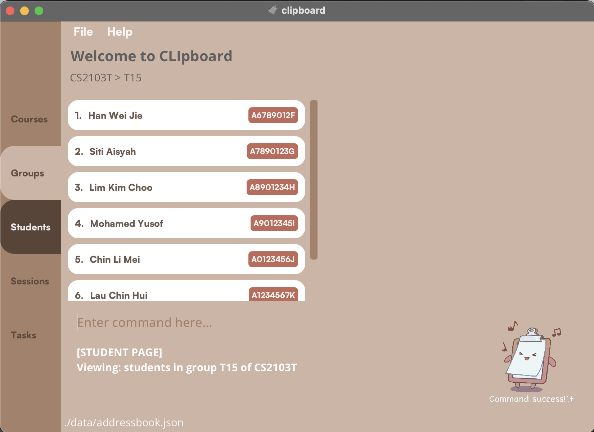

## Introduction

CLIpboard is a desktop app that helps educators (like you!), especially those that tutor multiple classes, by managing their students’ particulars<strong> in an organised manner.</strong>

CLIpboard is optimized **for use via a Command Line Interface** (CLI) while still having the benefits of a Graphical User Interface (GUI). It can get your student management tasks done faster than traditional GUI apps. CLIpboard is optimised for keyboard users, so if you can type fast, CLIpboard can work even faster.


--------------------------------------------------------------------------------------------------------------

## Table of Contents

- [Introduction](#introduction)
- [Table of Contents](#table-of-contents)
- [Quick Start](#quick-start)
- [Navigation Guide](#navigation-guide)
- [List of Commands](#commands)
    - [Course Page Commands](#course-page-commands)
    - [Group Page Commands](#group-page-commands)
    - [Students Page Commands](#students-page-commands)
    - [Session Page Commands](#session-page-commands)
    - [Attendance Page Commands](#attendance-page-commands)
    - [Task Page Commands](#task-page-commands)
    - [Grades Page Commands](#grades-page-commands)
    - [General Commands](#general-commands)

--------------------------------------------------------------------------------------------------------------

## Quick Start

1. Ensure you have Java 11 or above installed in your Computer.
2. Download the latest clipboard.jar from [here](https://github.com/AY2223S2-CS2103T-T15-4/tp/releases).
3. Copy the file to the folder you want to use as the *home folder* for your CLIpboard.
4. Open a command terminal, cd into the folder you put the jar file in, and use the `java -jar clipboard.jar` command to run the application.&nbsp;
<br>e.g. your clipboard.jar is stored in `user/app/task/`, you run `cd user/app/task/` then `java -jar clipboard.jar`
<br>A GUI similar to the above should appear in a few seconds. Note how the app contains some sample data.

5. Type the command in the command box and press Enter to execute it.
<br>e.g. typing `help` and pressing Enter will open the help window.
    <br>Some example commands you can try:
    1. `select 1` : Selects the first item in the list displayed in the list panel.
    2. `add student n/John Doe p/98765432 e/johnd@example.com sid/A1234567X` : Adds a student named John Doe with the particulars to the list at Student Page.
    3. `delete student 3` : Deletes the 3rd student shown in the student list when you are at Student Page.
    4. `undo` : Returns to the state before the last command you entered.
    5. `exit` : Exits the app.
6. Refer to the commands list below for a detailed description for each command.

--------------------------------------------------------------------------------------------------------------

## Navigation Guide

Moving between pages is easy with our navigation tools.
Simply use a combination of `select`, `back`, `session`, and `task` commands.
If you need more information on how to use these commands, just refer to our handy navigation guide below.


--------------------------------------------------------------------------------------------------------------

## Commands

List of commands:

-  [Course Page Commands: ](#course-page-commands)
    - [Adding a course: ](#adding-a-course-add-course) `add course`
    - [Deleting a course: ](#deleting-a-course-delete-course) `delete course`
    - [Editing a course: ](#editing-a-course-edit-course) `edit course`
    - [Selecting a course to display its Group Page: ](#selecting-a-course-select) `select`
- [Group Page Commands: ](#group-page-commands)
    - [Adding a group: ](#adding-a-group-add-group) `add group`
    - [Deleting a group: ](#deleting-a-group-delete-group) `delete group`
    - [Editing a group: ](#editing-a-group-edit-group) `edit group`
    - [Selecting a group to display its Student Page: ](#selecting-a-group-select) `select`
    - [Displaying sessions of a group: ](#displaying-sessions-of-a-group-session) `session`
    - [Displaying tasks of a group: ](#displaying-tasks-of-a-group-task) `task`
- [Students Page Commands: ](#students-page-commands)
    - [Adding a student: ](#adding-a-student-add-student) `add student`
    - [Deleting a student: ](#deleting-a-student-delete-student) `delete student`
    - [Editing a student: ](#editing-a-student-edit-student) `edit student`
    - [Copying a student's email: ](#copying-a-students-email-copy) `copy`
    - [Finding students by name or student ID: ](#finding-students-by-name-or-student-id-find-student) `find student`
    - [Displays a student's information:  ](#displays-a-students-information-select) `select`
    - [Adding or deleting a remark: ](#adding-or-deleting-a-remark-remark) `remark`
    - [Upload a student's photo: ](#uploading-a-students-photo-upload) `upload`
    - [Sorting list of students: ](#sorting-list-of-students-sort) `sort`
- [Session Page Commands: ](#session-page-commands)
    - [Adding a session: ](#adding-a-session-add-session) `add session`
    - [Deleting a session: ](#deleting-a-session-delete-session) `delete session`
    - [Editing a session: ](#editing-a-session-edit-session) `edit session`
    - [Selecting a session to start attendance-taking: ](#selecting-a-session-to-start-attendance-taking-select) `select`
- [Attendance Page Commands: ](#attendance-page-commands)
    - [Marking attendance of a selected students: ](#marking-selected-students-as-present-mark) `mark`
    - [Unmarking attendance of a selected students: ](#marking-selected-students-as-absent-unmark) `unmark`
    - [View the overall attendance of the session: ](#view-the-overall-attendance-of-the-session-attendance) `attendance`
- [Task Page Commands: ](#task-page-commands) 
    - [Adding a task: ](#adding-a-task-add-task) `add task`
    - [Deleting a task: ](#deleting-a-task-delete-task) `delete task`
    - [Editing a task: ](#editing-a-task-edit-task) `edit task`
    - [Selecting a task to assign grades: ](#selecting-a-task-to-assign-grades-select) `select`
- [Grades Page Commands: ](#grades-page-commands)
    - [Assigning a grade: ](#assigning-a-grade-to-student-assign) `assign`
- [General Commands: ](#general-commands)
    - [Displaying the home page (Course Page): ](#displaying-the-home-page-course-page-home) `home`
    - [Displaying the previous page you were at: ](#displaying-the-previous-page-you-were-at-back) `back`
    - [Undoing the last command you did: ](#undoing-the-last-command-you-did-undo) `undo`
    - [Opening help window: ](#opening-help-window-help) `help`
    - [Scrolling through command history: ](#scrolling-through-command-history-up-or-down-arrow-key) `UP` or `DOWN` arrow key
    - [Clearing all entries: ](#clearing-all-entries-clear) `clear`
    - [Exiting the program: ](#exiting-the-program-exit) `exit`


--------------------------------------------------------------------------------------------------------------
## Course Page Commands


### Adding a course: `add course`

Adds a course to the list of courses in the course page.

Format:
```
add course <COURSE>
```

- Adding a course with the same module code is not allowed.
    - For example, if a course with module code `CS2103T` already exists in CLIpboard, entering `add course CS2103T` will display an error message.

Examples:
- `add course CS2103T` will add a new course with module code `CS2103T`
- `add course CS2105` will add a new course with module code `CS2105`

[Back to list of commands](#commands)


### Deleting a course: `delete course`

Deletes a course from the list of courses in the course page.

Format:
```
delete course <INDEX>
```


Examples:
- `delete course 1` will delete the first course listed in the course list.

[Back to list of commands](#commands)


### Editing a course: `edit course`

Edits an existing course in the course list.

Format:
```
edit course <INDEX> <NEW COURSE NAME>
```

- Edits course at index specified in `<INDEX>`.


Examples:
- `edit course 1 CS2106` will rename the first course listed in the course list to `CS2106`.

[Back to list of commands](#commands)


### Selecting a course: `select`

Selects an existing course to display its corresponding Group Page.

Format:
```
select <INDEX>
```
- Selects course at index specified in `<INDEX>` and displays list of groups from that course.

Examples:
- `select 1` will display a list of groups from the first course.

[Back to list of commands](#commands)

--------------------------------------------------------------------------------------------------------------

## Group Page Commands


### Adding a group: `add group`

Adds a group to the list of groups in the group page.

Format:
```
add group <GROUP>
```

- Adding a group with the same group name is not allowed.
    - For example, if a group with group name `T15` already exists in CLIpboard, 
  entering `add group T15` will display an error message.

Examples:
- `add group T15` will add a new group with group name `T15`
- `add group L08` will add a new group with group name `L08`

[Back to list of commands](#commands)


### Deleting a group: `delete group`

Deletes a group from the list of groups in the group page.

Format:
```
delete group <INDEX>
```


Examples:
- `delete group 1` will delete first group listed in the group list panel of CLIpboard.

[Back to list of commands](#commands)


### Editing a group: `edit group`

Edits an existing group in the group list.

Format:
```
edit group <INDEX> <NEW GROUP NAME>
```

- Edits group at index specified in `<INDEX>`.


Examples:
- `edit group 1 T16` will rename the first group listed in the group list to `T16`.

[Back to list of commands](#commands)


### Selecting a group: `select`

Selects an existing group to display its corresponding Student Page.

Format:
```
select <INDEX>
```
- Selects group at index specified in `<INDEX>` and displays list of students in that group.

Examples:
- `select 1` will return a list of students from the first group.

[Back to list of commands](#commands)


### Displaying sessions of a group: `session`

Selects an existing group to display its corresponding Session Page.

Format:
```
session <INDEX>
```
- Selects group at index specified in `<INDEX>` and displays list of sessions in that group.

Examples:
- `session 1` will return a list of sessions from the first group.

[Back to list of commands](#commands)


### Displaying tasks of a group: `task`

Selects an existing group to display its corresponding Task Page.

Format:
```
task <INDEX>
```
- Selects group at index specified in `<INDEX>` and displays list of tasks assigned to that group.

Examples:
- `task 1` will return a list of tasks for the first group.

[Back to list of commands](#commands)

--------------------------------------------------------------------------------------------------------------

## Students Page Commands



### Adding a student: `add student`

Adds a student to the student roster.

Format:
```
add student n/<NAME> p/<PHONE_NUMBER> e/<EMAIL> sid/<STUDENT_ID>
```

- Adding a student with the same student ID is not allowed.
    - For example, if a student with a student ID of `A0123456X` already exists in CLIpboard, entering `add student n/Tom p/99887766 e/tom@example.com sid/A0123456X` will display an error message.

Examples:
- `add student n/Han Wei Jiew p/98765432 e/hanwj@example.com sid/A6789012F`
- `add student n/Siti Aisyah p/92624417 e/saisyah@example.com sid/A7890123G`

[Back to list of commands](#commands)


### Deleting a student: `delete student`

Deletes a student from the student roster.

Format:
```
delete student <INDEX>
```

Examples:
- `delete student 1` will delete the first student listed in the student list panel of CLIpboard.

[Back to list of commands](#commands)


### Editing a student: `edit student`

Did your student change their phone number or you realised you mispelled their name? Do not worry, because you can easily change this with the edit command.

Format:
```
edit student <INDEX> [n/<NAME>] [p/<PHONE_NUMBER>] [e/<EMAIL>] [sid/<STUDENT_NUMBER>]
```

- Edits student at index specified in `<INDEX>`.
- At least one field `[n/<NAME>]`, `[p/<PHONE_NUMBER>]`, `[e/<EMAIL>]` or `[sid/<STUDENT_NUMBER>]` must be provided.
- Fields entered following `edit <INDEX>` will replace the original fields.
- Fields not entered will not replace the original fields.

Examples:
- `edit student 1 n/John Doe` will replace the name of the first student listed in the student list to `John Doe`.
- `edit student 4 p/99887766 e/john@gmail.com` will replace the phone number and email of the fourth student listed in the student list to `99887766` and `john@gmail.com` respectively.

[Back to list of commands](#commands)


### Copying a student's email: `copy`

Copies a student's email to your clipboard.

Format:
```
copy <INDEX>
```

Examples:
- `copy 1` will copy the email of the first student in the list to your clipboard.

[Back to list of commands](#commands)


### Finding students by name or student ID: `find student`

Finds students whose names or student IDs contain any of the given keywords(s).

Format:
```
find student <KEYWORD> [<MORE_KEYWORDS>]
```

- You can find students using either name or student ID for the keyword(s).
- Keywords are separated by spaces.
- Student IDs of invalid format will not return any students
    - For example, `find student A1234` will not return the student with student ID A1234567X.
    

Examples:
- `find student John` returns John.
- `find student Alex Yu` returns `Alex Yeoh`, `Bernice Yu`. 

- `find A1234567X` returns the student whose student ID is A1234567X.

[Back to list of commands](#commands)


### Displays a student's information: `select`

Select a particular student and display his / her particulars.

Format:
```
select <INDEX>
```

Examples:
- `select 2` will select the 2nd student in the student list and display his / her particulars on the view panel.

[Back to list of commands](#commands)


### Adding or deleting a remark: `remark`

Add or delete a remark to/from a student in the student roster.

Format for adding a remark:
```
remark <INDEX> [r/<REMARK]
```

- Adds a remark to student in the student list whose index is specified in the `<INDEX>` field.

Format for deleting a remark:
```
remark <INDEX>
```

- Deletes a remark from a student in the student list whose index is specified in the `<INDEX>` field.

Examples:
- `remark 1 r/Loves watching Sci-Fi movies` will add a remark of 'Loves watching Sci-Fi movies' to the first student listed in the student list.
- `remark 2` will delete the remark from the second student listed in the student list.

[Back to list of commands](#commands)


### Uploading a student's photo: `upload`

Uploads a student's photo to be displayed on the student roster.

Format:
```
upload <LOCAL_FILE_PATH>
```
- File path must be an absolute file path to the photo.
- For student photo to be reflected to a specific student in CLIpboard, photo must be named after the said student's student ID (i.e. `<STUDENT_ID>.png`)
- If a new photo with the same name as an existing photo in CLIpboard is uploaded, existing photo will be replaced.
<div markdown="span" class="alert alert-primary">:bulb: **Tip:**
Only images of file type .png is accepted
</div>

Examples:
- `upload /Users/AlexYeoh/Desktop/A0123456X.png`

[Back to list of commands](#commands)


### Sorting list of students: `sort`

Sorts list of students in student roster.

Format:
```
sort <CATEGORY>
```

- Current possible categories are `name` and `id`

Examples:
- `sort name` will sort list of students alphabetically according to name.
- `sort id` will sort list of students alphanumerically according to student ID.

[Back to list of commands](#commands)


--------------------------------------------------------------------------------------------------------------

## Session Page Commands


### Adding a session: `add session`

Adds a session to the list of session in the session page.

Format:
```
add session <SESSION>
```

- Adding a session with the same session name is not allowed.
    - For example, if a session with name `Tutorial1` already exists in CLIpboard,
      entering `add session Tutorial1` will display an error message.
    - Note: whitespaces are not allowed in session names.

Examples:
- `add session Tutorial1`
- `add session Tutorial2`

[Back to list of commands](#commands)


### Deleting a session: `delete session`

Deletes a session from the list of session in the session page.

Format:
```
delete session <INDEX>
```


Examples:
- `delete session 1` will delete the first session listed in the session list panel of CLIpboard.

[Back to list of commands](#commands)


### Editing a session: `edit session`

Edits an existing session in the session list.

Format:
```
edit session <INDEX> <NEW SESSION NAME>
```

Examples:
- `edit session 1 Tutorial1` will rename the first session listed to `Tutorial1`.

[Back to list of commands](#commands)


### Selecting a session to start attendance-taking: `select`

Selects an existing session to start taking attendance for that session by displaying Student Page of that session on the right panel.

Format:
```
select <INDEX>
```
- Selects session at specified index and displays list of students in that session.

Examples:
- `select 1` will return a list of students from the first session.

[Back to list of commands](#commands)

--------------------------------------------------------------------------------------------------------------

## Attendance Page Commands


### Marking selected students as present: `mark`

Marks selected students' attendance as present for current session.

Format:
```
mark <INDEX>
mark <INDEX>, <INDEX>, ...
```

Examples:
- `mark 1` will mark the first student as present.
- `mark 2, 4, 5, 6` will mark the 2nd, 4th, 5th and 6th students as present.

[Back to list of commands](#commands)


### Marking selected students as absent: `unmark`

Marks selected students' attendance as absent for current session.

Format:
```
unmark <INDEX>
unmark <INDEX>, <INDEX>, ...
```

Examples:
- `unmark 1` will mark the first student as absent.
- `unmark 2,3,4` will mark the 2nd, 3rd and 4th students as absent.

[Back to list of commands](#commands)


### View the overall attendance of the session: `attendance`

Displays the overall attendance of the session you are at in the command box. (Pictured below.)


Format: 
```
attendance
```

[Back to list of commands](#commands)

--------------------------------------------------------------------------------------------------------------

## Task Page Commands


### Adding a task: `add task`

Adds a new task into the task page.

Format:
```
add task <TASK NAME>
```

- Adding a task with the same task name is not allowed.
    - For example, if a task with name `OP1` already exists in CLIpboard,
      entering `add task OP1` will display an error message.

Examples:
- `add task OP1`
- `add task Critical Reflection 1`

[Back to list of commands](#commands)


### Deleting a task: `delete task`

Deletes a task from the current list of tasks.

Format:
```
delete task <INDEX>
```


Examples:
- `delete task 1` will delete the first task listed.

[Back to list of commands](#commands)


### Editing a task: `edit task`

Edits an existing task in the task list.

Format:
```
edit task <INDEX> <NEW TASK NAME>
```


Examples:
- `edit task 1 CA5` will rename the first task listed to `CA5`.

[Back to list of commands](#commands)


### Selecting a task to assign grades: `select`

Selects an existing task to assign students their grades for that task, by displaying the Student Page on the right panel.

Format:
```
select <INDEX>
```
- Selects task at specified index and displays list of students with the task.

Examples:
- `select 1` will return a list of students who was assigned the first task on the list.

[Back to list of commands](#commands)


## Grades Page Commands


### Assigning a grade to student: `assign`
Assigns a grade to a student.

Format:
```
assign <INDEX> <GRADE>
```
- Assigns a grade to the student specified at `<INDEX>` as seen from the Student Page on the right.
- Grade must be a number between `0 and 100`, inclusive of `0 and 100`.

Examples:
- `assign 1 78` will assign the first student on the Student Page the grade of 78.
- `assign 3 0` will assign the third student on the Studet Page the grade of 0.

[Back to list of commands](#commands)


--------------------------------------------------------------------------------------------------------------

## General Commands
Commands that can be used on any page.

### Displaying the home page (Course Page): `home`

Goes back to the home page, which is the Course Page of CLIpboard.

Format:
```
home
```

[Back to list of commands](#commands)


### Displaying the previous page you were at: `back`

Goes back to the page you were at.

Format:
```
back
```

[Back to list of commands](#commands)


### Undoing the last command you did: `undo`

Deletes the change that your last command did.

Format:
```
undo
```

[Back to list of commands](#commands)


### Opening help window: `help`

Opens a window showing the list of commands available in the current page, as well as a link to this User Guide.

Format:
```
help
```

[Back to list of commands](#commands)


### Scrolling through command history: `UP` or `DOWN` arrow key

Scrolls through past commands in command box.

- Similar to Linux command-line interface, use the up or down arrow keys to scroll through previously typed commands in the command box.
- You may use the `LEFT` or `RIGHT` arrow keys to edit the command first.
- Press `ENTER` to execute the command.

[Back to list of commands](#commands)


### Clearing all entries: `clear`

Clears all entries in the student roster.

Format:
```
clear
```

[Back to list of commands](#commands)


### Exiting the program: `exit`

Exits the program.

Format:
```
exit
```

[Back to list of commands](#commands)

