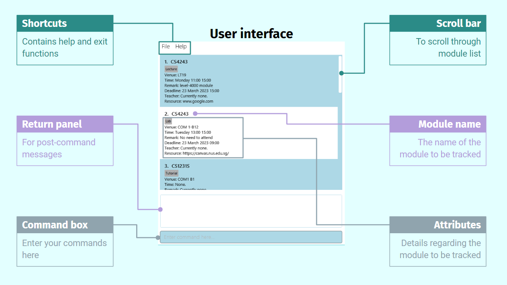

## About coNtactUS

Are you a NUS computing student who is struggling to keep track of your school modules? Are you feeling overwhelmed by the constant influx of weekly lectures, tutorials, deadlines and assignments? Are you finding it hard to keep your module resources and notes well-organised? Fret not! With coNtactUS, you can take the first step towards solving all of your problems. 

coNtactUS is a desktop application created by NUS computing students, specially for NUS computing students, just like you. It is a module tracker that lets you store information related to your modules like: 

1) Lecture and tutorial timeslots
2) Lecture and tutorial venues
3) Deadlines
4) Module official resources 
5) Module notes
6) Contact details of Professors and Teaching assistants

and more.... 

in a centralised location that is easily accessible by you, so you will not forget them ever again. 

What is even better is that coNtactUS is optimised for use via typing instead of clicking, which allows you to store and retrieve information faster than ever before. Now, you can become the most productive version of yourself, bringing you one step closer to achieving your goals. 

So, what are you waiting for? Read on to find out more about how to use coNtactUs in this user guide! 

--------------------------------------------------------------------------------------------------------------------
## About this user guide 

If this is the first time you are using coNtactUS, this user guide provides an excellent starting point for you to
familiarise yourself with the features of coNtactUS. It also shows you how to set up coNtactUS effortlessly
on your computer.

Alternatively, you may refer to the user guide to quickly view information regarding a particular feature that you are unsure of
how to use.

--------------------------------------------------------------------------------------------------------------------

## How to use this user guide

A [table of contents](#table-of-contents) is provided in this user guide, containing hyperlinks to each section of 
the user guide. You can simply click on a hyperlink to quickly navigate to the relevant section that you are interested in. 

Symbols are used in the user guide to facilitate your understanding of the content.

 :bulb: This indicates a useful tip that you may wish to take note of.
take note of. 

 :exclamation-mark: This indicates an important piece of information 
that you should pay attention to. 

--------------------------------------------------------------------------------------------------------------------
## Table of Contents

* [**About coNtactUS**](#about-contactus)
* [**About this User Guide**](#about-this-user-guide)
* [**How to use this User Guide**](#how-to-use-this-user-guide)
* [**Getting started**](#getting-started)
* [**Familiarising yourself with the user interface**](#familiarising-yourself-with-the-user-interface)
* [**Features**](#features)
  * [Modules](#modules)
    * [Adding a module: `add`](#adding-a-module--add)
    * [Editing a module: `edit`](#editing-a-module--edit)
    * [Listing all modules: `list`](#listing-all-modules--list)
    * [Finding a module: `find`](#finding-a-module--find)
    * [Deleting a module: `delete`](#deleting-a-module--delete)
  * [Schedules](#schedules)
    * [Reminder for modules](#reminder-for-items)
    * [Sorting modules by time: `sort`](#sorting-the-modules--sort)
  * [Miscellaneous](#miscellaneous)
    * [Viewing help: `help`](#viewing-help--help)
    * [Clearing all modules: `clear`](#clearing-all-modules--clear)
    * [Exiting Contact nUS: `exit`](#exits-the-module-tracker--exit)
* [**Valid and invalid data**](#valid-and-invalid-data)
* [**Data storage**](#data-storage)
  * [**Saving the data**](#saving-the-data)
  * [**Editing the data file**](#editing-the-data-file)
* [**Glossary**](#glossary)
* [**FAQ**](#faq)
* [**Command summary**](#command-summary)

--------------------------------------------------------------------------------------------------------------------
## Getting started

1. Ensure you have Java `11` or above installed in your Computer. If you are unsure about how to do so, you may refer to
[how to check the version of Java on my computer](https://blog.hubspot.com/website/check-java-verison).

2. Download the latest release of coNtactUS from [here](https://github.com/AY2223S2-CS2103T-W10-1/tp/releases). Note 
that the file is named `coNtactUs.jar`

   
 :exclamation-mark: Make sure to remember the destination folder
on your computer that you download the coNtactUS.jar file onto. This is relevant for the next step. 
 

4. Run the `coNtactUs.jar` file. If you are unsure of how to do so, you may refer to [how to run a jar file]().

5. You should now see a window similar to the one shown below. 

  
 :bulb: Note how sample data is already loaded into the application 
for your reference. 

Figure 1 : The starting window for the coNtactUS application.

--------------------------------------------------------------------------------------------------------------------
## Familiarising yourself with the user interface 

In case you are unsure of what you see in front of you now, we have come up with annotations to
introduce you to the user interface. Do have a look at Figure 2 shown below. 

Figure 2: Annotations about the user interface

--------------------------------------------------------------------------------------------------------------------

## Familiarising yourself with the commands

Here is a brief introduction of the available commands for you to use. To see detailed information about each
command, click [here](#features).

   * `list` : Shows all the modules.

   * `add` : Adds a new module.

   * `delete` : Deletes a module.

   * `edit` : Edits a module.

   * `find` : Finds a module based on its description.

   * `sort` : Sorts the modules based on the timeslot or deadline of the module.

   * `clear` : Clears all the modules in the list. 
    
   * `help` : Opens a help window containing details about how to use each command. 

   * `exit` : Exits the application.

 :exclamation-mark: The clear command removes all the modules in the 
list. Only use it if you are sure! 
 

--------------------------------------------------------------------------------------------------------------------
## Features

This section introduces you to detailed information about how to use each command.

* [List modules](#listing-all-modules--list)
* [Add a module](#adding-a-module--add)
* [Delete a module](#deleting-a-module--delete)
* [Edit a module](#editing-a-module--edit)
* [Find a module](#finding-a-module--find)
* [Sort modules]()
* [Clear modules]()
* [Help command]()
* [Exit command]()
   

### Adding a module: `add`

By using the `add` command, you can add a new module to the module tracker. 

Take note of the format: `add n/MODULE_NAME t/DESCRIPTION [e/TIMESLOT] [a/VENUE] [s/TEACHER] [d/DEADLINE] [r/REMARK] [c/RESOURCE]`

:exclamation-mark: You must supply the module name and description when 
adding a new module. The rest of the fields, such as timeslot, venue, and teacher etc. are optional.

Examples of valid usages:
* `add n/CS2103T t/Lecture`
* `add n/CS1101S t/Tutorial e/Monday 10:00 12:00 a/COM1-0217 s/Sam Wan`
* `add n/CS2030S t/Lab a/COM1-B112 d/04042023 23:59 r/Attendance not compulsory :)`

Examples of invalid usages: 
* `add n/CS2103T` - there is no description provided.
* `add t/Tutorial` - there is no module name provided.

Note that there are format restrictions for some fields like `e/TIMESLOT`, `d/DEADLINE`. Please refer to 
[format restrictions]() to find out more.

### Editing a module: `edit`

By using the `edit` command, you can edit the information for a module that is already listed in the 
module tracker. 

Take note of the format: `edit INDEX [n/MODULE_NAME] [t/DESCRIPTION] [e/TIMESLOT] [a/VENUE] [s/TEACHER] [d/DEADLINE] [r/REMARK] [c/RESOURCE]`

* This command edits the module at the specified index in the displayed module list. 
* For example, if you wanted to edit a module placed first in the
list, you would type  `edit 1`
* The index provided by you  must be a positive integer (eg. 1, 2, 3...)
* There must be a module at the index you have provided.
* You must provide at least one field to be edited.
* Existing values will be updated to the input values that you have provided. 

Examples of valid usages: 
* `edit 1 n/CS2101 t/Tutorial` Edits the name and description of the first module in the list to be `CS2101` and 
`Tutorial` respectively.

* `edit 2 a/COM3-B110 s/Professor Franklin Stein r/Funny lecturer haha` Edits the venue, teacher and remark of the 2nd
  module to be `COM3-B110`, `Professor Franklin Stein` and `Funny lecturer haha` respectively.

  
Examples of invalid usages:
* `edit 0 n/CS2101 t/Tutorial` - The index must be a positive integer.

* `edit 1` - There must be at least one field provided to edit.

### Listing all modules: `list`

Displays a list of all the modules you have added into the module tracker.

Format: `list`

### Finding a module: `find`

Finds module(s) from the existing modules you have added, whose names match any of the given keywords.

Format: `find KEYWORD`

* The KEYWORD refers to the `MODULE_NAME` or `TAG` name such as CS2103T or tutorial.
* The search is case-insensitive. e.g `CS` will match `cs`
* Only the `MODULE_NAME` and `TAG` are searched.
* Modules matching at least one keyword will be returned (i.e. `OR` search).
  e.g. `CS2103T tutorial` will return the CS2103T module and tutorials in the module tracker

Examples:
* `find CS2103T` finds all instances where there is a module named CS2103T in the list.
* `find tutorial` finds all instances of tutorials in the list.
* `find CS` finds all instances where there is a module name that contains CS in the list.
* `find t` finds all instances where there is the letter t in the `MODULE_NAME` or `TAG`.

### Deleting a module: `delete`

Deletes the module you specified from the module tracker.

Format: `delete INDEX`

* Deletes the module at the specified `INDEX`.
* The index refers to the index number shown in the displayed module list.
* The index **must be a positive integer** 1, 2, 3, …​

Examples:
*  `delete 2` deletes the 2nd module in the module tracker.
    

## Schedules
The following features deal with the time slot and/or deadline of a module in the module tracker. You can use them to:
* [View reminders for items you have today](#reminder-for-items)
* [Sort the modules by time slot or deadline](#sorting-the-modules--sort)

### Reminder for items

Shows all the deadlines and timeslots you have today

* You don't have to type anything, whenever the application launches it will tell you this information.
* it will only look at time slots and deadlines.

### Sorting the modules: `sort`

Sorts the existing modules by either time slot or deadline.

Format: `sort timeslot` or `sort deadline`
 

## Miscellaneous

The following commands are additional quality-of-life features that you may be interested to use in `Contact nUS`.
They are able to:
* [View help on using the software](#viewing-help--help)
* [Clear all existing modules from the software](#clearing-all-modules--clear)
* [Exit the module tracker](#exits-the-module-tracker--exit)

### Viewing help : `help`

Shows a message explaining how to access the help page.

Format: `help`

### Clearing all modules: `clear`

Clears all existing modules from the software.

Format: `clear`

<!--Include warning-->

### Exits the module tracker: `exit`

Exits the software.

Format: `exit`
 

--------------------------------------------------------------------------------------------------------------------

## Important notes 

**:information_source: Notes about the command format:** 

* Words in `UPPER_CASE` are the parameters to be supplied by the user. 
    * e.g. in `add n/MODULE_NAME`, `MODULE_NAME` is a parameter which can be used as `add n/CS1231S`.

* Words in `UPPER_CASE` are usually in *string* format, except for `TIMESLOT` and `DEADLINE`, which are both in
DateTime format, **ddMMyyyy HH:mm**.

* Items in square brackets are optional. 
    * e.g `n/MODULE_NAME [t/TAG]` can be used as `n/CS1010S t/Can attend online :)` or as `n/CS1010S`.

* Items with `…`​ after them can be used multiple times including zero times. 
  * e.g. `[t/TAG]…​` can be used as ` ` (i.e. 0 times), `t/Lecture`, `t/Lecture t/Lab` etc.

* Parameters can be in any order. 
* e.g. if the command specifies `n/MODULE_NAME t/TAG`, `t/TAG n/MODULE_NAME` is also acceptable.

* If a parameter is expected only once in the command, but you specified it multiple times, only the last occurrence
of the parameter will be taken. 
  * e.g. if you specify `e/280323 10:00 e/290323 12:00`, only `e/290323 12:00` will be taken.

<!-- * Extraneous parameters for commands that do not take in parameters (such as `help`, `list`, `exit` and `clear`)
will be ignored. 
  * e.g. if the command specifies `help 123`, it will be interpreted as `help`. -->

* **MODULE_NAME** is the name of the module to be added into the module tracker.

* **TAG** represents the type of event associated to the module you want to track.
  * For example, it can be Lecture, Tutorial, Lab, Quiz, Oral Presentation, Exam, etc.

* **TIMESLOT** represents when the event takes place.

* **VENUE** is the location of the classroom or auditorium the class is held.

* **TEACHER** is the name of the lecturer or TA conducting the class.

* **DEADLINE** contain the details of a task with deadline.

* **REMARK** are additional details about the class you want to add.

* **RESOURCE** can be the module website on Canvas, or any other external links.

--------------------------------------------------------------------------------------------------------------------

## Valid and invalid data

You can refer to this section for some sample valid and invalid data.

**:information_source: Note:** the examples given here are **not exhaustive!** They serve as a **guideline** so that you
know what information are considered valid and what not. 

| Attributes  | Valid                                                            | Invalid                                                            |
|-------------|------------------------------------------------------------------|--------------------------------------------------------------------|
| MODULE_NAME | `CS2103T` `CS 2101` `gea1000` `sT2334` `Programming Methodology` | `C$2103T` ` ` `CS2101!!`                                           |
| TAG         | `Lecture` `Tutorial` `Assignment2` `lab` `PROJECT` ` `           | `Assignment 2` `l@b`                                               |
| TIMESLOT    | `Friday 12:00 14:00` `Tuesday 09:00 10:00`                       | ` ` `Mon 12:00 14:00` `Wednesday 7:00 8:00` `Thursday 11:00 10:00` |
| VENUE       | `COM1` `COM 3` `com1-0117`                                       | ` `                                                                |
| TEACHER     | `Damyth` `Prof John Lee` `Dr Ch'ng` `mr. anderson`               | ` `                                                                |
| DEADLINE    | `100423 23:59` `120423 11:00` `280223 09:00` `290224 12:00`      | `10423 23:59` `320423 11:00` `290223 09:00` `290224 25:61` ` `     |
| REMARK      | `Hard module` `Can S/U` `Rewatch` ` ` `PAY ATTENTION`            | _none_                                                             |
| RESOURCE    | `www.google.com` `WWW.YOUTUBE.COM` `WwW.GmAiL.cOm`               | ` `                                                                |
--------------------------------------------------------------------------------------------------------------------

## Data Storage

This section describes [how the data in the module tracker is saved](#saving-the-data), as well as
[how to edit the data from the data file itself](#editing-the-data-file).

### Saving the data

Contact nUS data are saved in the hard disk automatically after any command that changes the data. There is no need to
save manually.

### Editing the data file

ModuleTracker data are saved as a JSON file `[JAR file location]/data/moduletracker.json`. Advanced users are welcome to
update data directly by editing that data file.

:exclamation: **Caution:**
If your changes to the data file makes its format invalid, Contact nUS will discard all data and start with an empty
data file at the next run.

 --------------------------------------------------------------------------------------------------------------------
## Glossary

Some text here

--------------------------------------------------------------------------------------------------------------------

## FAQ

**Q**: How do I transfer my data to another computer?  
**A**: Install the app in the other computer and overwrite the empty data file it creates with the file that contains
the data of your previous Contact nUS home folder.

**Q**: Must I exit the Contact nUS programme through the `exit` command?  
**A**: Not at all! It is one of the ways you can exit the programme. You may also use the Windows/macOS/Linux's own
exit function to close the programme. 

--------------------------------------------------------------------------------------------------------------------

## Command summary

| Action     | Format, Examples                                                                                                                                                                                                                                                             |
|------------|------------------------------------------------------------------------------------------------------------------------------------------------------------------------------------------------------------------------------------------------------------------------------|
| **add**    | `n/MODULE_NAME t/TAG… [e/TIMESLOT] [a/VENUE] [s/TEACHER] [d/DEADLINE] [r/REMARK] [c/RESOURCE]​`   e.g., `add n/CS2103T t/Lecture e/Friday 12:00 14:00 a/i3-AUD s/Professor Damith d/07042023 13:59 r/Can attend online! c/https://nus-cs2103-ay2223s2.github.io/website/` |
| **delete** | `delete INDEX`  e.g., `delete 3`                                                                                                                                                                                                                                          |
| **edit**   | `edit INDEX [n/MODULE_NAME] [t/TAG]… [e/TIMESLOT] [a/VENUE] [s/TEACHER] [d/DEADLINE] [r/REMARK] [c/RESOURCE] ​`  e.g.,`edit 2 s/Low Mai Khye r/Funny TA`                                                                                                                  |
| **sort**   | `sort timeslot` or `sort deadline​`                                                                                                                                                                                                                                          |
| **list**   | `list`                                                                                                                                                                                                                                                                       |
| **find**   | `find KEYWORD`  e.g., `find CS`                                                                                                                                                                                                                                           |
| **clear**  | `clear`                                                                                                                                                                                                                                                                      |
| **help**   | `help`                                                                                                                                                                                                                                                                       |
| **exit**   | `exit`                                                                                                                                                                                                                                                                       |

