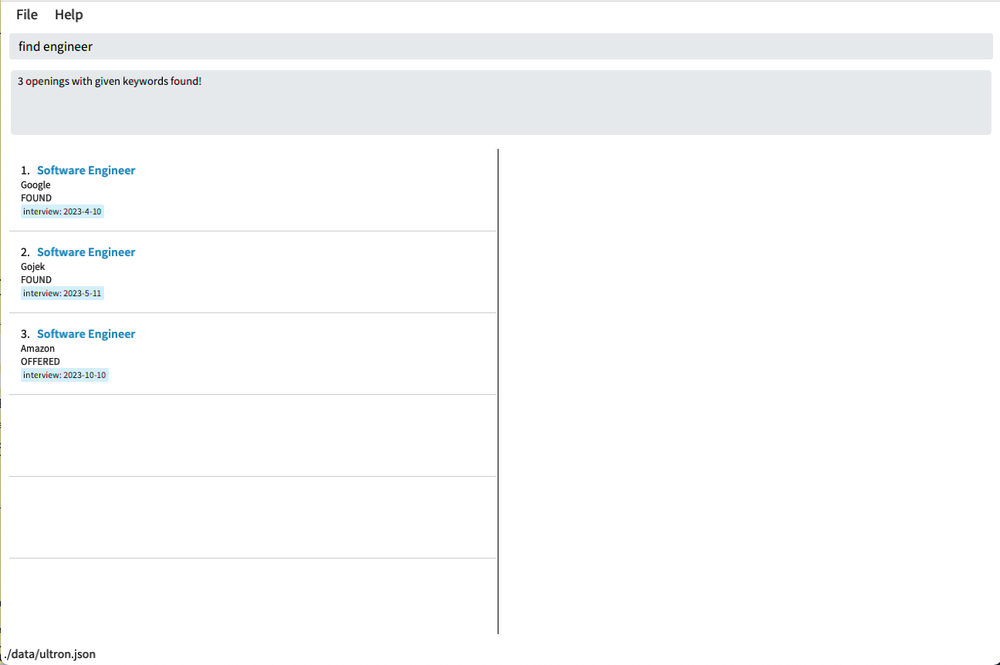
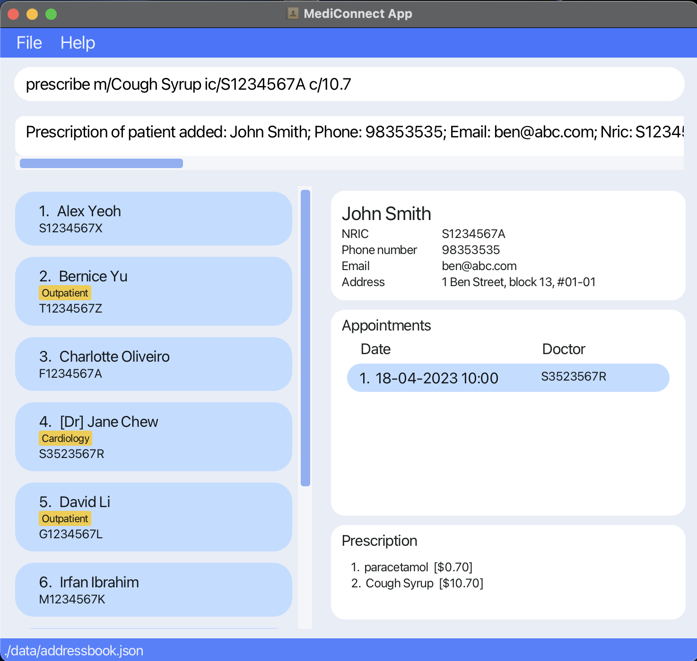
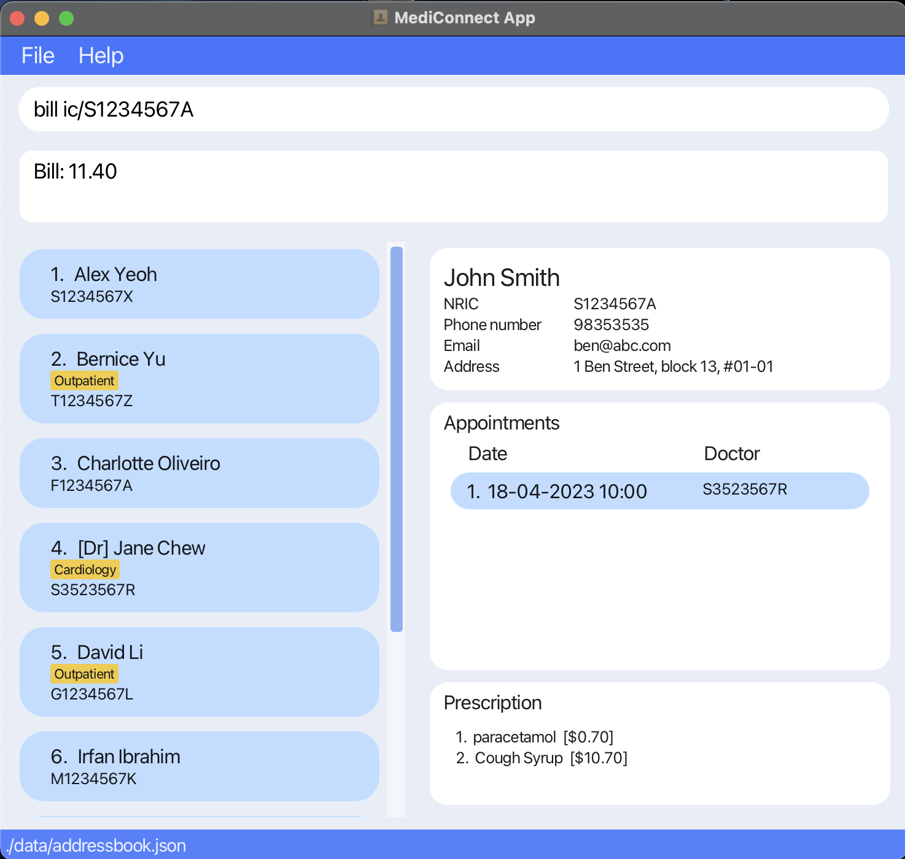

Introducing **MediConnect** - the clinical management application designed to  **streamline patient management,
doctor coordination, and hospital billing.** As a centralised platform, **MediConnect** offers healthcare
professionals and administrative staff an efficient solution to manage administrative matters in local clinics.
The app simplifies the organization and maintenance of patient and doctor data, appointments and billing records.  
**MediConnect** can be used with either a command line interface (CLI) or a graphical user interface (GUI).
Users experienced with the CLI may get their tasks done faster than traditional GUI apps.  
"_With MediConnect, managing your healthcare practice has never been easier._"

## Table of Contents
* Table of Contents
{:toc}

Do not worry if this is your first time using the application. This user guide can assist you through every step of the way. You can also refer to the [glossary](#glossary) section for any unfamiliar words.

## Quick start

1. Ensure you have Java `11` or above installed in your Computer.
   * If you are unsure of your device's Java version, you may use [this guide](https://www.java.com/en/download/help/version_manual.html) to find out.

2. Download the latest `MediConnect.jar` file from [here](https://github.com/AY2223S2-CS2103T-W13-1/tp/releases).

3. Copy the file to a new empty folder (e.g., Desktop, Documents, etc) that you want to use for MediConnect.

4. Double-click the file to start the app. If MediConnect is unable to open, kindly refer to the [FAQ](#faq) section.
   A GUI similar to the image below should appear in a few seconds. Note how the app contains some sample data. 

    

        
    

5. Type the command in the command box and press Enter to execute it. e.g., typing **`help`** and pressing Enter will open the help window. 
   Some example commands you can try:

   * `list` : Lists all stored patients and doctors.

   * `addPatient n/Ben Smith p/98353535 e/ben@abc.com ic/S1234567A a/Ben Street, block 13, #01-01` : Adds a patient named `Ben Smith` to MediConnect.

   * `delete ic/S1234567A` : Deletes the person with NRIC `S1234567A` from the current list.

   * `clear` : Deletes all persons stored in the application.

   * `exit` : Exits the app.

6. Refer to the [Features](#features) below for details of each command.

## Features

**:information_source: Notes about the command format:** 

* Words in `UPPER_CASE` are the parameters to be supplied by the user. 
  e.g., in `addPatient n/NAME`, `NAME` is a parameter which can be used as `addPatient n/John Doe`.

* Parameters can be in any order. 
  e.g., if the command specifies `n/NAME p/PHONE_NUMBER`, `p/PHONE_NUMBER n/NAME` is also acceptable.

* If a parameter is expected only once in the command, but it's specified multiple times, only the last occurrence of the parameter will be taken. 
  e.g., if the command specifies `p/12341234 p/56785678`, only `p/56785678` will be stored.

* Parameters for commands that do not take in parameters (such as `help`, `list`, `exit` and `clear`) will be ignored. 
  e.g., if the command specifies `help 123`, it will be interpreted as `help`.

* Parameters in square brackets are optional. 
  e.g., `n/NAME [t/TAG]` can be used as `n/John Doe t/friend` or as `n/John Doe`.
    * **All other parameters must be filled, following the restrictions in the table below.**

* Parameters with `…`​ after them can be used multiple times including zero times. 
  e.g., `[t/TAG]…​` can be used as ` ` (i.e. 0 times), `t/friend`, `t/friend t/family` etc.

| Field            | Prefix | Input Restrictions                                                                                                                                                                                                                                                                                                                                                                                                                                                                                                                                                                                                   |
|------------------|--------|----------------------------------------------------------------------------------------------------------------------------------------------------------------------------------------------------------------------------------------------------------------------------------------------------------------------------------------------------------------------------------------------------------------------------------------------------------------------------------------------------------------------------------------------------------------------------------------------------------------------|
| **Address**      | a/     |                                                                                                                                                                                                                                                                                                                                                                                                                                                                                                                                                                                                                      |
| **Cost**         | c/     | 1. Should either be a number larger or equal to 0.   2. Supports up to 2 decimal places.                                                                                                                                                                                                                                                                                                                                                                                                                                                                                                                          |
| **Date**         | d/     | 1. Format should be DD-MM-YYYY HH:mm, e.g., 31-03-2023 14:00.   2. HH:mm should follow the 24-hour notation".    3. Day ('DD') must be between 01-31 and Month ('MM') between 01-12. Date must be valid a valid calendar date (e.g., `30-13-2023 10:00` is not a valid `DATE`).                                                                                                                                                                                                                                                                                                                                |
| **Email**        | e/     | 1. Should be of the format local-part@domain   2. The local-part should only contain alphanumeric characters and these special characters (+_.-). The local-part may not start or end with any special characters.   3. This is followed by a '@' and then a domain name. The domain name is made up of domain labels separated by periods.   The domain name must:   - end with a domain label at least 2 characters long   - have each domain label start and end with alphanumeric characters   - have each domain label consist of alphanumeric characters, separated only by hyphens, if any. |
| **Medication**   | m/     | Should only contain alphanumeric characters and spaces.                                                                                                                                                                                                                                                                                                                                                                                                                                                                                                                                                              |
| **Name**         | n/     | Should only contain alphanumeric characters and spaces.                                                                                                                                                                                                                                                                                                                                                                                                                                                                                                                                                              |
| **NRIC**         | ic/    | 1. Should be 9 characters long.   2. The first character must be one of [S,T,F,G,M], followed by 7 numerical digits and ending with [A-Z].                                                                                                                                                                                                                                                                                                                                                                                                                                                                        |
| **Phone Number** | p/     | 1. Should only contain numbers.   2. Should be at least 3 digits long and there is no maximum limit on the number of digits.                                                                                                                                                                                                                                                                                                                                                                                                                                                                                      |
| **Tag**          | t/     | Should be alphanumeric.                                                                                                                                                                                                                                                                                                                                                                                                                                                                                                                                                                                              |

### Adding a person: `add a patient`, `add a doctor`
[Click here to access the table of contents](#table-of-contents)

Adds a person (patient/doctor) to MediConnect.

Format: `addPatient n/NAME p/PHONE_NUMBER e/EMAIL ic/NRIC a/ADDRESS [t/TAG]`   
&nbsp;&nbsp;&nbsp;&nbsp;&nbsp;&nbsp;&nbsp;&nbsp;&nbsp;&nbsp;&nbsp;&nbsp;&nbsp;&nbsp;`addDoctor n/NAME p/PHONE_NUMBER e/EMAIL ic/NRIC a/ADDRESS [t/TAG]`

* Adds the specified person to MediConnect.
* Each person can be added only once and can be **either** a Patient or a Doctor.
* Each person's NRIC must be distinct.

Examples:
* `addPatient n/Ben Smith p/98353535 e/ben@abc.com ic/S1234567A a/1 Ben Street, block 13, #01-01` adds the patient `Ben Smith` to the list.
* `addDoctor n/Sarah Tan p/99123456 e/sarah@abc.com ic/T7654321P a/Sarah Rd t/Pediatrician` adds the doctor `Sarah Tan` to the list.

    

### Deleting a person by NRIC : `delete`
[Click here to access the table of contents](#table-of-contents)

Deletes the specified person from MediConnect.

Format: `delete ic/NRIC`

* Deletes the person with the specified `NRIC`
* Note that this also deletes all the appointment data associated with that patient/doctor
  * When a patient is deleted from the system, all appointments from their appointment list will be removed. This also removes the respective appointments from the doctor's appointment list
  * When a doctor is deleted from the system, all appointments from their appointment list will be removed. This also removes the respective appointments from the patients' appointment list

Example:
* `delete ic/S9876543K` deletes the person with the NRIC number S9876543K in MediConnect.

### Editing a person : `edit`
[Click here to access the table of contents](#table-of-contents)

Edits the details of an existing person stored in MediConnect.

Format `edit INDEX [n/NAME] [p/PHONE] [e/EMAIL] [ic/NRIC] [a/ADDRESS] [t/TAG]…​`

* Edits the person at the specified INDEX. The index refers to the index number shown in the displayed person list. The *index must be a positive integer* 1, 2, 3, …​
* At least one of the optional parameters must be provided.
* Existing values will be updated to the input values.
* When editing tags, the existing tags of the person will be removed i.e adding of tags is not cumulative.
* Tags can be removed by typing t/ without specifying any tags after it.

Example:
* `edit 9 n/John Smith` will edit the name of the 9th person listed to "John Smith".

    

### Display patient's information : `display`
[Click here to access the table of contents](#table-of-contents)

Displays personal particulars, appointments and prescription for the person.

Format: `display ic/NRIC`

* For patients:
  * Displays personal particulars, appointments and prescription for the patient with the specified `NRIC`.
* For doctors:
  * Displays personal particulars, and appointments for the doctor with the specified `NRIC`.

Example:
* `display ic/S1234567A` displays the information for the person with NRIC number `S1234567A`.

    

### Finding a person (patient or doctor) by NRIC : `find`
[Click here to access the table of contents](#table-of-contents)

Finds and displays information about the specified person.

Format: `find ic/NRIC`

* Finds the person with the specified `NRIC`
* Search is case-insensitive. (e.g., `s1234567a` will match with `S1234567A`).
* Only the NRIC is searched, additional parameter(s) (e.g., n/NAME) will be ignored.
* Only full NRIC entries can be searched.

Example:
* `find ic/S1234567A` returns the details for the person with NRIC number S1234567A.

    

### Book appointment : `appointment`
[Click here to access the table of contents](#table-of-contents)

Schedules an appointment for a patient with a specific doctor.

Format: `appointment ic/NRIC d/DATE dric/NRIC`

* Schedules an appointment for the patient with `ic/NRIC` and the doctor with `dric/NRIC` on the specified `d/DATE`
* Note that this updates the appointment list for the specified patient, and the specified doctor in the detailed person view panel when `display` command is used.
* The command accepts any past or future date.

Example:
* `appointment ic/S1234567A d/18-04-2023 10:00 dric/S3523567R` schedules an appointment for the patient with the NRIC number `S1234567A` and the doctor with the NRIC number `S3523567R` on `18-04-2023 10:00`.

    

### Delete appointment : `deleteAppointment`
[Click here to access the table of contents](#table-of-contents)

Deletes an appointment specified by the index of the patient’s appointment list.

Format: `deleteAppointment INDEX ic/NRIC`

* Deletes the appointment indicated by `INDEX` from the list of appointments for the person specified by `NRIC`
* `INDEX` refers to the index number shown in the appointment list of the patient.
* `NRIC` must belong to a patient (not doctor)
* Note that this updates the appointment list for the specified patient, and the specified doctor in the detailed person view panel when `display` command is used.

Example:
* `deleteAppointment 1 ic/S1234567A` deletes the first appointment displayed on the appointment list of the patient with NRIC number `S1234567A`.

### Prescribing patient’s medication : `prescribe`
[Click here to access the table of contents](#table-of-contents)

* Prescribes medication to a patient, noting the medication's name and cost.
  * If the patient is already prescribed to that medication, its cost is updated to the new value instead.

Format: `prescribe ic/NRIC m/MEDICATION c/COST`

Examples:
*  `prescribe m/paracetamol ic/S1234567A c/0.7` prescribes paracetamol at a cost of $0.7 to the patient with NRIC number S1234567A.
*  `prescribe m/Cough Syrup ic/S1234567A c/10.7` prescribes Cough Syrup at a cost of $10.7 to the patient with NRIC number S1234567A.

    

### Removing patient’s medication : `unprescribe`
[Click here to access the table of contents](#table-of-contents)

Removes a chosen medication from a patient.

Format: `unprescribe ic/NRIC m/MEDICATION`

Example:
*  `unprescribe ic/S1234567A m/paracetamol` removes the chosen medication from patient with NRIC number S1234567A.

### Bill : `bill`
[Click here to access the table of contents](#table-of-contents)

Calculates the cost of all medication given a Patient's prescription.

Format: `bill ic/NRIC`

Example:
* `bill ic/S1234567A` calculates the cost of all medication for patient with NRIC number S1234567A.

    

### Retrieve persons information : `list`
[Click here to access the table of contents](#table-of-contents)

Shows a list of all persons in MediConnect.

Format: `list`

### Retrieve doctors information : `listDoctors`
[Click here to access the table of contents](#table-of-contents)

Shows a list of all doctors in MediConnect.

Format: `listDoctors`

    

### Retrieve patients information : `listPatients`
[Click here to access the table of contents](#table-of-contents)

Shows a list of all patients in MediConnect.

Format: `listPatients`

    

### Clearing all entries : `clear`
[Click here to access the table of contents](#table-of-contents)

Deletes all patients' and doctors' data from the system.

Format: `clear`

* Data cannot be retrieved after `clear` is performed.
* Note that this also deletes all the appointment data that has been previously stored in `MediConnect`

Example:
* `clear` permanently deletes all data stored in the system.

### Requesting help : `help`
[Click here to access the table of contents](#table-of-contents)

Provides the user with a link to this user guide.

Format: `help`

Example:
* `help` opens a mini window with a url link of this user guide which can be copied by the user.

    

### Exiting the program : `exit`
[Click here to access the table of contents](#table-of-contents)

Closes the `MediConnect` application.

Format: `exit`

Example:
* `exit` closes the `MediConnect` application immediately.

--------------------------------------------------------------------------------------------------------------------

## FAQ
[Click here to access the table of contents](#table-of-contents)

**1. What can I do if MediConnect.jar does not open when double-clicked?**  
Open a command terminal, `cd` into the folder you put the jar file in, and use the `java -jar MediConnect.jar` command to run the application.

**2. Do I need to manually store the data?**  
No, MediConnect data is saved on the hard disk automatically after any command that changes the data. There is no need to save manually.

**3. Can I access my data from another device?**  
No, you would have to copy over the saved data from your current device to the other device. Copy the folder containing MediConnect and transfer it to the other device.

--------------------------------------------------------------------------------------------------------------------

## Glossary
[Click here to access the table of contents](#table-of-contents)

* **Alphanumeric**: Only contains letters(e.g., A-Z, a-z) and numbers (e.g., 10, 100, etc).
* **CLI**: Text input accepted by MediConnect.
* **Command**: The action that the user wishes to perform on MediConnect.
* **Command Box**: The box at the top of MediConnect where the user can type the Commands.
* **GUI**: The visual representation of MediConnect
* **Parameters**: The respective additional information required by the command.
* **System**: The MediConnect application

## Command summary
[Click here to access the table of contents](#table-of-contents)

| Action                 | Format, Examples                                                                                                                                                                                                                                                                                                                                         |
|------------------------|----------------------------------------------------------------------------------------------------------------------------------------------------------------------------------------------------------------------------------------------------------------------------------------------------------------------------------------------------------|
| **Add Person**         | 1. `addPatient n/NAME p/PHONE_NUMBER e/EMAIL ic/NRIC a/ADDRESS [t/TAG]…​`   e.g., `addPatient n/Ben Smith p/98353535 e/ben@abc.com ic/S1234567A a/1 Ben Street, block 13, #01-01`   2. `addDoctor n/NAME p/PHONE_NUMBER e/EMAIL ic/NRIC a/ADDRESS [t/TAG]…​`   e.g., `addDoctor n/Sarah Tan p/99123456 e/sarah@abc.com ic/T7654321P a/Sarah Rd` |
| **Bill**               | `bill ic/NRIC`   e.g.,                               bill ic/S1234567X                                                                                                                                                                                                                                                                                |
| **Book Appointment**   | `appointment ic/NRIC d/DATE dric/NRIC`   e.g., `appointment ic/S1234567A d/01-04-2023 10:00 dric/S3523567R`                                                                                                                                                                                                                                           |
| **Clear**              | `clear`                                                                                                                                                                                                                                                                                                                                                  |
| **Delete Appointment** | `deleteAppointment INDEX ic/NRIC`   e.g., `deleteAppointment 2 ic/S1234567A`                                                                                                                                                                                                                                                                          |
| **Delete Person**      | `delete ic/NRIC`  e.g., `delete ic/S1234567A`                                                                                                                                                                                                                                                                                                         |
| **Display**            | `display ic/NRIC`   e.g., `display ic/S1234567A`                                                                                                                                                                                                                                                                                                      |
| **Edit**               | `edit INDEX [n/NAME] [p/PHONE_NUMBER] [e/EMAIL] [ic/NRIC] [a/ADDRESS] [t/TAG]…​`   e.g., `edit 2 n/James Lee e/jameslee@example.com`                                                                                                                                                                                                                  |
| **Exit**               | `exit`                                                                                                                                                                                                                                                                                                                                                   |
| **Find**               | `find ic/NRIC`  e.g., `find ic/S1234567A`                                                                                                                                                                                                                                                                                                             |
| **Help**               | `help`                                                                                                                                                                                                                                                                                                                                                   |
| **List**               | `list`   `listDoctors`   `listPatients`                                                                                                                                                                                                                                                                                                            |
| **Prescribe**          | `prescribe ic/NRIC m/MEDICATION c/COST`   e.g., prescribe ic/S1234567A m/paracetamol c/10.7                                                                                                                                                                                                                                                           |
| **Unprescribe**        | `unprescribe ic/NRIC m/MEDICATION`   e.g., unprescribe ic/S1234567A  m/paracetamol                                                                                                                                                                                                                                                                    |
