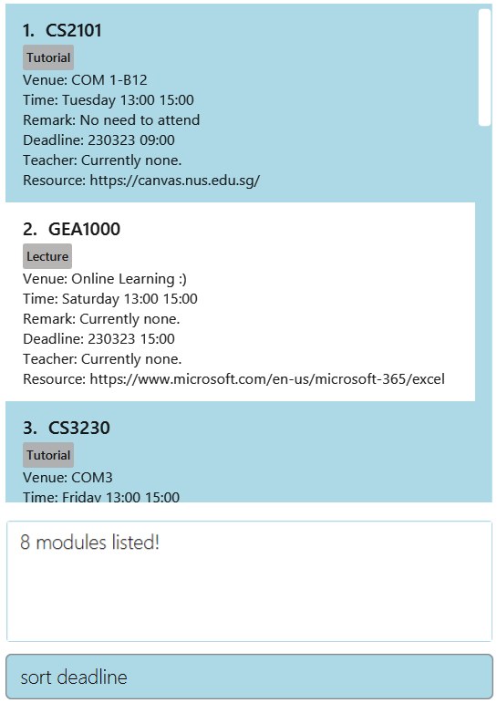
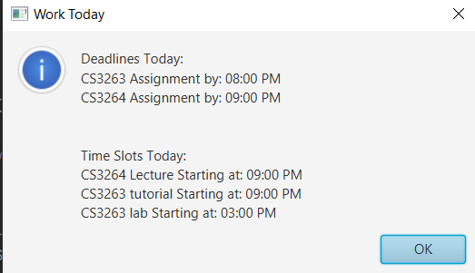

## <a id="contactus"></a>About coNtactUS

Are you a NUS computing student who is struggling to keep track of your school modules? Are you feeling overwhelmed by the constant influx of weekly lectures, tutorials, deadlines and assignments? Are you finding it hard to keep your module resources and notes well-organised? Fret not! With coNtactUS, you can take the first step towards solving all of your problems. 

coNtactUS is a desktop application created by NUS computing students, specially for NUS computing students, just like you. It is a module tracker that lets you store information related to your modules like: 

1) Lecture and tutorial timeslots  
2) Lecture and tutorial venues  
3) Deadlines  
4) Module official resources   
5) Module notes  
6) Contact details of Professors and Teaching assistants  

and more.... 

in a centralised location that is easily accessible by you, so you will not forget them ever again. 

What is even better is that coNtactUS is optimised for use via typing instead of clicking, which allows you to store and
retrieve information faster than ever before. Now, you can become the most productive version of yourself, 
bringing you one step closer to achieving your goals. 

So, what are you waiting for? Read on to find out more about how to use coNtactUs in this user guide! 

--------------------------------------------------------------------------------------------------------------------
<div style="page-break-after: always;"></div>  

## <a id="ug"></a>About this user guide

If this is the first time you are using coNtactUS, this user guide provides an excellent starting point for you to
familiarise yourself with the features of coNtactUS. It also shows you how to set up coNtactUS effortlessly
on your computer.

Alternatively, you may refer to the user guide to quickly view information regarding a particular feature that you are
unsure of how to use.  

To help you better navigate through our user guide, the [Return to ToC](#table) at the end of each section
allows you return to the Table of Contents. From there, you can quickly access 
another section by clicking the respective header.  
<br>  

--------------------------------------------------------------------------------------------------------------------

## <a id="how"></a>How to use this user guide

A [table of contents](#table) is provided in this user guide, containing hyperlinks to each section of 
the user guide. You can simply click on a hyperlink to quickly navigate to the relevant section that you are interested 
in. 

Symbols are used in the user guide to facilitate your understanding of the content.

<div markdown="span" class="alert alert-primary"> :bulb: This indicates a useful tip that you may wish to take note of. 
</div>

<div markdown="span" class="alert alert-primary"> :exclamation: This indicates an important piece of information 
that you should pay attention to. </div>  

<br>  

--------------------------------------------------------------------------------------------------------------------
<div style="page-break-after: always;"></div>  

## <a id="table"></a>Table of Contents

* [**About coNtactUS**](#contactus)
* [**About this User Guide**](#ug)
* [**How to use this User Guide**](#how)
* [**Table of Contents**](#table)
* [**Getting started**](#start)
* [**Familiarising yourself with the user interface**](#ui)
* [**Familiarising yourself with a module**](#module)
* [**Familiarising yourself with the commands**](#commands)
* [**Features**](#features)
    * [Listing all modules: `list`](#list)
    * [Adding a module: `add`](#add)
    * [Deleting a module: `delete`](#delete)
    * [Editing a module: `edit`](#edit)
    * [Finding a module: `find`](#find)
    * [Sorting a module: `sort`](#sort)
    * [Clearing all modules: `clear`](#clear) 
    * [Viewing help: `help`](#help)
    * [Exiting the module tracker: `exit`](#exit)
* [**Additional Features**](#addfeat)
  * [Reminder for modules](#reminder)
* [**Format Restrictions**](#format)
* [**Further information about commands**](#further-info)
* [**More examples of valid and invalid input values**](#input)
* [**Data storage**](#data)
  * [**Saving the data**](#saving)
  * [**Editing the data file**](#edit-data)
* [**Current product limitations**](#limitation)
* [**Coming soon**](#coming)
* [**Glossary**](#glossary)
* [**FAQ**](#faq)
* [**Command summary**](#command-summary)

<br>  

--------------------------------------------------------------------------------------------------------------------
<div style="page-break-after: always;"></div>

## <a id="start"></a> Getting started

1. Ensure you have Java `11` or above installed in your Computer. If you are unsure about how to do so, you may refer 
to [how to check the version of Java on my computer](https://blog.hubspot.com/website/check-java-verison).

2. Download the latest release of coNtactUS from [here](https://github.com/AY2223S2-CS2103T-W10-1/tp/releases). Note 
that the file is named `coNtactUs.jar`

   <div markdown="span" class="alert alert-primary"> :exclamation: Make sure to remember the destination folder
on your computer that you download the coNtactUS.jar file onto. This is relevant for the next step. </div>

3. Run the `coNtactUs.jar` file. If you are unsure of how to do so, you may refer to [how to run a jar file]().

4. You should now see a window similar to the one shown below. 

  <div markdown="span" class="alert alert-primary"> :bulb: Note how sample data is already loaded into the application 
for your reference. </div>


<p align="center">
  
</p>

<div align="center">Figure 1 : The starting window for the coNtactUS application.</div>
<br>  
<p align="right"><a style="text-align:right" href="#table">Return to ToC</a></p>

--------------------------------------------------------------------------------------------------------------------

<div style="page-break-after: always;"></div>

## <a id="ui"></a> Familiarising yourself with the user interface  

In case you are unsure of what you see in front of you now, we have come up with annotations to
introduce you to the user interface. Do have a look at Figure 2 shown below. 

<p align="center">
  
</p>

<div align="center">Figure 2: Annotations about the user interface</div>   
<br>   
<p align="right"><a style="text-align:right" href="#table">Return to ToC</a></p>   


--------------------------------------------------------------------------------------------------------------------
<div style="page-break-after: always;"></div>

## <a id="module"></a>Familiarising yourself with a module

To start adding a module, we should first learn about what a module is. In coNtactUS, each module has 8 information 
fields. 

* MODULE_NAME: The name of the module. 
* DESCRIPTION: A short description of the module.
* TIMESLOT: A recurring time event for the module, if any.
* VENUE: The venue that the module is taught at, if any. 
* TEACHER: The professor or teaching assistant for the module. 
* DEADLINE: A deadline for the module, if any. 
* REMARK: A remark for the module, if any.
* RESOURCE: A link to a resource for the module, if any. 

This is all you need to know for the time being. Now let's take a closer look at the commands.  
<p align="right"><a style="text-align:right" href="#table">Return to ToC</a></p> 

--------------------------------------------------------------------------------------------------------------------
<div style="page-break-after: always;"></div>

## <a id="commands"></a>Familiarising yourself with the commands  


Here is a brief introduction of the available commands for you to use. To see detailed information about each
command, refer to the next section. 

   * `list` : Shows all the modules.

   * `add` : Adds a new module.

   * `delete` : Deletes a module.

   * `edit` : Edits a module.

   * `find` : Finds a module based on its description.

   * `sort` : Sorts the modules based on the timeslot or deadline of the module.

   * `clear` : Clears all the modules in the list. 
    
   * `help` : Opens a help window containing details about how to use each command. 

   * `exit` : Exits the application.

<div markdown="span" class="alert alert-primary"> :exclamation: The clear command removes all the modules in the 
list. Only use it if you are sure! </div>   
<p align="right"><a style="text-align:right" href="#table">Return to ToC</a></p>

-------------------------------------------------------------------------------------------------------------------
<div style="page-break-after: always;"></div>

## <a id="features"></a>Features  

This section introduces you to detailed information about how to use each command.

* [List modules](#list)
* [Add a module](#add)
* [Delete a module](#delete)
* [Edit a module](#edit)
* [Find a module](#find)
* [Sort modules](#sort)
* [Clear modules](#clear)
* [Help command](#help)
* [Exit command](#exit)

<p align="right"><a style="text-align:right" href="#table">Return to ToC</a></p>

--------------------------------------------------------------------------------------------------------------------
### <a id="list"></a>Listing all modules: `list`

By using the `list` command, you can list all the modules that you have stored in the module tracker.

This is a straightforward command. To use it, all you have to type is `list`

<p align="right"><a style="text-align:right" href="#table">Return to ToC</a></p> 

--------------------------------------------------------------------------------------------------------------------
<div style="page-break-after: always;"></div>

### <a id="add"></a>Adding a module: `add`  

By using the `add` command, you can add a new module to the module tracker. 

Take note of the format: `add n/MODULE_NAME t/DESCRIPTION [e/TIMESLOT] [a/VENUE] [s/TEACHER] [d/DEADLINE] [r/REMARK] 
[c/RESOURCE]`

<div markdown="span" class="alert alert-primary">:exclamation: You must supply the module name and description when 
adding a new module. The rest of the fields, such as timeslot, venue, and teacher etc. are optional. 
</div>

<div markdown="span" class="alert alert-primary">:bulb: The square brackets indicate that a particular field is optional.
For example, `[a/VENUE]` indicates that the venue field is optional.
</div>

Examples of valid usages:
* `add n/CS2103T t/Lecture`
* `add n/CS1101S t/Tutorial e/Monday 10:00 12:00 a/COM1-0217 s/Sam Wan`
* `add n/CS2030S t/Lab a/COM1-B112 d/040423 23:59 r/Attendance not compulsory :)`

<p align="center">
   
</p>

<div align="center">Figure 3 : Adding a new module into the tracker.</div>  
<br>  


<div style="page-break-after: always;"></div>  
<br>  


Examples of invalid usages: 
* `add n/CS2103T` - there is no description provided.
* `add t/Tutorial` - there is no module name provided.

Note that there are format restrictions for some fields like `n/MODULE_NAME`, `t/DESCRIPTION`, `e/TIMESLOT`, and
`d/DEADLINE`.
Please refer to [format restrictions](#format) to find out more.

<p align="right"><a style="text-align:right" href="#table">Return to ToC</a></p>  

--------------------------------------------------------------------------------------------------------------------
<div style="page-break-after: always;"></div>

### <a id="delete"></a>Deleting a module: `delete`

By using the `delete` command, you can delete a module from the module tracker.

Format: `delete INDEX`

* This command deletes the module at the specified index in the displayed module list.
* For example, if you wanted to delete a module placed first in the
  list, you would type  `delete 1`
* The index provided by you must be a positive integer (eg. 1, 2, 3...)
* There must be a module at the index you have provided.

Examples:
*  `delete 2` deletes the 2nd module in the module tracker.
<p align="center">
   
</p>

<div align="center">Figure 4 : Deleting a module from the tracker.</div>  
<br>  
<p align="right"><a style="text-align:right" href="#table">Return to ToC</a></p>  

--------------------------------------------------------------------------------------------------------------------
<div style="page-break-after: always;"></div>

### <a id="edit"></a>Editing a module: `edit`

By using the `edit` command, you can edit the information for a module that is already listed in the 
module tracker. 

Take note of the format: `edit INDEX [n/MODULE_NAME] [t/DESCRIPTION] [e/TIMESLOT] [a/VENUE] [s/TEACHER] 
[d/DEADLINE] [r/REMARK] [c/RESOURCE]`

* This command edits the module at the specified index in the displayed module list. 
* For example, if you wanted to edit a module placed first in the
list, you would type  `edit 1`
* The index provided by you  must be a positive integer (eg. 1, 2, 3...)
* There must be a module at the index you have provided.
* You must provide at least one field to be edited.
* Existing values will be updated to the input values that you have provided. 

Examples of valid usages: 
* `edit 1 n/CS2101 t/Tutorial` Edits the name and description of the first module in the list to be `CS2101` and 
`Tutorial` respectively.

* `edit 2 a/COM3-B110 s/Professor Franklin Stein r/Funny lecturer haha` Edits the venue, teacher and remark of the 2nd
  module to be `COM3-B110`, `Professor Franklin Stein` and `Funny lecturer haha` respectively.

<p align="center">
   
</p>

<div align="center">Figure 5 : Editing a module in the tracker.</div>  
<br>  


Examples of invalid usages:
* `edit 0 n/CS2101 t/Tutorial` - The index must be a positive integer.

* `edit 1` - There must be at least one field provided to edit.

Note that there are format restrictions for some fields like `n/MODULE_NAME`, `t/DESCRIPTION`, `e/TIMESLOT`, and
`d/DEADLINE`. Please refer to [format restrictions](#format) to find out more.

<p align="right"><a style="text-align:right" href="#table">Return to ToC</a></p>  

--------------------------------------------------------------------------------------------------------------------
<div style="page-break-after: always;"></div>  

### <a id="find"></a>Finding a module: `find`

By using the `find` command, you can find a module based on its name or description. 

Format: `find KEYWORD`

* The KEYWORD refers to a search word provided by you. 
* Only modules with names and/or description that are matching your keyword will be displayed.
* You can include more than one keyword. Modules matching at least one keyword will be shown.
* The search is case-insensitive. e.g `CS` will match `cs`.

Examples:
* `find CS2103T` finds all modules with name and/or description including the word `CS2103T`. 

<p align="center">
   
</p>

<div align="center">Figure 6 : Finding a module in the tracker.</div>
<br>  
<p align="right"><a style="text-align:right" href="#table">Return to ToC</a></p>  

--------------------------------------------------------------------------------------------------------------------
<div style="page-break-after: always;"></div>

### <a id="sort"></a>Sorting the modules: `sort`

By using the `sort` command, you can display the modules in a sorted order by either their `timeslot` 
or `deadline`.

Format: `sort timeslot` or `sort deadline`

* The `sort timeslot` command will automatically take into consideration the current time of your computer, 
and then sort the modules based on their timeslot. 
* For example, if the current day on your computer is Monday, a module with timeslot `Tuesday 05:00 - 07:00` will be shown before a module with timeslot `Wednesday 06:00 - 08:00`. Similarly, if the current day on your computer is 
Tuesday, then a module with timeslot `Wednesday 05:00 - 07:00` will be shown before a module with timeslot 
`Thursday 06:00 - 08:00`.


* The `sort deadline` command will sort the modules based on their deadline.
* For example, a module with deadline `250623` will be shown before a module with deadline `260623`.

<p align="center">
   
</p>

<div align="center">Figure 7 : Sorting the modules based on deadline.</div>
<br>  
<p align="right"><a style="text-align:right" href="#table">Return to ToC</a></p>   

--------------------------------------------------------------------------------------------------------------------
<div style="page-break-after: always;"></div>

### <a id="clear"></a>Clearing all modules: `clear`

By using the `clear` command, you can remove all the modules from the module tracker. 

* This is a straight-forward command, and all you have to type is `clear`

<p align="right"><a style="text-align:right" href="#table">Return to ToC</a></p>  

--------------------------------------------------------------------------------------------------------------------
### <a id="help"></a>Viewing help : `help`

By using the `help` command, you can open a help window showing additional information about how
to use the commands. 

* This is a straight-forward command, and all you have to type is `help`

<p align="center">
   
</p>

<div align="center">Figure 8 : Help window.</div>
<br>  
<p align="right"><a style="text-align:right" href="#table">Return to ToC</a></p>  

--------------------------------------------------------------------------------------------------------------------
<div style="page-break-after: always;"></div>

### <a id="exit"></a>Exiting the module tracker: `exit`

By using the `exit` command, you can close and exit the application.

* This is a straight-forward command, and all you have to type is `exit`

<p align="right"><a style="text-align:right" href="#table">Return to ToC</a></p>   

--------------------------------------------------------------------------------------------------------------------
<div style="page-break-after: always;"></div>

## <a id="addfeat"></a>Additional Features 

### <a id="reminder"></a>Reminder for modules 

Whenever you open coNtactUS, a pop-up window will appear showing you modules that have a deadline due today 
or have a timeslot that is occurring today.
* For example, if today is a Wednesday, this pop-up window will show all modules that have a timeslot that occurs every 
Wednesday. This will be helpful for helping you keep up to date with your weekly lectures, tutorials, and labs.


* Likewise, if the date today is 23rd February 2023, and you have a module with a deadline on this day, this pop-up 
window will show the module as well. 


* The best thing about this feature is that it always works in the background and there is nothing you have to do 
to enjoy its benefits! 


* Note that as of now, this pop-up window only appears when you launch coNtactUS. There is currently no command for you 
to display the pop-up window at any other point in time. However, this will be a future enhancement. Do take a look at 
features [coming soon](#coming-soon) if you are interested. 

<p align="center">
   
</p>

<div align="center">Figure 9 : Reminder window.</div>
<br>  
<p align="right"><a style="text-align:right" href="#table">Return to ToC</a></p>  

--------------------------------------------------------------------------------------------------------------------
<div style="page-break-after: always;"></div>  

## <a id="format"></a>Format Restrictions 

When keying in input values for certain fields when you [add](#add) or [edit](#edit) 
a module, there are certain format restrictions that you have to take note of. 

To recap, there are a total of 8 information fields for each module that you can modify. Note that when you are adding
a new module to the module tracker, only the `n/MODULENAME` and `t/DESCRIPTION` fields are compulsory. For fields that 
are optional, the value for that field will be automatically displayed as `None.` after the module has been added.

* `n/MODULENAME` - It must be alphanumeric (A-Z, 0-9) and can contain spaces. It cannot be blank.


* `t/DESCRIPTION` - It must be alphanumeric (A-Z, 0-9) and can contain spaces. It cannot be blank.


* `[e/TIMESLOT]` -  It must be of the format `DAY-OF-WEEK HH:MM HH:MM`, with the first time being the 
starting time and the second time being the ending time. An example would be `Tuesday 12:00 15:00` for a timeslot that
occurs every Tuesday, starting at 12 noon and ending at 3pm. It cannot be blank.


* `[a/VENUE]` -  It cannot be blank. 


* `[s/TEACHER]` -  It cannot be blank.


* `[d/DEADLINE]` - It must be of the format `DDMMYY`. For example, for a deadline that falls on the 23rd February 2023, 
key in `230223`. It cannot be blank.


* `[r/REMARK]` - It cannot be blank. 


* `[c/RESOURCE]` - It cannot be blank.


If you are an advanced user who is concerned about further information regarding how you can use the commands of 
coNtactUS, read on for the next section. 

<p align="right"><a style="text-align:right" href="#table">Return to ToC</a></p>  

--------------------------------------------------------------------------------------------------------------------
<div style="page-break-after: always;"></div>

## <a id="further-info"></a> Further information about commands 
<div markdown="block" class="alert alert-info">

* You may supply more than one input value for the `t/DESCRIPTION` field, and both will be recorded. 
An example would be : `edit 1 t/Difficult module t/Fun module`. The resulting module listing would have 2 
descriptions, `Difficult module` and `Fun module`.


* Note that for all other fields, only one input value will be recorded. If you supply more than one input value, only
the last occurrence of that input value will be recorded. For example, if you specify `edit 1 a/Home a/School`, 
only `a/School` will be taken.


* Parameters can be in any order.
For example, `edit 1 n/CS1231S t/Math heavy` and `edit 1 t/Math heavy n/CS1231S` are both accepted.


* If you provide an input value for commands that do not take in any input value (such as `help`, `list`, `exit` 
and `clear`), the input value will be ignored. For example, `help 123` will simply be interpreted as `help` by the program.


</div>

<p align="right"><a style="text-align:right" href="#table">Return to ToC</a></p>   


--------------------------------------------------------------------------------------------------------------------
<div style="page-break-after: always;"></div>

## <a id="input"></a> More examples of valid and invalid input values 

You can refer to this section for more examples of valid and invalid input values.

<div markdown="block" class="alert alert-info">

**:exclamation: Note:** the examples given here are **not exhaustive!** They serve as a **guideline** so that you
know what information are considered valid and what are not.<br>

<p> :bulb: <code> </code> refers to a blank value. </p>
</div>  

<table class="center">
  <tr>
    <th>Attributes</th>
    <th>Valid</th>
    <th>Invalid</th>
  </tr>
  <tr>
    <td>MODULE_NAME</td>
    <td>
      <code>CS2103T</code>
      <code>CS 2101</code>
      <code>gea1000</code>
      <code>ST2334</code>
      <code>Programming</code>
    </td>
    <td>
      <code> </code>
      <code>C$2103T</code>
      <code>CS2101!!</code>
      <code>CS21.01</code>
    </td>
  </tr>
  <tr>
    <td>TAG</td>
    <td>
      <code>Lecture</code>
      <code>Tutorial</code>
      <code>Assignment2</code>
      <code>lab</code>
      <code>PROJECT</code>
    </td>
    <td>
      <code> </code>
      <code>Assignment 2</code>
      <code>l@b</code>
    </td>
  </tr>
  <tr>
    <td>TIMESLOT</td>
    <td>
      <code>Friday 12:00 14:00</code>
      <code>Tuesday 09:00 10:00</code>
    </td>
    <td>
      <code> </code>
      <code>Mon 12:00 14:00</code>
      <code>Wednesday 7:00 8:00</code>
      <code>Thursday 11:00 10:00</code>
    </td>
  </tr>
  <tr>
    <td>VENUE</td>
    <td>
      <code>COM1</code>
      <code>COM 3.</code>
      <code>com1-0117</code>
    </td>
    <td>
      <code> </code>
    </td>
  </tr>
  <tr>
    <td>TEACHER</td>
    <td>
      <code>Prof Damyth.</code>
      <code>Mr. John Lee</code>
      <code>Dr Ch'ng</code>
      <code>anderson</code>
    </td>
    <td>
      <code> </code>
    </td>
  </tr>
  <tr>
    <td>DEADLINE</td>
    <td>
      <code>100423 23:59</code>
      <code>120423 11:00</code>
      <code>280223 09:00</code>
      <code>290224 12:00</code>
    </td>
    <td>
      <code> </code>
      <code>10423 23:59</code>
      <code>320423 11:00</code>
      <code>290223 09:00</code>
      <code>290224 25:61</code>
    </td>
  </tr>
  <tr>
    <td>REMARK</td>
    <td>
      <code>Hard module.</code>
      <code>Can S/U</code>
      <code>rewatch</code>
      <code>PAY ATTENTION</code>
    </td>
    <td>
      <code> </code>
    </td>
  </tr>
  <tr>
    <td>RESOURCES</td>
    <td>
      <code>www.google.com</code>
      <code>WwW.GmAiL.cOm</code>
      <code>WWW.YOUTUBE.COM</code>
    </td>
    <td>
      <code> </code>
    </td>
  </tr>
</table>  

<p align="right"><a style="text-align:right" href="#table">Return to ToC</a></p>   

------------------------------------------------------------------------------------------------------
<div style="page-break-after: always;"></div>   

## <a id="data"></a>Data Storage 

If you are interested to read about how coNtactUS stores data on your computer, read this section to find out more.

### <a id="saving"></a>Saving the data 

CoNtactUS data is saved in the hard disk automatically. There is no need for you to save any data manually or use any
command to do so.

### <a id="edit-data"></a>Editing the data file (For advanced users) 

CoNtactUS data is saved as a JSON file at the location `[JAR file location]/data/moduletracker.json`. If you are an
advanced user, you are welcome to update data directly by editing that data file if you wish to do so.

<div markdown="span" class="alert alert-warning">:exclamation: **Caution:**
If your changes to the data file makes its format invalid, coNtactUS will discard all data and start with an empty
data file at the next run.
</div>

<p align="right"><a style="text-align:right" href="#table">Return to ToC</a></p>  

 --------------------------------------------------------------------------------------------------------------------
<div style="page-break-after: always;"></div>

## <a id="limitation"></a>Current product limitations (Important) 

Note that currently, coNtactUS does not enforce any additional checks for conflicting `s/teacher`, `e/timeslot`, 
`a/venue` values. 

* For example, you will be allowed to create two module listings as follows.

<p align="center">
   
</p>

<div align="center">Figure 10 : Two modules with the same teacher.</div>  
<br>  

* It might not make sense to have the same teacher `Bob`, teaching two different classes 
that are located at different venues (`LT-19` and `COM1-B1`) at the same timing (`Monday 11:00 15:00`). However, we 
felt that this allows you the flexibility to supply an input value that you desire without being subjected to unnecessary
conflict checks. After all, `Bob` may be referring to two different persons.  

<p align="right"><a style="text-align:right" href="#table">Return to ToC</a></p>  

--------------------------------------------------------------------------------------------------------------------
<div style="page-break-after: always;"></div>

## <a id="coming"></a>Coming soon 

coNtactUS is a continual work in progress, with newer and better features always being built by the development team. 
Here are some new features you can look forward to in the near future: 

* Currently, the reminder pop-up window only appears when coNtactUS is launched. You may want to 
view this reminder pop-up window at any moment while you are using coNtactUs. Hence, we will be adding a command
for you to do so, so you can see the reminders at any time you wish.   

<p align="right"><a style="text-align:right" href="#table">Return to ToC</a></p>   

 --------------------------------------------------------------------------------------------------------------------
## <a id="glossary"></a>Glossary 

If you have any confusion about the technical terms used in this user guide, you may 
refer to the glossary below.  

#### Attribute  
Refers to a specific input value from the user that provides details to execute a command. Attributes
are preceded by their prefixes. Example includes ```n/MODULE_NAME```. 

#### Command Word  
Refers to the keyword in a valid user command. Examples include ```add```, ```edit``` and ```delete```.  

#### Module Tracker  
Refers to the application used to track the entries of different modules input by users.  

#### Prefix  
Refers to a character ending in a slash ("/") that precedes an attribute value. It indicates the type of
information to follow. Example includes ```a/``` as prefix for the ```VENUE``` attribute.   

<p align="right"><a style="text-align:right" href="#table">Return to ToC</a></p>

--------------------------------------------------------------------------------------------------------------------

## <a id="faq"></a>FAQ 

**Q**: How do I transfer my data to another computer? <br>
**A**: Download `coNtactUS.jar` in the other computer and overwrite the empty data file it creates with the data file
at the location `[JAR file location]/data/moduletracker.json` on your current computer. 

**Q**: Can I only exit coNtactUS through the `exit` command? <br>
**A**: Not at all! It is one of the ways you can exit the program. You may also simply close the browser window.  
<p align="right"><a style="text-align:right" href="#table">Return to ToC</a></p>  

--------------------------------------------------------------------------------------------------------------------
## <a id="command-summary"></a>Command summary 

| Action     | Format                                                                                                                |
|------------|-----------------------------------------------------------------------------------------------------------------------|
| **list**   | `list`                                                                                                                |
| **add**    | `add n/MODULE_NAME t/DESCRIPTION [e/TIMESLOT] [a/VENUE] [s/TEACHER] [d/DEADLINE] [r/REMARK] [c/RESOURCE]`             |
| **delete** | `delete INDEX`                                                                                                        |
| **edit**   | `edit INDEX [n/MODULE_NAME] [t/DESCRIPTION]… [e/TIMESLOT] [a/VENUE] [s/TEACHER] [d/DEADLINE] [r/REMARK] [c/RESOURCE]` |
| **find**   | `find KEYWORD`                                                                                                        |
| **sort**   | `sort timeslot`  `sort deadline`                                                                                      |
| **clear**  | `clear`                                                                                                               |
| **help**   | `help`                                                                                                                |
| **exit**   | `exit`                                                                                                                |

<p align="right"><a style="text-align:right" href="#table">Return to ToC</a></p>  


