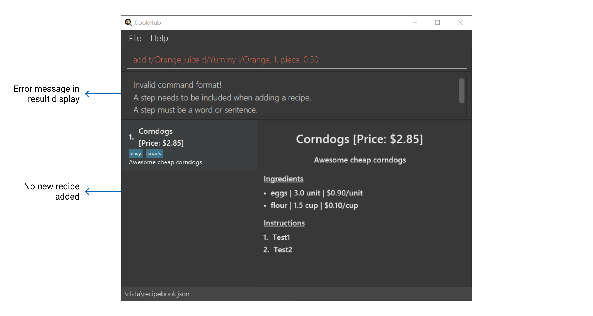
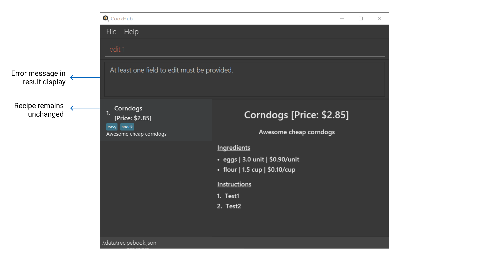
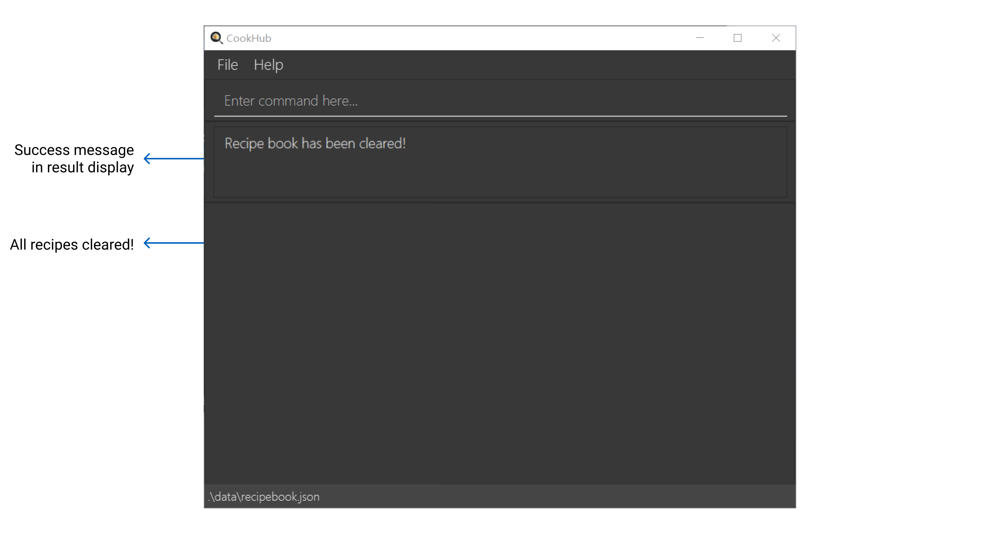
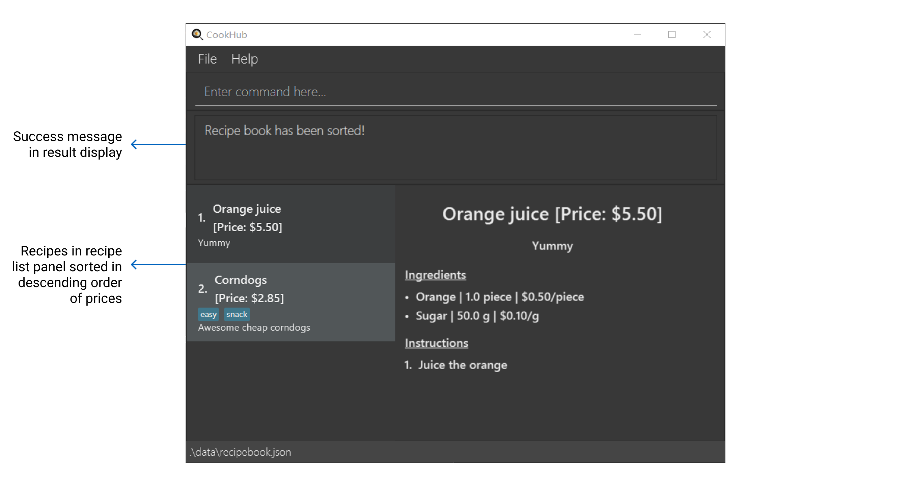
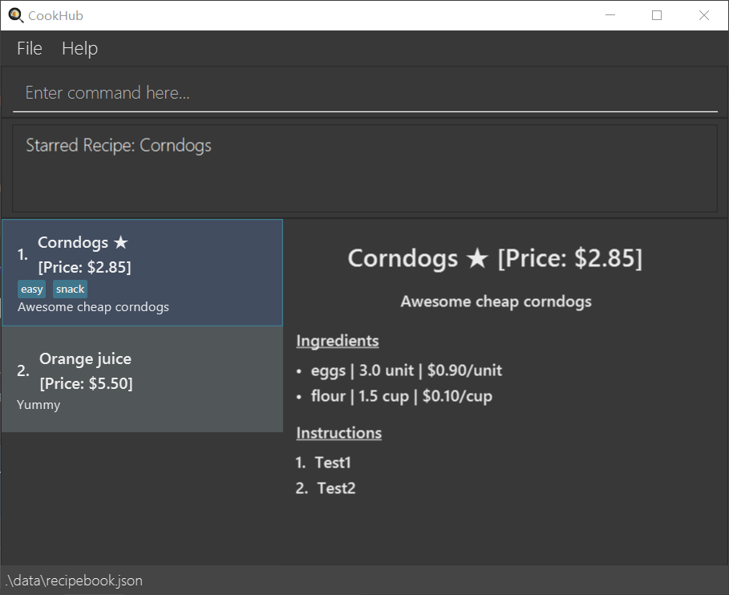
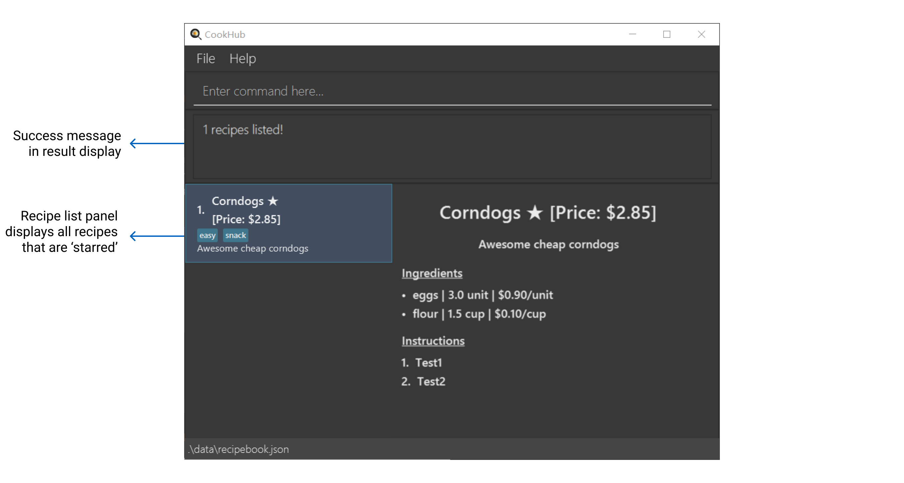

CookHub is a **desktop app for managing recipes, optimized for use via a Command Line Interface** (CLI) while still having the benefits of a Graphical User Interface (GUI). This recipe tracking app is targeted for student chefs on a tight budget and schedule with limited ingredients. 

**CookHub** operates via a [command line interface](#glossary) which aids fast typists in managing their recipes quickly, 
while still providing the benefits of a graphical user interface.

**CookHub** excels in its simplicity and optimisation for the university student's task management needs. Upon 
download, it supports management via recipe ingredients and price. Having a gentle learning curve and requiring 
minimal setup, it is perfect for the contemporary student cook!

The following is a short overview of the features and capabilities of CookHub:
* Creating tasks with specified titles, ingredients, steps, and tags.
* Starring and unstarring each recipe.
* Getting all your favourite recipes. 
* Finding recipes by titles, ingredients, steps, or tags.
* Sorting or filtering by price.
* Getting all the combined ingredients for a set of recipes. 

|   If you are   |                                         You should                                         |
|:--------------:|:------------------------------------------------------------------------------------------:|
|   a new user   | proceed to our [quick start](#quick-start) section to set up CookHub and try its features |
| returning user |       skip to our [command summary](#command-summary) for a summary of our features!       |

* Table of Contents
{:toc}

## Quick start

1. Ensure you have Java `11` or above installed in your Computer.

2. Download the latest `cookhub.jar` from [here](https://github.com/AY2223S2-CS2103T-W09-1/tp/releases).

3. Copy the file to the folder you want to use as the _home folder_ for your CookHub.

4. Open a command terminal, `cd` into the folder you put the jar file in, and use the `java -jar cookhub.jar` command to run the application. 
   A GUI similar to the below should appear in a few seconds. Note how the app contains some sample data. 
   
6. Type the command in the command box and press Enter to execute it. e.g. typing **`help`** and pressing Enter will open the help window. 
   Some example commands you can try:

   * `add t/Watermelon juice d/Quick and easy watermelon juice i/One watermelon s/Juice the watermelon` : Add a new recipe titled `Watermelon juice` that has a description `Quick and easy watermelon juice`, an ingredient of `One watermelon`, and a step of `Juice the watermelon`
   * `delete 1 ` : Delete a recipe at index 1
   * `list` : Lists all recipes
   * `exit`: Exits the app

1. Refer to the [Features](#features) below for details of each command.

## Features

**:information_source: Notes about the command format:** 

* Words in `UPPER_CASE` are the parameters to be supplied by the user. The parameters can also be input in any order. 
  - The format of the add command: 
  - `add t/TITLE d/DESCRIPTION i/INGREDIENT s/STEP [tag/TAG]`
  - Example usages of the add command:
  - `add t/Corndogs d/Delicious i/Flour, 3.5, Cup, 0.30 s/Mix batter` 
  - `add s/Mix batter i/Flour, 3.5, Cup, 0.30 t/Corndogs d/Delicious`

* Items in square brackets are optional. 
  - e.g  `add t/Corndogs d/Delicious i/Flour, 3.5, Cup, 0.30 s/Mix batter` is without the `tag/` flag as it is optional

* TITLE, DESCRIPTION, STEP are words or sentences (Java String).
  - e.g. `t/I am a title d/I am a description s/I am a step`

* INGREDIENT is of the format {ingredient_name, quantity, unit_of_measurement, price_per_unit}
  - e.g. `i/White wine vinegar, 2, tbsp, 0.10 i/large egg, 4, unit, 0.80`

---

## Beginners' commands

### Add a recipe : `add`

Adds a recipe to the recipe book.

Format: `add t/TITLE d/DESCRIPTION i/INGREDIENT... s/STEP... [tag/TAG]...`

:bulb: Tip: A recipe can have any number of tags (including 0)

Examples:

The original recipe book:

- `add t/Orange juice d/Yummy i/Orange, 1, piece, 0.50 s/Juice the orange` is valid and a recipe look like the picture
shown below will be added to the recipe book:
  

- `add t/Orange juice d/Yummy i/Orange, 1, piece, 0.50` is not valid because `s/` is compulsory and you will see an
error message like the one in the picture shown below:

- `add t/Orange juice d/Yummy i/Orange, 1, piece, 0.50 i/Sugar, 50, g, 0.10 s/Juice the orange` is valid because we can have
multiple `i/` flags and a recipe look like the picture shown below will be added to the recipe book:

---
### Edit a recipe: `edit {recipe number}`
Edits a recipe in the recipe book.

Format: `edit {recipe number} $[t/TITLE] [d/DESCRIPTION] [i/INGREDIENT] [s/STEP] [tag/TAG]...$`

- The *recipe number* refers to the index number shown in the displayed recipe book
- The *recipe number* must be a positive integer starting from 1 and must exist in the recipe book

Example:

The original recipe book:

- `edit 1 t/Corndog` is valid and the recipe will be edited like the picture shown below:

- `edit 1` is not valid as at least one flag is required and you will see an error message like the one in the picture
shown below:

- `edit 1 t/Corndogs i/flour, 200, g, 0.05` is valid as multiple flags are accepted and the recipe will be edited like
the picture shown below:

---
### Delete a recipe : `delete {recipe number}`
Deletes the recipe at the specified *task number* from the recipe book.

Format: `delete {recipe number}`

- The *recipe number* refers to the index number shown in the displayed recipe book
- The *recipe number* must be a positive integer starting from 1 and must exist in the recipe book

Expected outcome: You should see an updated list of recipes with the recipe at the specified index removed.

Examples:

The original recipe book:

- `delete 1` will change the recipe book to:

- `delete 2` is invalid as there is only 1 recipe in the recipe book for now and you will see an error message like the
one in the picture shown below:

---
### List recipe : `list`

Lists out all the recipes that you have added to CookHub

Format: `list`

Expected outcome: You should see a list of all the recipes in CookHub

Example: `list` will list all the recipes like the picture shown below:

---
### Clear recipe : `clear`

Clears the entire CookHub of all recipes

Format: `clear`

Expected outcome: You should see that CookHub has zero recipes in it

Example: `clear` will clear all recipes like the picture shown below:

---
## Advanced commands

### Find recipe : `find`

Finds the recipes in CookHub according to what you are looking for

Format: `find $$[r/RECIPE] [t/TITLE] [s/STEP] [i/INGREDIENT] [tag/TAG]$$`
- the flag `r/` searches through the entire recipe and its components
- the flag `t/` searches only through the recipe's title
- the flag `s/` searches only through the recipe's steps
- the flag `i/` seaches only through the recipe's ingredient names
- the flag `tag/` searches only through the recipe's tags

:exclamation: Constraint: `find i/INGREDIENT` should only be used to find the name of  the ingredients, and not its quantity/unit of measurement/price per unit. e.g. `find i/lemons` is OK, but `find i/30g` should not be used.

Examples:

The original recipe book:

- `find r/eggs` is valid and the result of the command is shown below:

- `find r/eggs s/fry the egg` is not valid because at most one flag is allowed and you will see an error message like
the one in the picture shown below:

- `find` is not valid as at least one flag is required and you will see an error message like the one in the picture
shown below:

---
### Search recipe with limited ingredients: `only`

Searches for recipes that can be made with only those ingredients

Format: `only INGREDIENT...`

Examples:

The original recipe book:

- e.g. `only` is not valid as a parameter is needed and you will see an error message like the one in the picture shown
below:

- e.g. `only eggs` is valid, will search for recipes that have ingredients that at most contain eggs, and nothing more,
and the result of the command is shown below:

- e.g. `only eggs flour` will search for recipes that have ingredients that at most contains eggs and flour.
A recipe that only needs eggs will also be valid. The result of the command is shown below:

---
### Sort recipe by cost: `sort {order}`

Sorts the recipes in the RecipeBook by price in the order specified. The order can only be `asc` for ascending order OR
`desc` for descending order. The price of a recipe is determined by cost of all ingredients required.

Format: `sort {order}`

Expected outcome: You should see a list of recipes sorted in ascending order of price.

Example: 

The original recipe book:

- `sort desc` will give you the result of the picture shown below:

---

### Filter recipe by price: `fp {comparator} {price}`

Filters the recipes in the RecipeBook by price according to the comparator specified. The `comparator` can only be `<` for less than OR `>` for more than. The `price` can take on any positive real value as the price of a recipe is determined by cost of all ingredients required.

Format: `fp {comparator} {price}`

Expected outcome: You should see a list of filtered recipes with price less than $4.50.

Example: 

The original recipe book:

- `fp < 4.50` will give you the result of the picture shown below:

---
### Add a recipe to the favorites: `star {index}`

Add the recipe at the specified *task number* in the favorites, which include all recipes you favor the most.

Format: `star {recipe number}`

- The *recipe number* refers to the index number shown in the displayed recipe book
- The *recipe number* must be a positive integer starting from 1 and must exist in the recipe book

Expected outcome: You should see a star after the title of the recipe you marked on.

Examples:

The original recipe book:

- `star 1` will give you the result of the picture shown below:

- `star 2` will give you the result of the picture shown below:

---
### Remove a recipe from the favorites: `unstar {index}`

Remove the recipe at the specified *task number* from the favorites.

Format: `unstar {recipe number}`

- The *recipe number* refers to the index number shown in the displayed recipe book
- The *recipe number* must be a positive integer starting from 1 and must exist in the recipe book

Expected outcome: You should not see the star after the title of the recipe you unmarked on.

Examples:

The original recipe book:

- `unstar 1` will give you the result of the picture shown below:

- `unstar 2` will give you the result of the picture shown below:

---
### List all recipes in the favorites : `favorites`

Lists out all the recipes that you have added to the favorites.

Format: `favorites`

Expected outcome: You should see a list of all the recipes in your favorites

Example:

The original recipe book:

- `favorites` will give you the result of the picture shown below:

---
### If you forget some commands, you are always welcome to check this page again!
### Showing the website for user guide : `help`

Shows a message explaining how to access the help page.

Expected outcome: You should see a window like the picture shown below:

Format: `help`

### Saving the data

CookHub data are saved in the hard disk automatically after any command that changes the data. There is no need to save manually.

### Editing the data file

CookHub data are saved as a JSON file `[JAR file location]/data/cookhub.json`. Advanced users are welcome to 
update data directly by editing that data file.

:exclamation: **Caution:**
If your changes to the data file makes its format invalid, CookHub will discard all data and start with an empty data file at the next run.

### Archiving data files `[coming in v2.0]`

_Details coming soon ..._

## FAQ

**Q**: How do I transfer my data to another Computer? 
**A**: Install the app in the other computer and overwrite the empty data file it creates with the file that contains the data of your previous CookHub home folder.

## Command summary
Format meanings:

- Words in lower_case are commands or flags to be typed as-is
- Words in UPPER_CASE are values of parameters to be supplied by the user
- Words in [Square brackets] are optional parameters (Note:ls can stack filters)
- Words that are followed by * are parameters that can be used multiple times

| Action                   | Format | Examples  |
|--------------------------|--------|-----------|
| Delete Recipe            | delete {recipe number} | delete 1  |
| Sort Recipes by price    | sort {order} | sort asc  |
|  Filter Recipes by price | filter {comparator} {price} | fp < 4.20 |

## Glossary
| Word	|    Definition                                                  |
|-------|----------------------------------------------------------------------|

**Command Line Interface (CLI)** | 	A program that mainly uses typed commands to interact with the app. 
**Graphical User Interface (GUI)** | 	What the user sees when interacting with the app.                   
Alphanumeric | A combination of both letters and numbers without space.             
Terminal| A text-based interface for the computer.                             

[Back to top](#top)

