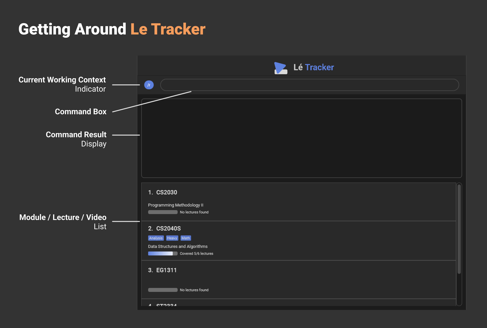
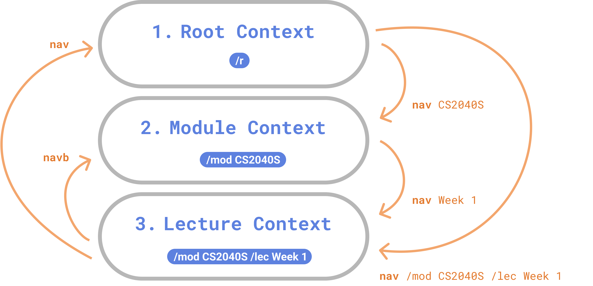

## Welcome to **Le Tracker** ~

> “The tragedy in life doesn’t lie in not reaching your goal. The tragedy lies in having no goal to reach.” - Benjamin E. Mays

School is hard. With numerous modules to juggle and endless topics to master, being a student can feel overwhelming at times. But does this _truly_ need to be the case?

We believe that with a little help, content mastery is **more than achievable**.

> “You don't actually do a project; you can only do action steps related to it. When enough of the right action steps have been taken, some situation will have been created that matches your initial picture of the outcome closely enough that you can call it "done.”
> ― David Allen, Getting Things Done: The Art of Stress-Free Productivity

**Le Tracker** makes it easy to measure your overall study progress by tracking how much lecture content you have covered across various modules. **More** than just a simple to-do list app, **Le Tracker** blends the **efficiency** of a command line interface with the **elegance** of modern graphical user interface.

Now it's time to **CONQUER** the semester!

## Table of Contents

- [Quick Start Guide](#quick-start-guide)
  - [Prerequisite](#prerequisite)
  - [Installation and Setup](#installation-and-setup)
  - [User Interface and Getting Started](#user-interface-and-getting-started)
  - [A Brief Guide to Navigation](#a-brief-guide-to-navigation)
  - [Tutorials and Examples](#tutorials-and-examples)
- [Command Syntax](#command-syntax)
- [Argument Formats](#argument-formats)
- [Navigation](#navigation)
  - [Current Working Context](#current-working-context)
  - [Two Ways of Navigating](#two-ways-of-navigating)
  - [Navigation Injection](#navigation-injection)
  - [Specifying Your Own Context In Commands](#specifying-your-own-context-in-commands)
- [Command Manual](#command-manual)
  - [Nav](#nav)
  - [List](#list)
  - [Find](#find)
  - [Add](#add)
  - [Edit](#edit)
  - [Delete](#delete)
  - [Mark or Unmark](#mark-or-unmark)
  - [Tag](#tag)
  - [Untag](#untag)
  - [Export](#export)
  - [Import](#import)
  - [Clear](#clear)
  - [Exit](#exit)
- [Notes](#notes)
- [Warning](#warning)
- [FAQ](#faq)
- [Command Summary](#command-summary)

---

## Quick Start Guide

### Prerequisite

Make sure you have Java `11` installed on your computer by typing `java --version` from your terminal. The output should be something similar to:

```java
openjdk 11.0.18 2023-01-17 LTS
OpenJDK Runtime Environment Zulu11.62+17-CA (build 11.0.18+10-LTS)
OpenJDK 64-Bit Server VM Zulu11.62+17-CA (build 11.0.18+10-LTS, mixed mode)
```

If not, please download it from the [Oracle website](https://www.oracle.com/sg/java/technologies/javase/jdk11-archive-downloads.html).

### Installation and Setup

1. Download the latest version of [letracker.jar](https://github.com/AY2223S2-CS2103-F10-2/tp/releases).

2. Open your terminal and navigate to the directory of the downloaded jar file.

3. Run the jar file by `java -jar letracker.jar`.

### User Interface and Getting Started



1. Type any input in the command box.

2. Press `Enter` to execute a command.\
   For example, typing `help` and pressing `Enter` will open the help window.

3. Use :arrow_up: and :arrow_down: arrow keys to scroll through previous commands that were executed successfully.

### A Brief Guide to Navigation

Current Working Context Indicator

- The **blue label** on the left of the command box displays your [current working context](#current-working-context).

- 

**Navigating** to different contexts

- Here are some ways you can **navigate** between different contexts.



For more information on **navigation**, please view the [navigation section](#navigation).

### Tutorials and Examples

:information_source: Both scenarios achieve the same results, the difference lies in the context system used. You may try on either one of the scenario. If you are familiar with [navigation](#navigation), try out `Scenario 2` to be more comfortable with the syntax. If not, try out `Scenario 1` to gain a better understanding of how [navigation](#navigation) works.

Scenario 1 - Using [Navigation](#navigation)

1. To add a module, execute `add CS2103 /name Software Engineering`.
1. To add a tag of `BestModule`, execute `tag CS2103 /tags BestModule`.
1. To navigate into module `CS2103`, execute `nav CS2103`.
1. To add a lecture, execute `add Week 1`.
1. To navigate into lecture `Week 1`, execute `nav Week 1`.
1. To add a video, execute `add Vid 1`.
1. To add a timestamp, execute `edit Vid 1 /timestamp 10:20:15`.
1. To mark video as watched, execute `mark Vid 1`.
1. To change video name to `video 1`, execute `edit Vid 1 /name video 1`.
1. To delete a video, execute `delete video 1`.
1. To navigate back into module `CS2103` and list it's lectures, execute `navb`.
1. To add a tag of `Intro`, execute `edit Week 1 /tags Intro`.
1. To remove a tag of `Intro`, execute `untag Week 1 /tags Intro`
1. To navigate back to root context and list all modules, execute `nav` or `navb`.

Scenario 2 - Not using [Navigation](#navigation)

1. To add a module, execute `add CS2103 /name Software Engineering`.
1. To add a tag of `BestModule`, execute `tag CS2103 /tags BestModule`.
1. To add a lecture, execute `add Week 1 /mod CS2103`.
1. To add a video, execute `add Vid 1 /mod CS2103 /lec Week 1`.
1. To add a timestamp, execute `edit Vid 1 /mod CS2103 /lec Week 1 /timestamp 10:20:15`.
1. To list videos, execute `list /mod CS2103 /lec Week 1`.
1. To mark video as watched, execute `mark Vid 1 /mod CS2103 /lec Week 1`.
1. To change video name to `video 1`, execute `edit Vid 1 /mod CS2103 /lec Week 1 /name video 1`.
1. To delete a video, execute `delete video 1 /mod CS2103 /lec Week 1`.
1. To list lectures, execute `list /mod CS2103`.
1. To add a tag of `Intro`, execute `edit Week 1 /mod CS2103 /tags Intro`.
1. To remove a tag of `Intro`, execute `untag Week 1 /mod CS2103 /tags Intro`
1. To list all modules, execute `list`.

:clap: That covers all the main commands. Refer to the [Command Manual](#command-manual) section for details of each command. Feel free to play around with the sample data to familiarise yourself with the commands. Once you are comfortable, execute `clear` to delete all data and start from scratch.

[Back to TOC :clipboard:](#table-of-contents)

---

## Command Syntax

:information_source: Named arguments are arguments which have a prefix while unnamed arguments are arguments without a prefix.\
e.g. For the command `add CS2040S /name DSAG`, "CS2040S" is the value of the unnamed argument and "DSAG" is the value of the named argument `/name`.

1. Items in curly braces (i.e. `{}`) are **placeholders** for some actual value. In a command format, they represent the **argument values** to be supplied by the user.
   <details>
   <summary>Example</summary>
   For a command with format <code>add {module_code}</code>, <code>{module_code}</code> is an argument value. The command can be used as <code>add CS2040</code>.
   </details>
   <p></p>

2. Items in square brackets (i.e. `[]`) are **optional**.
   <details>
   <summary>Example</summary>
   For a command with format <code>add {module_code} [/name {module_name}]</code>, the <code>/name</code> argument is optional. The command can be used as <code>add CS2040 /name Data Structures and Algorithms</code> or as <code>add CS2040</code>.
   </details>
   <p></p>

3. An ellipsis (i.e. `...`) indicates that **multiple** values can be provided.
   <details>
   <summary>Example</summary>
   For a command with format <code>tag {module_code} /tags {tag_1}[, {tag_2}[, {tag_3}[, ...]]]</code>, the <code>/tag</code> argument can take multiple values. The command can be used as <code>tag CS2040S /tags Heavy, Hard, Math, Analysis</code>.
   </details>
   <p></p>

4. Named arguments can be specified in **any order** as long as it is after all unnamed arguments (if any).
   <details>
   <summary>Example</summary>
   For a command with format <code>edit {module_code} /code {updated_code} /name {updated_name}</code>, the command can be used as <code>edit CS2040 /code CS2040S /name DSAG</code> or as <code>edit CS2040 /name DSAG /code CS2040S</code>.
   </details>
   <p></p>

5. If a named argument is expected only once in the command but the user specified it multiple times, only the **last occurrence** of the argument will be taken.
   <details>
   <summary>Example</summary>
   For a command with format <code>add {module_code} [/name {module_name}]</code>, if used as <code>add CS2040 /name Data Structures and Algorithms /name DSAG</code>, <code>DSAG</code> will be taken as the value of the <code>/name</code> argument.
   </details>
   <p></p>

6. Extraneous arguments will be **ignored**.
   <details>
   <summary>Example</summary>
   For a command with format <code>add {module_code} /name {module_name}</code>, if used as <code>add CS2040 /name DSAG /foo bar</code>, the <code>/foo</code> argument is ignored.
   </details>
   <p></p>

7. Any occurrence of `/{argument_name}`, where `{argument_name}` contains only alphabetical characters (a-z, A-Z), will be treated as a **named argument** if the following 2 conditions are met:
   - There is a whitespace before `/{argument_name}`
   - `/{argument_name}` is followed by a whitespace or it is the end of the command

   <details>
   <summary>Example</summary>
   For the command <code>find Intro /mod CS2040S /byTag</code>, <code>/mod</code> and <code>/byTag</code> are both recognised as named arguments.

   For the command <code>find Intro /modCS2040S /byTag</code>, only <code>/byTag</code> is recognised as a named argument while <code>Intro /modCS2040S</code> is treated as the value of the unnamed argument.
   </details>

[Back to TOC :clipboard:](#table-of-contents)

---

## Argument Formats

- <div id="lecture-name-format"><strong>Lecture Name</strong></div>

  Lecture names should only contain alphanumeric characters and spaces, and it should not be blank.\
  e.g. Week 1

- <div id="module-code-format"><strong>Module Code</strong></div>

  Module codes should begin with uppercase alphabetcal characters (A-Z), followed by numeric characters, optionally followed by more uppercase alphabetical characters (A-Z).\
  e.g. CS2040S

- <div id="module-name-format"><strong>Module Name</strong></div>

  Module names should only contain alphanumeric characters and spaces, and it can be blank.\
  e.g. Data Structures and Algorithms

- <div id="tag-format"><strong>Tag</strong></div>

  Tags should only contain alphanumeric characters, and it should not be blank.\
  e.g. 4MCs

- <div id="timestamp-format"><strong>Timestamp</strong></div>

  Timestamp should be of the format `HH:mm:ss` where `HH` is the number of hours, `mm` is the number of minutes, and `ss` is number of seconds, each integer being exactly 2 digits long.\
  e.g. 01:20:03

- <div id="video-name-format"><strong>Video Name</strong></div>

  Video names should only contain alphanumeric characters and spaces, and it should not be blank.\
  e.g. Video 1

[Back to TOC :clipboard:](#table-of-contents)

---

## Navigation

### Current Working Context

Le Tracker organises content using a **hierarchical structure** (Modules -> Lectures -> Videos).
When you are studying a specific lecture topic (e.g. Week 1 of CS2040S), you may find yourself frequently performing commands that are related to the module "CS2040S" and lecture "Week 1".

To avoid the need to constantly specify the module and lecture parameters for such commands, the navigation system allows you to specify a **current working context** instead.

Type of contexts

-  **Root context**: The default and top-most context.
-  **Module context**: Represents a specified module.
-  **Lecture context**: Represents a specified lecture that belongs to a specified module.

### Two Ways of Navigating

You can specify a current working context by **navigating**.

- There are two ways of **navigating** - **relatively** or **directly**.

For example, you can navigate to the **lecture context** - lecture "Week 1" of the module "CS2040S" by

- Navigating **relatively** from the **root context**
  

  1. Navigate to the module context from the root context.
  > `nav CS2040S`
  2. Navigate to the lecture context from the module context.
  > `nav Week 1`

- Navigating **directly** from any **context**
    
  1. Navigate directly to the lecture "Week 1" of the module "CS2040S".
  > `nav /mod CS2040S /lec Week 1`

### Navigation Injection

After navigating to a lecture or module context, the navigation system will **inject** the required module and lecture parameters (i.e. `/mod CS2040S`, `/lec Week 1`) into commands so you don't have to!

Here are some **examples** of how the navigation system injects the necessary context-related parameters into your commands:

  1.  Add "Video 2" to the lecture "Week 1" of module "CS2040S".
  > `add Video 2` -> `add Video 2 /mod CS2040S /lec Week 1`
  2.  List the videos of lecture "Week 1" of module "CS2040S".
  > `list` -> `list /mod CS2040S /lec Week 1`
  3.  Add "Video 1" to lecture "Week 1" of module "CS2040S".
  > `add Video 1 /lec Week 1` -> `add Video 1 /mod CS2040S /lec Week 1`

### Specifying Your Own Context In Commands

To specify your own context for a command without any [injection](#navigation-injection), you can use the `/r`, `/mod`, `/lec` arguments in your commands.

The following can be performed at **any** [current working context](#current-working-context)

- Including the `/r` argument will perform a command from the **root context**.
  - e.g. List all modules at the root context.
  > `list /r` -> `list`
- Including the `/mod` argument will perform a command from the **module context**.
  - e.g. Add lecture "Week 10" for module "CS2040S".
  > `add Week 10 /mod CS2040S` -> `add Week 10 /mod CS2040S` (No injection)
- Including the `/mod` and `/lec` arguments will perform a command from the **lecture context**.
  - e.g. Add video "BST Challenge" for lecture "Week 5" of module "CS2040S".
  > `add BST Challenge /mod CS2040S /lec Week 5` -> `add BST Challenge /mod CS2040S /lec Week 5` (No injection)

To make it easier to specify a lecture context which shares the same module code as your current working context, the `/mod` prefix can be injected when only the `/lec` prefix is specified.

- e.g.  List videos of lecture "Week 5" of module "CS2040S".

> `list /lec Week 5` -> `list /mod CS2040S /lec Week 5`

- Note that the lecture week is different from the current working context and that only the `/mod` prefix has been injected into the command input.

[Back to TOC :clipboard:](#table-of-contents)

---

## Command Manual

:information_source: The matching of values is case sensitive unless otherwise stated. For example, the lecture names "Week 1" and "week 1" are not the same.

:information_source: If an argument value requires a specific format, click the argument value placeholder beside the argument description to go to the section containing the format.

### Nav

#### Navigate to the Root Context

> `nav`
Navigate to the root context from any context.

#### Navigate from Root Context to Module Context

> `nav {module_code}`

Navigates from the root context to a module context.

- [<span style="color:#e46c0a">`module_code`</span>](#module-code-format) : The code of the module to navigate to
  - Must belong to an existing module in Le Tracker

#### Navigate from Module Context to Lecture Context

> `nav {lecture_name}`

Navigates from a module context to a lecture context.

- [<span style="color:#e46c0a">`lecture_name`</span>](#lecture-name-format) : The name of the lecture to navigate to
  - Must belong to an existing lecture in the module of the current working context

#### Navigate Directly

> `nav /mod {module_code} [/lec {lecture_name}]`

Navigates directly to the specified module or lecture context.

- [<span style="color:#e46c0a">`module_code`</span>](#module-code-format) : The code of the module that contains the lecture specified in `lecture_name`
  - Must belong to an existing module in Le Tracker
- [<span style="color:#e46c0a">`lecture_name`</span>](#lecture-name-format) : The name of the lecture to navigate to
  - Must belong to an existing lecture in the module specified in `module_code`

#### Navigate Backwards

> `navb`

Navigates backwards to a higher context unless already at root context.

[Back to TOC :clipboard:](#table-of-contents)

### List

:information_source: Items are listed in an alphabetical order sorted by `module_code` for `Module`, `lecture_name` for `Lecture` and `video_name` for `Video`.

#### List Modules

> `list`


When in a module or lecture context, the navigation system will inject the `/mod` and `/lec` arguments transforming the user's command into the command specified in [List Lectures](#list-lectures) or [List Videos](#list-videos) (refer to [Navigation Injection](#navigation-injection) for more information).

#### List Lectures

> `list /mod {module_code}`

Lists all lectures of a module.

- [<span style="color:#e46c0a">`module_code`</span>](#module-code-format) : The code of the module to list the lectures from.
  - Must belong to an existing module in Le Tracker

<details open>
<summary>Example</summary>
<ul>
    <li>
    <code>list /mod CS2040S</code><br/>
    lists lectures belonging to CS2040S
    </li>
</ul>
</details>

#### List Videos

> `list /mod {module_code} /lec {lecture_name}`

Lists all videos of a lecture in a module.

- [<span style="color:#e46c0a">`module_code`</span>](#module-code-format) :
The code of the module that contains the lecture specified in `lecture_name`
  - Must belong to an existing module in Le Tracker
- [<span style="color:#e46c0a">`lecture_name`</span>](#lecture-name-format) : The name of the lecture
  - Must belong to an existing lecture in the specified `module_code`

<details open>
<summary>Example</summary>
<ul>
    <li>
    <code>list /mod CS2040 /lec Week 1</code><br/>
    lists videos in lecture Week 1 belonging to CS2040S
    </li>
</ul>
</details>

[Back to TOC :clipboard:](#table-of-contents)

### Find

:exclamation: This is a case insensitive search and matches a target that starts with the search term.\
E.g:

|Type|Data|Keyword|Matched|
|-|-|-|-|
|ModuleCode|[CS2040S, CS2103, ST2334, MA2001]|cs21|[CS2103]|
|LectureName|[Week 1, Week 2, Week 3]|week|[Week 1, Week 2, Week 3]|
|VideoName|[Video 1, Video 2, Some video]|video 1, some|[Video 1, Some video]|

#### Find Modules

> `find {keywords} [/byTag]`

Find all modules whose code starts with any of the keyword(s).

- <span style="color:#e46c0a">`/byTag`</span> : If specified, the list filters for modules whose tag list contains any tag that starts with any of the keyword(s)


When in a module or lecture context, the navigation system will inject the `/mod` and `/lec` arguments transforming the user's command into the command specified in [Find Lectures](#find-lectures) or [Find Videos](#find-videos) (refer to [Navigation Injection](#navigation-injection) for more information).

<details open>
<summary>Example</summary>
<ul>
    <li>
    Assuming only a module <code>CS2040S</code> has tags <code>["heavy", "math"]</code>,<br/>
    <code>find heav /byTag</code><br/>
    will list modules [CS2040S].
    </li>
</ul>
</details>

#### Find Lectures

> `find {keywords} /mod {module_code} [/byTag]`

Find all lectures in a specified module whose name starts with any of the keyword(s).

- [<span style="color:#e46c0a">`module_code`</span>](#module-code-format) : The code of the module that contains the lecture specified in `lecture_name`
  - Must belong to an existing module in Le Tracker
- <span style="color:#e46c0a">`/byTag`</span> : If specified, the list filters for lectures in a specifed module whose tag list contains any tag that starts with any of the keyword(s)


<details open>
<summary>Example</summary>
<ul>
    <li>
    <code>find week 1, week 2 /mod CS2040S</code><br/>
    will list lectures ["Week 1", "Week 2"] of module "CS2040S".
    </li>
    <li>
    <code>find intro, array /mod CS2040S /byTag</code><br/>
    will list lectures belonging to module "CS2040S" with tags containing "intro" or "array".
    </li>
</ul>
</details>

#### Find Videos

> `find {keywords} /mod {module_code} /lec {lecture_name} [/byTag]`

Find all videos in a specified lecture in a specified module whose name starts with any of the keyword(s).

- [<span style="color:#e46c0a">`module_code`</span>](#module-code-format) : The code of the module that contains the lecture specified in `lecture_name`
  - Must belong to an existing module in Le Tracker
- [<span style="color:#e46c0a">`lecture_name`</span>](#lecture-name-format) : The name of the lecture
  - Must belong to an existing lecture in the specified `module_code`
- <span style="color:#e46c0a">`/byTag`</span> : If specified, the list filters for videos in a specified lecture in a specified module whose tag list contains any tag that starts with any of the keyword(s)

<details open>
<summary>Example</summary>
<ul>
    <li>
    <code>find vid1, vid2 /mod CS2040S /lec Week 2</code><br/>
    will list videos ["Vid1", "Vid2"] in lecture Week 2 of module "CS2040S".
    </li>
    <li>
    <code>find content /mod CS2040S /lec Week 2 /byTag</code><br/>
    will list videos belonging to lecture "Week 2" of module "CS2040S" with tags containing "content".
    </li>
</ul>
</details>

[Back to TOC :clipboard:](#table-of-contents)

### Add

#### Add a Module

> `add {module_code} [/name {name}] [/tags {tag_1}[, {tag_2}[, ...]]]`

Add a module to Le Tracker.

- [<span style="color:#e46c0a">`module_code`</span>](#module-code-format) : The code of the module
  - Must be unique among the module code of the modules in Le Tracker
- [<span style="color:#e46c0a">`module_name`</span>](#module-name-format) : The name of the module
- [<span style="color:#e46c0a">`tag_1, tag_2, ...`</span>](#tag-format) : The tags to apply to the module
  - Repeated tags (if any) will be ignored

<details open>
<summary>Example</summary>
<ul>
    <li>
    <code>add CS2040S /name Data Structures and Algorithms /tags Heavy, Math, Analysis</code><br/>
    Add a module with code "CS2040S" to Le Tracker. The module is named "Data Structures and Algorithms" and has tags "Heavy", "Math", and "Analysis".
    </li>
</ul>
</details>


When in a module or lecture context, the navigation system will inject the `/mod` and `/lec` arguments transforming the user's command into the command specified in [Add a Lecture](#add-a-lecture) or [Add a Video](#add-a-video) (refer to [Navigation Injection](#navigation-injection) for more information).

#### Add a Lecture

> `add {lecture_name} /mod {module_code} [/tags {tag_1}[, {tag_2}[, ...]]]`

Add a lecture to a module.

- [<span style="color:#e46c0a">`lecture_name`</span>](#lecture-name-format) : The name of the lecture
  - Must be unique among the names of the lectures belonging to the module specified in `module_code`
- [<span style="color:#e46c0a">`module_code`</span>](#module-code-format) : The code of the module to add the lecture to
  - Must belong to an existing module in Le Tracker
- [<span style="color:#e46c0a">`tag_1, tag_2, ...`</span>](#tag-format) : The tags to apply to the lecture
  - Repeated tags (if any) will be ignored

<details open>
<summary>Example</summary>
<ul>
    <li>
    <code>add Week 1 /mod CS2040S /tags Intro, Important</code><br/>
    Add a lecture named "Week 1" to the module with code "CS2040S". The lecture has tags "Intro" and "Important".
    </li>
</ul>
</details>

#### Add a Video

> `add {video_name} /mod {module_code} /lec {lecture_name} [/timestamp {timestamp}] [/tags {tag_1}[, {tag_2}[, ...]]] [/watch]`

Add a video to a lecture.

- [<span style="color:#e46c0a">`video_name`</span>](#video-name-format) : The name of the video
  - Must be unique among the names of the videos belonging to the lecture specified in `lecture_name`
- [<span style="color:#e46c0a">`module_code`</span>](#module-code-format) : The code of the module that contains the lecture specified in `lecture_name`
  - Must belong to an existing module in Le Tracker
- [<span style="color:#e46c0a">`lecture_name`</span>](#lecture-name-format) : The name of the lecture to add the video to
  - Must belong to an existing lecture in the module specified in `module_code`
- [<span style="color:#e46c0a">`timestamp`</span>](#timestamp-format) : The timestamp of the video where the user last stopped watching at
  - Defaults to `00:00:00` if the `/timestamp` argument is not specified
- [<span style="color:#e46c0a">`tag_1, tag_2, ...`</span>](#tag-format) : The tags to apply to the video
  - Repeated tags (if any) will be ignored
- <span style="color:#e46c0a">`/watch`</span> : If specified, the video will be marked as "watched", else, it will be marked as "not watched"

<details open>
<summary>Example</summary>
<ul>
    <li>
    <code>add Video 1 /mod CS2040S /lec Week 1 /timestamp 01:04:20 /tags Intro, Short /watch</code><br/>
    Add a video named "Video 1" to the lecture named "Week 1" which belongs to the module with code "CS2040S". The video has timestamp "01:04:20" and has tags "Intro" and "Short". The video is also marked as watched.
    </li>
</ul>
</details>


When in a module or lecture context, the `/mod` argument will be injected if only the `/mod` argument is omitted in the original command (refer to [Navigation Injection](#navigation-injection) for more information).

[Back to TOC :clipboard:](#table-of-contents)

### Edit

#### Edit a Module

> `edit {module_code} [/code {updated_code}] [/name {updated_name}] [/tags {tag_1}[, {tag_2}[, ...]]]`

Edit the details of a module.

- [<span style="color:#e46c0a">`module_code`</span>](#module-code-format) : The code of the module to be edited
  - Must belong to an existing module in Le Tracker
- [<span style="color:#e46c0a">`updated_code`</span>](#module-code-format) : The updated module code
  - Must be unique among the module code of the modules in Le Tracker
- [<span style="color:#e46c0a">`updated_name`</span>](#module-name-format) : The updated module name
- [<span style="color:#e46c0a">`tag_1, tag_2, ...`</span>](#tag-format) : The tags that will replace the current tags applied to the module
  - Repeated tags (if any) will be ignored

<details open>
<summary>Example</summary>
<ul>
    <li>
    <code>edit CS2040S /code CS2040 /name DSAG /tags Heavy, Math, Analysis</code><br/>
    Edit the module with code "CS2040S". The module's code is updated to "CS2040", it's name updated to "DSAG" and it's tags are updated to "Heavy", "Math" and "Analysis".
    </li>
</ul>
</details>


When in a module or lecture context, the navigation system will inject the `/mod` and `/lec` arguments transforming the user's command into the command specified in [Edit a Lecture](#edit-a-lecture) or [Edit a Video](#edit-a-video) (refer to [Navigation Injection](#navigation-injection) for more information).

#### Edit a Lecture

> `edit {lecture_name} /mod {module_code} [/name {updated_name}] [/tags {tag_1}[, {tag_2}[, ...]]]`

Edit the details of a lecture.

- [<span style="color:#e46c0a">`lecture_name`</span>](#lecture-name-format) : The name of the lecture to be edited
  - Must belong to an existing lecture in the module specified in `module_code`
- [<span style="color:#e46c0a">`module_code`</span>](#module-code-format) : The code of the module that contains the lecture specified in `lecture_name`
  - Must belong to an existing module in Le Tracker
- [<span style="color:#e46c0a">`updated_name`</span>](#lecture-name-format) : The updated lecture name
  - Must be unique among the names of the lectures belonging to the module specified in `module_code`
- [<span style="color:#e46c0a">`tag_1, tag_2, ...`</span>](#tag-format) : The tags that will replace the current tags applied to the lecture
  - Repeated tags (if any) will be ignored

<details open>
<summary>Example</summary>
<ul>
    <li>
    <code>edit Week 1 /mod CS2040S /name Week 01 Introduction /tags Intro, Important</code><br/>
    Edit the lecture named "Week 1" in the module with code "CS2040S". The lecture's name is updated to "Week 01 Introduction" and it's tags are updated to "Intro" and "Important".
    </li>
</ul>
</details>

#### Edit a Video

> `edit {video_name} /mod {module_code} /lec {lecture_name} [/name {updated_name}] [/timestamp {updated_timestamp}] [/tags {tag_1}[, {tag_2}[, ...]]] [/watch] [/unwatch]`

Edit the details of a video.

- [<span style="color:#e46c0a">`video_name`</span>](#video-name-format) : The name of the video to be edited
  - Must belong to an existing video in the lecture specified in `lecture_name`
- [<span style="color:#e46c0a">`module_code`</span>](#module-code-format) : The code of the module that contains the lecture specified in `lecture_name`
  - Must belong to an existing module in Le Tracker
- [<span style="color:#e46c0a">`lecture_name`</span>](#lecture-name-format) : The name of the lecture that contains the video specified in `video_name`
  - Must belong to an existing lecture in the module specified in `module_code`
- [<span style="color:#e46c0a">`updated_name`</span>](#video-name-format) : The updated video name
  - Must be unique among the names of the videos belonging to the lecture specified in `lecture_name`
- [<span style="color:#e46c0a">`updated_timestamp`</span>](#timestamp-format) : The updated timestamp of the video where the user last stopped watching at
- [<span style="color:#e46c0a">`tag_1, tag_2, ...`</span>](#tag-format) : The tags that will replace the current tags applied to the lecture
  - Repeated tags (if any) will be ignored
- <span style="color:#e46c0a">`/watch`</span> : If specified, the video will be marked as "watched"
  - If this argument is specified, then `/unwatch` should not be specified
- <span style="color:#e46c0a">`/unwatch`</span> : If specified, the video will be marked as "not watched"
  - If this argument is specified, then `/watch` should not be specified

<details open>
<summary>Example</summary>
<ul>
    <li>
    <code>edit Video 1 /mod CS2040S /lec Week 1 /name Video 01 Grade Breakdown /timestamp 01:04:20 /tags Intro, Short /watch</code><br/>
    Edit the video named "Video 1" in the lecture named "Week 1" which belongs to the module with code "CS2040S". The video's name is updated to "Video 01 Grade Breakdown", it's timestamp updated to "01:04:20" and it's tags are updated to "Intro" and "Short". The video is also marked as watched.
    </li>
</ul>
</details>


When in a module or lecture context, the `/mod` argument will be injected if only the `/mod` argument is omitted in the original command (refer to [Navigation Injection](#navigation-injection) for more information).

[Back to TOC :clipboard:](#table-of-contents)

### Delete

#### Delete Module

> `delete {module_code_1}[, {module_code_2}[, {module_code_3}[, ...]]]`

Deletes the specified module(s) and all its embodied content from the application.

- [<span style="color:#e46c0a">`module_code_1, module_code_2, module_code_3, ...`</span>](#module-code-format): The codes of the modules
  - Must belong to an existing module in Le Tracker
  - Must not contain duplicates

<details open>
  <summary>Examples:</summary>
  <ul>
    <li>
      <code>delete CS2040</code><br/>
      deletes <code>CS2040</code> module
    </li>
    <li>
      <code>delete CS2040, ST2334</code><br/>
      deletes <code>CS2040</code> and <code>ST2334</code> modules
    </li>
  </ul>
</details>


When in a module or lecture context, the navigation system will automatically inject the `/mod` and `/lec` arguments transforming the user's command into the command specified in [Delete Lecture](#delete-lecture) or [Delete Video](#delete-video) (refer to [Navigation Injection](#navigation-injection) for more information).

#### Delete Lecture

> `delete {lecture_name_1}[, {lecture_name_2}[, {lecture_name_3}[, ...]]] /mod {module_code}`

Deletes the specified lecture(s) and all its embodied content from the same specified module.

- [<span style="color:#e46c0a">`lecture_name_1, lecture_name_2, lecture_name_3, ...`</span>](#lecture-name-format): The names of lectures
  - Must belong to an existing lecture in the module specified in `module_code`
  - Must not contain duplicates
- [<span style="color:#e46c0a">`module_code`</span>](#module-code-format): The code of module that contains the lectures specified by the names of lectures
  - Must belong to an existing module in Le Tracker

<details open>
  <summary>Examples:</summary>
  <ul>
    <li>
      <code>delete lecture 1 /mod CS2040</code><br/>
      deletes <code>lecture 1</code> lecture found in module <code>CS2040</code>
    </li>
    <li>
      <code>delete lecture 1, lecture 2 /mod ST2334</code><br/>
      deletes <code>lecture 1</code> and <code>lecture 2</code> lectures found in module <code>ST2334</code>
    </li>
  </ul>
</details>

#### Delete Video

> `delete {video_name_1}[, {video_name_2}[, {video_name_3}[, ...]]] /mod {module_code} /lec {lecture_name}`

Deletes the specified video(s) and all its embodied content from the same specified lecture of the specified module.

- [<span style="color:#e46c0a">`video_name_1, video_name_2, video_name_3, ...`</span>](#video-name-format): The names of videos
  - Must belong to existing videos in the lecture specified in `lecture_name`
  - Must not contain duplicates
- [<span style="color:#e46c0a">`module_code`</span>](#module-code-format): The code of the module that contains the lecture specified in `lecture_name`
  - Must belong to an existing module in Le Tracker
- [<span style="color:#e46c0a">`lecture_name`</span>](#lecture-name-format): The name of the lecture that contains the videos specified by the names of videos
  - Must belong to an existing lecture in the module specified in `module_code`

<details open>
  <summary>Examples:</summary>
  <ul>
    <li>
      <code>delete video 3 /mod CS2040 /lec lecture 1</code><br/>
      deletes <code>video 3</code> from lecture <code>lecture 1</code> of module `CS2040`
    </li>
    <li>
      <code>delete video 1, video 3 /mod CS2040 /lec lecture 1</code><br/>
      deletes <code>video 1</code> and <code>video 3</code> from lecture <code>lecture 1</code> of module <code>CS2040</code>
    </li>
  </ul>
</details>


When in a module or lecture context, the `/mod` argument will be injected if only the `/mod` argument is omitted in the original command (refer to [Navigation Injection](#navigation-injection) for more information).

[Back to TOC :clipboard:](#table-of-contents)

### Mark or Unmark

> `mark {video_name_1}[, {video_name_2}[, {video_name_3}[, ...]]] /mod {module_code} /lec {lecture_name}`

Marks video(s) as **watched** in lecture of its specified module.

> `unmark {video_name_1}[, {video_name_2}[, {video_name_3}[, ...]]] /mod {module_code} /lec {lecture_name}`

Marks video(s) as **unwatched** in a lecture of its specified module.

- [<span style="color:#e46c0a">`video_name_1, video_name_2, video_name_3, ...`</span>](#video-name-format): The names of videos
  - Must belong to existing videos in the lecture specified in `lecture_name`
  - Must not contain duplicates
  - For `mark`, must not already be marked
  - For `unmark` for 1 video, must not already be unmarked
- [<span style="color:#e46c0a">`module_code`</span>](#module-code-format): The code of the module
  - Must belong to an existing module in Le Tracker
- [<span style="color:#e46c0a">`lecture_name`</span>](#lecture-name-format): The name of the lecture
  - Must belong to an existing lecture in the module specified in `module_code`

<details open>
  <summary>Examples:</summary>
  <ul>
    <li><code>mark Vid 1 /mod CS2040 /lec Week 1</code><br/>
    marks `Vid 1` in `Week 1` lecture of `CS2040` module as watched</li>
    <li><code>mark Vid 1, Vid 2 /mod CS2040 /lec Week 1</code><br/>
    marks `Vid 1` and `Vid 2` in lecture of `Week 1` of `CS2040` module as watched</li>
    <li><code>unmark Vid 2 /mod CS2040 /lec Week 1</code><br/>
    marks `Vid 2` in lecture `Week 1` of module `CS2040` as unwatched</li>
    <li><code>unmark Vid 1, Vid 2 /mod CS2040 /lec Week 1</code><br/>
    marks `Vid 1` and `Vid 2` in lecture `Week 1` of `CS2040` module as unwatched</li>
  </ul>
</details>


When in a module or lecture context, the `/mod` argument will be injected if only the `/mod` argument is omitted in the original command (refer to [Navigation Injection](#navigation-injection) for more information).

[Back to TOC :clipboard:](#table-of-contents)

### Tag

#### Tag a Module

> `tag {module_code} /tags {tag_1}[, {tag_2}[, {tag_3}[, ...]]]`

Tag a specified module.

- [<span style="color:#e46c0a">`module_code`</span>](#module-code-format) : The code of the module
  - Must belong to an existing module in Le Tracker
- [<span style="color:#e46c0a">`tag_1, tag_2, ...`</span>](#tag-format) : The tags to be applied to the module
  - Repeated tags (if any) will be ignored
  - Tags that were already applied to the module (if any) will be ignored

<details open>
<summary>Example:</summary>
<ul>
    <li>
    <code>tag EG2310 /tags fun, hard</code><br/>
    Tag the module <code>EG2310</code> with the tags <code>fun</code> and <code>hard</code>
    </li>
</ul>
</details>


When in a module or lecture context, the navigation system will inject the `/mod` and `/lec` arguments transforming the user's command into the command specified in [Tag a Lecture](#tag-a-lecture) or [Tag a Video](#tag-a-video) (refer to [Navigation Injection](#navigation-injection) for more information).

#### Tag a Lecture

> `tag {lecture_name} /mod {module_code} /tags {tag_1}[, {tag_2}[, {tag_3}[, ...]]]`

Tag a specified lecture.

- [<span style="color:#e46c0a">`lecture_name`</span>](#lecture-name-format) : The name of the lecture
  - Must belong to an existing lecture in the module specified in `module_code`
- [<span style="color:#e46c0a">`module_code`</span>](#module-code-format) : The code of the module that contains the lecture specified in `lecture_name`
  - Must belong to an existing module in Le Tracker
- [<span style="color:#e46c0a">`tag_1, tag_2, ...`</span>](#tag-format) : The tags to be applied to the lecture
  - Repeated tags (if any) will be ignored
  - Tags that were already applied to the lecture (if any) will be ignored

<details open>
<summary>Example:</summary>
<ul>
    <li>
    <code>tag Lecture_1 /mod CS2040 /tags Yay</code><br/>
    Tag the lecture <code>Lecture_1</code> of module <code>CS2040</code> with the tag <code>Yay</code>
    </li>
</ul>
</details>

#### Tag a Video

> `tag {video_name} /lec {lecture_name} /mod {module_code} /tags {tag_1}[, {tag_2}[, {tag_3}[, ...]]]`

Tag a specified video.

- [<span style="color:#e46c0a">`video_name`</span>](#video-name-format) : The name of the video
  - Must belong to an existing video in the lecture specified in `lecture_name`
- [<span style="color:#e46c0a">`lecture_name`</span>](#lecture-name-format) : The name of the lecture that contains the video specified in `video_name`
  - Must belong to an existing lecture in the module specified in `module_code`
- [<span style="color:#e46c0a">`module_code`</span>](#module-code-format) : The code of the module that contains the lecture specified in `lecture_name`
  - Must belong to an existing module in Le Tracker
- [<span style="color:#e46c0a">`tag_1, tag_2, ...`</span>](#tag-format) : The tags to be applied to the video
  - Repeated tags (if any) will be ignored
  - Tags that were already applied to the video (if any) will be ignored

<details open>
<summary>Example:</summary>
<ul>
    <li>
    <code>tag Video_1 /lec Lecture_1 /mod CS2040 /tags Yay</code><br/>
    Tag the video <code>Video_1</code> of lecture <code>Lecture_1</code> in module <code>CS2040</code> with the tag <code>Yay</code>
    </li>
</ul>
</details>


When in a module or lecture context, the `/mod` argument will be injected if only the `/mod` argument is omitted in the original command (refer to [Navigation Injection](#navigation-injection) for more information).

[Back to TOC :clipboard:](#table-of-contents)

### Untag

#### Untag a Module

> `untag {module_code} /tags {tag_1}[, {tag_2}[, {tag_3}[, ...]]]`

Remove specified tags from a module.

- [<span style="color:#e46c0a">`module_code`</span>](#module-code-format) : The code of the module
  - Must belong to an existing module in Le Tracker
- [<span style="color:#e46c0a">`tag_1, tag_2, ...`</span>](#tag-format) : The tags to be removed from the module
  - Must belong to existing tags in the module specified by `module_code`
  - Repeated tags (if any) will be ignored

<details open>
<summary>Example:</summary>
<ul>
    <li>
    <code>untag EG2310 /tags fun, hard</code><br/>
    Remove the tags <code>fun</code> and <code>hard</code> from module <code>EG2310</code>
    </li>
</ul>
</details>


When in a module or lecture context, the navigation system will inject the `/mod` and `/lec` arguments transforming the user's command into the command specified in [Untag a Lecture](#untag-a-lecture) or [Untag a Video](#untag-a-video) (refer to [Navigation Injection](#navigation-injection) for more information).

#### Untag a Lecture

> `untag {lecture_name} /mod {module_code} /tags {tag_1}[, {tag_2}[, {tag_3}[, ...]]]`

Remove specified tags from a lecture.

- [<span style="color:#e46c0a">`lecture_name`</span>](#lecture-name-format) : The name of the lecture
  - Must belong to an existing lecture in the module specified in `module_code`
- [<span style="color:#e46c0a">`module_code`</span>](#module-code-format) : The code of the module that contains the lecture specified in `lecture_name`
  - Must belong to an existing module in Le Tracker
- [<span style="color:#e46c0a">`tag_1, tag_2, ...`</span>](#tag-format) : The tags to be removed from the lecture
  - Must belong to existing tags in the lecture specified in `lecture_name`
  - Repeated tags (if any) will be ignored

<details open>
<summary>Example:</summary>
<ul>
    <li>
    <code>untag Lecture_1 /mod CS2040 /tags Yay</code><br/>
    Remove the tag <code>Yay</code> from lecture <code>Lecture_1</code> of module <code>CS2040</code>
    </li>
</ul>
</details>

#### Untag a Video

> `untag {video_name} /lec {lecture_name} /mod {module_code} /tags {tag_1}[, {tag_2}[, {tag_3}[, ...]]]`

Remove specified tags from a video.

- [<span style="color:#e46c0a">`video_name`</span>](#video-name-format) : The name of the video
  - Must belong to an existing video in the lecture specified in `lecture_name`
- [<span style="color:#e46c0a">`lecture_name`</span>](#lecture-name-format) : The name of the lecture that contains the video specified in `video_name`
  - Must belong to an existing lecture in the module specified in `module_code`
- [<span style="color:#e46c0a">`module_code`</span>](#module-code-format) : The code of the module that contains the lecture specified in `lecture_name`
  - Must belong to an existing module in Le Tracker
- [<span style="color:#e46c0a">`tag_1, tag_2, ...`</span>](#tag-format) : The tags to be removed from the video
  - Must belong to existing tags in the video specified in `video_name`
  - Repeated tags (if any) will be ignored

<details open>
<summary>Example:</summary>
<ul>
    <li>
    <code>untag Video_1 /lec Lecture_1 /mod CS2040 /tags Yay</code><br/>
    Remove the tag <code>Yay</code> from video <code>Video_1</code> of lecture <code>Lecture_1</code> in module <code>CS2040</code>
    </li>
</ul>
</details>


When in a module or lecture context, the `/mod` argument will be injected if only the `/mod` argument is omitted in the original command (refer to [Navigation Injection](#navigation-injection) for more information).

[Back to TOC :clipboard:](#table-of-contents)

### Export

> `export {file_path} [/overwrite]`

Export all module data to a file.

- <span style="color:#e46c0a">`file_path`</span> : The path of the file
  - User must have writing permission to `file_path`
  - If `/overwrite` is not specified, the file specified in `file_path` must not exist
  - Must be relative to Le Tracker's default saving directory (:exclamation:The default saving directory is `{JAR_file_location}/data`)
  - Must not coincide with Le Tracker's current tracker file path. (:exclamation:The default tracker file path is `{JAR_file_location}/data/letracker.json`)
- <span style="color:#e46c0a">`/overwrite`</span> : If specified, Le Tracker will overwrite all data in `file_path` if it exists
  - If the file specified in `file_path` doesn't exist, the flag `/overwrite` will be ignored

<details open>
<summary>Examples:</summary>
<ul>
    <li>
    <code>export hello.json</code><br/>
    Export all modules in tracker to the file <code>hello.json</code> in the default directory
    </li>
    <li>
    <code>export /../../haha.json /overwrite</code><br/>
    Export all modules in tracker to the file path <code>/../../haha.json</code>, overwriting its content
    </li>
</ul>
</details>

[Back to TOC :clipboard:](#table-of-contents)

### Import

> `import {file_path} [/mod {module_code_1}[, {module_code_2}[, {module_code_3}[, ...]]]] [/overwrite]`

Import data from a specified file path to the current tracker.

- <span style="color:#e46c0a">`file_path`</span> : The path of the file
  - User must have read permission of the file in `file_path`
  - Must be a valid Le Tracker data file
  - Must be relative to Le Tracker's default saving directory (:exclamation:The default saving directory is `{JAR_file_location}/data`)
  - The file specified in `file_path` must exist. (:exclamation:If only the file's name is specified, the file must exist in the default saving directory at `{JAR_file_location}/data`)
- <span style="color:#e46c0a">`/mod`</span> : If specified, Le Tracker will only import progress from the modules specified in `{module_code_1}[, {module_code_2}[, {module_code_3}[, ...]]]`
  - If specified, `{module_code_1}[, {module_code_2}[, {module_code_3}[, ...]]]` must also be specified
  - If unspecified, Le Tracker will import progress of all modules in the file specified in `file_path`
- [<span style="color:#e46c0a">`module_code_1, module_code_2, module_code_3, ...`</span>](#module-code-format) : The modules to import from `file_path`
  - If `/overwrite` is not specified, `module_code_1, module_code_2, module_code_3, ...` must not exist in the current tracker
  - Must belong to existing modules in the file specified in `file_path`
  - Repeated modules (if any) will be ignored
- <span style="color:#e46c0a">`/overwrite`</span> : If specified, Le Tracker will overwrite existing modules progress with the progress of the imported modules, provided they have the same code
  - If the imported modules do not exist in the current tracker, the flag `/overwrite` will be ignored

<details open>
<summary>Examples:</summary>
<ul>
    <li>
    <code>import hello.json</code><br/>
    Import all modules from the file <code>hello.json</code> in the default directory to the tracker
    </li>
    <li>
    <code>import /../../haha.json /overwrite</code><br/>
    Import all modules from the file path <code>/../../haha.json</code>, overwriting any modules that currently exists in the tracker
    </li>
    <li>
    <code>import hehe.json /mod CS2040, MA2401</code><br/>
    Import modules <code>CS2040</code> and <code>MA2401</code> from the file <code>hehe.json</code> in the default directory
    </li>
    <li>
    <code>import hihi.json /mod EG2310 /overwrite</code><br/>
    Import modules <code>EG2310</code> from the file <code>hihi.json</code>, overwriting the current progress of <code>EG2310</code> in the tracker
    </li>
</ul>
</details>

[Back to TOC :clipboard:](#table-of-contents)

### Clear

> `clear`

Clears all data from Le Tracker.

[Back to TOC :clipboard:](#table-of-contents)

### Exit

> `exit`

Exit the application.

[Back to TOC :clipboard:](#table-of-contents)

## Notes

- Saving the data\
  Le Tracker data are saved in the hard disk automatically after any command that changes the data. There is no need to save manually.

- Editing the data file\
  Le Tracker data are saved as a JSON file `{JAR_file_location}/data/letracker.json`. Advanced users are welcome to
  update data directly by editing that data file.

---

## Warning

:warning: If your changes to the tracker data file makes its format invalid, Le Tracker will discard all data and start with an empty data file at the next run.

---

## FAQ

**Q**: How do I transfer my data to another Computer?\
**A**: Install the app in the other computer and overwrite the empty data file it creates with the file that contains the data of your previous Le Tracker home folder.

---

## Command Summary

| Action                                              | Format                                                                                                                                                                   |
| --------------------------------------------------- | ------------------------------------------------------------------------------------------------------------------------------------------------------------------------ |
| **Navigate to the Root Context**                    | `nav`                                                                                                                                                                    |
| **Navigate from Root Context to Module Context**    | `nav {module_code}`                                                                                                                                                      |
| **Navigate from Module Context to Lecture Context** | `nav {lecture_name}`                                                                                                                                                     |
| **Navigate Directly**                               | `nav /mod {module_code} [/lec {lecture_name}]`                                                                                                                           |
| **Navigate Backwards**                              | `navb`                                                                                                                                                                   |
| **List Modules**                                    | `list`                                                                                                                                                                   |
| **List Lectures**                                   | `list /mod {module_code}`                                                                                                                                                |
| **List Videos**                                     | `list /mod {module_code} /lec {lecture_name}`                                                                                                                            |
| **Find Modules**                                    | `find {keywords} [/byTag]`                                                                                                                                               |
| **Find Lectures**                                   | `find {keywords} /mod {module_code} [/byTag]`                                                                                                                            |
| **Find Videos**                                     | `find {keywords} /mod {module_code} /lec {lecture_name} [/byTag]`                                                                                                        |
| **Add a Module**                                    | `add {module_code} [/name {name}] [/tags {tag_1}[, {tag_2}[, ...]]]`                                                                                                     |
| **Add a Lecture**                                   | `add {lecture_name} /mod {module_code} [/tags {tag_1}[, {tag_2}[, ...]]]`                                                                                                |
| **Add a Video**                                     | `add {video_name} /mod {module_code} /lec {lecture_name} [/timestamp {timestamp}] [/tags {tag_1}[, {tag_2}[, ...]]] [/watch]`                                            |
| **Edit a Module**                                   | `edit {module_code} [/code {updated_code}] [/name {updated_name}] [/tags {tag_1}[, {tag_2}[, ...]]]`                                                                     |
| **Edit a Lecture**                                  | `edit {lecture_name} /mod {module_code} [/name {updated_name}] [/tags {tag_1}[, {tag_2}[, ...]]]`                                                                        |
| **Edit a Video**                                    | `edit {video_name} /mod {module_code} /lec {lecture_name} [/name {updated_name}] [/timestamp {updated_timestamp}] [/tags {tag_1}[, {tag_2}[, ...]]] [/watch] [/unwatch]` |
| **Delete Module**                                   | `delete {module_code_1}[, {module_code_2}[, {module_code_3}[, ...]]]`                                                                                                    |
| **Delete Lecture**                                  | `delete {lecture_name_1}[, {lecture_name_2}[, {lecture_name_3}[, ...]]] /mod {module_code}`                                                                              |
| **Delete Video**                                    | `delete {video_name_1}[, {video_name_2}[, {video_name_3}[, ...]]] /mod {module_code} /lec {lecture_name}`                                                                |
| **Mark Video**                                      | `mark {video_name_1}[, {video_name_2}[, {video_name_3}[, ...]]] /mod {module_code} /lec {lecture_name}`                                                                  |
| **Unmark Video**                                    | `unmark {video_name_1}[, {video_name_2}[, {video_name_3}[, ...]]] /mod {module_code} /lec {lecture_name}`                                                                |
| **Tag a Module**                                    | `tag {module_code} /tags {tag_1}[, {tag_2}[, {tag_3}[, ...]]]`                                                                                                           |
| **Tag a Lecture**                                   | `tag {lecture_name} /mod {module_code} /tags {tag_1}[, {tag_2}[, {tag_3}[, ...]]]`                                                                                       |
| **Tag a Video**                                     | `tag {video_name} /lec {lecture_name} /mod {module_code} /tags {tag_1}[, {tag_2}[, {tag_3}[, ...]]]`                                                                     |
| **Untag a Module**                                  | `untag {module_code} /tags {tag_1}[, {tag_2}[, {tag_3}[, ...]]]`                                                                                                         |
| **Untag a Lecture**                                 | `untag {lecture_name} /mod {module_code} /tags {tag_1}[, {tag_2}[, {tag_3}[, ...]]]`                                                                                     |
| **Untag a Video**                                   | `untag {video_name} /lec {lecture_name} /mod {module_code} /tags {tag_1}[, {tag_2}[, {tag_3}[, ...]]]`                                                                   |
| **Export Data**                                     | `export {file_path} [/overwrite]`                                                                                                                                        |
| **Import Data**                                     | `import {file_path} [/mod {module_code_1}[, {module_code_2}[, {module_code_3}[, ...]]]] [/overwrite]`                                                                    |
| **Clear**                                           | `clear`                                                                                                                                                                  |
| **Exit**                                            | `exit`                                                                                                                                                                   |

[Back to TOC :clipboard:](#table-of-contents)
